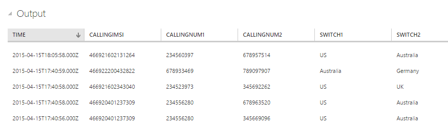

<properties
    pageTitle="Erste Schritte mit Stream Analytics: in Echtzeit Betrugsversuche | Microsoft Azure"
    description="Erfahren Sie, wie eine in Echtzeit Betrug Erkennung-Lösung mit Stream Analytics erstellen. Verwenden Sie einen Ereignis Hub für die Verarbeitung von Ereignissen in Echtzeit ein."
    keywords="Normalbetriebswerte, Betrugsversuche, Echtzeit Normalbetriebswerte"
    services="stream-analytics"
    documentationCenter=""
    authors="jeffstokes72"
    manager="jhubbard"
    editor="cgronlun" />

<tags
    ms.service="stream-analytics"
    ms.devlang="na"
    ms.topic="article"
    ms.tgt_pltfrm="na"
    ms.workload="data-services"
    ms.date="09/26/2016"
    ms.author="jeffstok" />

# Erste Schritte mit Azure Stream Analytics: in Echtzeit Betrugsversuche

Informationen Sie zum Erstellen einer End-to-End-Lösung für in Echtzeit Betrugsversuche mit Azure Stream Analytics. Binden Sie Ereignisse in einem Ereignis Azure-Hub ein, Schreiben Sie Stream Analytics-Abfragen zur Aggregation oder Warnung und senden Sie die Ergebnisse an eine Ausgabe Empfänger Einblick über Daten mit in Echtzeit Verarbeitung. Echtzeit Normalbetriebswerte für Telekommunikation fällt, aber die Methode Beispiel eignet sich für andere Typen von Betrugsversuche z. B. Kreditkarte oder Identität Diebstahl Szenarien gleichmäßig.

Stream Analytics ist eine vollständig verwaltete Dienst Tiefst-Wartezeit hoch verfügbare und skalierbare komplexe Ereignis Verarbeitung über streaming-Daten in der Cloud bereitstellen. Weitere Informationen finden Sie unter [Einführung in Azure Stream Analytics](stream-analytics-introduction.md).

## Szenario: Telekommunikation und SIM Betrugsversuche in Echtzeit

Einem Telekommunikationsunternehmen verfügt über eine große Datenmengen für eingehende Anrufe. Das Unternehmen muss sich aus den Daten, Folgendes:
* Vergleichen Sie diese Daten auf eine verwaltbare Menge, und erhalten Sie über die Zeit und Ländern / Regionen Einsichten über die Verwendung von Kunden.
* Erkennen Sie SIM Betrug (mehrere Anrufe aus der gleichen Identität ungefähr zur gleichen Zeit jedoch mit geografischen anderen Speicherorten stammen) in Echtzeit, sodass sie einfach nach dem Benachrichtigen von Kunden oder Dienst beendet reagieren können.

In kanonische es Internet der Dinge (IoT) Szenarien einer Tonne werden oder Sensor Datenseite generiert wird – und Kunden aggregieren sie oder über Bildschirmdarstellung auftreten in Echtzeit benachrichtigen möchten.

## Erforderliche Komponenten

- [TelcoGenerator.zip](http://download.microsoft.com/download/8/B/D/8BD50991-8D54-4F59-AB83-3354B69C8A7E/TelcoGenerator.zip) vom Microsoft Download Center herunterladen 
- Optional: Quellcode des Generators Ereignis aus [GitHub](https://github.com/Azure/azure-stream-analytics/tree/master/DataGenerators/TelcoGenerator)

## Erstellen einer Azure Ereignis Hubs Eingabe- und Consumer Gruppe

Die Anwendung Stichprobe Ereignisse generieren, und drücken Sie sie ein Ereignis Hub-Instanz für die Verarbeitung in Echtzeit. Service Bus Ereignis Hubs sind die bevorzugte Methode für das Ereignis Aufnahme für Stream Analytics, und Sie können weitere Informationen zum Ereignis Hubs in [Azure-Dienstbus Dokumentation](/documentation/services/service-bus/).

So erstellen Sie ein Ereignis-Hub

1.  Klicken Sie in der [Azure-Portal](https://manage.windowsazure.com/) auf **neu** > **App Services** > **Dienstbus** > **Ereignis Hub** > **Symbolleiste erstellen**. Geben Sie einen Namen, Region, und neuen oder vorhandenen Namespaces, um ein neues Ereignis Hub zu erstellen.  
2.  Als bewährte Methode sollten jedes Stream Analytics-Projekt aus einer einzelnen Ereignis Hub Consumer Gruppe lesen. Wir führt Sie durch den Vorgang des Erstellens eines Consumer Gruppe unten, und Sie können [Weitere Informationen zu Consumer Gruppen](https://msdn.microsoft.com/library/azure/dn836025.aspx). Zum Erstellen einer Gruppe Consumer navigieren Sie zu der neu erstellten Ereignis Hub und klicken Sie auf der Registerkarte **Consumer Gruppen** und dann klicken Sie auf **Erstellen** klicken Sie auf den unteren Rand der Seite, und geben Sie einen Namen für die Gruppe Consumer.
3.  Den Zugriff auf das Ereignis-Hub gewähren wir eine freigegebenen Zugriffsrichtlinie erstellt werden muss.  Klicken Sie auf der Registerkarte **Konfigurieren** Ihrer Hub Ereignis.
4.  Klicken Sie unter **Freigegebene-Richtlinien**erstellen Sie eine neue Richtlinie mit Berechtigungen **Verwalten** aus.

    

5.  Klicken Sie auf **Speichern** , am unteren Rand der Seite.
6.  Navigieren Sie zu dem **Dashboard** und **Verbindungsinformationen** am unteren Rand der Seite und klicken Sie dann auf Kopieren Sie, und speichern Sie die Verbindungsinformationen.

## Konfigurieren Sie und starten Sie Ereignis-Generator-Anwendung

Wir haben eine Clientanwendung bereitgestellt, die Stichprobe eingehenden Anruf Metadaten generiert und schieben Sie ihn an Verteiler Ereignis. Führen Sie die folgenden Schritte aus, um diese Anwendung einzurichten.  

1.  Laden Sie die [Datei TelcoGenerator.zip](http://download.microsoft.com/download/8/B/D/8BD50991-8D54-4F59-AB83-3354B69C8A7E/TelcoGenerator.zip). Entzippen Sie ihn dann in ein Verzeichnis ein.

    **Hinweis**: Windows blockiert möglicherweise die heruntergeladene Zip-Datei. Klicken Sie mit der rechten Maustaste auf die Datei, und wählen Sie Eigenschaften aus. Wenn die Meldung "Diese Datei von einem anderen Computer wurde und zum Schutz von diesem Computer möglicherweise blockiert." Aktivieren Sie das Feld "Blockierung aufheben", und klicken Sie auf Übernehmen, klicken Sie auf die Zip-Datei.

2.  Ersetzen Sie die Werte Microsoft.ServiceBus.ConnectionString und EventHubName in **telcodatagen.exe.config** mit Ihrem Ereignis Hub Verbindungszeichenfolge und den Namen ein.

    **Hinweis**: die Verbindungszeichenfolge, die von Azure Portals stellen den Namen der Verbindung am Ende kopiert haben. So entfernen Sie unbedingt die "; EntityPath =<value>"aus dem Schlüssel hinzufügen = Feld.

3.  Starten Sie die Anwendung. Die Verwendung sieht wie folgt aus:

   telcodatagen.exe [#NumCDRsPerHour] [SIM Karte Betrug Wahrscheinlichkeit] [#DurationHours]

Im folgende Beispiel wird 1000 Ereignisse mit einer Wahrscheinlichkeit 20 % von Betrug im Verlauf des 2 Stunden generieren.

    telcodatagen.exe 1000 .2 2

Datensätze, die an Ihre Ereignis Hub gesendet werden, werden angezeigt. Hier werden einige Schlüsselfelder, die wir diese in Echtzeit Betrug Erkennung Anwendung verwenden definiert:

| Datensatz | Definition |
| ------------- | ------------- |
| CallrecTime | Zeitstempel für den Anruf Startzeit an. |
| SwitchNum | Telefon wechseln verwendet, um den Anruf zu verbinden. |
| CallingNum | Telefonnummer des Anrufers. |
| CallingIMSI | Internationale mobilen Abonnenten Identität (IMSI).  Eindeutiger Bezeichner des Anrufers. |
| CalledNum | Telefonnummer des Empfängers Anruf. |
| CalledIMSI | Internationale mobilen Abonnenten Identität (IMSI).  Eindeutiger Bezeichner des Empfängers Anruf. |

## Stream Analytics Auftrag erstellen
Nun verfügen wir über einen Stream von Ereignissen Telekommunikation, können wir eine Aufgabe Stream Analytics eingerichtet, um diese Ereignisse in Echtzeit zu analysieren.

### Bereitstellen eines Auftrags Stream Analytics

1.  Klicken Sie in der Azure-Portal auf **Neu > Data Services > Stream Analytics > Symbolleiste erstellen**.
2.  Geben Sie die folgenden Werte ein, und klicken Sie dann auf **Erstellen Stream Analytics Position**:

    * **Auftragsname**: Geben Sie einen Namen für die Position.

    * **Region**: Markieren Sie den Bereich, in dem der Auftrag ausgeführt werden soll. Sollten Sie den Auftrag und dem Ereignis-Hub in der gleichen Region, um eine bessere Leistung zu gewährleisten und um sicherzustellen, dass Sie nicht zum Übertragen von Daten zwischen Regionen bezahlt werden.

    * **Speicher-Konto**: Wählen Sie das Azure-Speicher-Konto, das Sie verwenden, um Daten für alle Stream Analytics Aufträge innerhalb dieses Bereichs ausgeführt speichern möchten. Sie haben die Möglichkeit, wählen Sie ein vorhandenes Speicherkonto oder eine neue zu erstellen.

3.  Klicken Sie im linken Bereich auf die Liste der Aufträge Stream Analytics **Stream Analytics** auf.

    

4.  Die neue Position wird mit dem Status **erstellt**angezeigt. Beachten Sie, dass die Schaltfläche **Start** , klicken Sie auf den unteren Rand der Seite deaktiviert ist. Sie müssen den Auftrag Eingabe, Ausgabe und Abfrage konfigurieren, bevor Sie den Auftrag beginnen können.

### Geben Sie Auftrag Eingabe
1.  **Eingaben** vom oberen Rand der Seite klicken Sie in Ihrem Auftrag Stream Analytics auf, und klicken Sie dann auf **Eingabe hinzufügen**. Im daraufhin angezeigten Dialogfeld führt Sie durch eine Reihe von Schritte zum Einrichten Ihrer Eingabe.
2.  Wählen Sie **Datenstream**aus, und klicken Sie dann mit der rechten Maustaste auf.
3.  Wählen Sie **Ereignis-Hub**aus, und klicken Sie dann mit der rechten Maustaste auf ein.
4.  Geben Sie ein, oder wählen Sie auf der dritten Seite die folgenden Werte aus:

    * **Eingabe Alias**: Geben Sie einen Anzeigenamen für dieses Projekt aus, z. B. *CallStream*Eingabemethoden. Beachten Sie, dass Sie diese Namen in der Abfrage später verwenden möchten.
    * **Ereignis Hub**: ist das Ereignis Hub Sie erstellt im selben als den Auftrag Stream Analytics-Abonnement, wählen Sie den Namespace, die der Hub Ereignis ist.

    Ist der Ereignis-Hub in ein anderes Abonnement, wählen Sie **Ereignis-Hub aus einem anderen Abonnement verwenden** aus, und geben Sie Informationen für **Service Bus Namespace**, **Hub Name des Ereignisses**, **Ereignis Hub Richtlinienname**, **Ereignis Hub Richtlinienschlüssel**und **Ereignis Hub Partitionsanzahl**manuell ein.

    * **Name des Ereignisses Hub**: Wählen Sie den Namen des Ereignisses-Hub aus.

    * **Ereignis Hub Richtliniennamen**: Wählen Sie die Ereignis-Hub Richtlinie zuvor in diesem Lernprogramm erstellt haben.

    * **Ereignis Hub Consumer Gruppe**: Geben Sie den Consumer Gruppe zuvor in diesem Lernprogramm erstellt haben.
5.  Klicken Sie mit der rechten Maustaste auf.
6.  Geben Sie die folgenden Werte ein:

    * **Ereignis Serialisierungsprogramm Format**: JSON
    * **Codierung**: UTF8
7.  Klicken Sie auf die Schaltfläche Überprüfen, um diese Quelle hinzuzufügen oder zu überprüfen, ob Stream Analytics erfolgreich an das Ereignis Hub eine Verbindung herstellen können.

### Position-Abfrage angeben

Stream Analytics unterstützt ein Modell einfachen, deklarativen Abfrage für die Beschreibung für die Verarbeitung in Echtzeit Transformationen an. Erfahren Sie mehr über die Sprache, finden Sie unter den [Azure Stream Analytics Query Language Bezug](https://msdn.microsoft.com/library/dn834998.aspx). In diesem Lernprogramm hilft Ihnen verfassen und Testen mehrere Abfragen über Ihre in Echtzeit Stream Anruf Daten.

#### Optional: Beispieleingabedaten
Um die Abfrage gegen tatsächliche Position Daten zu überprüfen, können Sie das Feature **Beispieldaten** verwenden, um Ereignisse aus Ihrer Stream extrahieren und erstellen ein. JSON-Datei der Ereignisse zum Testen.  Die folgenden Schritte zeigen, wie Zweck und wir haben auch eine [telco.json](https://github.com/Azure/azure-stream-analytics/blob/master/Sample%20Data/telco.json) Beispieldatei zu Testzwecken bereitgestellt.

1.  Wählen Sie Ihre Eingaben Hub Ereignis aus, und klicken Sie auf **Beispieldaten** am unteren Rand der Seite.
2.  Geben Sie im Dialogfeld **Anfangszeit** zum Sammeln von Daten aus und eine **Dauer** für die verbleibenden weiteren Daten zur nutzen zu starten.
3.  Klicken Sie auf die Schaltfläche Überprüfen, um Stichproben von Daten aus der Eingabe beginnen.  Es dauert eine oder zwei Minuten für die Datendatei hergestellt werden soll.  Wenn der Vorgang abgeschlossen ist, klicken Sie auf **Details** und herunterladen und speichern Sie die. JSON-Datei, die generiert wird.

    

#### Pass-Through-Abfrage

Wenn Sie alle Ereignisse archivieren möchten, können Sie eine Pass-Through-Abfrage verwenden, alle Felder in der Nutzlast des Ereignisses oder Nachricht lesen. Führen Sie einer einfache Pass-Through-Abfrage als Einstieg diese Projekte alle Felder in einem Ereignis.

1.  Klicken Sie auf die **Abfrage** im oberen Bereich der Seite Stream Analytics Position.
2.  Fügen Sie den folgenden Code-Editor ein:

        SELECT * FROM CallStream

    > Stellen Sie sicher, dass der Name der Eingabewerte Quelle den Namen der Eingabe entspricht, die Sie zuvor angegeben haben.

3.  Klicken Sie auf **Testen** , klicken Sie unter den Abfrage-Editor.
4.  Angeben einer Testdatei, um eine, die Sie mit den vorherigen Schritten erstellt haben, oder verwenden Sie [telco.json](https://github.com/Azure/azure-stream-analytics/blob/master/Sample%20Data/telco.json).
5.  Klicken Sie auf die Schaltfläche Überprüfen und die Ergebnisse unterhalb der Abfragedefinition angezeigt wird.

    

### Spalte Projektion

Wir werden nun unten die zurückgegebenen Felder, die eine kleinere Menge vergleichen.

1.  Ändern Sie die Abfrage in den Code-Editor ein:

        SELECT CallRecTime, SwitchNum, CallingIMSI, CallingNum, CalledNum
        FROM CallStream

2.  Klicken Sie auf **erneut ausführen** , klicken Sie unter den Abfrage-Editor, um die Ergebnisse der Abfrage anzuzeigen.

    

### Anzahl der eingehende Anrufe nach Region: Tumbling Fenster mit Aggregation

Um die Menge vergleichen werden wir die eingehende Anrufe pro Region ein [TumblingWindow](https://msdn.microsoft.com/library/azure/dn835055.aspx) , um die Anzahl der eingehenden Anrufe, die gruppiert nach SwitchNum alle 5 Sekunden erhalten nutzen.

1.  Ändern Sie die Abfrage in den Code-Editor ein:

        SELECT System.Timestamp as WindowEnd, SwitchNum, COUNT(*) as CallCount
        FROM CallStream TIMESTAMP BY CallRecTime
        GROUP BY TUMBLINGWINDOW(s, 5), SwitchNum

    Diese Abfrage verwendet das Schlüsselwort **Zeitstempel durch** , um anzugeben, ein Timestamp-Feld in der Nutzlast, in die zeitliche Berechnung verwendet werden soll. In diesem Feld angegeben wurde, würde der Vorgang Windowing verwenden die Zeit, die jedes Ereignis von Ereignis Hub empfangen wurde ausgeführt werden. Finden Sie unter ["Ankunfts-Zeit im Vergleich mit einer Anwendung Time" in der Stream Analytics Abfrage Sprache verweisen](https://msdn.microsoft.com/library/azure/dn834998.aspx).

    Beachten Sie, dass Sie einen Zeitstempel für den unteren Rand jedes Fensters mithilfe der Eigenschaft **System.Timestamp** zugreifen können.

2.  Klicken Sie auf **erneut ausführen** , klicken Sie unter den Abfrage-Editor, um die Ergebnisse der Abfrage anzuzeigen.

    

### SIM Betrugsversuche mit eines Selbstjoins

Zum Identifizieren der potenziell gefälschten Verwendung werden für Anrufe, die mit den gleichen Benutzer aber an unterschiedlichen Standorten in weniger als 5 Sekunden Ursprung erläutert.  Wir [Verknüpfung](https://msdn.microsoft.com/library/azure/dn835026.aspx) Streams der Anruf Ereignisse, selbst in diesen Fällen überprüfen.

1.  Ändern Sie die Abfrage in den Code-Editor ein:

        SELECT System.Timestamp as Time, CS1.CallingIMSI, CS1.CallingNum as CallingNum1,
        CS2.CallingNum as CallingNum2, CS1.SwitchNum as Switch1, CS2.SwitchNum as Switch2
        FROM CallStream CS1 TIMESTAMP BY CallRecTime
        JOIN CallStream CS2 TIMESTAMP BY CallRecTime
        ON CS1.CallingIMSI = CS2.CallingIMSI
        AND DATEDIFF(ss, CS1, CS2) BETWEEN 1 AND 5
        WHERE CS1.SwitchNum != CS2.SwitchNum

2.  Klicken Sie auf **erneut ausführen** , klicken Sie unter den Abfrage-Editor, um die Ergebnisse der Abfrage anzuzeigen.

    

### Erstellen der Ausgabe Empfänger

Jetzt wir ein Streams von Ereignissen, ein Ereignis Hub Eingang auf Aufnahme Ereignisse und einer Abfrage ausführen eine Transformation über die Stream definiert haben besteht der letzte Schritt darin, Definieren einer Ausgabe Empfänger für das Projekt.  Wir werden Ereignisse für gefälschte Verhalten zu Blob-Speicher schreiben.

Gehen Sie folgendermaßen vor, um einen Container für Blob-Speicher zu erstellen, wenn Sie eine bereits besitzen.

1.  Verwenden ein vorhandenen Speicher-Kontos oder zum Erstellen eines neuen Kontos mit Speicher auf **Neu > DATA SERVICES > Speicher > schnellen Erstellen** und folgen die Anweisungen.
2.  Wählen Sie das Speicherkonto auf **Container** am oberen Rand der Seite, und klicken Sie dann auf **Hinzufügen**.
3.  Geben Sie einen **Namen** für den Container aus, und legen Sie seinen **Zugriff** auf Öffentliche Blob.

## Geben Sie die Position Ausgabe

1.  Klicken Sie in Ihrem Auftrag Stream Analytics auf **die Ausgabe** vom oberen Rand der Seite, und klicken Sie dann auf **Ausgabe hinzufügen**. Im daraufhin angezeigten Dialogfeld führt Sie durch eine Reihe von Schritte zum Einrichten der Ausgabe.
2.  Wählen Sie **BLOB-Speicher**aus, und klicken Sie dann mit der rechten Maustaste auf.
3.  Geben Sie ein, oder wählen Sie auf der dritten Seite die folgenden Werte aus:

    * **Die AUSGABEALIAS**: Geben Sie einen Anzeigenamen für diese Position Ausgabe.
    * **ABONNEMENTS**: ist der Blob-Speicher, die Sie erstellt haben im selben Abonnement als den Auftrag Stream Analytics, aktivieren Sie **Speicher-Konto aus aktuelle Abonnement verwenden**. Ist der Speicher in ein anderes Abonnement, wählen Sie **Speicher-Konto aus einem anderen Abonnement verwenden** und Manuelles Eingeben von Informationen für **Speicher-Konto**, **Speicher KONTOSCHLÜSSEL** **CONTAINER**.
    * **Speicher-Konto**: Wählen Sie den Namen des Speicherkontos.
    * **CONTAINER**: Wählen Sie den Namen des Containers aus.
    * **FILENAME Präfix**: Geben Sie ein Dateipräfix zum Schreiben von Blob-Ausgabe verwendet werden soll.

4.  Klicken Sie mit der rechten Maustaste auf.
5.  Geben Sie die folgenden Werte ein:

    * **Ereignis SERIALISIERUNGSPROGRAMM FORMAT**: JSON
    * **Codierung**: UTF8

6.  Klicken Sie auf die Schaltfläche Überprüfen, um diese Quelle hinzuzufügen oder zu überprüfen, ob Stream Analytics eine Verbindung mit dem Speicherkonto herstellen können.

## Auftrag für Echtzeit Verarbeitung starten

Da eine Position Eingabe, Abfrage- oder Ausgabe alle angegeben wurden, können wir den Auftrag Stream Analytics für in Echtzeit Betrugsversuche beginnen.

1.  Klicken Sie aus den Auftrag **DASHBOARD**auf **START** , am unteren Rand der Seite.
2.  Wählen Sie im Dialogfeld, das angezeigt wird **Auftrag ANFANGSZEIT** , und klicken Sie dann auf die Schaltfläche "Überprüfen" am unteren Rand des Dialogfelds. Der Status wird ändert sich in die **Felder starten** und in Kürze **ausgeführt**.

## Ansicht Betrug Erkennung Ausgabe

Verwenden eines Tools wie [Azure-Speicher-Explorer](https://azurestorageexplorer.codeplex.com/) oder [Azure Explorer](http://www.cerebrata.com/products/azure-explorer/introduction) gefälschte Ereignisse anzeigen, wie sie in der Ausgabe in Echtzeit geschrieben werden.  

## Anfordern von Unterstützung
Versuchen Sie für weitere Unterstützung zu erhalten unseren [Azure Stream Analytics-Forum](https://social.msdn.microsoft.com/Forums/en-US/home?forum=AzureStreamAnalytics).

## Nächste Schritte

- [Einführung in Azure Stream Analytics](stream-analytics-introduction.md)
- [Erste Schritte mit Azure Stream Analytics](stream-analytics-get-started.md)
- [Skalieren Sie Azure Stream Analytics Aufträge](stream-analytics-scale-jobs.md)
- [Azure Stream Analytics Query Language Bezug](https://msdn.microsoft.com/library/azure/dn834998.aspx)
- [Azure Stream Analytics Management REST-API-Referenz](https://msdn.microsoft.com/library/azure/dn835031.aspx)
