<properties
    pageTitle="Grüße Analyse mithilfe von Azure Stream Analytics und Azure maschinellen Learning | Microsoft Azure"
    description="So verwenden Sie eine benutzerdefinierte Funktion und Computer-Schulung in einem Stream Analytics Auftrag"
    keywords=""
    documentationCenter=""
    services="stream-analytics"
    authors="jeffstokes72"
    manager="jhubbard"
    editor="cgronlun"
/>


<tags 
    ms.service="stream-analytics" 
    ms.devlang="na" 
    ms.topic="article" 
    ms.tgt_pltfrm="na" 
    ms.workload="data-services" 
    ms.date="10/04/2016" 
    ms.author="jeffstok"
/>

# <a name="sentiment-analysis-by-using-azure-stream-analytics-and-azure-machine-learning"></a>Grüße Analyse mithilfe von Azure Stream Analytics und Azure-Computer-Schulung #

Dieser Artikel soll Sie schnell eine einfache Azure Stream Analytics Aufgabe, mit Azure maschinellen Learning-Integration eingerichtet helfen. Wir werden mithilfe eines Grüße Analytics maschinellen Learning-Modells aus dem Katalog der Cortana Intelligence streaming Textdaten analysieren und ermitteln die Stimmung Ausdrücken Punktzahl in Echtzeit. Die Informationen in diesem Artikel helfen Ihnen Szenarien wie in Echtzeit Grüße Analytics Streaming Twitter-Daten vertraut, Datensätze der Kunden Chats mit Supportmitarbeiter analysieren und Auswerten von Kommentaren auf Foren, Blogs und Videos, sowie viele andere in Echtzeit, Vorhersagen Punktzahl Szenarien.

Dieser Artikel bietet eine CSV-Beispieldatei mit Text als Eingabe in Azure Blob-Speicher, die in der folgenden Abbildung gezeigt. Der Auftrag wendet Grüße Analytics Modell als eine benutzerdefinierte Funktion (UDFs) auf den Text Beispieldaten aus dem Blob-Speicher. Das Ergebnis wird in der gleichen Blob-Speicher in einer anderen CSV-Datei platziert. 

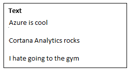  

Die folgende Abbildung zeigt diese Konfiguration. Für eine weitere realistischen Szenario können Sie die Blob-Speicher mit streaming Twitter-Daten aus Azure Ereignis Hubs Eingabe ersetzen. Darüber hinaus könnten Sie eine Visualisierung [Microsoft Power BI](https://powerbi.microsoft.com/) in Echtzeit, der die Absicht aggregieren erstellen.    

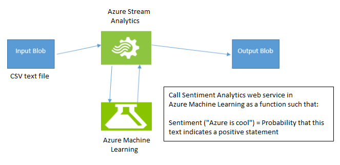  

## <a name="prerequisites"></a>Erforderliche Komponenten

Die erforderlichen Komponenten zum Ausführen der Aufgaben, die in diesem Artikel erläutert werden werden wie folgt aus:

-   Ein aktives Azure-Abonnement.
-   Eine CSV-Datei mit einigen Daten darin. Können Sie die Datei in der Abbildung 1 von [GitHub](https://github.com/Azure/azure-stream-analytics/blob/master/Sample Data/sampleinput.csv)herunterladen, oder Sie können eine eigene Datei erstellen. In diesem Artikel wird davon ausgegangen, dass Sie das Schema bereitgestellten zum Download auf GitHub verwenden.

Auf hoher Ebene werden zum Ausführen der Aufgaben, die in diesem Artikel veranschaulicht Sie die folgenden Aktionen ausführen:

1.  Hochladen einer CSV-Datei zu Azure Blob-Speicher.
2.  Der Arbeitsbereich Azure maschinellen Learning ein Gefühl Analytics-Modell aus dem Katalog der Cortana Intelligence hinzufügen.
3.  Bereitstellen dieses Modell als Webdienst im Arbeitsbereich Learning Computer an.
4.  Erstellen eines Streams Analytics Auftrags, das dieser Webdienst aufgerufen wird als eine Funktion, Grüße für die Texteingabe zu bestimmen.
5.  Starten Sie den Auftrag Stream Analytics und beobachten Sie die Ausgabe.

## <a name="upload-the-csv-input-file-to-blob-storage"></a>Hochladen der Eingabewerte CSV-Datei in Blob-Speicher

Für diesen Schritt können Sie eine CSV-Datei, wie eine bereits festgelegte zum Download auf GitHub zur Verfügung. Sie können [Azure-Speicher-Explorer](http://storageexplorer.com/) oder Visual Studio verwenden, um die Datei hochzuladen oder benutzerdefinierten Code können. Wir verwenden Beispiele basierend auf Visual Studio.

1.  Klicken Sie in Visual Studio auf **Azure** > **Speicher** > **Externspeicher anfügen**. Geben Sie einen **Kontonamen** und **Kontoschlüssel**ein.  

    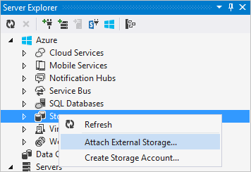  

2.  Erweitern Sie die Speicherung, die Sie in Schritt 1 angefügt, klicken Sie auf **Blob-Container erstellen**, und geben Sie dann einen logischen Namen. Nachdem Sie den Container erstellen, öffnen Sie darauf, um ihren Inhalt anzuzeigen. (Es wird zu diesem Zeitpunkt leer).  

    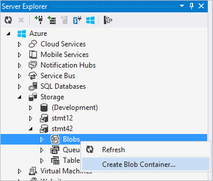  

3.  Wenn Sie die CSV-Datei hochladen möchten, klicken Sie auf **Hochladen Blob**, und klicken Sie dann auf **die Datei von der lokalen Festplatte**.  

## <a name="add-the-sentiment-analytics-model-from-the-cortana-intelligence-gallery"></a>Hinzufügen des Grüße Analytics-Modells aus dem Cortana Intelligence-Katalog

1.  Herunterladen der [Vorhersage Grüße Analytics-Modell](https://gallery.cortanaintelligence.com/Experiment/Predictive-Mini-Twitter-sentiment-analysis-Experiment-1) aus dem Katalog der Cortana Intelligence an.  
2.  Klicken Sie in Computer Learning Studio auf **in Studio geöffnet**.  

    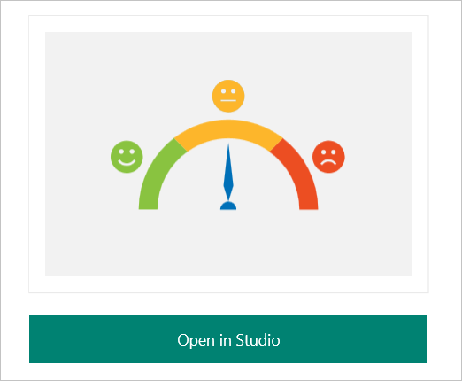  

3.  Melden Sie sich, um zu dem Arbeitsbereich zu wechseln. Wählen Sie den Speicherort, der Ihren eigenen Standort am besten passt.
4.  Klicken Sie auf **Ausführen** , am unteren Rand der Seite.  
5.  Nachdem der Vorgang erfolgreich ausgeführt wird, klicken Sie auf **Webdienst bereitstellen**.
6.  Grüße Analytics Modell ist einsatzbereit. Um zu überprüfen, klicken Sie auf die Schaltfläche **Testen** und Bereitstellen von Texteingabe, wie "Microsoft großartig." Der Test sollte ein Ergebnis ähnlich wie der folgende zurück:

`'Predictive Mini Twitter sentiment analysis Experiment' test returned ["4","0.715057671070099"]...`  

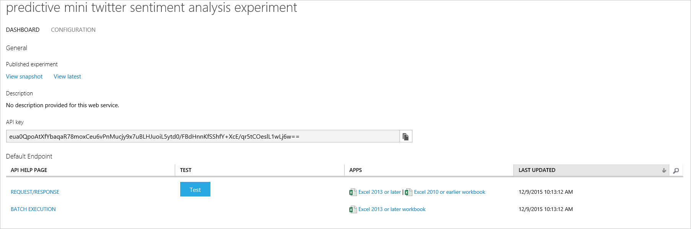  

Klicken Sie in der Spalte **Apps** auf den Link für **Excel 2010 oder einer früheren Arbeitsmappe** den Key API abzurufenden und die URL, die Sie später benötigen, um die Aufgabe Stream Analytics einzurichten. (Dieser Schritt ist nur für ein Modell für maschinelle Lernen aus einem anderen Konto Azure-Arbeitsbereich verwenden erforderlich. In diesem Artikel wird vorausgesetzt, dass dies der Fall, dieses Szenario behoben ist.)  

Beachten Sie die Web Service URL und Access-Taste aus der heruntergeladenen Excel-Datei aus, wie unten dargestellt:  

  

## <a name="create-a-stream-analytics-job-that-uses-the-machine-learning-model"></a>Erstellen Sie einen Stream Analytics Auftrag, der das Computer Learning verwendet

1.  Wechseln Sie zum [Azure-Portal](https://manage.windowsazure.com)an.  
2.  Klicken Sie auf **neue** > **Data Services** > **Stream Analytics** > **schnell zu erstellen**. Geben Sie einen Namen für den Job unter **Auftrag**, geben Sie die entsprechende Region für das Projekt in der **Region**, und wählen Sie das Konto in den **Regionalen Überwachung Speicher-Konto**.    
3.  Klicken Sie auf **Hinzufügen einer Eingabesprache**, nachdem Sie der Auftrag erstellt wurde, klicken Sie auf der Registerkarte **Eingaben** .  

    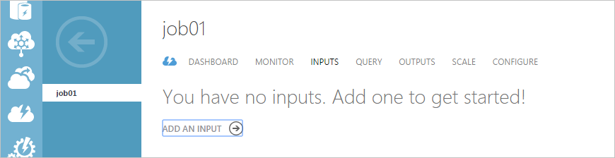  

4.  Klicken Sie auf der ersten Seite des Assistenten **Eingabesprache hinzufügen** klicken Sie auf **Datenstream**, und klicken Sie dann auf **Weiter**. Klicken Sie auf der nächsten Seite klicken Sie auf **Blob-Speicher** als Eingabe, und klicken Sie dann auf **Weiter**.  
5.  Geben Sie auf der Seite des Assistenten **BLOB-Speicher Einstellungen** Speicher Blob Container den Namen des Kontos, den Sie zuvor definiert, wenn Sie die Daten geladen. Klicken Sie auf **Weiter**. Klicken Sie auf **Ereignis das Format** **CSV**. Akzeptieren Sie die Standardwerte für den Rest der Seite **Serialisierungseinstellungen** . Klicken Sie auf **OK**.  
6.  Klicken Sie auf der Registerkarte **Ausgaben** **Hinzufügen ein Ergebnis**aus.  

      

7.  Klicken Sie auf **Blob-Speicher**, und geben Sie die gleichen Parameter, eine Ausnahme bilden jedoch die Container. Der Wert für die **Eingabe** wurde von den Container mit dem Namen "Test" gelesen wird, in dem die **CSV-** Datei hochgeladen wurde konfiguriert. Geben Sie für die **Ausgabe**"Testoutput" ein. Containernamen dürfen nicht übereinstimmen. Stellen Sie sicher, dass diese Container vorhanden ist.     
8.  Klicken Sie auf **Weiter** , um zu Ausgabe der **Serialisierungseinstellungen**konfigurieren. Klicken Sie auf **CSV**wie bei der **Eingabe**, und klicken Sie dann auf die Schaltfläche **OK** .
9.  Klicken Sie auf der Registerkarte **Funktionen** auf **Hinzufügen einer Computer-Learning-Funktion**.  

    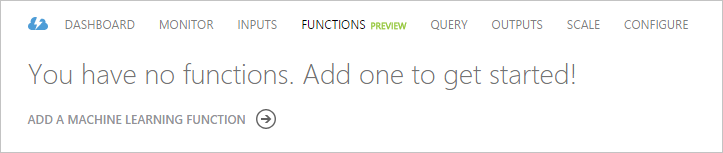  

10. Suchen Sie auf der Seite **Learning Web Service Computereinstellungen** der Computer Learning Arbeitsbereich, Webdienst und Standardendpunkt aus. Wenden Sie die Einstellungen manuell, damit die Grundlagen der Arbeit mit einen Webdienst für alle Arbeitsbereich, konfigurieren, solange Sie die URL kennen, und die Taste API haben in diesem Artikel. Geben Sie den Endpunkt- **URL** und **API-Taste**. Klicken Sie auf **OK**.    

    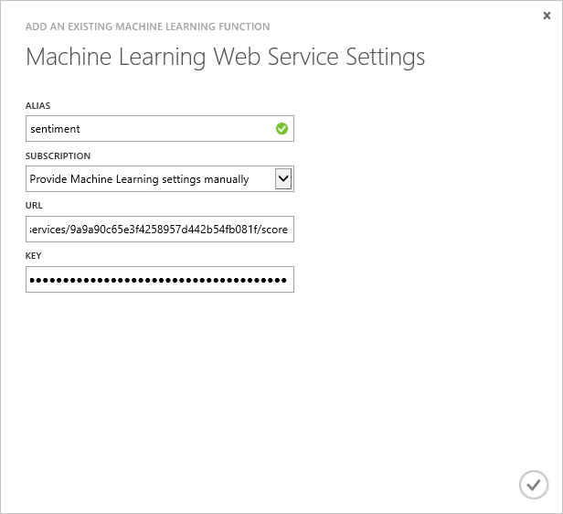    

11. Klicken Sie auf die Registerkarte **Abfrage** ändern Sie die Abfrage wie folgt:    

 ```
    WITH subquery AS (  
        SELECT text, sentiment(text) as result from input  
    )  
 
    Select text, result.[Scored Labels]  
    Into output  
    From subquery  
 ```    
12. Klicken Sie auf **Speichern** , um die Abfrage zu speichern.

## <a name="start-the-stream-analytics-job-and-observe-the-output"></a>Starten Sie den Auftrag Stream Analytics und beobachten Sie die Ausgabe

1.  Klicken Sie auf **Start** , am unteren Rand der Seite Position.
2.  Klicken Sie im **Dialogfeld der Abfrage beginnen**klicken Sie auf **Benutzerdefinierte Zeit**, und wählen Sie eine Uhrzeit vor dem beim Hochladen des CSV in Blob-Speicher. Klicken Sie auf **OK**.  

    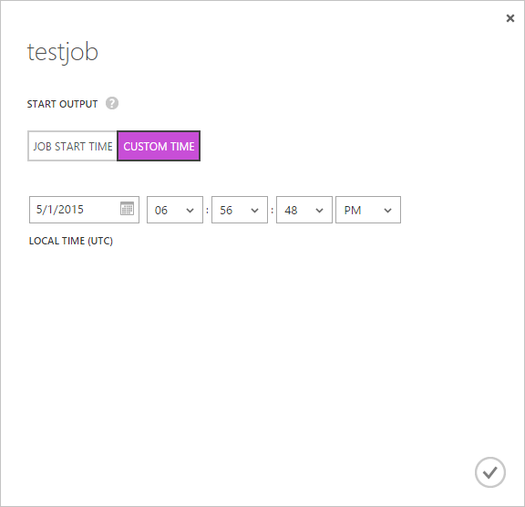  

3.  Wechseln Sie zu der Blob-Speicher, mithilfe des Tools, die Sie mit einer CSV-Datei, z. B. Visual Studio hochladen.
4.  Einige Minuten, nachdem Sie der Auftrag gestartet wird, wird der Ausgabe Container erstellt und eine CSV-Datei geladen.  
5.  Öffnen Sie die Datei im Standard-CSV-Editor ein. Ähnlich wie folgt angezeigt werden sollen:  

    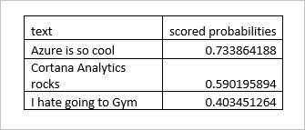  

## <a name="conclusion"></a>Abschluss

Dieser Artikel beschreibt, wie einen Stream Analytics Auftrag erstellt, der streaming Textdaten liest und die Daten in Echtzeit Grüße Analytics gilt. All dies können Sie erreichen, ohne zur Komplexität der Erstellung eines Grüße Analytics-Modells kümmern. Dies ist einer der Vorteile der Cortana Intelligence-Suite.

Sie können auch Azure maschinellen Learning-Funktion-bezogene Kennzahlen anzeigen. Klicken Sie hierzu auf die Registerkarte **Monitor** . Drei Funktion Zusammenhang Kennzahlen werden angezeigt.  

- **Funktion Anfragen** gibt die Anzahl der Anfragen an einen Computer Learning Webdienst gesendet an.  
- **Funktion Ereignisse** gibt die Anzahl der Ereignisse in der Besprechungsanfrage an. Standardmäßig enthält jede Anforderung an einen Computer Learning Webdienst bis zu 1.000 Ereignisse an.  
- **Fehlerhaften Funktion Anforderungen** gibt die Anzahl der Fehler beim Anfragen an den Computer Learning-Webdienst an.  

    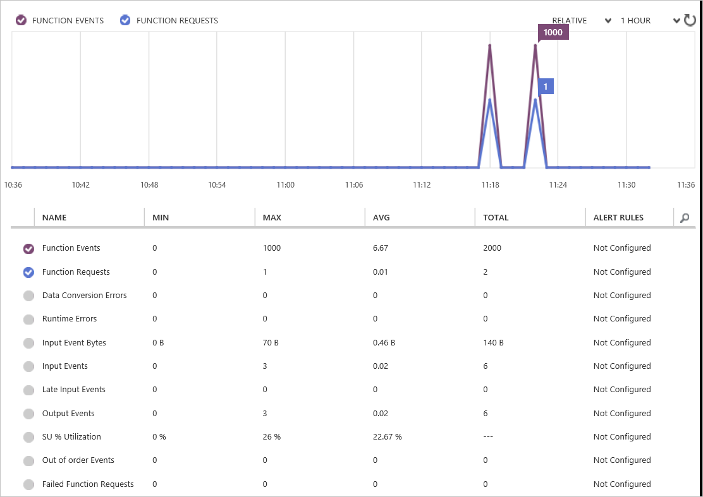  
