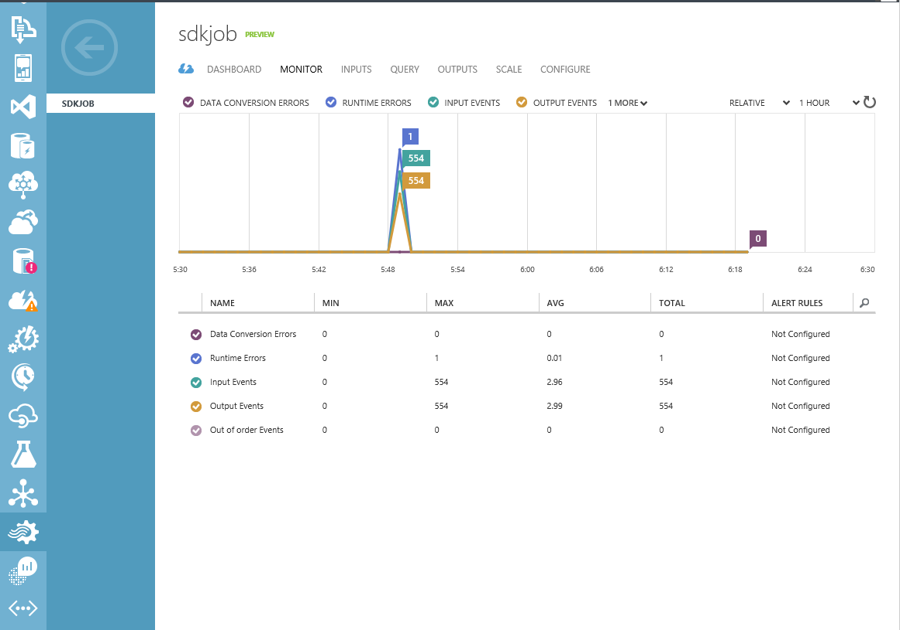

<properties
    pageTitle="Überwachen programmgesteuert Aufträge auf Stream Analytics | Microsoft Azure"
    description="Informationen Sie zum programmgesteuert über REST-APIs, Azure SDK oder Powershell erstellten Stream Analytics-Aufträge zu überwachen."
    keywords=".NET Monitor, Position Monitor, Überwachung app"
    services="stream-analytics"
    documentationCenter=""
    authors="jeffstokes72"
    manager="jhubbard"
    editor="cgronlun"/>

<tags
    ms.service="stream-analytics"
    ms.devlang="na"
    ms.topic="article"
    ms.tgt_pltfrm="na"
    ms.workload="data-services"
    ms.date="09/26/2016"
    ms.author="jeffstok"/>


# <a name="programmatically-create-a-stream-analytics-job-monitor"></a>Erstellen Sie einen Stream Analytics Auftrag Monitor programmgesteuert
 Dieser Artikel beschreibt, wie Sie für ein Projekt Stream Analytics Überwachung aktivieren. Stream Analytics, die über die REST-APIs, Azure SDK oder Powershell erstellten Aufträge können nicht für die Überwachung standardmäßig aktiviert haben.  Sie können manuell dies Azure-Portal durch Aktivieren des Projekts Monitor Seite navigieren und durch Klicken auf die Schaltfläche aktivieren oder Sie können diesen Prozess automatisieren, indem Sie die Schritte in diesem Artikel. Die überwachen Daten werden auf der Registerkarte "Monitor" im Azure-Portal für den Job Stream Analytics angezeigt.



## <a name="prerequisites"></a>Erforderliche Komponenten
Vorbemerkung in diesem Artikel müssen Sie Folgendes:

- Visual Studio 2012 oder 2013.
- Herunterladen und Installieren von [Azure.NET SDK](https://azure.microsoft.com/downloads/).
- Einen vorhandenen Stream Analytics Auftrag, die für die Überwachung aktiviert.

## <a name="setup-a-project"></a>Einrichten eines Projekts

1.  Erstellen Sie eine Visual Studio c# .net.
2.  In der Paket-Manager-Konsole, führen Sie die folgenden Befehle, die NuGet-Pakete zu installieren. Die erste Azure Stream Analytics Management .NET SDK ist. Der zweite ist der Azure Monitor SDK die Überwachung aktivieren verwendet wird. Die letzte ist Azure-Active Directory-Client, der für die Authentifizierung verwendet wird.

    ```
    Install-Package Microsoft.Azure.Management.StreamAnalytics
    Install-Package Microsoft.Azure.Insights -Pre
    Install-Package Microsoft.IdentityModel.Clients.ActiveDirectory
    ```

3.  Fügen Sie den folgenden AppSettings Abschnitt, um die App.

    ```
    <appSettings>
        <!--CSM Prod related values-->
        <add key="ResourceGroupName" value="RESOURCE GROUP NAME" />
        <add key="JobName" value="YOUR JOB NAME" />
        <add key="StorageAccountName" value="YOUR STORAGE ACCOUNT"/>
        <add key="ActiveDirectoryEndpoint" value="https://login.windows.net/" />
        <add key="ResourceManagerEndpoint" value="https://management.azure.com/" />
        <add key="WindowsManagementUri" value="https://management.core.windows.net/" />
        <add key="AsaClientId" value="1950a258-227b-4e31-a9cf-717495945fc2" />
        <add key="RedirectUri" value="urn:ietf:wg:oauth:2.0:oob" />
        <add key="SubscriptionId" value="YOUR AZURE SUBSCRIPTION ID" />
        <add key="ActiveDirectoryTenantId" value="YOUR TENANT ID" />
    </appSettings>
    ```
Ersetzen von Werten für *SubscriptionId* und *ActiveDirectoryTenantId* mit Ihrem Azure-Abonnement und Mandanten IDs. Sie können diese Werte erhalten, indem Sie das folgende PowerShell-Cmdlet ausführen:

    ```
    Get-AzureAccount
    ```
4.  Fügen Sie den folgenden Anweisungen zur Quelldatei (Program.cs) im Projekt verwenden.

    ```
        using System;
        using System.Configuration;
        using System.Threading;
        using Microsoft.Azure;
        using Microsoft.Azure.Management.Insights;
        using Microsoft.Azure.Management.Insights.Models;
        using Microsoft.Azure.Management.StreamAnalytics;
        using Microsoft.Azure.Management.StreamAnalytics.Models;
        using Microsoft.IdentityModel.Clients.ActiveDirectory;
    ```
5.  Fügen Sie eine Helper Authentifizierungsmethode hinzu.

        public static string GetAuthorizationHeader()
            {
                AuthenticationResult result = null;
                var thread = new Thread(() =>
                {
                    try
                    {
                        var context = new AuthenticationContext(
                            ConfigurationManager.AppSettings["ActiveDirectoryEndpoint"] +
                            ConfigurationManager.AppSettings["ActiveDirectoryTenantId"]);

                        result = context.AcquireToken(
                            resource: ConfigurationManager.AppSettings["WindowsManagementUri"],
                            clientId: ConfigurationManager.AppSettings["AsaClientId"],
                            redirectUri: new Uri(ConfigurationManager.AppSettings["RedirectUri"]),
                            promptBehavior: PromptBehavior.Always);
                    }
                    catch (Exception threadEx)
                    {
                        Console.WriteLine(threadEx.Message);
                    }
                });

                thread.SetApartmentState(ApartmentState.STA);
                thread.Name = "AcquireTokenThread";
                thread.Start();
                thread.Join();

                if (result != null)
                {
                    return result.AccessToken;
                }

                throw new InvalidOperationException("Failed to acquire token");
        }

## <a name="create-management-clients"></a>Erstellen von Management-Clients
Im folgende Code wird die notwendigen Variablen und Management-Clients einrichten.

    string resourceGroupName = "<YOUR AZURE RESOURCE GROUP NAME>";
    string streamAnalyticsJobName = "<YOUR STREAM ANALYTICS JOB NAME>";

    // Get authentication token
    TokenCloudCredentials aadTokenCredentials =
        new TokenCloudCredentials(
            ConfigurationManager.AppSettings["SubscriptionId"],
            GetAuthorizationHeader());

    Uri resourceManagerUri = new
    Uri(ConfigurationManager.AppSettings["ResourceManagerEndpoint"]);

    // Create Stream Analytics and Insights management client
    StreamAnalyticsManagementClient streamAnalyticsClient = new
    StreamAnalyticsManagementClient(aadTokenCredentials, resourceManagerUri);
    InsightsManagementClient insightsClient = new
    InsightsManagementClient(aadTokenCredentials, resourceManagerUri);

## <a name="enable-monitoring-for-an-existing-stream-analytics-job"></a>Aktivieren Sie die Überwachung für einen vorhandenen Stream Analytics Auftrag

Im folgende Code wird für einen **vorhandenen** Stream Analytics Auftrag Überwachung aktivieren. Im erste Teil des Codes führt eine GET-Anforderung für den Dienst Stream Analytics zum Abrufen von Informationen über das entsprechende Stream Analytics-Projekt aus. Es verwendet die Eigenschaft "Id" (aus dem GET-Anforderung abgerufen) als Parameter für die Methode sich in der zweiten Hälfte des Codes der sendet eine sich an den Dienst Einsichten anfordern, für das Projekt Stream Analytics Überwachung aktivieren.

> [AZURE.WARNING]
> Wenn Sie zuvor aktiviert haben, um eine andere Stream Analytics Stelle über das Azure-Portal oder programmgesteuert über die Überwachung der unter Code, **Es wird empfohlen, dass Sie den gleichen Speicher Kontonamen bereitstellen, die Sie zuvor die Überwachung aktiviert haben.**
>
> Das Speicherkonto verknüpft ist in den Bereich, der Sie Ihr Projekt Stream Analytics im Feld erstellt, insbesondere nicht zu den Auftrag selbst.
>
> Alle Stream Analytics Position (und alle anderen Azure Ressourcen) in diesem Bereich derselben Freigeben dieses Speicherkonto, um die Überwachung Daten zu speichern. Wenn Sie ein Speicherkonto für die verschiedenen bereitzustellen, führt dies möglicherweise unbeabsichtigte Seite Effekte Ihrer anderen Stream Analytics Einzelvorgänge und/oder andere Azure Ressourcen überwachen.
>
> Den Namen des Speicher-Kontos zum Ersetzen verwendet ```“<YOUR STORAGE ACCOUNT NAME>”``` unten sollten ein Speicherkonto, das im selben Abonnement ist, wie Sie den Auftrag der Stream Analytics sind für die Überwachung aktivieren.

    // Get an existing Stream Analytics job
    JobGetParameters jobGetParameters = new JobGetParameters()
    {
        PropertiesToExpand = "inputs,transformation,outputs"
    };
    JobGetResponse jobGetResponse = streamAnalyticsClient.StreamingJobs.Get(resourceGroupName, streamAnalyticsJobName, jobGetParameters);

    // Enable monitoring
    ServiceDiagnosticSettingsPutParameters insightPutParameters = new ServiceDiagnosticSettingsPutParameters()
    {
            Properties = new ServiceDiagnosticSettings()
            {
                StorageAccountName = "<YOUR STORAGE ACCOUNT NAME>"
            }
    };
    insightsClient.ServiceDiagnosticSettingsOperations.Put(jobGetResponse.Job.Id, insightPutParameters);


## <a name="get-support"></a>Anfordern von Unterstützung
Versuchen Sie für weitere Unterstützung zu erhalten unseren [Azure Stream Analytics-Forum](https://social.msdn.microsoft.com/Forums/en-US/home?forum=AzureStreamAnalytics).


## <a name="next-steps"></a>Nächste Schritte

- [Einführung in Azure Stream Analytics](stream-analytics-introduction.md)
- [Erste Schritte mit Azure Stream Analytics](stream-analytics-get-started.md)
- [Skalieren Sie Azure Stream Analytics Aufträge](stream-analytics-scale-jobs.md)
- [Azure Stream Analytics Query Language Bezug](https://msdn.microsoft.com/library/azure/dn834998.aspx)
- [Azure Stream Analytics Management REST-API-Referenz](https://msdn.microsoft.com/library/azure/dn835031.aspx)
