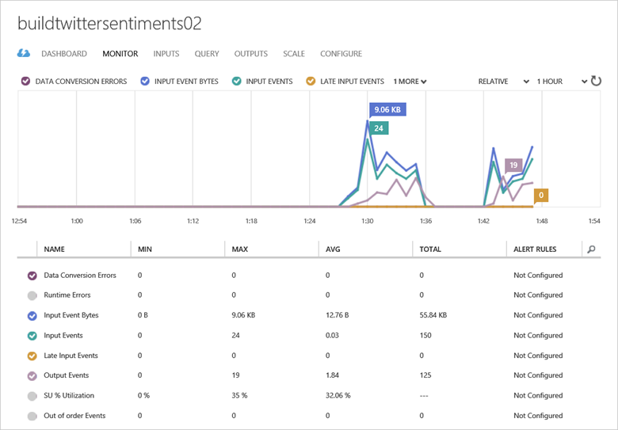
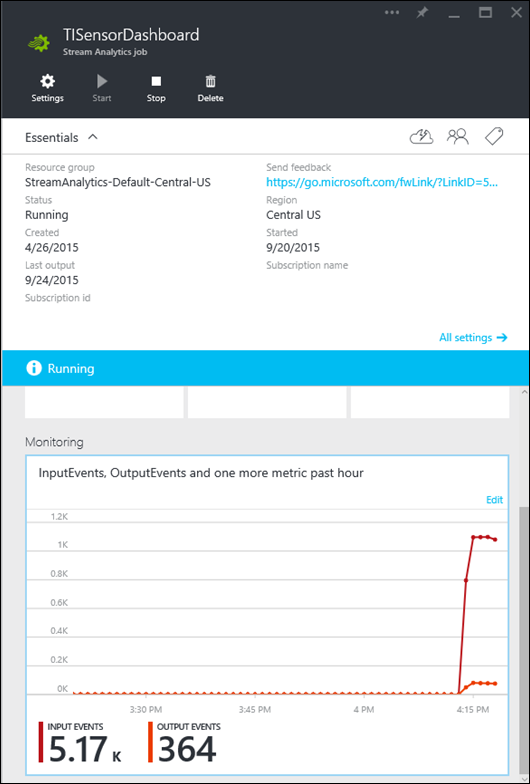
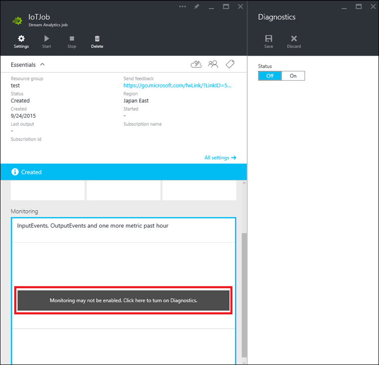
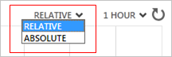
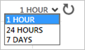
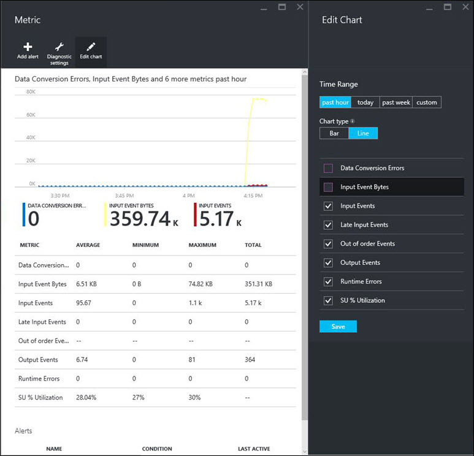
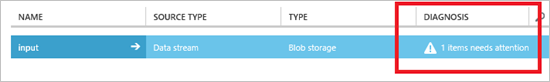
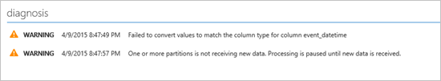

<properties 
    pageTitle="Grundlegendes zu Stream Analytics Auftrag Überwachung | Microsoft Azure" 
    description="Grundlegendes zu Stream Analytics Position für die Überwachung" 
    keywords="Überwachen der Abfrage"
    services="stream-analytics" 
    documentationCenter="" 
    authors="jeffstokes72" 
    manager="jhubbard" 
    editor="cgronlun"/>

<tags 
    ms.service="stream-analytics" 
    ms.devlang="na" 
    ms.topic="article" 
    ms.tgt_pltfrm="na" 
    ms.workload="data-services" 
    ms.date="09/26/2016" 
    ms.author="jeffstok"/>

# Grundlegendes zu Stream Analytics Auftrag Überwachung und zum Überwachen der Abfragen

## Einführung: Die Seite monitor

Der Azure-Verwaltungsportal und Azure-Portal bereitstellen Key Performance-Werte, die zum Überwachen und Behandeln von Problemen mit der Leistung Abfrage- und Auftrag verwendet werden können. 

Klicken Sie im Azure-Verwaltungsportal auf auf der Registerkarte **Monitor** eines laufenden Stream Analytics Auftrags diese Kennzahlen angezeigt. Es gibt eine Verzögerung von höchstens 1 Minute in der Performance-Werte in die Seite Monitor angezeigt.  

    

Navigieren Sie im Azure-Portal zu den Auftrag Stream Analytics, den Sie Anzeige Kennzahlen zur interessiert sind, und Lesen Sie den Abschnitt **Überwachung** .  

    

Das erste Mal, das ein Stream Analytics Auftrag, in einem Bereich erstellt wurde, müssen Sie so konfigurieren Sie die Diagnose für die Region. Hierzu wird auf eine beliebige Stelle im Abschnitt **Überwachung** und der **Diagnose** Blade angezeigt. Hier können Sie die Diagnose aktivieren, und geben Sie ein Speicherkonto zur Überwachung von Daten.  

    

## Kennzahlen für Stream Analytics verfügbar

| Metrisch | Definition |
|--------|-------------|
| SU % Auslastung | Die Nutzung in den / die Streaming, die auf der Registerkarte Skalierung des Projekts mit einem Projekt zugeordnet werden. Sollte dieses Indikator erreichen 80 % oder obigen hoher Wahrscheinlichkeit, dass die Verarbeitung von Ereignissen verzögert werden kann oder nicht mehr Fortschritte vorhanden ist. |
| Von Ereignissen | Nach dem Projekt Stream Analytics im Anzahl von Ereignissen empfangene Datenmenge. Dies kann verwendet werden, um zu überprüfen, dass Ereignisse mit der Datenquelle gesendet werden. |
| Die Ausgabe Ereignisse | Durch den Auftrag Stream Analytics an die Zielwebsite Ausgabe in Anzahl von Ereignissen gesendeten Datenmenge. |
| Außerhalb der Reihenfolge von Ereignissen | Anzahl der Ereignisse empfangen wurden, die gelöscht oder eine angepasste Zeitstempel, basierend auf der Veranstaltung Sortierung Richtlinie angegeben wurden. Dies kann durch die Konfiguration der Einstellung außerhalb der Reihenfolge Fehlertoleranz Fenster beeinträchtigt werden. |
| Datenkonvertierungsfehler | Anzahl der Datenkonvertierungsfehler eines Auftrags Stream Analytics entstandenen. |
| Laufzeitfehler | Anzahl der Fehler, die während der Ausführung eines Auftrags Stream Analytics ausgeführt werden. |
| Verspätete von Ereignissen | Anzahl von Ereignissen Spätestes aus der Quelle der entweder gelöscht worden sein oder deren Timestamp empfangen wurde korrigiert, basierend auf der Konfiguration Ereignis Sortierung Richtlinie der verspäteten Ankunfts-Fehlertoleranz Fenster Einstellung. |

## Überwachung im Verwaltungsportal Azure anpassen ##

Bis zu 6 Kennzahlen können in einem Diagramm angezeigt werden.

Wählen Sie zum Umschalten zwischen der Anzeige Verhältnis zwischen dem Wert (Endwert nur für jede Metrisch) und Absolute Werte (y-Achse angezeigt), relativen oder absoluten am oberen Rand des Diagramms ein.

    

Kennzahlen können im Diagramm Monitor in Aggregationen von 1 Stunde, 12 Stunden, 24 Stunden oder sieben Tage angezeigt werden.

Wählen Sie zum Ändern des Zeitraums Diagramm zeigt die Kennzahlen, 1 Stunde, 24 Stunden oder sieben Tage am oberen Rand des Diagramms.

    

Sie können Regeln festlegen, die Sie per e-Mail benachrichtigen können, für den Fall, dass Sie der Auftrag einen bestimmten Schwellenwert überschreitet. 

## Anpassen der Überwachung der Azure-Portal ##

Können Sie den Typ des Diagramms, Kennzahlen zu sehen ist, anpassen und Anzeigedauer Bereich in den Einstellungen Diagramm bearbeiten. Weitere Informationen finden Sie unter [Überwachung anpassen](../monitoring-and-diagnostics/insights-how-to-customize-monitoring.md).

    

## Projektstatus

Der Status des Streams Analytics Einzelvorgänge kann in der klassischen Azure-Portal angezeigt werden, in dem Sie eine Liste der Aufträge angezeigt. Sie können die Liste der Aufträge anzeigen, indem Sie auf das Symbol Stream Analytics im klassischen Azure-Portal.

| Status | Definition |
|--------|------------|
| Erstellt | Ein Projekt erstellt wurde, jedoch nicht gestartet wurde. |
| Starten | Ein Benutzer, die beim Start den Auftrag geklickt haben, und der Auftrag wird gestartet. |
| Ausführen | Verarbeiten von Eingaben oder warten auf Eingabe zu verarbeiten wird, die Position zugewiesen. Wenn das Projekt einen aktiven Zustand ohne Ausgabe auftreten angezeigt wird, ist es wahrscheinlich, dass das Zeitfenster Datenverarbeitung umfangreich ist oder ob die Abfragelogik kompliziert ist. Ein weiterer Grund möglicherweise, dass es keine derzeit keine Daten an den Auftrag gesendet werden. |
| Beenden | Ein Benutzer, die auf die Option zum Beenden den Auftrag geklickt haben, und Beenden des Auftrags. |
| Beendet | Der Auftrag wurde beendet. |
| Heruntergestuft | Dieser Status zeigt an, dass ein Stream Analytics Auftrag vorübergehende Fehler vorliegt (für ex. Fehler bei der Eingabe/Ausgabe, Verarbeitungsfehler, Fehler bei der Konvertierung usw.). Der Auftrag wird weiterhin ausgeführt, doch stehen viele Fehler generiert wird. Dieses Projekt erfordert die Aufmerksamkeit des Kunden, und der Kunden die Vorgänge Protokolle für die Fehler angezeigt werden. |
| Fehler beim | Dies zeigt an, dass der Auftrag ist aufgrund von Fehlern fehlgeschlagen, und die Verarbeitung beendet hat. Der Kunde muss in die Protokolle der Vorgänge suchen, um den Fehler zu debuggen. |
| Löschen | Dies zeigt an, dass das Projekt gelöscht wird. |

## Diagnose

Im Verwaltungsportal Azure enthält das Position Dashboard Informationen auf die Stelle, an der Sie müssen zur Überprüfung, für die Diagnose, d. h. Eingaben, gibt und/oder die Vorgänge melden Sie sich an. Sie können auf den Link, um den entsprechenden Speicherort für die Diagnose eigenständig zu wechseln klicken.

    

Indem Sie auf die Eingabe- oder Ressource bietet detaillierten Diagnoseinformationen. Dies ist mit den neuesten Informationen der Diagnose aktualisiert, während der Auftrag ausgeführt wird.

    

## Anfordern von Hilfe
Für weitere Unterstützung zu erhalten versuchen Sie es unsere [Azure Stream Analytics-forum](https://social.msdn.microsoft.com/Forums/en-US/home?forum=AzureStreamAnalytics)

## Nächste Schritte

- [Einführung in Azure Stream Analytics](stream-analytics-introduction.md)
- [Erste Schritte mit Azure Stream Analytics](stream-analytics-get-started.md)
- [Skalieren Sie Azure Stream Analytics Aufträge](stream-analytics-scale-jobs.md)
- [Azure Stream Analytics Query Language Bezug](https://msdn.microsoft.com/library/azure/dn834998.aspx)
- [Azure Stream Analytics Management REST-API-Referenz](https://msdn.microsoft.com/library/azure/dn835031.aspx)
