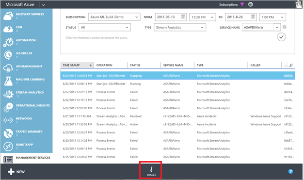
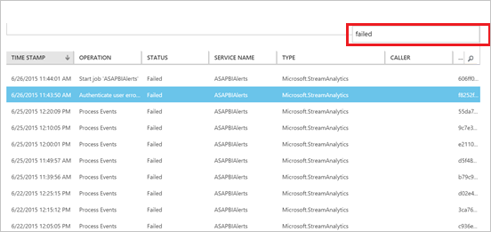

<properties 
    pageTitle="Vorgang mit Debuggen und Dienstprotokolle in Stream Analytics | Microsoft Azure" 
    description="Verwenden von unterstützenden Stream Analytics Vorgang Protokolle" 
    keywords="von Dienstprotokollen"
    services="stream-analytics" 
    documentationCenter="" 
    authors="jeffstokes72" 
    manager="jhubbard" 
    editor="cgronlun"/>

<tags 
    ms.service="stream-analytics" 
    ms.devlang="na" 
    ms.topic="article" 
    ms.tgt_pltfrm="na" 
    ms.workload="data-services" 
    ms.date="09/26/2016" 
    ms.author="jeffstok"/>

# Debuggen Sie Stream Analytics-Aufträge mithilfe von Dienst und Betrieb von Protokollen

Alle Azure Dienste angeben Betrieb Protokollierungsnachrichten an Benutzer Datensatzdetails im Zusammenhang mit Management-Vorgänge. Diese Informationen können verwendet werden, für das Debuggen z. B. Anzeigen des Projektstatus, des Projektstatus, Azure Stream Analytics und Fehlermeldungen zu einer Position im Laufe der Zeit von überwachen Verarbeitung zur Ausgabe beginnen.

## Suchen nach Vorgang im Verwaltungsportal Azure Protokolle

Vorgang Protokolle können Sie auf zwei Arten zugreifen:  

- Dashboard des Streams Analytics Auftrags  
- Management Services im klassischen Azure-Portal  

## Dashboard des Streams Analytics Auftrags

Klicken Sie auf die Position des Dashboard-Registerkarte wird eine Verknüpfung zu den entsprechenden Protokollen eines Auftrags Stream Analytics angezeigt. Wenn Sie auf diesen Link klicken, wird der Filter so festlegen, dass sie die neuesten Protokolle für diesen Auftrag zeigt.

    

## Management Services

Manuell zu den Vorgang Protokolle für Stream Analytics und andere Dienste im klassischen Azure-Portal navigieren:

1.  Klicken Sie auf **Management Services** im [klassischen Azure-Portal](https://manage.windowsazure.com).
2.  Wählen Sie **Stream Analytics** für **Typ** und den Namen des Projekts für **Service Name**aus.  

    

## Suchen der Überwachungsprotokolle Azure-Portal ##

Um Betrieb Protokolle für den Job Stream Analytics Azure-Portal zu finden, klicken Sie auf **Durchsuchen** , und wählen Sie dann **Überwachungsprotokolle**.

    

Dadurch wird eine Blade Anzeigen von Ereignissen aus der letzten 7 Tage für alle Ressourcen in Ihrem Abonnement geöffnet.  Sie können filtern, um Ereignisse eines Typs angeben oder Zeitrahmens anzuzeigen, indem Sie auf den Befehl **Filtern** .

    

## Hier erhalten Sie log

Sie können nach Zeitraums und Status zum Anzeigen der Protokolle für den Job filtern.

Klicken Sie im Azure-Verwaltungsportal auf die Schaltfläche " **Details** " am Fuß des Fensters, um weitere Details zu einem ausgewählten Ereignis anzeigen. 

    

Klicken Sie im Azure-Portal auf einen Eintrag in die darin enthaltenen detaillierte Ereignisse finden Sie unter.

    

Hier können Sie das **Details** Blade öffnen, indem Sie auf das Ereignis.

    

## Einen fehlerhaften Auftrag Debuggen

Klicken Sie im Azure-Verwaltungsportal auf das Symbol suchen und Typ 'failed'. Dies ergibt aller Protokolle mit Fehlern. 

    

Im Azure-Portal können Sie nach Ebene der Nachricht anzeigen **kritisch** Ereignisse filtern.

    

Sie können wählen Sie eine der Fehler aus, und klicken Sie auf die **Details** für Weitere Informationen zu diesem Fehler auf.  Einige Fehlermeldungen enthalten auch Informationen zum Beheben des Problems. 

    

Für den Fall, dass Sie sich an den [Support](https://azure.microsoft.com/support/options/) oder Informationen an das Team über das [Forum im MSDN](https://social.msdn.microsoft.com/Forums/en-US/home?forum=AzureStreamAnalytics)müssen, beachten Sie die Details des Vorgangs, insbesondere hat die **Korrelations-ID**. 

## Anfordern von Hilfe
Für weitere Unterstützung zu erhalten versuchen Sie es unsere [Azure Stream Analytics-forum](https://social.msdn.microsoft.com/Forums/en-US/home?forum=AzureStreamAnalytics)

## Nächste Schritte

- [Einführung in Azure Stream Analytics](stream-analytics-introduction.md)
- [Erste Schritte mit Azure Stream Analytics](stream-analytics-get-started.md)
- [Skalieren Sie Azure Stream Analytics Aufträge](stream-analytics-scale-jobs.md)
- [Azure Stream Analytics Query Language Bezug](https://msdn.microsoft.com/library/azure/dn834998.aspx)
- [Azure Stream Analytics Management REST-API-Referenz](https://msdn.microsoft.com/library/azure/dn835031.aspx)
