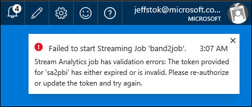
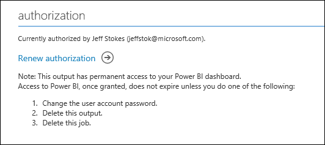
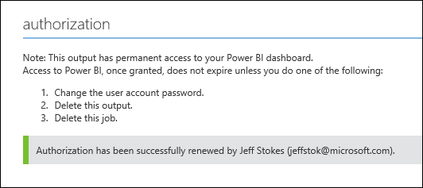

<properties
    pageTitle="Power BI-Dashboard auf Stream Analytics | Microsoft Azure"
    description="Verwenden Sie ein in Echtzeit streaming Power BI-Dashboard, um Business Intelligence sammeln und Analysieren von großer Datenmengen aus einem Stream Analytics Auftrag."
    keywords="Analytics Dashboard in Echtzeit dashboard"
    services="stream-analytics"
    documentationCenter=""
    authors="jeffstokes72"
    manager="jhubbard"
    editor="cgronlun"/>

<tags
    ms.service="stream-analytics"
    ms.devlang="na"
    ms.topic="article"
    ms.tgt_pltfrm="na"
    ms.workload="data-services"
    ms.date="09/26/2016"
    ms.author="jeffstok"/>

#  Übertragen Sie Analytics und Power BI: ein Dashboard in Echtzeit Analytics für streaming-Daten

Azure Stream Analytics können Sie eine der führende Business Intelligence-Tools Microsoft Power BI nutzen. Erfahren Sie, wie mit Azure Stream Analytics um umfangreicher, Daten und Get die Einblicke in einem in Echtzeit Power BI Analytics Dashboard streaming zu analysieren.

Verwenden Sie [Microsoft Power BI](https://powerbi.com/) um zu einem aktuellen Dashboard schnell zu erstellen. [In diesem Video der Praxis](https://www.youtube.com/watch?v=SGUpT-a99MA).

In diesem Artikel erfahren Sie, wie mit Power BI als Ausgabe für Ihre Azure Stream Analytics Aufträge Erstellen eigener benutzerdefinierter Business Intelligence-Tools und ein Dashboard in Echtzeit nutzen.

## Erforderliche Komponenten

* Microsoft Azure-Konto
* Eingabe für den Auftrag Stream Analytics, streaming Daten von verwenden. Stream Analytics akzeptiert Eingaben von Azure Ereignis Hubs oder Azure Blob-Speicher.  
* Geschäftlichen oder schulnotizbücher Konto für Power BI

## Erstellen von Azure Stream Analytics Position

[Klassische Azure-Portal](https://manage.windowsazure.com)klicken Sie auf **neu, Datendiensten, Stream Analytics, schnellen Erstellen**.

Geben Sie einen der folgenden Werte, klicken Sie dann auf **Erstellen Stream Analytics Position**:

* **Position Name** - Geben Sie einen Namen für die Position. Beispielsweise **DeviceTemperatures**.
* **Region** - wählen Sie den Bereich, in dem der Auftrag gespeichert werden soll. Sollten Sie den Auftrag und dem Ereignis Hub in derselben Region optimale Leistung zu gewährleisten und zu vermeiden, Daten durchstellen Kosten zwischen Regionen anfallen.
* **Speicher-Konto** - auswählen des Kontos, Speicher, die Sie verwenden, um Daten für alle Stream Analytics Aufträge innerhalb dieses Bereichs ausgeführt speichern möchten. Sie haben die Möglichkeit, ein vorhandenes Speicherkonto auswählen oder einen neuen erstellen.

Klicken Sie im linken Bereich auf die Liste der Aufträge Stream Analytics **Stream Analytics** auf.

![graphic1][graphic1]

> [AZURE.TIP] Das neue Projekt wird mit dem Status **Nicht gestartet**aufgeführt. Beachten Sie, dass die Schaltfläche **Start** , klicken Sie auf den unteren Rand der Seite deaktiviert ist. Dies ist die erwartet, wie Sie konfigurieren müssen Auftrag Eingabe, Ausgabe und Abfrage usw., bevor Sie den Auftrag zu starten.

## Geben Sie Auftrag Eingabe

In diesem Lernprogramm wird davon ausgegangen, dass Sie als Eingabe mit JSON-Serialisierung und UTF-8-Codierung Ereignis Hub verwenden.

* Klicken Sie auf den Namen der Position.
* Klicken Sie auf **Eingaben** vom oberen Rand der Seite, und klicken Sie dann auf **Eingabe hinzufügen**. Das Dialogfeld, das geöffnet wird, werden Sie durch eine Reihe von Schritte zum Einrichten Ihrer Eingabe geführt.
*   Wählen Sie **Datenstream**aus, und klicken Sie dann mit der rechten Maustaste auf.
*   Wählen Sie **Ereignis-Hub**aus, und klicken Sie dann mit der rechten Maustaste auf ein.
*   Geben Sie ein, oder wählen Sie auf der dritten Seite die folgenden Werte aus:
  * **Eingabe Alias** - Geben Sie einen Anzeigenamen für dieses Projekt Eingabemethoden. Beachten Sie, dass Sie diese Namen in der Abfrage höher verwenden möchten.
  * **Ereignis Hub** – Wenn Sie für das Ereignis Hub erstellt haben ist im selben Abonnement als Stream Analytics-vornehmen, wählen den Namespace, dem der Hub Ereignis ist.
*   Ist der Ereignis-Hub in ein anderes Abonnement, wählen Sie **Ereignis-Hub aus einem anderen Abonnement verwenden** aus, und geben Sie Informationen für **Service Bus Namespace**, **Hub Name des Ereignisses**, **Ereignis Hub Richtlinienname**, **Ereignis Hub Richtlinienschlüssel**und **Ereignis Hub Partitionsanzahl**manuell ein.

> [AZURE.NOTE]  In diesem Beispiel wird die Standardanzahl von Partitionen, welche ist 16 verwendet.

* **Name des Ereignisses Hub** - wählen Sie den Namen der Azure Ereignis Hub stehen Ihnen.
* **Ereignis Hub Richtliniennamen** - wählen Sie die Richtlinie Ereignis Hub für den Ereignis-Hub, die Sie verwenden. Stellen Sie sicher, dass diese Richtlinie weist Berechtigungen verwalten.
*   **Ereignis Hub Consumer Gruppe** – können Sie dieses leer lassen oder geben Sie eine Consumer Gruppe auf Ihrem Hub Ereignis stehen Ihnen. Beachten Sie, dass jede Gruppe Consumer, der ein Ereignis Hub jeweils nur 5 Leser kann. Ja, entscheiden Sie entsprechend der richtigen Consumer Gruppe für Ihre Arbeit. Wenn Sie das Feld leer lassen, wird die Consumer Standardgruppe verwendet.

*   Klicken Sie mit der rechten Maustaste auf.
*   Geben Sie die folgenden Werte ein:
  * **Ereignis Serialisierungsprogramm Format** : JSON
  * **Codierung** - UTF8
*   Klicken Sie auf die Schaltfläche Überprüfen, um diese Quelle hinzuzufügen oder zu überprüfen, ob Stream Analytics erfolgreich an das Ereignis Hub eine Verbindung herstellen können.

## Power BI-Ausgabe hinzufügen

1.  Klicken Sie auf **die Ausgabe** vom oberen Rand der Seite, und klicken Sie dann auf **Ausgabe hinzufügen**. Sie sehen, dass Power BI als Ausgabeoption aufgeführt.

    ![graphic2][graphic2]  

2.  Wählen Sie **Power BI** aus, und klicken Sie dann mit der rechten Maustaste auf.
3.  Sie werden einen Bildschirm wie folgt angezeigt:

    ![graphic3][graphic3]  

4.  Geben Sie in diesem Schritt ein Konto geschäftlichen oder schulnotizbücher für die Ausgabe der Stream Analytics Position ein. Wenn Sie bereits über Power BI-Konto verfügen, wählen Sie **Jetzt zu autorisieren**. Wenn dies nicht der Fall ist, wählen Sie **Jetzt registrieren**aus. [Hier ist ein guter Blog durchgehen Details der Power BI-Anmeldung](http://blogs.technet.com/b/powerbisupport/archive/2015/02/06/power-bi-sign-up-walkthrough.aspx).

    ![graphic11][graphic11]  

5.  Als Nächstes wird einen Bildschirm ähnlich der folgenden angezeigt:

    ![graphic4][graphic4]  

Geben Sie die Werte wie folgt:

* **Die Ausgabealias** – kann jeder Ausgabealias, der auf verweisen auf einfache Weise erstellt werden. Diese Ausgabealias ist besonders hilfreich, wenn Sie sich entscheiden, dass mehrere Ausgaben für Ihre Arbeit. In diesem Fall müssen Sie diese Ausgabe in Ihrer Abfrage verweisen. Verwenden Sie den Alias Ausgabewert beispielsweise uns = "OutPbi".
* **Name der Dataset** - Geben Sie einen Dataset an, die Ihrer Power BI ausgeben haben sollen. Lassen Sie uns beispielsweise "Pbidemo" verwenden.
*   **Tabellenname** - einen Tabellennamen unter Dataset von der Power BI-Ausgabe enthalten. Angenommen, wir "Pbidemo" aufrufen. Power BI-Ausgabe von Stream Analytics Aufträge möglicherweise derzeit nur eine Tabelle in einem Dataset.
*   **Arbeitsbereich** – Auswählen eines Arbeitsbereichs in Ihrem Power BI-Mandanten, unter dem das Dataset erstellt wird.

>   [AZURE.NOTE] Sie sollten nicht explizit dieses Dataset und die Tabelle in der Power BI-Konto erstellen. Sie werden automatisch erstellt werden, wenn Sie Ihre Arbeit Stream Analytics starten und der Auftrag entsprechend Ausgabe in Power BI beginnt. Wenn Ihre Abfrage Auftrag Ergebnisse zurückgegeben wird nicht, werden das Dataset und die Tabelle nicht erstellt werden.

*   Klicken Sie auf **OK**, **Verbindung testen** und die Konfiguration jetzt Sie ausgeben abgeschlossen ist.

>   [AZURE.WARNING] Beachten Sie auch, wenn auf Power BI bereits ein Dataset und die Tabelle mit demselben Namen wie die, die Ihnen bei dieser Stream Analytics Stelle erteilt wurde, die vorhandenen Daten überschrieben werden.

## Schreiben Sie die Abfrage

Wechseln Sie zur Registerkarte **Abfrage** des Projekts. Schreiben Sie Ihre Abfrage, von denen die Ausgabe der Ihrer Power BI werden sollen. Beispielsweise könnte es ungefähr wie die folgende SQL-Abfrage:

    SELECT
        MAX(hmdt) AS hmdt,
        MAX(temp) AS temp,
        System.TimeStamp AS time,
        dspl
    INTO
        OutPBI
    FROM
        Input TIMESTAMP BY time
    GROUP BY
        TUMBLINGWINDOW(ss,1),
        dspl

Starten Sie Ihre Position ein. Überprüfen Sie, ob Ihre Hub Ereignis von Ereignissen Empfang ist und Ihre Abfrage die erwarteten Ergebnisse generiert. Wenn Ihre Abfrage 0 Zeilen ausgegeben wird, werden Power BI-Dataset und Tabellen nicht automatisch erstellt.

## Erstellen von Dashboards in Power BI

Wechseln Sie zu [Powerbi.com](https://powerbi.com) und melden Sie sich mit Ihrem Konto geschäftlichen oder schulnotizbücher. Wenn die Stream Analytics Auftrag Abfrage Ergebnisse Ausgänge, sehen Sie sich, dass das Dataset bereits erstellt wurde:

![graphic5][graphic5]

Zum Erstellen von Dashboards, fahren Sie mit der Option Dashboards, und erstellen Sie ein neues Dashboard.

![graphic6][graphic6]

In diesem Beispiel wir die Bezeichnung wird es "Demo Dashboard".

Klicken Sie jetzt auf das Dataset erstellte Ihre Arbeit Stream Analytics (Pbidemo im aktuellen Beispiel). Zum Erstellen eines Diagramms auf dieses Dataset werden Sie zu einer Seite geleitet. Im folgenden finden Sie jedoch ein Beispiel für die Berichte, die Sie erstellen können:

Wählen Sie Σ Temp und Anzeigedauer Felder. Sie werden automatisch in den Wert und die Achse für das Diagramm wechseln:

![graphic7][graphic7]

Mit dieser Option werden automatisch ein Diagramm wie folgt angezeigt:

![graphic8][graphic8]

Klicken Sie im Abschnitt Wert klicken Sie auf die Dropdownliste nach unten für Temp und **durchschnittliche** Temperatur und im Diagramm wählen Sie aus, klicken Sie auf die **Visualisierung** auf ein, und wählen Sie **Liniendiagramm**:

![graphic9][graphic9]

Sie erhalten nun ein Liniendiagramm mit Mittelwert über einen Zeitraum.  Die Pin-Option wie folgt verwenden, können Sie diese an Ihr Dashboard anheften, die Sie zuvor erstellt haben:

![graphic10][graphic10]

Jetzt Wenn Sie das Dashboard mit diesem angeheftete Bericht anzeigen, sehen Sie Bericht in Echtzeit aktualisieren. Testen möchten, die Daten in Ihrer Ereignisse – Sammlung Temp oder etwas zu ändern, und Sie werden das Verhalten in Echtzeit, die in Ihr Dashboard widergespiegelt angezeigt.

Beachten Sie, dass dieses Lernprogramms zum Erstellen gezeigt aber eine Art des Diagramms für ein Dataset. Power BI helfen Ihnen die anderen Kunden Business Intelligence-Tools für Ihre Organisation zu erstellen. Für ein weiteres Beispiel für ein Power BI-Dashboard Video wird die [Erste Schritte mit Power BI](https://youtu.be/L-Z_6P56aas?t=1m58s) .

Weitere Informationen zum Konfigurieren einer Power BI-Ausgabe und Power BI-Gruppen nutzen überprüfen Sie im [Abschnitt Power BI](stream-analytics-define-outputs.md#power-bi) [Grundlegendes zu Stream Analytics gibt](stream-analytics-define-outputs.md "Grundlegendes zu Stream Analytics gibt"). Eine andere nützliche Ressource Weitere Informationen zum Erstellen von Dashboards mit Power BI ist [Dashboards in Power BI](https://powerbi.microsoft.com/documentation/powerbi-service-dashboards/).

## Einschränkungen und best practices

Power BI beschäftigt sowohl Parallelität und Durchsatz Einschränkungen an, wie hier beschrieben: [https://powerbi.microsoft.com/pricing](https://powerbi.microsoft.com/pricing "Power BI Preise")

Da die kommt Power BI selbst die am häufigsten in Fällen, wo Azure Stream Analytics eine große Datenmengen laden Verringerung unterstützt.
Es wird empfohlen, TumblingWindow oder HoppingWindow verwenden, um sicherzustellen, dass Daten Pushbenachrichtigungen höchstens 1 Pushbenachrichtigungen/Sekunde wäre und Ihrer Abfrage innerhalb der Durchsatz Anforderungen kommt – Sie die folgende Gleichung verwenden können, um den Wert, um die Steuerung Ihres Fensters in Sekunden zu berechnen:

  

Als Beispiel – wenn 1.000 Geräte Senden von Daten pro Sekunde stehen Ihnen, Sie sind auf dem Power BI Pro SKU, die unterstützt 1.000.000 Zeilen/Stunde und Mittelwert Daten pro Gerät auf Power BI abrufen möchten möglich höchstens einer Pushbenachrichtigungen alle 4 Sekunden pro Gerät (siehe unten):  

  

Was bedeutet, dass wir die ursprüngliche Abfrage zu ändern möchten:

    SELECT
        MAX(hmdt) AS hmdt,
        MAX(temp) AS temp,
        System.TimeStamp AS time,
        dspl
    INTO
        OutPBI
    FROM
        Input TIMESTAMP BY time
    GROUP BY
        TUMBLINGWINDOW(ss,4),
        dspl

### PowerBI Ansicht aktualisieren

Eine häufige gestellte Frage ist "Warum dem Dashboard in PowerBI AutoUpdate nicht?".

Um dies zu erreichen, F & A in PowerBI zu nutzen und eine Frage wie "Maximalwert nach Timestamp heute darin Temp" und die Kachel zum Dashboard anheften.

### Autorisierung erneuern

Sie müssen Ihr Konto Power BI erneut authentifizieren, wenn das Kennwort geändert hat, da Ihre Position der letzten Authentifizierung oder erstellt wurde. Wenn mehrstufige Authentifizierung (MFA) auf Ihrem Mandanten Azure Active Directory (AAD) konfiguriert ist, müssen Sie auch Power BI-Autorisierung alle 2 Wochen erneuern. Ein auftretendes Problem dieses Problems ist keine Ausgabe Position und ein "authentifizieren Benutzerfehler" in den Vorgang Protokollen auf:

![graphic12][graphic12]

Auf ähnliche Weise ein Auftrags versucht, sich anzumelden, während das Token abgelaufen ist, wird ein Fehler auftreten und Auftrag starten schlägt fehl. Der Fehler sieht grundsätzlich wie unter:

 
 

Um dieses Problem zu beheben, beenden Sie Ihre laufenden Auftrag, und wechseln Sie zu Ihrer Power BI-Ausgabe.  Klicken Sie auf den Link "Erneuern Autorisierung" und starten Sie Ihre Aufgabe ab dem letzten beendet Zeitpunkt zur Vermeidung von Datenverlust.

 

Sobald die Autorisierung mit Power BI aktualisiert wird, wird eine grüne Warnung im Bereich Autorisierung angezeigt:

 

## Anfordern von Hilfe
Für weitere Unterstützung zu erhalten versuchen Sie es unsere [Azure Stream Analytics-forum](https://social.msdn.microsoft.com/Forums/en-US/home?forum=AzureStreamAnalytics)

## Nächste Schritte

- [Einführung in Azure Stream Analytics](stream-analytics-introduction.md)
- [Erste Schritte mit Azure Stream Analytics](stream-analytics-get-started.md)
- [Skalieren Sie Azure Stream Analytics Aufträge](stream-analytics-scale-jobs.md)
- [Azure Stream Analytics Query Language Bezug](https://msdn.microsoft.com/library/azure/dn834998.aspx)
- [Azure Stream Analytics Management REST-API-Referenz](https://msdn.microsoft.com/library/azure/dn835031.aspx)

[graphic1]: ./media/stream-analytics-power-bi-dashboard/1-stream-analytics-power-bi-dashboard.png
[graphic2]: ./media/stream-analytics-power-bi-dashboard/2-stream-analytics-power-bi-dashboard.png
[graphic3]: ./media/stream-analytics-power-bi-dashboard/3-stream-analytics-power-bi-dashboard.png
[graphic4]: ./media/stream-analytics-power-bi-dashboard/4-stream-analytics-power-bi-dashboard.png
[graphic5]: ./media/stream-analytics-power-bi-dashboard/5-stream-analytics-power-bi-dashboard.png
[graphic6]: ./media/stream-analytics-power-bi-dashboard/6-stream-analytics-power-bi-dashboard.png
[graphic7]: ./media/stream-analytics-power-bi-dashboard/7-stream-analytics-power-bi-dashboard.png
[graphic8]: ./media/stream-analytics-power-bi-dashboard/8-stream-analytics-power-bi-dashboard.png
[graphic9]: ./media/stream-analytics-power-bi-dashboard/9-stream-analytics-power-bi-dashboard.png
[graphic10]: ./media/stream-analytics-power-bi-dashboard/10-stream-analytics-power-bi-dashboard.png
[graphic11]: ./media/stream-analytics-power-bi-dashboard/11-stream-analytics-power-bi-dashboard.png
[graphic12]: ./media/stream-analytics-power-bi-dashboard/12-stream-analytics-power-bi-dashboard.png
[graphic13]: ./media/stream-analytics-power-bi-dashboard/13-stream-analytics-power-bi-dashboard.png
