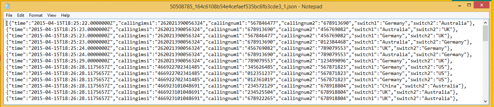

<properties
    pageTitle="Stream Analytics: In Echtzeit Betrugsversuche | Microsoft Azure"
    description="Erfahren Sie, wie eine in Echtzeit Betrug Erkennung-Lösung mit Stream Analytics erstellen. Verwenden Sie einen Ereignis Hub für die Verarbeitung von Ereignissen in Echtzeit ein."
    keywords="Normalbetriebswerte, Betrugsversuche, Echtzeit Normalbetriebswerte"
    services="stream-analytics"
    documentationCenter=""
    authors="jeffstokes72"
    manager="jhubbard"
    editor="cgronlun" />

<tags
    ms.service="stream-analytics"
    ms.devlang="na"
    ms.topic="article"
    ms.tgt_pltfrm="na"
    ms.workload="data-services"
    ms.date="09/26/2016"
    ms.author="jeffstok" />

# Erste Schritte mit Azure Stream Analytics: in Echtzeit Betrugsversuche

Informationen Sie zum Erstellen einer End-to-End-Lösung für in Echtzeit Betrugsversuche mit Azure Stream Analytics. Binden Sie Ereignisse in Azure Ereignis Hubs ein, Schreiben Sie Stream Analytics-Abfragen zur Aggregation oder Warnung, und senden Sie die Ergebnisse an eine Ausgabe Empfänger, der über Daten mit in Echtzeit Verarbeitung Einsichten zu erhalten. In Echtzeit Normalbetriebswerte für Telekommunikation wird erklärt, aber die Methode Beispiel eignet sich für andere Typen von Betrugsversuche z. B. Kreditkarte oder Identität Diebstahl Szenarien gleichmäßig.

Stream Analytics ist eine vollständig verwaltete-Dienst, der Low-Wartezeit, hoch verfügbare, skalierbare und komplexe Ereignis Verarbeitung bietet über streaming-Daten in der Cloud. Weitere Informationen finden Sie unter [Einführung in Azure Stream Analytics](stream-analytics-introduction.md).

## Szenario: Telekommunikation und SIM Betrugsversuche in Echtzeit

Einem Telekommunikationsunternehmen verfügt über eine große Datenmengen für eingehende Anrufe. Das Unternehmen muss sich aus den Daten, Folgendes:

* Verringern Sie die Daten auf eine verwaltbare Menge und erhalten Sie Einsichten über die Verwendung von Kunden über einen Zeitraum und über Ländern / Regionen zu.
* Erkennen von SIM Betrug (mehrere Aufrufe von derselben Identität ungefähr zur gleichen Zeit jedoch in geografischen unterschiedlichen Standorten) in Echtzeit, damit das Unternehmen einfach reagieren kann, indem Sie benachrichtigen von Kunden oder Dienst beendet.

Kanonische Internet der Dinge (IoT) Szenarien haben viele werden oder Daten aus Sensoren. Aggregieren von Daten oder Benachrichtigungen zu Bildschirmdarstellung auftreten in Echtzeit erhalten sollen Kunden.

## Erforderliche Komponenten

- [TelcoGenerator.zip](http://download.microsoft.com/download/8/B/D/8BD50991-8D54-4F59-AB83-3354B69C8A7E/TelcoGenerator.zip) vom Microsoft Download Center herunterladen
- Optional: Quellcode des Generators Ereignis aus [GitHub](https://aka.ms/azure-stream-analytics-telcogenerator)

## Erstellen von Azure Ereignis Hubs Eingabe- und Consumer Gruppe

Die Anwendung Stichprobe Ereignisse generieren, und drücken Sie sie ein Ereignis Hubs Instanz für die Verarbeitung in Echtzeit. Service Bus Ereignis Hubs sind die bevorzugte Methode für das Ereignis Aufnahme für Stream Analytics. Sie können weitere Informationen zur Ereignis Hubs in [Azure-Dienstbus Dokumentation](/documentation/services/service-bus/).

So erstellen Sie einen Ereignis-hub

1.  Klicken Sie im [Azure-Portal](https://manage.windowsazure.com/)auf **neu** > **APP SERVICES** > **DIENSTBUS** > **Ereignis HUB** > **Schnellen Erstellen**. Geben Sie einen Namen, Region, und neuen oder vorhandenen Namespaces, um ein neues Ereignis Hub zu erstellen.  
2.  Als bewährte Methode sollten jedes Stream Analytics-Projekt aus einer einzelnen Ereignis Hub Consumer Gruppe lesen. Wir werden Sie den Vorgang des Erstellens von einer Gruppe Consumer später durchzuführen. [Erfahren Sie mehr über Consumer Gruppen](https://msdn.microsoft.com/library/azure/dn836025.aspx). Wechseln Sie zum Erstellen einer Gruppe Consumer an den neu erstellten Ereignis Hub, klicken Sie auf der Registerkarte **CONSUMER Gruppen** **Erstellen** , klicken Sie auf den unteren Rand der Seite auf, und geben Sie dann einen Namen für die Gruppe Consumer aus.
3.  Zum Gewähren des Zugriffs an den Hub Ereignis müssen wir eine freigegebene Zugriffsrichtlinie zu erstellen. Klicken Sie auf der Registerkarte **Konfigurieren** Ihrer Hub Ereignis.
4.  Klicken Sie unter **FREIGEGEBENE-Richtlinien**erstellen Sie eine neue Richtlinie, die **Verwalten** von Berechtigungen verfügt.

    

5.  Klicken Sie auf **Speichern** , am unteren Rand der Seite.
6.  Wechseln Sie zu dem **Dashboard**auf **VERBINDUNGSINFORMATIONEN** am unteren Rand der Seite, und klicken Sie dann auf Kopieren Sie und speichern Sie die Verbindungsinformationen.

## Konfigurieren Sie und starten Sie die Anwendung der Ereignis-generator

Wir haben eine Clientanwendung bereitgestellt, die Stichprobe eingehenden Anruf Metadaten generiert und schieben Sie ihn an Hubs Ereignis. Gehen Sie folgendermaßen vor, um diese Anwendung einzurichten.  

1.  Laden Sie die [Datei TelcoGenerator.zip](http://download.microsoft.com/download/8/B/D/8BD50991-8D54-4F59-AB83-3354B69C8A7E/TelcoGenerator.zip), und Entzippen Sie ihn in ein Verzeichnis.

    > [AZURE.NOTE] Windows blockiert möglicherweise die heruntergeladene Zip-Datei. Mit der rechten Maustaste in der Datei, und wählen Sie **Eigenschaften**aus. Wenden Sie auf die Zip-Datei, wenn die Meldung "Diese Datei wurde von einem anderen Computer und zum Schutz von diesem Computer blockiert werden möglicherweise", aktivieren Sie das **Blockierung aufheben** , und klicken Sie dann auf angezeigt wird.

2.  Ersetzen Sie die Werte Microsoft.ServiceBus.ConnectionString und EventHubName in telcodatagen.exe.config mit Ihrem Ereignis Hub Verbindungszeichenfolge und den Namen ein.

    Die Verbindungszeichenfolge, die Sie vom Azure-Portal kopiert platziert den Namen der Verbindung am Ende. So entfernen Sie unbedingt "; EntityPath =<value>"aus der" Fügen Sie Key = "Feld.

3.  Starten Sie die Anwendung. Die Verwendung sieht wie folgt aus:

    telcodatagen.exe [#NumCDRsPerHour] [SIM Karte Betrug Wahrscheinlichkeit] [#DurationHours]

Im folgende Beispiel wird 1.000 Ereignisse mit einer Wahrscheinlichkeit 20 % von Betrug im Laufe von zwei Stunden generieren.

    telcodatagen.exe 1000 .2 2

Datensätze, die an Ihre Ereignis Hub gesendet werden, werden angezeigt. Hier werden einige Schlüsselfelder, die wir diese in Echtzeit Betrug Erkennung Anwendung verwenden definiert:

| Datensatz | Definition |
| ------------- | ------------- |
| CallrecTime | Zeitstempel für den Anruf Startzeit an. |
| SwitchNum | Telefon wechseln verwendet, um den Anruf zu verbinden. |
| CallingNum | Telefonnummer des Anrufers. |
| CallingIMSI | Internationale mobilen Abonnenten Identität (IMSI).  Eindeutiger Bezeichner des Anrufers. |
| CalledNum | Telefonnummer des Empfängers Anruf. |
| CalledIMSI | Internationale mobilen Abonnenten Identität (IMSI).  Eindeutiger Bezeichner des Empfängers Anruf. |

## Erstellen eines Auftrags für Stream Analytics
Nun verfügen wir über ein Stream von Telekommunikation Ereignisse, können wir eine Aufgabe Stream Analytics eingerichtet, um diese Ereignisse in Echtzeit zu analysieren.

### Bereitstellen eines Auftrags Stream Analytics

1.  Klicken Sie im Azure-Portal auf **neu** > **DATA SERVICES** > **STREAM ANALYTICS** > **SYMBOLLEISTE erstellen**.
2.  Geben Sie die folgenden Werte ein, und klicken Sie dann auf **Erstellen STREAM ANALYTICS Position**:

    * **AUFTRAGSNAME**: Geben Sie einen Namen für die Position.

    * **REGION**: Markieren Sie den Bereich, in dem der Auftrag ausgeführt werden soll. Sollten Sie den Auftrag und dem Ereignis-Hub in der gleichen Region, um eine bessere Leistung zu gewährleisten und um sicherzustellen, dass Sie nicht zum Übertragen von Daten zwischen Regionen bezahlt werden.

    * **Speicher-Konto**: Wählen Sie das Azure-Speicher-Konto, das Sie verwenden möchten, Überwachung Daten für alle Stream Analytics Aufträge gespeichert, die in diesem Bereich ausgeführt werden. Sie haben die Möglichkeit, ein vorhandenes Speicherkonto auswählen oder einen neuen erstellen.

3.  Klicken Sie im linken Bereich auf die Liste der Aufträge Stream Analytics **STREAM ANALYTICS** auf.

    

    Die neue Position wird mit dem Status **erstellt**angezeigt. Beachten Sie, dass die Schaltfläche **START** , klicken Sie auf den unteren Rand der Seite deaktiviert ist. Bevor Sie den Auftrag beginnen können, müssen Sie den Auftrag Eingabe, Ausgabe und Abfrage konfigurieren.

### Geben Sie Auftrag Eingabe
1.  **EINGABEN** am oberen Rand der Seite klicken Sie in Ihrem Auftrag Stream Analytics auf, und klicken Sie dann auf **Eingabe hinzufügen**. Im daraufhin angezeigten Dialogfeld führt Sie durch die verschiedenen Schritte zum Einrichten Ihrer Eingabe.
2.  Klicken Sie auf **DATENSTREAM**, und klicken Sie dann mit der rechten Maustaste auf ein.
3.  Klicken Sie auf **Ereignis HUB**, und klicken Sie dann mit der rechten Maustaste auf ein.
4.  Geben Sie ein, oder wählen Sie auf der dritten Seite die folgenden Werte aus:

    * **Eingabe ALIAS**: Geben Sie einen Anzeigenamen ein, wie z. B. *CallStream*, für dieses Projekt. Beachten Sie, dass Sie diese Namen in der Abfrage später verwenden möchten.

    * **Ereignis HUB**: ist der Ereignis-Hub an, die Sie erstellt im selben als den Auftrag Stream Analytics-Abonnement, wählen Sie den Namespace, die der Hub Ereignis ist.

        Ist Ihre Ereignis Hub in ein anderes Abonnement, wählen Sie **Ereignis-Hub aus einem anderen Abonnement verwenden**aus, und geben Sie Informationen für **SERVICE BUS NAMESPACE**, **HUB NAME des EREIGNISSES**, **Ereignis HUB RICHTLINIENNAME**, **Ereignis HUB RICHTLINIENSCHLÜSSEL**und **Ereignis HUB PARTITIONSANZAHL**dann manuell.

    * **NAME des EREIGNISSES HUB**: Wählen Sie den Namen des Ereignisses-Hub aus.

    * **Ereignis HUB RICHTLINIENNAMEN**: Wählen Sie die Ereignis Hub Richtlinie, die Sie zuvor in diesem Lernprogramm erstellt haben.

    * **Ereignis HUB CONSUMER Gruppe**: Geben Sie den Namen der Gruppe Consumer, die Sie zuvor in diesem Lernprogramm erstellt haben.

5.  Klicken Sie mit der rechten Maustaste auf.
6.  Geben Sie die folgenden Werte ein:

    * **Ereignis SERIALISIERUNGSPROGRAMM FORMAT**: JSON
    * **Codierung**: UTF8
7.  Klicken Sie auf die Schaltfläche **Suchen** , diese Quelle hinzuzufügen und stellen Sie sicher, dass Stream Analytics erfolgreich an das Ereignis Hub eine Verbindung herstellen können.

### Position-Abfrage angeben

Stream Analytics unterstützt ein einfachen, deklarativen Abfrage-Modell, das für die Verarbeitung in Echtzeit Transformationen beschreibt. Erfahren Sie mehr über die Sprache, finden Sie unter den [Azure Stream Analytics Query Language Bezug](https://msdn.microsoft.com/library/dn834998.aspx). In diesem Lernprogramm hilft Ihnen verfassen und Testen mehrere Abfragen über Ihre in Echtzeit Stream Anruf Daten.

#### Optional: Beispieleingabedaten
Um die Abfrage gegen tatsächliche Position Daten zu überprüfen, können Sie das Feature **BEISPIELDATEN** verwenden, um Ereignisse aus Ihrer Stream extrahieren und erstellen ein. JSON-Datei der Ereignisse zum Testen.  Die folgenden Schritte anzeigen zur Vorgehensweise Wir haben auch eine [telco.json](https://github.com/Azure/azure-stream-analytics/blob/master/Sample%20Data/telco.json) -Beispieldatei zu Testzwecken bereitgestellt.

1.  Wählen Sie Ihre Veranstaltung Hub Eingabe aus, und klicken Sie dann auf **BEISPIELDATEN** am unteren Rand der Seite.
2.  Klicken Sie im daraufhin angezeigten Dialogfeld Geben Sie eine **STARTZEIT** zum Sammeln von Daten und eine **Dauer** für die verbleibenden weiteren Daten zur nutzen zu starten.
3.  Klicken Sie auf die Schaltfläche **Aktivieren** , um die Stichprobe von Daten aus der Eingabe beginnen.  Es dauert eine oder zwei Minuten für die Datendatei hergestellt werden soll.  Wenn der Vorgang abgeschlossen ist, klicken Sie auf **DETAILS**, herunterladen Sie die generierten. JSON-Datei, und speichern.

    

#### Pass-Through-Abfrage

Wenn Sie alle Ereignisse archivieren möchten, können Sie eine Pass-Through-Abfrage verwenden, alle Felder in der Nutzlast des Ereignisses oder Nachricht lesen. Führen Sie einer einfachen Pass-Through-Abfrage die Projekte alle Felder in ein Ereignis, um zu beginnen.

1.  Klicken Sie auf die **Abfrage** im oberen Bereich der Seite Stream Analytics Position.
2.  Fügen Sie den folgenden Code-Editor ein:

        SELECT * FROM CallStream

    > [AZURE.IMPORTANT] Stellen Sie sicher, dass der Name der Eingabewerte Quelle den Namen der Eingabe entspricht, die Sie zuvor angegeben haben.

3.  Klicken Sie auf **Testen** , klicken Sie unter den Abfrage-Editor.
4.  Angeben einer Testdatei. Verwenden Sie eine von Ihnen erstellte mithilfe der vorherigen Schritte oder verwenden Sie [telco.json](https://github.com/Azure/azure-stream-analytics/blob/master/Samples/SampleDataFiles/Telco.json).
5.  Klicken Sie auf die Schaltfläche " **Überprüfen** ", und die Ergebnisse angezeigt, die unterhalb der Abfragedefinition.

    

### Spalte Projektion

Wir werden nun die zurückgegebenen Felder in eine kleinere Gruppe verringern.

1.  Ändern Sie die Abfrage in den Code-Editor ein:

        SELECT CallRecTime, SwitchNum, CallingIMSI, CallingNum, CalledNum
        FROM CallStream

2.  Klicken Sie auf **erneut ausführen** , klicken Sie unter den Abfrage-Editor, um die Ergebnisse der Abfrage anzuzeigen.

    

### Anzahl der eingehende Anrufe nach Region: Tumbling Fenster mit Aggregation

Um die Anzahl der eingehenden Anrufe pro Region verglichen werden, wird eine [TumblingWindow](https://msdn.microsoft.com/library/azure/dn835055.aspx) verwendet, um die Anzahl von eingehende Anrufe gruppiert nach **SwitchNum** alle fünf Sekunden abzurufen.

1.  Ändern Sie die Abfrage in den Code-Editor ein:

        SELECT System.Timestamp as WindowEnd, SwitchNum, COUNT(*) as CallCount
        FROM CallStream TIMESTAMP BY CallRecTime
        GROUP BY TUMBLINGWINDOW(s, 5), SwitchNum

    Diese Abfrage verwendet das Schlüsselwort **Zeitstempel durch** , um anzugeben, ein Timestamp-Feld in der Nutzlast, in die zeitliche Berechnung verwendet werden soll. Wenn dieses Feld nicht angegeben wurde, würde der Windowing Vorgang ausgeführt werden, mithilfe der Zeit, die jedes Ereignis von Ereignis-Hub empfangen wurde. Finden Sie unter ["Ankunfts-Zeit im Vergleich mit einer Anwendung Time" in der Stream Analytics Abfrage Sprache verweisen](https://msdn.microsoft.com/library/azure/dn834998.aspx).

    Beachten Sie, dass Sie einen Zeitstempel für den unteren Rand jedes Fensters mithilfe der Eigenschaft **System.Timestamp** zugreifen können.

2.  Klicken Sie auf **erneut ausführen** , klicken Sie unter den Abfrage-Editor, um die Ergebnisse der Abfrage anzuzeigen.

    

### SIM Betrugsversuche mit eines Selbstjoins

Wenn Sie um potenziell gefälschten Verwendung zu identifizieren, suchen wir für Anrufe, die vom gleichen Benutzer aber an unterschiedlichen Standorten in weniger als 5 Sekunden stammen.  Wir [Verknüpfung](https://msdn.microsoft.com/library/azure/dn835026.aspx) Streams der Anruf Ereignisse, selbst in diesen Fällen überprüfen.

1.  Ändern Sie die Abfrage in den Code-Editor ein:

        SELECT System.Timestamp as Time, CS1.CallingIMSI, CS1.CallingNum as CallingNum1,
        CS2.CallingNum as CallingNum2, CS1.SwitchNum as Switch1, CS2.SwitchNum as Switch2
        FROM CallStream CS1 TIMESTAMP BY CallRecTime
        JOIN CallStream CS2 TIMESTAMP BY CallRecTime
        ON CS1.CallingIMSI = CS2.CallingIMSI
        AND DATEDIFF(ss, CS1, CS2) BETWEEN 1 AND 5
        WHERE CS1.SwitchNum != CS2.SwitchNum

2.  Klicken Sie auf **erneut ausführen** , klicken Sie unter den Abfrage-Editor, um die Ergebnisse der Abfrage anzuzeigen.

    

### Erstellen der Ausgabe Empfänger

Jetzt, da wir ein Streams von Ereignissen, ein Ereignis-Hub auf Ereignisse und einer Abfrage ausführen eine Transformation über die Stream Aufnahme Eingabemethoden definiert haben ist der letzte Schritt zum Definieren einer Ausgabe Empfänger für das Projekt. Wir werden Ereignisse für gefälschte Verhalten in Azure Blob-Speicher zu schreiben.

Gehen Sie folgendermaßen vor, um einen Container für Blob-Speicher zu erstellen, wenn Sie eine bereits besitzen.

1.  Verwenden ein vorhandenen Speicher-Kontos oder erstellen Sie ein neues Speicherkonto, indem Sie auf **Neu > DATA SERVICES > Speicher > SYMBOLLEISTE erstellen**, und folgen Sie den Anweisungen.
2.  Wählen Sie das Speicherkonto auf **Container** am oberen Rand der Seite, und klicken Sie dann auf **Hinzufügen**.
3.  Geben Sie einen **Namen** für den Container, und legen Sie seinen **Zugriff** auf **Öffentliche Blob**.

## Geben Sie die Position Ausgabe

1.  Klicken Sie in Ihrem Auftrag Stream Analytics auf **die Ausgabe** am oberen Rand der Seite, und klicken Sie dann auf **Ausgabe hinzufügen**. Im daraufhin angezeigten Dialogfeld werden Sie verschiedene Schritte zum Einrichten der Ausgabe durchzuführen.
2.  Klicken Sie auf **BLOB-Speicher**, und klicken Sie dann mit der rechten Maustaste auf ein.
3.  Geben Sie ein, oder wählen Sie auf der dritten Seite die folgenden Werte aus:

    * **Die AUSGABEALIAS**: Geben Sie einen Anzeigenamen für diese Position Ausgabe.
    * **ABONNEMENTS**: der Blob-Speicher, die Sie erstellt im selben Abonnement als den Auftrag Stream Analytics, klicken Sie auf **Speicher-Konto aus aktuelle Abonnement verwenden**. Ist der Speicher in ein anderes Abonnement, klicken Sie auf **Speicher-Konto aus einem anderen Abonnement verwenden**, und Manuelles Eingeben von Informationen für **Speicher-Konto**, **Speicher KONTOSCHLÜSSEL**und **CONTAINER**.
    * **Speicher-Konto**: Wählen Sie den Namen des Speicherkontos.
    * **CONTAINER**: Wählen Sie den Namen des Containers aus.
    * **FILENAME Präfix**: Geben Sie ein Dateipräfix Blob Ausgabe schreiben verwendet werden soll.

4.  Klicken Sie mit der rechten Maustaste auf.
5.  Geben Sie die folgenden Werte ein:

    * **Ereignis SERIALISIERUNGSPROGRAMM FORMAT**: JSON
    * **Codierung**: UTF8

6.  Klicken Sie auf die Schaltfläche **Suchen** , diese Quelle hinzuzufügen und stellen Sie sicher, dass Stream Analytics eine Verbindung mit dem Speicherkonto herstellen können.

## Auftrag für in Echtzeit Verarbeitung starten

Da eine Position Eingabe, Abfrage- oder Ausgabe alle angegeben wurden, können wir den Auftrag Stream Analytics für in Echtzeit Betrugsversuche beginnen.

1.  Klicken Sie aus den Auftrag **DASHBOARD**auf **START** , am unteren Rand der Seite.
2.  Klicken Sie im Dialogfeld, das geöffnet wird auf **Auftrag ANFANGSZEIT**, und klicken Sie dann auf die Schaltfläche **Aktivieren** an den unteren Rand des Dialogfelds. Der Status ändert sich in die **Felder starten** und ändert sich in Kürze **ausgeführt**.

## Ansicht Betrug Erkennung Ausgabe

Verwenden eines Tools wie [Azure-Speicher-Explorer](http://storageexplorer.com/) oder [Azure Explorer](http://www.cerebrata.com/products/azure-explorer/introduction) gefälschte Ereignisse anzeigen, wie sie in der Ausgabe in Echtzeit geschrieben werden.  

## Anfordern von Unterstützung
Versuchen Sie für weitere Unterstützung zu erhalten unseren [Azure Stream Analytics-Forum](https://social.msdn.microsoft.com/Forums/en-US/home?forum=AzureStreamAnalytics).

## Nächste Schritte

- [Einführung in Azure Stream Analytics](stream-analytics-introduction.md)
- [Skalieren Sie Azure Stream Analytics Aufträge](stream-analytics-scale-jobs.md)
- [Azure Stream Analytics Query Language Bezug](https://msdn.microsoft.com/library/azure/dn834998.aspx)
- [Azure Stream Analytics Management REST-API-Referenz](https://msdn.microsoft.com/library/azure/dn835031.aspx)
