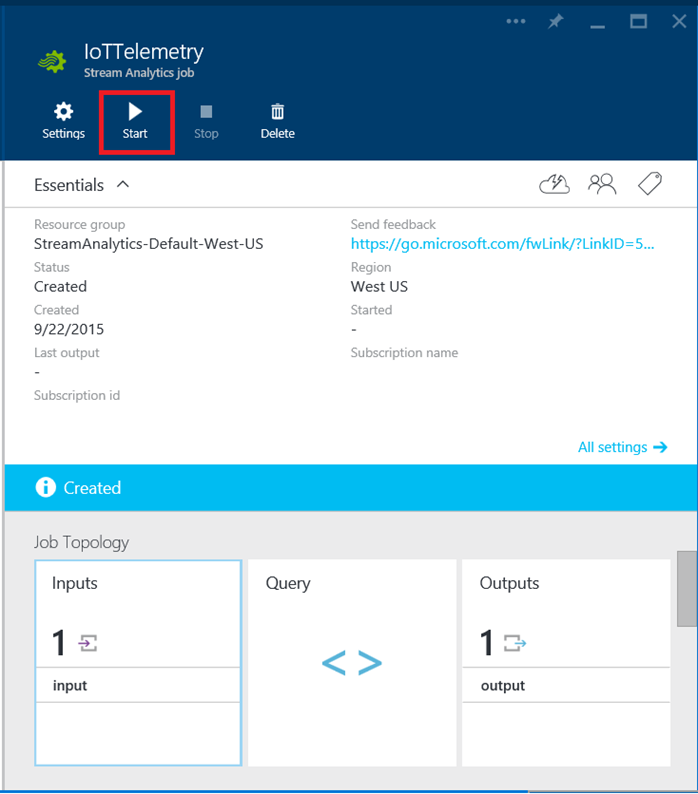
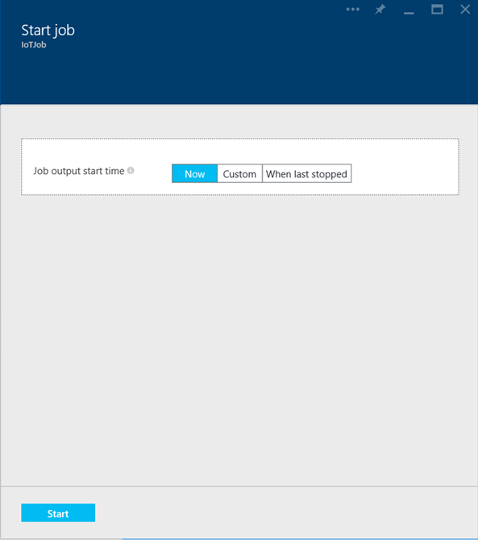
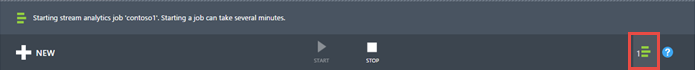
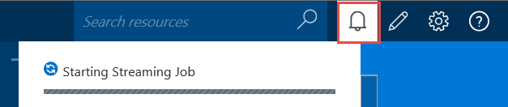

<properties 
    pageTitle="Streaming Starten von Aufträgen in Stream Analytics | Microsoft Azure" 
    description="Ausführung ein Auftrags streaming in Azure Stream Analytics | Learning Path Segment an."
    keywords="Streaming Aufträge"
    documentationCenter=""
    services="stream-analytics"
    authors="jeffstokes72" 
    manager="jhubbard" 
    editor="cgronlun"/>

<tags 
    ms.service="stream-analytics" 
    ms.devlang="na" 
    ms.topic="article" 
    ms.tgt_pltfrm="na" 
    ms.workload="data-services" 
    ms.date="09/26/2016" 
    ms.author="jeffstok"/>

# So führen Sie einen streaming Auftrag in Azure Stream Analytics

Wenn eine Position Eingabemethoden, Abfrage- und Ausgabe alle angegeben wurden, dass Sie den Auftrag Stream Analytics starten können.

So starten Sie Ihre Arbeit

1.  Klicken Sie auf **Starten** , am unteren Rand der Seite, im klassischen Azure-Portal aus dem Dashboard Position.

      

    Klicken Sie im Azure-Portal auf am oberen Rand der Seite Auftrag **Starten** .

      

2.  Geben Sie einen **Starten** Ausgabewert feststellen, wann dieses Projekt anfangen, Erzeugen von Ausgaben an. Die Standardeinstellung für Projekte, die zuvor nicht gestartet ist **Auftrag Anfangszeit**, d. h., der Auftrag Verarbeitung Daten sofort gestartet werden kann. Sie können auch eine **benutzerdefinierte** Zeit in der Vergangenheit (für die Verarbeitung von zurückliegenden Daten) oder die Zukunft (um Verarbeitung bis zu einem späteren Zeitpunkt verzögern) angeben. Wann ein Projekt zuvor gestartet und beendet wird wurde, ist die Option **Uhrzeit der letzten beendet** für Fälle zur Verfügung, um den Auftrag ab dem Zeitpunkt der letzten Ausgabe Lebenslauf, und vermeiden Sie Daten verloren gehen.  

      

      

3.  Ihre Auswahl zu bestätigen. Der Status ändert sich in die *Felder starten* und verschieben Sie nach dem Start des Auftrags in Kürze *ausgeführt* . Sie können den Fortschritt des Vorgangs in der **Benachrichtigung Hub** **Starten** , überwachen:

      

      

## Anfordern von Hilfe
Für weitere Unterstützung zu erhalten versuchen Sie es unsere [Azure Stream Analytics-forum](https://social.msdn.microsoft.com/Forums/en-US/home?forum=AzureStreamAnalytics)

## Nächste Schritte

- [Einführung in Azure Stream Analytics](stream-analytics-introduction.md)
- [Erste Schritte mit Azure Stream Analytics](stream-analytics-get-started.md)
- [Skalieren Sie Azure Stream Analytics Aufträge](stream-analytics-scale-jobs.md)
- [Azure Stream Analytics Query Language Bezug](https://msdn.microsoft.com/library/azure/dn834998.aspx)
- [Azure Stream Analytics Management REST-API-Referenz](https://msdn.microsoft.com/library/azure/dn835031.aspx)
