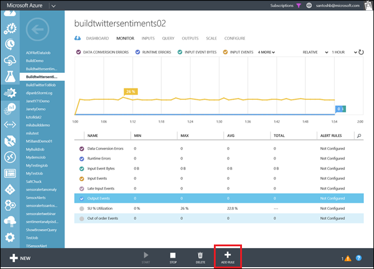
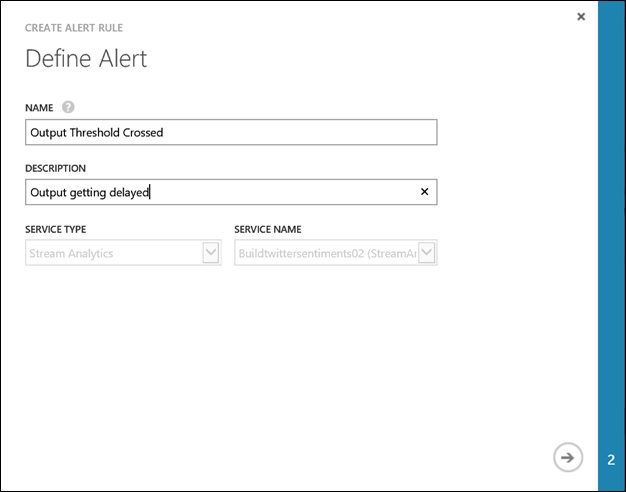
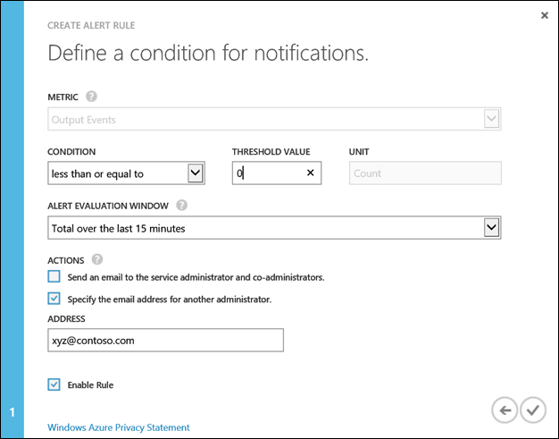
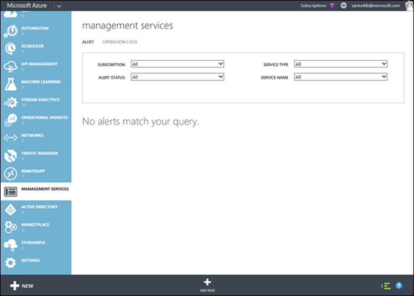
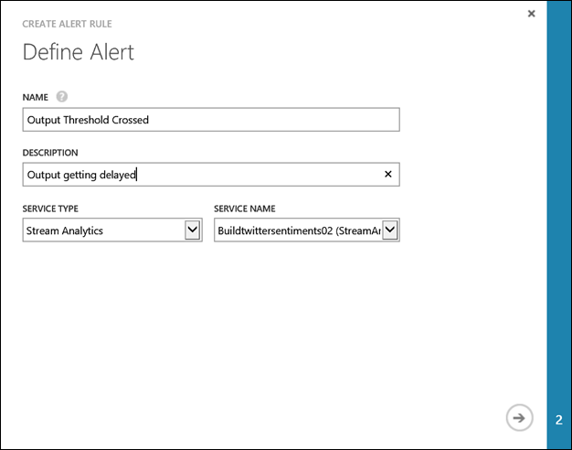
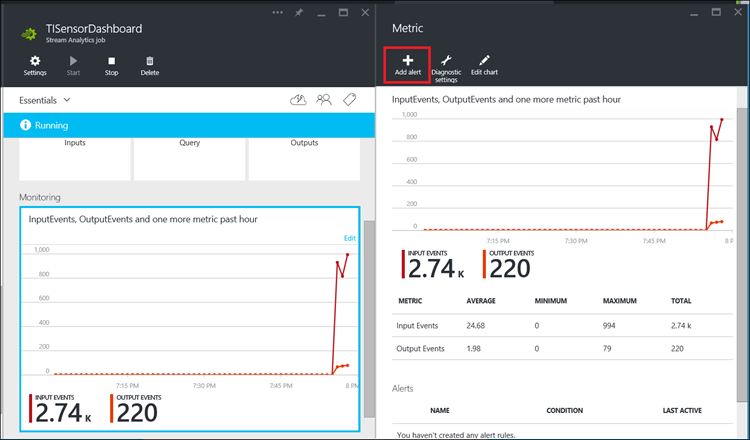
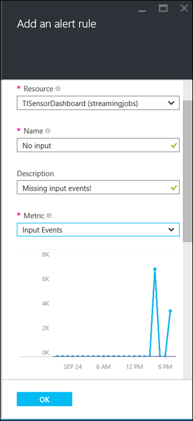

<properties
    pageTitle="Einrichten von Benachrichtigungen für Abfragen in Stream Analytics | Microsoft Azure"
    description="Grundlegendes zu Stream Analytics warnen"
    keywords="Einrichten von Benachrichtigungen"
    services="stream-analytics"
    documentationCenter=""
    authors="jeffstokes72"
    manager="jhubbard"
    editor="cgronlun"/>

<tags
    ms.service="stream-analytics"
    ms.devlang="na"
    ms.topic="article"
    ms.tgt_pltfrm="na"
    ms.workload="data-services"
    ms.date="09/26/2016"
    ms.author="jeffstok"/>

# Einrichten von Benachrichtigungen für Azure Stream Analytics Aufträge

## Einführung: Monitor Seite

Sie können Benachrichtigungen einrichten eine Benachrichtigung ausgelöst, wenn eine Metrik eine Bedingung erreicht, die Sie angeben.

Beispielsweise "ist Ausgabe Ereignisse für den letzten 15 Minuten < 100, Senden von e-Mail-Benachrichtigung an e-Mail-Id: xyz@company.com”.

Regeln können auf Kennzahlen über das Portal eingerichtet werden, oder konfigurierten [programmgesteuert](https://code.msdn.microsoft.com/windowsazure/Receive-Email-Notifications-199e2c9a) über Protokolle für Daten werden können.

## Einrichten von Benachrichtigungen über das klassische Azure-Portal

Es gibt zwei Methoden zum Einrichten von Benachrichtigungen in der klassischen Azure-Portal an:  

1.  Die Registerkarte **Monitor** Ihres Auftrags Stream Analytics  
2.  Der Log-Vorgänge in der Management services  

## Benachrichtigung über die Registerkarte Überwachen des Projekts im Portal einrichten

1.  Wählen Sie auf der Registerkarte Monitor die Metrik aus und klicken Sie auf die Schaltfläche **Regel hinzufügen** im unteren Bereich des Dashboards und Regeln für die Einrichtung.  

      

2.  Definieren von Name und Beschreibung der Warnung  

      

3.  Geben Sie die Schwellenwerte, benachrichtigen Auswertung Fenster und die Aktionen für die Benachrichtigung  

      

## Einrichten von Benachrichtigungen über die Protokolle der Vorgänge

1.  Wechseln Sie zur Registerkarte **Benachrichtigungen** in Management Services im [Klassischen Azure-Portal](https://manage.windowsazure.com)an.  
2.  Klicken Sie auf **Regel hinzufügen**  

      

3.  Definieren Sie den Namen und eine Beschreibung der Warnung an. Wählen Sie 'Stream Analytics' als Diensttyp und den Auftragsnamen als Dienstnamen ein.  

      

## Einrichten von Benachrichtigungen Azure-Portal ##

Im Portal Azure wählen Sie das Stream Analytics-Projekt, das Sie für eine Warnung interessiert sind, und klicken Sie im Abschnitt **Überwachung** auf.  Klicken Sie in der **Metrik** Blade, das geöffnet wird auf den Befehl **Benachrichtigung hinzufügen** .

    

Sie können der Benachrichtigung Regel einen Namen, und wählen Sie eine Beschreibung, die in der e-Mail-Benachrichtigung angezeigt wird.

Wenn Sie Kennzahlen auswählen, werden Sie Bedingung und Schwellenwert Wert für die Metrik auswählen.

    

Weitere Informationen über das Konfigurieren von Benachrichtigungen Azure-Portal finden Sie unter [-Benachrichtigung empfangen](../monitoring-and-diagnostics/insights-receive-alert-notifications.md).  

## Anfordern von Hilfe
Für weitere Unterstützung zu erhalten versuchen Sie es unsere [Azure Stream Analytics-forum](https://social.msdn.microsoft.com/Forums/en-US/home?forum=AzureStreamAnalytics)

## Nächste Schritte

- [Einführung in Azure Stream Analytics](stream-analytics-introduction.md)
- [Erste Schritte mit Azure Stream Analytics](stream-analytics-get-started.md)
- [Skalieren Sie Azure Stream Analytics Aufträge](stream-analytics-scale-jobs.md)
- [Azure Stream Analytics Query Language Bezug](https://msdn.microsoft.com/library/azure/dn834998.aspx)
- [Azure Stream Analytics Management REST-API-Referenz](https://msdn.microsoft.com/library/azure/dn835031.aspx)
