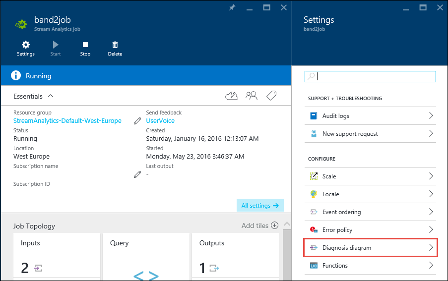

<properties
    pageTitle="Visualisieren und Problembehandlung bei Stream Analytics Aufträge | Microsoft Azure"
    description="Erfahren Sie, wie ein Stream Analytics Auftrag Verkaufspipeline zur Behandlung dieses Problems Self-service mit dem Diagramm-Diagnosefeature visualisiert werden sollen."
    keywords=""
    documentationCenter=""
    services="stream-analytics"
    authors="jeffstokes72"
    manager="jhubbard"
    editor="cgronlun"
/>

<tags
    ms.service="stream-analytics"
    ms.devlang="na"
    ms.topic="article"
    ms.tgt_pltfrm="na"
    ms.workload="data-services"
    ms.date="09/26/2016"
    ms.author="jeffstok"
/>

# Visualisieren Sie und Problembehandlung bei Stream Analytics Aufträge

In Stream Analytics ist wie bei anderen cloudbasierte Technologies, Problembehandlung manchmal erforderlich sind nähere warum ein Auftrags nicht die erwarteten Ergebnis (oder eine beliebige Ausgabe für diese Angelegenheit) erzielt wird. Mit diesem Hintergrund bietet Stream Analytics die Möglichkeit für einen streaming Auftrag Visualisierung. Dies ist auch als schnelles Modellierungstool praktischen und weist die Seite Vorteile für diese erfordern Dokumentation ihrer Arbeit.

Klicken Sie im Bereich Visualisierung werden die Eingaben sowie die Abfrage ausgeführt wird, und klicken Sie dann alle Ausgaben konfiguriert angezeigt. Probleme mit der Konnektivität oder Konfiguration schnell deutlicher, und es kann auch hilfreich sein, eine visuelle Darstellung Ihrer Konfiguration finden Sie unter.

## Mithilfe des Tools für Diagnose-Diagramm

Klicken Sie für den Zugriff auf diese Schnellansicht einfach auf die Schaltfläche "Diagramm Diagnose" Falz "Einstellungen" die des Streams Analytics Auftrags.

Sämtliche ein- und Ausgaben ist farbcodiert, um anzugeben, den aktuellen Status dieser Komponente, wie unten dargestellt.

Wenn der Benutzer eigenständig Zwischenergebnisse von Abfrageschritte möchte, die Datenfluss Muster innerhalb eines Projekts zu verstehen, enthält das Visualisierungstool einen Überblick über die Projektstrukturplan-Codes der Abfrage in zugehörigen Komponente Schritte und die Abfolge Fluss an. Klicken Sie auf jeden abfrageschritt auf wird im entsprechenden Abschnitt in einer Abfrage bearbeiten Bereich wie dargestellt angezeigt. 

## Nächste Schritte

- [Einführung in Azure Stream Analytics](stream-analytics-introduction.md)
- [Erste Schritte mit Azure Stream Analytics](stream-analytics-get-started.md)
- [Skalieren Sie Azure Stream Analytics Aufträge](stream-analytics-scale-jobs.md)
- [Azure Stream Analytics Query Language Bezug](https://msdn.microsoft.com/library/azure/dn834998.aspx)
- [Azure Stream Analytics Management REST-API-Referenz](https://msdn.microsoft.com/library/azure/dn835031.aspx)
