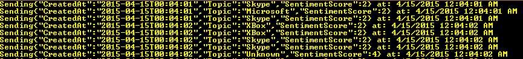
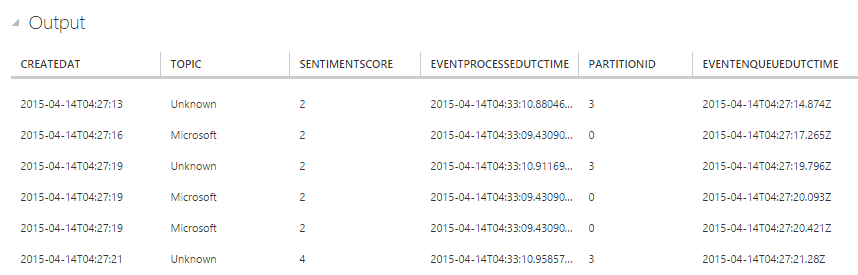
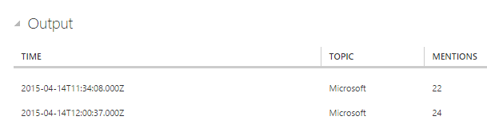
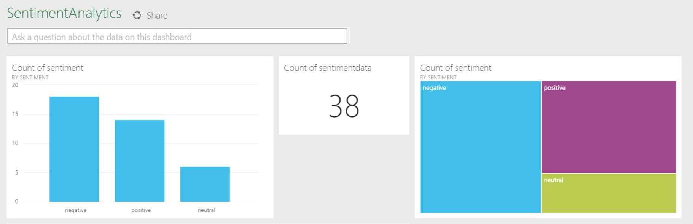

<properties
    pageTitle="In Echtzeit Twitter Grüße Analyse mit Stream Analytics | Microsoft Azure"
    description="Erfahren Sie, wie Stream Analytics für in Echtzeit Twitter Grüße Analyse verwendet werden soll. Schrittweise Anleitung aus Generieren von Ereignissen zu Daten auf einem aktuellen Dashboard."
    keywords="in Echtzeit Twitter Trendanalyse, Grüße Analyse, soziale Medien Analyse, Trend Analysis-Beispiel"
    services="stream-analytics"
    documentationCenter=""
    authors="jeffstokes72"
    manager="jhubbard"
    editor="cgronlun"/>

<tags
    ms.service="stream-analytics"
    ms.devlang="na"
    ms.topic="article"
    ms.tgt_pltfrm="na"
    ms.workload="big-data"
    ms.date="09/26/2016"
    ms.author="jeffstok"/>

# Soziale Medien Analyse: Real-Time Twitter Grüße Analyse in Azure Stream Analytics

Informationen Sie zum Erstellen einer Grüße Analysis-Lösung für soziale Medien Analytics in Echtzeit Twitter Ereignisse in Azure Ereignis Hubs eingebunden wurden. Schreiben Sie eine Abfrage Azure Stream Analytics zum Analysieren der Daten. Sie werden dann entweder die Ergebnisse zur späteren Durchsicht speichern oder verwenden ein Dashboard und [Power BI](https://powerbi.com/) um Einblicke in Echtzeit.

Soziale Medien Analytics Tools helfen Organisationen verstehen beliebte Themen, d. h., Themen und überlegen, die eine große Anzahl von Beiträgen in sozialen Medien aufweisen. Grüße Analyse, die auch *marketingorientierten Mining*bezeichnet wird, wird mit soziale Medien Analytics Tools überlegen gegen Produkt, Idee usw. bestimmt. In Echtzeit Twitter Trendanalyse ist ein großartiges Beispiel an, da hashtags Abonnement Modell ermöglicht es Ihnen, bestimmte Schlüsselwörter Abhören und den Feed Grüße Analysen entwickeln.

## Szenario: Grüße Analyse in Echtzeit

Ein Unternehmen, das eine News Medien-Website ist einen Vorteil über seine Mitbewerber von Websiteinhalten, die für die Leser sofort relevant sind mit erste interessiert. Das Unternehmen verwendet soziale Medien Analyse Themen, die für die Leser relevant sind, wie folgt in Echtzeit Grüße Analysen Twitter-Daten. Wenn um beliebte Themen in Echtzeit auf Twitter zu identifizieren, benötigt das Unternehmen insbesondere in Echtzeit Analytics Tweet Lautstärke und Grüße Key Themen. Ja, besteht im Wesentlichen müssen eine Grüße Analyse Analytics-Engine, die auf dieser sozialen Medien feed basiert.

## Erforderliche Komponenten
-   Twitter-Konto und [OAuth Access token](https://dev.twitter.com/oauth/overview/application-owner-access-tokens)
-   [TwitterClient.zip](http://download.microsoft.com/download/1/7/4/1744EE47-63D0-4B9D-9ECF-E379D15F4586/TwitterClient.zip) vom Microsoft Download Center
-   Optional: Quellcode für Twitter-Client aus [GitHub](https://aka.ms/azure-stream-analytics-twitterclient)

## Erstellen eines Ereignisses Hub Eingabemethoden und einer Gruppe consumer

Die Anwendung Stichprobe Ereignisse generieren, und drücken Sie sie ein Ereignis Hubs Instanz (kurz ein Ereignis-Hub). Dienstbus Ereignis Hubs sind die bevorzugte Methode für das Ereignis Aufnahme für Stream Analytics an. Finden Sie unter Ereignis Hubs Dokumentation in [Dienstbus Dokumentation](/documentation/services/service-bus/).

Gehen Sie folgendermaßen vor, um ein Ereignis Hub zu erstellen.

1.  Im Portal Azure klicken Sie auf **neu** > **APP SERVICES** > **DIENSTBUS** > **Ereignis HUB** > **Schnell erstellen**, und geben Sie einen Namen, die Region und den neuen oder vorhandenen Namespace.  
2.  Als bewährte Methode sollten jedes Stream Analytics-Projekt aus einer einzelnen Ereignis Hubs Consumer Gruppe lesen. Wir werden Sie den Vorgang des Erstellens von einer Gruppe Consumer später durchzuführen. Sie können weitere Informationen zur Consumer Gruppen bei [Azure Ereignis Hubs Übersicht](https://msdn.microsoft.com/library/azure/dn836025.aspx). Wechseln Sie zum Erstellen einer Gruppe Consumer an den neu erstellten Ereignis Hub, klicken Sie auf der Registerkarte **CONSUMER Gruppen** **Erstellen** , klicken Sie auf den unteren Rand der Seite auf, und geben Sie dann einen Namen für die Gruppe Consumer aus.
3.  Zum Gewähren des Zugriffs an den Hub Ereignis müssen wir eine freigegebene Zugriffsrichtlinie zu erstellen. Klicken Sie auf der Registerkarte **Konfigurieren** Ihrer Hub Ereignis.
4.  Klicken Sie unter **FREIGEGEBENE-Richtlinien**erstellen Sie eine neue Richtlinie mit Berechtigungen **Verwalten** aus.

    

5.  Klicken Sie auf **Speichern** , am unteren Rand der Seite.
6.  Wechseln Sie zu dem **DASHBOARD**auf **VERBINDUNGSINFORMATIONEN** am unteren Rand der Seite, und klicken Sie dann auf Kopieren Sie und speichern Sie die Verbindungsinformationen. (Verwenden Sie das Symbol "Kopieren", die unter das Suchsymbol angezeigt wird.)

## Konfigurieren und zum Starten der Twitter-Clientanwendung

Wir haben eine Clientanwendung bereitgestellt, die mit Twitter-Daten über [Den Twitter Streaming APIs](https://dev.twitter.com/streaming/overview) zum Erfassen von Tweet Ereignisse über eine parametrisierte Gruppe von Themen verbinden möchten. Das [Sentiment140](http://help.sentiment140.com/) open Source-Tool wird verwendet, um die einzelnen Tweet einen Grüße Wert zuweisen.

- 0 = negative
- 2 = Neutral
- 4 = positive

Klicken Sie dann sind Tweet Ereignisse an den Hub Ereignis abgelegt.  

Wie folgt vor, um die Anwendung einzurichten:

1.  [Herunterladen der Lösung TwitterClient](http://download.microsoft.com/download/1/7/4/1744EE47-63D0-4B9D-9ECF-E379D15F4586/TwitterClient.zip).
2.  Öffnen Sie TwitterClient.exe.config, und Ersetzen Sie Oauth_consumer_key, Oauth_consumer_secret, Oauth_token und Oauth_token_secret mit Twitter-Token, die die Werte enthalten.  

    [Schritte zum Generieren einer Access-OAuth-token](https://dev.twitter.com/oauth/overview/application-owner-access-tokens)  

    Beachten Sie, dass Sie benötigen, damit eine leere Anwendung ein Token zu generieren.  
3.  Ersetzen Sie die Werte EventHubConnectionString und EventHubName in TwitterClient.exe.config mit der Verbindungszeichenfolge und den Namen der Ihrer Ereignis-Hub an. Die Verbindungszeichenfolge, die Sie zuvor kopiert haben, bietet Ihnen sowohl die Verbindungszeichenfolge und den Namen Ihrer Ereignis Hub, daher müssen Sie unbedingt trennen sie, und setzen jeder in das richtige Feld. Betrachten Sie beispielsweise die folgende Verbindungszeichenfolge aus:

        Endpoint=sb://your.servicebus.windows.net/;SharedAccessKeyName=yourpolicy;SharedAccessKey=yoursharedaccesskey;EntityPath=yourhub

    Die Datei TwitterClient.exe.config sollte Ihre Einstellungen wie im folgenden Beispiel enthalten:

        add key="EventHubConnectionString" value="Endpoint=sb://your.servicebus.windows.net/;SharedAccessKeyName=yourpolicy;SharedAccessKey=yoursharedaccesskey"
        add key="EventHubName" value="yourhub"

    Es ist wichtig zu beachten, dass der Text "EntityPath =" bedeutet __nicht__ den Wert EventHubName angezeigt werden.

4.  *Optional:* Passen Sie die Stichwörter für die Suche.  Standardmäßig sucht dieser Anwendung "Azure, Skype, XBox, Microsoft, Frankfurt am Main".  Falls gewünscht, können Sie die Werte für **Twitter_keywords** in TwitterClient.exe.config, anpassen.
5.  Führen Sie zum Starten der Anwendungs TwitterClient.exe. Sie sehen Tweet Ereignisse mit den Werten **CreatedAt**, **Thema**und **SentimentScore** , die an Ihre Ereignis Hub gesendet werden.

    

## Erstellen eines Auftrags für Stream Analytics

Nun Tweet Ereignisse in Echtzeit von Twitter streaming sind, können wir eine Aufgabe Stream Analytics eingerichtet, um diese Ereignisse in Echtzeit zu analysieren.

### Bereitstellen eines Auftrags Stream Analytics

1.  Klicken Sie im [Azure-Portal](https://manage.windowsazure.com/)auf **neu** > **DATA SERVICES** > **STREAM ANALYTICS** > **SYMBOLLEISTE erstellen**.
2.  Geben Sie die folgenden Werte ein, und klicken Sie dann auf **Erstellen STREAM ANALYTICS Position**:

    * **AUFTRAGSNAME**: Geben Sie einen Namen für die Position.
    * **REGION**: Markieren Sie den Bereich, in dem der Auftrag ausgeführt werden soll. Sollten Sie den Auftrag und dem Ereignis-Hub in der gleichen Region, um eine bessere Leistung zu gewährleisten und um sicherzustellen, dass Sie nicht zum Übertragen von Daten zwischen Regionen bezahlt werden.
    * **Speicher-Konto**: Wählen Sie das Azure-Speicher-Konto, das Sie verwenden möchten, Überwachung Daten für alle Stream Analytics Aufträge gespeichert, die in diesem Bereich ausgeführt werden. Sie haben die Möglichkeit, wählen Sie ein vorhandenes Speicherkonto oder eine neue zu erstellen.

3.  Klicken Sie im linken Bereich auf die Liste der Aufträge Stream Analytics **STREAM ANALYTICS** auf.  
    

    Die neue Position wird mit dem Status **erstellt**angezeigt. Beachten Sie, dass die Schaltfläche **START** , klicken Sie auf den unteren Rand der Seite deaktiviert ist. Sie müssen den Auftrag Eingabe, Ausgabe und Abfrage konfigurieren, bevor Sie den Auftrag beginnen können.

### Geben Sie Auftrag Eingabe
1.  **EINGABEN** vom oberen Rand der Seite klicken Sie in Ihrem Auftrag Stream Analytics auf, und klicken Sie dann auf **Eingabe hinzufügen**. Im daraufhin angezeigten Dialogfeld führt Sie durch eine Reihe von Schritte zum Einrichten Ihrer Eingabe.
2.  Klicken Sie auf **DATENSTREAM**, und klicken Sie dann mit der rechten Maustaste auf ein.
3.  Klicken Sie auf **Ereignis HUB**, und klicken Sie dann mit der rechten Maustaste auf ein.
4.  Geben Sie ein, oder wählen Sie auf der dritten Seite die folgenden Werte aus:

    * **Eingabe ALIAS**: Geben Sie einen Anzeigenamen für dieses Projekt Eingabemethoden, z. B. *TwitterStream*. Beachten Sie, dass Sie diesen Namen später in der Abfrage verwenden können.
    **Ereignis HUB**: ist der Ereignis Hub, die Sie erstellt im selben als den Auftrag Stream Analytics-Abonnement, wählen Sie den Namespace, die der Hub Ereignis ist.

        Ist der Ereignis-Hub in ein anderes Abonnement, klicken Sie auf **Ereignis-Hub aus einem anderen Abonnement verwenden**, und Manuelles Eingeben von Informationen für **SERVICE BUS NAMESPACE**, **HUB NAME des EREIGNISSES**, **Ereignis HUB RICHTLINIENNAME**, **Ereignis HUB RICHTLINIENSCHLÜSSEL**und **Ereignis HUB PARTITIONSANZAHL**.

    * **NAME des EREIGNISSES HUB**: Wählen Sie den Namen des Ereignisses-Hub aus.

    * **Ereignis HUB RICHTLINIENNAMEN**: Wählen Sie die Ereignis Hub Richtlinie, die Sie zuvor in diesem Lernprogramm erstellt haben.

    * **Ereignis HUB CONSUMER Gruppe**: Geben Sie den Namen der Gruppe Consumer, die Sie zuvor in diesem Lernprogramm erstellt haben.
5.  Klicken Sie mit der rechten Maustaste auf.
6.  Geben Sie die folgenden Werte ein:

    * **Ereignis SERIALISIERUNGSPROGRAMM FORMAT**: JSON
    * **Codierung**: UTF8

7.  Klicken Sie auf die Schaltfläche **Suchen** , diese Quelle hinzuzufügen und stellen Sie sicher, dass Stream Analytics erfolgreich an das Ereignis Hub eine Verbindung herstellen können.

### Position-Abfrage angeben

Stream Analytics unterstützt ein einfaches, deklaratives Abfrage-Modell, das Transformationen beschrieben. Erfahren Sie mehr über die Sprache, finden Sie unter den [Azure Stream Analytics Query Language Bezug](https://msdn.microsoft.com/library/azure/dn834998.aspx).  In diesem Lernprogramm hilft Ihnen erstellen und Testen mehrere Abfragen über Twitter-Daten.

#### Beispiel für die Dateneingabe

Um die Abfrage gegen tatsächliche Position Daten zu überprüfen, können Sie das Feature **BEISPIELDATEN** Ereignisse aus Ihrer Stream extrahieren, und erstellen Sie eine Datei .json der Ereignisse zum Testen.

1.  Wählen Sie Ihre Veranstaltung Hub Eingabe aus, und klicken Sie dann auf **BEISPIELDATEN** am unteren Rand der Seite.
2.  Klicken Sie im daraufhin angezeigten Dialogfeld Geben Sie eine **STARTZEIT** zum Sammeln von Daten und eine **Dauer** für die verbleibenden weiteren Daten zur nutzen zu starten.
3.  Klicken Sie auf die Schaltfläche **DETAILS** , und klicken Sie dann auf den Link **Klicken Sie hier** , um herunterladen und speichern Sie die Datei generierten .json.

#### Pass-Through-Abfrage
Um zu beginnen, führen wir einer einfachen Pass-Through-Abfrage die Projekte alle Felder in einem Ereignis.

1.  Klicken Sie auf **Abfrage** am oberen Rand der Seite Stream Analytics Position.
2.  Ersetzen Sie im Code-Editor der ursprünglichen Abfragevorlage durch Folgendes ein:

        SELECT * FROM TwitterStream

    Stellen Sie sicher, dass der Name der Eingabewerte Quelle den Namen der Eingabe entspricht, die Sie zuvor angegeben haben.

3.  Klicken Sie auf **Testen** , klicken Sie unter den Abfrage-Editor.
4.  Wechseln Sie zu Ihrer .json Beispieldatei.
5.  Klicken Sie auf die Schaltfläche " **Überprüfen** ", und die Ergebnisse unterhalb der Abfragedefinition angezeigt.

    

#### Anzahl der Tweets nach Themen: Tumbling Fenster mit Aggregation

Um die Anzahl der zwischen Themen Erwähnung verglichen werden, wird eine [TumblingWindow](https://msdn.microsoft.com/library/azure/dn835055.aspx) verwendet, können Sie um die Anzahl der Erwähnung nach Themen alle fünf Sekunden zu gelangen.

1.  Ändern Sie die Abfrage in den Code-Editor ein:

        SELECT System.Timestamp as Time, Topic, COUNT(*)
        FROM TwitterStream TIMESTAMP BY CreatedAt
        GROUP BY TUMBLINGWINDOW(s, 5), Topic

    Diese Abfrage verwendet das Schlüsselwort **Zeitstempel durch** , um anzugeben, ein Timestamp-Feld in der Nutzlast, in die zeitliche Berechnung verwendet werden soll. Wenn dieses Feld nicht angegeben wurde, würde der Windowing Vorgang ausgeführt werden, mithilfe der Zeit, die jedes Ereignis von Ereignis-Hub empfangen wurde.  Weitere Informationen finden Sie im Abschnitt "Ankunfts-Zeit im Vergleich mit einer Anwendung Time" [Stream Analytics Abfrage](https://msdn.microsoft.com/library/azure/dn834998.aspx)Bezugs zurück.

    Diese Abfrage greift auch einen Zeitstempel für den unteren Rand jedes Fensters mithilfe der **System.Timestamp** -Eigenschaft auf.

2.  Klicken Sie auf **erneut ausführen** , klicken Sie unter den Abfrage-Editor, um die Ergebnisse der Abfrage anzuzeigen.

#### Identifizieren Sie beliebte Themen: verschiebbaren Fenster

Wenn um beliebte Themen zu identifizieren, suchen wir nach Themen, die einen Schwellenwert für Erwähnung in einen angegebenen Zeitraum cross. Für die Zwecke dieses Lernprogramms überprüfen wir für Themen, die mehr als 20 Mal in den letzten fünf Sekunden mithilfe einer [SlidingWindow](https://msdn.microsoft.com/library/azure/dn835051.aspx)erwähnt werden.

1.  Ändern Sie die Abfrage in den Code-Editor: Wählen Sie System.Timestamp als Zeit, Thema Anzahl (*) als Erwähnungen aus TwitterStream Zeitstempel durch CreatedAt Gruppe von SLIDINGWINDOW(s, 5), Thema Probleme zählen (*) > 20

2.  Klicken Sie auf **erneut ausführen** , klicken Sie unter den Abfrage-Editor, um die Ergebnisse der Abfrage anzuzeigen.

    

#### Anzahl der Erwähnung und Grüße: Tumbling Fenster mit Aggregation
Die fertige Abfrage, die wir testen wird verwendet **TumblingWindow** können Sie um die Anzahl der Erwähnung, Mittelwert, Minimum, Maximum und die Standardabweichung der Grüße Punktzahl für jedes Thema alle fünf Sekunden zu gelangen.

1.  Ändern Sie die Abfrage in den Code-Editor ein:

        SELECT System.Timestamp as Time, Topic, COUNT(*), AVG(SentimentScore), MIN(SentimentScore),
        Max(SentimentScore), STDEV(SentimentScore)
        FROM TwitterStream TIMESTAMP BY CreatedAt
        GROUP BY TUMBLINGWINDOW(s, 5), Topic

2.  Klicken Sie auf **erneut ausführen** , klicken Sie unter den Abfrage-Editor, um die Ergebnisse der Abfrage anzuzeigen.
3.  Dies ist die Abfrage, die wir für unsere Dashboard verwendet wird.  Klicken Sie auf **Speichern** , am unteren Rand der Seite.

## Erstellen der Ausgabe Empfänger

Jetzt, da wir ein Streams von Ereignissen, ein Ereignis-Hub auf Ereignisse und einer Abfrage ausführen eine Transformation über die Stream Aufnahme Eingabemethoden definiert haben ist der letzte Schritt zum Definieren einer Ausgabe Empfänger für das Projekt.  Wir werden die aggregierten Tweet Ereignisse aus unserem Auftrag Abfrage in Azure Blob-Speicher geschrieben werden.  Sie können auch die Ergebnisse mit Azure SQL-Datenbank, Azure Table Storage, Pushbenachrichtigungen oder Ereignis Hubs, je nach bestimmten Anwendung benötigt.

Gehen Sie folgendermaßen vor, wenn Sie eine bereits besitzen Erstellen eines Containers für Blob-Speicher:

1.  Verwenden ein vorhandenen Speicher-Kontos oder erstellen Sie ein neues Speicherkonto, indem Sie auf **neu** > **DATA SERVICES** > **Speicher** > **Schnell erstellen**, und klicken Sie dann den Anweisungen auf dem Bildschirm folgen.
2.  Wählen Sie das Speicherkonto auf **Container** am oberen Rand der Seite, und klicken Sie dann auf **Hinzufügen**.
3.  Geben Sie einen **Namen** für den Container, und legen Sie seinen **Zugriff** auf **Öffentliche Blob**.

## Geben Sie die Position Ausgabe

1.  Klicken Sie in Ihrem Auftrag Stream Analytics auf **die Ausgabe** am oberen Rand der Seite, und klicken Sie dann auf **Ausgabe hinzufügen**. Im daraufhin angezeigten Dialogfeld werden Sie verschiedene Schritte zum Einrichten der Ausgabe durchzuführen.
2.  Klicken Sie auf **BLOB-Speicher**, und klicken Sie dann mit der rechten Maustaste auf ein.
3.  Geben Sie ein, oder wählen Sie auf der dritten Seite die folgenden Werte aus:

    * **Die AUSGABEALIAS**: Geben Sie einen Anzeigenamen für diese Position Ausgabe.

    * **ABONNEMENTS**: der Blob-Speicher, die Sie erstellt im selben Abonnement als den Auftrag Stream Analytics, klicken Sie auf **Speicher-Konto aus aktuelle Abonnement verwenden**. Ist der Speicher in ein anderes Abonnement, klicken Sie auf **Speicher-Konto aus einem anderen Abonnement verwenden**, und Manuelles Eingeben von Informationen für **Speicher-Konto**, **Speicher KONTOSCHLÜSSEL**und **CONTAINER**.

    * **Speicher-Konto**: Wählen Sie den Namen des Speicherkontos.

    * **CONTAINER**: Wählen Sie den Namen des Containers aus.

    * **FILENAME Präfix**: Geben Sie ein Dateipräfix Blob Ausgabe schreiben verwendet werden soll.

4.  Klicken Sie mit der rechten Maustaste auf.
5.  Geben Sie die folgenden Werte ein:
    * **Ereignis SERIALISIERUNGSPROGRAMM FORMAT**: JSON
    * **Codierung**: UTF8
6.  Klicken Sie auf die Schaltfläche **Suchen** , diese Quelle hinzuzufügen und stellen Sie sicher, dass Stream Analytics eine Verbindung mit dem Speicherkonto herstellen können.

## Auftrag starten

Da eine Position Eingabe, Abfrage- oder Ausgabe alle angegeben wurden, können wir den Auftrag Stream Analytics beginnen.

1.  Klicken Sie aus den Auftrag **DASHBOARD**auf **START** , am unteren Rand der Seite.
2.  Klicken Sie im Dialogfeld, das geöffnet wird auf **Auftrag ANFANGSZEIT**, und klicken Sie dann auf die Schaltfläche **Aktivieren** an den unteren Rand des Dialogfelds. Der Status ändert sich in die **Felder starten** und ändert sich in Kürze **ausgeführt**.

## Anzeigen der Ausgabe für Grüße Analyse

Nach Ihrem Auftrag ausgeführt wird und in Echtzeit Twitter Streams Verarbeitung, wählen Sie aus, wie Sie die Ausgabe für die Analyse Grüße anzeigen möchten. Verwenden Sie ein Tool wie [Azure-Speicher-Explorer](https://azurestorageexplorer.codeplex.com/) oder [Azure-Explorer](http://www.cerebrata.com/products/azure-explorer/introduction) , um Ihre Position Ausgabe in Echtzeit anzuzeigen. Von hier aus können Sie [Power BI](https://powerbi.com/) zum Erweitern Ihrer Anwendungs ein angepasstes Dashboard wie in den folgenden Screenshot aufnehmen möchten.

## Anfordern von Unterstützung
Versuchen Sie für weitere Unterstützung zu erhalten unseren [Azure Stream Analytics-Forum](https://social.msdn.microsoft.com/Forums/en-US/home?forum=AzureStreamAnalytics).

## Nächste Schritte

- [Einführung in Azure Stream Analytics](stream-analytics-introduction.md)
- [Erste Schritte mit Azure Stream Analytics](stream-analytics-get-started.md)
- [Skalieren Sie Azure Stream Analytics Aufträge](stream-analytics-scale-jobs.md)
- [Azure Stream Analytics Query Language Bezug](https://msdn.microsoft.com/library/azure/dn834998.aspx)
- [Azure Stream Analytics Management REST-API-Referenz](https://msdn.microsoft.com/library/azure/dn835031.aspx)
