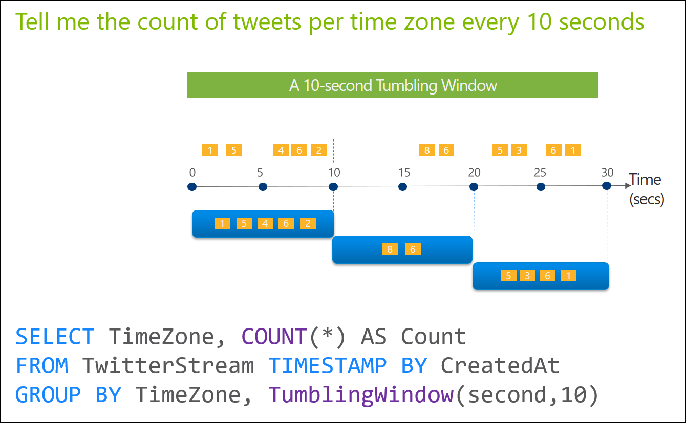
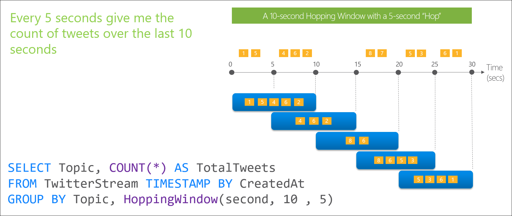

<properties
    pageTitle="Einführung in Stream Analytics Fenster Funktionen | Microsoft Azure"
    description="Informationen Sie zu den drei Fenster-Funktionen in Stream Analytics (tumbling, hopping, gleitende)."
    keywords="Tumbling gleitende Fenster hopping Fenster-Fenster"
    documentationCenter=""
    services="stream-analytics"
    authors="jeffstokes72"
    manager="jhubbard"
    editor="cgronlun"
/>

<tags
    ms.service="stream-analytics"
    ms.devlang="na"
    ms.topic="article"
    ms.tgt_pltfrm="na"
    ms.workload="data-services"
    ms.date="09/26/2016"
    ms.author="jeffstok"
/>

# Einführung in Stream Analytics Fenster Funktionen

In vielen Szenarien streaming Echtzeit ist es erforderlich, zum Ausführen von Vorgängen nur für die zeitliche Windows enthaltenen Daten. Systemeigene Unterstützung für Windowing Funktionen ist eines der wichtigsten Features von Azure Stream Analytics, die die Stecknadel auf Entwicklertools Produktivität beim Verfassen von komplexen Stream Verarbeitungsaufträge bewegt wird. Stream Analytics ermöglicht Entwicklern [**Tumbling**](https://msdn.microsoft.com/library/dn835055.aspx), [**Hopping**](https://msdn.microsoft.com/library/dn835041.aspx) und [**gleitende**](https://msdn.microsoft.com/library/dn835051.aspx) Windows zeitliche Operationen streaming Daten verwenden. Es ist zu beachten, dass alle [Fenster](https://msdn.microsoft.com/library/dn835019.aspx) Vorgänge Ergebnisse am **Ende** des Fensters ausgeben. Die Ausgabe des Fensters werden die einzelnen Ereignis basierend auf der Aggregatfunktion verwendet. Das Ereignis hat den Zeitstempel, der den unteren Rand des Fensters, und alle Funktionen von Fenster mit einer festen Länge definiert sind. Und schließlich ist es wichtig, beachten Sie, dass alle Fenster-Funktionen in einer [**GROUP BY**](https://msdn.microsoft.com/library/dn835023.aspx) -Klausel verwendet werden soll.

## Tumbling Fenster

Tumbling Fenster, die Funktionen verwendet werden, um einen Datenstream in unterschiedlichen Zeitsegmente segmentieren, und führen Sie eine Funktion davor, wie im folgenden Beispiel wird. Die Hauptmerkmale von einem Fenster Tumbling sind, dass sie wiederholt nicht überschneiden und ein Ereignis kann nicht mehr als eine Tumbling Fenster gehören.

## Hopping Fenster

Nach dem Frequenzsprungverfahren Fenster Funktionen Abschnitte weiterleiten Zeitpunkt nach einer bestimmten Frist ein. Möglicherweise einfach zu betrachten sie als Windows Tumbling, die sich überlappen können, damit Ereignisse zu mehreren Hopping Fenster Resultset gehören können. Um ein Fenster Hopping identisch mit einer Tumbling machen würden Fenster eine einfach die Größe Abschnitte, um die Größe des Fensters identisch sein angeben. 

## Verschiebbaren Fenster

Gleitende Fensterfunktionen im Gegensatz zu Tumbling oder Hopping Windows Erzeugen einer Ausgabe **nur** auf, wenn ein Ereignis eintritt. Jedes Fensters sichtbar ist, müssen mindestens ein Ereignis und das Fenster kontinuierlich verschoben wird vorwärts durch eine € (Epsilon). Wie Windows Hopping können mehrere gleitende Fenster Ereignisse angehören.

## Aufrufen der Hilfe mit Fensterfunktionen

Für weitere Unterstützung zu erhalten versuchen Sie es unsere [Azure Stream Analytics-forum](https://social.msdn.microsoft.com/Forums/en-US/home?forum=AzureStreamAnalytics)

## Nächste Schritte

- [Einführung in Azure Stream Analytics](stream-analytics-introduction.md)
- [Erste Schritte mit Azure Stream Analytics](stream-analytics-get-started.md)
- [Skalieren Sie Azure Stream Analytics Aufträge](stream-analytics-scale-jobs.md)
- [Azure Stream Analytics Query Language Bezug](https://msdn.microsoft.com/library/azure/dn834998.aspx)
- [Azure Stream Analytics Management REST-API-Referenz](https://msdn.microsoft.com/library/azure/dn835031.aspx)
