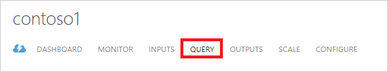
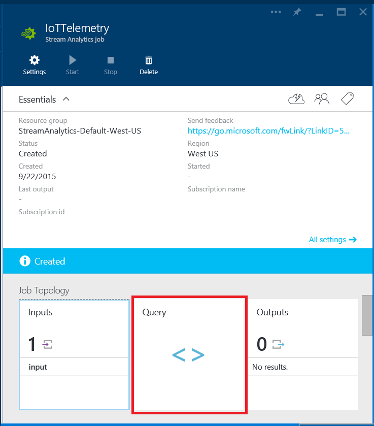
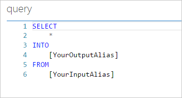
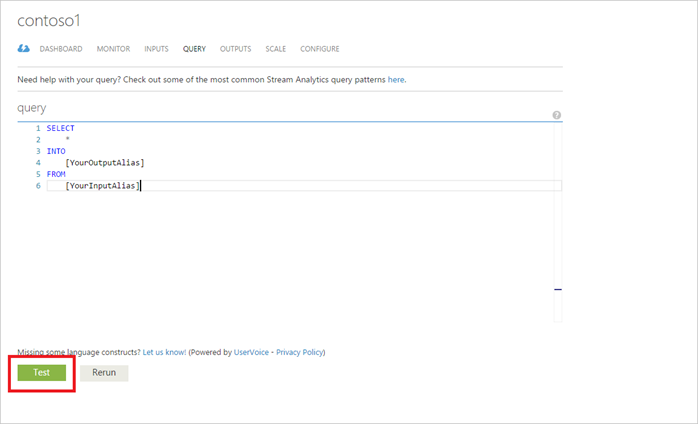
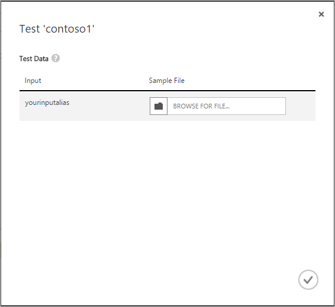
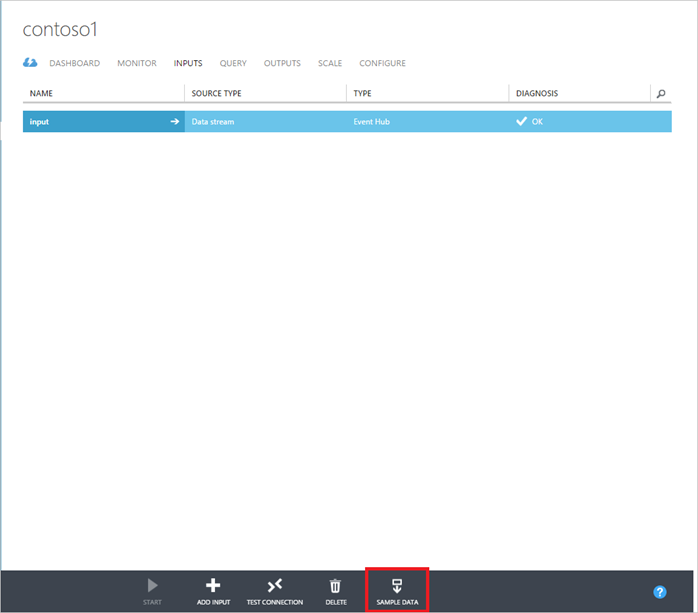
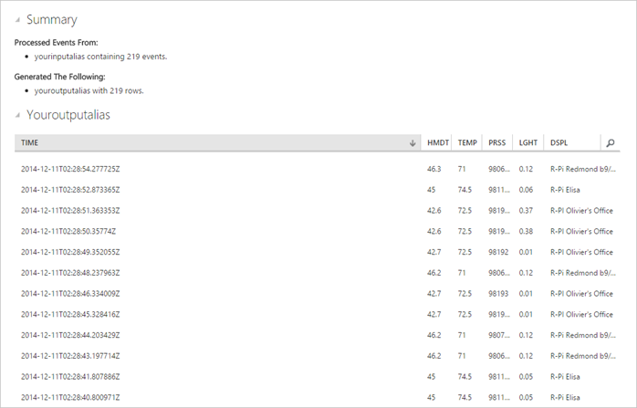

<properties 
    pageTitle="So schreiben Sie Abfragen in Stream Analytics | Microsoft Azure" 
    description="Schreiben von Abfragen in Stream Analytics und Abfragen von Daten | Learning Path Segment an."
    keywords="So schreiben Abfragen Abfragen von Daten, Schreiben Sie eine Abfrage, Schreiben von Abfragen"
    documentationCenter=""
    services="stream-analytics"
    authors="jeffstokes72" 
    manager="jhubbard" 
    editor="cgronlun"/>

<tags 
    ms.service="stream-analytics" 
    ms.devlang="na" 
    ms.topic="article" 
    ms.tgt_pltfrm="na" 
    ms.workload="data-services" 
    ms.date="09/26/2016" 
    ms.author="jeffstok"/>

# So schreiben Sie Abfragen in Stream Analytics

Schreiben von Abfragen für die Verarbeitung von Logik in Azure Stream Analytics Stream wird als "Platzierung in der Abfrage", die definiert ist, bevor ein Auftrag wird gestartet, und klicken Sie auf Daten ausgeführt werden, da sie den Auftrag erreicht implementiert. Der Datentransformation wird in einer SQL-ähnliche Abfragesprache ausgedrückt, also weitgehend eine Teilmenge der T-SQL mit einigen Extensions hinzugefügte Sprache wie [Windowing](https://msdn.microsoft.com/library/azure/dn835019.aspx) zeitlichen Semantik Ausdrücken verwendet.

## Schreiben Sie Abfragen an: ##

1. Klicken Sie in Ihrem Stream Analytics Position im Verwaltungsportal Azure auf **Abfrage**.

      

    Klicken Sie im Portal Azure auf **Abfrage**.

      

2.  Neue Einzelvorgänge sind eine Abfragevorlage Ihnen beim Einstieg helfen. Die Abfragevorlage führt eine "Pass-Through-" Abfrage, die Projekte, die alle Felder aus Eingabewerte Ereignisse in der Ausgabe an.  

    - Wenn Sie mindestens eine Eingabe und Ausgabe für den Job definiert haben, können Sie den Platzhalter "[YourOutputAlias]" ersetzen und zuerst verwenden Sie "[YourInputAlias]" Felder mit den Aliasnamen der ein- und Ausgabe, die Sie möchten. Darüber hinaus können Sie weiterhin verfassen und Testen Ihrer Abfrage in der klassischen Azure-Portal ohne Eingaben und Ausgaben für das Projekt definieren.
    - Wenn Sie weitere Verarbeitung als eine einfache Pass-Through-ausführen möchten, können Sie die Abfragedefinition bearbeiten. Um mit der Erstellung der Abfrage anzufangen, sehen Sie sich einige allgemeine Abfrage Mustern erfasst werden [können](stream-analytics-stream-analytics-query-patterns.md).  
  
      

## Zum Überprüfen von Abfragedaten arbeiten: ##

Sie können testen, dass Ihre Abfrage verhält sich wie erwartet, indem Sie es im Browser ausführen, über eine oder mehrere lokale JSON Dateien, Testdaten enthält. Dies wird nicht startet den Auftrag oder alle Abrechnung gebotenen haben.

> [AZURE.NOTE] Testen der Abfrage im Browser wird derzeit Azure-Portal nicht unterstützt.  

1.  Stellen Sie sicher, dass keine Fehler, in der Abfrage vorliegen (andernfalls wird die Schaltfläche Testen deaktiviert sein), und klicken Sie dann auf die Schaltfläche Testen.  

      

2.  Sie werden aufgefordert, um Dateien für jedes der in der Abfrage referenziert Eingaben anzugeben. In diesem Beispiel wird die Vorlage Abfrage als Links-ist, damit das Dialogfeld für eine Eingabe mit dem Namen "Yourinputalias" Eingabeaufforderung ist.  

      

3.  Navigieren Sie zu einer Datei prüfen. Sind mehrere Beispieldateien auf [Github](https://github.com/Azure/azure-stream-analytics/tree/master/Sample Data) zur Verfügung, und Sie Beispieldaten aus Ihrer eigenen Stream Dateneingaben über die Funktion Beispieldaten auf der Registerkarte Eingaben abrufen.  

      

4.  Nach dem Schließen des Dialogfelds, Ihrer Abfrage über die Testdaten ausgeführt werden sollen, und sehen Sie die Ergebnisse am unteren Rand der Seite Abfrage.  

      

## Anfordern von Hilfe
Für weitere Unterstützung zu erhalten versuchen Sie es unsere [Azure Stream Analytics-forum](https://social.msdn.microsoft.com/Forums/en-US/home?forum=AzureStreamAnalytics)

## Nächste Schritte

- [Einführung in Azure Stream Analytics](stream-analytics-introduction.md)
- [Erste Schritte mit Azure Stream Analytics](stream-analytics-get-started.md)
- [Skalieren Sie Azure Stream Analytics Aufträge](stream-analytics-scale-jobs.md)
- [Azure Stream Analytics Query Language Bezug](https://msdn.microsoft.com/library/azure/dn834998.aspx)
- [Azure Stream Analytics Management REST-API-Referenz](https://msdn.microsoft.com/library/azure/dn835031.aspx)
