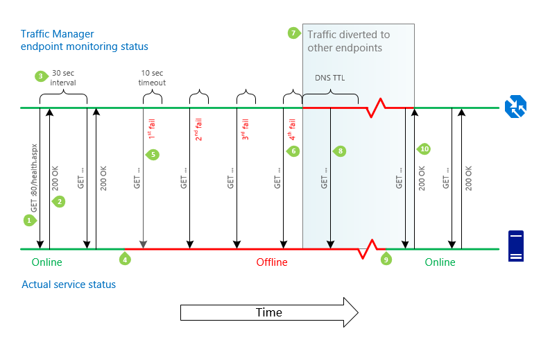

<properties
    pageTitle="Den Datenverkehr Manager Endpunkt Überwachung und Failover | Microsoft Azure"
    description="In diesem Artikel kann Ihnen helfen zu verstehen, wie Datenverkehr Manager Endpunkt für die Überwachung und automatische Endpunkt Failover verwendet, um Azure Kunden bereitstellen hoher Verfügbarkeit Applikationen-Hilfe"
    services="traffic-manager"
    documentationCenter=""
    authors="sdwheeler"
    manager="carmonm"
    editor=""
/>
<tags
    ms.service="traffic-manager"
    ms.devlang="na"
    ms.topic="article"
    ms.tgt_pltfrm="na"
    ms.workload="infrastructure-services"
    ms.date="10/11/2016"
    ms.author="sewhee"
/>

# Datenverkehr Manager Endpunkt Überwachung und failover

Azure Datenverkehr-Manager umfasst integrierte Endpunkt für die Überwachung und automatische Endpunkt Failover. Dieses Feature hilft Ihnen die hohe Verfügbarkeit von Applications vorführen, die flexibel in auf Fehler bei der Endpunkt Bezug, einschließlich Azure Region Fehlern.

## Konfigurieren der Endpunkt Überwachung

Zum Überwachen der Endpunkt konfigurieren, müssen Sie die folgenden Einstellungen für Ihr Profil Datenverkehr Manager angeben:

- **Protokoll**. Wählen Sie HTTP oder HTTPS. Es ist wichtig, beachten Sie, dass für die Überwachung HTTPS nicht überprüft werden kann, ob das SSL-Zertifikat gültig – ist es nur überprüft, ob das Zertifikat vorhanden ist.
- **Port**. Wählen Sie den Port für die Anforderung verwendet.
- **Pfad**. Geben Sie den relativen Pfad und den Namen der Webseite oder Datei, die die Überwachung greift auf ein. Ein Schrägstrich (/) ist ein gültiger Eintrag für den relativen Pfad. Dieser Wert impliziert, dass die Datei im Stammverzeichnis (Standard).

Um die Integrität des jeder Endpunkt zu überprüfen, macht den Datenverkehr Manager eine GET-Anforderung an den Endpunkt mit dem Protokoll, Port, und relativen Pfad angegeben.

Üblich besteht darin, eine benutzerdefinierte Seite innerhalb der Anwendung, z. B. /health.aspx implementieren. Dieser Pfad für die Überwachung verwenden, können Sie anwendungsspezifische Tests, wie etwa Leistungsindikatoren überprüft oder Überprüfen der Verfügbarkeit der Datenbank durchführen. Basierend auf diesen benutzerdefinierten Prüfungen, gibt die Seite einen entsprechenden HTTP-Statuscode aus.

Alle Endpunkte in einem Profil Datenverkehr Manager freigeben Überwachung Einstellungen. Wenn Sie andere Einstellungen für die Überwachung für verschiedene Endpunkte verwenden müssen, können Sie die [verschachtelte Datenverkehr Manager Profile](traffic-manager-nested-profiles.md#example-5-per-endpoint-monitoring-settings)erstellen.

## Endpunkt und Profil status

Sie können aktivieren und Deaktivieren von Profilen Datenverkehr-Manager und die Endpunkte. Endpunkt-Status ändert kann jedoch auch auftreten, wie ein Ergebnis von Datenverkehr Manager Einstellungen und Prozessen automatisierten.

### Endpunkt status

Sie können aktivieren oder deaktivieren einen bestimmten Endpunkt. Der zugrunde liegenden Dienst weiterhin fehlerfrei sein kann, ist nicht betroffen. Ändern den Status der Endpunkt steuert die Verfügbarkeit des Endpunkts im Profil Datenverkehr-Manager. Wenn Sie ein Endpunkt Status deaktiviert ist, den Datenverkehr Manager überprüft nicht die Integrität und der Endpunkt ist nicht in einer DNS-Antwort enthalten.

### Profil status

Verwenden das Benutzerprofil Status festlegen, können Sie aktivieren oder deaktivieren ein bestimmtes Profil. Während der Endpunkt Status wirkt sich auf einen einzelnen Endpunkt, wirkt sich Profil Status auf das gesamte Profil, einschließlich aller Endpunkte aus. Wenn Sie ein Profil deaktivieren, die Endpunkte werden nicht auf Integrität überprüft und keine Endpunkte in einer DNS-Antwort enthalten sind. Ein [NXDOMAIN](https://tools.ietf.org/html/rfc2308) Antwortcode wird für die DNS-Abfrage zurückgegeben.

### Endpunkt Monitorstatus

Endpunkt Monitorstatus ist ein Datenverkehr Manager generierter Wert, der zeigt den Status des Endpunkts an. Sie ändern diese Einstellung manuell nicht. Der Endpunkt Monitorstatus ist eine Kombination der Ergebnisse der Endpunkt Überwachung und den Status konfigurierten Endpunkt. In der folgenden Tabelle sind die möglichen Werte der Endpunkt Monitorstatus dargestellt:

|Profil status|Endpunkt status|Endpunkt Monitorstatus|Notizen|
|---|---|---|---|
|Deaktiviert|Aktiviert|Inaktive|Das Profil wurde deaktiviert. Obwohl der Endpunkt Status aktiviert ist, hat der Profil Status (deaktiviert) Vorrang vor. Endpunkte in deaktiviert Profile werden nicht überwacht. Ein NXDOMAIN Antwortcode wird für die DNS-Abfrage zurückgegeben.|
|&lt;alle&gt;|Deaktiviert|Deaktiviert|Der Endpunkt wurde deaktiviert. Deaktivierte Endpunkte werden nicht überwacht. Der Endpunkt nicht im DNS-Antworten enthalten ist, daher, es erhält nicht den Datenverkehr.|
|Aktiviert|Aktiviert|Online|Der Endpunkt wird überwacht und ist fehlerfrei. Es befindet sich auf DNS-Antworten und kann Datenverkehr empfangen.|
|Aktiviert|Aktiviert|Heruntergestuft|Überwachung integritätsprüfungen Endpunkt schlägt fehl. Der Endpunkt ist nicht im DNS-Antworten enthalten und keine Datenverkehr erhält.|
|Aktiviert|Aktiviert|CheckingEndpoint|Der Endpunkt wird überwacht, aber die Ergebnisse der erste Prüfpunkt haben noch nicht erhalten. CheckingEndpoint ist ein temporäre Status, der in der Regel tritt unmittelbar nach dem Hinzufügen oder einen Endpunkt im Profil aktivieren. Ein Endpunkt in diesem Zustand befindet sich auf DNS-Antworten und kann Datenverkehr empfangen.|
|Aktiviert|Aktiviert|Beendet|Die Cloud-Dienst oder Web app, der auf der Endpunkt verweist, wird nicht ausgeführt. Überprüfen Sie die Cloud-Dienst oder Web app-Einstellungen. Ein Endpunkt mit dem Status "angehalten" wird nicht überwacht. Es ist nicht im DNS-Antworten enthalten und nicht den Datenverkehr empfängt.|

Informationen darüber, wie Endpunkt Monitorstatus für geschachtelte Endpunkte berechnet wird finden Sie unter [geschachtelte Datenverkehr-Manager-Profilen](traffic-manager-nested-profiles.md).

### Profil Monitorstatus

Der Status des Profils Monitor ist eine Kombination aus den Status konfigurierten Profils und der Endpunkt Monitor Statuswerte für alle Endpunkte. Die möglichen Werte werden in der folgenden Tabelle beschrieben:

|Profil Status (wie konfiguriert)|Endpunkt Monitorstatus|Profil Monitorstatus|Notizen|
|---|---|---|---|
|Deaktiviert|&lt;alle&gt; oder ein Profil mit keine definierten Endpunkte.|Deaktiviert|Das Profil wurde deaktiviert.|
|Aktiviert|Der Status der mindestens einen Endpunkt heruntergestuft ist.|Heruntergestuft|Überprüfen Sie die einzelnen Endpunkt Statuswerte um festzustellen, welche Endpunkte Ihre Aufmerksamkeit erfordert.|
|Aktiviert|Der Status des mindestens einen Endpunkt ist Online. Keine Endpunkte den Status heruntergestuft aufweisen.|Online|Der Dienst ist Datenverkehr akzeptiert. Es ist keine weitere Aktion erforderlich.|
|Aktiviert|Der Status des mindestens einen Endpunkt ist CheckingEndpoint. Es werden keine Endpunkte in Online oder heruntergestuft Status.|CheckingEndpoints|Dieser Status Übergang tritt auf, wenn ein Profil erstellt oder aktiviert. Die Integrität Endpunkt wird zum ersten Mal geprüft.|
|Aktiviert|Der Status aller Endpunkte im Profil sind entweder deaktiviert oder beendet oder das Profil sind keine definierten Endpunkte.|Inaktive|Es werden keine Endpunkte aktiv, aber weiterhin das Profil aktiviert ist.|

## Endpunkt Failover und Wiederherstellung

Datenverkehr Manager wird regelmäßig die Integrität des jeder Endpunkt, einschließlich fehlerhafte Endpunkten. Datenverkehr-Manager erkennt ein Endpunkt wird fehlerfrei und wieder in die Drehung bringt.

>[AZURE.NOTE] Datenverkehr Manager berücksichtigt nur einen Endpunkt ist die Antwortnachricht 200 OK online sein. Ein Endpunkt ist fehlerhaft, wenn Sie eine der folgenden Ereignisse eintritt:

>- Eine Antwort nicht 200 wird empfangen (einschließlich einer anderen 2xx Code oder Umleitung 301/302)
>- Anfrage für Client-Authentifizierung
>- Timeout (der Schwellenwert für den Timeout ist 10 Sekunden)
>- Es kann keine Verbindung

>Weitere Informationen zur Problembehandlung Fehler beim Prüfungen finden Sie unter [Problembehandlung heruntergestuft Status auf Azure Datenverkehr Manager](traffic-manager-troubleshooting-degraded.md).

Die folgende Zeitachse ist eine detaillierte Beschreibung des Prozesses Überwachung.

1. **Erhalten**. Für jeden Endpunkt führt das System für die Überwachung Datenverkehr-Manager eine GET-Anforderung auf den Pfad und den Dateinamen in die überwachen Einstellungen angegeben.
2. **200 OK**. Das System der Überwachung erwartet eine HTTP 200 OK Nachricht innerhalb von 10 Sekunden zurückgegeben werden soll. Wenn sie diese Antwort empfängt, erkennt sie, dass der Dienst verfügbar ist.
3. **30 Sekunden zwischen überprüft**. Die Endpunkt integritätsprüfung wird alle 30 Sekunden wiederholt.
4. **Dienst nicht verfügbar**. Der Dienst ist nicht mehr verfügbar. Datenverkehr Manager wird, bis die nächste integritätsprüfung nicht kennen.
5. **Versucht, Überwachung Dateizugriff (vier Versuche)**. Das System der Überwachung führt eine GET-Anforderung, aber nicht empfangen eine Antwort in der vorgegebenen Zeit von 10 Sekunden (Sie können auch eine Antwort nicht 200 möglicherweise empfangen werden). Es versucht dann weitere dreimal in Intervallen von 30 Sekunden ein. Wenn eine der versucht erfolgreich ist, wird die Anzahl der Versuche zurückgesetzt.
6. **Legen Sie den Status auf heruntergestuft**. Nach einem vierten aufeinander folgender Fehler kennzeichnet das System der Überwachung den Status nicht verfügbar Endpunkt als heruntergestuft.
7. **Datenverkehr mit anderen Endpunkten umgeleitet ist**. Den Datenverkehr Manager DNS-Namenserver werden aktualisiert und den Datenverkehr Manager gibt den Endpunkt nicht mehr als Antwort auf DNS-Abfragen. Neue Verbindungen werden an andere, verfügbaren Endpunkte geleitet. Vorherige DNS-Antworten, die diesen Endpunkt enthalten möglicherweise jedoch weiterhin rekursive DNS-Server und DNS Clients zwischengespeichert werden. Clients weiterhin den Endpunkt verwenden, bis der DNS-Cache läuft ab. Während der DNS-Cache läuft ab, Clients stellen neue DNS-Abfragen, und werden auf verschiedene Endpunkte geleitet. Die Cachedauer wird durch die TTL-Einstellung im Profil Datenverkehr Manager, z. B. 30 Sekunden gesteuert.
8. **Integrität überprüft fortsetzen**. Überprüfen die Integrität des Endpunkts, während Sie einen Status heruntergestuft ist weiterhin Datenverkehr-Manager. Datenverkehr Manager ermittelt, wann der Endpunkt Gesundheit zurückgibt.
9. **Dienst kommt wieder online**. Der Dienst wird verfügbar. Der Endpunkt behält seine heruntergestuft Status in den Datenverkehr Manager aus, bis das System der Überwachung der nächsten integritätsprüfung ausführt.
10. **Verkehr zum Dienst von Lebensläufen**. Datenverkehr-Manager sendet eine GET-Anforderung und eine Statusantwort 200 OK empfängt. Der Dienst wurde an einem ordnungsgemäßen Zustand zurückgegeben. Die Namenserver Datenverkehr Manager aktualisiert werden, und sie beginnen, Argumente des Diensts DNS-Namen im DNS-Antworten ausgeben. Datenverkehr gibt an den Endpunkt zwischengespeicherten DNS-Antworten die Eingabe, die anderen Endpunkten abläuft, die und als vorhandene Verbindungen mit anderen Endpunkten abgebrochen werden.

>[AZURE.NOTE] Da Ebene der DNS-Manager Datenverkehr funktioniert, kann keine sie vorhandene Verbindungen an einem beliebigen Endpunkt beeinflussen. Wenn sie den Datenverkehr zwischen Endpunkten (entweder durch geänderte einräumen oder während Failover oder Failback) leitet, weist Datenverkehr Manager neue Verbindungen mit verfügbaren Endpunkte. Andere Endpunkte möglicherweise jedoch weiterhin Verkehr über vorhandene Verbindungen erhalten, bis Sie diese Sitzungen beendet werden. Um den Datenverkehr in abzuleiten aus vorhandene Verbindungen zu aktivieren, sollten Applikationen die Sitzungsdauer zusammen mit jeder Endpunkt beschränken.

## Methoden Datenverkehr-routing

Wenn Sie ein Endpunkt heruntergestuft Status aufweist, ist es nicht mehr als Antwort auf DNS-Abfragen zurückgegeben. Stattdessen wird ein alternativer Endpunkt ausgewählt und zurückgegeben. Die Datenverkehr-routing Methode, die so konfiguriert, dass das Profil bestimmt, wie der alternative Endpunkt ausgewählt ist.

- **Priorität**. Endpunkte bilden eine nach Priorität sortierte Liste. Ersten in der Liste der verfügbaren Endpunkts wird immer zurückgegeben. Wenn Sie ein Endpunkt Status beschädigt ist, wird der nächste verfügbare Endpunkt zurückgegeben.
- **Gewichteter**. Alle verfügbaren Endpunkt wird zufällig basierend auf deren zugeordneten-Stärken und das Gewicht der verfügbaren Endpunkte ausgewählt.
- Optimale **Leistung**. Der Endpunkt am nächsten an den Endbenutzer zurückgegeben. Wenn dieser Endpunkt nicht verfügbar ist, werden die außen liegenden Tabellenblättern aus allen anderen verfügbaren Endpunkte zufällig ausgewählt. Auswählen einen zufälligen Endpunkt wird einen cascading Fehler, der auftreten kann, wenn Sie der Endpunkt weiter nächstgelegenen überladenen wird vermieden. Sie können alternative Failover Pläne für den Datenverkehr Leistung-routing mithilfe von [verschachtelten Datenverkehr Manager Profile](traffic-manager-nested-profiles.md#example-4-controlling-performance-traffic-routing-between-multiple-endpoints-in-the-same-region)konfigurieren.

Weitere Informationen finden Sie unter [den Datenverkehr Manager Datenverkehr-routing Methoden](traffic-manager-routing-methods.md).

>[AZURE.NOTE] Eine Ausnahme normalen Datenverkehr-routing Verhalten tritt auf, wenn alle in Frage kommenden Endpunkte einen beeinträchtigt Status. Datenverkehr-Manager stellt eine "optimale Leistung" Versuch und *reagiert, als hätten Sie alle heruntergestuft Status Endpunkte tatsächlich Status online sind*. Dieses Verhalten empfiehlt sich, die Alternative wäre jeden Endpunkt nicht in der DNS-Antwort zurückgegeben. Deaktiviert oder weiterspielen Endpunkte werden nicht überwacht, daher diese gelten nicht für den Datenverkehr berechtigt.

>Diese Bedingung ist im Allgemeinen eine fehlerhafte Konfiguration des Diensts, z. B. folgende Ursachen:

>    - Eine Zugriffssteuerungsliste [] blockieren die Datenverkehr Manager-integritätsprüfungen
>    - Eine falsche Konfiguration des Überwachung Pfads in den Datenverkehr-Manager-Profil

>Zur Folge, dass dieses Verhalten ist, dass sie falls integritätsprüfungen Datenverkehr Manager nicht richtig konfiguriert sind, aus den Datenverkehr routing als durch den Datenverkehr Manager *ist* einwandfrei angezeigt möglicherweise. Jedoch kann nicht in diesem Fall Endpunkt Failover geschehen, die allgemeine Verfügbarkeit wirkt sich auf. Es ist wichtig zu überprüfen, ob das Profil ein Onlinestatus nicht heruntergestuft Status zeigt. Eine Onlinestatus gibt an, dass die integritätsprüfungen Datenverkehr Manager wie erwartet funktionieren.

Weitere Informationen zur Problembehandlung bei Fehler bei integritätsprüfungen, finden Sie unter [Problembehandlung heruntergestuft Status auf Azure-Datenverkehr-Manager](traffic-manager-troubleshooting-degraded.md).

## Häufig gestellte Fragen

### Ist der Datenverkehr Manager flexibel in Bezug auf Azure Region Fehlern?

Datenverkehr Manager ist eine wichtige Komponente der Lieferung hoher Verfügbarkeit in Azure-Anwendung.
Um hohe Verfügbarkeit vorführen, muss Datenverkehr Manager müssen besonders hohen Verfügbarkeit und flexibel in Bezug auf Landes-/ Fehler.

Standardmäßig sind Datenverkehr Manager-Komponenten flexibel in Bezug auf einem vollständigen Fehlschlagen der alle Azure Region. Diese Stabilität gilt für alle Datenverkehr Manager Komponenten: Benennen Sie die DNS-Servern, die API, den Layer Speicherplatz und den Endpunkt des Dienst Überwachung.

Im Ereignis wahrscheinlich nicht von einem Ausfall der eine ganze Azure Region wird Datenverkehr Manager erwartet weiterhin funktionsfähig. -Anwendung bereitgestellt in mehreren Azure Regionen können auf Datenverkehr-Manager, um den Datenverkehr in eine Instanz ihrer Anwendung zu leiten verlassen.

### Wie wirkt sich die Wahl der Ressource Gruppe Position auf den Datenverkehr Manager aus?

Datenverkehr Manager ist ein globales -Dienst an. Es ist nicht Landes-/. Die Wahl der Speicherort der Ressource Gruppe spielt keine Rolle zu den Datenverkehr Manager Profilen in dieser Ressourcengruppe bereitgestellt.

Azure Ressourcenmanager erfordert alle Ressourcengruppen zur Angabe eines Speicherorts, das am Standardspeicherort für Ressourcen bereitgestellt, die in dieser Ressourcengruppe bestimmt. Wenn Sie ein Profil Datenverkehr Manager erstellen, wird sie in einer Ressourcengruppe erstellt. Alle Datenverkehr-Manager-Profilen verwenden als die Standortinformationen, und überschreiben die Gruppe der Ressource Standardwert **globale** .

### Wie bestimme ich den aktuellen Zustand jedes Endpunkts?

Der aktuelle Status jeder Endpunkt, sowie das allgemeine Profil, Überwachung, wird der Azure-Portal angezeigt. Diese Informationen sind auch über den Datenverkehrsmonitor [REST-API](https://msdn.microsoft.com/library/azure/mt163667.aspx), [PowerShell-Cmdlets](https://msdn.microsoft.com/library/mt125941.aspx)und [Plattformen Azure CLI](../xplat-cli-install.md)verfügbar.

Azure bietet keine Verlaufsinformationen zu vergangenen Endpunkt Gesundheit oder die Möglichkeit zum Auslösen von Benachrichtigungen über Änderungen am Endpunkt Dienststatus.

### Können HTTPS Endpunkte werden überwacht?

Ja. Datenverkehr-Manager unterstützt Überprüfung über HTTPS. Konfigurieren von **HTTPS** als das Protokoll in die Konfiguration der Überwachung.

Datenverkehr-Manager kann keine Validierung Zertifikat bereitstellen einschließlich:

- Serverseitige Zertifikate werden nicht überprüft.
- SNI serverseitigen Zertifikate werden nicht unterstützt.
- Client-Zertifikate werden nicht unterstützt.

### Welche Host Kopfzeile führen Endpunkt Gesundheit überprüft verwenden?

Datenverkehr Manager verwendet Host Überschriften in HTTP- und HTTPS-integritätsprüfungen. Der Host-Header verwendet durch den Datenverkehr-Manager ist der Name des Ziels Endpunkt im Profil konfiguriert. Der Wert in der Kopfzeile Host verwendet kann nicht separat aus der Zieleigenschaft angegeben werden.

### Was sind die IP-Adressen, aus denen die Integrität überprüft stammen?

Die folgende Liste enthält die IP-Adressen aus denen Datenverkehr Manager Gesundheit überprüft stammen können. Sie können diese Liste verwenden, um sicherzustellen, dass eingehende Verbindungen von diesen IP-Adressen an den Endpunkten zulässig sind, überprüfen Sie den Integritätsstatus.

- 40.68.30.66
- 40.68.31.178
- 137.135.80.149
- 137.135.82.249
- 23.96.236.252
- 65.52.217.19
- 40.87.147.10
- 40.87.151.34
- 13.75.124.254
- 13.75.127.63
- 52.172.155.168
- 52.172.158.37
- 104.215.91.84
- 13.75.153.124
- 13.84.222.37
- 23.101.191.199
- 23.96.213.12
- 137.135.46.163
- 137.135.47.215
- 191.232.208.52
- 191.232.214.62
- 13.75.152.253
- 104.41.187.209
- 104.41.190.203

## Nächste Schritte

Erfahren Sie, [den Datenverkehr Manager Funktionsweise](traffic-manager-how-traffic-manager-works.md)

Erfahren Sie mehr über die [Methoden Datenverkehr-routing](traffic-manager-routing-methods.md) von Datenverkehr Manager unterstützten

Informationen zum [Erstellen eines Profils Datenverkehr-Manager](traffic-manager-manage-profiles.md)

[Behandeln von Problemen mit heruntergestuft Status](traffic-manager-troubleshooting-degraded.md) auf einen Endpunkt Datenverkehr-Manager
