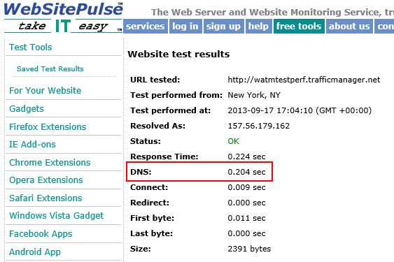

<properties
    pageTitle="Leistungsaspekte für Azure Datenverkehr Manager | Microsoft Azure"
    description="Verstehen der Leistung von Datenverkehr Manager und wie die Leistung Ihrer Website getestet werden bei Verwendung von Datenverkehr-Manager"
    services="traffic-manager"
    documentationCenter=""
    authors="sdwheeler"
    manager="carmonm"
    editor=""
/>
<tags
    ms.service="traffic-manager"
    ms.devlang="na"
    ms.topic="article"
    ms.tgt_pltfrm="na"
    ms.workload="infrastructure-services"
    ms.date="10/11/2016"
    ms.author="sewhee"
/>

# Leistungsaspekte für den Datenverkehr-Manager

Diese Seite erläutert Performance-Aspekte, die mit den Datenverkehr-Manager. Erwägen Sie das folgende Szenario:

Instanzen von Ihrer Website wurden auf die Regionen WestUS und ostasiatische. Eine der Instanzen ist die integritätsprüfung für den Datenverkehr Manager Prüfpunkt fehl. Anwendungsdatenverkehr wird in der Region fehlerfrei geleitet. Diese Failover erwartet wird, aber Leistung kann ausgehend von der Wartezeit des Datenverkehrs jetzt unterwegs fernen Region ein anderes Problem werden.

## Funktionsweise der Datenverkehr-Manager

Der einzige Leistung durch, die Datenverkehr Manager auf Ihrer Website verfügen kann ist die ursprüngliche DNS-Suche. Eine DNS-Anforderung für den Namen Ihres Profils Datenverkehr Manager wird vom Microsoft DNS Stammserver behandelt, die Host für die Zone trafficmanager.net. Datenverkehr Manager füllt und regelmäßig aktualisiert, die Microsoft DNS-Stammserver basierend auf die Richtlinie für den Datenverkehr Manager und des Ergebnisses der Prüfpunkt. Also auch während der ersten DNS-Suche werden keine DNS-Abfragen mit den Datenverkehr Manager gesendet.

Datenverkehr Manager besteht aus mehreren Komponenten: Nennen Sie DNS-Servern, eine API-Dienst, den Layer Speicher und einen Endpunkt Überwachung Dienst. Wenn eine Datenverkehr Manager-Service-Komponente fehlschlägt, besteht keine Auswirkung auf den DNS-Namen Ihres Profils Datenverkehr Manager zugeordnet. Die Datensätze in der Microsoft-DNS-Servers bleiben unverändert. Endpunkt für die Überwachung und Aktualisieren von DNS-jedoch nicht erfolgen. Daher kann Datenverkehr Manager nicht zum Aktualisieren von DNS-Einträge zu Ihrer Website Failover verweisen, wenn der primären Standort-fällt aus.

Mit einer Auflösung von DNS-Namen ist schnell und Ergebnisse zwischengespeichert werden. Die Geschwindigkeit von der ersten DNS-Suche hängt die DNS-Server, den, die der Client für die namensauflösung verwendet. Normalerweise kann ein Client eine DNS-Suche in ~ 50 ms durchführen. Die Ergebnisse der Suche für die Dauer der DNS-Time-to-live (TTL), zwischengespeichert werden. Die Standard-TTL für den Datenverkehr Manager ist 300 Sekunden.

Datenverkehr wird nicht durch den Datenverkehr Manager übergeben. Sobald die DNS-Suche abgeschlossen ist, hat der Client eine IP-Adresse für eine Instanz von Ihrer Website an. Der Client eine Verbindung herstellt, direkt an diese Adresse und übergibt nicht über den Datenverkehr-Manager. Die Richtlinie Datenverkehr Manager, die Sie wählen hat keinen Einfluss auf die Leistung des DNS. Jedoch kann eine Leistung routing-Methode mit der Anwendung beeinträchtigen. Angenommen, wenn die Richtlinie Datenverkehr von Nordamerika eine Instanz gehostet in Asien leitet, im Netzwerkwartezeit für diese Sitzung ein Leistungsproblem möglicherweise.

## Messen Datenverkehr Manager der Leistung

Es gibt mehrere Websites, die Sie verwenden können, um die Leistung und das Verhalten eines Profils Datenverkehr Manager zu verstehen. Viele der folgenden Websites sind kostenlos, aber möglicherweise Einschränkungen. Einige Websites bieten erweiterte Überwachung und reporting für eine Gebühr.

Die Tools auf diesen Websites Measure DNS-Wartezeiten und Anzeige der gelöst IP-Adressen von für Client Orte auf der ganzen Welt. Die meisten dieser Tools Zwischenspeichern nicht die DNS-Ergebnisse. Daher anzeigen die Tools die vollständige DNS-Suche jedes Mal, wenn ein Test ausgeführt wird. Wenn Sie Ihre eigenen Desktopclient testen, die Leistung Sie nur die vollständige DNS Nachschlagen einmal während der Dauer TTL.

## Beispiel für Tools DNS-Leistung messen

- [SolveDNS](http://www.solvedns.com/dns-comparison/)

    SolveDNS bietet viele Performance Tools. Das Tool für die DNS-Vergleich können Sie anzeigen, wie lange dauert Ihre DNS-Namen auflösen und die Vergleich zu anderen DNS-Dienstanbieter.

- [WebSitePulse](http://www.websitepulse.com/help/tools.php)

    Eines der Tools einfachste ist WebSitePulse. Geben Sie die URL, um die DNS-Auflösungszeit, erste Byte gibt, letzte Byte und andere Leistungsstatistiken anzuzeigen. Sie können drei verschiedene Test Orten auswählen. In diesem Beispiel sehen Sie, dass die erste Ausführung zeigt, dass die DNS-Suche 0.204 Sekunden dauert.

    

    Da die Ergebnisse zwischengespeichert werden, hat der zweite Test für den gleichen Datenverkehr Manager Endpunkt 0.002 sec an die DNS-Suche.

    

- [Zertifizierungsstelle App synthetisches Monitor](https://asm.ca.com/en/checkit.php)

    Früher bekannt als das Tool Watchmouse Kontrollkästchen Website, diese Website zeigen, werden die DNS-Auflösungszeit von mehreren geographischen Regionen gleichzeitig. Geben Sie die URL zum Anzeigen der DNS-Auflösungszeit, Verbindungszeit und die Geschwindigkeit von mehreren geografischen Standorten aus. Verwenden Sie diesen Test, um anzuzeigen, welche gehosteter Dienst für unterschiedlichen Standorten auf der ganzen Welt zurückgegeben wird.

    

- [Pingdom](http://tools.pingdom.com/)

    Dieses Tool bietet Leistungsstatistiken für jedes Element von einer Webseite. Die Registerkarte Seite Analyse zeigt den Prozentsatz der Zeit auf DNS-Suche.

- [Was ist meine DNS?](http://www.whatsmydns.net/)

    Diese Website ist eine DNS-Suche von 20 unterschiedlichen Standorten und die Ergebnisse auf einer Karte angezeigt.

- [Einsteigen Web-Oberfläche](http://www.digwebinterface.com)

    Diese Website zeigt detailliertere einschließlich CNAMEs und A-Einträge von DNS-Informationen. Vergewissern Sie sich, aktivieren Sie unter Optionen 'Einfärben Ausgabefenster' und 'Stats', und wählen Sie 'Alle' unter Nameservers.

## Nächste Schritte

[Zu den Datenverkehr Manager Datenverkehr Weiterleitung Methoden](traffic-manager-routing-methods.md)

[Testen Sie Ihre Datenverkehr-Manager](traffic-manager-testing-settings.md)

[Vorgänge auf den Datenverkehr Manager (REST-API-Referenz)](http://go.microsoft.com/fwlink/?LinkId=313584)

[Azure Datenverkehr Manager-Cmdlets](http://go.microsoft.com/fwlink/p/?LinkId=400769)
