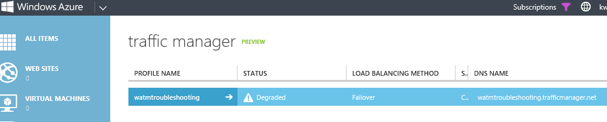

<properties
    pageTitle="Problembehandlung bei heruntergestuft Status auf Azure Datenverkehr-Manager"
    description="Behebung von Profilen Datenverkehr-Managers, wenn es als zeigt heruntergestuft Status."
    services="traffic-manager"
    documentationCenter=""
    authors="sdwheeler"
    manager="carmonm"
    editor=""
/>
<tags
    ms.service="traffic-manager"
    ms.devlang="na"
    ms.topic="article"
    ms.tgt_pltfrm="na"
    ms.workload="infrastructure-services"
    ms.date="10/11/2016"
    ms.author="sewhee"
/>

# <a name="troubleshooting-degraded-state-on-azure-traffic-manager"></a>Problembehandlung bei Zustand auf Azure Datenverkehr Manager heruntergestuft

Dieser Artikel beschreibt, wie ein Profil Azure Datenverkehr Manager behandelt, die einen beeinträchtigt Status angezeigt wird. In diesem Szenario erwägen Sie, dass Sie auf einige Ihrer Dienste gehostet cloudapp.net zeigen den Datenverkehr Manager Profil konfiguriert haben. Wenn Sie die Integrität des Ihren Vorgesetzten Datenverkehr aktivieren, wird, dass der Status heruntergestuft ist.



Wenn Sie in der Registerkarte Endpunkte des Profils wechseln, wird eine oder mehrere der Endpunkte des mit einer Status "Offline":


## <a name="understanding-traffic-manager-probes"></a>Grundlegendes zu den Datenverkehr Manager untersucht

- Datenverkehr Manager betrachtet einen Endpunkt ONLINE werden nur, wenn der Prüfpunkt eine HTTP 200 Antwort von den Pfad Prüfpunkt erhält. Alle anderen nicht 200 Antwort ist ein Fehler.
- Eine Umleitung 30 X schlägt fehl, auch wenn die URL umgeleitete, eine 200 zurückgibt.
- Für HTTPs-Prüfpunkte werden Zertifikatfehler ignoriert.
- Der tatsächliche Inhalt des Pfads Prüfpunkt spielt keine Rolle, solange eine 200 zurückgegeben wird. Überprüfung einer URL zu statischem Inhalt wie "/ favicon.ico" ist ein gebräuchliches Verfahren. Dynamische Inhalte, wie die ASP-Seiten möglicherweise nicht immer 200, zurück, selbst wenn die Anwendung fehlerfrei ist.
- Bewährte Methode ist den Prüfpunkt-Pfad auf einen anderen Wert festgelegt, die verfügt über genügend Logik feststellen, dass die Website nach oben oder unten ist. Im vorherigen Beispiel, indem Sie auf den Pfad "/ favicon.ico", werden nur die w3wp.exe testen reagiert. Dieser Prüfpunkt möglicherweise nicht darauf hinzuweisen, dass die Webanwendung fehlerfrei ist. Eine bessere Option wäre, um einen Pfad auf eine bestimmte wie "/ Probe.aspx", auf dem Logik, um die Integrität der Website zu bestimmen. Beispielsweise konnte Sie Leistungsindikatoren zu CPU-Auslastung verwenden oder messen die Anzahl der Fehler beim Anfragen. Oder Sie könnte versuchen, die von Datenbankressourcen oder Sitzungszustand, um sicherzustellen, dass die Webanwendung arbeitet, zugreifen.
- Wenn alle Endpunkte in einem Profil heruntergestuft sind, behandelt Datenverkehr Manager alle Endpunkte als fehlerfrei und leitet den Datenverkehr an alle Endpunkte. Dieses Verhalten wird sichergestellt, dass Probleme mit der Überprüfungsmechanismus keine vollständige Ausfall Ihres Dienstes führen.

## <a name="troubleshooting"></a>Behandlung von Problemen

Um ein Prüfpunkt Fehler zu beheben, benötigen Sie ein Tool, das den HTTP-Code, der aus der Prüfpunkt URL zurückgegeben wird. Es gibt zahlreiche Tools, die Ihnen zeigen, dass die unformatierte HTTP-Antwort ein.

* [Fiddler](http://www.telerik.com/fiddler)
* [Aufrollen](https://curl.haxx.se/)
* [wget](http://gnuwin32.sourceforge.net/packages/wget.htm)

Darüber hinaus können Sie die Registerkarte Netzwerk F12 Tools für das Debuggen in Internet Explorer verwenden, die HTTP-Antworten anzeigen.

In diesem Beispiel wird die Antwort aus unserem Prüfpunkt URL anzeigen möchten: Http://watestsdp2008r2.cloudapp.net:80/Prüfpunkt. Das folgende PowerShell-Beispiel veranschaulicht das Problem.

```powershell
    Invoke-WebRequest 'http://watestsdp2008r2.cloudapp.net/Probe' -MaximumRedirection 0 -ErrorAction SilentlyContinue | Select-Object StatusCode,StatusDescription
```

Beispiel für die Ausgabe:

```text
    StatusCode StatusDescription
    ---------- -----------------
            301 Moved Permanently
```

Beachten Sie, dass wir eine Umleitungsantwort erhalten. Wie zuvor alle StatusCode als angegeben ist 200 als fehlgeschlagen angesehen. Datenverkehr Manager ändert den Endpunkt Status auf Offline. Um das Problem zu beheben, überprüfen Sie die Website-Konfiguration, um sicherzustellen, dass die richtigen StatusCode aus dem Pfad Prüfpunkt zurückgegeben werden kann. Konfigurieren des Prüfpunkts Datenverkehr-Manager auf einen Pfad verweisen, der eine 200 zurückgibt.

Wenn Ihre Prüfpunkt das HTTPS-Protokoll verwendet wird, müssen Sie möglicherweise zur Vermeidung von SSL/TLS-Fehler während Ihrer Tests überprüfen von Zertifikaten deaktivieren. Die folgenden Aussagen PowerShell Validierung von Zertifikaten für die aktuelle Sitzung PowerShell zu deaktivieren:

```powershell
    add-type @"
    using System.Net;
    using System.Security.Cryptography.X509Certificates;
    public class TrustAllCertsPolicy : ICertificatePolicy {
        public bool CheckValidationResult(
        ServicePoint srvPoint, X509Certificate certificate,
        WebRequest request, int certificateProblem) {
        return true;
        }
    }
    "@
    [System.Net.ServicePointManager]::CertificatePolicy = New-Object TrustAllCertsPolicy
```

## <a name="next-steps"></a>Nächste Schritte

[Zu den Datenverkehr Manager Datenverkehr Weiterleitung Methoden](traffic-manager-routing-methods.md)

[Was ist Datenverkehr Manager](traffic-manager-overview.md)

[Cloud-Dienste](http://go.microsoft.com/fwlink/?LinkId=314074)

[Azure Web Apps](https://azure.microsoft.com/documentation/services/app-service/web/)

[Vorgänge auf den Datenverkehr Manager (REST-API-Referenz)](http://go.microsoft.com/fwlink/?LinkId=313584)

[Azure Datenverkehr Manager-Cmdlets][1]

[1]: https://msdn.microsoft.com/library/mt125941(v=azure.200).aspx
