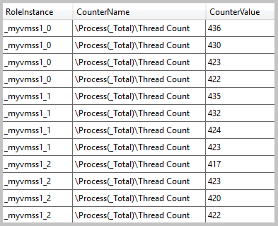
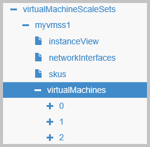
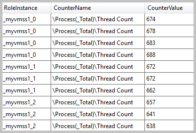
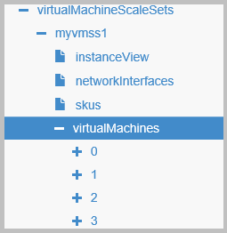

<properties
    pageTitle="Automatische Skalierung und virtuellen Computern skalieren Sätze | Microsoft Azure"
    description="Informationen Sie zur Verwendung von Diagnose und Ressourcen automatisch Skalieren um virtuellen Computern automatisch in einer Gruppe von Farben-Skala zu skalieren."
    services="virtual-machine-scale-sets"
    documentationCenter=""
    authors="davidmu1"
    manager="timlt"
    editor=""
    tags="azure-resource-manager"/>

<tags
    ms.service="virtual-machine-scale-sets"
    ms.workload="infrastructure-services"
    ms.tgt_pltfrm="na"
    ms.devlang="na"
    ms.topic="article"
    ms.date="10/18/2016"
    ms.author="davidmu"/>

# Automatische Skalierung und virtuellen Computern skalieren Datensätze

Automatische Skalierung von virtuellen Computern in einer Gruppe von Farben-Skala ist das Erstellen oder Löschen von Autos in der Gruppe Bedarf Leistung Anforderungen entsprechen. Zunehmender die Lautstärke der Arbeit möglicherweise eine Anwendung effektiv Aufgaben ausführen aktivieren zusätzliche Ressourcen benötigen.

Automatische Skalierung ist ein automatisierter Prozess, dass Verwaltungsaufwand erleichtert. Durch Aufwand verringern, müssen Sie nicht ständig Überwachen der Systemleistung oder entscheiden, wie Ressourcen verwalten. Skalierung ist ein flexible Prozess. Weitere Ressourcen, die als Last hinzugefügt werden können, aber als Bedarf Ressourcen verringert Kosten minimieren und Verwalten von Ebenen Leistung entfernt werden können.

Richten Sie automatische Skalierung auf einer Skala mithilfe einer Vorlage Azure Ressourcenmanager, Azure PowerShell, Azure CLI oder Azure-Portal festlegen.

## Mithilfe von Vorlagen Ressourcenmanager Skalierung einrichten

Anstatt bereitstellen und Verwalten von jeder Ressource der Anwendung separat, verwenden eine Vorlage, die alle Ressourcen in einem einzigen, koordinierte Vorgang bereitstellt. In der Vorlage Anwendungsressourcen definiert sind und Bereitstellungsparameter für die verschiedenen Umgebungen angegeben sind. Die Vorlage besteht aus JSON und Ausdrücke, die Sie verwenden können, um Werte für die Bereitstellung zu erstellen. Prüfen Sie weitere [Azure Ressourcenmanager Authoring-Vorlagen](../resource-group-authoring-templates.md)aus.

In der Vorlage Geben Sie das Element Kapazität:

    "sku": {
      "name": "Standard_A0",
      "tier": "Standard",
      "capacity": 3
    },

Kapazität gibt die Anzahl der virtuellen Computern festlegen. Sie können die Kapazität manuell ändern, indem Sie eine Vorlage mit einem anderen Wert. Wenn Sie eine Vorlage, um nur die Kapazität ändern bereitstellen, können Sie nur das SKU Element mit der aktualisierten Kapazität einbeziehen.

Die Kapazität von Ihren Maßstab festlegen, indem Sie die Kombination der Ressource AutoscaleSettings und die Erweiterung Diagnose nicht automatisch geändert.

### Konfigurieren Sie die Erweiterung Azure-Diagnose

Automatische Skalierung ist nur möglich, wenn Kennzahlen Websitesammlung auf jedem virtuellen Computer in der Gruppe skalieren erfolgreich ist. Diese Azure-Diagnose-Erweiterung bietet die Überwachung und Diagnose Funktionen, die die Anforderungen Kennzahlen Auflistung der Ressource automatisch skalieren entspricht. Sie können die Erweiterung als Teil der Vorlage Ressourcenmanager installieren.

Dieses Beispiel zeigt die Variablen, mit denen in der Vorlage die Erweiterung Diagnose konfigurieren:

    "diagnosticsStorageAccountName": "[concat(parameters('resourcePrefix'), 'saa')]",
    "accountid": "[concat('/subscriptions/',subscription().subscriptionId,'/resourceGroups/', resourceGroup().name,'/providers/', 'Microsoft.Storage/storageAccounts/', variables('diagnosticsStorageAccountName'))]",
    "wadlogs": "<WadCfg> <DiagnosticMonitorConfiguration overallQuotaInMB=\"4096\" xmlns=\"http://schemas.microsoft.com/ServiceHosting/2010/10/DiagnosticsConfiguration\"> <DiagnosticInfrastructureLogs scheduledTransferLogLevelFilter=\"Error\"/> <WindowsEventLog scheduledTransferPeriod=\"PT1M\" > <DataSource name=\"Application!*[System[(Level = 1 or Level = 2)]]\" /> <DataSource name=\"Security!*[System[(Level = 1 or Level = 2)]]\" /> <DataSource name=\"System!*[System[(Level = 1 or Level = 2)]]\" /></WindowsEventLog>",
    "wadperfcounter": "<PerformanceCounters scheduledTransferPeriod=\"PT1M\"><PerformanceCounterConfiguration counterSpecifier=\"\\Processor(_Total)\\Thread Count\" sampleRate=\"PT15S\" unit=\"Percent\"><annotation displayName=\"Thread Count\" locale=\"en-us\"/></PerformanceCounterConfiguration></PerformanceCounters>",
    "wadcfgxstart": "[concat(variables('wadlogs'),variables('wadperfcounter'),'<Metrics resourceId=\"')]",
    "wadmetricsresourceid": "[concat('/subscriptions/',subscription().subscriptionId,'/resourceGroups/',resourceGroup().name ,'/providers/','Microsoft.Compute/virtualMachineScaleSets/',parameters('vmssName'))]",
    "wadcfgxend": "[concat('\"><MetricAggregation scheduledTransferPeriod=\"PT1H\"/><MetricAggregation scheduledTransferPeriod=\"PT1M\"/></Metrics></DiagnosticMonitorConfiguration></WadCfg>')]"

Parameter werden bereitgestellt, wenn die Vorlage bereitgestellt wird. In diesem Beispiel wird der Name des Speicherkontos der Daten Speicherung und den Namen der Maßstab festlegen, aus denen Daten erfasst werden, bereitgestellt. In diesem Beispiel Windows Server ist auch nur der Thread Count Leistung Zähler erfasst. Alle verfügbaren Leistungsindikatoren in Windows oder Linux zum Sammeln von Diagnoseinformationen verwendet werden können und in der Erweiterung Konfiguration enthalten sein können.

Dieses Beispiel zeigt die Definition der Erweiterung in der Vorlage ein:

    "extensionProfile": {
      "extensions": [
        {
          "name": "Microsoft.Insights.VMDiagnosticsSettings",
          "properties": {
            "publisher": "Microsoft.Azure.Diagnostics",
            "type": "IaaSDiagnostics",
            "typeHandlerVersion": "1.5",
            "autoUpgradeMinorVersion": true,
            "settings": {
              "xmlCfg": "[base64(concat(variables('wadcfgxstart'),variables('wadmetricsresourceid'),variables('wadcfgxend')))]",
              "storageAccount": "[variables('diagnosticsStorageAccountName')]"
            },
            "protectedSettings": {
              "storageAccountName": "[variables('diagnosticsStorageAccountName')]",
              "storageAccountKey": "[listkeys(variables('accountid'), variables('apiVersion')).key1]",
              "storageAccountEndPoint": "https://core.windows.net"
            }
          }
        }
      ]
    }

Wenn die Erweiterung Diagnose ausgeführt wird, werden die Daten in einer Tabelle erfasst, die im Speicherkonto befindet, den Sie angeben. Suchen Sie in der Tabelle WADPerformanceCounters gesammelten Daten:

### Konfigurieren der Ressource autoScaleSettings

Die Ressource AutoscaleSettings verwendet die Informationen aus der Erweiterung Diagnose entscheiden können, ob zum Vergrößern oder verkleinern die Anzahl der virtuellen Computern Skalieren festlegen.

Dieses Beispiel zeigt die Konfiguration der Ressource in der Vorlage ein:

    {
      "type": "Microsoft.Insights/autoscaleSettings",
      "apiVersion": "2015-04-01",
      "name": "[concat(parameters('resourcePrefix'),'as1')]",
      "location": "[resourceGroup().location]",
      "dependsOn": [
        "[concat('Microsoft.Compute/virtualMachineScaleSets/',parameters('vmSSName'))]"
      ],
      "properties": {
        "enabled": true,
        "name": "[concat(parameters('resourcePrefix'),'as1')]",
        "profiles": [
          {
            "name": "Profile1",
            "capacity": {
              "minimum": "1",
              "maximum": "10",
              "default": "1"
            },
            "rules": [
              {
                "metricTrigger": {
                  "metricName": "\\Process(_Total)\\Thread Count",
                  "metricNamespace": "",
                  "metricResourceUri": "[concat('/subscriptions/',subscription().subscriptionId, '/resourceGroups/', resourceGroup().name, '/providers/Microsoft.Compute/virtualMachineScaleSets/', parameters('vmSSName'))]",
                  "timeGrain": "PT1M",
                  "statistic": "Average",
                  "timeWindow": "PT5M",
                  "timeAggregation": "Average",
                  "operator": "GreaterThan",
                  "threshold": 650
                },
                "scaleAction": {
                  "direction": "Increase",
                  "type": "ChangeCount",
                  "value": "1",
                  "cooldown": "PT5M"
                }
              },
              {
                "metricTrigger": {
                  "metricName": "\\Process(_Total)\\Thread Count",
                  "metricNamespace": "",
                  "metricResourceUri": "[concat('/subscriptions/',subscription().subscriptionId, '/resourceGroups/', resourceGroup().name, '/providers/Microsoft.Compute/virtualMachineScaleSets/', parameters('vmSSName'))]",
                  "timeGrain": "PT1M",
                  "statistic": "Average",
                  "timeWindow": "PT5M",
                  "timeAggregation": "Average",
                  "operator": "LessThan",
                  "threshold": 550
                },
                "scaleAction": {
                  "direction": "Decrease",
                  "type": "ChangeCount",
                  "value": "1",
                  "cooldown": "PT5M"
                }
              }
            ]
          }
        ],
        "targetResourceUri": "[concat('/subscriptions/', subscription().subscriptionId, '/resourceGroups/', resourceGroup().name, '/providers/Microsoft.Compute/virtualMachineScaleSets/', parameters('vmSSName'))]"
      }
    }

Im Beispiel oben werden zwei Regeln erstellt, für die automatischen Skalierung Aktionen definieren. Die erste Regel definiert die Aktion skalieren möchten, und die zweite Regel definiert die Skalierung in Aktion. Diese Werte werden in den Regeln bereitgestellt:

- **MetricName** - dieser Wert entspricht der Leistung Zähler, den Sie in der Variablen Wadperfcounter für die Erweiterung Diagnose definiert ist. Im obigen Beispiel wird der Zähler Thread Count verwendet.  
- **MetricResourceUri** - dieser Wert wird den Resource Identifier des virtuellen Computers Maßstab festlegen. Dieser Bezeichner enthält den Namen der Ressourcengruppe, den Namen der Ressourcenanbieters und den Namen der Skala zu skalieren festlegen.
- **TimeGrain** – ist dieser Wert die Genauigkeit der die Metrik, die erfasst wurden. Im vorherigen Beispiel werden die Daten auf ein Intervall von einer Minute gesammelt. Dieser Wert wird mit Zeitfenster verwendet.
- **Statistik** – dieser Wert bestimmt, wie der Metrik, die kombiniert werden, um die automatische Skalierung Aktion aufnehmen zu können. Mögliche Werte sind: Mittelwert, Min, Max.
- **Zeitfenster** – ist dieser Wert den Zellbereich, der Uhrzeit in dem Instanzdaten erfasst werden. Zwischen 5 Minuten und 12 Stunden Wert muss liegen.
- **TimeAggregation** – dieser Wert bestimmt, wie die gesammelten Daten über einen Zeitraum kombiniert werden sollen. Der Standardwert ist Mittelwert. Mögliche Werte sind: Mittelwert, Minimum, Maximum, letzten, Summe, Anzahl.
- **Operator** – ist dieses Werts den Operator, mit dem die metrischen Daten und den Schwellenwert für den Vergleich. Mögliche Werte sind: gleich, NotEquals, größer als, GreaterThanOrEqual, LessThan, LessThanOrEqual.
- **Schwellenwert** – ist dieser Wert den Wert, der die Maßstab Aktion auslöst. Achten Sie darauf, dass einen ausreichend Unterschied zwischen den Schwellenwert für die Aktion Skalierung und den Schwellenwert für die Skalierung in Aktion angeben. Wenn Sie die Werte identisch sein festlegen, geht das System Konstante ändern, die verhindert, dass es Implementierung einer Anpassungsbereich für Aktion aus. Zum Beispiel funktioniert nicht beide zu 600 Threads im vorherigen Beispiel festlegen.
- **Richtung** – bestimmt dieser Wert die Aktion, die ausgeführt wird, wenn der Schwellenwert erreicht ist. Die möglichen Werte sind erhöhen oder verringern.
- **Typ** – ist dieser Wert den Typ der Aktion, die erfolgen sollte und muss auf ChangeCount festgelegt sein.
- **Wert** – ist dieser Wert die Anzahl der virtuellen Computern, die hinzugefügt oder aus den Maßstab entfernt werden. Dieser Wert muss 1 oder größer sein.
- **Cooldown** – ist dieser Wert die Zeitspanne seit der letzten Anpassungsbereich für Aktion warten, bevor die nächste Aktion auftritt. Dieser Wert muss zwischen einer Minute und eine Woche liegen.

Je nach der Leistung Zähler abgegeben haben, werden einige der Elemente in der Vorlagenkonfiguration anders verwendet. Im vorherigen Beispiel der Leistung Zähler ist Thread Count der Schwellenwert ist für eine Aktion Skalierung 650 und der Schwellenwert ist 550 für die Skalierung in Aktion. Wenn Sie einen Indikator, wie etwa % Prozessor Time verwenden, ist der Schwellenwert zum gewünschten Prozentsatz der CPU-Auslastung festgelegt werden, eine Aktion Anpassungsbereich für bestimmt.

Wenn eine Last auf den virtuellen Computern, die eine Skalierung Aktion auslöst erstellt wurde, wird die Kapazität über die Sammlung basierend auf dem Wert in der Vorlage erhöht. Beispielsweise wird in einem Maßstab festlegen, wo die Kapazität auf 3 und den Maßstab Aktionswert festgelegt ist, auf 1 festgelegt:

Wenn die Last erstellt wird, durch die den durchschnittlichen Thread zählen, um über dem Schwellenwert 650 zu wechseln:

Eine Aktion Skalierung ausgelöst, bei dem die Kapazität des festlegen, um eins erhöht werden:

    "sku": {
      "name": "Standard_A0",
      "tier": "Standard",
      "capacity": 4
    },

Und die Skalierung festlegen ein virtuellen Computers hinzugefügt:

Nach einer bestimmten Cooldown fünf Minuten wird die durchschnittliche Anzahl der Threads auf den Computern über 600, bleibt einem anderen Computer die Menge hinzugefügt. Wenn die Threadanzahl der Mittelwert unter 550 bleibt, um eins reduziert die Kapazität der Skalierung festlegen und ein Computer aus der Gruppe entfernt wird.

## Einrichten von Skalierung mithilfe der PowerShell Azure

Um Beispiele für die Verwendung der PowerShell automatische Skalierung einrichten anzuzeigen, betrachten Sie [Azure Monitor PowerShell Symbolleiste Starten von Beispielen](../monitoring-and-diagnostics/insights-powershell-samples.md).

## Einrichten von Azure CLI mit Skalierung

Um Beispiele für die Verwendung von Azure CLI automatische Skalierung einrichten anzuzeigen, betrachten Sie [Azure Monitor Plattformen CLI Symbolleiste Starten von Beispielen](../monitoring-and-diagnostics/insights-cli-samples.md).

## Einrichten von Skalierung über das Azure-portal

Betrachten Sie sich zum Beispiel mit dem Azure-Portal automatische Skalierung einrichten angezeigt wird, [Erstellen einer virtuellen Computern Skalierung festlegen mithilfe des Azure-Portals](virtual-machine-scale-sets-portal-create.md)an.

## Ermitteln der Skalierung Aktionen

- [Azure-Portal]() – aktuell gelangen Sie Informationen über das Portal für einen bestimmten Zeitraum.
- [Azure Ressource Explorer]() - dieses Tool ist das beste für untersuchen den aktuellen Status der Skalierung zurück. Folgen Sie diesem Pfad und Sie die Instanzansicht Maßstab festlegen, die Sie erstellt auftreten: Abonnements > {Ihr Abonnement} > ResourceGroups > {Ressourcengruppe} > Anbieter > Microsoft.Compute > VirtualMachineScaleSets > {einer Gruppe skalieren} > VirtualMachines
- Azure PowerShell - verwenden Sie diesen Befehl, um einige Informationen zu erhalten:

        Get-AzureRmResource -name vmsstest1 -ResourceGroupName vmsstestrg1 -ResourceType Microsoft.Compute/virtualMachineScaleSets -ApiVersion 2015-06-15
        Get-Autoscalesetting -ResourceGroup rainvmss -DetailedOutput

- Herstellen einer Verbindung mit Jumpbox virtuellen Computers so, wie Sie möchten, dass alle anderen Computer und dann Sie den virtuellen Computern in den Maßstab festlegen, um einzelne Prozesse überwachen Remote zugreifen können.

## Nächste Schritte

- Schauen Sie sich zum Beispiel zum Erstellen einer Skala mit der automatischen Skalierung konfiguriert festlegen finden Sie unter [Skalieren automatisch auf Computern in einer virtuellen Computern Skalierung festlegen](virtual-machine-scale-sets-windows-autoscale.md) .
- Finden Sie Beispiele für Azure Monitor Überwachungsfeatures in [Azure Monitor PowerShell Symbolleiste Starten von Beispielen](../monitoring-and-diagnostics/insights-powershell-samples.md)
- Informationen Sie zu Benachrichtigung Features in [automatisch skalieren Aktionen zum Senden von e-Mail- und Webhook-Benachrichtigung in Azure Monitor verwenden](../monitoring-and-diagnostics/insights-autoscale-to-webhook-email.md).
- Informationen Sie zum [Verwenden der Überwachungsprotokolle zum Senden von e-Mail- und Webhook-Benachrichtigung in Azure Monitor](../monitoring-and-diagnostics/insights-auditlog-to-webhook-email.md)
- Lernen Sie [Erweiterte automatisch skalieren Szenarien](./virtual-machine-scale-sets-advanced-autoscale.md)aus.
