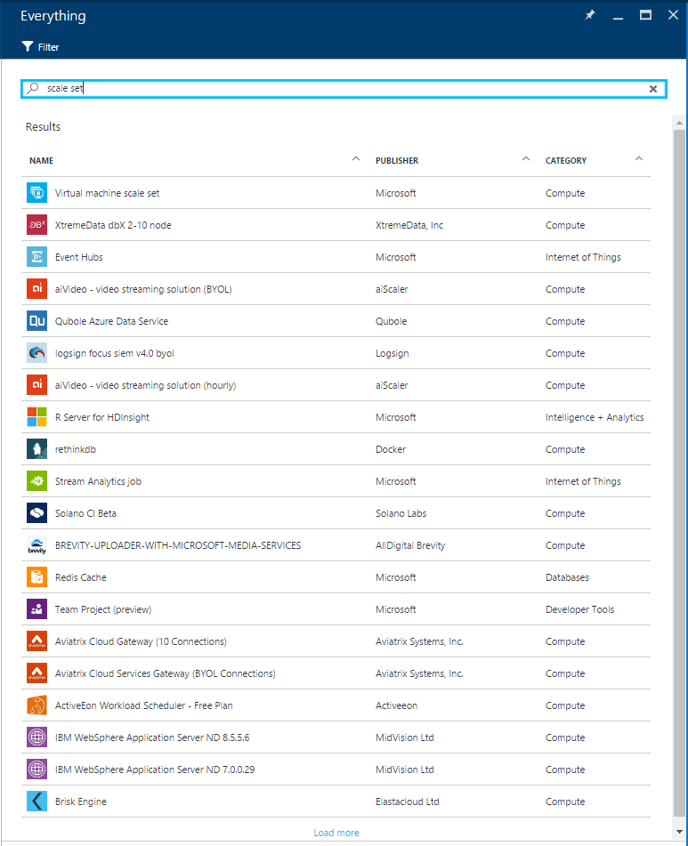
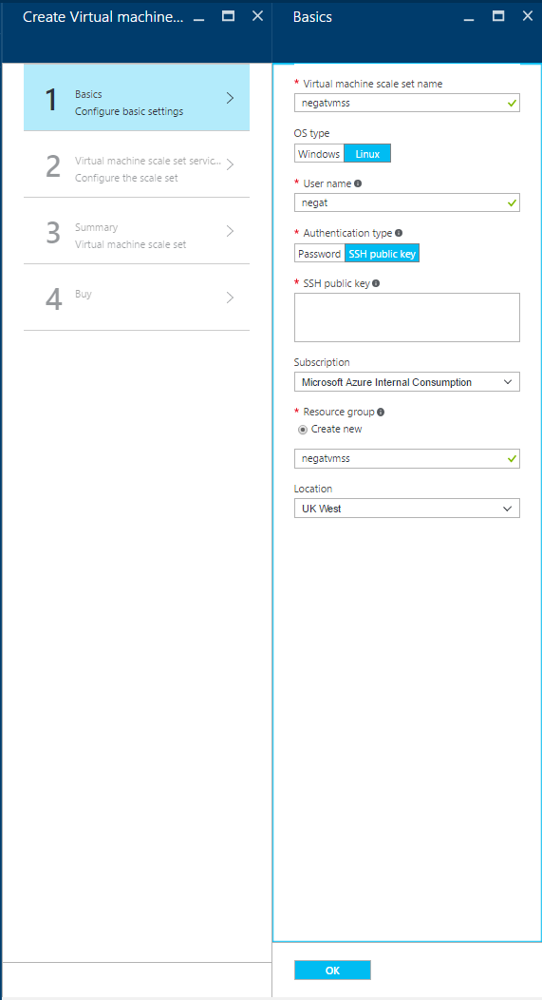
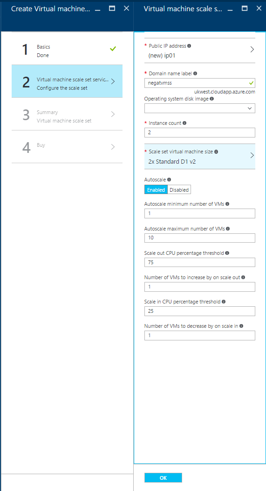
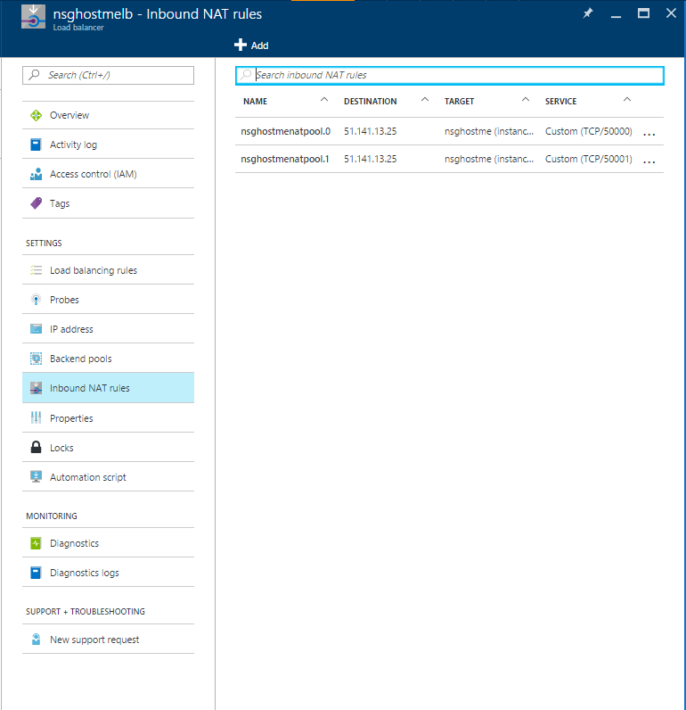

<properties
    pageTitle="Erstellen einer virtuellen Computern skalieren Set mithilfe des Azure-Portals | Microsoft Azure"
    description="Bereitstellen Sie Maßstab Sätze aus Azure-Portal an."
    keywords="virtuellen Computern skalieren Datensätze" 
    services="virtual-machine-scale-sets"
    documentationCenter=""
    authors="gatneil"
    manager="madhana"
    editor="tysonn"
    tags="azure-resource-manager" />

<tags
    ms.service="virtual-machine-scale-sets"
    ms.workload="infrastructure-services"
    ms.tgt_pltfrm="vm"
    ms.devlang="na"
    ms.topic="article"
    ms.date="09/15/2016"
    ms.author="gatneil"/>

# Erstellen einer virtuellen Computern skalieren Set mithilfe des Azure-Portals

In diesem Lernprogramm erfahren Sie, wie einfach es ist, virtuellen Computern Skalierung festlegen in wenigen Minuten, erstellen Sie mithilfe des Azure-Portals. Wenn Sie ein Azure-Abonnement besitzen, erstellen Sie ein [kostenloses Konto](https://azure.microsoft.com/free/) , bevor Sie beginnen.

## Wählen Sie das Bild virtueller Computer vom marketplace

Im Portal können Sie problemlos eine Skala mit CentOS, CoreOS, Debian, Suse öffnen, Red Hat Enterprise Linux, SUSE Linux Enterprise Server, Ubuntu-Server oder Windows Server Bilder festlegen bereitstellen.

Navigieren Sie zuerst auf das [Portal Azure](https://portal.azure.com) in einem Webbrowser. Klicken Sie auf `New`, suchen Sie nach `scale set`, und wählen Sie dann die `Virtual machine scale set` Eintrag:

## Erstellen der Linux virtuellen Computern

Nun können Sie die Standardeinstellungen verwenden und schnell des virtuellen Computers zu erstellen.

* Klicken Sie auf die `Basics` Blade, geben Sie einen Namen für die Skalierung festlegen. Dieser Name wird die Basis des FQDN des Lastenausgleich vor der Skalierung festlegen, daher sollten Sie sicherstellen, dass der Namen aller Azure eindeutig ist.

* Auswählen, die der gewünschten OS geben, geben Sie die gewünschten Ihren Benutzernamen ein, die und wählen Sie aus, welche Authentifizierung geben Sie, bevorzugen. Wenn Sie ein Kennwort auswählen, müssen sie mindestens 12 Zeichen lang sein und drei aus den folgenden vier Komplexität-Anforderungen entsprechen: einen Kleinbuchstaben, einen Großbuchstaben enthalten, eine Zahl und ein Sonderzeichen. Finden Sie weitere Informationen zu [Benutzername und Kennwort Anforderungen](../virtual-machines/virtual-machines-windows-faq.md#what-are-the-username-requirements-when-creating-a-vm). Falls gewünscht `SSH public key`, werden Sie sicherstellen, dass nur einfügen in Ihren öffentlichen Schlüssel, nicht Ihren privaten Schlüssel:

* Geben Sie die gewünschte Ressourcengruppennamen und einen Speicherort aus, und klicken Sie dann auf `OK`.

* Klicken Sie auf die `Virtual machine scale set service settings` Blade: Geben Sie das gewünschte Domäne Namen Etikett (die Basis des FQDN für den Lastenausgleich vor der Skalierung festlegen). Diese Beschriftung muss auf alle Azure eindeutig sein.

* Wählen Sie die gewünschte Betriebssystem Datenträger Bild-, Anzahl der Instanzen und Computer Größe aus.

* Aktivieren Sie oder deaktivieren Sie automatisch skalieren und konfigurieren Sie, wenn aktiviert:

* Klicken Sie auf die `Summary` Blade, wenn die Überprüfung abgeschlossen ist, klicken Sie auf `OK`.

* Schließlich auf die `Purchase` Blade, klicken Sie auf `Purchase` festzulegen, starten Sie den Maßstab der Bereitstellung.

## Herstellen einer Verbindung eines virtuellen Computers festlegen Skala mit

Sobald der Skalierung festlegen bereitgestellt wurde, navigieren Sie zu der `Inbound NAT Rules` Registerkarte des Lastenausgleich für die Skalierung festlegen:

Sie können mit jeder virtuelle Computer in die Skalierung set mithilfe dieser Regeln NAT herstellen. Beispielsweise für einen Windows-Skala Satz, ist es eine NAT-Regel auf eingehende Port 50000, Sie konnte Herstellen einer Verbindung mit diesem Computer über RDP auf `<load-balancer-ip-address>:50000`. Für einen Satz Linux skalieren, würde Verbinden mit dem Befehl `ssh -p 50000 <username>@<load-balancer-ip-address>`.

## Nächste Schritte

Dokumentation zur Bereitstellung von Maßstab Gruppen über die Befehlszeile finden Sie in [dieser Dokumentation](./virtual-machine-scale-sets-cli-quick-create.md).

Dokumentation zur Bereitstellung von Maßstab Mengen von PowerShell finden Sie in [dieser Dokumentation](./virtual-machine-scale-sets-windows-create.md).

Dokumentation zum Skalieren Mengen von Visual Studio bereitstellen finden Sie [Diese Dokumentation](./virtual-machine-scale-sets-vs-create.md).

Allgemeine Dokumentation Auschecken der [Dokumentation Übersichtsseite für Maßstab legt fest](./virtual-machine-scale-sets-overview.md).

Checken Sie nach allgemeinen Informationen der [Hauptseite für Maßstab Datensätze](https://azure.microsoft.com/services/virtual-machine-scale-sets/)aus.

