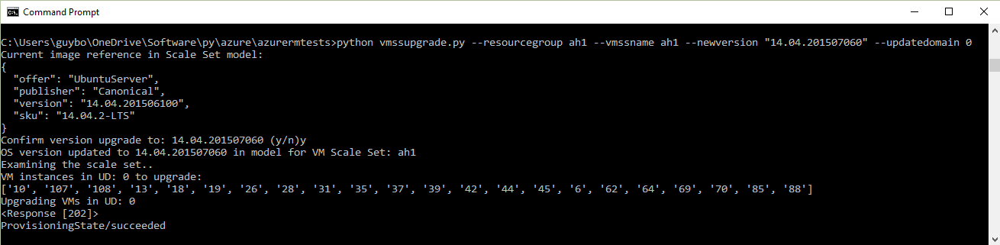
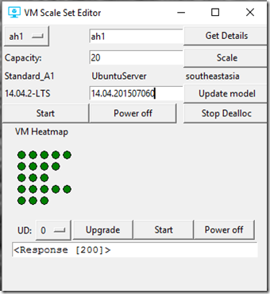
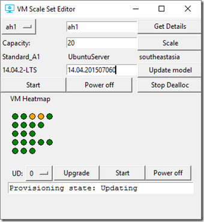

<properties
    pageTitle="Bereitstellen einer app auf virtuellen Computern skalieren Sätzen | Microsoft Azure"
    description="Bereitstellen einer app auf virtuellen Computern skalieren Sätzen"
    services="virtual-machine-scale-sets"
    documentationCenter=""
    authors="gbowerman"
    manager="timlt"
    editor=""
    tags="azure-resource-manager"/>

<tags
    ms.service="virtual-machine-scale-sets"
    ms.workload="na"
    ms.tgt_pltfrm="na"
    ms.devlang="na"
    ms.topic="article"
    ms.date="09/13/2016"
    ms.author="guybo"/>


# <a name="upgrade-a-virtual-machine-scale-set"></a>Aktualisieren eines virtuellen Computern Skalieren festlegen

Dieser Artikel beschreibt, wie Sie ein Update OS mit dem Maßstab einer Azure-virtuellen Computern ohne Ausfallzeit festlegen bereit können. In diesem Zusammenhang umfasst ein Update OS die Version oder SKU des Betriebssystems ändern oder den URI eines benutzerdefinierten Bilds ändern. Ohne Ausfallzeit bedeutet, dass nacheinander oder in Gruppen (wie etwa ein Fehlerstrukturanalyse-Domäne nacheinander) virtuellen Computern eine aktualisieren, anstatt alle gleichzeitig aktualisieren. Auf diese Weise können alle virtuellen Computern, die nicht aktualisiert werden weiterhin ausgeführt.

Um Mehrdeutigkeiten zu vermeiden, lassen Sie uns zu unterscheiden drei Arten von OS aktualisieren, die Sie möglicherweise ausführen möchten:

- Ändern die Version oder eines Bilds Plattform SKU. Beispielsweise ändern Ubuntu 14.04.2-LTS Version von 14.04.201506100 14.04.201507060, oder ändern die Ubuntu 15.10/neuesten SKU zu 16.04.0-LTS/latest. Dieses Szenario wird in diesem Artikel behandelt.

- Ändern des URIS, um eine neue Version von ein benutzerdefiniertes Bild Sie zeigt, erstellt (**Eigenschaften** > **VirtualMachineProfile** > **StorageProfile** > **OsDisk** > **Bild** > **Uri**). Dieses Szenario wird in diesem Artikel behandelt.

- Das Betriebssystem von innerhalb eines virtuellen Computers Patch (Beispiele hierfür sind ein Sicherheitspatch installieren und Ausführen von Windows Update). Dieses Szenario wird unterstützt, aber nicht in diesem Artikel behandelt.

Die ersten beiden Optionen sind unterstützte Anforderungen verdeckt werden, indem Sie in diesem Artikel. Sie müssen zum Erstellen einer neuen Skalierung festlegen, die dritte Option auszuführen.

Virtuellen Computern skalieren Datensätze, die als Teil einer [Azure Service Fabric](https://azure.microsoft.com/services/service-fabric/) Cluster bereitgestellt werden fallen nicht hier.

Die grundlegende Reihenfolge zum Ändern der OS Version/SKU eines Bilds Plattform oder den URI des ein benutzerdefiniertes Bild sieht wie folgt aus:

1. Erste Modell virtuellen Computern Skalieren festlegen.

2. Ändern der Version, SKU oder URI-Wert im Modell.

3. Aktualisieren Sie das Modell ein.

4. Führen Sie einen Anruf *ManualUpgrade* auf den virtuellen Computern Skalieren festlegen. Dieser Schritt ist nur relevant, wenn *UpgradePolicy* in einer Gruppe skalieren auf **manuell** festgelegt ist. Wenn sie auf **Automatische**festgelegt ist, werden alle virtuellen Computer gleichzeitig, aktualisiert, wodurch Ausfallzeiten.


Mit dieser Hintergrundinformationen Denken Sie daran sehen, wie Sie die Version von einer Skala festlegen in PowerShell, und klicken Sie mit der REST-API aktualisieren konnte. In diesen Beispielen behandelt die Groß-/Kleinschreibung von einem Plattform-Image, jedoch in diesem Artikel bietet ausreichende Informationen für Sie dieses Verfahren, um ein benutzerdefiniertes Bild anpassen.

## <a name="powershell"></a>PowerShell##

In diesem Beispiel wird einen Windows virtuellen Computern Maßstab festlegen auf die neue Version 4.0.20160229 aktualisiert. Nach dem Aktualisieren des Modells, geschieht dies Update einmal virtuellen Computern jeweils ein.

```powershell
$rgname = "myrg"
$vmssname = "myvmss"
$newversion = "4.0.20160229"
$instanceid = "1"

# get the VMSS model
$vmss = Get-AzureRmVmss -ResourceGroupName $rgname -VMScaleSetName $vmssname

# set the new version in the model data
$vmss.virtualMachineProfile.storageProfile.imageReference.version = $newversion

# update the virtual machine scale set model
Update-AzureRmVmss -ResourceGroupName $rgname -Name $vmssname -VirtualMachineScaleSet $vmss

# now start updating instances
Update-AzureRmVmssInstance -ResourceGroupName $rgname -VMScaleSetName $vmssname -InstanceId $instanceId
```

Wenn Sie den URI für ein benutzerdefiniertes Bild ändern einer Plattform Image-Version aktualisieren, ersetzen Sie die Zeile "legen Sie die neue Version" mit ungefähr wie folgt vor:

```powershell
# set the new version in the model data
$vmss.virtualMachineProfile.storageProfile.osDisk.image.uri= $newURI
```


## <a name="the-rest-api"></a>Die REST-API

Hier sind ein paar Python Beispiele, bei die die Azure REST-API zu verwenden, um ein OS Version Update bereit. Beide verwenden die Bibliothek lightweight [Azurerm](https://pypi.python.org/pypi/azurerm) von Azure REST-API Wrapperfunktionen für eine GET im Modell skalieren festlegen, gefolgt von einer sich mit einem aktualisierten Modell. Diese prüfen auch virtuellen Computern Instanzen Ansichten, um den virtuellen Computern Domäne aktualisieren zu identifizieren.

### <a name="vmssupgrade"></a>Vmssupgrade

 [Vmssupgrade](https://github.com/gbowerman/vmsstools) ist, dass eine Python-Skript, ein Upgrade des Betriebssystems zu einer laufenden virtuellen Computern Skala bereit verwendet wird, jeweils ein Update Domain festgelegt.



Mit diesem Skript können Sie auswählen bestimmter virtuellen Computern zu aktualisieren, oder geben Sie eine Domäne aktualisieren. Es unterstützt eine Version der Plattform Bild ändern oder den URI eines benutzerdefinierten Bilds ändern.

### <a name="vmsseditor"></a>Vmsseditor

[Vmsseditor](https://github.com/gbowerman/vmssdashboard) ist eine allgemeine-Editor für virtuellen Computern skalieren Mengen, der virtuellen Computern Status als eine Heatmap anzeigt, wobei eine Zeile ein Update Domain darstellt. Sie können unter anderem aktualisieren Sie das Modell für eine Reihe von Farben-Skala mit einer neuen Version, SKU oder benutzerdefiniertes Bild URI und wählen Sie dann Fehlerstrukturanalyse Domänen zu aktualisieren. Wenn Sie dies tun, werden alle virtuellen Computer in dieser Domäne aktualisieren auf das neue Modell aktualisiert. Alternativ können Sie ein paralleles Update basierend auf den der gewünschten Stapelgröße ausführen.  

Das folgende Bildschirmabbild zeigt ein Modell von einer Skala für Ubuntu 14.04-2LTS Version 14.04.201507060 festlegen. Viele weitere Optionen wurden dieses Tool hinzugefügt, da diese Abbildung geöffnet wurde.



Nachdem Sie auf **Aktualisieren** klicken und dann **Details abrufen**, virtuellen Computern in UD 0 aktualisieren.


