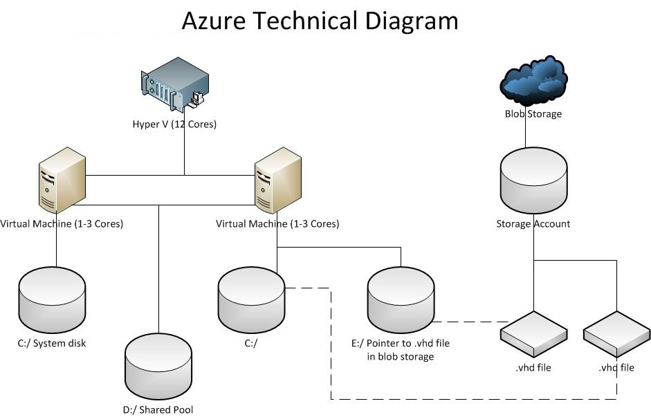
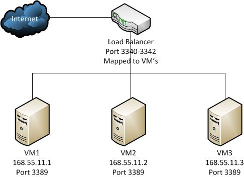

<properties
    pageTitle="Azure CLI-Befehle im Modus Servicemanagement | Microsoft Azure"
    description="Azure Befehlszeilenschnittstelle () Befehle im Modus Servicemanagement im Bereitstellungsmodell klassischen Bereitstellungen verwalten"
    services="virtual-machines-linux,virtual-machines-windows,mobile-services, cloud-services"
    documentationCenter=""
    authors="dlepow"
    manager="timlt"
    editor="tysonn"
    tags="azure-service-management"/>

<tags
    ms.service="multiple"
    ms.workload="multiple"
    ms.tgt_pltfrm="vm-multiple"
    ms.devlang="na"
    ms.topic="article"
    ms.date="09/22/2016"
    ms.author="danlep"/>

# <a name="azure-cli-commands-in-azure-service-management-asm-mode"></a>Azure CLI-Befehle im Modus Azure Service Management (Asm)

[AZURE.INCLUDE [learn-about-deployment-models](../includes/learn-about-deployment-models-classic-include.md)]Sie können auch [erfahren Sie mehr über alle Ressourcenmanager Modell Befehle](virtual-machines/azure-cli-arm-commands.md), und verwenden Sie die CLI Migrieren von [Ressourcen](virtual-machines/virtual-machines-linux-cli-migration-classic-resource-manager.md) in der Standardansicht in das Datenmodell Ressourcenmanager.

Dieser Artikel enthält die Formelsyntax und die Optionen für Azure CLI-Befehle, die Sie häufig zum Erstellen und Verwalten von Azure Ressourcen im Bereitstellungsmodell klassischen verwenden möchten. Sie auf diese Befehle durch Ausführen der CLI im Modus Azure Service Management (Asm) zugreifen. Dies ist keine vollständige Referenz, und Ihre CLI Version möglicherweise etwas anders Befehle oder Parameter anzeigen. 

Um zu beginnen, erste [Azure CLI installieren](xplat-cli-install.md) und [Verbinden mit Ihrem Azure-Abonnement](xplat-cli-connect.md).

Geben Sie für den aktuellen Befehlssyntax und Optionen in der Befehlszeile `azure help` oder zum Anzeigen der Hilfe für einen bestimmten Befehl, `azure help [command]`. Finden Sie auch CLI Beispiele in der Dokumentation für das Erstellen und Verwalten von bestimmter Azure-Dienste.

Optionale Parameter werden in eckigen Klammern angezeigt (z. B. `[parameter]`). Alle anderen Parameter sind erforderlich.

Zusätzlich zu den Befehl-spezifische optionale Parameter hier beschrieben gibt es drei optionale Parameter, die verwendet werden können, die ausführliche Ausgabe wie Anforderung Optionen und Statuscodes angezeigt. Die `-v` Parameter umfasst ausführliche Informationen zu, und die `-vv` Parameter bietet sogar noch mehr detaillierte ausführlichen Ausgabe. Die `--json` Option gibt das Ergebnis im unformatierten Json-Format.

## <a name="setting-asm-mode"></a>Einstellung Asm Modus

Verwenden Sie den folgenden Befehl aus, um Azure CLI Servicemanagement Befehle im Modus aktivieren.

    azure config mode asm

>[AZURE.NOTE] Der CLI Azure Ressourcenmanager und Azure Servicemanagement Modus schließen sich gegenseitig aus. D. h., werden nicht in einem einzigen Modus erstellte Ressourcen aus dem anderen Modus verwaltet.

## <a name="manage-your-account-information-and-publish-settings"></a>Verwalten Sie Ihre Kontoinformationen und veröffentlichungseinstellungen
Eine Möglichkeit besteht darin, die die CLI eine Verbindung mit Ihrem Konto herstellen kann, ist mithilfe von Informationen zu Ihrem Abonnement Azure. (Weitere Optionen finden Sie unter [Verbinden zu einem Azure Abonnement über die Befehlszeile Azure](xplat-cli-connect.md) .) Diese Informationen erhalten Sie vom Azure klassischen Portal in einer Einstellungsdatei veröffentlichen, wie hier beschrieben. Sie können die Einstellungsdatei veröffentlichen importieren, wie eine beständige lokale Konfiguration festlegen, die die CLI für nachfolgende Operationen verwendet. Sie müssen nur Importieren Ihrer Einstellungen einmal veröffentlichen.

**Konto herunterladen [Optionen]**

Dieser Befehl startet, einen Browser, um die Datei publishsettings vom klassischen Azure-Portal herunterladen.

    ~$ azure account download
    info:   Executing command account download
    info:   Launching browser to https://windows.azure.com/download/publishprofile.aspx
    help:   Save the downloaded file, then execute the command
    help:   account import <file>
    info:   account download command OK

**Konto importieren [Optionen] &lt;Datei >**


Dieser Befehl importiert eine Publishsettings-Datei oder ein Zertifikat, damit sie mit dem Tool in Zukunft Sitzungen verwendet werden kann.

    ~$ azure account import publishsettings.publishsettings
    info:   Importing publish settings file publishsettings.publishsettings
    info:   Found subscription: 3-Month Free Trial
    info:   Found subscription: Pay-As-You-Go
    info:   Setting default subscription to: 3-Month Free Trial
    warn:   The 'publishsettings.publishsettings' file contains sensitive information.
    warn:   Remember to delete it now that it has been imported.
    info:   Account publish settings imported successfully

> [AZURE.NOTE] Die Datei Publishsettings kann Details (d. h., Abonnementname und ID) mehrere Abonnements enthalten. Wenn Sie die Publishsettings-Datei importieren, wird das erste Abonnement als Standard Beschreibung verwendet. Wenn Sie ein anderes Abonnement verwenden möchten, führen Sie den folgenden Befehl aus:
<code>~$ azure config set subscription &lt;other-subscription-id&gt;</code>

**Konto deaktivieren [Optionen]**

Dieser Befehl entfernt die gespeicherte Publishsettings, die importiert wurden. Verwenden Sie diesen Befehl aus, wenn Sie fertig sind, mithilfe des Tools auf diesem Computer und sicherstellen möchten Sie, dass das Tool mit Ihrem Konto in Zukunft Sitzungen verwendet werden kann.

    ~$ azure account clear
    Clearing account info.
    info:   OK

**Kontenliste [Optionen]**

Liste der importierten Abonnements

    ~$ azure account list
    info:    Executing command account list
    data:    Name                                    Id
           Current
    data:    --------------------------------------  -------------------------------
    -----  -------
    data:    Forums Subscription                     8679c8be-3b05-49d9-b8fb  true
    data:    Evangelism Team Subscription            9e672699-1055-41ae-9c36  false
    data:    MSOpenTech-Prod                         c13e6a92-706e-4cf5-94b6  false

**Festlegen von Konto [Optionen] &lt;Abonnement&gt;**

Festlegen des aktuellen Abonnements

###<a name="commands-to-manage-your-affinity-groups"></a>Befehle zum Verwalten Ihrer Zugehörigkeit Gruppen

**Zugehörigkeit-Gruppe Kontenliste [Optionen]**

Dieser Befehl listet Ihrer Azure Zugehörigkeit Gruppen.

Gruppen die kann festgelegt werden, wenn eine Gruppe von virtuellen Computern mehrere physische Computer umfasst. Die Zugehörigkeit Gruppe gibt an, dass die physischen Computer wie ähnlich wie möglich, um Netzwerkwartezeit verringern miteinander sollte.

    ~$ azure account affinity-group list
    + Fetching affinity groups
    data:   Name                                  Label   Location
    data:   ------------------------------------  ------  --------
    data:   535EBAED-BF8B-4B18-A2E9-8755FB9D733F  opentec  West US
    info:   account affinity-group list command OK

**Erstellen Sie Konto Zugehörigkeit-Gruppe [Optionen] &lt;Namen&gt;**

Dieser Befehl erstellt die Zugehörigkeit Gruppe

    ~$ azure account affinity-group create opentec -l "West US"
    info:    Executing command account affinity-group create
    + Creating affinity group
    info:    account affinity-group create command OK

**Konto Zugehörigkeit-Gruppe anzeigen [Optionen] &lt;Namen&gt;**

Dieser Befehl zeigt die Details der Gruppe Zugehörigkeit

    ~$ azure account affinity-group show opentec
    info:    Executing command account affinity-group show
    + Getting affinity groups
    data:    $ xmlns "http://schemas.microsoft.com/windowsazure"
    data:    $ xmlns:i "http://www.w3.org/2001/XMLSchema-instance"
    data:    Name "opentec"
    data:    Label "b3BlbnRlYw=="
    data:    Description $ i:nil "true"
    data:    Location "West US"
    data:    HostedServices ""
    data:    StorageServices ""
    data:    Capabilities Capability 0 "PersistentVMRole"
    data:    Capabilities Capability 1 "HighMemory"
    info:    account affinity-group show command OK

**Konto Zugehörigkeit-Gruppe löschen [Optionen] &lt;Namen&gt;**

Dieser Befehl löscht die Zugehörigkeit Gruppe

    ~$ azure account affinity-group delete opentec
    info:    Executing command account affinity-group delete
    Delete affinity group opentec? [y/n] y
    + Deleting affinity group
    info:    account affinity-group delete command OK

###<a name="commands-to-manage-your-account-environment"></a>Befehle zum Verwalten Ihrer Umgebung Konto

**Env Kontenliste [Optionen]**

Liste der Konto-Umgebungen

    C:\windows\system32>azure account env list
    info:    Executing command account env list
    data:    Name
    data:    ---------------
    data:    AzureCloud
    data:    AzureChinaCloud
    info:    account env list command OK

**Konto Env anzeigen [Optionen] [Umgebung]**

Anzeigen von Details zur Konto-Umgebung

    ~$ azure account env show
    info:    Executing command account env show
    Environment name: AzureCloud
    data:    Environment publishingProfile  http://go.microsoft.com/fwlink/?LinkId=2544
    data:    Environment portal  http://go.microsoft.com/fwlink/?LinkId=2544
    info:    account env show command OK

**Hinzufügen von Konto Env [Optionen] [Umgebung]**

Dieser Befehl fügt eine Umgebung mit dem Konto

**Festlegen von Konto Env [Optionen] [Umgebung]**

Dieser Befehl legt die Konto-Umgebung

**Konto Env löschen [Optionen] [Umgebung]**

Dieser Befehl löscht die angegebene Umgebung des Kontos

## <a name="commands-to-manage-your-classic-virtual-machines"></a>Befehle zum Verwalten Ihrer klassischen virtuellen Computern
Das folgende Diagramm veranschaulicht, wie klassische Azure virtuellen Computer in dieser Umgebung Bereitstellung von einer Azure-Cloud-Dienst gehostet werden.



**Erstellen neuer** erstellt das Laufwerk im BLOB-Speicher (d. h., im Diagramm e:\); **Anfügen** wird einen bereits erstellten, jedoch nicht angefügten Datenträger eines virtuellen Computers angefügt.

**Erstellen von virtuellen Computer [Optionen] &lt;Dns-Name > &lt;Bild > &lt;UserName > [Kennwort]**

Dieser Befehl erstellt eine Azure-virtuellen Computern an. Standardmäßig wird jedes virtuellen Computers (virtueller Computer) in einem eigenen Cloud-Dienst erstellt. Sie können angeben, dass ein virtuellen Computers zu einem vorhandenen Clouddienst durch die Verwendung von der Option - C hinzugefügt werden soll, wie hier beschrieben.

Der virtuellen Computer Befehl, wie das Azure klassischen Portal erstellen, erstellt nur virtuellen Computern in dieser Bereitstellung Umgebung. Es ist keine Option zum Erstellen eines virtuellen Computers in der Cloud-Dienst staging Deployment-Umgebung. Wenn Sie Ihr Abonnement kein vorhandenes Azure-Speicherkonto verfügt, erstellt der Befehl eine aus.

Können Sie einen Speicherort angeben durch den – Parameter Location, oder Sie können angeben, dass eine Gruppe für die Zugehörigkeit durch den – Zugehörigkeit-Gruppe Parameter. Wenn weder bereitgestellt wird, werden Sie aufgefordert, eine aus einer Liste mit gültigen Positionen bereitzustellen.

Das angegebene Kennwort muss 8-123 Zeichen lang sein und entsprechen die Anforderungen Kennwort Komplexität das Betriebssystem, das Sie für diesen virtuellen Computer verwenden.

Wenn Sie beabsichtigen, SSH einer bereitgestellten Linux virtuellen Computers zu verwalten (wie normalerweise der Groß-/Kleinschreibung) verwenden, müssen Sie SSH über die Option-e aktivieren, bei der Erstellung des virtuellen Computers. Es ist nicht möglich, SSH nach dem Erstellen des virtuellen Computers zu aktivieren.

Windows-virtuellen Computern können später aktivieren RDP Port 3389 als Endpunkt hinzufügen.

Die folgenden optionalen Parameter werden für diesen Befehl unterstützt:

**- C, – verbinden** virtuellen Computers innerhalb einer bereits erstellten Bereitstellung in einem Hostingdienst erstellen. Wenn Vmname - mit dieser Option nicht verwendet wird, wird automatisch der Name des neuen virtuellen Computers generiert.<br />
**-n, – virtueller Computer-name** Geben Sie den Namen des virtuellen Computers. Dieser Parameter nimmt Hostinganbieter Service Name standardmäßig an. -Vmname nicht angegeben ist, wird der Name für den neuen virtuellen Computer als generiert &lt;Service-Name >&lt;Id >, wobei &lt;Id > ist die Anzahl der vorhandenen virtuellen Computern in den Dienst plus 1. Wenn Sie diesen Befehl verwenden, ein virtuellen Computers zu einem Hostingdienst MyService hinzufügen, die einen vorhandenen virtuellen Computern enthält, wird der neuen virtuellen Computern beispielsweise MyService2 bezeichnet.<br />
**-u,--Blob-url** Geben Sie die Ziel-BLOB-Speicher URL an, an den virtuellen Computern Systemdatenträger erstellt. <br />
**-Z, – virtueller-Speicher** Geben Sie die Größe des virtuellen Computers. Gültige Werte sind: "ExtraSmall", "Klein", "Mittel", "Groß", "ExtraLarge", "A5", "A6", "A7", "A8", "A9", "A10", "A11", "Basic_A0", "Basic_A1", "Basic_A2", "Basic_A3", "Basic_A4", "Standard_D1", "Standard_D2", "Standard_D3", "Standard_D4", "Standard_D11", "Standard_D12", "Standard_D13", "Standard_D14", "Standard_DS1", "Standard_DS2", "Standard_DS3", "Standard_DS4", "Standard_DS11", "Standard_DS12", "Standard_DS13", "Standard_DS14", "Standard_G1", "Standard_G2" , "Standard_G3", "Standard_G4", "Standard_G55". Der Standardwert ist "Klein". <br />
**-r** Fügt RDP-Konnektivität zu einem Windows-Computer an. <br />
**-e, – ssh** Fügt SSH-Verbindung zu einem Windows-Computer an. <br />
**t-,--ssh signiertes Zertifikat** Gibt das Zertifikat SSH. <br />
**-s** Das Abonnement <br />
**-o – Community** Das angegebene Bild ist ein Bild community <br />
**-w** Den Namen des virtuellen Netzwerks <br/>
**-l,--Speicherort** gibt den Speicherort (beispielsweise "US North Central"). <br />
**-ein,--Zugehörigkeit-Gruppe** gibt die Zugehörigkeit Gruppe an.<br />
**-w,--virtuelle Netzwerknamen** Geben Sie an das virtuelle Netzwerk Grundlage für den neuen virtuellen Computer hinzufügen. Virtuelle Netzwerke können einrichten und vom klassischen Azure-Portal verwaltet werden.<br />
**-b,--Subnetz-Namen** Gibt die Subnetz gehören, den Namen des virtuellen Computers zuweisen.

In diesem Beispiel ist MSFT__Win2K8R2SP1-120514-1520-141205-01-en-us-30GB der Plattform. Weitere Informationen: das Betriebssystem von Bildern finden Sie unter Bildliste virtueller Computer.

    ~$ azure vm create my-vm-name MSFT__Windows-Server-2008-R2-SP1.11-29-2011 username --location "West US" -r
    info:   Executing command vm create
    Enter VM 'my-vm-name' password: ************
    info:   vm create command OK

**virtueller Computer erstellen von &lt;Dns-Name > &lt;Rolle-Datei >**

Dieser Befehl erstellt eine Azure-virtuellen Computern aus einer Rolle JSON-Datei.

    ~$ azure vm create-from my-vm example.json
    info:   OK

**virtueller Computer Liste [Optionen]**

Dieser Befehl listet Azure-virtuellen Computern an. Die Option – Json gibt an, dass die Ergebnisse im unformatierten JSON-Format zurückgegeben werden.

    ~$ azure vm list
    info:   Executing command vm list
    data:   DNS Name                          VM Name      Status
    data:   --------------------------------  -----------  ---------
    data:   my-vm-name.cloudapp-preview.net        my-vm        ReadyRole
    info:   vm list command OK

**virtueller Computer Orteliste [Optionen]**

Dieser Befehl listet alle verfügbaren Azure-Konto Speicherorte.

    ~$ azure vm location list
    info:   Executing command vm location list
    data:   Name                   Display Name
    data:   ---------------------  ------------
    data:   Azure Preview  West US
    info:   account location list command OK

**virtueller Computer anzeigen [Optionen] &lt;Name >**

Dieser Befehl zeigt die Details zu einer Azure-virtuellen Computern. Die Option – Json gibt an, dass die Ergebnisse im unformatierten JSON-Format zurückgegeben werden.

    ~$ azure vm show my-vm
    info:   Executing command vm show
    data:   {
    data:       InstanceSize: 'Small',
    data:       InstanceStatus: 'ReadyRole',
    data:       DataDisks: [],
    data:       IPAddress: '10.26.192.206',
    data:       DNSName: 'my-vm.cloudapp.net',
    data:       InstanceStateDetails: {},
    data:       VMName: 'my-vm',
    data:       Network: {
    data:           Endpoints: [
    data:               {
    data:                   Protocol: 'tcp',
    data:                   Vip: '65.52.250.250',
    data:                   Port: '63238' ,
    data:                   LocalPort: '3389',
    data:                   Name: 'RemoteDesktop'
    data:               }
    data:           ]
    data:       },
    data:       Image: 'MSFT__Windows-Server-2008-R2-SP1.11-29-2011',
    data:       OSVersion: 'WA-GUEST-OS-1.18_201203-01'
    data:   }
    info:   vm show command OK

**virtueller Computer löschen [Optionen] &lt;Name >**

Dieser Befehl löscht eine Azure-virtuellen Computern an. Standardmäßig werden in dieser Befehl nicht Azure Blob gelöscht, aus dem die Betriebssystem-Laufwerk und das Laufwerk Daten erstellt werden. Geben Sie zum Löschen der Blob und des virtuellen Computers auf dem basiert die Option-b aus.

    ~$ azure vm delete my-vm
    info:   Executing command vm delete
    info:   vm delete command OK

**virtuelle Computer gestartet [Optionen] &lt;Name >**

Dieser Befehl startet eine Azure-virtuellen Computern an.

    ~$ azure vm start my-vm
    info:   Executing command vm start
    info:   vm start command OK

**virtueller Computer neu gestartet [Optionen] &lt;Name >**

Dieser Befehl wird eine Azure-virtuellen Computern neu gestartet.

    ~$ azure vm restart my-vm
    info:   Executing command vm restart
    info:   vm restart command OK

**virtueller Computer war(en) [Optionen] &lt;Name >**

Dieser Befehl beendet eine Azure-virtuellen Computern aus. Die Option -p können Sie angeben, dass die Ressource berechnen auf war(en) nicht freigegeben werden.

```
~$ azure vm shutdown my-vm
info:   Executing command vm shutdown
info:   vm shutdown command OK  
```

**virtueller Computer erfassen &lt;Name des virtuellen Computers > &lt;Ziel Bildnamen >**

Dieser Befehl erfasst werden, ein Bild Azure-virtuellen Computern.

Abbild eines virtuellen Computers kann nur erfasst werden, wenn der Status des virtuellen Computers **gestoppt**angezeigt wird. Fahren Sie den virtuellen Computer aus, bevor Sie fortfahren.

    ~$ azure.cmd vm capture my-vm mycaptureimagename --delete
    info:   Executing command vm capture
    + Fetching VMs
    + Capturing VM
    info:   vm capture command OK

**virtueller Computer exportieren [Optionen] &lt;Name des virtuellen Computers > &lt;Dateipfad >**

Dieser Befehl exportiert ein Bild Azure-virtuellen Computern in einer Datei

    ~$ azure vm export "myvm" "C:\"
    info:    Executing command vm export
    + Getting virtual machines
    + Exporting the VM
    info:   vm export command OK

##  <a name="commands-to-manage-your-azure-virtual-machine-endpoints"></a>Befehle zum Verwalten Ihrer Endpunkte Azure-virtuellen Computern
Das folgende Diagramm zeigt die Architektur des typischerweise mehrerer Instanzen eines klassischen virtuellen Computers. In diesem Beispiel ist Port 3389 auf jedem virtuellen Computer (für den Zugriff RDP) öffnen. Es gibt auch eine interne IP-Adresse (beispielsweise 168.55.11.1) auf jedem virtuellen Computer, die von den Lastenausgleich für die Weiterleitung Verkehr virtuellen Computer verwendet wird. Diese internen IP-Adresse kann auch für die Kommunikation zwischen virtuellen Computern verwendet werden.



Externe Anfragen zu virtuellen Computern über einen Lastenausgleich wechseln. Aus diesem Grund können Anfragen anhand eines bestimmten virtuellen Computers auf Bereitstellungen mit mehreren virtuellen Computern angegeben werden. Für Bereitstellungen mit mehreren virtuellen Computern muss die Zuordnung zwischen den virtuellen Computern (virtueller Computer-Port) und Lastenausgleich (lb-Port) konfiguriert sein.

**virtueller Computer Endpunkt erstellen &lt;Name des virtuellen Computers > &lt;Pfd Ports > [virtueller Computer-Anschluss]**

Dieser Befehl erstellt einen Endpunkt virtuellen Computern an. Sie können auch u – oder – aktivieren-direkte-Server-Eingabe verwenden, um anzugeben, ob zum Aktivieren direkter Server auf diesen Endpunkt, standardmäßig deaktiviert zurückzukehren.

    ~$ azure vm endpoint create my-vm 8888 8888
    azure vm endpoint create my-vm 8888 8888
    info:   Executing command vm endpoint create
    + Fetching VM
    + Reading network configuration
    + Updating network configuration
    info:   vm endpoint create command OK

**virtueller Computer Endpunkt erstellen – mehrere [Optionen] &lt;Name des virtuellen Computers > &lt;Pfd Ports > [:&lt;virtuellen Computer Ports > [:&lt;Protokoll > [:&lt;aktivieren-direkte-Server-Eingabe > [:&lt;Pfd SetName > [:&lt;Prüfpunkt-Protokoll > [:&lt;Prüfpunkt Ports > [:&lt;Prüfpunkt-Pfad > [:&lt;interne Pfd Name >]]] {1 -*}**

Erstellen Sie mehrerer virtueller Computer Endpunkte.

**virtueller Computer Endpunkt löschen [Optionen] &lt;Name des virtuellen Computers > &lt;Endpunkt-Name >**

Dieser Befehl löscht einen Endpunkt virtuellen Computern an.

    ~$ azure vm endpoint delete my-vm http
    azure vm endpoint delete my-vm http
    info:   Executing command vm endpoint delete
    + Fetching VM
    + Reading network configuration
    + Updating network configuration
    info:   vm endpoint delete command OK

**virtueller Computer Endpunktliste &lt;Name des virtuellen Computers >**

Dieser Befehl listet alle virtuellen Computern Endpunkte. Die Option – Json gibt an, dass die Ergebnisse im unformatierten JSON-Format zurückgegeben werden.

    ~$ azure vm endpoint list my-linux-vm
    data:   Name  External Port  Local Port
    data:   ----  -------------  ----------
    data:   ssh   22             22

**virtueller Computer Endpunkt Update [Optionen] &lt;Name des virtuellen Computers > &lt;Endpunkt-Name >**

Dieser Befehl aktualisiert einen Endpunkt virtueller Computer auf neue Werte, die mit diesen Optionen.

    -n, --endpoint-name <name>          the new endpoint name
    -lo, --lb-port <port>                the new load balancer port
    -t, --vm-port <port>                the new local port
    -o, --endpoint-protocol <protocol>  the new transport layer protocol for port (tcp or udp)

**virtueller Computer Endpunkt anzeigen [Optionen] &lt;Name des virtuellen Computers >**

Dieser Befehl zeigt die Details der Endpunkte eines virtuellen Computers

    ~$ azure vm endpoint show "mycouchvm"
    info:    Executing command vm endpoint show
    + Getting virtual machines
    data:    Network Endpoints 0 LoadBalancedEndpointSetName "CouchDB_EP-5984"
    data:    Network Endpoints 0 LocalPort "5984"
    data:    Network Endpoints 0 Name "CouchDB_EP"
    data:    Network Endpoints 0 Port "5984"
    data:    Network Endpoints 0 Protocol "tcp"
    data:    Network Endpoints 0 Vip "168.61.9.97"
    data:    Network Endpoints 1 LoadBalancedEndpointSetName "CouchEP_2-2020"
    data:    Network Endpoints 1 LocalPort "2020"
    data:    Network Endpoints 1 Name "CouchEP_2"
    data:    Network Endpoints 1 Port "2020"
    data:    Network Endpoints 1 Protocol "tcp"
    data:    Network Endpoints 1 Vip "168.61.9.97"
    data:    Network Endpoints 2 LocalPort "3389"
    data:    Network Endpoints 2 Name "RemoteDesktop"
    data:    Network Endpoints 2 Port "3389"
    data:    Network Endpoints 2 Protocol "tcp"
    data:    Network Endpoints 2 Vip "168.61.9.97"
    info:    vm endpoint show command OK

## <a name="commands-to-manage-your-azure-virtual-machine-images"></a>Befehle zum Verwalten Ihrer Bilder Azure-virtuellen Computern

Bilder virtuellen Computern sind Bildschirmausschnitte von bereits konfigurierten virtuellen Computern, die repliziert werden können je nach Bedarf.

**virtueller Computer Bildliste [Optionen]**

Dieser Befehl ruft eine Liste von Bildern virtuellen Computern ab. Es gibt drei Arten von Bildern: Bilder erstellt von Microsoft, der mit "MSFT" vorangestellt werden, Bilder von Drittanbietern, die den Namen des Herstellers vorangestellt werden, und Sie Bilder erstellt erstellen. Um Bilder zu erstellen, können Sie einer vorhandenen virtuellen Computern erfassen oder erstellen ein Bild aus einer benutzerdefinierten VHD Blob-Speicher geladen. Weitere Informationen zur Verwendung einer benutzerdefinierten VHD finden Sie unter Erstellen von virtuellen Computer Bild.
Die Option – Json gibt an, dass die Ergebnisse im unformatierten JSON-Format zurückgegeben werden.

    ~$ azure vm image list
    data:   Name                                                                   Category   OS
    data:   ---------------------------------------------------------------------  ---------  -------
    data:   CANONICAL__Canonical-Ubuntu-12-04-20120519-2012-05-19-en-us-30GB.vhd   Canonical  Linux
    data:   MSFT__Windows-Server-2008-R2-SP1.11-29-2011                            Microsoft  Windows
    data:   MSFT__Windows-Server-2008-R2-SP1-with-SQL-Server-2012-Eval.11-29-2011  Microsoft  Windows
    data:   MSFT__Windows-Server-8-Beta.en-us.30GB.2012-03-22                      Microsoft  Windows
    data:   MSFT__Windows-Server-8-Beta.2-17-2012                                  Microsoft  Windows
    data:   MSFT__Windows-Server-2008-R2-SP1.en-us.30GB.2012-3-22                  Microsoft  Windows
    data:   OpenLogic__OpenLogic-CentOS-62-20120509-en-us-30GB.vhd                 OpenLogic  Linux
    data:   SUSE__SUSE-Linux-Enterprise-Server-11SP2-20120521-en-us-30GB.vhd       SUSE       Linux
    data:   SUSE__OpenSUSE64121-03192012-en-us-15GB.vhd                            SUSE       Linux
    data:   WIN2K8-R2-WINRM                                                        User       Windows
    info:   vm image list command OK

**virtueller Computer Bild anzeigen [Optionen] &lt;Name >**

Dieser Befehl zeigt die Details der Abbild eines virtuellen Computers.

    ~$ azure vm image show MSFT__Windows-Server-2008-R2-SP1.11-29-2011
    + Fetching VM image
    info:   Executing command vm image show
    data:   {
    data:       Label: 'Windows Server 2008 R2 SP1, Nov 2011',
    data:       Name: 'MSFT__Windows-Server-2008-R2-SP1.11-29-2011',
    data:       Description: 'Microsoft Windows Server 2008 R2 SP1',
    data:       @: { xmlns: 'http://schemas.microsoft.com/windowsazure', xmlns:i: 'http://www.w3.org/2001/XMLSchema-instance' },
    data:       Category: 'Microsoft',
    data:       OS: 'Windows',
    data:       Eula: 'http://www.microsoft.com',
    data:       LogicalSizeInGB: '30'
    data:   }
    info:   vm image show command OK

**Löschen der Bilder virtueller Computer [Optionen] &lt;Name >**

Dieser Befehl löscht Abbild eines virtuellen Computers.

    ~$ azure vm image delete my-vm-image
    info:   Executing command vm image delete
    info:   VM image deleted: my-vm-image
    info:   vm image delete command OK

**Erstellen von virtuellen Computer Bild &lt;Name > [Quelle-Pfad]**

Dieser Befehl erstellt Abbild eines virtuellen Computers. Ihre benutzerdefinierten VHD-Dateien BLOB-Speicher hochgeladen werden, und klicken Sie dann das Bild des virtuellen Computers von dort aus erstellt wird. Klicken Sie dann verwenden Sie diese Abbildung virtuellen Computern ein virtuellen Computers zu erstellen. Die Position und OS Parameter sind erforderlich.

>[AZURE.NOTE]Dieser Befehl unterstützt derzeit nur Upload festen VHD-Dateien. Verwenden Sie die [Azure-virtuellen Festplatte Dienstprogramme für wechseln](https://github.com/Microsoft/azure-vhd-utils-for-go), um eine dynamische .vhd-Datei hochladen.

Einige Systeme beschränkt pro Prozess Datei Beschreibung. Wenn dieser Grenzwert überschritten wird, zeigt das Tool eine Datei Beschreibung Grenzwert zurück. Sie können den Befehl erneut mit der -p ausführen &lt;Zahl > Parameter, die maximale Anzahl von parallele Uploads zu verringern. Die Standardeinstellung für die maximale Anzahl von parallele Uploads ist 96.

    ~$ azure vm image create mytestimage ./Sample.vhd -o windows -l "West US"
    info:   Executing command vm image create
    + Retrieving storage accounts
    info:   VHD size : 13 MB
    info:   Uploading 13312.5 KB
    Requested:100.0% Completed:100.0% Running: 105 Time:    8s Speed:  1721 KB/s
    info:   http://myaccount.blob.core.azure.com/vm-images/Sample.vhd is uploaded successfully
    info:   vm image create command OK

## <a name="commands-to-manage-your-azure-virtual-machine-data-disks"></a>Befehle zum Verwalten Ihrer Daten-Datenträger Azure-virtuellen Computern

Daten sind VHD-Dateien im BLOB-Speicher, die von einem virtuellen Computer verwendet werden können. Weitere Informationen, wie Daten Datenträger bereitgestellt werden BLOB-Speicher finden Sie unter Azure technische Diagramm zuvor angezeigt.

Die Befehle für die Daten Datenträger anfügen (Datenträger Azure-virtuellen Computer installieren und Azure-virtuellen Computer Datenträger anfügen-neue) die angefügten Daten Laufwerk, je nach Bedarf vom SCSI-Protokoll eine logische Einheit (LUN) zuweisen. Der erste Daten Datenträger eines virtuellen Computers angefügter zugeordnet ist LUN 0, die nächste zugeordneten LUN 1 usw..

Wenn Sie einen Datenträger Datenträger Azure-virtuellen Computer trennen Befehl trennen, verwenden Sie die &lt;Lun&gt; Parameter, um anzugeben, welcher Datenträger trennen.

>[AZURE.NOTE] Sie sollten immer Daten Datenträger in umgekehrter Reihenfolge trennen, beginnend mit der höchsten nummeriert LUN, die zugewiesen wurde. Der Layer Linux SCSI unterstützt nicht das Trennen einer unteren nummeriert LUNs während eine höheren nummeriert LUN noch angeschlossen ist. Angenommen, sollten Sie nicht trennen LUN 0 Wenn LUN 1 noch angeschlossen ist.

**virtueller Computer Datenträger anzeigen [Optionen] &lt;Name >**

Dieser Befehl zeigt die Details zu einer Azure Datenträger.

    ~$ azure vm disk show anucentos-anucentos-0-20120524070008
    info:   Executing command vm disk show
    data:   AttachedTo DeploymentName "mycentos"
    data:   AttachedTo HostedServiceName "myanucentos"
    data:   AttachedTo RoleName "myanucentos"
    data:   OS "Linux"
    data:   Location "Azure Preview"
    data:   LogicalDiskSizeInGB "30"
    data:   MediaLink "http://mystorageaccount.blob.core.azure-preview.com/vhd-store/mycentos-cb39b8223b01f95c.vhd"
    data:   Name "mycentos-mycentos-0-20120524070008"
    data:   SourceImageName "OpenLogic__OpenLogic-CentOS-62-20120509-en-us-30GB.vhd"
    info:   vm disk show command OK

**Liste der virtuellen Computer Festplatten [Optionen] [Name der virtuellen Computer]**

Dieser Befehl Listen Azure Datenträger, oder mit einer angegebenen virtuellen Computern verbundenen Datenträger. Wenn sie mit einem virtuellen Computern Namensparameter ausgeführt wird, liefert alle Datenträger, des virtuellen Computers angefügt. LUN 1 mit des virtuellen Computers erstellt wird, und alle weiteren aufgelisteten Datenträger separat zugeordnet sind.

    ~$ azure vm disk list mycentos
    info:   Executing command vm disk list
    data:   Lun  Size(GB)  Blob-Name
    data:   ---  --------  --------------------------------
    data:   1    30        mycentos-cb39b8223b01f95c.vhd
    data:   2    10        mycentos-e3f0d717950bb78d.vhd
    info:   vm disk list command OK

Dieser Befehl ohne Namensparameter virtuellen Computern ausgeführt werden alle Datenträger gibt.

    ~$ azure vm disk list
    data:   Name                                        OS
    data:   ------------------------------------------  -------
    data:   mycentos-mycentos-0-20120524070008          Linux
    data:   mycentos-mycentos-2-20120525055052
    data:   mywindows-winvm-20120522223119              Windows
    info:   vm disk list command OK

**virtueller Computer Datenträger löschen [Optionen] &lt;Name >**

Dieser Befehl löscht einen Azure Datenträger aus einer Persönliche Repository an. Der Datenträger muss vom des virtuellen Computers getrennt werden, bevor sie gelöscht wird.

    ~$ azure vm disk delete mycentos-mycentos-2-20120525055052
    info:   Executing command vm disk delete
    info:   Disk deleted: mycentos-mycentos-2-20120525055052
    info:   vm disk delete command OK

**Erstellen von virtuellen Computer Datenträger &lt;Name > [Quelle-Pfad]**

Dieser Befehl uploads und registriert einen Azure Datenträger. – Blob-Url,--Speicherort oder – Zugehörigkeit-Gruppe angegeben werden muss. Wenn Sie diesen Befehl mit [Quelle-Pfad] verwenden, die angegebene VHD-Datei hochgeladen wird und ein Bild erstellt. Sie können diese Abbildung klicken Sie dann mit einem virtuellen Computer mithilfe von virtuellen Computer Datenträger anfügen anfügen.

Einige Systeme beschränkt pro Prozess Datei Beschreibung. Wenn dieser Grenzwert überschritten wird, zeigt das Tool eine Datei Beschreibung Grenzwert zurück. Sie können den Befehl erneut mit der -p ausführen &lt;Zahl > Parameter, die maximale Anzahl von parallele Uploads zu verringern. Die Standardeinstellung für die maximale Anzahl von parallele Uploads ist 96.

    ~$ azure vm disk create my-data-disk ~/test.vhd --location "West US"
    info:   Executing command vm disk create
    info:   VHD size : 10 MB
    info:   Uploading 10240.5 KB
    Requested:100.0% Completed:100.0% Running:  81 Time:   11s Speed:   952 KB/s
    info:   http://account.blob.core.azure.com/disks/test.vhd is uploaded successfully
    info:   vm disk create command OK

**virtueller Computer Datenträger Upload [Optionen] &lt;Quelle-Pfad > &lt;Blob-Url > &lt;Speicher kontoschlüssel >**

Dieser Befehl ermöglicht es Ihnen, einen Datenträger virtueller Computer hochladen

    ~$ azure vm disk upload "http://sourcestorage.blob.core.windows.net/vhds/sample.vhd" "http://destinationstorage.blob.core.windows.net/vhds/sample.vhd" "DESTINATIONSTORAGEACCOUNTKEY"
    info:   Executing command vm disk upload
    info:   Uploading 12351.5 KB
    info:   vm disk upload command OK

**Anfügen von virtuellen Computer Datenträger &lt;Name des virtuellen Computers > &lt;Datenträger Bildnamen >**

Dieser Befehl fügt einen vorhandenen Datenträger im BLOB-Speicher an vorhandenen virtuellen Computer in einen Cloud-Dienst bereitgestellt.

    ~$ azure vm disk attach my-vm my-vm-my-vm-2-201242418259
    info:   Executing command vm disk attach
    info:   vm disk attach command OK

**virtueller Computer Datenträger anfügen-neue &lt;Name des virtuellen Computers > &lt;Größe in gb > [Blob-Url]**

Dieser Befehl fügt einen Datenträger an eine Azure-virtuellen Computern an. In diesem Beispiel ist 20 die Größe des neuen Datenträger wird in Gigabyte, angefügt werden soll. Optional können eine BLOB-URL als letztes Argument explizit angeben, das Ziel-Blob zu erstellen. Wenn Sie eine BLOB-URL nicht angeben, wird automatisch ein Blob-Objekt generiert.

    ~$ azure vm disk attach-new nick-test36 20 http://nghinazz.blob.core.azure-preview.com/vhds/vmdisk1.vhd
    info:   Executing command vm disk attach-new
    info:   vm disk attach-new command OK  

**Trennen Sie virtueller Computer Datenträger &lt;Name des virtuellen Computers > &lt;Lun >**

Dieser Befehl trennt einen Datenträger, eine Azure-virtuellen Computern angefügt. &lt;LUN > identifiziert den Datenträger, um getrennt werden soll. Eine Liste der Datenträger, auf einem Datenträger zugeordnet ist, bevor Sie getrennt verwenden, um virtuellen Computer Datenträger-Liste &lt;Name des virtuellen Computers >.

    ~$ azure vm disk detach my-vm 2
    info:   Executing command vm disk detach
    info:   vm disk detach command OK

## <a name="commands-to-manage-your-azure-cloud-services"></a>Befehle zum Verwalten Ihrer Azure-Cloud-Dienste

Azure Cloud Services sind Anwendungen und Dienste auf Webrollen und Worker-Rollen. Die folgenden Befehle können zum Verwalten von Azure-Cloud-Diensten verwendet werden.

**Dienst erstellen [Optionen] &lt;ServiceName >**

Dieser Befehl erstellt einen Clouddienst

    ~$ azure service create newservicemsopentech
    info:    Executing command service create
    + Getting locations
    help:    Location:
      1) East Asia
      2) Southeast Asia
      3) North Europe
      4) West Europe
      5) East US
      6) West US
      : 6
    + Creating cloud service
    data:    Cloud service name newservicemsopentech
    info:    service create command OK

**Dienst anzeigen [Optionen] &lt;ServiceName >**

Dieser Befehl zeigt die Details einer Azure-Cloud-Dienst

    ~$ azure service show newservicemsopentech
    info:    Executing command service show
    + Getting cloud service
    data:    Name newservicemsopentech
    data:    Url https://management.core.windows.net/9e672699-1055-41ae-9c36-e85152f2e352/services/hostedservices/newservicemsopentech
    data:    Properties location West US
    data:    Properties label newservicemsopentech
    data:    Properties status Created
    data:    Properties dateCreated
    data:    Properties dateLastModified
    info:    service show command OK

**Liste der Dienst [Optionen]**

Dieser Befehl listet Azure-Cloud-Dienste.

    ~$ azure service list
    info:   Executing command service list
    data:   Name         Status
    data:   -----------  -------
    data:   service1     Created
    data:   service2     Created
    info:   service list command OK

**Dienst löschen [Optionen] &lt;Name >**

Dieser Befehl löscht einen Azure-Cloud-Dienst.

    ~$ azure service delete myservice
    info:   Executing command service delete myservice
    info:   cloud-service delete command OK

Um den Löschvorgang zu erzwingen, verwenden Sie die `-q` Parameter.


## <a name="commands-to-manage-your-azure-certificates"></a>Befehle zum Verwalten Ihrer Azure Zertifikate

Azure Service sind SSL-Zertifikate, die mit Ihrem Konto Azure verbunden. Weitere Informationen zu Azure Zertifikate finden Sie unter [Zertifikate verwalten](http://msdn.microsoft.com/library/azure/gg981929.aspx).

**Liste der Dienste Zertifikat [Optionen]**

Dieser Befehl listet Azure Zertifikate.

    ~$ azure service cert list
    info:   Executing command service cert list
    + Fetching cloud services
    + Fetching certificates
    data:   Service   Thumbprint                                Algorithm
    data:   --------  ----------------------------------------  ---------
    data:   myservice  262DBF95B5E61375FA27F1E74AC7D9EAE842916C  sha1
    info:   service cert list command OK

**Dienst Zertifikat erstellen &lt;Dns-Präfix > &lt;Datei > [Kennwort]**

Dieser Befehl uploads ein Zertifikat. Lassen Sie die Aufforderung zur Eingabe des Kennworts für die Feiertage, die nicht kennwortgeschützt sind leer.

    ~$ azure service cert create nghinazz ~/publishSet.pfx
    info:   Executing command service cert create
    Cert password:
    + Creating certificate
    info:   service cert create command OK

**Dienst Zertifikat löschen [Optionen] &lt;Fingerabdruck >**

Dieser Befehl löscht ein Zertifikat.

    ~$ azure service cert delete 262DBF95B5E61375FA27F1E74AC7D9EAE842916C
    info:   Executing command service cert delete
    + Deleting certificate
    info:   nghinazz : cert deleted
    info:   service cert delete command OK

## <a name="commands-to-manage-your-web-apps"></a>Befehle zum Verwalten von Web apps

Eine Azure Web-app ist eine Webkonfiguration zugegriffen werden durch URI. Web apps auf virtuellen Computern gehostet werden, aber nicht die Details der erstellen und Bereitstellen des virtuellen Computers selbst anzustellen benötigen. Diese Informationen werden zur Eingabe von Azure behandelt.

**Websiteliste [Optionen]**

Dieser Befehl listet von Web apps.

    ~$ azure site list
    info:   Executing command site list
    data:   Name            State    Host names
    data:   --------------  -------  --------------------------------------------------
    data:   mongosite       Running  mongosite.antdf0.antares.windows.net
    data:   myphpsite       Running  myphpsite.antdf0.antares.windows.net
    data:   mydrupalsite36  Running  mydrupalsite36.antdf0.antares.windows.net
    info:   site list command OK

**Standort festlegen [Optionen] [Name]**

Dieser Befehl legt die von Konfigurationsoptionen für Ihre Web-app [Name]

    ~$ azure site set
    info:    Executing command site set
    Web site name: mydemosite
    + Getting sites
    + Updating site config information
    info:    site set command OK

**Website-Deploymentscript [Optionen]**

Dieser Befehl generiert eine benutzerdefinierte Bereitstellungsskript

    ~$ azure site deploymentscript --node
    info:    Executing command site deploymentscript
    info:    Generating deployment script for node.js Web Site
    info:    Generated deployment script files
    info:    site deploymentscript command OK

**Erstellen der Website [Optionen] [Name]**

Dieser Befehl erstellt eine Web app und lokalen Verzeichnis.

    ~$ azure site create mysite
    info:   Executing command site create
    info:   Using location northeuropewebspace
    info:   Creating a new web site
    info:   Created web site at  mysite.antdf0.antares.windows.net
    info:   Initializing repository
    info:   Repository initialized
    info:   site create command OK

> [AZURE.NOTE] Der Name der Website muss eindeutig sein. Sie können nicht mit demselben DNS-Namen wie eine vorhandene Website eine Website erstellen.

**Website durchsuchen [Optionen] [Name]**

Dieser Befehl wird in einem Browser Web app geöffnet.

    ~$ azure site browse mysite
    info:   Executing command site browse
    info:   Launching browser to http://mysite.antdf0.antares-test.windows-int.net
    info:   site browse command OK

**Website anzeigen [Optionen] [Name]**

Dieser Befehl zeigt die Details für ein Web-app.

    ~$ azure site show mysite
    info:   Executing command site show
    info:   Showing details for site
    data:   Site AdminEnabled true
    data:   Site HostNames mysite.antdf0.antares-test.windows-int.net
    data:   Site Name mysite
    data:   Site Owner 00060000814EDDEE
    data:   Site RepositorySiteName mysite
    data:   Site SelfLink https://s1.api.antdf0.antares.windows.net:454/subscriptions/444e62ff-4c5f-4116-a695-5c803ed584a5/webspaces/northeuropewebspace/sites/mysite
    data:   Site State Running
    data:   Site UsageState Normal
    data:   Site WebSpace northeuropewebspace
    data:   Config AppSettings
    data:   Config ConnectionStrings
    data:   Config DefaultDocuments 0=Default.htm, 1=Default.asp, 2=index.htm, 3=index.html, 4=iisstart.htm, 5=default.aspx, 6=index.php, 7=hostingstart.aspx
    data:   Config DetailedErrorLoggingEnabled false
    data:   Config HttpLoggingEnabled false
    data:   Config Metadata
    data:   Config NetFrameworkVersion v4.0
    data:   Config NumberOfWorkers 1
    data:   Config PhpVersion 5.3
    data:   Config PublishingPassword rJ}[Er2v[Y]q16B6vTD]n$[C2z}Z.pvgLfRcLnAp%ax]xstiLny};o@vmMAote@d
    data:   Config RequestTracingEnabled false
    data:   Repository https://mysite.scm.antdf0.antares-test.windows-int.net/
    info:   site show command OK

**Website löschen [Optionen] [Name]**

Dieser Befehl löscht eine Web app an.

    ~$ azure site delete mysite
    info:   Executing command site delete
    info:   Deleting site mysite
    info:   Site mysite has been deleted
    info:   site delete command OK

 **Website austauschen [Optionen] [Name]**

Dieser Befehl vertauscht zwei Web app Steckplätze.

Dieser Befehl unterstützt die folgende zusätzliche Option:

**- f oder **– automatische **: nicht zur Bestätigung auffordern. Verwenden Sie diese Option in automatisierte Skripts aus.


**Starten der Website [Optionen] [Name]**

Dieser Befehl startet eine Web app an.

    ~$ azure site start mysite
    info:   Executing command site start
    info:   Starting site mysite
    info:   Site mysite has been started
    info:   site start command OK

**Beenden der Website [Optionen] [Name]**

Dieser Befehl beendet eine Web app an.

    ~$ azure site stop mysite
    info:   Executing command site stop
    info:   Stopping site mysite
    info:   Site mysite has been stopped
    info:   site stop command OK

**Website Restart [Optionen] [Name]**

Dieser Befehl beendet, und klicken Sie dann startet eine angegebene Web app.

Dieser Befehl unterstützt die folgende zusätzliche Option:

**– Slot** &lt;Slot >: der Name des den Slot, neu zu starten.


**Speicherort Websiteliste [Optionen]**

Dieser Befehl listet die Speicherorte der Web app an.

    ~$ azure site location list
    info:    Executing command site location list
    + Getting locations
    data:    Name
    data:    ----------------
    data:    West Europe
    data:    West US
    data:    North Central US
    data:    North Europe
    data:    East Asia
    data:    East US
    info:    site location list command OK

###<a name="commands-to-manage-your-web-app-application-settings"></a>Befehle zum Verwalten Ihrer Anwendung Einstellungen für die Web app

**Appsetting Websiteliste [Optionen] [Name]**

Dieser Befehl listet die app-Einstellung der Web-app hinzugefügt.

    ~$ azure site appsetting list
    info:    Executing command site appsetting list
    Web site name: mydemosite
    + Getting sites
    + Getting site config information
    data:    Name  Value
    data:    ----  -----
    data:    test  value
    info:    site appsetting list command OK

**Hinzufügen von Website-Appsetting [Optionen] &lt;Keyvaluepair > [Name]**

Dieser Befehl hinzugefügt Web app als ein paar Schlüsselwert eine app-Einstellung.

    ~$ azure site appsetting add test=value
    info:    Executing command site appsetting add
    Web site name: mydemosite
    + Getting sites
    + Getting site config information
    + Updating site config information
    info:    site appsetting add command OK

**Website Appsetting löschen [Optionen] &lt;Schlüssel > [Name]**

Dieser Befehl löscht die Einstellung für die angegebene app aus dem Web app an.

    ~$ azure site appsetting delete test
    info:    Executing command site appsetting delete
    Web site name: mydemosite
    + Getting sites
    + Getting site config information
    Delete application setting test? [y/n] y
    + Updating site config information
    info:    site appsetting delete command OK

**Website Appsetting anzeigen [Optionen] &lt;Schlüssel > [Name]**

Dieser Befehl zeigt die Details der Einstellung angegebenen app

    ~$ azure site appsetting show test
    info:    Executing command site appsetting show
    Web site name: mydemosite
    + Getting sites
    + Getting site config information
    data:    Value:  value
    info:    site appsetting show command OK

###<a name="commands-to-manage-your-web-app-certificates"></a>Befehle zum Verwalten Ihrer Web app-Zertifikate

**Zertifikat Websiteliste [Optionen] [Name]**

Dieser Befehl zeigt eine Liste der Web app-Zertifikate.

    ~$ azure site cert list
    info:    Executing command site cert list
    Web site name: mydemosite
    + Getting sites
    + Getting site information
    data:    Subject                       Expiration Date                    Thumbprint
    data:    ----------------------------  -----------------------------------------
    ----------------  ----------------------------------------
    data:    *.msopentech.com              Fri Nov 28 2014 09:49:57 GMT-0800 (Pacific Standard Time)  A40E82D3DC0286D1F58650E570ECF8224F69A148
    data:    msopentech.azurewebsites.net  Fri Jun 19 2015 11:57:32 GMT-0700 (Pacific Daylight Time)  CE1CD6538852BF7A5DC32001C2E26A29B541F0E8
    info:    site cert list command OK

**Hinzufügen von Website-Zertifikat [Optionen] &lt;Zertifikat-Pfad > [Name]**

**Website-Zertifikat löschen [Optionen] &lt;Fingerabdruck > [Name]**

**Website Zertifikat anzeigen [Optionen] &lt;Fingerabdruck > [Name]**

Dieser Befehl zeigt die Details des Zertifikats

    ~$ azure site cert show CE1CD65852B38DC32001C2E0E8F7A526A29B541F
    info:    Executing command site cert show
    Web site name: mydemosite
    + Getting sites
    + Getting site information
    data:    Certificate hostNames 0=msopentech.azurewebsites.net
    data:    Certificate expirationDate
    data:    Certificate friendlyName msopentech.azurewebsites.net
    data:    Certificate issueDate
    data:    Certificate issuer CN=MSIT Machine Auth CA 2, DC=redmond, DC=corp, DC=microsoft, DC=com
    data:    Certificate subjectName msopentech.azurewebsites.net
    data:    Certificate thumbprint CE1CD65852B38DC32001C2E0E8F7A526A29B541F
    info:    site cert show command OK

###<a name="commands-to-manage-your-web-app-connection-strings"></a>Befehle zum Verwalten Ihrer Web app Verbindungszeichenfolgen

**Connectionstring Websiteliste [Optionen] [Name]**

**Website Connectionstring hinzufügen [Optionen] &lt;Verbindungsname > &lt;Wert > &lt;Typ > [Name]**

**Website Connectionstring löschen [Optionen] &lt;Verbindungsname > [Name]**

**Website Connectionstring anzeigen [Optionen] &lt;Verbindungsname > [Name]**

###<a name="commands-to-manage-your-web-app-default-documents"></a>Befehle zum Verwalten von Standarddokumenten der Web-app

**Defaultdocument Websiteliste [Optionen] [Name]**

**Website Defaultdocument hinzufügen [Optionen] &lt;Dokument > [Name]**

**Website Defaultdocument löschen [Optionen] &lt;Dokument > [Name]**

###<a name="commands-to-manage-your-web-app-deployments"></a>Befehle zum Verwalten Ihrer Web app-Bereitstellungen

**Bereitstellung Websiteliste [Optionen] [Name]**

**Website-Bereitstellung anzeigen [Optionen] &lt;CommitId > [Name]**

**Website-Bereitstellung erneut bereitstellen [Optionen] &lt;CommitId > [Name]**

**Website-Bereitstellung Github [Optionen] [Name]**

**Website-Bereitstellung Benutzer festlegen [Optionen] [Benutzername] [Pass]**

###<a name="commands-to-manage-your-web-app-domains"></a>Befehle zum Verwalten von Webdomänen-app

**Domäne Websiteliste [Optionen] [Name]**

**Website-Domäne hinzufügen [Optionen] &lt;dn > [Name]**

**Löschen der Website Domäne [Optionen] &lt;dn > [Name]**

###<a name="commands-to-manage-your-web-app-handler-mappings"></a>Befehle zum Verwalten Ihrer Web app Ereignishandler Zuordnungen

**Ereignishandler Websiteliste [Optionen] [Name]**

**Hinzufügen von Website-Ereignishandler [Optionen] &lt;Erweiterung > &lt;Prozessor > [Name]**

**Website Ereignishandler löschen [Optionen] &lt;Erweiterung > [Name]**

###<a name="commands-to-manage-your-web-jobs"></a>Befehle zum Verwalten Ihrer Aufträge des Web

**Position Websiteliste [Optionen] [Name]**

Dieser Befehl zeigt alle Webaufträge an das unter einer Web app an.

Dieser Befehl unterstützt die folgenden zusätzlichen Optionen:

+ **– Job-Type** &lt;Auftrag vom Typ >: Optional. Die Art des der Webjob. Gültige Wert ist "ausgelöste" oder "fortlaufender". Standardmäßig zurück Webjobs aller Typen.
+ **– Slot** &lt;Slot >: der Name des den Slot, neu zu starten.

**Website Auftrag anzeigen [Optionen] &lt;JobName > &lt;im JobType > [Name]**

Dieser Befehl zeigt die Details eines bestimmten Webauftrags an.

Dieser Befehl unterstützt die folgenden zusätzlichen Optionen:

+ **– Job-Name** &lt;Auftrag-Name >: erforderlich. Der Name der Webjob.
+ **– Job-Type** &lt;Auftrag vom Typ >: erforderlich. Die Art des der Webjob. Gültige Wert ist "ausgelöste" oder "fortlaufender".
+ **– Slot** &lt;Slot >: der Name des den Slot, neu zu starten.

**Website löschen [Optionen] &lt;JobName > &lt;im JobType > [Name]**

Dieser Befehl löscht den Webauftrag angegebenen.

Dieser Befehl unterstützt die folgenden zusätzlichen Optionen:

+ **– Job-Name** &lt;Auftrag-Name > erforderlich. Der Name der Webjob.
+ **– Job-Type** &lt;Auftrag vom Typ > erforderlich. Die Art des der Webjob. Gültige Wert ist "ausgelöste" oder "fortlaufender".
+ **f -** oder **--Stiller**: nicht zur Bestätigung auffordern. Verwenden Sie diese Option in automatisierte Skripts aus.
+ **– Slot** &lt;Slot >: der Name des den Slot, neu zu starten.

**Website Auftrag Upload [Optionen] &lt;JobName > &lt;im JobType > <jobFile> [Name]**

Dieser Befehl löscht den Webauftrag angegebenen.

Dieser Befehl unterstützt die folgenden zusätzlichen Optionen:

+ **– Job-Name** &lt;Auftrag-Name >: erforderlich. Der Name der Webjob.
+ **– Job-Type** &lt;Auftrag vom Typ >: erforderlich. Die Art des der Webjob. Gültige Wert ist "ausgelöste" oder "fortlaufender".
+ **– Job-Datei** &lt;Auftrag-Datei >: erforderlich. Die Position-Datei.
+ **– Slot** &lt;Slot >: der Name des den Slot, neu zu starten.

**Website Position Start [Optionen] &lt;JobName > &lt;im JobType > [Name]**

Dieser Befehl startet den Webauftrag angegebenen.

Dieser Befehl unterstützt die folgenden zusätzlichen Optionen:

+ **– Job-Name** &lt;Auftrag-Name >: erforderlich. Der Name der Webjob.
+ **– Job-Type** &lt;Auftrag vom Typ >: erforderlich. Die Art des der Webjob. Gültige Wert ist "ausgelöste" oder "fortlaufender".
+ **– Slot** &lt;Slot >: der Name des den Slot, neu zu starten.

**Website Auftrag beenden [Optionen] &lt;JobName > &lt;im JobType > [Name]**

Dieser Befehl beendet den Webauftrag angegebenen. Es können nur fortlaufender Aufträge abgebrochen werden.

Dieser Befehl unterstützt die folgenden zusätzlichen Optionen:

+ **– Job-Name** &lt;Auftrag-Name >: erforderlich. Der Name der Webjob.
+ **– Slot** &lt;Slot >: der Name des den Slot, neu zu starten.

###<a name="commands-to-manage-your-web-jobs-history"></a>Befehle zum Verwalten Ihrer Web Aufträge Verlauf

**Website Auftrag Verlaufsliste [Optionen] [JobName] [Name]**

Dieser Befehl zeigt den Versionsverlauf der der Strecken von den Webauftrag angegebenen.

Dieser Befehl unterstützt die folgenden zusätzlichen Optionen:

+ **– Job-Name** &lt;Auftrag-Name >: erforderlich. Der Name der Webjob.
+ **– Slot** &lt;Slot >: der Name des den Slot, neu zu starten.

**Website Historie anzeigen [Optionen] [JobName] [RunId] [Name]**

Dieser Befehl ruft die Details des Auftrags für das Projekt angegebene Web ausgeführt.

Dieser Befehl unterstützt die folgenden zusätzlichen Optionen:

+ **– Job-Name** &lt;Auftrag-Name >: erforderlich. Der Name der Webjob.
+ **– Ausführen-Id** &lt;ausführen-Id >: Optional. Die Id des den Verlauf ausführen. Wenn nicht angegeben, zeigen Sie die neuesten ausführen.
+ **– Slot** &lt;Slot >: der Name des den Slot, neu zu starten.

###<a name="commands-to-manage-your-web-app-diagnostics"></a>Befehle zum Verwalten Ihrer Web app-Diagnose

**Log Website herunterladen [Optionen] [Name]**

Herunterladen einer ZIP-Datei mit der Web-app-Diagnose.

    ~$ azure site log download
    info:    Executing command site log download
    Web site name: mydemosite
    + Getting sites
    + Getting site information
    + Downloading diagnostic log to diagnostics.zip
    info:    site log download command OK

**Website Log Ende [Optionen] [Name]**

Dieser Befehl verbindet Ihr Terminal mit der Log-streaming-Dienst an.

    ~$ azure site log tail
    info:    Executing command site log tail
    Web site name: mydemosite
    + Getting sites
    + Getting site information
    2013-11-19T17:24:17  Welcome, you are now connected to log-streaming service.

**Website-Protokoll festgelegt [Optionen] [Name]**

Dieser Befehl konfiguriert die Diagnose Optionen für Ihre Web app an.

    ~$ azure site log set -a
    info:    Executing command site log set
    + Getting output options
    help:    Output:
      1) file
      2) storage
      : 1
    Web site name: mydemosite
    + Getting locations
    + Getting sites
    + Getting site information
    + Getting diagnostic settings
    + Updating diagnostic settings
    info:    site log set command OK

###<a name="commands-to-manage-your-web-app-repositories"></a>Befehle zum Verwalten Ihrer Web app-Repositorys

**Website-Zweig [Optionen] &lt;Verzweigung > [Name]**

**Website Repository löschen [Optionen] [Name]**

**Website Repository synchronisieren [Optionen] [Name]**

###<a name="commands-to-manage-your-web-app-scaling"></a>Befehle zum Verwalten von der Skalierung zu Web app

**Website-Skala Modus [Optionen] &lt;Modus > [Name]**

**Website-Skala Instanzen [Optionen] &lt;Instanzen > [Name]**


## <a name="commands-to-manage-azure-mobile-services"></a>Befehle zum Verwalten von Azure Mobile-Dienste

Azure Mobile Dienste vereint eine Reihe von Azure Dienste, die Back-End-Funktionen für Ihre apps zu ermöglichen. Mobile Dienste Befehle sind in den folgenden Kategorien unterteilt:

+ [Befehle zum Verwalten von mobilen Dienstinstanzen](#Mobile_Services)
+ [Befehle zum Verwalten von mobilen Dienstkonfiguration](#Mobile_Configuration)
+ [Befehle zum Verwalten von mobilen Dienst Tabellen](#Mobile_Tables)
+ [Befehle zum Verwalten von mobilen Dienst Skripts](#Mobile_Scripts)
+ [Befehle zum Verwalten von geplanten Aufträge](#Mobile_Jobs)
+ [Befehle zum Skalieren eines mobilen service](#Mobile_Scale)

Die folgenden Optionen gelten für die meisten Mobile Dienste Befehle:

+ **-h** oder **– Hilfe**: Anzeige ausgeben Verwendungsinformationen.
+ **s - `<id>` ** oder **– Abonnement `<id>` **: verwenden ein bestimmtes Abonnements, festgelegte `<id>`.
+ **-V** oder **– ausführliche**: ausführlichen Ausgabe schreiben.
+ **– Json**: Schreiben JSON-Ausgabe.

### <a name="a-namemobileservicesacommands-to-manage-mobile-service-instances"></a><a name="Mobile_Services"></a>Befehle zum Verwalten von mobilen Dienstinstanzen

**Mobile Speicherorte [Optionen]**

Dieser Befehl listet geografische Standorten von Mobile Services unterstützt.

    ~$ azure mobile locations
    info:    Executing command mobile locations
    info:    East US (default)
    info:    West US
    info:    North Europe

**Mobile erstellen [Optionen] [Dienstname] [SqlAdminUsername] [SqlAdminPassword]**

Dieser Befehl erstellt einen mobilen Service zusammen mit einer SQL-Datenbank und Server.

    ~$ azure mobile create todolist your_login_name Secure$Password
    info:    Executing command mobile create
    + Creating mobile service
    info:    Overall application state: Healthy
    info:    Mobile service (todolist) state: ProvisionConfigured
    info:    SQL database (todolist_db) state: Provisioned
    info:    SQL server (e96ean1c6v) state: ProvisionConfigured
    info:    mobile create command OK

Dieser Befehl unterstützt die folgenden zusätzlichen Optionen:

+ **- R `<sqlServer>` ** oder **– SqlServer `<sqlServer>` **: verwenden einen vorhandenen SQL-Datenbankserver, festgelegte `<sqlServer>`.
+ **-d `<sqlDb>` ** oder **– SqlDb `<sqlDb>` **: Verwenden einer vorhandenen SQL-Datenbank festgelegte `<sqlDb>`.
+ **-l `<location>` ** oder **– Speicherort `<location>` **: Erstellen den Dienst an einem bestimmten Speicherort, festgelegte `<location>`. Führen Sie Azure mobilen Speicherorte zum Abrufen der verfügbaren Speicherorte aus.
+ **– SqlLocation `<location>` **: Erstellen von SQLServer in einem bestimmten `<location>`; Standardeinstellungen an die Position des mobilen Diensts.

**Mobile löschen [Optionen] [Dienstname]**

Dieser Befehl löscht einen mobilen Service zusammen mit der SQL-Datenbank und Server.

    ~$ azure mobile delete todolist -a -q
    info:    Executing command mobile delete
    data:    Mobile service todolist
    data:    SQL database todolistAwrhcL60azo1C401
    data:    SQL server fh1kvbc7la
    + Deleting mobile service
    info:    Deleted mobile service
    + Deleting SQL server
    info:    Deleted SQL server
    + Deleting mobile application
    info:    Deleted mobile application
    info:    mobile delete command OK

Dieser Befehl unterstützt die folgenden zusätzlichen Optionen:

+ **d –** oder **– DeleteData**: alle Daten aus diesem mobilen Dienst aus der Datenbank löschen.
+ **-ein** oder **– DeleteAll**: Löschen der SQL-Datenbank und Server.
+ **f -** oder **--Stiller**: nicht zur Bestätigung auffordern. Verwenden Sie diese Option in automatisierte Skripts aus.

**Mobile Liste [Optionen]**

Dieser Befehl Listet Ihre mobile Dienste.

    ~$ azure mobile list
    info:    Executing command mobile list
    data:    Name          State  URL
    data:    ------------  -----  --------------------------------------
    data:    todolist      Ready  https://todolist.azure-mobile.net/
    data:    mymobileapp   Ready  https://mymobileapp.azure-mobile.net/
    info:    mobile list command OK

**Mobile anzeigen [Optionen] [Dienstname]**

Dieser Befehl zeigt die Details zu einem mobilen Service.

    ~$ azure mobile show todolist
    info:    Executing command mobile show
    + Getting information
    info:    Mobile application
    data:    status Healthy
    data:    Mobile service name todolist
    data:    Mobile service status ProvisionConfigured
    data:    SQL database name todolistAwrhcL60azo1C401
    data:    SQL database status Linked
    data:    SQL server name fh1kvbc7la
    data:    SQL server status Linked
    info:    Mobile service
    data:    name todolist
    data:    state Ready
    data:    applicationUrl https://todolist.azure-mobile.net/
    data:    applicationKey XXXXXXXXXXXXXXXXXXXXXXXXXXXXXX
    data:    masterKey XXXXXXXXXXXXXXXXXXXXXXXXXXXXXX
    data:    webspace WESTUSWEBSPACE
    data:    region West US
    data:    tables TodoItem
    info:    mobile show command OK

**Mobile Restart [Optionen] [Dienstname]**

Dieser Befehl wird eine Dienstinstanz der mobilen neu gestartet.

    ~$ azure mobile restart todolist
    info:    Executing command mobile restart
    + Restarting mobile service
    info:    Service was restarted.
    info:    mobile restart command OK

**Mobile Log [Optionen] [Dienstname]**

Dieser Befehl gibt mobile Service Protokolle, alle Typen von Log Ausfiltern aber `error`.

    ~$ azure mobile log todolist -t error
    info:    Executing command mobile log
    data:
    data:    timeCreated 2013-01-07T16:04:43.351Z
    data:    type error
    data:    source /scheduler/TestingLogs.js
    data:    message This is an error.
    data:
    info:    mobile log command OK

Dieser Befehl unterstützt die folgenden zusätzlichen Optionen:

+ **- R `<query>` ** oder **– Abfrage `<query>` **: führt die Abfrage angegebene Protokoll.
+ **t - `<type>` ** oder **– Typ `<type>` **: Filtern Sie die zurückgegebenen Protokolle durch Eintrag `<type>`, was kann `information`, `warning`, oder `error`.
+ **-k `<skip>` ** oder **– überspringen `<skip>` **: überspringt die Anzahl der Zeilen, die vom angegebenen `<skip>`.
+ **-p `<top>` ** oder **– oben `<top>` **: Gibt eine bestimmte Anzahl von Zeilen, die vom angegebenen `<top>`.

> [AZURE.NOTE] Die **– Abfrage** Parameter hat Vorrang vor **– Typ**, **– Überspringen**, und **– oben**.

**Mobile Wiederherstellen [Optionen] [Unhealthyservicename] [Healthyservicename]**

Dieser Befehl stellt eine fehlerhafte mobile Service, indem Sie es in eine fehlerfrei mobile Service in einem anderen Bereich verschieben wieder her.

Dieser Befehl unterstützt die folgende zusätzliche Option:

**f -** oder **--Stiller**: die Aufforderung zur Bestätigung der Wiederherstellung unterdrücken.

**Mobile Schlüssel neu erstellen, [Optionen] [Dienstname] [Typ]**

Dieser Befehl erneut die ANWENDUNGSTASTE mobile Service generiert.

    ~$ azure mobile key regenerate todolist application
    info:    Executing command mobile key regenerate
    info:    New application key is SmLorAWVfslMcOKWSsuJvuzdJkfUpt40
    info:    mobile key regenerate command OK

Wichtige Typen sind `master` und `application`.

> [AZURE.NOTE] Wenn Sie die Tasten erneut generieren, möglicherweise Clients, die verwenden die alte-Taste, auf Ihren mobilen Dienst zugreifen können nicht genutzt werden. Wenn Sie die ANWENDUNGSTASTE neu zu generieren, sollten Sie Ihre app mit dem neuen Schlüsselwert aktualisieren.

**Festlegen von mobilen Schlüssel [Optionen] [Dienstname] [Typ] [Wert]**

Dieser Befehl stellt die mobile Service-Taste auf einen bestimmten Wert an.


### <a name="a-namemobileconfigurationacommands-to-manage-mobile-service-configuration"></a><a name="Mobile_Configuration"></a>Befehle zum Verwalten von mobilen Dienstkonfiguration

**Liste der mobilen Config [Optionen] [Dienstname]**

Dieser Befehl listet die von Konfigurationsoptionen für einen mobilen Dienst.

    ~$ azure mobile config list todolist
    info:    Executing command mobile config list
    + Getting mobile service configuration
    data:    dynamicSchemaEnabled true
    data:    microsoftAccountClientSecret Not configured
    data:    microsoftAccountClientId Not configured
    data:    microsoftAccountPackageSID Not configured
    data:    facebookClientId Not configured
    data:    facebookClientSecret Not configured
    data:    twitterClientId Not configured
    data:    twitterClientSecret Not configured
    data:    googleClientId Not configured
    data:    googleClientSecret Not configured
    data:    apnsMode none
    data:    apnsPassword Not configured
    data:    apnsCertifcate Not configured
    info:    mobile config list command OK

**Abrufen von mobilen Config [Optionen] [Dienstname] [Key]**

Dieser Befehl ruft eine bestimmte Konfigurationsoption für einen mobilen Dienst, in diesem Fall dynamische Schema ab.

    ~$ azure mobile config get todolist dynamicSchemaEnabled
    info:    Executing command mobile config get
    data:    dynamicSchemaEnabled true
    info:    mobile config get command OK

**Festlegen der mobilen Config [Optionen] [Dienstname] [Key] [Wert]**

Dieser Befehl stellt eine bestimmte Konfigurationsoption für einen mobilen Dienst, in diesem Fall dynamische Schema.

    ~$ azure mobile config set todolist dynamicSchemaEnabled false
    info:    Executing command mobile config set
    info:    mobile config set command OK


### <a name="a-namemobiletablesacommands-to-manage-mobile-service-tables"></a><a name="Mobile_Tables"></a>Befehle zum Verwalten von mobilen Dienst Tabellen

**Mobile Tabellenliste [Optionen] [Dienstname]**

Dieser Befehl listet alle Tabellen in Ihrem mobilen Dienst an.

    ~$azure mobile table list todolist
    info:    Executing command mobile table list
    data:    Name      Indexes  Rows
    data:    --------  -------  ----
    data:    Channel   1        0
    data:    TodoItem  1        0
    info:    mobile table list command OK

**Mobile Tabelle anzeigen [Optionen] [Dienstname] [Tabellenname]**

Dieser Befehl zeigt gibt Details zu einer bestimmten Tabelle.

    ~$azure mobile table show todolist
    info:    Executing command mobile table show
    + Getting table information
    info:    Table statistics:
    data:    Number of records 5
    info:    Table operations:
    data:    Operation  Script       Permissions
    data:    ---------  -----------  -----------
    data:    insert     1900 bytes   user
    data:    read       Not defined  user
    data:    update     Not defined  user
    data:    delete     Not defined  user
    info:    Table columns:
    data:    Name  Type           Indexed
    data:    ----  -------------  -------
    data:    id    bigint(MSSQL)  Yes
    data:    text      string
    data:    complete  boolean
    info:    mobile table show command OK

**Mobile Tabelle erstellen [Optionen] [Dienstname] [Tabellenname]**

Dieser Befehl erstellt eine Tabelle.

    ~$azure mobile table create todolist Channels
    info:    Executing command mobile table create
    + Creating table
    info:    mobile table create command OK

Dieser Befehl unterstützt die folgende zusätzliche Option:

+ **-p `&lt;permissions>` ** oder **– Berechtigungen `&lt;permissions>` **: durch Trennzeichen getrennte Liste mit `<operation>` = `<permission>` paarweise angegeben werden, wo `<operation>` ist `insert`, `read`, `update`, oder `delete` und `&lt;permissions>` ist `public`, `application` (Standard), `user`, oder `admin`.

**Mobile Daten lesen [Optionen] [Dienstname] [Tabellenname] [Abfrage]**

Dieser Befehl liest Daten aus einer Tabelle.

    ~$azure mobile data read todolist TodoItem
    info:    Executing command mobile data read
    data:    id  text     complete
    data:    --  -------  --------
    data:    1   item #1  false
    data:    2   item #2  true
    data:    3   item #3  false
    data:    4   item #4  true
    info:    mobile data read command OK

Dieser Befehl unterstützt die folgenden zusätzlichen Optionen:

+ **-k `<skip>` ** oder **– überspringen `<skip>` **: überspringt die Anzahl der Zeilen, die vom angegebenen `<skip>`.
+ **t - `<top>` ** oder **– oben `<top>` **: Gibt eine bestimmte Anzahl von Zeilen, die vom angegebenen `<top>`.
+ **-l** oder **– Liste**: Gibt Daten in einer Liste an.

**Mobile Tabelle aktualisieren [Optionen] [Dienstname] [Tabellenname]**

Dieser Befehl ändert die Berechtigungen für eine Tabelle löschen nur für Administratoren.

    ~$azure mobile table update todolist Channels -p delete=admin
    info:    Executing command mobile table update
    + Updating permissions
    info:    Updated permissions
    info:    mobile table update command OK

Dieser Befehl unterstützt die folgenden zusätzlichen Optionen:

+ **-p `&lt;permissions>` ** oder **– Berechtigungen `&lt;permissions>` **: durch Trennzeichen getrennte Liste mit `<operation>` = `<permission>` paarweise angegeben werden, wo `<operation>` ist `insert`, `read`, `update`, oder `delete` und `&lt;permissions>` ist `public`, `application` (Standard), `user`, oder `admin`.
+ **– DeleteColumn `<columns>` **: durch Trennzeichen getrennte Liste von Spalten zu löschen, als `<columns>`.
+ **f -** oder **--Stiller**: Löscht Spalten ohne zur Bestätigung aufzufordern.
+ **– AddIndex `<columns>` **: durch Trennzeichen getrennte Liste von Spalten in den Index aufgenommen werden sollen.
+ **– DeleteIndex `<columns>` **: durch Trennzeichen getrennte Liste von Spalten aus dem Index ausgeschlossen.

**Mobile Tabelle löschen [Optionen] [Dienstname] [Tabellenname]**

Dieser Befehl löscht eine Tabelle.

    ~$azure mobile table delete todolist Channels
    info:    Executing command mobile table delete
    Do you really want to delete the table (yes/no): yes
    + Deleting table
    info:    mobile table delete command OK

Geben Sie an der f - Parameter die Tabelle ohne Bestätigung löschen. Führen Sie hier, um zu verhindern, dass der Automatisierungsskripts blockieren aus.

**Mobile Daten kürzen [Optionen] [Dienstname] [Tabellenname]**

Dieser Befehl entfernt alle Zeilen mit Daten aus der Tabelle.

    ~$azure mobile data truncate todolist TodoItem
    info:    Executing command mobile data truncate
    info:    There are 7 data rows in the table.
    Do you really want to delete all data from the table? (y/n): y
    info:    Deleted 7 rows.
    info:    mobile data truncate command OK


### <a name="a-namemobilescriptsacommands-to-manage-scripts"></a><a name="Mobile_Scripts"></a>Befehle zum Verwalten von Skripts

Befehle in diesem Abschnitt werden die Serverskripts verwalten, die zu einem mobilen Dienst gehören verwendet. Weitere Informationen finden Sie unter [Arbeiten mit Serverskripts Mobile-Dienste](https://github.com/Azure/azure-mobile-services/blob/master/docs/mobile-services-how-to-use-server-scripts.md).

**Mobile Skriptliste [Optionen] [Dienstname]**

Dieser Befehl listet registrierte Skripts, einschließlich der Tabelle, und Scheduler Skripts.

    ~$azure mobile script list todolist
    info:    Executing command mobile script list
    + Getting script information
    info:    Table scripts
    data:    Name                   Size
    data:    ---------------------  ----
    data:    table/TodoItem.delete  256
    data:    table/Devices.insert   1660
    error:   Unable to get shared scripts
    info:    Scheduler scripts
    data:    Name                 Status     Interval   Last run   Next run
    data:    -------------------  ---------  ---------  ---------  ---------
    data:    scheduler/undefined  undefined  undefined  undefined  undefined
    data:    scheduler/undefined  undefined  undefined  undefined  undefined
    info:    mobile script list command OK

**Mobile Script-Download [Optionen] [Dienstname] [Skriptname]**

Dieser Befehl downloads das Einfügeskript aus der Tabelle TodoItem in einer Datei namens `todoitem.insert.js` in der `table` Unterordner.

    ~$azure mobile script download todolist table/todoitem.insert.js
    info:    Executing command mobile script download
    info:    Saved script to ./table/todoitem.insert.js
    info:    mobile script download command OK

Dieser Befehl unterstützt die folgenden zusätzlichen Optionen:

+ **-p `<path>` ** oder **--Pfad `<path>` **: die Position in der Datei in dem das Skript, gespeichert, wo das aktuelle Verzeichnis der Standardwert ist.
+ **-f `<file>` ** oder **– Datei `<file>` **: der Name der Datei, in der das Skript zu speichern.
+ **-o** oder **– außer Kraft setzen**: eine vorhandene Datei überschreiben.
+ **-C** oder **--Console**: das Skript zur Konsole statt in eine Datei zu schreiben.

**Mobile Skript Upload [Optionen] [Dienstname] [Skriptname]**

Dieser Befehl uploads ein Skript namens `todoitem.insert.js` aus der `table` Unterordner.

    ~$azure mobile script upload todolist table/todoitem.insert.js
    info:    Executing command mobile script upload
    info:    mobile script upload command OK

Der Name der Datei muss von Tabellen-und Vorgang bestehen. Es muss in der Tabelle Unterordner relativ zu dem Speicherort befinden, in dem der Befehl ausgeführt wird. Sie können auch die **f - `<file>` ** oder **– Datei `<file>` ** Parameter Geben Sie einen anderen Dateinamen und den Pfad zu der Datei, die das Skript zum Registrieren enthält.


**Mobile Skript löschen [Optionen] [Dienstname] [Skriptname]**

Dieser Befehl entfernt das vorhandenen Einfügeskript aus der Tabelle TodoItem.

    ~$azure mobile script delete todolist table/todoitem.insert.js
    info:    Executing command mobile script delete
    info:    mobile script delete command OK

### <a name="a-namemobilejobsacommands-to-manage-scheduled-jobs"></a><a name="Mobile_Jobs"></a>Befehle zum Verwalten von geplanten Aufträge

Befehle in diesem Abschnitt werden verwendet, um die geplanten Aufträge verwalten, die zu einem mobilen Dienst gehören. Weitere Informationen finden Sie unter [Planen von Projekten](http://msdn.microsoft.com/library/windowsazure/jj860528.aspx).

**Mobile Projektübersicht [Optionen] [Dienstname]**

Dieser Befehl listet die geplanten Aufträge.

    ~$azure mobile job list todolist
    info:    Executing command mobile job list
    info:    Scheduled jobs
    data:    Job name    Script name           Status    Interval     Last run              Next run
    data:    ----------  --------------------  --------  -----------  --------------------  --------------------
    data:    getUpdates  scheduler/getUpdates  enabled   15 [minute]  2013-01-14T16:15:00Z  2013-01-14T16:30:00Z
    info:    You can manipulate scheduled job scripts using the 'azure mobile script' command.
    info:    mobile job list command OK

**Mobile Auftrag erstellen [Optionen] [Dienstname] [Jobname]**

Dieser Befehl erstellt den Auftrag `getUpdates` , stündlich ausführen geplant ist.

    ~$azure mobile job create -i 1 -u hour todolist getUpdates
    info:    Executing command mobile job create
    info:    Job was created in disabled state. You can enable the job using the 'azure mobile job update' command.
    info:    You can manipulate the scheduled job script using the 'azure mobile script' command.
    info:    mobile job create command OK

Dieser Befehl unterstützt die folgenden zusätzlichen Optionen:

+ **i - `<number>` ** oder **– Intervall `<number>` **: das Intervall des, als ganze Zahl. Ist der Standardwert `15`.
+ **-u `<unit>` ** oder **– IntervalUnit `<unit>` **: der Maßeinheit für das _Intervall_, das einen der folgenden Werte sein kann:
    + **Minute** (Standard)
    + **Stunde**
    + **Tag**
    + **Monat**
    + **keine** (bei Bedarf Aufträge)
+ **-t `<time>`** **– Startzeit `<time>` ** Führen Sie die Startzeit des ersten für das Skript, im ISO-Format. Ist der Standardwert `now`.

> [AZURE.NOTE] Neue Aufträge werden deaktiviert erstellt werden, da ein Skript weiterhin hochgeladen werden muss. Verwenden Sie den Befehl **mobilen Skript hochladen** , zum Hochladen eines Skripts und den Befehl **mobilen Projekt aktualisiert werden,** um den Auftrag zu aktivieren.

**Mobile Job aktualisieren [Optionen] [Dienstname] [Jobname]**

Mit dem folgende Befehl ermöglicht die deaktiviert `getUpdates` Position.

    ~$azure mobile job update -a enabled todolist getUpdates
    info:    Executing command mobile job update
    info:    mobile job update command OK

Dieser Befehl unterstützt die folgenden zusätzlichen Optionen:

+ **i - `<number>` ** oder **– Intervall `<number>` **: das Intervall des, als ganze Zahl. Ist der Standardwert `15`.
+ **-u `<unit>` ** oder **– IntervalUnit `<unit>` **: der Maßeinheit für das _Intervall_, das einen der folgenden Werte sein kann:
    + **Minute** (Standard)
    + **Stunde**
    + **Tag**
    + **Monat**
    + **keine** (bei Bedarf Aufträge)
+ **-t `<time>`** **– Startzeit `<time>` ** Führen Sie die Startzeit des ersten für das Skript, im ISO-Format. Ist der Standardwert `now`.
+ **- ein `<status>` ** oder **– Status `<status>` **: der Status, die entweder als `enabled` oder `disabled`.

**Mobile löschen [Optionen] [Dienstname] [Jobname]**

Dieser Befehl entfernt den GetUpdates geplanten Auftrag vom Server Aufgabenliste ein.

    ~$azure mobile job delete todolist getUpdates
    info:    Executing command mobile job delete
    info:    mobile job delete command OK

> [AZURE.NOTE] Löschen eines Auftrags werden auch das hochgeladene Skript gelöscht.

### <a name="a-namemobilescaleacommands-to-scale-a-mobile-service"></a><a name="Mobile_Scale"></a>Befehle zum Skalieren eines mobilen service

Befehle in diesem Abschnitt werden verwendet, um die mobilen-Dienst skalieren. Weitere Informationen finden Sie unter [Skalieren eines mobilen Diensts](http://msdn.microsoft.com/library/windowsazure/jj193178.aspx).

**Mobile Maßstab anzeigen [Optionen] [Dienstname]**

Dieser Befehl zeigt Maßstab Informationen, einschließlich der aktuellen berechnen Modus und die Anzahl der Instanzen.

    ~$azure mobile scale show todolist
    info:    Executing command mobile scale show
    data:    webspace WESTUSWEBSPACE
    data:    computeMode Free
    data:    numberOfInstances 1
    info:    mobile scale show command OK

**Mobile Maßstab ändern [Optionen] [Dienstname]**

Dieser Befehl ändert sich die Skalierung der mobilen Dienst von kostenlosen in Premium Modus.

    ~$azure mobile scale change -c Reserved -i 1 todolist
    info:    Executing command mobile scale change
    + Rescaling the mobile service
    info:    mobile scale change command OK

Dieser Befehl unterstützt die folgenden zusätzlichen Optionen:

+ **- C `<mode>` ** oder **– ComputeMode `<mode>` **: berechnen-Modus muss entweder `Free` oder `Reserved`.
+ **i - `<count>` ** oder **– NumberOfInstances `<count>` **: die Anzahl der Instanzen verwendet, wenn im reservierte Modus ausgeführt wird.

> [AZURE.NOTE] Wenn Sie berechnen Modus einstellen, dass `Reserved`, Ihre mobile Dienste in derselben Region in Premium-Modus ausgeführt.


###<a name="commands-to-enable-preview-features-for-your-mobile-service"></a>Befehle zum Aktivieren von Features Preview für Ihre Mobile Service

**Mobile Vorschauliste [Optionen] [Dienstname]**

Dieser Befehl zeigt die verfügbaren Funktionen für die Vorschau auf den angegebenen Dienst und ob diese Funktionen aktiviert sind.

    ~$ azure mobile preview list mysite
    info:    Executing command mobile preview list
    + Getting preview features
    data:    Preview feature  Enabled
    data:    ---------------  -------
    data:    SourceControl    No
    data:    Users            No
    info:    You can enable preview features using the 'azure mobile preview enable' command.
    info:    mobile preview list command OK

**Mobile Vorschau aktivieren [Optionen] [Dienstname] [Featurename]**

Dieser Befehl ermöglicht das Feature für die angegebene Vorschau für einen mobilen Dienst an. Nach der Aktivierung können nicht Funktionen für Vorschau für einen mobilen Dienst deaktiviert.

###<a name="commands-to-manage-your-mobile-service-apis"></a>Befehle zum Verwalten von mobilen Service-APIs

**Mobile api Liste [Optionen] [Dienstname]**

Dieser Befehl zeigt eine Liste mobile service benutzerdefinierten APIs, die Sie für Ihren mobilen Dienst erstellt haben.

    ~$ azure mobile api list mysite
    info:    Executing command mobile api list
    + Retrieving list of APIs
    info:    APIs
    data:    Name                  Get          Put          Post         Patch        Delete
    data:    --------------------  -----------  -----------  -----------  -----------  -----------
    data:    myCustomRetrieveAPI   application  application  application  application  application
    info:    You can manipulate API scripts using the 'azure mobile script' command.
    info:    mobile api list command OK

**Mobile-api erstellen [Optionen] [Dienstname] [Apiname]**

Erstellt eine benutzerdefinierte mobile Service-API

    ~$ azure mobile api create mysite myCustomRetrieveAPI
    info:    Executing command mobile api create
    + Creating custom API: 'myCustomRetrieveAPI'
    info:    API was created successfully. You can modify the API using the 'azure mobile script' command.
    info:    mobile api create command OK

Dieser Befehl unterstützt die folgende zusätzliche Option:

**-p** oder **– Berechtigungen** &lt;Berechtigungen >: eine kommagetrennte Liste der &lt;Methode > =&lt;Berechtigung > paarweise angegeben werden.

**Mobile api Update [Optionen] [Dienstname] [Apiname]**

Dieser Befehl aktualisiert die benutzerdefinierten angegebene mobile Service-API.

Dieser Befehl unterstützt die folgende zusätzliche Option:

Dieser Befehl unterstützt die folgenden zusätzlichen Optionen:

+ **-p** oder **– Berechtigungen** &lt;Berechtigungen >: eine kommagetrennte Liste der &lt;Methode > =&lt;Berechtigung > paarweise angegeben werden.
+ **f -** oder **– erzwingen**: überschreibt alle Änderungen benutzerdefinierten Berechtigungen Metadaten-Datei.

**Mobile-api löschen [Optionen] [Dienstname] [Apiname]**

    ~$ azure mobile api delete mysite myCustomRetrieveAPI
    info:    Executing command mobile api delete
    + Deleting API: 'myCustomRetrieveAPI'
    info:    mobile api delete command OK

Dieser Befehl löscht die benutzerdefinierte angegebene mobile Service-API.

###<a name="commands-to-manage-your-mobile-application-app-settings"></a>Befehle zum Verwalten Ihrer Anwendung mobile-app-Einstellungen

**Mobile Appsetting Liste [Optionen] [Dienstname]**

Dieser Befehl zeigt die mobile Anwendung app-Einstellungen für den angegebenen Dienst an.

    ~$ azure mobile appsetting list mysite
    info:    Executing command mobile appsetting list
    + Retrieving app settings
    data:    Name               Value
    data:    -----------------  -----
    data:    enablebetacontent  true
    info:    mobile appsetting list command OK

**Hinzufügen von mobilen Appsetting [Optionen] [Dienstname] [Name] [Wert]**

Dieser Befehl fügt eine benutzerdefinierte anwendungseinstellung für Ihren mobilen Dienst an.

    ~$ azure mobile appsetting add mysite enablebetacontent true
    info:    Executing command mobile appsetting add
    + Retrieving app settings
    + Adding app setting
    info:    mobile appsetting add command OK

**Mobile Appsetting löschen [Optionen] [Dienstname] [Name]**

Dieser Befehl entfernt die angegebene anwendungseinstellung für Ihren mobilen Dienst an.

    ~$ azure mobile appsetting delete mysite enablebetacontent
    info:    Executing command mobile appsetting delete
    + Retrieving app settings
    + Removing app setting 'enablebetacontent'
    info:    mobile appsetting delete command OK

**Anzeigen der mobilen Appsetting [Optionen] [Dienstname] [Name]**

Dieser Befehl entfernt die angegebene anwendungseinstellung für Ihren mobilen Dienst an.

    ~$ azure mobile appsetting show mysite enablebetacontent
    info:    Executing command mobile appsetting show
    + Retrieving app settings
    info:    enablebetacontent: true
    info:    mobile appsetting show command OK

## <a name="manage-tool-local-settings"></a>Tool lokale Einstellungen verwalten

Lokale Einstellungen sind Ihre Abonnement-ID und die Standard-Speicher Kontonamen ein.

**Config Liste [Optionen]**

Dieser Befehl zeigt Config-Einstellungen.

    ~$ azure config list
    info:   Displaying config settings
    data:   Setting                Value
    data:   ---------------------  ------------------------------------
    data:   subscription           32-digit-subscription-key
    data:   defaultStorageAccount  name

**Festlegen von Config [Optionen] &lt;Namen&gt;,&lt;Wert&gt;**

Dieser Befehl ändert eine Config-Einstellung.

    ~$ azure config set defaultStorageAccount myname
    info:   Setting 'defaultStorageAccount' to value 'myname'
    info:   Changes saved.

## <a name="commands-to-manage-service-bus"></a>Befehle zum Verwalten von Dienstbus

Verwenden Sie diese Befehle zur Verwaltung Ihres Kontos Dienstbus

**SB Namespace Kontrollkästchen [Optionen] &lt;Name >**

Überprüfen Sie, ein Dienst Bus Namespace Gesetzen und verfügbar ist.

**Erstellen von SB Namespace &lt;Name > &lt;Speicherort >**

Erstellt einen Namespace Dienstbus.

    ~$ azure sb namespace create mysbnamespacea-test "West US"
    info:    Executing command sb namespace create
    + Creating namespace mysbnamespacea-test in region West US
    data:    Name: mysbnamespacea-test
    data:    Region: West US
    data:    DefaultKey: fBu8nQ9svPIesFfMFVhCFD+/sY0rRbifWMoRpYy0Ynk=
    data:    Status: Activating
    data:    CreatedAt: 2013-11-14T16:23:29.32Z
    data:    AcsManagementEndpoint: https://mysbnamespacea-test-sb.accesscontrol.windows.net/
    data:    ServiceBusEndpoint: https://mysbnamespacea-test.servicebus.windows.net/

    data:    ConnectionString: Endpoint=sb://mysbnamespacea-test.servicebus.windows.
    net/;SharedSecretIssuer=owner;SharedSecretValue=fBu8nQ9svPIesFfMFVhCFD+/sY0rRbif
    WMoRpYy0Ynk=
    data:    SubscriptionId: 8679c8be3b0549d9b8fb4bd232a48931
    data:    Enabled: true
    data:    _: [object Object]
    info:    sb namespace create command OK


**Löschen von SB Namespace &lt;Name >**

Entfernen Sie einen Namespace.

    ~$ azure sb namespace delete mysbnamespacea-test
    info:    Executing command sb namespace delete
    Delete namespace mysbnamespacea-test? [y/n] y
    + Deleting namespace mysbnamespacea-test
    info:    sb namespace delete command OK

**SB Namespaceliste**

Listen Sie alle Namespaces für Ihr Konto erstellt.

    ~$ azure sb namespace list
    info:    Executing command sb namespace list
    + Getting namespaces
    data:    Name                 Region   Status
    data:    -------------------  -------  ------
    data:    mysbnamespacea-test  West US  Active
    info:    sb namespace list command OK


**Liste der SB Namespace Speicherort**

Anzeigen einer Liste der verfügbaren Namespace Positionen.

    ~$ azure sb namespace location list
    info:    Executing command sb namespace location list
    + Getting locations
    data:    Name              Code
    data:    ----------------  ----------------
    data:    East Asia         East Asia
    data:    West Europe       West Europe
    data:    North Europe      North Europe
    data:    East US           East US
    data:    Southeast Asia    Southeast Asia
    data:    North Central US  North Central US
    data:    West US           West US
    data:    South Central US  South Central US
    info:    sb namespace location list command OK

**Anzeigen von SB Namespace &lt;Name >**

Anzeigen von Details zu einem bestimmten Namespace.

    ~$ azure sb namespace show mysbnamespacea-test
    info:    Executing command sb namespace show
    + Getting namespace
    data:    Name: mysbnamespacea-test
    data:    Region: West US
    data:    DefaultKey: fBu8nQ9svPIesFfMFVhCFD+/sY0rRbifWMoRpYy0Ynk=
    data:    Status: Active
    data:    CreatedAt: 2013-11-14T16:23:29.32Z
    data:    AcsManagementEndpoint: https://mysbnamespacea-test-sb.accesscontrol.windows.net/
    data:    ServiceBusEndpoint: https://mysbnamespacea-test.servicebus.windows.net/

    data:    ConnectionString: Endpoint=sb://mysbnamespacea-test.servicebus.windows.
    net/;SharedSecretIssuer=owner;SharedSecretValue=fBu8nQ9svPIesFfMFVhCFD+/sY0rRbif
    WMoRpYy0Ynk=
    data:    SubscriptionId: 8679c8be3b0549d9b8fb4bd232a48931
    data:    Enabled: true
    data:    UpdatedAt: 2013-11-14T16:25:37.85Z
    info:    sb namespace show command OK

**Überprüfen Sie SB Namespace &lt;Name >**

Überprüfen Sie, ob der Namespace verfügbar ist.

## <a name="commands-to-manage-your-storage-objects"></a>Befehle zum Verwalten Ihrer Speicher-Objekte

###<a name="commands-to-manage-your-storage-accounts"></a>Befehle zum Verwalten Ihrer Speicher-Konten

**Speicher Kontenliste [Optionen]**

Dieser Befehl zeigt die Konten Speicherplatz für Ihr Abonnement.

    ~$ azure storage account list
    info:    Executing command storage account list
    + Getting storage accounts
    data:    Name             Label  Location
    data:    ---------------  -----  --------
    data:    mybasestorage           West US
    info:    storage account list command OK

**Speicher Konto anzeigen [Optionen]<name>**

Dieser Befehl zeigt Informationen über das angegebene Speicherkonto, einschließlich der Eigenschaften URI und Konto an.

**Speicher-Konto erstellen [Optionen]<name>**

Dieser Befehl erstellt ein Speicherkonto auf Grundlage der angegebenen Optionen.

    ~$ azure storage account create mybasestorage --label PrimaryStorage --location "West US"
    info:    Executing command storage account create
    + Creating storage account
    info:    storage account create command OK

Dieser Befehl unterstützt die folgenden zusätzlichen Optionen:

+ **-e** oder **– Bezeichnung** &lt;Bezeichnung >: die Bezeichnung für das Speicherkonto.
+ **-d** oder **– Beschreibung** &lt;Beschreibung >: die Beschreibung Speicher-Konto.
+ **-l** oder **– Speicherort** &lt;Name >: die geografische Region in der das Speicherkonto erstellt.
+ **-ein** oder **– Zugehörigkeit-Gruppe** &lt;Name >: die Zugehörigkeit Gruppe mit dem Speicher-Konto zugeordnet werden soll. 
+ **– Typ**: Gibt die Art des Kontos zu erstellen: entweder Standard-Speicher mit Redundanz Option (LRS/ZRS/GRS/RAGRS) oder Premium Speicher (PLRS).

**Speicher-Konto einrichten [Optionen]<name>**

Dieser Befehl aktualisiert das angegebene Speicherkonto an.

    ~$ azure storage account set mybasestorage --kind Storage --sku-name GRS
    info:    Executing command storage account set
    + Updating storage account
    info:    storage account set command OK

Dieser Befehl unterstützt die folgenden zusätzlichen Optionen:

+ **-e** oder **– Bezeichnung** &lt;Bezeichnung >: die Bezeichnung für das Speicherkonto.
+ **-d** oder **– Beschreibung** &lt;Beschreibung >: die Beschreibung Speicher-Konto.
+ **-l** oder **– Speicherort** &lt;Name >: die geografische Region in der das Speicherkonto erstellt.
+ **– Typ**: Gibt die neue Art des Kontos: entweder Standard-Speicher mit Redundanz Option (LRS/ZRS/GRS/RAGRS) oder Premium Speicher (PLRS).

**Speicher Konto löschen [Optionen]<name>**

Dieser Befehl löscht das angegebenen Speicher-Konto an.

Dieser Befehl unterstützt die folgende zusätzliche Option:

**f -** oder **--Stiller**: nicht zur Bestätigung auffordern. Verwenden Sie diese Option in automatisierte Skripts aus.

###<a name="commands-to-manage-your-storage-account-keys"></a>Befehle zum Verwalten Ihrer Speicher Konto Tasten

**Speicher Konto Tasten Liste [Optionen]<name>**

Dieser Befehl listet die primären und sekundären Schlüssel für das angegebene Speicherkonto an.

**Tasten für Speicher-Konto erneuern [Optionen]<name>**

###<a name="commands-to-manage-your-storage-container"></a>Befehle zum Verwalten Ihrer Speicher Containers

**Speicher Containerliste [Optionen] [Präfix]**

Dieser Befehl zeigt eine Liste Container Speicherplatz für ein angegebenes Speicherkonto. Speicher-Konto wird über die Verbindungszeichenfolge oder im Speicher Konto Name und Konto-Schlüssel angegeben.

Dieser Befehl unterstützt die folgenden zusätzlichen Optionen:

+ **-p** oder **-Präfix** &lt;Präfix >: das Präfix Speicher Container.
+ **-ein** oder **– Kontonamen** &lt;Kontoname >: den Namen des Kontos Speicher.
+ **-k** oder **– kontoschlüssel** &lt;AccountKey >: die Speicher Konto-Taste.
+ **-C** oder **– Verbindungszeichenfolge** &lt;ConnectionString >: die Verbindungszeichenfolge Speicher.
+ **– Debuggen**: wird den Befehl Speicher Debuggen-Modus ausgeführt.

**Speicher Container anzeigen [Optionen] [Container]**
**Speichercontainer erstellen [Optionen] [Container]**

Dieser Befehl erstellt ein Containers Speicher für das angegebene Speicherkonto an. Speicher-Konto wird über die Verbindungszeichenfolge oder im Speicher Konto Name und Konto-Schlüssel angegeben.

Dieser Befehl unterstützt die folgenden zusätzlichen Optionen:

+ **– Container** &lt;Container >: der Name des Containers Speicher zu erstellen.
+ **-p** oder **-Präfix** &lt;Präfix >: das Präfix Speicher Container.
+ **-ein** oder **– Kontonamen** &lt;Kontoname >: den Namen des Kontos Speicher
+ **-k** oder **– kontoschlüssel** &lt;AccountKey >: die kontoschlüssel Speicher
+ **-C** oder **– Verbindungszeichenfolge** &lt;ConnectionString >: die Verbindungszeichenfolge Speicher
+ **– Debuggen**: wird den Befehl Speicher Debuggen-Modus ausgeführt.

**Speicher Container löschen [Optionen] [Container]**

Dieser Befehl löscht den angegebenen Speichercontainer. Speicher-Konto wird über die Verbindungszeichenfolge oder im Speicher Konto Name und Konto-Schlüssel angegeben.

Dieser Befehl unterstützt die folgenden zusätzlichen Optionen:

+ **– Container** &lt;Container >: der Name des Containers Speicher zu erstellen.
+ **-p** oder **-Präfix** &lt;Präfix >: das Präfix Speicher Container.
+ **-ein** oder **– Kontonamen** &lt;Kontoname >: den Namen des Kontos Speicher.
+ **-k** oder **– kontoschlüssel** &lt;AccountKey >: die Speicher Konto-Taste.
+ **-C** oder **– Verbindungszeichenfolge** &lt;ConnectionString >: die Verbindungszeichenfolge Speicher.
+ **– Debuggen**: wird den Befehl Speicher Debuggen-Modus ausgeführt.

**Festlegen von Speichercontainer [Optionen] [Container]**

Dieser Befehl stellt die Liste der Access-Steuerelement für den Speichercontainer. Speicher-Konto wird über die Verbindungszeichenfolge oder im Speicher Konto Name und Konto-Schlüssel angegeben.

Dieser Befehl unterstützt die folgenden zusätzlichen Optionen:

+ **– Container** &lt;Container >: der Name des Containers Speicher zu erstellen.
+ **-p** oder **-Präfix** &lt;Präfix >: das Präfix Speicher Container.
+ **-ein** oder **– Kontonamen** &lt;Kontoname >: den Namen des Kontos Speicher.
+ **-k** oder **– kontoschlüssel** &lt;AccountKey >: die Speicher Konto-Taste.
+ **-C** oder **– Verbindungszeichenfolge** &lt;ConnectionString >: die Verbindungszeichenfolge Speicher.
+ **– Debuggen**: wird den Befehl Speicher Debuggen-Modus ausgeführt.

###<a name="commands-to-manage-your-storage-blob"></a>Befehle zum Verwalten Ihrer BLOBs Storage

**Speicher Blob Liste [Optionen] [Container] [Präfix]**

Dieser Befehl gibt eine Liste der Speicher Blobs im angegebenen Speichercontainer.

Dieser Befehl unterstützt die folgenden zusätzlichen Optionen:

+ **– Container** &lt;Container >: der Name des Containers Speicher zu erstellen.
+ **-p** oder **-Präfix** &lt;Präfix >: das Präfix Speicher Container.
+ **-ein** oder **– Kontonamen** &lt;Kontoname >: den Namen des Kontos Speicher.
+ **-k** oder **– kontoschlüssel** &lt;AccountKey >: die Speicher Konto-Taste.
+ **-C** oder **– Verbindungszeichenfolge** &lt;ConnectionString >: die Verbindungszeichenfolge Speicher.
+ **– Debuggen**: wird den Befehl Speicher Debuggen-Modus ausgeführt.

**Blob Storage anzeigen [Optionen] [Container] [Blob]**

Dieser Befehl zeigt die Details des angegebenen Speicher Blob.

Dieser Befehl unterstützt die folgenden zusätzlichen Optionen:

+ **– Container** &lt;Container >: der Name des Containers Speicher zu erstellen.
+ **-p** oder **-Präfix** &lt;Präfix >: das Präfix Speicher Container.
+ **-ein** oder **– Kontonamen** &lt;Kontoname >: den Namen des Kontos Speicher.
+ **-k** oder **– kontoschlüssel** &lt;AccountKey >: die Speicher Konto-Taste.
+ **-C** oder **– Verbindungszeichenfolge** &lt;ConnectionString >: die Verbindungszeichenfolge Speicher.
+ **– Debuggen**: Debuggen den Befehl Speicher wird ausgeführt.

**Blob Storage löschen [Optionen] [Container] [Blob]**

Dieser Befehl unterstützt die folgenden zusätzlichen Optionen:

+ **– Container** &lt;Container >: der Name des Containers Speicher zu erstellen.
+ **-b** oder **– Blob** &lt;BlobName >: den Namen des zu löschenden Blob Storage.
+ **f -** oder **--Stiller**: das angegebene BLOB-Speicher-ohne Bestätigung entfernen.
+ **-ein** oder **– Kontonamen** &lt;Kontoname >: den Namen des Kontos Speicher.
+ **-k** oder **– kontoschlüssel** &lt;AccountKey >: die Speicher Konto-Taste.
+ **-C** oder **– Verbindungszeichenfolge** &lt;ConnectionString >: die Verbindungszeichenfolge Speicher.
+ **– Debuggen**: Debuggen den Befehl Speicher wird ausgeführt.

**Speicher Blob Upload [Optionen] [Datei] [Container] [Blob]**

Dieser Befehl hochladen die angegebene Datei in das Specified\-Blob-Speicher.

Dieser Befehl unterstützt die folgenden zusätzlichen Optionen:

+ **– Container** &lt;Container >: der Name des Containers Speicher zu erstellen.
+ **-b** oder **– Blob** &lt;BlobName >: der Name des Blob Storage hochladen.
+ **t –** oder **– Blobtype** &lt;Blobtype >: der BLOB-Speichertyp: Seite oder des Blocks.
+ **-p** oder **– Eigenschaften** &lt;Eigenschaften >: Eigenschaften BLOB-Speicher für hochgeladene Datei. Eigenschaften sind Schlüssel = Wert-Paar s und mit Semikolon (;) getrennt. Verfügbare Eigenschaften sind ContentType, ContentEncoding, ContentLanguage und CacheControl.
+ **m –** oder **– Metadaten** &lt;Metadaten >: die hochgeladene Datei Metadaten BLOB-Speicher. Metadaten sind Schlüssel = Wert-Paare einer d durch Semikolon (;) getrennt.
+ **– concurrenttaskcount** &lt;Concurrenttaskcount >: die maximale Anzahl von gleichzeitigen Upload Serviceanfragen.
+ **f -** oder **--Stiller**: das angegebene BLOB-Speicher-ohne Bestätigung überschreiben.
+ **-ein** oder **– Kontonamen** &lt;Kontoname >: den Namen des Kontos Speicher.
+ **-k** oder **– kontoschlüssel** &lt;AccountKey >: die Speicher Konto-Taste.
+ **-C** oder **– Verbindungszeichenfolge** &lt;ConnectionString >: die Verbindungszeichenfolge Speicher.
+ **– Debuggen**: Debuggen den Befehl Speicher wird ausgeführt.

**Speicher Blob Download [Optionen] [Container] [Blob] [Ziel]**

Dieser Befehl downloads das angegebenen Speicher Blob.

Dieser Befehl unterstützt die folgenden zusätzlichen Optionen:

+ **– Container** &lt;Container >: der Name des Containers Speicher zu erstellen.
+ **-b** oder **– Blob** &lt;BlobName >: der Speicher Blob-Name.
+ **-d** oder **– Ziel** [Ziel]: den Pfad für das Ziel Herunterladen der Datei oder ein Verzeichnis.
+ **m -** oder **– checkmd5**: das Kontrollkästchen md5sum für die heruntergeladene Datei.
+ **– concurrenttaskcount** &lt;Concurrenttaskcount > die maximale Anzahl von gleichzeitigen Upload Besprechungsanfragen
+ **f -** oder **--Stiller**: die Zieldatei ohne Bestätigung überschreiben.
+ **-ein** oder **– Kontonamen** &lt;Kontoname >: den Namen des Kontos Speicher.
+ **-k** oder **– kontoschlüssel** &lt;AccountKey >: die Speicher Konto-Taste.
+ **-C** oder **– Verbindungszeichenfolge** &lt;ConnectionString >: die Verbindungszeichenfolge Speicher.
+ **– Debuggen**: Debuggen den Befehl Speicher wird ausgeführt.

## <a name="commands-to-manage-sql-databases"></a>Befehle zum Verwalten von SQL-Datenbanken

Verwenden Sie diese Befehle zum Verwalten Ihrer SQL Azure-Datenbanken

###<a name="commands-to-manage-sql-servers"></a>Befehle zum Verwalten von SQL Server.

Verwenden Sie diese Befehle zum Verwalten Ihrer SQL Server

**Erstellen von SQLServer &lt;AdministratorLogin > &lt;AdministratorPassword > &lt;Speicherort >**

Erstellen eines datenbankserverprogramms

    ~$ azure sql server create test T3stte$t "West US"
    info:    Executing command sql server create
    + Creating SQL Server
    data:    Server Name i1qwc540ts
    info:    sql server create command OK

**Anzeigen von SQL Server &lt;Name >**

Anzeigen von Serverdetails.

    ~$ azure sql server show xclfgcndfg
    info:    Executing command sql server show
    + Getting SQL server
    data:    SQL Server Name xclfgcndfg
    data:    SQL Server AdministratorLogin msopentechforums
    data:    SQL Server Location West US
    data:    SQL Server FullyQualifiedDomainName xclfgcndfg.database.windows.net
    info:    sql server show command OK

**SQL Server-Liste**

Abrufen der Liste der Server an.

    ~$ azure sql server list
    info:    Executing command sql server list
    + Getting SQL server
    data:    Name        Location
    data:    ----------  --------
    data:    xclfgcndfg  West US
    info:    sql server list command OK

**Löschen von SQL Server &lt;Name >**

Löscht einen server

    ~$ azure sql server delete i1qwc540ts
    info:    Executing command sql server delete
    Delete server i1qwc540ts? [y/n] y
    + Removing SQL Server
    info:    sql server delete command OK

###<a name="commands-to-manage-sql-databases"></a>Befehle zum Verwalten von SQL-Datenbanken

Verwenden Sie diese Befehle in der SQL-Datenbanken verwalten.

**SQL-Db erstellen [Optionen] &lt;ServerName > &lt;Datenbankname > &lt;AdministratorPassword >**

Erstellt eine Datenbankinstanz

    ~$ azure sql db create fr8aelne00 newdb test
    info:    Executing command sql db create
    Administrator password: ********
    + Creating SQL Server Database
    info:    sql db create command OK

**SQL-Db anzeigen [Optionen] &lt;ServerName > &lt;Datenbankname > &lt;AdministratorPassword >**

Anzeigen von Datenbankdetails.

    C:\windows\system32>azure sql db show fr8aelne00 newdb test
    info:    Executing command sql db show
    Administrator password: ********
    + Getting SQL server databases
    data:    Database _ ContentRootElement=m:properties, id=https://fr8aelne00.datab
    ase.windows.net/v1/ManagementService.svc/Server2('fr8aelne00')/Databases(4), ter
    m=Microsoft.SqlServer.Management.Server.Domain.Database, scheme=http://schemas.m
    icrosoft.com/ado/2007/08/dataservices/scheme, link=[rel=edit, title=Database, hr
    ef=Databases(4), rel=http://schemas.microsoft.com/ado/2007/08/dataservices/relat
    ed/Server, type=application/atom+xml;type=entry, title=Server, href=Databases(4)
    /Server, rel=http://schemas.microsoft.com/ado/2007/08/dataservices/related/Servi
    ceObjective, type=application/atom+xml;type=entry, title=ServiceObjective, href=
    Databases(4)/ServiceObjective, rel=http://schemas.microsoft.com/ado/2007/08/data
    services/related/DatabaseMetrics, type=application/atom+xml;type=entry, title=Da
    tabaseMetrics, href=Databases(4)/DatabaseMetrics, rel=http://schemas.microsoft.c
    om/ado/2007/08/dataservices/related/DatabaseCopies, type=application/atom+xml;ty
    pe=feed, title=DatabaseCopies, href=Databases(4)/DatabaseCopies], title=, update
    d=2013-11-18T19:48:27Z, name=
    data:    Database Id 4
    data:    Database Name newdb
    data:    Database ServiceObjectiveId 910b4fcb-8a29-4c3e-958f-f7ba794388b2
    data:    Database AssignedServiceObjectiveId 910b4fcb-8a29-4c3e-958f-f7ba794388b2
    data:    Database ServiceObjectiveAssignmentState 1
    data:    Database ServiceObjectiveAssignmentStateDescription Complete
    data:    Database ServiceObjectiveAssignmentErrorCode
    data:    Database ServiceObjectiveAssignmentErrorDescription
    data:    Database ServiceObjectiveAssignmentSuccessDate
    data:    Database Edition Web
    data:    Database MaxSizeGB 1
    data:    Database MaxSizeBytes 1073741824
    data:    Database CollationName SQL_Latin1_General_CP1_CI_AS
    data:    Database CreationDate
    data:    Database RecoveryPeriodStartDate
    data:    Database IsSystemObject
    data:    Database Status 1
    data:    Database IsFederationRoot
    data:    Database SizeMB -1
    data:    Database IsRecursiveTriggersOn
    data:    Database IsReadOnly
    data:    Database IsFederationMember
    data:    Database IsQueryStoreOn
    data:    Database IsQueryStoreReadOnly
    data:    Database QueryStoreMaxSizeMB
    data:    Database QueryStoreFlushPeriodSeconds
    data:    Database QueryStoreIntervalLengthMinutes
    data:    Database QueryStoreClearAll
    data:    Database QueryStoreStaleQueryThresholdDays
    info:    sql db show command OK

**Liste der SQL-Db [Optionen] &lt;ServerName > &lt;AdministratorPassword >**

Liste der Datenbanken an.

    ~$ azure sql db list fr8aelne00 test
    info:    Executing command sql db list
    Administrator password: ********
    + Getting SQL server databases
    data:    Name    Edition  Collation                     MaxSizeInGB
    data:    ------  -------  ----------------------------  -----------
    data:    master  Web      SQL_Latin1_General_CP1_CI_AS  5
    info:    sql db list command OK

**SQL-Db löschen [Optionen] &lt;ServerName > &lt;Datenbankname > &lt;AdministratorPassword >**

Löscht eine Datenbank.

    ~$ azure sql db delete fr8aelne00 newdb test
    info:    Executing command sql db delete
    Administrator password: ********
    Delete database newdb? [y/n] y
    + Getting SQL server databases
    + Removing database
    info:    sql db delete command OK

###<a name="commands-to-manage-your-sql-server-firewall-rules"></a>Befehle zum Verwalten Ihrer SQL Server-Firewall-Regeln

Verwenden Sie diese Befehle zum Verwalten Ihrer SQL Server-Firewall-Regeln

**SQL-Firewallrule erstellen [Optionen] &lt;ServerName > &lt;Regelname > &lt;Start > &lt;EndIPAddress >**

Erstellen Sie eine Firewall-Regel für einen SQL Server aus.

    ~$ azure sql firewallrule create fr8aelne00 allowed 131.107.0.0 131.107.255.255
    info:    Executing command sql firewallrule create
    + Creating Firewall Rule
    info:    sql firewallrule create command OK

**SQL-Firewallrule anzeigen [Optionen] &lt;ServerName > &lt;Regelname >**

Anzeigen von Firewall Regeldetails.

    ~$ azure sql firewallrule show fr8aelne00 allowed
    info:    Executing command sql firewallrule show
    + Getting firewall rule
    data:    Firewall rule Name allowed
    data:    Firewall rule Type Microsoft.SqlAzure.FirewallRule
    data:    Firewall rule State Normal
    data:    Firewall rule SelfLink https://management.core.windows.net/9e672699-105
    5-41ae-9c36-e85152f2e352/services/sqlservers/servers/fr8aelne00/firewallrules/allowed
    data:    Firewall rule ParentLink https://management.core.windows.net/9e672699-1
    055-41ae-9c36-e85152f2e352/services/sqlservers/servers/fr8aelne00
    data:    Firewall rule StartIPAddress 131.107.0.0
    data:    Firewall rule EndIPAddress 131.107.255.255
    info:    sql firewallrule show command OK

**SQL-Firewallrule Liste [Optionen] &lt;ServerName >**

Liste der Firewall-Regeln.

    ~$ azure sql firewallrule list fr8aelne00
    info:    Executing command sql firewallrule list
    \data:    Name     Start IP address  End IP address
    data:    -------  ----------------  ---------------
    data:    allowed  131.107.0.0       131.107.255.255
    +
    info:    sql firewallrule list command OK

**SQL-Firewallrule löschen [Optionen] &lt;ServerName > &lt;Regelname >**

Dieser Befehl löscht eine Firewall-Regel.

    ~$ azure sql firewallrule delete fr8aelne00 allowed
    info:    Executing command sql firewallrule delete
    Delete rule allowed? [y/n] y
    + Removing firewall rule
    info:    sql firewallrule delete command OK

## <a name="commands-to-manage-your-virtual-networks"></a>Befehle zum Verwalten Ihrer virtuelle Netzwerke

Verwenden Sie diese Befehle zum Verwalten Ihrer virtuelle Netzwerke

**Netzwerk Vnet erstellen [Optionen] &lt;Speicherort >**

Erstellen Sie ein virtuelles Netzwerk.

    ~$ azure network vnet create vnet1 --location "West US" -v
    info:    Executing command network vnet create
    info:    Using default address space start IP: 10.0.0.0
    info:    Using default address space cidr: 8
    info:    Using default subnet start IP: 10.0.0.0
    info:    Using default subnet cidr: 11
    verbose: Address Space [Starting IP/CIDR (Max VM Count)]: 10.0.0.0/8 (16777216)
    verbose: Subnet [Starting IP/CIDR (Max VM Count)]: 10.0.0.0/11 (2097152)
    verbose: Fetching Network Configuration
    verbose: Fetching or creating affinity group
    verbose: Fetching Affinity Groups
    verbose: Fetching Locations
    verbose: Creating new affinity group AG1
    info:    Using affinity group AG1
    verbose: Updating Network Configuration
    info:    network vnet create command OK

**Netzwerk-Vnet anzeigen &lt;Name >**

Anzeigen von Details eines virtuellen Netzwerks.

    ~$ azure network vnet show vnet1
    info:    Executing command network vnet show
    + Fetching Virtual Networks
    data:    Name "vnet1"
    data:    Id "25786fbe-08e8-4e7e-b1de-b98b7e586c7a"
    data:    AffinityGroup "AG1"
    data:    State "Created"
    data:    AddressSpace AddressPrefixes 0 "10.0.0.0/8"
    data:    Subnets 0 Name "subnet-1"
    data:    Subnets 0 AddressPrefix "10.0.0.0/11"
    info:    network vnet show command OK

**Vnet Netzwerkliste**

Listen Sie alle vorhandenen virtuellen Netzwerke.

    ~$ azure network vnet list
    info:    Executing command network vnet list
    + Fetching Virtual Networks
    data:    Name        Status   AffinityGroup
    data:    ----------  -------  -------------
    data:    vnet1      Created  AG1
    data:    vnet2      Created  AG1
    data:    vnet3      Created  AG1
    data:    vnet4      Created  AG1
    info:    network vnet list command OK


**Löschen des Netzwerks Vnet &lt;Name >**

Löscht das angegebene virtuelle Netzwerk an.

    ~$ azure network vnet delete opentechvn1
    info:    Executing command network vnet delete
    + Fetching Network Configuration
    Delete the virtual network opentechvn1 ?  (y/n) y
    + Deleting the virtual network opentechvn1
    info:    network vnet delete command OK

**Netzwerk-Export [Dateipfad]**

Für erweiterte Netzwerkkonfiguration können Sie Ihre Netzwerkkonfiguration lokal exportieren. Die exportierte Netzwerkkonfiguration umfasst DNS Server Settings, virtuelle Netzwerkeinstellungen, Einstellungen für lokales Netzwerk-Website und andere Einstellungen.

**Netzwerk importieren [Dateipfad]**

Importieren einer lokalen Netzwerkkonfiguration an.

**Netzwerk Dnsserver registrieren [Optionen] &lt;DnsIP >**

Registrieren Sie sich einen DNS-Server, den Sie für die Auflösung von Namen in der Netzwerkkonfiguration verwenden möchten.

    ~$ azure network dnsserver register 98.138.253.109 --dns-id FrontEndDnsServer
    info:    Executing command network dnsserver register
    + Fetching Network Configuration
    + Updating Network Configuration
    info:    network dnsserver register command OK

**Dnsserver Netzwerkliste**

Listen Sie alle DNS-Server in der Netzwerkkonfiguration registriert.

    ~$ azure network dnsserver list
    info:    Executing command network dnsserver list
    + Fetching Network Configuration
    data:    DNS Server ID         DNS Server IP
    data:    --------------------  --------------
    data:    DNS-bb39b4ac34d66a86  44.55.22.11
    data:    FrontEndDnsServer     98.138.253.109
    info:    network dnsserver list command OK

**Netzwerk Dnsserver aufgehoben werden [Optionen] &lt;DnsIP >**

Entfernt einen DNS-Server-Eintrag die Netzwerkkonfiguration.

    ~$ azure network dnsserver unregister 77.88.99.11
    info:    Executing command network dnsserver unregister
    + Fetching Network Configuration
    Delete the DNS server entry dns-4 ( 77.88.99.11 ) %s ? (y/n) y
    + Deleting the DNS server entry dns-4 ( 77.88.99.11 )
    info:    network dnsserver unregister command OK

