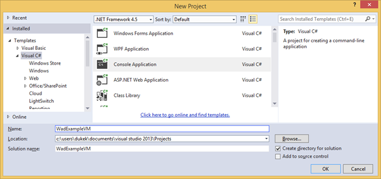

<properties
    pageTitle="So verwenden Sie Azure Diagnose virtuellen | Microsoft Azure"
    description="Verwenden zum Sammeln von Daten aus Azure virtuellen Computern für das Debuggen, Messen der Leistung, Überwachung, Analyse des Datenverkehrs und weitere Azure-Diagnose."
    services="virtual-machines"
    documentationCenter=".net"
    authors="rboucher"
    manager="jwhit"
    editor=""/>

<tags
    ms.service="virtual-machines"
    ms.workload="na"
    ms.tgt_pltfrm="na"
    ms.devlang="dotnet"
    ms.topic="article"
    ms.date="02/20/2016"
    ms.author="robb"/>


# <a name="enabling-diagnostics-in-azure-virtual-machines"></a>Aktivieren der Diagnose in Azure-virtuellen Computern

Einen Hintergrund auf Azure-Diagnose finden Sie unter [Übersicht über Azure-Diagnose](azure-diagnostics.md) .

## <a name="how-to-enable-diagnostics-in-a-virtual-machine"></a>Aktivieren der Diagnose in einer virtuellen Computern

Diese Durchgang durch beschrieben, wie Sie die Diagnose einer Azure-virtuellen Computern Remote von einem Entwicklungscomputer installiert. Außerdem wird vermittelt, wie eine Anwendung implementiert wird, die auf dieser Azure-virtuellen Computern ausgeführt wird, und gibt werden Daten mithilfe der .NET [Quelle Klasse][]aus. Azure Diagnose wird verwendet, um die werden sammeln und speichern in einem Konto Azure-Speicher.

### <a name="pre-requisites"></a>Erforderliche Komponenten
Dieser Einführung in wird davon ausgegangen, Sie haben ein Azure-Abonnement und Visual Studio 2013 mit dem Azure SDK verwenden. Wenn Sie nicht über ein Azure-Abonnement verfügen, können Sie für die [Kostenlose Testversion][]registrieren. Stellen Sie sicher, [Installieren und Konfigurieren von Azure PowerShell Version 0.8.7 oder höher][].

### <a name="step-1-create-a-virtual-machine"></a>Schritt 1: Erstellen eines virtuellen Computers
1.  Starten Sie auf Ihrem Entwicklungscomputer Visual Studio 2013.
2.  In der Visual Studio- **Server-Explorer** **Azure**erweitern, mit der rechten Maustaste **virtuellen Computern** und wählen Sie dann **virtuellen Computern erstellen**.
3.  Wählen Sie im Dialogfeld **Auswählen eines Abonnements** Ihres Abonnements Azure aus, und klicken Sie auf **Weiter**.
4.  Wählen Sie im Dialogfeld **Wählen Sie ein Bild virtuellen Computern** **Windows Server 2012 R2 Datacenter November 2014** aus, und klicken Sie auf **Weiter**.
5.  Legen Sie die **Grundlegenden Einstellungen des virtuellen Computers**der Name des virtuellen Computers zu "Wadexample". Legen Sie Ihren Administrator-Benutzernamen und Ihr Kennwort ein, und klicken Sie auf **Weiter**.
6.  **Cloud Service-Einstellungen** im Dialogfeld erstellen Sie einen neuen Clouddienst mit dem Namen "WadexampleVM" ein. Erstellen einer neuen Speicher Firma mit dem Namen "Wadexample", und klicken Sie auf **Weiter**.
7.  Klicken Sie auf **Erstellen**.

### <a name="step-2-create-your-application"></a>Schritt 2: Erstellen Sie Ihrer Anwendung
1.  Starten Sie auf Ihrem Entwicklungscomputer Visual Studio 2013.
2.  Erstellen Sie eine neue Visual c# Console-Anwendung, die .NET Framework 4.5 ausgerichtet. Nennen Sie das Projekt "WadExampleVM" ein.
    
3.  Ersetzen Sie den Inhalt von "Program.cs" mit den folgenden Code ein. Die Klasse **SampleEventSourceWriter** implementiert vier Protokollierungsmethoden: **SendEnums**, **MessageMethod**, **SetOther** und **HighFreq**. Erste Parameter der Methode WriteEvent definiert die ID für den jeweiligen Ereignis. Die Run-Methode implementiert eine unbegrenzte Schleife, die jeder der Protokollierungsmethoden implementiert in der Klasse **SampleEventSourceWriter** alle 10 Sekunden ruft an.

        using System;
        using System.Diagnostics;
        using System.Diagnostics.Tracing;
        using System.Threading;

        namespace WadExampleVM
        {
        sealed class SampleEventSourceWriter : EventSource
        {
            public static SampleEventSourceWriter Log = new SampleEventSourceWriter();
            public void SendEnums(MyColor color, MyFlags flags) { if (IsEnabled())  WriteEvent(1, (int)color, (int)flags); }// Cast enums to int for efficient logging.
            public void MessageMethod(string Message) { if (IsEnabled())  WriteEvent(2, Message); }
            public void SetOther(bool flag, int myInt) { if (IsEnabled())  WriteEvent(3, flag, myInt); }
            public void HighFreq(int value) { if (IsEnabled()) WriteEvent(4, value); }

        }

        enum MyColor
        {
            Red,
            Blue,
            Green
        }

        [Flags]
        enum MyFlags
        {
            Flag1 = 1,
            Flag2 = 2,
            Flag3 = 4
        }

        class Program
        {
        static void Main(string[] args)
        {
            Trace.TraceInformation("My application entry point called");

            int value = 0;

            while (true)
            {
                Thread.Sleep(10000);
                Trace.TraceInformation("Working");

                // Emit several events every time we go through the loop
                for (int i = 0; i < 6; i++)
                {
                    SampleEventSourceWriter.Log.SendEnums(MyColor.Blue, MyFlags.Flag2 | MyFlags.Flag3);
                }

                for (int i = 0; i < 3; i++)
                {
                    SampleEventSourceWriter.Log.MessageMethod("This is a message.");
                    SampleEventSourceWriter.Log.SetOther(true, 123456789);
                }

                if (value == int.MaxValue) value = 0;
                SampleEventSourceWriter.Log.HighFreq(value++);
            }

        }
        }
        }


4.  Speichern Sie die Datei, und wählen Sie **Lösung erstellen** aus dem Menü **Erstellen** , um den Code zu erstellen.


### <a name="step-3-deploy-your-application"></a>Schritt 3: Bereitstellen Sie Ihrer Anwendung
1.  Mit der rechten Maustaste auf das Projekt **WadExampleVM** im **Solution Explorer** , und wählen Sie **Ordner im Datei-Explorer öffnen**.
2.  Navigieren Sie zu dem Ordner *Bin\Debug* und kopieren Sie alle Dateien (WadExampleVM.*)
3.  Im **Server-Explorer** mit der rechten Maustaste auf den virtuellen Computer, und wählen Sie die **Verbindung herstellen über Remote Desktop**aus.
4.  Nachdem die Verbindung mit dem virtuellen Computer erstellen Sie einen Ordner namens WadExampleVM und Ihrer Anwendung in den Ordner Dateien einfügen.
5.  Starten Sie die Anwendung WadExampleVM.exe. Es sollte eine leere Console-Fenster angezeigt.

### <a name="step-4-create-your-diagnostics-configuration-and-install-the-extension"></a>Schritt 4: Erstellen der Diagnose-Konfigurations, und installieren Sie die Erweiterung
1.  Herunterladen der öffentlichen Konfiguration Datei Schemadefinition auf Ihren Entwicklungscomputer von den folgenden PowerShell-Befehl ausführen:

        (Get-AzureServiceAvailableExtension -ExtensionName 'PaaSDiagnostics' -ProviderNamespace 'Microsoft.Azure.Diagnostics').PublicConfigurationSchema | Out-File -Encoding utf8 -FilePath 'WadConfig.xsd'

2.  Öffnen Sie eine neue XML-Datei in Visual Studio in einem Projekt bereits geöffnete oder in einer Visual Studio-Instanz mit keine Projekte geöffnet. Wählen Sie in Visual Studio **Hinzufügen** -> **Neues Element...**  ->  **C#-Elemente** -> **Daten** -> **XML-Datei**. Benennen Sie die Datei "WadExample.xml"
3.  Ordnen Sie die WadConfig.xsd der Konfigurationsdatei. Stellen Sie sicher, dass das WadExample.xml-Editor-Fenster das aktive Fenster ist. Drücken Sie **F4** , um das Fenster **Eigenschaften** zu öffnen. Klicken Sie auf die Eigenschaft **mithilfe von Schemas** im Fenster **Eigenschaften** . Klicken Sie auf die **...** in der Eigenschaft **mithilfe von Schemas** . Klicken Sie auf die **hinzufügen...** Schaltfläche, und navigieren Sie zu dem Speicherort, an dem Sie die XSD-Datei gespeichert, und wählen Sie die Datei WadConfig.xsd. Klicken Sie auf **OK**.
4.  Ersetzen Sie den Inhalt der Konfigurationsdatei WadExample.xml mit den folgenden XML-Code ein, und speichern Sie die Datei. Diese Konfigurationsdatei definiert einige Leistungsindikatoren zu sammeln: eine für die CPU-Auslastung und eine für die arbeitsspeichernutzung. Klicken Sie dann definiert die Konfiguration der vier Ereignisse, die Methoden in der Klasse SampleEventSourceWriter entspricht.

```
        <?xml version="1.0" encoding="utf-8"?>
        <PublicConfig xmlns="http://schemas.microsoft.com/ServiceHosting/2010/10/DiagnosticsConfiguration">
            <WadCfg>
                <DiagnosticMonitorConfiguration overallQuotaInMB="25000">
                <PerformanceCounters scheduledTransferPeriod="PT1M">
                    <PerformanceCounterConfiguration counterSpecifier="\Processor(_Total)\% Processor Time" sampleRate="PT1M" unit="percent" />
                    <PerformanceCounterConfiguration counterSpecifier="\Memory\Committed Bytes" sampleRate="PT1M" unit="bytes"/>
                    </PerformanceCounters>
                    <EtwProviders>
                        <EtwEventSourceProviderConfiguration provider="SampleEventSourceWriter" scheduledTransferPeriod="PT5M">
                            <Event id="1" eventDestination="EnumsTable"/>
                            <Event id="2" eventDestination="MessageTable"/>
                            <Event id="3" eventDestination="SetOtherTable"/>
                            <Event id="4" eventDestination="HighFreqTable"/>
                            <DefaultEvents eventDestination="DefaultTable" />
                        </EtwEventSourceProviderConfiguration>
                    </EtwProviders>
                </DiagnosticMonitorConfiguration>
            </WadCfg>
        </PublicConfig>
```

### <a name="step-5-remotely-install-diagnostics-on-your-azure-virtual-machine"></a>Schritt 5: Installieren Sie Remote Diagnose auf Ihre Azure-virtuellen Computern
Sind die PowerShell-Cmdlets für die Verwaltung von Diagnose eines virtuellen Computers: Set-AzureVMDiagnosticsExtension und Get-AzureVMDiagnosticsExtension-AzureVMDiagnosticsExtension entfernen.

1.  Öffnen Sie auf Ihrem Computer Entwicklertools Azure PowerShell aus.
2.  Führen Sie das Skript zum Remote Diagnose Ihrer virtuellen Computers (ersetzen *StorageAccountKey* mit dem Speicher kontoschlüssel für Ihr Konto des Wadexamplevm Speicher) zu installieren:

        $storage_name = "wadexamplevm"
        $key = "<StorageAccountKey>"
        $config_path="c:\users\<user>\documents\visual studio 2013\Projects\WadExampleVM\WadExampleVM\WadExample.xml"
        $service_name="wadexamplevm"
        $vm_name="WadExample"
        $storageContext = New-AzureStorageContext -StorageAccountName $storage_name -StorageAccountKey $key
        $VM1 = Get-AzureVM -ServiceName $service_name -Name $vm_name
        $VM2 = Set-AzureVMDiagnosticsExtension -DiagnosticsConfigurationPath $config_path -Version "1.*" -VM $VM1 -StorageContext $storageContext
        $VM3 = Update-AzureVM -ServiceName $service_name -Name $vm_name -VM $VM2.VM


### <a name="step-6-look-at-your-telemetry-data"></a>Schritt 6: Prüfen Sie Ihre Daten werden
Navigieren Sie in der Visual Studio- **Server-Explorer** mit dem Wadexample Speicher-Konto. Nachdem Sie der virtuellen Computer etwa 5 Minuten ausgeführt wurde sollte die Tabellen **WADEnumsTable**, **WADHighFreqTable**, **WADMessageTable**, **WADPerformanceCountersTable** und **WADSetOtherTable**angezeigt werden. Doppelklicken Sie auf eine der Tabellen im telemetrieprotokoll anzeigen möchten, die gesammelt wurden.


## <a name="configuration-file-schema"></a>Konfiguration Dateischema

Die Diagnose Konfigurationsdatei definiert Werte, die Einstellungen diagnostic Konfiguration Initialisierung beim Start des Diagnose-Agents verwendet werden. Finden Sie die [neuesten Schema verweisen](https://msdn.microsoft.com/library/azure/mt634524.aspx) gültige Werte und Beispiele für.

## <a name="troubleshooting"></a>Behandlung von Problemen

Weitere Informationen finden Sie unter [Problembehandlung Azure-Diagnose](azure-diagnostics-troubleshooting.md) .


## <a name="next-steps"></a>Nächste Schritte
So ändern Sie die Daten, die Sie sammeln, [eine Liste von virtuellen Computern finden Sie unter Verwandte Azure Diagnose Artikel](azure-diagnostics.md#virtual-machines-using-azure-diagnostics) Behandeln von Problemen oder erfahren Sie mehr über Diagnose im Allgemeinen.


[Quelle Klasse]: http://msdn.microsoft.com/library/system.diagnostics.tracing.eventsource(v=vs.110).aspx

[Debugging an Azure Application]: http://msdn.microsoft.com/library/windowsazure/ee405479.aspx   
[Collect Logging Data by Using Azure Diagnostics]: http://msdn.microsoft.com/library/windowsazure/gg433048.aspx
[Kostenlose Testversion]: http://azure.microsoft.com/pricing/free-trial/
[Installieren und Konfigurieren von Azure PowerShell Version 0.8.7 oder höher]: http://azure.microsoft.com/documentation/articles/install-configure-powershell/
