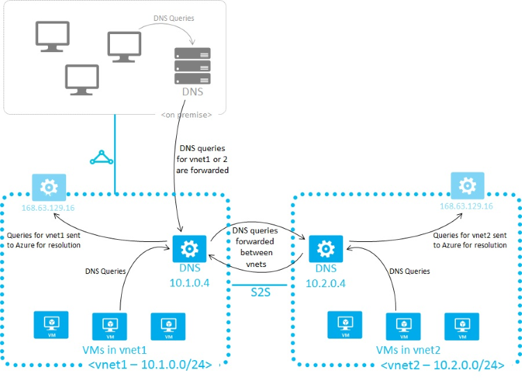

<properties 
   pageTitle="DNS-Namen mit einer Auflösung von Optionen für Linux virtuellen Computern in Azure"
   description="Namen mit einer Auflösung von Szenarien Linux virtuellen Computern in Azure IaaS, einschließlich bereitgestellten DNS-Dienste, Hybrid externen DNS und zeigen Sie Ihre eigenen DNS-Server."
   services="virtual-machines"
   documentationCenter="na"
   authors="RicksterCDN"
   manager="timlt"
   editor="tysonn" />
<tags 
   ms.service="virtual-machines-linux"
   ms.devlang="na"
   ms.topic="article"
   ms.tgt_pltfrm="na"
   ms.workload="infrastructure-services"
   ms.date="10/19/2016"
   ms.author="rclaus" />

# DNS-Namen mit einer Auflösung von Optionen für Linux virtuellen Computern in Azure

Azure bietet mit einer Auflösung von DNS-Namen standardmäßig für alle virtuellen Computern in einem einzigen virtuellen Netzwerk enthalten sind. Sie können Ihre eigenen DNS-Namen mit einer Auflösung von Lösung implementieren, indem Sie Ihre eigenen DNS-Dienste auf Ihre Azure gehosteten virtuellen Computern konfigurieren. Die folgenden Szenarien hilfreiche Informationen auswählen, welches am besser für Ihre jeweiligen Situation funktioniert.

- [Mit einer Auflösung von Azure bereitgestellten Namen](#azure-provided-name-resolution)

- [Verwenden Ihre eigenen DNS-Server mit einer namensauflösung von](#name-resolution-using-your-own-dns-server) 

Der Typ des namensauflösung, die Sie verwenden, hängt davon ab, wie Ihre virtuellen Computern und Rolleninstanzen kommunizieren müssen.

**Die folgende Tabelle zeigt die Szenarien und den entsprechenden Namen mit einer Auflösung von Lösungen:**

| **Szenario** | **Lösung** | **Suffix** |
|--------------|--------------|----------|
| Mit einer namensauflösung von zwischen Rolleninstanzen oder virtuellen Computern, die sich im gleichen virtuellen Netzwerk befinden | [Mit einer Auflösung von Azure bereitgestellten Namen](#azure-provided-name-resolution)| Hostname oder FQDN |
| Mit einer namensauflösung von zwischen Rolleninstanzen oder virtuelle Computer befindet sich in verschiedenen virtuellen Netzwerken | Kunden verwaltete DNS-Weiterleitung Abfragen zwischen Vnets für die Auflösung von Azure (DNS-Proxy).  finden Sie unter [mit einer Auflösung von Namen mithilfe Ihrer eigenen DNS-server](#name-resolution-using-your-own-dns-server)| Nur FQDN |
| Lokaler Computer und Service-Namen aus Rolleninstanzen oder virtuellen Computern in Azure Auflösung | Kunden verwaltet DNS-Server (lokal Domänencontroller, lokalen schreibgeschützt Domänencontroller oder einer sekundären DNS synchronisiert mit einer Übertragung der Zone).  Finden Sie unter [mit einer Auflösung von Namen mithilfe Ihrer eigenen DNS-server](#name-resolution-using-your-own-dns-server)|Nur FQDN |
| Mit einer Auflösung von Azure Hostnamen aus lokalen Computern | Weiterleitung von Abfragen an einen Kunden verwaltete DNS-Proxyserver in den entsprechenden Vnet, leitet der Proxyserver Abfragen in Azure für Auflösung. Finden Sie unter [mit einer Auflösung von Namen mithilfe Ihrer eigenen DNS-server](#name-resolution-using-your-own-dns-server)| Nur FQDN |
| Reverse-DNS-für internen IP-Adressen | [Verwenden Ihre eigenen DNS-Server mit einer namensauflösung von](#name-resolution-using-your-own-dns-server) | n/v |

## Mit einer Auflösung von Azure bereitgestellten Namen

Zusammen mit einer Auflösung von öffentlichen DNS-Namen bietet Azure mit einer Auflösung von internen Namen für virtuellen Computern und Rolleninstanzen, die innerhalb der gleichen virtuellen Netzwerk befinden.  In der Cloud-basierte virtuelle Netzwerke das DNS-Suffix konsistent im virtuellen Netzwerk (, damit Sie der vollqualifizierten Domänennamen nicht mehr benötigt wird) und DNS-Namen können sowohl NICs und virtuellen Computern zugewiesen werden. Obwohl Azure bereitgestellten namensauflösung keine Konfiguration erforderlich ist, ist es nicht die entsprechende Option für die in allen Bereitstellungsszenarien wie in der obigen Tabelle angezeigt.

### Features und Aspekte

**Features:**

- Center für erleichterte Bedienung: mit Azure bereitgestellten namensauflösung ist keine Konfiguration erforderlich.

- Dienst mit einer Auflösung von Azure bereitgestellten Namen ist hoch verfügbar, speichern Sie die müssen Cluster Ihrer eigenen DNS-Server erstellen und verwalten.

- Kann zusammen mit Ihrer eigenen DNS-Server verwendet werden, um lokal und Azure Hostnamen aufzulösen.

- Mit einer namensauflösung von werden zwischen virtuellen Computern in virtuelle Netzwerke ohne Notwendigkeit den vollqualifizierten Domänennamen bereitgestellt. 

- Hostnamen, die Bereitstellung Ihrer am besten beschreiben können anstatt arbeiten mit Namen automatisch generiert.

**Aspekte:**

- Das Azure erstellte DNS-Suffix kann nicht geändert werden.

- Sie können eigene Einträge nicht manuell registrieren.

- WINS- und NetBIOS werden nicht unterstützt.

- Hostnamen muss DNS-kompatible (müssen sie nur 0-9, a-Z verwenden und '-', und kann nicht mit beginnen oder enden eines ' – '. Siehe RFC 3696 Abschnitt 2.)

- DNS-Abfragedatenverkehr für jeden virtuellen Computer beschränkt. Dies sollte nicht die meisten Applikationen auswirken.  Sicherstellen Sie Anforderung begrenzungsebene beobachtet wird, dass clientseitige Zwischenspeichern aktiviert ist.  Weitere Informationen finden Sie unter [optimale Nutzung von Azure bereitgestellten namensauflösung](#Getting-the-most-from-Azure-provided-name-resolution).

### Die optimale Nutzung Azure bereitgestellten namensauflösung
**Clientseitige Zwischenspeichern:**

Nicht alle DNS-Abfrage wird im Netzwerk gesendet.  Clientseitige Zwischenspeichern hilft Wartezeit reduzieren und Stabilität bei Network ahnen verbessern, indem Sie die Auflösung von periodischen DNS-Abfragen aus einem lokalen Cache.  DNS-Einträge enthalten eine Time To Live (TTL) der Cache den Eintrag so lange zu speichern, ohne Datensatz Aktualität beeinträchtigen können.  Aus diesem Grund ist die clientseitige Zwischenspeichern für den meisten Fällen geeignet.

Einige Linux Distros enthalten nicht standardmäßig Zwischenspeichern.  Es wird empfohlen, dass Sie eine für jede Linux VM (nach dem Überprüfen, dass es noch kein lokaler Cache) hinzufügen.

Es gibt mehrere verschiedene DNS-Einträge zwischenspeichern Pakete verfügbar, beispielsweise Dnsmasq, hier werden die Schritte zur Installation von Dnsmasq auf die am häufigsten verwendeten Distros:

- **Ubuntu (verwendet Resolvconf)**:
    - Installieren Sie das Paket Dnsmasq ("Sudo apt-Get-Installation Dnsmasq").
- **SUSE (verwendet Netconf)**:
    - Installieren Sie das Paket Dnsmasq ("Sudo Zypper Installation Dnsmasq") 
    - Aktivieren Sie den Dienst Dnsmasq ("Systemctl aktivieren dnsmasq.service") 
    - Starten Sie den Dienst Dnsmasq ("Systemctl Start dnsmasq.service") 
    - Bearbeiten "/ usw./Sysconfig/Network/Config", und ändern Sie NETCONFIG_DNS_FORWARDER = "" auf "Dnsmasq"
    - Aktualisieren von resolv.conf ("Netconfig Update"), um den Cache festlegen als die lokale DNS-Auflösung
- **OpenLogic (NetworkManager verwendet)**:
    - Installieren Sie das Paket Dnsmasq ("Sudo Yum installieren Dnsmasq")
    - Aktivieren Sie den Dienst Dnsmasq ("Systemctl aktivieren dnsmasq.service")
    - Starten Sie den Dienst Dnsmasq ("Systemctl Start dnsmasq.service")
    - Hinzufügen von "vorangestellt Domain Name Servers 127.0.0.1;", "/etc/dhclient-eth0.conf"
    - Starten Sie den Netzwerkdienst ("Service Netzwerk Neustart"), um den Cache als die lokale DNS-Auflösung festlegen

> [AZURE.NOTE]: Das Paket 'Dnsmasq' ist nur eine der vielen DNS-Caches für Linux verfügbar.  Bevor Sie es verwenden, überprüfen Sie die Verwendbarkeit für Ihre Bedürfnisse und, die keine anderen Cache installiert ist.

**Clientseitige Wiederholungsversuche:**

DNS ist hauptsächlich ein UDP-Protokoll.  Wie das UDP-Protokoll Nachrichtenübermittlung sichergestellt ist nicht, wird in der DNS-Protokoll selbst Logik Wiederholungsversuche behandelt.  Jeder DNS-Client (Betriebssystem) kann ein Logik für verschiedene Wiederholungsversuche je nach der Einstellung für Ersteller aufweisen:

 - Windows-Betriebssysteme versuchen Sie es erneut einen zweiten, und klicken Sie dann erneut nach einem anderen zwei, vier und einen anderen vier Sekunden. 
 - Die standardmäßigen Linux Setup Wiederholungsversuche nach fünf Sekunden.  Ändern Sie diese Option, um auf einer Sekunde Intervallen fünf Mal wiederholen.  

So überprüfen Sie die aktuellen Einstellungen auf einer Linux VM, 'Katze /etc/resolv.conf', und achten Sie auf die Zeile 'Optionen', beispielsweise:

    options timeout:1 attempts:5

Die Datei resolv.conf wird automatisch generiert und dürfen nicht bearbeitet werden.  Die einzelnen Schritte für das Hinzufügen der Zeile 'Optionen' variieren je nach Distro:

- **Ubuntu** (verwendet Resolvconf):
    - Fügen Sie die Optionen Linie ' / etc/resolveconf/resolv.conf.d/head' 
    - Führen Sie 'Resolvconf -u' aktualisieren
- **SUSE** (verwendet Netconf):
    - Hinzufügen von 'Timeout:1 Versuche: 5' in der NETCONFIG_DNS_RESOLVER_OPTIONS = "" Parameter in '/ usw./Sysconfig/Network/Config' 
    - Ausführen von 'Netconfig Update' aktualisieren
- **OpenLogic** (verwendet NetworkManager):
    - 'Echo "Optionen Timeout:1 Versuche: 5" ' hinzufügen ' / etc/NetworkManager/dispatcher.d/11-dhclient' 
    - Ausführen 'Netzwerk Restart-service' aktualisieren

## Verwenden Ihre eigenen DNS-Server mit einer namensauflösung von
Es gibt mehrere Situationen, in dem Indexeigenschaften mit einer Auflösung von Namen die Features hinausgehen möglicherweise, sofern durch Azure, beispielsweise wenn Sie zwischen virtuelle Netzwerke (Vnets) mit einer Auflösung von DNS-erforderlich.  Um dieses Szenario verwischen, bietet Azure die Möglichkeit, damit Sie Ihre eigenen DNS-Server verwenden.  

DNS-Server in einem virtuellen Netzwerk können DNS-Abfragen an den Azure rekursive Server Problembehebung Hostnamen innerhalb dieses virtuellen Netzwerks weiterleiten.  Beispielsweise kann auf einem Computer unter in Azure Antworten auf DNS-Abfragen für ihren eigenen DNS Zonendateien und alle anderen Abfragen an Azure weiterleiten.  Dadurch wird sowohl der Einträge in der Zonendateien und Azure bereitgestellte Hostnamen (über die Weiterleitung) finden Sie unter virtuelle Computer.  Zugriff auf den Azure rekursive Server wird über die virtuelle IP-Adresse 168.63.129.16 bereitgestellt.

DNS-Weiterleitung auch ermöglicht zwischen Vnet DNS-Auflösung und Ihre Computer lokal bereitgestellte Azure Hostnamen auflösen.  Um eine virtuellen Computers Hostname zu beheben, der DNS-Server virtueller Computer muss sich in der gleichen virtuellen Netzwerk befinden und für die weiterleiten Hostname Abfragen an Azure konfiguriert werden.  Wie das DNS-Suffix in jeder Vnet abweicht, können Sie bedingte Weiterleitungsregeln, DNS-Abfragen an die richtige Vnet für Auflösung senden.  Die folgende Abbildung zeigt zwei Vnets und ein lokal Netzwerk zwischen Vnet DNS-Auflösung verwenden diese Methode ausführen:

Wenn Sie mit einer Auflösung von Azure bereitgestellten Namen verwenden zu können, werden das internen DNS-Suffix jedes virtuellen Computer bereitgestellt mit DHCP.  Wenn Sie Ihre eigene Namen mit einer Auflösung von Lösung verwenden, wird dieses Suffix nicht auf virtuellen Computern angegeben werden, da es mit anderen DNS-Architekturen beeinträchtigt.  Auf Computern, die über den vollqualifizierten Domänennamen verweisen, oder konfigurieren Sie das Suffix auf Ihre virtuellen Computern, kann das Suffix mithilfe der PowerShell oder der API ermittelt werden:

-  Für Azure Ressourcenverwaltung Vnets verwaltete, das Suffix über die Ressource [Netzwerk Benutzeroberflächen-Karte steht](https://msdn.microsoft.com/library/azure/mt163668.aspx) oder können Sie den Befehl ausführen `azure network public-ip show <resource group> <pip name>` die Details Ihrer öffentliche IP-Adresse den vollqualifizierten Domänennamen des des Netzwerkschnittstellenadapters einschließlich angezeigt werden.    

Wenn die Weiterleitung von Abfragen in Azure nicht Ihren Anforderungen entsprechend, müssen Sie Ihre eigenen DNS-Lösung bereitzustellen.  Ihre DNS-Lösung muss:

-  Bieten Sie entsprechende Hostname Lösung, beispielsweise über [DDNS](../virtual-network/virtual-networks-name-resolution-ddns.md).  Notiz, wenn DDNS verwenden, müssen Sie möglicherweise Deaktivieren des DNS-Eintrag Managers während des Azure DHCP-Leases sehr lange und Aufräumen sind, möglicherweise DNS-Einträge vorzeitig entfernen. 
-  Bieten Sie entsprechende rekursive Auflösung an, damit mit einer Auflösung von externen Domänennamen ein.
-  Zugänglich (TCP und UDP auf Port 53) von Clients, die sie dient und auf das Internet zugreifen.
-  Vor Zugriff geschützt werden, aus dem Internet, zum Einschränken von externen Agents ausgehenden dieser Risiken.

> [AZURE.NOTE] Zur Optimierung der Systemleistung bei Verwendung Azure-virtuellen Computern als DNS-Server IPv6 deaktiviert werden sollen, und eine [Instanz Ebene öffentliche IP-Adresse](../virtual-network/virtual-networks-instance-level-public-ip.md) den einzelnen DNS-Server virtueller Computer zugewiesen werden sollen.  

