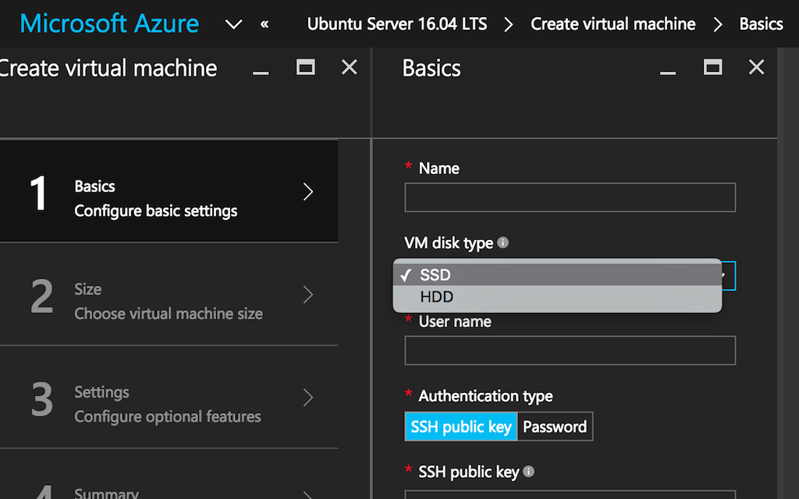

<properties
  pageTitle="Azure und Linux virtueller Computer Speicher | Microsoft Azure"
  description="Beschreibt Azure Standard- und Premium-Speicher mit Linux virtuellen Computern an."
  services="virtual-machines-linux"
  documentationCenter="virtual-machines-linux"
  authors="vlivech"
  manager="timlt"
  editor=""/>

<tags
  ms.service="virtual-machines-linux"
  ms.devlang="NA"
  ms.topic="article"
  ms.tgt_pltfrm="vm-linux"
  ms.workload="infrastructure"
  ms.date="10/04/2016"
  ms.author="v-livech"/>

# <a name="azure-and-linux-vm-storage"></a>Azure und Linux VM-Speicher

Azure-Speicher ist die Cloud-Speicher-Lösung für moderne, die auf die Zuverlässigkeit, Verfügbarkeit und Skalierbarkeit auf die Bedürfnisse seiner Kunden aufsetzen.  Zusätzlich lässt sich für Entwickler umfangreiche Clientanwendungen zur Unterstützung von neuer Szenarien erstellen, bietet Azure-Speicher die Speicher als Grundlage auch für Azure virtuellen Computern.

## <a name="azure-storage-standard-and-premium"></a>Azure-Speicher: Standard- und Premium

Azure virtuellen Computers kann bei der standard-Datenträger oder Premium-Datenträger erstellt werden.  Wenn Sie das Portal wählen Sie Ihre virtuellen Computer mit müssen Sie eine Dropdown-Liste auf dem Bildschirm Grundlagen Standard- und Premium Laufwerke anzeigen umschalten.  Im folgenden Screenshot hervorgehoben dieser Schalter Menü.  Wenn der umgeschaltet zu SSD, nur Premium Speicher aktivierte virtuellen Computern angezeigt werden, alle durch SSD gesicherten Laufwerke.  Wenn auf der Festplatte umgeschaltet, aktiviert standardmäßigen Speicher virtuellen Computern gesicherten dreht Laufwerke, zusammen mit Premium Speicher angezeigt werden virtuellen Computern durch SSD unterstützt.

  

Beim Erstellen eines virtuellen Computers aus der `azure-cli` Sie können die Auswahl zwischen Standard- und Premium beim Auswählen der virtueller Speicher über die `-z` oder `--vm-size` Cli kennzeichnen.

### <a name="create-a-vm-with-standard-storage-vm-on-the-cli"></a>Erstellen eines virtuellen Computers mit standardmäßigen Speicher virtueller Computer auf die cli

Die Kennzeichnung Cli `-z` Standard_A1 wählt mit A1 standard-Speicher basiert, Linux VM.

```bash
azure vm quick-create -g rbg \
exampleVMname \
-l westus \
-y Linux \
-Q Debian \
-u exampleAdminUser \
-M ~/.ssh/id_rsa.pub
-z Standard_A1
```

### <a name="create-a-vm-with-premium-storage-on-the-cli"></a>Erstellen eines virtuellen Computers mit Premium-Speicher auf die cli

Die Kennzeichnung Cli `-z` Standard_DS1 wählt mit DS1 wird eine Premium-Speicher Linux VM basiert.

```bash
azure vm quick-create -g rbg \
exampleVMname \
-l westus \
-y Linux \
-Q Debian \
-u exampleAdminUser \
-M ~/.ssh/id_rsa.pub
-z Standard_DS1
```

## <a name="standard-storage"></a>Standard-Speicher

Azure Standard-Speicher ist der Standardtyp-Speicher.  Standard-Speicher ist während leistungsfähigen kostengünstiger.  

## <a name="premium-storage"></a>Premium-Speicher

Azure Premium-Speicher bietet leistungsfähige und niedrig Wartezeiten Datenträger Unterstützung für virtuellen Computern ich/O-Auslastung Auslastung ausgeführt werden. Datenträger virtuellen Computern (virtueller Computer), mit denen Storage Premium speichern Daten auf einfarbige Zustand Laufwerken (SSDs). Sie können Ihrer Anwendung virtueller Computer Datenträger in Azure Premium Speicher nutzen der Geschwindigkeit und Leistung von diese Datenträger ausführen migrieren.

Premium Speicher-Features:

- Premium-Datenträger: Azure Premium-Speicher unterstützt virtueller Computer Datenträger, auf denen DS, DSv2 oder GS Reihe Azure-virtuellen Computern angefügt werden können.

- Premium Seite Blob: Premium Speicher unterstützt Azure Seitenblobs, die zum beständigen Datenträger für Azure virtuellen Computern (virtuellen Computern) halten verwendet werden.

- Premium lokal redundante Speicher: Ein Konto Premium Speicher nur lokal redundante Speicher (LRS) als die Replikationsoption unterstützt und behält drei Kopien der Daten in einem einzigen Bereich.

- [Premium-Speicher](../storage/storage-premium-storage.md)

## <a name="premium-storage-supported-vms"></a>Premium Speicher unterstützt virtuellen Computern

Premium Speicher unterstützt DS-Serie, DSv2-Serie, GS-Serie und Fs-Serie Azure-virtuellen Computern (virtuelle Computer). Sie können mit Premium-Speicher von virtuellen Computern unterstützt sowohl Standard- und Premium-Datenträger verwenden. Doch Sie können Datenträger Premium mit virtueller Computer Datenreihe, die nicht Premium Speicher kompatibel sind.

Im folgenden werden die Linux-Versionen, die wir überprüft mit Premium-Speicher.

| Verteilung | Version                 | Unterstützte Kernel    |
|--------------|-------------------------|---------------------|
| Ubuntu       | 12.04                   | 3.2.0-75.110+       |
| Ubuntu       | 14.04                   | 3.13.0-44.73+       |
| Debian       | 7.x, 8.x                | 3.16.7-ckt4-1+      |
| SLES         | SLES 12                 | 3.12.36-38.1+       |
| SLES         | SLES 11 SP4             | 3.0.101-0.63.1+     |
| CoreOS       | 584.0.0+                | 3.18.4+             |
| CentOS       | 6.5, 6.6, 6,7, 7.0, 7.1 | 3.10.0-229.1.2.el7+ |
| RHEL         | 6.8 +, 7.2 +              |                     |


## <a name="file-storage"></a>Speichern von Daten

Azure Dateispeicher bietet Dateifreigaben in der Cloud, mit dem standardmäßigen SMB-Protokoll. Mit Azure-Dateien können Sie Enterprise Applications migrieren, die auf Dateiserver an Azure aufsetzen. In Azure ausgeführt Applications können einfach Dateifreigaben aus Azure-virtuellen Computern mit Linux bereitstellen. Und mit der neuesten Version von Dateispeicher, können Sie auch eine Dateifreigabe aus einer lokalen-Anwendung, die SMB 3.0 unterstützt, bereitstellen.  Da Dateifreigaben SMB-Freigaben sind, können Sie über standard-Dateisystem-APIs zugreifen.

Dateispeicher basiert auf derselben Technologie wie Warteschlange, Tabelle und Blob-Speicher, damit Dateispeicher bietet die Verfügbarkeit, Zuverlässigkeit, Skalierbarkeit und Geo Redundanz, die in der Azure-Speicher-Plattform integriert ist. Details zur Datei Speicher Leistungsziele und Grenzwerte finden Sie unter Azure-Speicher Skalierbarkeit und Leistungsziele.

- [Verwenden von Azure Dateispeicher mit Linux](../storage/storage-how-to-use-files-linux.md)

## <a name="hot-storage"></a>Wichtiges Speicher

Die tollen Azure-Speicherebene wurde optimiert, zum Speichern von Daten, die häufig zugegriffen werden kann.  Wichtiges Speicher ist der Speicher Standardtyp für Blob-Speicher.

## <a name="cool-storage"></a>Aussagekräftige Speicher

Die Ebene aussagekräftige Azure-Speicher ist optimiert, zum Speichern von Daten, die sich selten zugänglich und langer Lebensdauer befindet. Beispiel verwenden Fällen aussagekräftige Storage gehören Sicherungskopien, Medieninhalten, wissenschaftliche Daten, Compliance und Archivierung Daten. Im Allgemeinen sind alle Daten, die sich selten ideale Kandidaten für aussagekräftige Speicher.

|                             | Wichtiges Speicherebene      | Aussagekräftige Speicherebene     |
|:----------------------------|:---------------------:|:---------------------:|
| Verfügbarkeit                | 99,9 %                 | 99 %                   |
| Verfügbarkeit (RAS-GRS liest) | 99,99 %                | 99,9 %                 |
| Verwendung Gebühren               | Höhere Kosten für die Speicherung  | Speicher senken   |
|                             | Unteren access          | Höhere access         |
|                             | und Transaktionskosten | und Transaktionskosten |


## <a name="redundancy"></a>Redundanz

Die Daten in Ihrem Microsoft Azure-Speicher-Konto ist immer repliziert, um Zuverlässigkeit und hohe Verfügbarkeit, der Azure-Speicher Vereinbarung zum SERVICELEVEL auch unter vorübergehende Hardware-Fehlern Besprechung sicherzustellen.

Wenn Sie ein Speicherkonto erstellen, müssen Sie eine der folgenden Optionen für die Replikation auswählen:

- Lokal redundante Speicher (LRS)
- Zone redundante Speicher (ZRS)
- Geo redundante Speicher (GRS)
- Lesezugriff Geo redundante Speicher (RAS-GRS)

### <a name="locally-redundant-storage"></a>Lokal redundante Speicher

Lokal redundante Speicher (LRS) repliziert die Daten in der Region, in der Sie Ihr Speicherkonto erstellt haben. Um Zuverlässigkeit maximieren, wird jeder Anforderung von Daten in Ihr Speicherkonto dreimal repliziert. Diese drei Replikationen jedes befinden sich in separaten Fehlerstrukturanalyse und Upgrade-Domänen.  Eine Anforderung erfolgreich zurückgegeben wird nur einmal auf alle drei Replikate geschrieben wurde.

### <a name="zone-redundant-storage"></a>Zone redundante Speicher

Zone redundante Speicher (ZRS) repliziert die Daten über zwei oder drei Fertigungsanlagen, in einem einzigen Bereich oder über zwei Bereiche höhere Zuverlässigkeit als LRS bereitstellen. Wenn Ihr Speicherkonto ZRS aktiviert wurde, ist Ihre Daten dauerhaften, auch wenn Fehler bei eins der Anlagen.

### <a name="geo-redundant-storage"></a>Geo redundante Speicher

Geo redundante Speicher (GRS) repliziert Ihre Daten sekundäre Region ein, die hundert Meilen von der primären Region ist. Wenn Ihr Speicherkonto GRS aktiviert wurde, ist Ihre Daten dauerhaften sogar im Fall einer abgeschlossen regionalen Ausfall oder eine in dem die primäre Region nicht wiederhergestellt werden kann.

### <a name="read-access-geo-redundant-storage"></a>Lesezugriff Geo redundante Speicher

Lesezugriff Geo redundante Speicher (RAS-GRS) maximiert Verfügbarkeit für Ihr Speicherkonto durch die Bereitstellung von schreibgeschützten Zugriff auf die Daten in der sekundäre Speicherort, sowie die Replikation über zwei Bereiche von GRS bereitgestellt. Die Daten in der primären Region nicht mehr verfügbar ist, kann die Anwendung Daten aus einer zweiten Region sekundäre lesen.

Für ein Tiefer Einblick in Azure-Speicher Redundanz finden Sie unter:

- [Azure Speicherreplikation](../storage/storage-redundancy.md)

## <a name="scalability"></a>Skalierbarkeit

Azure-Speicher ist hochgradig skalierbar, daher Sie speichern können und Verfahren zum Hunderte TB Daten zur Unterstützung der Szenarien big Data wissenschaftlichen, finanzielle Analyse und Medien Applikationen erforderlich. Oder Sie können die geringe Mengen von Daten, die für eine Website für kleine Unternehmen erforderlich speichern. Wo liegen Ihren Anforderungen, Zahlen Sie nur für die Daten, die Sie gespeichert ist. Azure-Speicher aktuell Dutzende Billionen eindeutige Kunden-Objekte speichert und Millionen von Abfragen pro Sekunde Durchschnitt behandelt.

Für den standardmäßigen Speicherkonten: einen Höchstwert für insgesamt die Anforderung Satz von 20.000 IOPS über ein standard Speicherkonto verfügt. Die Summe IOPS über alle virtuellen Computern Datenträger in einem standardmäßigen Speicherkonto sollte nicht diese Beschränkung überschreiten.

Für Speicher-Konten Premium: eine Premium Storage-Konto hat eine maximale total Durchsatzrate der 50 Gbps. Der Gesamtdurchsatz über alle Datenträger virtueller Computer sollte nicht diese Beschränkung überschreiten.

## <a name="availability"></a>Verfügbarkeit

Wir sichergestellt ist, dass mindestens 99,99 % (99,9 % für aussagekräftige Access-Leiste) der Zeit, wir erfolgreich Anfragen zum Lesen von Daten aus Lesezugriff-Geo redundante Speicherung (RAS-GRS)-Konten angewendet wird vorausgesetzt, dass fehlgeschlagene Versuche zum Lesen von Daten aus der primären Region auf der Sekundärachse Region wiederholt werden.

Wir sichergestellt ist, dass mindestens 99,9 % (99 % für aussagekräftige Access-Leiste) der Zeit, wir erfolgreich Anfragen zum Lesen von Daten aus lokal redundante Speicher (LRS), Zone redundante Speicher (ZRS) und Geo redundante Speicher (GRS) Konten angewendet wird.

Wir sichergestellt ist, dass mindestens 99,9 % (99 % für aussagekräftige Access-Leiste) der Zeit, wir erfolgreich Anfragen zum Schreiben von Daten lokal redundante Speicher (LRS), Zone redundante Speicher (ZRS), und Konten Geo redundante Speicher (GRS) und Lesezugriff-Geo redundante Speicherung (RAS-GRS)-Konten angewendet wird.

- [Azure Vereinbarung zum SERVICELEVEL für Speicher](https://azure.microsoft.com/support/legal/sla/storage/v1_1/)


## <a name="regions"></a>Regionen

Azure steht in der Regel in 30 Regionen auf der ganzen Welt und Pläne für 4 zusätzliche Regionen hat angekündigt. Geografische Erweiterung denn eine Priorität für Azure ermöglicht es unsere Kunden bessere Leistung zu erzielen und ihre Anforderungen und Einstellungen zu Datenspeicherort unterstützt.  Azures neueste Region zu starten, ist in Deutschland.

Die Microsoft-Cloud-Deutschland bietet die Option gestaffelte den Microsoft-Cloud-Diensten, die bereits verfügbar in ganz Europa, höhere Verkaufschancen für Innovationen und economic Wachstum für hochgradig regulierten Partner und Kunden in Deutschland, der Europäischen Union (EU) und der Europäischen Association (EFTA) erstellen.

Kundendaten in diese neuen Rechenzentren, Magdeburg und Frankfurt, werden unter dem Steuerelement Treuhänder Daten, T-Systems International, eine unabhängige Firma, die Deutsch und Niederlassung der deutschen Telekom verwaltet. Microsoft kommerzielle Cloud Services in diese Rechenzentren Deutsch Datenverarbeitung Vorschriften entsprechen, und geben Kunden Weitere Auswahlmöglichkeiten anzuzeigen, der wie und wo Daten verarbeitet werden.


- [Zuordnen von Azure Regionen](https://azure.microsoft.com/regions/)

## <a name="security"></a>Sicherheit

Azure-Speicher bietet eine umfassende Reihe von Sicherheitsfunktionen, die zusammen Entwickler sichere Applications erstellen können. Das Speicherkonto selbst kann mithilfe von Access Control rollenbasierte und Azure Active Directory gesichert werden. Daten können mit clientseitig Verschlüsselung, HTTPS oder SMB 3.0 im Übergang zwischen einer Anwendung und Azure gesichert werden. Daten können mit festgelegt werden automatisch verschlüsselt werden, wenn in den Azure-Speicher geschrieben Speicher Dienst Verschlüsselung (SSE). Betriebssystem und die Daten der von virtuellen Computern verwendete Datenträger können festgelegt werden, mit Azure Datenträger Verschlüsselung verschlüsselt werden. Delegierter Zugriff auf die Datenobjekte in Azure-Speicher kann mithilfe von freigegebenen Access Signaturen erteilt werden.

### <a name="management-plane-security"></a>Sicherheit bei der Verwaltung Ebene

Die Ebene Management besteht aus den Ressourcen verwendet, um Ihr Speicherkonto verwalten. In diesem Abschnitt werden wir über das Modell zur Bereitstellung von Azure Ressourcenmanager und wie Sie rollenbasierte Access Control (RBAC) zu verwenden, um die Steuerung des Zugriffs auf Ihre Speicherkonten sprechen. Wir werden auch sprechen zur Verwaltung von Ihrem Speicher Konto Tasten und so müssen neu erstellt.

### <a name="data-plane-security"></a>Daten Ebene Sicherheit

In diesem Abschnitt betrachten wir gewähren des Zugriffs auf Objekte tatsächlichen Daten in Ihr Speicher-Konto, beispielsweise Blobs, Dateien, Queues und Tabellen mithilfe von freigegebenen Access Signaturen und Richtlinien gespeichert. Servicelevel SAS- und Konto Ebene SAS werden behandelt. Außerdem sehen wir zum Einschränken des Zugriffs auf eine bestimmte IP-Adresse (oder der IP-Adressen), können Sie das Protokoll HTTPS begrenzen und wie Sie eine freigegebene Access-Signatur widerrufen, ohne darauf zu warten, bis es abläuft.

## <a name="encryption-in-transit"></a>Bei der Übertragung Verschlüsselung

Dieser Abschnitt wird erläutert, wie Daten zu sichern, wenn Sie in den oder aus Azure-Speicher übertragen werden. Wir werden die empfohlenen Verwendung von HTTPS und die Verschlüsselung verwendeten SMB 3.0 für Dateifreigaben Azure sprechen. Wir dauert auch wollen clientseitige Verschlüsselung, wodurch Sie zum Verschlüsseln der Daten, bevor sie in einer Clientanwendung in Speicher übertragen werden, und die Daten zu entschlüsseln, nachdem sie nicht über ausreichend Speicher übertragen werden.

## <a name="encryption-at-rest"></a>Verschlüsselung statisch

Darüber sprechen Speicher Dienst Verschlüsselung (SSE), und wie Sie dies für ein Speicherkonto in Ihrem Blobs blockieren, Seitenblobs, resultierender aktivieren und Blobs automatisch verschlüsselt werden, wenn in den Azure-Speicher geschrieben anfügen können. Wir uns auch anschauen wie mit können Azure Datenträger Verschlüsselung und untersuchen die grundlegenden Unterschiede und Fällen der Datenträger Verschlüsselung im Vergleich zu SSE im Vergleich zu clientseitige Verschlüsselung. FIPS-Konformität für US-Regierung Computern werden kurz behandelt.

- [Leitfaden für Sicherheit von Azure Speicher](../storage/storage-security-guide.md)

## <a name="cost-savings"></a>Spareinlagen Kosten

- [Speicherkosten](https://azure.microsoft.com/pricing/details/storage/)

- [Rechner für den Speicher](https://azure.microsoft.com/pricing/calculator/?service=storage)

## <a name="storage-limits"></a>Speicherlimits

- [Speicherlimits-Dienst](../azure-subscription-service-limits.md#storage-limits)
