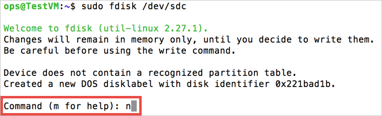

<properties
    pageTitle="Fügen Sie einen Datenträger einer Linux VM | Microsoft Azure"
    description="Erfahren Sie, wie eine Azure-virtuellen Computern mit Linux einen Datenträger anfügen und Initialisierung es, sodass es zur Verfügung steht."
    services="virtual-machines-linux"
    documentationCenter=""
    authors="iainfoulds"
    manager="timlt"
    editor="tysonn"
    tags="azure-service-management"/>

<tags
    ms.service="virtual-machines-linux"
    ms.workload="infrastructure-services"
    ms.tgt_pltfrm="vm-linux"
    ms.devlang="na"
    ms.topic="article"
    ms.date="08/23/2016"
    ms.author="iainfou"/>

# So fügen Sie einen Datenträger zu einem Linux virtuellen Computern

[AZURE.INCLUDE [learn-about-deployment-models](../../includes/learn-about-deployment-models-classic-include.md)]Finden Sie unter So [Fügen Sie einen Datenträger mit dem Modell zur Bereitstellung von Ressourcenmanager](virtual-machines-linux-add-disk.md).

Sie können anfügen sowohl leere Datenträger und Datenträger, die Daten zu Ihrer Azure-virtuellen Computern enthalten. Beide Datenträger sind VHD-Dateien, die sich in einem Konto Azure-Speicher befinden. Als nach dem Anhängen des Datenträgers müssen mit einem beliebigen Datenträger auf einem Computer Linux hinzufügen Sie Initialisierung und zu formatieren, damit es zur Verfügung steht. Dieser Artikeldetails anfügen sowohl leere Datenträger und Datenträger, die Daten zu Ihrer virtuellen Computer als auch dann Initialisierung und formatieren einen neuen Datenträger bereits enthalten.

> [AZURE.NOTE]Es ist eine bewährte Methode, einen oder mehrere separate Datenträger speichern des virtuellen Computers Daten verwenden. Wenn Sie eine Azure-virtuellen Computern erstellen, muss es ein Betriebssystem und einen temporären Datenträger. **Verwenden Sie nicht des temporären Datenträgers zum Speichern von permanenten Daten.** Wie der Name sagt, bietet es nur temporäre Speicherung. Keine Redundanz oder Sicherung vergleichbar, da es in Azure-Speicher befinden sich nicht.
> Der temporäre Datenträger in der Regel von der Azure Linux Agent verwaltet und automatisch **/mnt/resource** (oder **mnt/mnt** auf Ubuntu Bilder) bereitgestellt. Andererseits, ein Datenträger werden, die Namen durch den Linux Kernel ungefähr wie folgt `/dev/sdc`, und Sie müssen so partitionieren, formatieren, und Laden Sie diese Ressource. Finden Sie im [Azure Linux Agent Benutzerhandbuch] [ Agent] Details.

[AZURE.INCLUDE [howto-attach-disk-windows-linux](../../includes/howto-attach-disk-linux.md)]

## Einen neuen Datenträger in Linux Initialisierung

1. SSH zu Ihrem virtuellen Computer. Weitere Informationen finden Sie unter [So melden Sie sich mit einem virtuellen Computer mit Linux][Logon].

2. Als Nächstes müssen Sie die Geräte-ID für den Datenträger Daten Initialisierung zu suchen. Es gibt zwei Möglichkeiten, die ein:

    eine) Grep für SCSI-Geräte in den Protokollen, wie in den folgenden Befehl aus:

            $sudo grep SCSI /var/log/messages

    Für die aktuelle Verteilung Ubuntu, müssen Sie möglicherweise verwenden `sudo grep SCSI /var/log/syslog` da Anmeldung `/var/log/messages` möglicherweise standardmäßig deaktiviert werden.

    Sie können den Bezeichner des letzten Datenträger Daten suchen, die in die Nachrichten hinzugefügt wurde, die angezeigt werden.

    

    ODER

    b) die Verwendung der `lsscsi` Befehl aus, um die Geräte-Id finden. `lsscsi`kann installiert werden, indem Sie entweder `yum install lsscsi` (auf Red Hat basiert Verteilung) oder `apt-get install lsscsi` (auf Debian basiert Verteilung). Sie können den Datenträger suchen Sie anhand der _Lun_ oder **logische Einheit Zahl**gesuchte. Angenommen, die _Lun_ für die Sie verbundenen Datenträger kann leicht erkennbar sein aus `azure vm disk list <virtual-machine>` als:

            ~$ azure vm disk list TestVM
            info:    Executing command vm disk list
            + Fetching disk images
            + Getting virtual machines
            + Getting VM disks
            data:    Lun  Size(GB)  Blob-Name                         OS
            data:    ---  --------  --------------------------------  -----
            data:         30        TestVM-2645b8030676c8f8.vhd  Linux
            data:    0    100       TestVM-76f7ee1ef0f6dddc.vhd
            info:    vm disk list command OK

    Vergleichen Sie diese Daten mit der Ausgabe der `lsscsi` für die gleiche virtuellen Computern (Beispiel):

            ops@TestVM:~$ lsscsi
            [1:0:0:0]    cd/dvd  Msft     Virtual CD/ROM   1.0   /dev/sr0
            [2:0:0:0]    disk    Msft     Virtual Disk     1.0   /dev/sda
            [3:0:1:0]    disk    Msft     Virtual Disk     1.0   /dev/sdb
            [5:0:0:0]    disk    Msft     Virtual Disk     1.0   /dev/sdc

    Die Nummer des letzte im Tupel in jeder Zeile wird die _Lun_. Finden Sie unter `man lsscsi` Weitere Informationen.

3. Geben Sie dazu aufgefordert werden zum Erstellen von Ihrem Geräts den folgenden Befehl aus:

        $sudo fdisk /dev/sdc

4. Wenn Sie dazu aufgefordert werden, geben Sie **n** , um eine neue Partition zu erstellen.

    

5. Wenn Sie dazu aufgefordert werden, geben Sie **p** , damit der Partition die primäre Partition aus. Geben Sie **1** , die erste Partition wird ein, und geben Sie Typ um den Standardwert für die Zylinder-übernehmen. Bei manchen Systemen können sie die Standardwerte des ersten und den letzten Bereichen, statt die auf anzeigen. Sie können auswählen, um diese zu akzeptieren.

    

6. Geben Sie **p** , um die Details zu den Datenträger anzeigen, die aufgeteilt werden ist.

    

7. Geben Sie **w** , um die Einstellungen für den Datenträger schreiben.

    

8. Jetzt können Sie das Dateisystem auf der neuen Partition erstellen. Fügen Sie die Partitionsnummer an der Geräte-ID (im folgenden Beispiel `/dev/sdc1`). Im folgende Beispiel wird eine ext4 Partition auf /dev/sdc1 erstellt:

        # sudo mkfs -t ext4 /dev/sdc1

    

    >[AZURE.NOTE] SuSE Linux Enterprise 11 Betriebssysteme unterstützen nur schreibgeschützten Zugriff für ext4 Datei Betriebssysteme auf. Für diese Systeme empfiehlt es sich um das neue Dateisystem als ext3 statt ext4 formatieren.

9. Erstellen Sie ein Verzeichnis, das neue Dateisystem bereitzustellen, wie folgt:

        # sudo mkdir /datadrive

10. Schließlich können Sie das Laufwerk, wie folgt bereitstellen:

        # sudo mount /dev/sdc1 /datadrive

    Der Datenträger kann nun als **/datadrive**verwenden.
    
    

11. Fügen Sie das neue Laufwerk/etc/fstab hinzu:

    Um sicherzustellen, dass das Laufwerk automatisch nach einem Neustart erneut bereitgestellt wird müssen sie die Datei/usw./Fstab hinzugefügt werden. Darüber hinaus wird dringend empfohlen, dass die UUID (universell Unique IDentifier) in/etc/fstab verwendet wird, um auf das Laufwerk, sondern nur den Namen des Geräts (d. h. /dev/sdc1) verweisen. Verwenden die UUID vermieden werden die falsche CD an einem bestimmten Speicherort bereitgestellt werden, wenn das Betriebssystem einen Fehler beim Boot und alle verbleibenden Daten Datenträger dann diese Geräte-IDs zugewiesen wird entdeckt aus. Um die UUID des neuen Laufwerks gefunden haben, können Sie das Programm **Blkid** verwenden:

        # sudo -i blkid

    Die Ausgabe sieht ähnlich wie der folgende aus:

        /dev/sda1: UUID="11111111-1b1b-1c1c-1d1d-1e1e1e1e1e1e" TYPE="ext4"
        /dev/sdb1: UUID="22222222-2b2b-2c2c-2d2d-2e2e2e2e2e2e" TYPE="ext4"
        /dev/sdc1: UUID="33333333-3b3b-3c3c-3d3d-3e3e3e3e3e3e" TYPE="ext4"

    >[AZURE.NOTE] Bearbeiten die **Datei/etc/fstab** nicht ordnungsgemäß ergeben in einem möglicherweise nicht mehr gestartet System. Wenn Sie unsicher sind, lesen Sie die Verteilung der Dokumentation Informationen, wie Sie diese Datei zu bearbeiten. Es wird auch empfohlen, dass vor dem Bearbeiten eine Sicherungskopie der Datei/etc/fstab erstellt wird.

    Öffnen Sie als Nächstes **die/etc/fstab** -Datei in einem Text-Editor:

        # sudo vi /etc/fstab

    In diesem Beispiel verwenden wir den UUID-Wert für das neue **/dev/sdc1** Gerät, das in den vorherigen Schritten und die Mountpoint **/datadrive**erstellt wurde. Fügen Sie die folgende Zeile am Ende der **Datei/etc/fstab** aus:

        UUID=33333333-3b3b-3c3c-3d3d-3e3e3e3e3e3e   /datadrive   ext4   defaults,nofail   1   2

    Oder basierend auf SuSE Linux Betriebssystemen müssen Sie möglicherweise etwas anderes Format verwenden:

        /dev/disk/by-uuid/33333333-3b3b-3c3c-3d3d-3e3e3e3e3e3e   /datadrive   ext3   defaults,nofail   1   2
    
    >[AZURE.NOTE] Die `nofail` Option wird sichergestellt, dass der virtuellen Computer gestartet wird, selbst wenn das Dateisystem beschädigt ist oder der Datenträger ist beim Start nicht vorhanden. Ohne diese Option können Sie Verhalten auftreten, wie in [Kann nicht SSH zu Linux virtueller Computer aufgrund FSTAB Fehler](https://blogs.msdn.microsoft.com/linuxonazure/2016/07/21/cannot-ssh-to-linux-vm-after-adding-data-disk-to-etcfstab-and-rebooting/)beschrieben.

    Sie können nun testen, dass das Dateisystem nach Aufheben der Bereitstellung und erneutes Bereitstellen des Dateisystems, d. h. ordnungsgemäß bereitgestellt ist verwenden das Beispiel Punkt bereitstellen `/datadrive` in den älteren Schritten erstellt:

        # sudo umount /datadrive
        # sudo mount /datadrive

    Wenn die `mount` Befehl führt zu einem Fehler, überprüfen Sie die Datei/usw./Fstab auf die richtige Syntax. Wenn Sie zusätzliche Laufwerke oder Partitionen erstellt werden, geben Sie diese/usw./Fstab ebenfalls getrennt.

    Nehmen Sie das Laufwerk mithilfe dieser Befehl beschreibbare vor:

        # sudo chmod go+w /datadrive

>[AZURE.NOTE] Entfernen anschließend einen Datenträger ohne Fstab bearbeiten könnte den virtuellen Computer neu gestartet. Ist dies häufig auftreten, die meisten Verteilung Geben Sie entweder die `nofail` und/oder `nobootwait` Fstab Optionen, mit denen ein System zum Starten, selbst wenn das Laufwerk bei Bereitstellung fehlschlägt Zeit zu starten. Weitere Informationen zu diesen Parametern finden Sie in der Verteilung der Dokumentation.

### Unterstützung in Azure Linux TRIM/aufheben
Einige Linux Kernels unterstützen TRIM/aufheben Vorgänge aus, um die nicht verwendeten Blöcke auf dem Datenträger zu verwerfen. Diese Vorgänge eignen sich primär in standard-Speicher zu informieren, Azure, die gelöschte Seiten sind nicht mehr gültig und verworfen werden können. Verwerfen Seiten kann Kosten speichern, wenn Sie große Dateien erstellen und löschen Sie sie.

Es gibt zwei Methoden zum Kürzen aktivieren in Ihrem Linux VM unterstützen. Wie gewohnt, finden Sie in der der Verteilung empfohlen:

- Verwenden der `discard` bereitstellen Option in `/etc/fstab`, beispielsweise:

        UUID=33333333-3b3b-3c3c-3d3d-3e3e3e3e3e3e   /datadrive   ext4   defaults,discard   1   2

- Alternativ können Sie Ausführen der `fstrim` Befehl manuell über die Befehlszeile, oder fügen sie Ihrer Crontab regelmäßig ausführen:

    **Ubuntu**

        # sudo apt-get install util-linux
        # sudo fstrim /datadrive

    **RHEL/CentOS**

        # sudo yum install util-linux
        # sudo fstrim /datadrive

## Behandlung von Problemen
[AZURE.INCLUDE [virtual-machines-linux-lunzero](../../includes/virtual-machines-linux-lunzero.md)]

## Nächste Schritte
Sie können weitere Informationen zur Verwendung Ihrer Linux VM in den folgenden Artikeln:

- [So melden Sie sich mit einem virtuellen Computer mit Linux][Logon]

- [So trennen Sie einen Datenträger aus einem Linux virtuellen Computern](virtual-machines-linux-classic-detach-disk.md)

- [Verwendung der Azure-CLI bei Verwendung der Bereitstellung klassisch](../virtual-machines-command-line-tools.md)

<!--Link references-->
[Agent]: virtual-machines-linux-agent-user-guide.md
[Logon]: virtual-machines-linux-mac-create-ssh-keys.md
