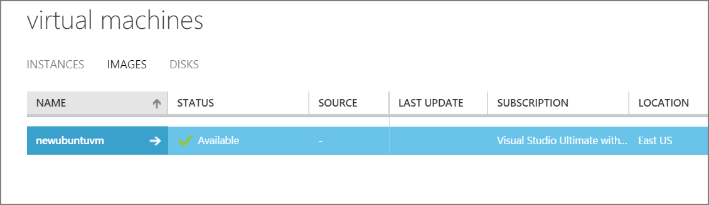

<properties
    pageTitle="Erstellen Sie ein Bild von einer Linux VM | Microsoft Azure"
    description="Informationen Sie zum Erfassen eines Bilds von einer Linux-basierten Azure-virtuellen Computern (virtueller Computer) mit dem Bereitstellungsmodell klassischen erstellt."
    services="virtual-machines-linux"
    documentationCenter=""
    authors="iainfoulds"
    manager="timlt"
    editor="tysonn"
    tags="azure-service-management"/>

<tags
    ms.service="virtual-machines-linux"
    ms.workload="infrastructure-services"
    ms.tgt_pltfrm="vm-linux"
    ms.devlang="na"
    ms.topic="article"
    ms.date="08/31/2016"
    ms.author="iainfou"/>

# Gewusst wie: Erfassen ein klassisches Linux virtuellen Computers als Bild

[AZURE.INCLUDE [learn-about-deployment-models](../../includes/learn-about-deployment-models-classic-include.md)]Erfahren Sie, wie [Führen Sie diese Schritte aus, die mithilfe des Modells Ressourcenmanager](virtual-machines-linux-capture-image.md).

In diesem Artikel wird gezeigt, wie zu erfassen eines klassischen Azure-virtuellen Computern Linux als Bild zum Erstellen von anderen virtuellen Computern ausgeführt werden kann. Diese Abbildung enthält die OS Datenträger und Daten Datenträger, des virtuellen Computers angefügt. Diese aufnehmen nicht Netzwerkkonfiguration, sodass Sie müssen, die beim Erstellen der anderen virtuellen Computern aus dem Bild konfigurieren.

Azure speichert das Bild, klicken Sie unter **Bilder**zusammen mit keine Bilder, die Sie hochgeladen haben. Weitere Informationen zu Bildern finden Sie unter [Informationen zu virtuellen Computern Bilder in Azure] [].

## Vorbemerkung

Diesen Schritten wird vorausgesetzt, die Sie haben bereits eine Azure-virtuellen Computern mit dem Modell zur Bereitstellung von klassischen erstellt und so konfiguriert, das Betriebssystem dass, einschließlich alle Daten Datenträger anfügen. Wenn Sie zum Erstellen eines virtuellen Computers benötigen, lesen Sie [zum Erstellen eines Linux virtuellen Computers] [].

## Erfassen des virtuellen Computers

1. [Verbinden mit dem virtuellen Computer](virtual-machines-linux-mac-create-ssh-keys.md) mit einem SSH-Client Ihrer Wahl.

2. Klicken Sie im Fenster SSH Geben Sie den folgenden Befehl ein. Die Ausgabe von `waagent` möglicherweise etwas variieren je nach der Version von diesem Programm:

    `sudo waagent -deprovision+user`

    Dieser Befehl versucht, das System bereinigen, und machen Sie es für die hochvolumige geeignet. Dieser Vorgang führt die folgenden Aufgaben:

    - Entfernt die SSH Host Tasten (wenn Provisioning.RegenerateSshHostKeyPair 'y' in der Konfigurationsdatei ist)
    - Löscht die Konfiguration des Nameserver in /etc/resolv.conf
    - Entfernt die `root` Benutzerkennwort aus/usw./Schatten (wenn Provisioning.DeleteRootPassword 'y' in der Konfigurationsdatei ist)
    - Entfernt Cache Clientleases DHCP
    - Hostname zu localhost.localdomain ein Zurücksetzen von Kennwörtern
    - Löscht die letzte bereitgestellte Benutzer Konto (gewonnen von /var/lib/waagent) **und die zugeordneten Daten**.

    >[AZURE.NOTE] Entfernung löscht Dateien und Daten, um das Bild "generalize". Führen Sie diesen Befehl nur auf einem virtuellen Computer, den Sie als neue Vorlage Bild erfassen möchten. Sie gewährleistet jedoch nicht, dass das Bild aller vertrauliche Informationen deaktiviert ist oder für die Verteilung an Dritte geeignet ist.

3. Geben Sie **y** , um den Vorgang fortzusetzen. Sie können Hinzufügen der `-force` Parameter diesen Bestätigungsschritt zu vermeiden.

4. Geben Sie **Beenden** , um die SSH-Client zu schließen.

    >[AZURE.NOTE] Die restlichen Schritte wird davon ausgegangen, dass [die CLI Azure installiert](../xplat-cli-install.md) auf dem Clientcomputer bereits. Die folgenden Schritte aus, können auch im [Azure klassischen Portal] []vorgenommen werden.

5. Öffnen Sie in dem Clientcomputer Azure CLI und melden Sie sich Ihr Abonnement Azure aus. Details finden Sie unter [Verbinden zu einem Azure Abonnement über die Befehlszeile Azure](../xplat-cli-connect.md).

6. Stellen Sie sicher, dass Sie im Modus Servicemanagement sind:

    `azure config mode asm`

7. Fahren Sie den virtuellen Computern, der bereits in den vorherigen Schritten mit hat ist:

    `azure vm shutdown <your-virtual-machine-name>`

    >[AZURE.NOTE] Sie können alle virtuellen Computern, die im Rahmen Ihres Abonnements mit erstellt finden`azure vm list`

8. Wenn des virtuellen Computers nicht mehr reagiert, erfassen Sie das Bild mit dem Befehl aus:

    `azure vm capture -t <your-virtual-machine-name> <new-image-name>`

    Geben Sie die Bildnamen anstelle von _neuen Bildnamen_den gewünschten. Dieser Befehl erstellt ein GRG OS Bild. Die `-t` Unterbefehl löscht die ursprüngliche virtuelle Computer.

9.  Das neue Bild steht jetzt in der Liste der Bilder, die zum Konfigurieren eines neuen virtuellen Computern verwendet werden können. Sie können es mit dem Befehl anzeigen:

    `azure vm image list`

    Klicken Sie im [Azure klassischen Portal] []wird es in der Liste **Bilder** angezeigt.

    

## Nächste Schritte
Das Bild kann zum Erstellen von virtuellen Computern verwendet werden. Sie können den Befehl Azure CLI `azure vm create` , und geben Sie den Bild an, die Sie erstellt haben. Details zu den Befehl finden Sie unter [Verwendung der CLI Azure mit Bereitstellung Klassisch](../virtual-machines-command-line-tools.md) . Verwenden Sie alternativ die [Azure klassischen Portal] [] So erstellen Sie einen benutzerdefinierten virtuellen Computer mithilfe der Methode **Aus Katalog** aus, und markieren das Bild, das Sie erstellt haben. Weitere Informationen hierzu finden Sie unter [So erstellen Sie eine benutzerdefinierte virtuellen Computern] [] .

**Siehe auch:** [Azure Linux Agent-Benutzerhandbuch](virtual-machines-linux-agent-user-guide.md)

[Azure klassischen-portal]: http://manage.windowsazure.com
[Informationen zu virtuellen Computern Bilder in Azure]: virtual-machines-linux-classic-about-images.md
[So erstellen Sie einen benutzerdefinierten virtuellen Computern]: virtual-machines-linux-classic-create-custom.md
[How to Attach a Data Disk to a Virtual Machine]: virtual-machines-windows-classic-attach-disk.md
[So erstellen Sie eine Linux virtuellen Computern]: virtual-machines-linux-classic-create-custom.md
