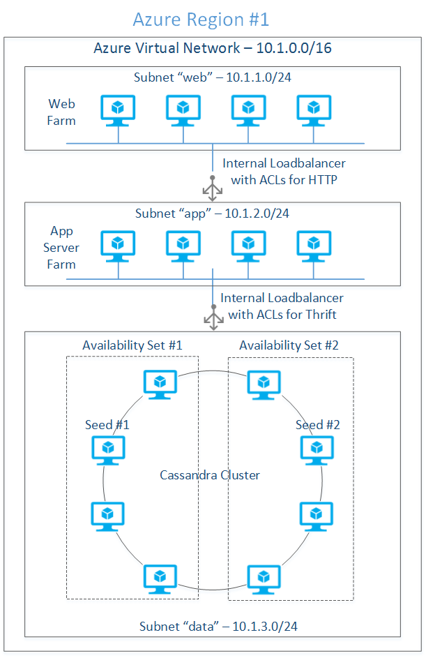
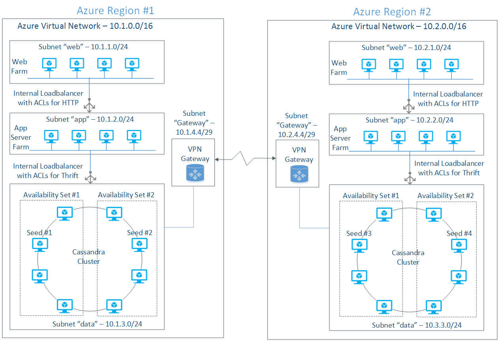

<properties
    pageTitle="Cassandra mit Linux ausführen, klicken Sie auf Azure | Microsoft Azure"
    description="Ausführen von einem Cluster Cassandra unter Linux in Azure virtuellen Computern in einer app Node.js"
    services="virtual-machines-linux"
    documentationCenter="nodejs"
    authors="hanuk"
    manager="wpickett"
    editor=""
    tags="azure-service-management"/>

<tags
    ms.service="virtual-machines-linux"
    ms.workload="infrastructure-services"
    ms.tgt_pltfrm="vm-linux"
    ms.devlang="na"
    ms.topic="article"
    ms.date="08/11/2016"
    ms.author="hanuk;robmcm"/>

# Cassandra mit Linux auf Windows Azure ausgeführte und Node.js zugreifen

[AZURE.INCLUDE [learn-about-deployment-models](../../includes/learn-about-deployment-models-classic-include.md)]Erfahren Sie, wie [Führen Sie diese Schritte aus, die mithilfe des Modells Ressourcenmanager](https://azure.microsoft.com/documentation/templates/datastax-on-ubuntu/).

## (Übersicht)
Microsoft Azure ist eine öffnen Cloud-Plattform, die sowohl Microsoft als auch als nicht-Microsoft-Software ausgeführt wird, wozu auch die Betriebssysteme, Anwendungsserver, messaging Middleware sowie SQL- und NoSQL-Datenbanken aus beiden kommerzielle und open Source-Modellen. Erstellen von robuste Services für öffentliche Wolken einschließlich Azure erfordert sorgfältige Planung und absichtlich Architektur für Applikationen-Server als gut Speicherebenen. Cassandra des verteilten Speicherarchitektur erleichtert die Erstellung hochgradig verfügbare Systeme, die Fehlertoleranz Cluster Fehler aufgetreten sind. Cassandra ist eine Cloud-Skala von Apache Software Foundation am cassandra.apache.org verwaltete NoSQL-Datenbank; Cassandra ist in Java geschrieben und daher auf beide auf Windows als auch Linux Plattformen ausgeführt.

Der Fokus dieses Artikels besteht darin, Cassandra Bereitstellung Ubuntu als einzelner und mehrerer Daten Center Cluster Nutzung von Microsoft Azure-virtuellen Computern und virtuelle Netzwerke anzuzeigen. Die Clusterbereitstellung für optimiert Produktionsarbeitslasten liegt außerhalb des zulässigen Rahmen dieses Artikels, da Multi-Laufwerk Knotenkonfiguration, entsprechenden anrufen Suchtopologie Entwurf und Daten zur Unterstützung der Replikation erforderlich, Konsistenz der Daten, Durchsatz und hohen Verfügbarkeit Anforderungen modeling erforderlich ist.

Dieser Artikel befasst, die ein grundlegender Ansatz für was anzeigen im Zusammenhang mit dem Erstellen des Cassandra Clusters im Vergleich Docker, Verwaltungsangestellte oder Marionette, die die Bereitstellung der Infrastruktur entscheidend vereinfachen kann.  

## Die Bereitstellungsmodelle
Microsoft Azure Netzwerke ermöglicht die Bereitstellung der privaten Cluster isoliert, der, die Zugriff auf fein detailliert Netzwerk Sicherheit zu erreichen beschränkt werden kann.  Da in diesem Artikel mit der Bereitstellung Cassandra auf einer grundlegenden Ebene wird, Schwerpunkt nicht die Konsistenz Ebene und das optimale Speicherdesign für Durchsatz auf. Es folgt eine Liste der networking Anforderungen für unsere hypothetische Cluster:

- Externe Systeme können nicht Cassandra-Datenbank von innerhalb oder außerhalb der Azure zugegriffen werden.
- Cassandra Cluster muss hinter einem Lastenausgleich für Thrift Datenverkehr werden
- Bereitstellen von Cassandra Knoten in zwei Gruppen in jedem Data Center für eine erweiterte Cluster verfügbar
- Sperren des Clusters daher, die nur Serverfarm Anwendung auf die Datenbank direkt zugreifen können
- Keine öffentliche Netzwerke Endpunkte als SSH
- Jeder Knoten Cassandra benötigt eine feste interne IP-Adresse

Cassandra kann einzelne Azure Region oder mehrere Regionen basierend auf die verteilte Natur die Arbeitsbelastung bereitgestellt werden. Modell zur Bereitstellung von mit mehreren Region kann genutzt werden, um Endbenutzern näher zu einer bestimmten Geography über dieselbe Cassandra Infrastruktur dienen. Cassandra des integrierten Knoten Replikation hat Vorsicht der Synchronisierung von mit mehreren Mastern schreibt aus mehreren Data Center und bietet eine konsistente Ansicht der Daten auf Anwendungen. Mehrere Region Bereitstellung kann auch mit der Strategie für die breiteren Azure Service Ausfall helfen. Cassandra des tunable Konsistenz und Replikation Suchtopologie helfen in unterschiedlichen RPO Bedürfnissen von Applications Besprechung.

### Einzelne Region Bereitstellung
Wir beginnen mit einer einzelnen Region Bereitstellung und die Gelerntes bei der Erstellung eines Modells mit mehreren Region. Azure virtuelle Netzwerke wird isoliert Subnetze erstellen, damit die oben genannten Netzwerk Sicherheit Anforderungen erfüllt sein können verwendet werden.  Der Schritte in den einzelnen Region-Bereitstellung zu erstellen, verwendet Ubuntu 14.04 LTS und Cassandra 2.08; der Vorgang kann jedoch ganz einfach den anderen Linux Varianten übernommen werden. Im folgenden werden einige der systematische Merkmale der einzelnen Region Bereitstellung.  

**Hohen Verfügbarkeit:** Die Cassandra-Knoten in der Abbildung 1 dargestellt werden auf zwei Sätze von Verfügbarkeit bereitgestellt, damit die Knoten zwischen mehreren Fehlerstrukturanalyse-Domänen für hohen Verfügbarkeit verteilt sind. Virtuelle Computer mit jeden Satz Verfügbarkeit kommentiert 2 Fehlerstrukturanalyse-Domänen zugeordnet ist.  Microsoft Azure Verwendung des Konzepts der Fehlerstrukturanalyse-Domäne zum Verwalten von ungeplanten Zeit (z. B. Hardware oder Software-Fehler) während des Konzepts der Upgrade-Domäne (z. B. Host oder Gast OS Patch/Upgrades, Upgrades der Anwendung) verwendet wird, für die Verwaltung von unten Uhrzeit geplant. Finden Sie unter [Wiederherstellung und hohe Verfügbarkeit für Azure Applications](http://msdn.microsoft.com/library/dn251004.aspx) für die Rolle des Fehlers, und Aktualisieren von Domänen in der hohen Verfügbarkeit Erreichung.

Abbildung 1: Einzelne Region Bereitstellung

Beachten Sie, dass zum Zeitpunkt der Erstellung dieses Dokuments Azure die explizite Zuordnung einer Gruppe von virtuellen Computern mit einer bestimmten Fehlerstrukturanalyse-Domäne nicht erlauben; Es ist auch mit dem Bereitstellung Muster in der Abbildung 1, daher statistisch wahrscheinlich ist, dass alle virtuellen Computer zwei Fehlerstrukturanalyse Domänen statt vier zugeordnet werden kann.

**Lastenausgleich Thrift Datenverkehr:** Thrift Client-Bibliotheken innerhalb der Webserver verbinden mit Cluster erfolgt über eine interne Lastenausgleich. Setzt die Vorgehensweise zum Hinzufügen von internen Lastenausgleich mit dem Subnetz "Daten" (siehe Abbildung 1) im Kontext Hostinganbieter Cassandra Cluster Cloud-Dienst. Nachdem internen Lastenausgleich definiert ist, erfordert jeder Knoten den Lastenausgleich Endpunkt mit der Anmerkungen eines Satzes Lastenausgleich mit zuvor definierte Last Lastenausgleich Namen hinzugefügt werden soll. Weitere Informationen hierzu finden Sie unter [Azure internen Lastenausgleich ](../load-balancer/load-balancer-internal-overview.md).

**Cluster-Basis:** Es ist wichtig, dass die meisten hochgradig verfügbaren Knoten für Basis auswählen, wie die neuen Knoten mit Startwert Knoten zum Ermitteln der Suchtopologie im Cluster kommunizieren soll. Aus jeder Verfügbarkeit von einem Knoten wird als Startwert Knoten festgelegt, um Einzelpunktversagen zu vermeiden.

**Replikation Faktor und Konsistenz Ebene:** Cassandra des integrierte hohe Verfügbarkeit und Daten Zuverlässigkeit ist mit dem Faktor Replikation (RF - Anzahl der Exemplare jeder Zeile auf dem Cluster gespeichert) gekennzeichnet und Konsistenz Ebene (Anzahl der Replikate gelesen/geschrieben werden, bevor Sie das Ergebnis zurückgeben, um den Anrufer). Während die Konsistenz Ebene angegeben ist, während Sie die Abfrage CRUD Replikation Faktor während der Erstellung Schlüssellänge zur Verfügung (vergleichbar mit einer relationalen Datenbank) angegeben. Finden Sie unter Cassandra-Dokumentation unter [Konfigurieren von Konsistenz](http://www.datastax.com/documentation/cassandra/2.0/cassandra/dml/dml_config_consistency_c.html) Konsistenz Details und die Formel für die Berechnung der Quorum.

Cassandra unterstützt zwei Typen von Integrität Datenmodellen – Konsistenz und tatsächlichen Konsistenz; die Replikation Faktor und Konsistenz Ebene bestimmt zusammen, ob die Daten konsistent sein werden, sobald ein Schreibvorgang abgeschlossen ist, oder es wird später konsistent sein. Beispielsweise Daten Konsistenz während einer beliebigen Ebene Konsistenz QUORUM angeben, wie die Ebene Konsistenz immer wird sichergestellt, unter der Anzahl der Replikate geschrieben werden, je nach Bedarf zu erreichen QUORUM (z. B. eine) angegeben, ergibt sich später konsistent Daten.

8 Knoten Cluster abgebildet, mit einem Replikations-Faktor von 3 und QUORUM (2 Knoten sind lesen oder für Konsistenz geschrieben) / Lese Konsistenz Ebene, können den theoretischen Verlust von höchstens 1 Knoten pro Replikationsgruppe vor dem Start der Anwendung, die den Fehler langen überstehen. Dies wird davon ausgegangen, dass alle auch die Taste Leerzeichen verteilt haben Anfragen schreibgeschützt.  Im folgenden sind die Parameter, die wir für den bereitgestellten Cluster verwendet wird:

Konfiguration für einzelne Region Cassandra Cluster:

| Clusterparameter | Wert | Hinweise |
| ----------------- | ----- | ------- |
| Anzahl der Knoten (N) | 8   | Gesamtzahl der Knoten im cluster |
| Replikation Faktor (RF) | 3 | Anzahl der Replikate einer Zeile |
| Konsistenz Ebene (Schreiben) | QUORUM[(RF/2) +1) = 2] das Ergebnis der Formel wird abgerundet. | Schreibt höchstens 2 Replikate, bevor die Antwort, um den Anrufer gesendet wird zu verwenden. 3rd Replikat wird in Gelegenheit konsistent geschrieben. |
| Konsistenz Ebene (schreibgeschützt) | QUORUM [(RF/2) + 1 = 2] das Ergebnis der Formel wird abgerundet. | Liest 2 Replikate vor dem Senden der Antwort an den Anrufer an. |
| Strategie für die Replikation | NetworkTopologyStrategy finden Sie unter [Replikation der Daten](http://www.datastax.com/documentation/cassandra/2.0/cassandra/architecture/architectureDataDistributeReplication_c.html) in Cassandra Dokumentation für Weitere Informationen | Die Bereitstellung Suchtopologie versteht und Replikate auf Knoten platziert, damit alle Replikate nicht auf der gleichen den Shapes für Gestelle einhandeln |
| Snitch | GossipingPropertyFileSnitch finden Sie unter [Snitches](http://www.datastax.com/documentation/cassandra/2.0/cassandra/architecture/architectureSnitchesAbout_c.html) in Cassandra Dokumentation für Weitere Informationen | NetworkTopologyStrategy verwendet ein Konzept von Snitch, um die Suchtopologie zu verstehen. GossipingPropertyFileSnitch bietet eine bessere Kontrolle in den einzelnen Knoten Datacenter und den Shapes für Gestelle Zuordnung an. Der Cluster verwendet Klatsch klicken Sie dann auf diese Informationen auf Objektebene überschrieben werden. Dies ist viel einfacher dynamische IP-Einstellung im Verhältnis zur PropertyFileSnitch |

**Azure Aspekte für Cassandra Cluster:** Microsoft Azure-virtuellen Computern Videofunktionen verwendet Azure Blob-Speicher für Datenträger Beibehaltung; Azure-Speicher speichert 3 Replikate für die einzelnen Datenträger für hohe Zuverlässigkeit. Dies bedeutet jede Zeile von Daten in einer Tabelle Cassandra eingefügt ist bereits in 3 Replikate gespeichert und daher Datenkonsistenz ist bereits beachtet, selbst wenn die Replikation Faktor (RF) 1 ist. Die wichtigsten Probleme mit Replikation Faktor wird 1 ist, dass die Anwendung Ausfallzeiten treten, auch wenn ein einzelner Cassandra Knoten fehlschlägt. Wenn ein Knoten nach unten für die von Azure Fabric Controller erkannt Probleme (z. B. Hardware, Software Systemfehler) ist, stellt es einen neuen Knoten an ihrer Stelle mit denselben Speicher Laufwerken bereit. Einen neuen Knoten, um die alte ersetzen bereitgestellt, kann ein paar Minuten dauern.  Für geplante Wartungsaktivitäten wie Gast OS Änderungen entsprechend Cassandra upgrades und Anwendung Änderungen Azure Fabric Controller führt Aktualisierungen der Knoten im Cluster.  Aktualisierungen auch kann dauern unten einige Knoten nacheinander und daher kann Cluster kurze Ausfall einige Partitionen auftreten. Jedoch verloren die Daten nicht aufgrund der integrierten Azure Speicherredundanz.  

Für Betriebssysteme auf Azure, die erfordern keine hohen Verfügbarkeit (z. B. um 99,9 der entspricht dem 8.76 Std./Jahr; Einzelheiten finden Sie unter [Hohe Verfügbarkeit](http://en.wikipedia.org/wiki/High_availability) ) bereitgestellt, die Sie möglicherweise ausführen mit RF = 1 und Konsistenz Ebene = ein.  Für Applikationen mit hohen Verfügbarkeit Anforderungen, RF = 3 und Konsistenz Ebene = QUORUM wird die Zeit von einem Knoten eine Replikate tolerieren. RF = 1 in herkömmlichen Bereitstellungen (z. B. lokal) nicht aufgrund der möglichem Datenverlust infolge Probleme wie Fehlern der Datenträger verwendet werden.   

## Mehrere Region Bereitstellung
Cassandra des Center-datenbezogene Replikation und Konsistenz oben beschriebenen Modell hilft mit einsatzbereiten ohne die Notwendigkeit alle externen Tools für die Bereitstellung mit mehreren Region. Dies unterscheidet sich deutlich von den herkömmlichen relationalen Datenbanken, wobei die Einrichtung für die Datenbank für mehrere master schreibt Spiegelung recht komplex werden kann. In einer mit mehreren Region einrichten Cassandra helfen mit der Verwendungsszenarien, einschließlich der folgenden:

**Näherung Grundlage Bereitstellung:** Mehrere Mandanten-Anwendungen mit Zuordnung Mandanten Benutzer löschen-zu-Region, die mehrere Region-Cluster niedrige Wartezeiten ergaben werden können. Beispiel einer Learning Management können Systeme für Bildungseinrichtungen einen verteilten Cluster im südostasiatischen USA und Westen US Regionen zu die jeweiligen Hochschulen für dienen bereitstellen sowie Analytics Transaktionen. Die Daten können am Zeit liest und schreibt lokal konsistent sein und können in allen beide Regionen Gelegenheit konsistent sein. Es gibt andere Beispiele wie Medien Verteilung, e-Commerce und nichts und alles, was Geo konzentrierte Benutzer Basis fungiert eine gute Anwendungsfall-für dieses Bereitstellungsmodell.

**Hohen Verfügbarkeit:** Redundanz ist ein wichtiger Faktor beim erzielen hohen Verfügbarkeit von Software und Hardware; Weitere Informationen finden Sie unter Gebäude zuverlässigen Cloudsysteme auf Microsoft Azure. Klicken Sie auf Microsoft Azure Weise nur zuverlässigen zur Erreichung WAHR Redundanz durch die Bereitstellung von einem Cluster mit mehreren Region. Applikationen in eine aktive oder Aktiv / Passiv-Modus bereitgestellt werden können, und ist eine der Regionen ab, können Azure Datenverkehr Manager Datenverkehr leiten Sie in der aktiven Region.  Mit der einzelnen Region Bereitstellung ist die Verfügbarkeit von 99,9, eine Bereitstellung von zwei-Region kann erreichen eine Verfügbarkeit von 99.9999 durch die Formel berechnet wird: (1-(1-0.999) *(1-0,999))*100); finden Sie im obigen Paper Details aus.

**Wiederherstellung:** Mehrere Region Cassandra Cluster, SP Wenn ordnungsgemäß entworfen, schwerwiegenden Data Center Ausfall. Ist eine Region ab, kann die Anwendung bereitgestellt, die andere Regionen erstellen die Endbenutzer beginnen. Wie alle anderen Business Continuity Implementierungen muss die Anwendung vorziehen einige resultierender aus den Daten in der Verkaufspipeline asynchrone Daten verloren gehen. Jedoch wird Cassandra die Wiederherstellung viel swifter als die Zeit, die herkömmlichen Datenbank Wiederherstellungsprozesse. Abbildung 2 zeigt das Modell mit mehreren Region typischerweise mit acht Knoten in jeder Region. Beide Regionen sind gegenüberliegende Bilder voneinander für das gleiche Symmetrieebenen; realen Designs hängen vom Arbeitsbelastung Typ (z. B. Transaktionen oder analytical), RPO, RTO, Datenkonsistenz und Verfügbarkeit Anforderungen.

Abbildung 2: Mehrere Region Cassandra Bereitstellung

### Netzwerkintegration
Sätze von virtuellen Computern bereitgestellt, die mit privaten Netzwerken befindet sich auf beiden Regionen kommuniziert miteinander über ein VPN-Tunnel. Der VPN-Tunnel verbindet zwei Software Gateways während der Bereitstellung Netzwerk bereitgestellt. Beide Regionen haben ähnliche Netzwerkarchitektur im Hinblick auf "Web" und "Daten" Subnetze; Azure Netzwerke können Sie beliebig viele Subnetze nach Bedarf erstellen und Anwenden von ACLs durch Network Security nach Bedarf. Beim Erstellen eines Konzepts der Suchtopologie Cluster zwischen müssen Data Center Kommunikation Wartezeit und den Einfluss economic Netzwerkverkehr berücksichtigt werden.

### Konsistenz für mehrere Data Center Bereitstellung der Daten
Verteilt Bereitstellungen müssen die Cluster Suchtopologie Auswirkung auf Durchsatz und hohen Verfügbarkeit bekannt sein. Die RF und Konsistenz Ebene so, dass das Quorum die Verfügbarkeit von die Data Centers abhängig sind nicht ausgewählt werden müssen.
Eines Systems, das konsistente, stellt eine LOCAL_QUORUM für Konsistenz Ebene (für Lese- und schreibt) sicher, dass es sich bei die lokale Lese- und schreibt während der Daten auf die remote Data Centers asynchrone repliziert werden von den lokalen Knoten erfüllt sind.  Tabelle 2 enthält eine Übersicht über die Konfigurationsdetails für mehrere Region Cluster weiter unten in der Schreiben von Gliederungsdaten.

**Zwei-Region Cassandra Cluster-Konfiguration**

| Clusterparameter | Wert | Hinweise |
| ----------------- | ----- | ------- |
| Anzahl der Knoten (N) | 8 + 8 | Gesamtzahl der Knoten im cluster |
| Replikation Faktor (RF) | 3 | Anzahl der Replikate einer Zeile |
| Konsistenz Ebene (Schreiben) | LOCAL_QUORUM [(sum(RF)/2) +1) = 4] das Ergebnis der Formel wird abgerundet. | 2 Knoten werden das erste Data Center synchron bearbeitet werden. die zusätzlichen 2 Knoten für Quorum erforderlich werden das 2nd Data Center asynchrone geschrieben werden können. |
| Konsistenz Ebene (schreibgeschützt) | LOCAL_QUORUM ((RF/2) + 1) = 2, die das Ergebnis der Formel abgerundet wird. | Lesen Anforderungen erfüllt sind aus nur einer Region; 2 Knoten sind lesen, bevor die Antwort an den Client gesendet wird. |
| Strategie für die Replikation | NetworkTopologyStrategy finden Sie unter [Replikation der Daten](http://www.datastax.com/documentation/cassandra/2.0/cassandra/architecture/architectureDataDistributeReplication_c.html) in Cassandra Dokumentation für Weitere Informationen | Die Bereitstellung Suchtopologie versteht und Replikate auf Knoten platziert, damit alle Replikate nicht auf der gleichen den Shapes für Gestelle einhandeln |
| Snitch | GossipingPropertyFileSnitch finden Sie unter [Snitches](http://www.datastax.com/documentation/cassandra/2.0/cassandra/architecture/architectureSnitchesAbout_c.html) in Cassandra Dokumentation für Weitere Informationen | NetworkTopologyStrategy verwendet ein Konzept von Snitch, um die Suchtopologie zu verstehen. GossipingPropertyFileSnitch bietet eine bessere Kontrolle in den einzelnen Knoten Datacenter und den Shapes für Gestelle Zuordnung an. Der Cluster verwendet Klatsch klicken Sie dann auf diese Informationen auf Objektebene überschrieben werden. Dies ist viel einfacher dynamische IP-Einstellung im Verhältnis zur PropertyFileSnitch |

##DIE SOFTWAREKONFIGURATION
Die folgende Softwareversionen werden während der Bereitstellung verwendet:

<table>
<tr><th>Software</th><th>Datenquelle</th><th>Version</th></tr>
<tr><td>JRE </td><td>[JRE 8](http://www.oracle.com/technetwork/java/javase/downloads/server-jre8-downloads-2133154.html) </td><td>8U5</td></tr>
<tr><td>JNA </td><td>[JNA](https://github.com/twall/jna) </td><td> 3.2.7</td></tr>
<tr><td>Cassandra</td><td>[Apache Cassandra 2.0.8](http://www.apache.org/dist/cassandra/2.0.8/apache-cassandra-2.0.8-bin.tar.gz)</td><td> 2.0.8</td></tr>
<tr><td>Ubuntu  </td><td>[Microsoft Azure](https://azure.microsoft.com/) </td><td>14.04 LTS</td></tr>
</table>

Da manuelle Annahme der Oracle-Lizenz herunterladen von JRE erforderlich sind, zur Vereinfachung der Bereitstellung, herunterladen Sie gesamte erforderliche Software auf dem Desktop für später Hochladen in das Bild der Ubuntu-Vorlage, die, das wir als Voraussetzung der Clusterbereitstellung erstellen werden.

Die oben genannten Software in bekannten Downloadverzeichnis (z. B. %TEMP%/downloads unter Windows oder ~/Downloads auf den meisten Linux-Versionen oder Mac) auf dem lokalen Computer herunterladen.

### ERSTELLEN VON VIRTUELLEN UBUNTU-COMPUTER
In diesem Schritt des Prozesses wird Ubuntu Bild mit erforderliche Software erstellt, damit das Bild für die Bereitstellung von mehreren Cassandra Knoten wiederverwendet werden kann.  
####Schritt 1: Generieren Sie SSH Key Paar
Azure benötigt ein öffentlicher Schlüssel, die entweder PEM oder DER Bereitstellung gleichzeitig codierte X509. Generieren einer öffentlichen und privaten Schlüssel anhand der Anweisungen zum Verwenden SSH mit Linux auf Azure am an. Wenn Sie beabsichtigen, putty.exe als SSH-Client entweder unter Windows oder Linux verwenden, müssen Sie das PEM codierte konvertieren RSA privaten Schlüssel PPK Format mit puttygen.exe; die Dokumentation finden Sie in der obigen Webseite.

####Schritt 2: Erstellen von Ubuntu Vorlage virtueller Computer
Klicken Sie zum Erstellen der Vorlage virtueller Computer melden Sie sich bei dem klassischen Azure-Portal, und verwenden Sie folgende Schritte: Klicken Sie auf neu, berechnen virtuellen Computern, von Katalog, UBUNTU, Ubuntu Server 14.04 LTS, und klicken Sie dann auf den Pfeil nach rechts. Ein Lernprogramm beschrieben, die zum Erstellen einer Linux VM finden Sie unter Erstellen eines virtuellen Computern ausgeführt Linux.

Geben Sie die folgenden Informationen auf dem Bildschirm "Konfiguration des virtuellen Computers" #1:

<table>
<tr><th>FELDNAME              </td><td>       FELDWERT               </td><td>         HINWEISE                </td><tr>
<tr><td>DATUM DER VERSION FREIGABE    </td><td> Wählen Sie ein Datum aus der Drow nach unten</td><td></td><tr>
<tr><td>NAME DES VIRTUELLEN COMPUTERS    </td><td> Cass-Vorlage                </td><td> Dies ist der Hostname des den virtuellen Computer </td><tr>
<tr><td>EBENE                     </td><td> STANDARD                        </td><td> Behalten Sie die Standardeinstellung              </td><tr>
<tr><td>GRÖßE                     </td><td> A1                              </td><td>Wählen Sie den virtuellen Computer basierend auf den Anforderungen EA; Behalten Sie die Standardeinstellung für diesen Zweck </td><tr>
<tr><td> NEUER BENUTZERNAME           </td><td> LocalAdmin                      </td><td> "Administrator" ist ein reservierte Benutzername in Ubuntu 12. Xx und nach dem</td><tr>
<tr><td> AUTHENTIFIZIERUNG      </td><td> Klicken Sie auf das Kontrollkästchen                 </td><td>Überprüfen Sie, ob Sie mit einem SSH Schlüssel sichern möchten </td><tr>
<tr><td> ZERTIFIKAT             </td><td> Dateiname der des Zertifikats für öffentlichen Schlüssel </td><td> Verwenden Sie den zuvor erstellten öffentlichen Schlüssel</td><tr>
<tr><td> Neues Kennwort   </td><td> sicheres Kennwort </td><td> </td><tr>
<tr><td> Kennwort bestätigen   </td><td> sicheres Kennwort </td><td></td><tr>
</table>

Geben Sie die folgenden Informationen auf dem Bildschirm "Konfiguration des virtuellen Computers" #2:

<table>
<tr><th>FELDNAME             </th><th> FELDWERT                       </th><th> HINWEISE                                 </th></tr>
<tr><td> CLOUD-DIENST  </td><td> Erstellen eines neuen Cloud-Diensts    </td><td>Cloud-Dienst ist ein Container berechnen Ressourcen wie virtuellen Computern</td></tr>
<tr><td> CLOUD-DIENST DNS-NAME </td><td>Ubuntu-template.cloudapp.net   </td><td>Geben Sie einen Computer unabhängig laden Lastenausgleich Namen</td></tr>
<tr><td> REGION/ZUGEHÖRIGKEIT GRUPPE/VIRTUELLES NETZWERK </td><td>    Westen US </td><td> Wählen Sie einen Bereich, aus dem Ihre Webanwendungen Cassandra Cluster zugreifen</td></tr>
<tr><td>SPEICHER-KONTO </td><td>   Standard verwenden </td><td>Verwenden der Standard-Speicher oder ein Benutzerkonto zuvor erstellten Speicher in einem bestimmten Bereich</td></tr>
<tr><td>FESTLEGEN DER VERFÜGBARKEIT </td><td>  Keine </td><td>  Lassen Sie ihn leer</td></tr>
<tr><td>ENDPUNKTE   </td><td>Standard verwenden </td><td>  Verwenden Sie die standardmäßigen SSH-Konfiguration </td></tr>
</table>

Klicken Sie auf die nach-rechts, lassen Sie die Standardeinstellungen auf dem Bildschirm #3, und klicken Sie auf die Schaltfläche "Überprüfen", um den virtuellen Computer provisioning Prozess abzuschließen. Nach ein paar Minuten sollten der virtuellen Computer mit dem Namen "Ubuntu-Template" im Status "ausführen".

###INSTALLIEREN DER NOTWENDIGEN SOFTWARE
####Schritt 1: Hochladen tarballs
Mithilfe von scp oder Pscp, kopieren Sie die zuvor heruntergeladene Software ~/downloads Verzeichnis mit dem folgenden Befehlsformat:

#####Pscp Server-Jre-8u5-Linux-x64.tar.gzlocaladmin@hk-cas-template.cloudapp.net:/home/localadmin/downloads/server-jre-8u5-linux-x64.tar.gz

Wiederholen Sie den oben angegebenen Befehl für JRE ebenfalls wie für die Cassandra Bits.

####Schritt 2: Vorbereiten der Directory-Struktur und die Archiven extrahieren
Melden Sie sich bei dem virtuellen Computer und erstellen Sie die Verzeichnisstruktur extrahieren Software als mithilfe des Bash Skripts unten übergeordnete Benutzer:

    #!/bin/bash
    CASS_INSTALL_DIR="/opt/cassandra"
    JRE_INSTALL_DIR="/opt/java"
    CASS_DATA_DIR="/var/lib/cassandra"
    CASS_LOG_DIR="/var/log/cassandra"
    DOWNLOADS_DIR="~/downloads"
    JRE_TARBALL="server-jre-8u5-linux-x64.tar.gz"
    CASS_TARBALL="apache-cassandra-2.0.8-bin.tar.gz"
    SVC_USER="localadmin"

    RESET_ERROR=1
    MKDIR_ERROR=2

    reset_installation ()
    {
       rm -rf $CASS_INSTALL_DIR 2> /dev/null
       rm -rf $JRE_INSTALL_DIR 2> /dev/null
       rm -rf $CASS_DATA_DIR 2> /dev/null
       rm -rf $CASS_LOG_DIR 2> /dev/null
    }
    make_dir ()
    {
       if [ -z "$1" ]
       then
          echo "make_dir: invalid directory name"
          exit $MKDIR_ERROR
       fi

       if [ -d "$1" ]
       then
          echo "make_dir: directory already exists"
          exit $MKDIR_ERROR
       fi

       mkdir $1 2>/dev/null
       if [ $? != 0 ]
       then
          echo "directory creation failed"
          exit $MKDIR_ERROR
       fi
    }

    unzip()
    {
       if [ $# == 2 ]
       then
          tar xzf $1 -C $2
       else
          echo "archive error"
       fi

    }

    if [ -n "$1" ]
    then
       SVC_USER=$1
    fi

    reset_installation
    make_dir $CASS_INSTALL_DIR
    make_dir $JRE_INSTALL_DIR
    make_dir $CASS_DATA_DIR
    make_dir $CASS_LOG_DIR

    #unzip JRE and Cassandra
    unzip $HOME/downloads/$JRE_TARBALL $JRE_INSTALL_DIR
    unzip $HOME/downloads/$CASS_TARBALL $CASS_INSTALL_DIR

    #Change the ownership to the service credentials

    chown -R $SVC_USER:$GROUP $CASS_DATA_DIR
    chown -R $SVC_USER:$GROUP $CASS_LOG_DIR
    echo "edit /etc/profile to add JRE to the PATH"
    echo "installation is complete"

Wenn Sie dieses Skript in Vim Fenster einfügen, stellen Sie sicher, entfernen den Wagenrücklauf ("\r") mit den folgenden Befehl aus:

    tr -d '\r' <infile.sh >outfile.sh

####Schritt 3: Usw./Profil bearbeiten
Fügen Sie die folgenden am Ende an:

    JAVA_HOME=/opt/java/jdk1.8.0_05
    CASS_HOME= /opt/cassandra/apache-cassandra-2.0.8
    PATH=$PATH:$HOME/bin:$JAVA_HOME/bin:$CASS_HOME/bin
    export JAVA_HOME
    export CASS_HOME
    export PATH

####Schritt 4: Installieren JNA für Herstellung Betriebssysteme
Verwenden Sie die folgende Abfolge von Befehlen: dem folgenden Befehl wird installieren Sie Jna-3.2.7.jar und Jna-Plattform-3.2.7.jar /usr/share.java Verzeichnis Sudo apt-Get-Java Libjna

Erstellen Sie symbolische Verknüpfungen im $CASS_HOME/Bibliothek Verzeichnis, sodass Cassandra Skript zum Starten des folgenden Gläser finden kann:

    ln -s /usr/share/java/jna-3.2.7.jar $CASS_HOME/lib/jna.jar

    ln -s /usr/share/java/jna-platform-3.2.7.jar $CASS_HOME/lib/jna-platform.jar

####Schritt 5: Konfigurieren von cassandra.yaml
Bearbeiten Sie cassandra.yaml jedes virtuellen Computers entsprechend der Konfiguration von allen virtuellen Computern [wir werden während der tatsächlichen Bereitstellung Dies gibt] benötigt:

<table>
<tr><th>Feldname   </th><th> Wert  </th><th> Hinweise </th></tr>
<tr><td>Clustername </td><td>  "CustomerService"   </td><td> Verwenden Sie den Namen, der die Bereitstellung</td></tr>
<tr><td>listen_address  </td><td>[Geben sie nichts]   </td><td> Löschen von "Localhost" </td></tr>
<tr><td>rpc_addres   </td><td>[Geben sie nichts]  </td><td> Löschen von "Localhost" </td></tr>
<tr><td>Basis   </td><td>"10.1.2.4, 10.1.2.6, 10.1.2.8" </td><td>Liste aller IP-Adressen, die als Basis festgelegt sind.</td></tr>
<tr><td>endpoint_snitch </td><td> org.apache.cassandra.locator.GossipingPropertyFileSnitch </td><td> Dies wird von der NetworkTopologyStrateg verwendet für das Data Center und die von den virtuellen Computer den Shapes für Gestelle Ableitens</td></tr>
</table>

####Schritt 6: Erfassen des Bilds virtueller Computer
Melden Sie sich bei der virtuellen Computern mithilfe der Hostname (Hongkong Zertifizierungsstellen template.cloudapp.net) und den SSH privaten Schlüssel zuvor erstellt werden soll. Finden Sie unter So verwenden Sie SSH mit Linux auf Azure Details zum Anmelden mit dem Befehl ssh oder putty.exe.

Führen Sie die folgende Abfolge von Aktionen zum Erfassen von Images:
#####1. entziehen
Verwenden Sie den Befehl "Sudo Waagent – entziehen + User" virtuellen Computern Instanz spezifische Informationen zu entfernen. Finden Sie unter verwenden [eines Linux virtuellen Computers Aufzeichnen von](virtual-machines-linux-classic-capture-image.md) als Vorlage Weitere Details über den Vorgang des Bilds erfassen.

#####2: war(en) den virtuellen Computer
Stellen Sie sicher, dass die virtuellen Computern hervorgehoben ist, und klicken Sie auf den Link war(en) aus der Befehlsleiste unten.

#####3: Erfassen Sie das Bild
Stellen Sie sicher, dass die virtuellen Computern hervorgehoben ist, und klicken Sie auf den Link erfassen aus der Befehlsleiste unten. Benennen Sie in dem nächsten Bildschirm ein Bild (z. B. hk-cas-2-08-ub-14-04-2014071), geeignete BILDBESCHREIBUNG ein, und klicken Sie auf "Häkchen", um den Vorgang erfassen abzuschließen.

Dies dauert einige Sekunden dauern, und das Bild im Abschnitt Meine Bilder der Bildergalerie verfügbar sein sollte. Die Quelle virtueller Computer werden automatisch Delated, nachdem das Bild erfolgreich aufgezeichnet wird.

##Einzelne Region Bereitstellungsprozess
**Schritt 1: Erstellen von virtuellen Netzwerks** Melden Sie sich bei dem klassischen Azure-Portal, und erstellen Sie ein virtuelles Netzwerk mit den Attributen anzeigen in der Tabelle. Die detaillierten Schritte dieses Prozesses finden Sie unter [Konfigurieren eines Cloud-Only virtuellen Netzwerks im klassischen Azure-Portal](../virtual-network/virtual-networks-create-vnet-classic-portal.md) .      

<table>
<tr><th>Name des virtuellen Computers Attribut</th><th>Wert</th><th>Hinweise</th></tr>
<tr><td>Namen</td><td>Vnet-Cass-Westen-Kontaktformular</td><td></td></tr>
<tr><td>Region</td><td>Westen US</td><td></td></tr>
<tr><td>DNS-Server </td><td>Keine</td><td>Ignorieren Sie dies als wir einen DNS-Server nicht verwenden</td></tr>
<tr><td>Konfigurieren eines Punkt-zu-Standort VPN</td><td>Keine</td><td> Dies ignorieren</td></tr>
<tr><td>Konfigurieren eines Standort-zu-Standort VPN</td><td>Nnone</td><td> Dies ignorieren</td></tr>
<tr><td>Adressbereichs</td><td>10.1.0.0/16</td><td></td></tr>
<tr><td>Start-IP-</td><td>10.1.0.0</td><td></td></tr>
<tr><td>CIDR </td><td>/ 16 (65531)</td><td></td></tr>
</table>

Fügen Sie die folgenden Subnetze hinzu:

<table>
<tr><th>Namen</th><th>Start-IP-</th><th>CIDR</th><th>Hinweise</th></tr>
<tr><td>Web</td><td>10.1.1.0</td><td>/ 24 (251)</td><td>Subnetz für die Webfarm</td></tr>
<tr><td>Daten</td><td>10.1.2.0</td><td>/ 24 (251)</td><td>Subnetz für die Datenbankknoten</td></tr>
</table>

Daten und Web Subnetze können über Sicherheitsgruppen Netzwerk geschützt werden, die Unterstützung der außerhalb des Bereichs für diesen Artikel steht.  

**Schritt 2: Bereitstellung von virtuellen Computern** Verwenden Sie das zuvor erstellte Image wir die folgenden virtuellen Computer in der Cloudserver "Hongkong-c-svc-Westen" erstellen und diese an den jeweiligen Subnetz binden, wie unten dargestellt:

<table>
<tr><th>Name des Computers    </th><th>Subnetz </th><th>IP-Adresse </th><th>Festlegen der Verfügbarkeit</th><th>DC/den Shapes für Gestelle</th><th>Startwert?</th></tr>
<tr><td>Hongkong-c1-Westen-Kontaktformular   </td><td>Daten   </td><td>10.1.2.4   </td><td>Hongkong-c-Aset-1    </td><td>DC = WESTUS den Shapes für Gestelle = Rack 1 </td><td>Ja</td></tr>
<tr><td>Hongkong-c2-Westen-Kontaktformular   </td><td>Daten   </td><td>10.1.2.5   </td><td>Hongkong-c-Aset-1    </td><td>DC = WESTUS den Shapes für Gestelle = Rack 1 </td><td>Nein </td></tr>
<tr><td>Hongkong-c3-Westen-Kontaktformular   </td><td>Daten   </td><td>10.1.2.6   </td><td>Hongkong-c-Aset-1    </td><td>DC = WESTUS den Shapes für Gestelle = rack2 </td><td>Ja</td></tr>
<tr><td>Hongkong-c4-Westen-Kontaktformular   </td><td>Daten   </td><td>10.1.2.7   </td><td>Hongkong-c-Aset-1    </td><td>DC = WESTUS den Shapes für Gestelle = rack2 </td><td>Nein </td></tr>
<tr><td>Hongkong-c5-Westen-Kontaktformular   </td><td>Daten   </td><td>10.1.2.8   </td><td>Hongkong-c-Aset-2    </td><td>DC = WESTUS den Shapes für Gestelle = rack3 </td><td>Ja</td></tr>
<tr><td>Hongkong-c6-Westen-Kontaktformular   </td><td>Daten   </td><td>10.1.2.9   </td><td>Hongkong-c-Aset-2    </td><td>DC = WESTUS den Shapes für Gestelle = rack3 </td><td>Nein </td></tr>
<tr><td>Hongkong-c7-Westen-Kontaktformular   </td><td>Daten   </td><td>10.1.2.10  </td><td>Hongkong-c-Aset-2    </td><td>DC = WESTUS den Shapes für Gestelle = rack4 </td><td>Ja</td></tr>
<tr><td>Hongkong-c8-Westen-Kontaktformular   </td><td>Daten   </td><td>10.1.2.11  </td><td>Hongkong-c-Aset-2    </td><td>DC = WESTUS den Shapes für Gestelle = rack4 </td><td>Nein </td></tr>
<tr><td>Hongkong-w1-Westen-Kontaktformular   </td><td>Web    </td><td>10.1.1.4   </td><td>Hongkong-w-Aset-1    </td><td>                       </td><td>N/V</td></tr>
<tr><td>Hongkong-w-2-Westen-Kontaktformular   </td><td>Web    </td><td>10.1.1.5   </td><td>Hongkong-w-Aset-1    </td><td>                       </td><td>N/V</td></tr>
</table>

Erstellen der obigen Liste von virtuellen Computern erfordert folgen dieser Vorgehensweise:

1.  Erstellen eines leeren Cloud-Diensts in einem bestimmten Bereich
2.  Erstellen eines virtuellen Computers aus dem zuvor erfasste Bild und an das virtuelle Netzwerk zuvor erstellte Datei als Anlage; Wiederholen Sie diesen Schritt für alle virtuellen Computern
3.  Cloud-Dienst eine interne Lastenausgleich hinzu, und fügen Sie es mit dem Subnetz "Daten"
4.  Fügen Sie für jeden virtuellen Computer zuvor erstellte einen Endpunkt Lastenausgleich für Thrift Verkehr über einen Lastenausgleich Satz an den zuvor erstellten internen Lastenausgleich verbunden

Die obigen Vorgangs kann mithilfe von Azure klassischen Portal ausgeführt werden. verwenden einen Windows-Computer (verwenden Sie ein auf Azure, wenn Sie keinen Zugriff auf einen Windows-Computer haben), verwenden Sie das folgende PowerShell-Skript automatisch alle 8 virtuellen Computern bereitstellen.

**Liste 1: PowerShell-Skript für die Bereitstellung von virtuellen Computern**

        #Tested with Azure Powershell - November 2014
        #This powershell script deployes a number of VMs from an existing image inside an Azure region
        #Import your Azure subscription into the current Powershell session before proceeding
        #The process: 1. create Azure Storage account, 2. create virtual network, 3.create the VM template, 2. crate a list of VMs from the template

        #fundamental variables - change these to reflect your subscription
        $country="us"; $region="west"; $vnetName = "your_vnet_name";$storageAccount="your_storage_account"
        $numVMs=8;$prefix = "hk-cass";$ilbIP="your_ilb_ip"
        $subscriptionName = "Azure_subscription_name";
        $vmSize="ExtraSmall"; $imageName="your_linux_image_name"
        $ilbName="ThriftInternalLB"; $thriftEndPoint="ThriftEndPoint"

        #generated variables
        $serviceName = "$prefix-svc-$region-$country"; $azureRegion = "$region $country"

        $vmNames = @()
        for ($i=0; $i -lt $numVMs; $i++)
        {
           $vmNames+=("$prefix-vm"+($i+1) + "-$region-$country" );
        }

        #select an Azure subscription already imported into Powershell session
        Select-AzureSubscription -SubscriptionName $subscriptionName -Current
        Set-AzureSubscription -SubscriptionName $subscriptionName -CurrentStorageAccountName $storageAccount

        #create an empty cloud service
        New-AzureService -ServiceName $serviceName -Label "hkcass$region" -Location $azureRegion
        Write-Host "Created $serviceName"

        $VMList= @()   # stores the list of azure vm configuration objects
        #create the list of VMs
        foreach($vmName in $vmNames)
        {
           $VMList += New-AzureVMConfig -Name $vmName -InstanceSize ExtraSmall -ImageName $imageName |
           Add-AzureProvisioningConfig -Linux -LinuxUser "localadmin" -Password "Local123" |
           Set-AzureSubnet "data"
        }

        New-AzureVM -ServiceName $serviceName -VNetName $vnetName -VMs $VMList

        #Create internal load balancer
        Add-AzureInternalLoadBalancer -ServiceName $serviceName -InternalLoadBalancerName $ilbName -SubnetName "data" -StaticVNetIPAddress "$ilbIP"
        Write-Host "Created $ilbName"
        #Add add the thrift endpoint to the internal load balancer for all the VMs
        foreach($vmName in $vmNames)
        {
            Get-AzureVM -ServiceName $serviceName -Name $vmName |
                Add-AzureEndpoint -Name $thriftEndPoint -LBSetName "ThriftLBSet" -Protocol tcp -LocalPort 9160 -PublicPort 9160 -ProbePort 9160 -ProbeProtocol tcp -ProbeIntervalInSeconds 10 -InternalLoadBalancerName $ilbName |
                Update-AzureVM

            Write-Host "created $vmName"     
        }

**Schritt 3: Konfigurieren von Cassandra jedes virtuellen Computers**

Melden Sie sich bei dem virtuellen Computer, und gehen Sie wie folgt aus:

* Bearbeiten Sie $CASS_HOME/conf/cassandra-rackdc.properties um die Eigenschaften von Data Center und den Shapes für Gestelle anzugeben:

       dc =EASTUS, rack =rack1

* Bearbeiten von cassandra.yaml zum Konfigurieren der Startwert Knoten wie folgt:

       Seeds: "10.1.2.4,10.1.2.6,10.1.2.8,10.1.2.10"

**Schritt 4: Starten Sie die virtuellen Computern und Testen des Clusters**

Melden Sie sich bei einem der Knoten (z. B. Hongkong-c1-Westen-USA), und führen Sie den folgenden Befehl aus, um den Status der Cluster anzuzeigen:

       nodetool –h 10.1.2.4 –p 7199 status

Die Anzeige der Abbildung unten für 8-Knoten-Cluster ähnlich wie sollte angezeigt werden:

<table>
<tr><th>Status</th><th>Adresse  </th><th>Beim Laden   </th><th>Token </th><th>Besitzt </th><th>Host-ID  </th><th>Den Shapes für Gestelle</th></tr>
<tr><th>HEBEN SIE DIE MARKIERUNG  </td><td>10.1.2.4   </td><td>87.81 KB   </td><td>256    </td><td>38.0 %  </td><td>GUID (entfernt)</td><td>Rack 1</td></tr>
<tr><th>HEBEN SIE DIE MARKIERUNG  </td><td>10.1.2.5   </td><td>41.08 KB   </td><td>256    </td><td>68.9 %  </td><td>GUID (entfernt)</td><td>Rack 1</td></tr>
<tr><th>HEBEN SIE DIE MARKIERUNG  </td><td>10.1.2.6   </td><td>55.29 KB   </td><td>256    </td><td>68.8 %  </td><td>GUID (entfernt)</td><td>rack2</td></tr>
<tr><th>HEBEN SIE DIE MARKIERUNG  </td><td>10.1.2.7   </td><td>55.29 KB   </td><td>256    </td><td>68.8 %  </td><td>GUID (entfernt)</td><td>rack2</td></tr>
<tr><th>HEBEN SIE DIE MARKIERUNG  </td><td>10.1.2.8   </td><td>55.29 KB   </td><td>256    </td><td>68.8 %  </td><td>GUID (entfernt)</td><td>rack3</td></tr>
<tr><th>HEBEN SIE DIE MARKIERUNG  </td><td>10.1.2.9   </td><td>55.29 KB   </td><td>256    </td><td>68.8 %  </td><td>GUID (entfernt)</td><td>rack3</td></tr>
<tr><th>HEBEN SIE DIE MARKIERUNG  </td><td>10.1.2.10  </td><td>55.29 KB   </td><td>256    </td><td>68.8 %  </td><td>GUID (entfernt)</td><td>rack4</td></tr>
<tr><th>HEBEN SIE DIE MARKIERUNG  </td><td>10.1.2.11  </td><td>55.29 KB   </td><td>256    </td><td>68.8 %  </td><td>GUID (entfernt)</td><td>rack4</td></tr>
</table>

## Testen des einzelnen Region Clusters
Gehen Sie zum Testen des Clusters folgendermaßen vor:

1.    Erhalten Sie die IP-Adresse des internen Lastenausgleich (z. B. mithilfe der Powershell-Befehl Get-AzureInternalLoadbalancer-Cmdlet.  10.1.2.101). Die Syntax des Befehls abgebildet: Get-AzureLoadbalancer – ServiceName "Hongkong-c-svc-Westen-uns" [zeigt die Details des internen Lastenausgleich zusammen mit seiner IP-Adresse]
2.  Melden Sie sich bei der Webfarm virtueller Computer (z. B. Hongkong-w1-Westen-USA) mit kitten oder ssh
3.  Ausführen von $CASS_HOME/Bin/Cqlsh 10.1.2.101 9160
4.  Verwenden Sie die folgenden CQL-Befehle zur Überprüfung, ob Cluster arbeitet:

        CREATE KEYSPACE customers_ks WITH REPLICATION = { 'class' : 'SimpleStrategy', 'replication_factor' : 3 };
        USE customers_ks;
        CREATE TABLE Customers(customer_id int PRIMARY KEY, firstname text, lastname text);
        INSERT INTO Customers(customer_id, firstname, lastname) VALUES(1, 'John', 'Doe');
        INSERT INTO Customers(customer_id, firstname, lastname) VALUES (2, 'Jane', 'Doe');

        SELECT * FROM Customers;

Sie sollten einen Anzeigenamen wie das unter finden Sie unter:

<table>
  <tr><th> customer_id </th><th> Vorname </th><th> Nachname </th></tr>
  <tr><td> 1 </td><td> Johann </td><td> Doe </td></tr>
  <tr><td> 2 </td><td> Frauke </td><td> Doe </td></tr>
</table>

Bitte beachten Sie, dass nicht nur in Schritt 4 erstellte SimpleStrategy mit einer Replication_factor von 3 verwendet. SimpleStrategy wird für einzelne Daten Center Bereitstellungen empfohlen, wohingegen NetworkTopologyStrategy für mehrere Daten zentrieren Bereitstellungen. Eine Replication_factor von 3 kann Fehlertoleranz für ausgefallener Knoten erzielt werden.

##Bereitstellungsprozess mit mehreren Region
Wird nutzen Sie die einzelnen Region Bereitstellung abgeschlossen, und wiederholen Sie den gleichen Vorgang für die Installation von der zweiten Region. Der wesentliche Unterschied zwischen der Bereitstellung einzelner und mehrerer Region ist die Option VPN Tunnel Einrichtung für die Kommunikation zwischen Region. Wir beginnen Sie mit der Netzwerkinstallation, die virtuellen Computern bereitstellen und Cassandra konfigurieren.

###Schritt 1: Erstellen von virtuellen Netzwerk bei der 2. Region
Melden Sie sich bei dem klassischen Azure-Portal, und erstellen Sie ein virtuelles Netzwerk mit den Attributen anzeigen in der Tabelle. Die detaillierten Schritte dieses Prozesses finden Sie unter [Konfigurieren eines Cloud-Only virtuellen Netzwerks im klassischen Azure-Portal](../virtual-network/virtual-networks-create-vnet-classic-pportal.md) .      

<table>
<tr><th>Attributname    </th><th>Wert    </th><th>Hinweise</th></tr>
<tr><td>Namen    </td><td>Vnet-Cass-OST-Kontaktformular</td><td></td></tr>
<tr><td>Region  </td><td>Ostasiatische US</td><td></td></tr>
<tr><td>DNS-Server     </td><td></td><td>Ignorieren Sie dies als wir einen DNS-Server nicht verwenden</td></tr>
<tr><td>Konfigurieren eines Punkt-zu-Standort VPN</td><td></td><td>     Dies ignorieren</td></tr>
<tr><td>Konfigurieren eines Standort-zu-Standort VPN</td><td></td><td>      Dies ignorieren</td></tr>
<tr><td>Adressbereichs   </td><td>10.2.0.0/16</td><td></td></tr>
<tr><td>Start-IP- </td><td>10.2.0.0   </td><td></td></tr>
<tr><td>CIDR    </td><td>/ 16 (65531)</td><td></td></tr>
</table>

Fügen Sie die folgenden Subnetze hinzu:
<table>
<tr><th>Namen    </th><th>Start-IP-    </th><th>CIDR   </th><th>Hinweise</th></tr>
<tr><td>Web </td><td>10.2.1.0   </td><td>/ 24 (251)  </td><td>Subnetz für die Webfarm</td></tr>
<tr><td>Daten    </td><td>10.2.2.0   </td><td>/ 24 (251)  </td><td>Subnetz für die Datenbankknoten</td></tr>
</table>

###Schritt 2: Erstellen von lokalen Netzwerken
Ein lokales Netzwerk in Azure-virtuellen Netzwerken ist ein Leerzeichen der Proxy-Adresse, die einem entfernten Standort einschließlich eine private Cloud oder eine andere Azure Region zugeordnet ist. Dieser Proxy-Adresse Speicherplatz gebunden ist zu einem remote-Gateway für routing-Netzwerk an die richtige Netzwerke Ziele. Die Anweisungen VNET-VNET-Verbindung wird hergestellt finden Sie unter [Konfigurieren einer VNet zu VNet Verbindung](../vpn-gateway/virtual-networks-configure-vnet-to-vnet-connection.md) .

Erstellen Sie zwei lokale Netzwerke pro die folgenden Details:

| Netzwerkname | VPN-Gateway-Adresse | Adressbereichs | Hinweise |
| ------------ | ------------------- | ------------- | ------- |
| HK-lnet-Map-to-East-US | 23.1.1.1  | 10.2.0.0/16   | Geben Sie beim Erstellen der lokalen Netzwerk eines Platzhalters Gateway-Adresse. Nachdem das Gateway erstellt wurde, wird die real Gateway-Adresse ausgefüllt. Stellen Sie sicher, dass die Adresse Leerzeichen stimmt exakt mit den jeweiligen remote VNET; In diesem Fall erstellt die VNET in der Region ostasiatischen US ein. |
| HK-lnet-Map-to-West-US | 23.2.2.2  | 10.1.0.0/16   | Geben Sie beim Erstellen der lokalen Netzwerk eines Platzhalters Gateway-Adresse. Nachdem das Gateway erstellt wurde, wird die real Gateway-Adresse ausgefüllt. Stellen Sie sicher, dass die Adresse Leerzeichen stimmt exakt mit den jeweiligen remote VNET; In diesem Fall erstellt die VNET in der Region Westen US ein. |

###Schritt 3: "Lokalen" Netzlaufwerk zu den jeweiligen VNETs
Vom Azure klassischen Portal wählen Sie jede Vnet aus, klicken Sie auf "Konfigurieren", aktivieren Sie "Verbindung mit dem lokalen Netzwerk" und wählen Sie die lokale Netzwerke pro die folgenden Details:

| Virtuelles Netzwerk | Lokales Netzwerk |
| --------------- | ------------- |
| Hongkong-Vnet-Westen-Kontaktformular | HK-lnet-Map-to-East-US |
| Hongkong-Vnet-OST-Kontaktformular | HK-lnet-Map-to-West-US |

###Schritt 4: Erstellen von Gateways auf VNET1 und VNET2
Klicken Sie aus dem Dashboard der virtuellen Netzwerke auf Erstellen GATEWAY die VPN-Gateway provisioning Prozess auslösen wird. Nach ein paar Minuten sollte die ist-Gateway-Adresse von das Dashboard für jedes virtuelle Netzwerk angezeigt werden.

###Schritt 5: Aktualisieren "Lokalen" Netzwerken mit den jeweiligen "Gateway" Adressen###
Bearbeiten der lokalen Netzwerken um den Platzhalter Gateway IP-Adresse durch die tatsächliche IP-Adresse der Gateways einfach bereitgestellte zu ersetzen. Verwenden Sie die folgende Zuordnung:

<table>
<tr><th>Lokales Netzwerk    </th><th>Virtuelle Netzwerk-Gateway</th></tr>
<tr><td>HK-lnet-Map-to-East-US </td><td>Hongkong-Vnet-Westen-jedermann Gateway</td></tr>
<tr><td>HK-lnet-Map-to-West-US </td><td>Hongkong-Vnet-OST-jedermann Gateway</td></tr>
</table>

###Schritt 6: Aktualisieren Sie den freigegebenen Schlüssel
Verwenden Sie das folgende Powershell-Skript, um den Schlüssel IPSec jedes VPN Gateway [verwenden Sie die Taste halber für beide Gateways] aktualisieren: Set-AzureVNetGatewayKey - VNetName Hongkong-Vnet-OST-us - LocalNetworkSiteName Hk-lnet-map-to-west-us - SharedKey D9E76BKK Set-AzureVNetGatewayKey - VNetName Hongkong-Vnet-"Westen"-us - LocalNetworkSiteName Hk-lnet-map-to-east-us - SharedKey D9E76BKK

###Schritt 7: Stellen Sie die VNET-VNET-Verbindung
Verwenden Sie vom Azure klassischen Portal klicken Sie im Menü "DASHBOARD" der virtuelle Netzwerke Gateway-zu-Gateway-Verbindung herstellen. Verwenden Sie die Menüelemente "Verbinden" in der unteren Symbolleiste ein. Nach ein paar Minuten sollte das Dashboard die Details der Verbindung grafisch darzustellen.

###Schritt 8: Erstellen der virtuellen Computer in der Region #2
Erstellen Sie das Bild Ubuntu, wie in der Region #1-Bereitstellung anhand derselben Schritte oder kopieren die Bilddatei virtuelle Festplatte mit dem Konto Azure-Speicher in der Region #2 ansässig beschrieben, und erstellen Sie das Bild. Diese Abbildung verwenden und Erstellen von virtuellen Computern die folgende Liste in einem neuen Cloud-Dienst Hongkong-c-svc-OST-uns:

| Name des Computers | Subnetz | IP-Adresse | Festlegen der Verfügbarkeit | DC/den Shapes für Gestelle | Startwert? |
| ------------ | ------ | ---------- | ---------------- | ------- | ----- |
| Hongkong-c1-OST-Kontaktformular | Daten  | 10.2.2.4   | Hongkong-c-Aset-1      | DC = EASTUS den Shapes für Gestelle = Rack 1 | Ja |
| Hongkong-c2-OST-Kontaktformular | Daten  | 10.2.2.5   | Hongkong-c-Aset-1      | DC = EASTUS den Shapes für Gestelle = Rack 1 | Nein  |
| Hongkong-c3-OST-Kontaktformular | Daten  | 10.2.2.6   | Hongkong-c-Aset-1      | DC = EASTUS den Shapes für Gestelle = rack2 | Ja |
| Hongkong-c5-OST-Kontaktformular | Daten  | 10.2.2.8   | Hongkong-c-Aset-2      | DC = EASTUS den Shapes für Gestelle = rack3 | Ja |
| Hongkong-c6-OST-Kontaktformular | Daten  | 10.2.2.9   | Hongkong-c-Aset-2      | DC = EASTUS den Shapes für Gestelle = rack3 | Nein  |
| Hongkong-c7-OST-Kontaktformular | Daten  | 10.2.2.10  | Hongkong-c-Aset-2      | DC = EASTUS den Shapes für Gestelle = rack4 | Ja |
| Hongkong-c8-OST-Kontaktformular | Daten  | 10.2.2.11  | Hongkong-c-Aset-2      | DC = EASTUS den Shapes für Gestelle = rack4 | Nein  |
| Hongkong-w1-OST-Kontaktformular | Web   | 10.2.1.4   | Hongkong-w-Aset-1      | N/V                    | N/V |
| Hongkong-w-2-OST-Kontaktformular | Web   | 10.2.1.5   | Hongkong-w-Aset-1      | N/V                    | N/V |

Führen Sie die gleichen Schritte als Region #1, aber verwenden Sie 10.2.xxx.xxx Adressbereichs.

###Schritt 9: Konfigurieren von Cassandra jedes virtuellen Computers
Melden Sie sich bei dem virtuellen Computer, und gehen Sie wie folgt aus:

1. Bearbeiten von $CASS_HOME/conf/cassandra-rackdc.properties zum Angeben der Eigenschaften von Data Center und den Shapes für Gestelle im Format: dc = EASTUS den Shapes für Gestelle = Rack 1
2. Zum Konfigurieren der Startwert Knoten cassandra.yaml bearbeiten: Basis: "10.1.2.4,10.1.2.6,10.1.2.8,10.1.2.10,10.2.2.4,10.2.2.6,10.2.2.8,10.2.2.10"

###Schritt 10: Starten Sie Cassandra
Melden Sie sich bei jeder virtueller Computer und Cassandra im Hintergrund starten, indem Sie den folgenden Befehl ausführen: $CASS_HOME/Bin/Cassandra

## Testen des Clusters mit mehreren Region
Jetzt wurde Cassandra 16 Knoten mit 8 Knoten in jeder Region Azure bereitgestellt. Diese Knoten werden im selben Cluster nach Cluster Zertifikatsname und Konfiguration der Startwert-Knoten. Verwenden Sie das folgende Verfahren, um Cluster testen:

###Schritt 1: Abrufen Sie den internen laden Lastenausgleich IP für beide Regionen mithilfe der PowerShell
- Get-AzureInternalLoadbalancer - ServiceName "Hongkong-c-svc-Westen-uns"
- Get-AzureInternalLoadbalancer - ServiceName "Hongkong-c-svc-OST-uns"  

    Beachten Sie die IP-Adressen (z. B. "Westen" - 10.1.2.101, Ost - 10.2.2.101) angezeigt.

###Schritt 2: Führen Sie Folgendes in der Region "Westen" nach der Anmeldung in Hongkong-w1-Westen-uns
1.    Ausführen von $CASS_HOME/Bin/Cqlsh 10.1.2.101 9160
2.  Führen Sie die folgenden CQL Befehle:

        CREATE KEYSPACE customers_ks
        WITH REPLICATION = { 'class' : 'NetworkToplogyStrategy', 'WESTUS' : 3, 'EASTUS' : 3};
        USE customers_ks;
        CREATE TABLE Customers(customer_id int PRIMARY KEY, firstname text, lastname text);
        INSERT INTO Customers(customer_id, firstname, lastname) VALUES(1, 'John', 'Doe');
        INSERT INTO Customers(customer_id, firstname, lastname) VALUES (2, 'Jane', 'Doe');
        SELECT * FROM Customers;

Sie sollten einen Anzeigenamen wie das unter finden Sie unter:

| customer_id | Vorname | Nachname |
| ----------- | --------- | -------- |
| 1           | Johann      | Doe      |
| 2           | Frauke      | Doe      |

###Schritt 3: Führen Sie Folgendes in der Region OST nach Protokollierung in Hongkong-w1-OST-uns:
1.    Ausführen von $CASS_HOME/Bin/Cqlsh 10.2.2.101 9160
2.  Führen Sie die folgenden CQL Befehle:

        USE customers_ks;
        CREATE TABLE Customers(customer_id int PRIMARY KEY, firstname text, lastname text);
        INSERT INTO Customers(customer_id, firstname, lastname) VALUES(1, 'John', 'Doe');
        INSERT INTO Customers(customer_id, firstname, lastname) VALUES (2, 'Jane', 'Doe');
        SELECT * FROM Customers;

Die gleiche Anzeige sollte angezeigt werden, wie die Region "Westen" angezeigt:

| customer_id | Vorname | Nachname   |
|------------ | --------- | ---------- |
| 1           | Johann      | Doe        |
| 2           | Frauke      | Doe        |

Führen Sie ein paar weitere Einfüge- und sehen, dass die nach Westen repliziert-uns für einen Teil des Cluster.

## Test Cassandra Cluster aus Node.js
Mithilfe einer der Linux virtueller Computer erstellt wurden, in der "Web" zuvor gestuft, führt wir ein einfaches Node.js Skript, um die zuvor eingefügten Daten lesen

**Schritt 1: Installieren Sie Node.js und Cassandra Client**

1. Installieren von Node.js und npm
2. Installieren von Knoten Paket "Cassandra-Client" Npm verwenden
3. Führen Sie Folgendes Skript bei Shell-Aufforderung die Json-Zeichenfolge der abgerufenen Daten angezeigt:

        var pooledCon = require('cassandra-client').PooledConnection;
        var ksName = "custsupport_ks";
        var cfName = "customers_cf";
        var hostList = ['internal_loadbalancer_ip:9160'];
        var ksConOptions = { hosts: hostList,
                             keyspace: ksName, use_bigints: false };

        function createKeyspace(callback){
           var cql = 'CREATE KEYSPACE ' + ksName + ' WITH strategy_class=SimpleStrategy AND strategy_options:replication_factor=1';
           var sysConOptions = { hosts: hostList,  
                                 keyspace: 'system', use_bigints: false };
           var con = new pooledCon(sysConOptions);
           con.execute(cql,[],function(err) {
           if (err) {
             console.log("Failed to create Keyspace: " + ksName);
             console.log(err);
           }
           else {
             console.log("Created Keyspace: " + ksName);
             callback(ksConOptions, populateCustomerData);
           }
           });
           con.shutdown();
        }

        function createColumnFamily(ksConOptions, callback){
          var params = ['customers_cf','custid','varint','custname',
                        'text','custaddress','text'];
          var cql = 'CREATE COLUMNFAMILY ? (? ? PRIMARY KEY,? ?, ? ?)';
        var con =  new pooledCon(ksConOptions);
          con.execute(cql,params,function(err) {
              if (err) {
                 console.log("Failed to create column family: " + params[0]);
                 console.log(err);
              }
              else {
                 console.log("Created column family: " + params[0]);
                 callback();
              }
          });
          con.shutdown();
        }

        //populate Data
        function populateCustomerData() {
           var params = ['John','Infinity Dr, TX', 1];
           updateCustomer(ksConOptions,params);

           params = ['Tom','Fermat Ln, WA', 2];
           updateCustomer(ksConOptions,params);
        }

        //update will also insert the record if none exists
        function updateCustomer(ksConOptions,params)
        {
          var cql = 'UPDATE customers_cf SET custname=?,custaddress=? where custid=?';
          var con = new pooledCon(ksConOptions);
          con.execute(cql,params,function(err) {
              if (err) console.log(err);
              else console.log("Inserted customer : " + params[0]);
          });
          con.shutdown();
        }

        //read the two rows inserted above
        function readCustomer(ksConOptions)
        {
          var cql = 'SELECT * FROM customers_cf WHERE custid IN (1,2)';
          var con = new pooledCon(ksConOptions);
          con.execute(cql,[],function(err,rows) {
              if (err)
                 console.log(err);
              else
                 for (var i=0; i<rows.length; i++)
                    console.log(JSON.stringify(rows[i]));
            });
           con.shutdown();
        }

        //exectue the code
        createKeyspace(createColumnFamily);
        readCustomer(ksConOptions)

## Abschluss
Microsoft Azure ist eine flexible Plattform, die das Ausführen von sowohl Microsoft als auch open Source-Software ermöglicht, wie dieser Übung veranschaulicht. Hochgradig verfügbare Cassandra Cluster können auf einem einzelnen Data Center über das Verteilen der Clusterknoten auf mehrere Fehlerstrukturanalyse Domänen bereitgestellt werden. Cassandra Cluster können auch über mehrere geografischen fernen Azure Regionen für Disaster Nachweis Systeme bereitgestellt werden. Azure und Cassandra gruppieren, können die Erstellung der hochgradig skalierbar, hochgradig verfügbar und Disaster entfernt Cloud Services erforderlich nach dem heutigen Internet skalieren Services.  

##Verweise##
- [http://Cassandra.apache.org](http://cassandra.apache.org)
- [http://www.datastax.com](http://www.datastax.com)
- [http://www.nodejs.org](http://www.nodejs.org)
