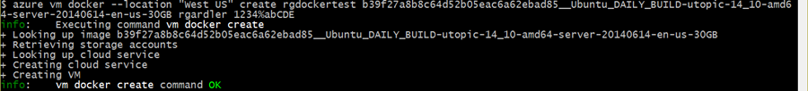

<properties
    pageTitle="Docker virtueller Computer-Erweiterung verwenden für Linux auf Azure"
    description="Beschreibt Docker und die Erweiterungen Azure-virtuellen Computern und veranschaulicht, wie programmgesteuert erstellen von virtuellen Computern auf Azure, die Docker Hosts über die Befehlszeile mithilfe der CLI Azure sind."
    services="virtual-machines-linux"
    documentationCenter=""
    authors="squillace"
    manager="timlt"
    editor="tysonn"
    tags="azure-service-management"/>

<tags
    ms.service="virtual-machines-linux"
    ms.devlang="multiple"
    ms.topic="article"
    ms.tgt_pltfrm="vm-linux"
    ms.workload="infrastructure-services"
    ms.date="08/29/2016"
    ms.author="rasquill"/>

# <a name="using-the-docker-vm-extension-from-the-azure-command-line-interface-azure-cli"></a>Mit der Erweiterung Docker virtueller Computer, über die Befehlszeile Azure Schnittstelle (Azure CLI)

[AZURE.INCLUDE [learn-about-deployment-models](../../includes/learn-about-deployment-models-classic-include.md)]


In diesem Thema beschrieben, wie mit der Erweiterung Docker virtueller Computer vom Dienst Management (Asm) Modus in Azure CLI auf einer beliebigen Plattform ein virtuellen Computers zu erstellen. [Docker](https://www.docker.com/) ist eine der am häufigsten verwendeten Virtualisierung Vorgehensweisen, die als eine Möglichkeit zum Isolieren von Daten, und klicken Sie auf freigegebene Ressourcen computing [Linux Container](http://en.wikipedia.org/wiki/LXC) anstelle von virtuellen Computern verwendet. Sie können die Erweiterung Docker virtuellen Computer und dem [Azure Linux Agent](virtual-machines-linux-agent-user-guide.md) eines Docker virtuellen Computers zu erstellen, die eine beliebige Anzahl von Containern für die Anwendung auf Azure hostet. Eine allgemeine Erläuterung von Containern und deren Vorteile finden Sie unter dem [Docker hoher Ebene Whiteboard](http://channel9.msdn.com/Blogs/Regular-IT-Guy/Docker-High-Level-Whiteboard).


##<a name="how-to-use-the-docker-vm-extension-with-azure"></a>So verwenden Sie die Erweiterung Docker virtueller Computer mit Azure
Um die Erweiterung Docker virtueller Computer mit Azure verwenden zu können, müssen Sie eine Version der [Azure Befehlszeile Benutzeroberfläche](https://github.com/Azure/azure-sdk-tools-xplat) (Azure CLI) höher als 0.8.6 installieren (wie die aktuelle Version der Veröffentlichung dieses Dokuments 0.10.0 ist). Sie können unter Mac, Linux und Windows Azure CLI installieren.


Der gesamten Prozess Docker auf Azure verwenden, ist ganz einfach:

+ Installieren Sie die Azure CLI und die zugehörigen Dateien auf dem Computer, von dem aus Azure-Steuerelement (unter Windows, ist das eine Linux Verteilung als virtueller Computer ausgeführt)
+ Erstellen Sie einen virtuellen Computer Docker Host in Azure mithilfe der Azure CLI Docker Befehle
+ Verwenden Sie die lokale Docker-Befehle zum Verwalten Ihrer Docker Container in Ihrer Docker virtueller Computer in Azure.


### <a name="install-the-azure-command-line-interface-azure-cli"></a>Installieren der Azure Line Interface (Azure CLI)

Installieren und Konfigurieren der CLI Azure, finden Sie unter [Installieren der Benutzeroberfläche Azure Line](../xplat-cli-install.md). Geben Sie zum Bestätigen der Installations `azure` an der Eingabeaufforderung und nach einer kurzen Moment die Azure-CLI ASCII-Grafik angezeigt werden sollte, womit Sie die grundlegenden Befehle zur Verfügung. Wenn die Installation korrekt ausgeführt wurde, sollten Sie eingeben sein `azure help vm` und sehen Sie, dass eine der aufgeführten Befehle "Docker" ist.

> [AZURE.NOTE] Docker verfügt über Tools für Windows, [Docker Computer](https://docs.docker.com/installation/windows/), die Sie auch verwenden, um die Erstellung eines Docker Clients zu automatisieren, die Sie für die Arbeit mit Azure-virtuellen Computern als Docker Hosts verwenden können.

### <a name="connect-the-azure-cli-to-to-your-azure-account"></a>Verbinden mit Azure CLI zu Ihrer Azure-Konto
Bevor Sie die CLI Azure verwenden können müssen Sie Ihre Kontoanmeldeinformationen ein Azure-Azure CLI auf Ihrer Plattform zuordnen. Der [Herstellung der Verbindung zu Ihrem Abonnement Azure](../xplat-cli-connect.md) Abschnitt wird erläutert, wie entweder herunterladen und Ihre **publishsettings** -Datei importieren oder eine Organisations-Id Ihre Azure CLI zuordnen.

> [AZURE.NOTE] Es gibt einige Unterschiede im Verhalten, wenn Sie eine oder das andere Methoden der Authentifizierung, lesen Sie das Dokument aus, um die verschiedenen Funktionen zu verstehen werden, gehen Sie wie folgt verwenden.

### <a name="install-docker-and-use-the-docker-vm-extension-for-azure"></a>Installieren Sie Docker und verwenden Sie die Docker virtueller Computer Erweiterung für Azure
Folgen Sie den [Docker Installation Anweisungen](https://docs.docker.com/installation/#installation) zum Docker lokal auf Ihrem Computer installieren.

Wenn Docker mit einer Azure-virtuellen Computern verwenden möchten, müssen für den virtuellen Computer verwendeten Linux Bilds der [Azure Linux virtueller Computer-Agent](virtual-machines-linux-agent-user-guide.md) installiert. Zurzeit stehen nur zwei Arten von Bildern, die diese enthalten:

+ Abbildung Ubuntu aus der Bildergalerie Azure oder

+ Ein benutzerdefiniertes Bild für Linux, das Sie mit dem Azure Linux virtueller Computer-Agent installiert und konfiguriert erstellt haben. Weitere Informationen zum Erstellen eines benutzerdefinierten Linux VM mit dem Azure-virtuellen Computer-Agent finden Sie unter [Azure Linux virtueller Computer-Agent](virtual-machines-linux-agent-user-guide.md) .

### <a name="using-the-azure-image-gallery"></a>Verwenden der Bildergalerie Azure

Verwenden Sie den folgenden Befehl aus Azure CLI aus einem Bash oder Terminal Sitzung suchen Sie das neueste Ubuntu Bild im Katalog virtueller Computer zu verwenden, mit der Eingabe

`azure vm image list | grep Ubuntu-14_04`

und wählen Sie eine von der Bildnamen wie `b39f27a8b8c64d52b05eac6a62ebad85__Ubuntu-14_04_4-LTS-amd64-server-20160516-en-us-30GB`, und verwenden Sie den folgenden Befehl zum Erstellen eines neuen virtuellen Computers verwenden, die diesem Bild.

```
azure vm docker create -e 22 -l "West US" <vm-cloudservice name> "b39f27a8b8c64d52b05eac6a62ebad85__Ubuntu-14_04_4-LTS-amd64-server-20160516-en-us-30GB" <username> <password>
```

wobei Folgendes gilt:

+ * &lt;Namen virtueller Computer-Cloudservice&gt; * ist der Name der virtuellen Computer, die die Docker Container Hostcomputer in Azure verwendet werden soll

+  * &lt;Benutzername&gt; * ist der Benutzername für den Standard-Stamm-Benutzer von den virtuellen Computer

+ * &lt;Kennwort&gt; * ist das Kennwort des Kontos *Username* , die den Komplexität-Standards für Azure entspricht.

> [AZURE.NOTE] Derzeit ein Kennwort muss mindestens 8 Zeichen lang sein, einen Kleinbuchstaben und Großbuchstaben ein Zeichen, eine Zahl und ein Sonderzeichen wie eine der folgenden Zeichen enthalten: `!@#$%^&+=`. Nein, ist der Zeitraum am Ende des vorhergehenden Satzes keines Sonderzeichens.

Wenn der Befehl erfolgreich war, sollten Sie sehen etwa Folgendes, je nach präzise Argumente und Optionen, die Sie verwendet:



> [AZURE.NOTE] Erstellen eines virtuellen Computers kann einige Minuten dauern, aber hat nach bereitgestellt wurde (der Zustandswert ist `ReadyRole`) der Docker Daemon (der Dienst Docker) beginnt, und Sie können die Verbindung zu den Docker Container Host.

Geben Sie zum Testen der Docker virtueller Computer Sie in Azure erstellt haben

`docker --tls -H tcp://<vm-name-you-used>.cloudapp.net:2376 info`

wo * &lt;virtuellen Computer-Name-Sie-verwendet&gt; * ist der Name des virtuellen Computers, die Sie in der Anruf an verwendet `azure vm docker create`. Es sollte ähnlich der folgenden, der festlegt, dass Ihre Docker Host virtueller Computer aktiv ist und in Azure ausgeführt und Warten auf die Befehle angezeigt. 

Nachdem Sie versuchen können, um eine Verbindung mit Ihren Kunden Docker, um Informationen zu erhalten (in manchen Docker Client-Systemen, z. B., die auf einem Mac, müssen Sie möglicherweise verwenden `sudo`):

    sudo docker --tls -H tcp://testsshasm.cloudapp.net:2376 info
    Password:
    Containers: 0
    Images: 0
    Storage Driver: devicemapper
    Pool Name: docker-8:1-131781-pool
    Pool Blocksize: 65.54 kB
    Backing Filesystem: extfs
    Data file: /dev/loop0
    Metadata file: /dev/loop1
    Data Space Used: 1.821 GB
    Data Space Total: 107.4 GB
    Data Space Available: 28 GB
    Metadata Space Used: 1.479 MB
    Metadata Space Total: 2.147 GB
    Metadata Space Available: 2.146 GB
    Udev Sync Supported: true
    Deferred Removal Enabled: false
    Data loop file: /var/lib/docker/devicemapper/devicemapper/data
    Metadata loop file: /var/lib/docker/devicemapper/devicemapper/metadata
    Library Version: 1.02.77 (2012-10-15)
    Execution Driver: native-0.2
    Logging Driver: json-file
    Kernel Version: 3.19.0-28-generic
    Operating System: Ubuntu 14.04.3 LTS
    CPUs: 1
    Total Memory: 1.637 GiB
    Name: testsshasm
    WARNING: No swap limit support

Einfach, um sicherzustellen, dass es stammt, dass alle arbeiten, können Sie den virtuellen Computer für die Erweiterung Docker überprüfen:

    azure vm extension get testsshasm
    info: Executing command vm extension get
    + Getting virtual machines
    data: Publisher Extension name ReferenceName Version State
    data: -------------------- --------------- ------------------------- ------- ------
    data: Microsoft.Azure.E... DockerExtension DockerExtension 1.* Enable
    info: vm extension get command OK

### <a name="docker-host-vm-authentication"></a>Docker Host virtueller Computer-Authentifizierung

Neben dem Erstellen der Docker virtueller Computer, der `azure vm docker create` Befehl auch automatisch erstellt werden, um dem Clientcomputer Docker Verbindung zum Azure Container Host mit HTTPS ermöglichen die erforderlichen Zertifikate, und die Zertifikate auf die Client- und die Host, je nach Bedarf gespeichert sind. Bei nachfolgenden Versuchen sind die vorhandenen Zertifikate wiederverwendet und mit dem neuen Host freigegeben.

Standardmäßig werden Zertifikate platziert `~/.docker`, und Docker wird so konfiguriert werden, dass auf Port **2376**ausgeführt werden. Wenn Sie einen anderen Anschluss oder Verzeichnis verwenden möchten, und klicken Sie dann Sie möglicherweise eine der folgenden verwenden `azure vm docker create` Befehlszeilenoptionen zum Konfigurieren Ihrer Docker Containers Hosten virtueller Computer mit einer anderen Anschluss oder andere Zertifikate zum Herstellen einer Verbindung Clients:

```
-dp, --docker-port [port]              Port to use for docker [2376]
-dc, --docker-cert-dir [dir]           Directory containing docker certs [.docker/]
```

Der Docker Daemon auf dem Host ist so konfiguriert, dass für Abhören und authentifiziert Clientverbindungen auf den angegebenen Port die Zertifikate generiert werden, indem Sie mit der `azure vm docker create` Befehl. Der Clientcomputer müssen diese Zertifikate auf dem Host Docker zugreifen.

> [AZURE.NOTE] Ein vernetzter Host ohne diese Zertifikate ausgeführt werden gefährdet an eine Person, die zum mit dem Computer herstellen können. Bevor Sie die Konfiguration ändern möchten, stellen Sie sicher, dass Sie auf Computer und Applikationen Risiken verstehen.

## <a name="next-steps"></a>Nächste Schritte

* Sie sind bereit sind, wechseln Sie zu der [Docker Benutzerhandbuch] und Ihre Docker virtuellen Computer verwenden. Zum Erstellen eines aktivierten Docker virtuellen Computers in das neue Portal finden Sie unter [die Erweiterung Docker virtueller Computer mit dem Portal verwenden].

* Die Erweiterung Azure Docker virtueller Computer unterstützt auch Docker verfassen, die mithilfe eine deklarative YAML Datei eine Anwendung Entwicklertools erstellt über eine beliebige Umgebung und eine einheitliche Bereitstellung generieren. Finden Sie unter [Erste Schritte mit Docker und verfassen definieren und Ausführen einer Anwendungs mehrere Container auf eine Azure-virtuellen Computern].  

<!--Anchors-->
[Subheading 1]: #subheading-1
[Subheading 2]: #subheading-2
[Subheading 3]: #subheading-3
[Next steps]: #next-steps

[How to use the Docker VM Extension with Azure]: #How-to-use-the-Docker-VM-Extension-with-Azure
[Virtual Machine Extensions for Linux and Windows]: #Virtual-Machine-Extensions-For-Linux-and-Windows
[Container and Container Management Resources for Azure]: #Container-and-Container-Management-Resources-for-Azure


<!--Link references-->
[Link 1 to another azure.microsoft.com documentation topic]: virtual-machines-windows-hero-tutorial.md
[Link 2 to another azure.microsoft.com documentation topic]: ../web-sites-custom-domain-name.md
[Link 3 to another azure.microsoft.com documentation topic]: ../storage-whatis-account.md
[So verwenden Sie die Erweiterung Docker virtueller Computer mit dem Portal]: http://azure.microsoft.com/documentation/articles/virtual-machines-docker-with-portal/

[Docker-Benutzerhandbuch]: https://docs.docker.com/userguide/
 
[Erste Schritte mit Docker und verfassen definieren und Ausführen einer Anwendungs mehrere Container auf eine Azure-virtuellen Computern]:virtual-machines-linux-docker-compose-quickstart.md