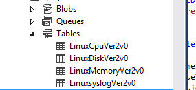

<properties
        pageTitle="Überwachung einer Linux VM mit der Erweiterung virtueller Computer | Microsoft Azure"
        description="Erfahren Sie, wie die Diagnose Linux-Erweiterung zum Überwachen der Leistung und Diagnose Daten von einem Linux VM in Azure verwenden."
        services="virtual-machines-linux"
        documentationCenter=""
        authors="NingKuang"
        manager="timlt"
        editor=""
        tags="azure-service-management"/>

<tags
        ms.service="virtual-machines-linux"
        ms.workload="infrastructure-services"
        ms.tgt_pltfrm="vm-linux"
        ms.devlang="na"
        ms.topic="article"
        ms.date="12/15/2015"
        ms.author="Ning"/>

# Verwenden Sie die Diagnose Linux-Erweiterung zum Überwachen der Leistung und Diagnose Daten von einem Linux VM

## Einführung

(**Notiz**: der Diagnose Linux-Erweiterung ist die öffnen-Quelle auf [Github](https://github.com/Azure/azure-linux-extensions/tree/master/Diagnostic) , an dem die aktuellste Informationen auf die Erweiterung zuerst veröffentlicht, ist. Sie sollten die [Github Seite](https://github.com/Azure/azure-linux-extensions/tree/master/Diagnostic) müssen Sie zuerst aktivieren.)

Die Linux Diagnostic Erweiterung hindert einen Benutzer Monitor der Linux virtuellen Computern, die auf Microsoft Azure ausgeführt werden. Es weist die folgenden Funktionen:

- Sammelt und lädt die Leistung Systeminformationen aus der Linux VM des Benutzers Speicher Tabelle, einschließlich der Informationen zu Diagnose- und Syslog hoch.
- Ermöglicht Benutzern, die Daten Metrik anpassen, die gesammelt und hochgeladen werden.
- Ermöglicht Benutzern, die angegebenen Protokolldateien zu einer Speichertabelle vorgesehenen hochladen.

In der aktuellen Version 2.3, die Daten enthält:

- Alle Linux Rsyslog Protokolle, einschließlich System, Sicherheit und Anwendung protokolliert.
- Alle Systemdaten, die auf [der Website System Center Cross Plattform Lösungen](https://scx.codeplex.com/wikipage?title=xplatproviders)angegeben ist.
- Benutzer angegebenen Protokolldateien.

Diese Erweiterung funktioniert mit sowohl das klassische und Ressourcenmanager Bereitstellungsmodelle.

### Aktuelle Version der Erweiterung und veraltete Objekte alten Versionen

Die neueste Version der Erweiterung ist **2.3**und **alten Versionen (2.0, 2.1, und 2.2) werden nicht mehr unterstützt und nicht nach dem Ende des Jahres (2016) veröffentlichte**. Wenn Sie die Erweiterung Linux Diagnostic mit Nebenversion automatische Aktualisierung deaktiviert installiert haben, wird empfohlen, dass Sie die Erweiterung deinstallieren, und installieren es mit Nebenversion automatische Aktualisierung aktiviert. Auf virtuellen Computern klassischen (ASM) können Sie erreichen dies durch '2.*' als die Version angeben, wenn Sie die Erweiterung über Azure XPLAT CLI oder Powershell installieren. Auf Cloud virtuellen Computern, erzielen Sie dies, einschließlich ' "AutoUpgradeMinorVersion": Wahr ' in der virtuellen Computer Bereitstellungsvorlage. Alle neuen Installation der Erweiterung sollte außerdem die automatische Nebenversion upgrade bei aktivierter Option haben.

## Aktivieren Sie die Erweiterung
Sie können diese Erweiterung mithilfe der [Azure-Portal](https://portal.azure.com/#), Azure PowerShell oder Azure CLI Skripts aktivieren.

Führen Sie zum Anzeigen und Konfigurieren der System und Leistung Daten direkt aus dem Azure-Portal, [Schritten Azure Blog] (https://azure.microsoft.com/blog/2014/09/02/windows-azure-virtual-machine-monitoring-with-wad-extension/ "URL in die Windows-Blog" /).

Dieser Artikel befasst sich zum Aktivieren und konfigurieren die Erweiterung mithilfe von Azure CLI-Befehle. Dadurch können Sie zu lesen ist und die Daten direkt aus der Speichertabelle anzeigen.

Beachten Sie, dass die hier beschriebenen Konfigurationsmethoden für das Azure Portal funktioniert. Zum Anzeigen und die System und Leistung Daten direkt aus dem Azure-Portal konfiguriert haben, muss die Erweiterung über das Portal aktiviert sein.

## Erforderliche Komponenten
- **Azure Linux Agent Version 2.0.6 oder höher**.
Beachten Sie, dass die meisten Azure-virtuellen Computer Linux Katalog Bilder Version 2.0.6 enthalten oder höher. Sie können ausführen **WAAgent-Version** zur Bestätigung des virtuellen Computers welche Version installiert ist. Wenn Sie der virtuellen Computer eine Version ausgeführt wird, die älter als 2.0.6 ist, können Sie [diese Anweisungen GitHub](https://github.com/Azure/WALinuxAgent "Anweisungen") , um ihn zu aktualisieren folgen.

- **Azure CLI**. Befolgen Sie [Diese Anleitung für die Installation von CLI](../xplat-cli-install.md) zum Einrichten der Umgebung Azure CLI auf Ihrem Computer aus. Nach der Installation von Azure CLI können den Befehl **Azure** aus der Benutzeroberfläche Line (Bash, Terminal oder Eingabeaufforderungsfenster) Sie Azure CLI-Befehle zugreifen. Beispiel:
    - Führen Sie **Azure-virtuellen Computer Erweiterung festlegen – Hilfe** ausführliche Hilfe Informationen ein.
    - Führen Sie **Azure Anmeldung** bei Azure anmelden.
    - Führen Sie die **Liste Azure-virtuellen Computer** , um den virtuellen Computern aufzulisten, die Sie auf Azure haben.
- Ein Speicherkonto zum Speichern der Daten. Sie benötigen einen Kontonamen Speicher, der zuvor erstellt wurde und eine Tastenkombination, die Daten zu Ihren Speicher hochladen.

## Mithilfe des Befehls Azure CLI die Diagnose Linux-Erweiterung zu aktivieren

### Szenario 1. Aktivieren Sie die Erweiterung mit der standardmäßigen Datengruppe zurück
In der Version 2.3 oder höher enthält die Standarddaten, die gesammelt werden sollen:

- Alle Rsyslog Informationen (einschließlich System, Sicherheit und Anwendungsprotokolle).  
- Eine Core Datenmenge Basis System. Beachten Sie, dass auf der [Website System Center Cross Plattform Lösungen](https://scx.codeplex.com/wikipage?title=xplatproviders)sämtlicher Daten beschrieben wird.
Wenn Sie zusätzliche Daten aktivieren möchten, fahren Sie mit den Schritten in Szenarien 2 und 3.

Schritt 1. Erstellen Sie eine Datei namens PrivateConfig.json mit dem folgenden Inhalt ein:

    {
        "storageAccountName" : "the storage account to receive data",
        "storageAccountKey" : "the key of the account"
    }

Schritt 2. Führen Sie * *Azure-virtuellen Computer Erweiterung festlegen Vm_name LinuxDiagnostic Microsoft.OSTCExtensions 2.* --privat-Config-Path PrivateConfig.json**.

###   Szenario 2. Anpassen der Performance Monitor-Werte  
In diesem Abschnitt beschrieben, wie die Leistung und Diagnose Datentabelle anpassen.

Schritt 1. Erstellen Sie eine Datei namens PrivateConfig.json mit der Inhalte, die in Szenario 1 beschrieben wurde. Erstellen Sie auch eine Datei namens PublicConfig.json ein. Geben Sie die bestimmte Daten, die Sie sammeln möchten.

Für alle unterstützten Anbieter und Variablen Bezug der [System Center Cross Plattform Solutions-Website](https://scx.codeplex.com/wikipage?title=xplatproviders). Können Sie mehrere Abfragen haben und sie in mehreren Tabellen speichern, indem Sie weitere Abfragen an das Skript anfügen.

Standardmäßig werden die Daten Rsyslog immer erfasst.

    {
        "perfCfg":
        [
            {
                "query" : "SELECT PercentAvailableMemory, AvailableMemory, UsedMemory ,PercentUsedSwap FROM SCX_MemoryStatisticalInformation",
                "table" : "LinuxMemory"
            }
        ]
    }

Schritt 2. Führen Sie * *Azure-virtuellen Computer Erweiterung festlegen Vm_name LinuxDiagnostic Microsoft.OSTCExtensions ' 2.*'--Privat-Config-Path PrivateConfig.json – öffentlichen-Config-Path PublicConfig.json**.

###   Szenario 3. Hochladen Sie Ihrer eigenen Protokolldateien
In diesem Abschnitt beschrieben, wie Sie sammeln und bestimmte Protokolldateien bei Ihrem Speicherkonto hochladen. Sie müssen Geben Sie sowohl den Pfad der Protokolldatei und den Namen der Tabelle, in Ihrem Protokoll gespeichert werden soll. Sie können mehrere Protokolldateien erstellen, indem mehrere Datei/Verzeichniseinträgen das Skript hinzufügen.

Schritt 1. Erstellen Sie eine Datei namens PrivateConfig.json mit der Inhalte, die in Szenario 1 beschrieben wurde. Erstellen Sie dann eine andere Datei mit dem Namen PublicConfig.json mit dem folgenden Inhalt ein:

    {
        "fileCfg" :
        [
            {
                "file" : "/var/log/mysql.err",
                "table" : "mysqlerr"
             }
        ]
    }

Schritt 2. Führen Sie * *Azure-virtuellen Computer Erweiterung festlegen Vm_name LinuxDiagnostic Microsoft.OSTCExtensions ' 2.*'--Privat-Config-Path PrivateConfig.json – öffentlichen-Config-Path PublicConfig.json**.

Beachten Sie, dass mit dieser Einstellung auf die Erweiterung-Versionen vor 2.3 meldet alle geschrieben `/var/log/mysql.err` können dupliziert werden, um `/var/log/syslog` (oder `/var/log/messages` je nach der Linux Distro) sowie. Wenn Sie diese doppelten Protokollierung vermeiden möchten, können Sie die Protokollierung von ausschließen `local6` Einrichtung in der Konfiguration Rsyslog protokolliert. Abhängig von der Linux Distro, aber auf einem Ubuntu 14.04-System, die zu ändernde Datei beträgt `/etc/rsyslog.d/50-default.conf` und Sie ersetzen können Sie die Zeile `*.*;auth,authpriv.none -/var/log/syslog` auf `*.*;auth,authpriv,local6.none -/var/log/syslog`. Dieses Problem behoben wird, in der neuesten Version von Update 2.3 (2.3.9007), damit die Erweiterungsversion 2.3 ist, dieses Problem nicht geschehen soll. Wenn weiterhin bedeutet sogar nachdem Sie Ihre virtuellen Computer neu zu starten, kontaktieren Sie uns bitte und helfen Sie uns die Problembehandlung, wenn die neueste Version von Update nicht automatisch installiert wird.

###   Szenario 4. Beenden Sie die Erweiterung aus Erfassung von einem beliebigen Protokollen
In diesem Abschnitt beschrieben, wie die Erweiterung von Erfassung von Protokollen zu beenden. Beachten Sie, dass der Überwachung Agent-Prozess weiterhin einsatzbereit trotz dieser neu konfiguriert werden. Wenn Sie den Überwachung Agent-Prozess vollständig beenden möchten, können Sie dazu deaktivieren die Erweiterung. Der Befehl zum Deaktivieren der Erweiterung lautet * *Azure-virtuellen Computer Erweiterung festlegen – deaktivieren < Vm_name > LinuxDiagnostic Microsoft.OSTCExtensions ' 2.*'* *.

Schritt 1. Erstellen Sie eine Datei namens PrivateConfig.json mit der Inhalte, die in Szenario 1 beschrieben wurde. Erstellen Sie eine andere Datei mit dem Namen PublicConfig.json mit dem folgenden Inhalt:

    {
        "perfCfg" : [],
        "enableSyslog" : "false"
    }

Schritt 2. Ausführen * *Azure-virtuellen Computer Erweiterung festlegen Vm_name LinuxDiagnostic Microsoft.OSTCExtensions ' 2.*'--Privat-Config-Path PrivateConfig.json – öffentlichen-Config-Path PublicConfig.json**.

## Überprüfen von Daten
Die Leistung und Diagnose Daten werden in einer Tabelle Azure Storage gespeichert. Überprüfen Sie [So Azure Table Storage aus Ruby verwenden](../storage/storage-ruby-how-to-use-table-storage.md) , erfahren Sie, wie Sie die Daten in der Speichertabelle mithilfe von Azure CLI zugreifen.

Darüber hinaus können Sie folgenden UI-Tools auf die Daten zuzugreifen:

1. Visual Studio-Server-Explorer. Wechseln Sie zu Ihrem Speicherkonto. Nach der virtuellen Computer etwa fünf Minuten ausgeführt werden kann, wird die vier standardmäßigen Tabellen angezeigt: "LinuxCpu", "LinuxDisk", "LinuxMemory" und "Linuxsyslog". Doppelklicken Sie auf den Namen der Tabellen, um die Daten anzuzeigen.

2. [Azure-Speicher-Explorer] (https://azurestorageexplorer.codeplex.com/ "Azure-Speicher-Explorer").

Wenn Sie FileCfg oder PerfCfg (wie in den Szenarios 2 und 3 beschrieben) aktiviert haben, können Sie Visual Studio Server-Explorer und Azure-Speicher-Explorer verwenden, um nicht standardmäßige Daten anzuzeigen.

## Bekannte Probleme
- In der aktuellen Version (2.3) der Linux Diagnostic Erweiterung können die Rsyslog Informationen sowie die Protokolldatei Kunden festgelegten nur über Skripting zugegriffen werden.
