<properties
   pageTitle="Erstellen und Hochladen eines Bilds FreeBSD VM | Microsoft Azure"
   description="Informationen Sie zum Erstellen und Hochladen einer virtuellen Festplatte (virtuelle Festplatte), die das Betriebssystem FreeBSD zum Erstellen einer Azure-virtuellen Computern enthält"
   services="virtual-machines-linux"
   documentationCenter=""
   authors="KylieLiang"
   manager="timlt"
   editor=""
   tags="azure-service-management"/>

<tags
   ms.service="virtual-machines-linux"
   ms.devlang="na"
   ms.topic="article"
   ms.tgt_pltfrm="vm-linux"
   ms.workload="infrastructure-services"
   ms.date="08/29/2016"
   ms.author="kyliel"/>

# Erstellen und Hochladen einer VHD FreeBSD in Azure

In diesem Artikel wird veranschaulicht, wie erstellen und Hochladen einer virtuellen Festplatte (virtuelle Festplatte), die das Betriebssystem FreeBSD enthält. Nachdem Sie es hochgeladen haben, können Sie es zum Erstellen eines virtuellen Computers (virtueller Computer) in Azure als Ihr eigenes Bild verwenden.

[AZURE.INCLUDE [learn-about-deployment-models](../../includes/learn-about-deployment-models-classic-include.md)]

## Erforderliche Komponenten
In diesem Artikel wird vorausgesetzt, dass Sie die folgenden Elemente:

- **Ein Azure-Abonnement**– Wenn Sie kein Konto haben, können Sie eine in nur ein paar Minuten erstellen. Wenn Sie ein MSDN-Abonnement verfügen, finden Sie unter [monatliche Azure Kreditkarte für Visual Studio Abonnenten.](https://azure.microsoft.com/pricing/member-offers/msdn-benefits-details/). Andernfalls erfahren Sie, wie [ein kostenloses Testversion Konto erstellt](https://azure.microsoft.com/pricing/free-trial/).  

- **Azure PowerShell-Tools**– das Azure PowerShell Modul muss installiert sein und so konfiguriert, dass Ihr Abonnement Azure verwenden. Wenn das Modul herunterladen möchten, finden Sie unter [downloads Azure](https://azure.microsoft.com/downloads/). Ein Lernprogramm, die beschreibt, wie installieren und Konfigurieren des Moduls ist hier verfügbar. Verwenden Sie das Cmdlet [Azure-Downloads für](https://azure.microsoft.com/downloads/) die virtuelle Festplatte hochladen.

- Um eine virtuelle Festplatte muss **FreeBSD Betriebssystem installiert ist, in eine .vhd-Datei**– ein unterstützt FreeBSD Betriebssystem installiert sein. Mehrere Tools vorhanden sein, um VHD-Dateien zu erstellen. Beispielsweise können Sie eine Lösung wie Hyper-V-Virtualisierung VHD-Datei erstellen und Installieren des Betriebssystems. Informationen zum Installieren und Verwenden von Hyper-V Anweisungen finden Sie unter [Hyper-V installieren und erstellen ein virtuellen Computers](http://technet.microsoft.com/library/hh846766.aspx).

> [AZURE.NOTE] Das neuere VHDX-Format wird in Azure nicht unterstützt. Sie können den Datenträger mithilfe von Hyper-V-Manager oder das Cmdlet [Konvertieren-virtuelle Festplatte](https://technet.microsoft.com/library/hh848454.aspx)virtuelle Festplatte-Format konvertieren. Darüber hinaus ist ein [im MSDN zur Verwendung von FreeBSD mit Hyper-V-Lernprogramm](http://blogs.msdn.com/b/kylie/archive/2014/12/25/running-freebsd-on-hyper-v.aspx).

Dieser Vorgang umfasst die folgenden fünf Schritte.

## Schritt 1: Vorbereiten des Bilds für hochladen

Des virtuellen Computers, auf dem das Betriebssystem FreeBSD installiert, ist, führen Sie die folgenden Schritte aus:

1. Aktivieren Sie DHCP.

        # echo 'ifconfig_hn0="SYNCDHCP"' >> /etc/rc.conf
        # service netif restart

2. SSH aktivieren.

    SSH ist nach der Installation von Datenträger standardmäßig aktiviert. Geben Sie Wenn sie aus irgendeinem Grund nicht aktiviert ist, oder Sie FreeBSD VHD direkt verwenden, Folgendes ein:

        # echo 'sshd_enable="YES"' >> /etc/rc.conf
        # ssh-keygen -t dsa -f /etc/ssh/ssh_host_dsa_key
        # ssh-keygen -t rsa -f /etc/ssh/ssh_host_rsa_key
        # service sshd restart

3. Richten Sie eine serielle Konsole aus.

        # echo 'console="comconsole vidconsole"' >> /boot/loader.conf
        # echo 'comconsole_speed="115200"' >> /boot/loader.conf

4. Installieren Sie Sudo an.

    Das Stamm-Konto ist in Azure deaktiviert. Dies bedeutet, dass Sie Sudo aus ein Benutzer zum Ausführen der Befehle mit erhöhten nutzen müssen.

        # pkg install sudo
;
5. Erforderliche Komponenten für Azure-Agent.

        # pkg install python27  
        # pkg install Py27-setuptools27   
        # ln -s /usr/local/bin/python2.7 /usr/bin/python   
        # pkg install git

6. Azure-Agent zu installieren.

    Die neueste Version von der Azure-Agent immer [Github](https://github.com/Azure/WALinuxAgent/releases)finden Sie auf. Die 2.0.10 + formal unterstützt FreeBSD 10 und 10.1, und die Version 2.1.4 formal unterstützt FreeBSD 10.2 und spätere Versionen.

        # git clone https://github.com/Azure/WALinuxAgent.git  
        # cd WALinuxAgent  
        # git tag  
        …
        WALinuxAgent-2.0.16
        …
        v2.1.4
        v2.1.4.rc0
        v2.1.4.rc1

    Verwenden Sie für 2.0 lassen Sie uns 2.0.16 als Beispiel:

        # git checkout WALinuxAgent-2.0.16
        # python setup.py install  
        # ln -sf /usr/local/sbin/waagent /usr/sbin/waagent  

    Verwenden Sie für 2.1 lassen Sie uns 2.1.4 als Beispiel:

        # git checkout v2.1.4
        # python setup.py install  
        # ln -sf /usr/local/sbin/waagent /usr/sbin/waagent  
        # ln -sf /usr/local/sbin/waagent2.0 /usr/sbin/waagent2.0

    >[AZURE.IMPORTANT] Nach der Installation von Azure-Agent ist es eine gute Idee, stellen Sie sicher, dass er ausgeführt wird:

        # waagent -version
        WALinuxAgent-2.1.4 running on freebsd 10.3
        Python: 2.7.11
        # service –e | grep waagent
        /etc/rc.d/waagent
        # cat /var/log/waagent.log

7. Entziehen von System.

    Entziehen von System zum Bereinigen ihn, und machen Sie es für die erneute Bereitstellung geeignet. Mit dem folgende Befehl löscht auch das letzte bereitgestellte Benutzerkonto und die zugeordneten Daten:

        # echo "y" |  /usr/local/sbin/waagent -deprovision+user  
        # echo  'waagent_enable="YES"' >> /etc/rc.conf

    Jetzt können Sie Ihre virtuellen Computer ausschalten.

## Schritt 2: Erstellen eines Speicher-Kontos in Azure ##

Benötigen Sie ein Speicherkonto in Azure eine .vhd-Datei hochladen, damit es zum Erstellen eines virtuellen Computers verwendet werden kann. Im klassische Azure-Portal können um ein Speicherkonto zu erstellen.

1. Melden Sie sich zum [Azure klassischen Portal](https://manage.windowsazure.com)aus.

2. Wählen Sie auf der Befehlsleiste **neu**aus.

3. Wählen Sie **Data Services** > **Speicher** > **schnell zu erstellen**.

    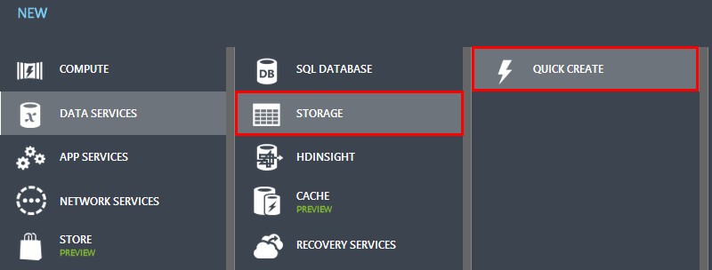

4. Füllen Sie die Felder wie folgt aus:

    - Geben Sie in das Feld **URL** einen Unterdomänennamen in der URL des Speicher-Konto verwenden. Der Eintrag kann von 3-24, Zahlen und Kleinbuchstaben enthalten. Dieser Name wird der Hostname in die URL, die zur Azure Blob-Speicher, Azure Warteschlange-Speicher oder Speicher-Ressourcen für das Abonnement Azure Tabelle Adressen verwendet wird.

    - Wählen Sie in der **Gruppe Position/Zugehörigkeit** Dropdown-Menü die **Zugehörigkeit oder Speicherort** für das Speicherkonto aus. Eine Gruppe für die Zugehörigkeit können Sie Ihre Clouddienste und Speicher in derselben Data Center bereitstellen.

    - Im Feld **Replikation** entscheiden Sie können, ob **Geo redundante** Replikation für Speicher-Konto verwenden. Geo-Replikation ist standardmäßig aktiviert. Diese Option repliziert Ihre Daten an einem Speicherort sekundäre kostenlos, die Sie an, sodass Ihre Speicher über zu diesem Speicherort schlägt fehl, wenn ein Haupt-Fehler am primären Standort auftritt. Der sekundäre Speicherort wird automatisch zugewiesen und kann nicht geändert werden. Wenn Sie mehr Kontrolle über die Position des Ihre cloudbasierte Datenspeicher aufgrund der gesetzlichen Vorschriften oder Unternehmensrichtlinien benötigen, können Sie Geo-Replikation deaktivieren. Bedenken Sie jedoch, wenn Sie später Geo-Replikation aktivieren, Ihnen eine einmalige Daten durchstellen Gebühr die vorhandenen Daten auf den zweiten Standort repliziert in Rechnung gestellt werden. Speicherservices ohne Geo-Replikation werden mit einem Rabatt angeboten. Weitere Informationen zum Verwalten von Geo-Replikation von Speicherkonten finden Sie hier: [erstellen, verwalten oder Löschen eines Kontos Speicher](../storage-create-storage-account/#replication-options).

    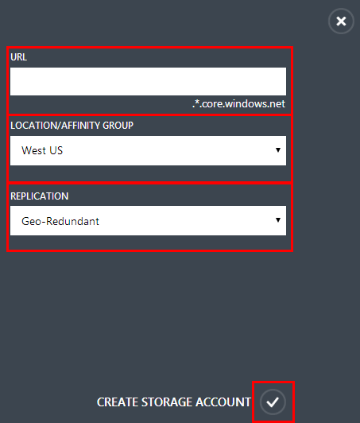

5. Wählen Sie die **Speicher-Konto erstellen**. Das Konto wird nun unter **Speicher**angezeigt.

    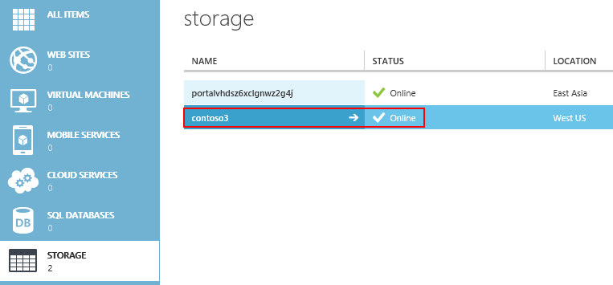

6. Als Nächstes erstellen Sie einen Container für Ihre hochgeladene VHD-Dateien. Wählen Sie den Namen des Kontos Speicher aus, und wählen Sie dann auf **Container**.

    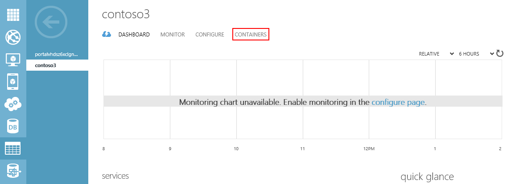

7. Wählen Sie **einen Container erstellen**.

    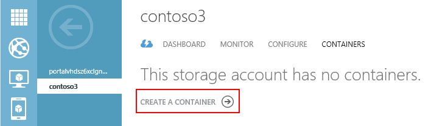

8. Geben Sie im Feld **Name** einen Namen für den Container. Wählen Sie dann im Dropdown-Menü **Access** Sie die gewünschte Art der Zugriffsrichtlinie.

    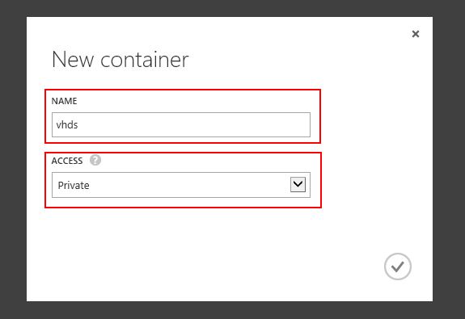

    > [AZURE.NOTE] Standardmäßig wird der Container ist privat und nur über den Kontobesitzer zugegriffen werden kann. Um öffentliche Lesezugriff, um die Blobs im Container, jedoch nicht in den Containereigenschaften und Metadaten zu ermöglichen, verwenden Sie die Option **Blob für den öffentlichen** aus. Verwenden Sie die Option **Öffentlichen Container** vollständigen öffentlichen Lesezugriff für den Container und Blobs um zu ermöglichen.

## Schritt 3: Vorbereiten der Verbindungs mit Azure

Bevor Sie eine .vhd-Datei hochladen können, müssen Sie eine sichere Verbindung zwischen Ihrem Computer und Ihr Abonnement Azure herzustellen. Sie können die Abschreibung Azure Active Directory (Azure AD) oder das Zertifikat dazu verwenden.

### Verwenden Sie die Azure AD-Methode zum Hochladen einer VHD-Datei

1. Öffnen Sie die Azure PowerShell-Konsole.

2. Geben Sie den folgenden Befehl ein:  
    `Add-AzureAccount`

    Dieser Befehl öffnet ein Anmeldung Fenster, in dem Sie sich mit Ihrem geschäftlichen oder schulnotizbücher-Konto anmelden können.

    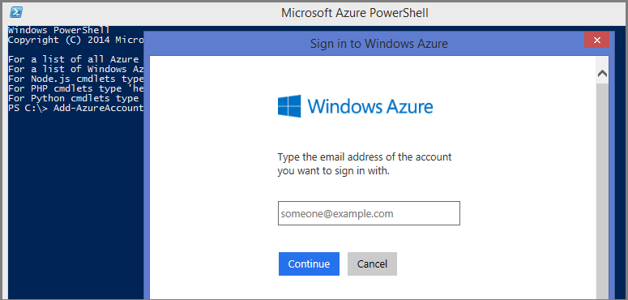

3. Azure authentifiziert und speichert Anmeldeinformationen für die. Klicken Sie dann das Fenster wird geschlossen.

### Verwenden Sie die Zertifikat-Methode zum Hochladen einer VHD-Datei

1. Öffnen Sie die Azure PowerShell-Konsole.

2. Type:  `Get-AzurePublishSettingsFile`.

3. Ein Browserfenster wird geöffnet und aufgefordert, eine PUBLISHSETTINGS-Datei nicht herunterladen. Diese Datei enthält Informationen und ein Zertifikat für Ihr Abonnement Azure.

    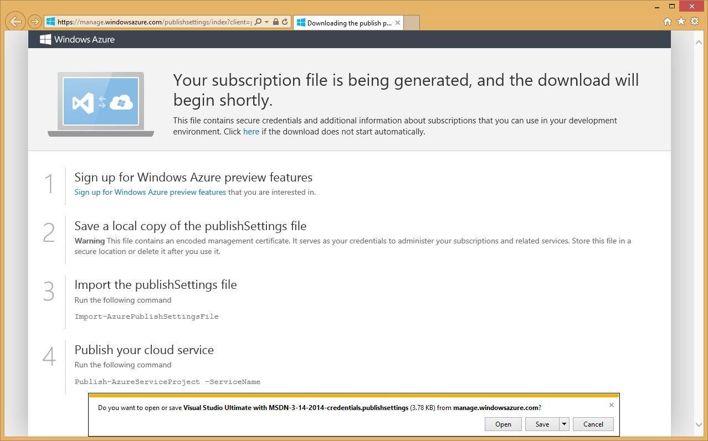

3. Speichern Sie die PUBLISHSETTINGS-Datei ein.

4. Type:  `Import-AzurePublishSettingsFile <PathToFile>`, wobei `<PathToFile>` der vollständige Pfad zu der Datei publishsettings ist.

   Weitere Informationen finden Sie unter [Erste Schritte mit Azure Cmdlets](http://msdn.microsoft.com/library/windowsazure/jj554332.aspx).

   Weitere Informationen zum Installieren und Konfigurieren der PowerShell finden Sie unter [Informationen zum Installieren und konfigurieren Azure PowerShell](../powershell-install-configure.md).

## Schritt 4: Hochladen der VHD-Datei

Wenn Sie die VHD-Datei hochladen, können Sie es an eine beliebige Position innerhalb der Blob-Speicher ablegen. Im folgenden werden einige Ausdrücke, die Sie verwenden möchten, wenn Sie die Datei hochladen:
-  **BlobStorageURL** ist die URL für das Speicherkonto, das Sie in Schritt2 erstellt haben.
-  **YourImagesFolder** ist der Container im Blob-Speicher, wo Sie die Bilder speichern möchten.
- **VHDName** ist die Beschriftung, die im klassischen Azure-Portal zu identifizieren die virtuelle Festplatte angezeigt wird.
- **PathToVHDFile** ist den vollständigen Pfad und den Namen der VHD-Datei.

Geben Sie aus dem Azure PowerShell-Fenster, die, das Sie im vorherigen Schritt verwendet haben Folgendes ein:

        Add-AzureVhd -Destination "<BlobStorageURL>/<YourImagesFolder>/<VHDName>.vhd" -LocalFilePath <PathToVHDFile>

## Schritt 5: Erstellen eines virtuellen Computers mit hochgeladene VHD-Datei
Nachdem Sie die VHD-Datei hochladen, können Sie es als Bild in die Liste der benutzerdefinierten Bilder hinzufügen, die mit Ihrem Abonnement verknüpft sind, und erstellen einen virtuellen Computer mit dieser benutzerdefinierten Bild.

1. Geben Sie aus dem Azure PowerShell-Fenster, die, das Sie im vorherigen Schritt verwendet haben Folgendes ein:

        Add-AzureVMImage -ImageName <Your Image's Name> -MediaLocation <location of the VHD> -OS <Type of the OS on the VHD>

    > [AZURE.NOTE]Verwenden Sie Linux als OS Typ aus. Die aktuelle Version von Azure PowerShell akzeptiert nur "Linux" oder "Windows" als Parameter.

2. Nachdem Sie die vorstehenden Schritte abgeschlossen haben, wird das neue Bild aufgeführt, beim Auswählen der Registerkarte **Bilder** im klassischen Azure-Portal.  

    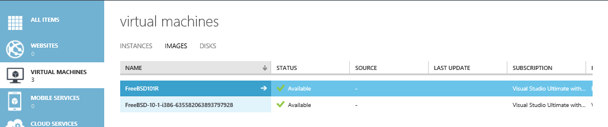

3. Erstellen Sie einen virtuellen Computer aus dem Katalog aus. Diese neue Abbildung ist nun unter **Meine Bilder**verfügbar.
4. Wählen Sie das neue Bild ein. Wechseln Sie als Nächstes durch den Anweisungen zum Einrichten einer Hostname, Kennwort, SSH Schlüssel usw..

    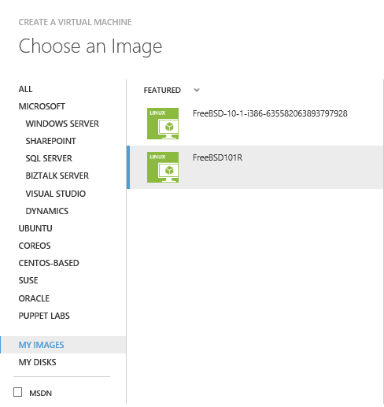

4. Nach Abschluss der Bereitstellung, sehen Sie Ihre FreeBSD VM in Azure ausgeführt.

    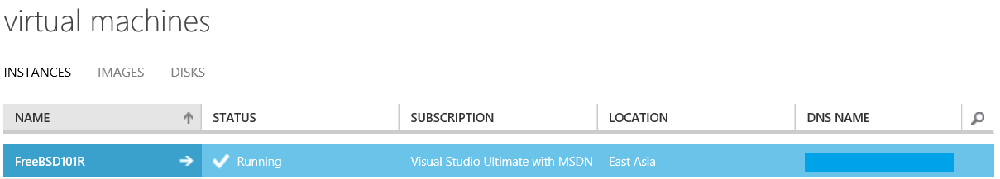
