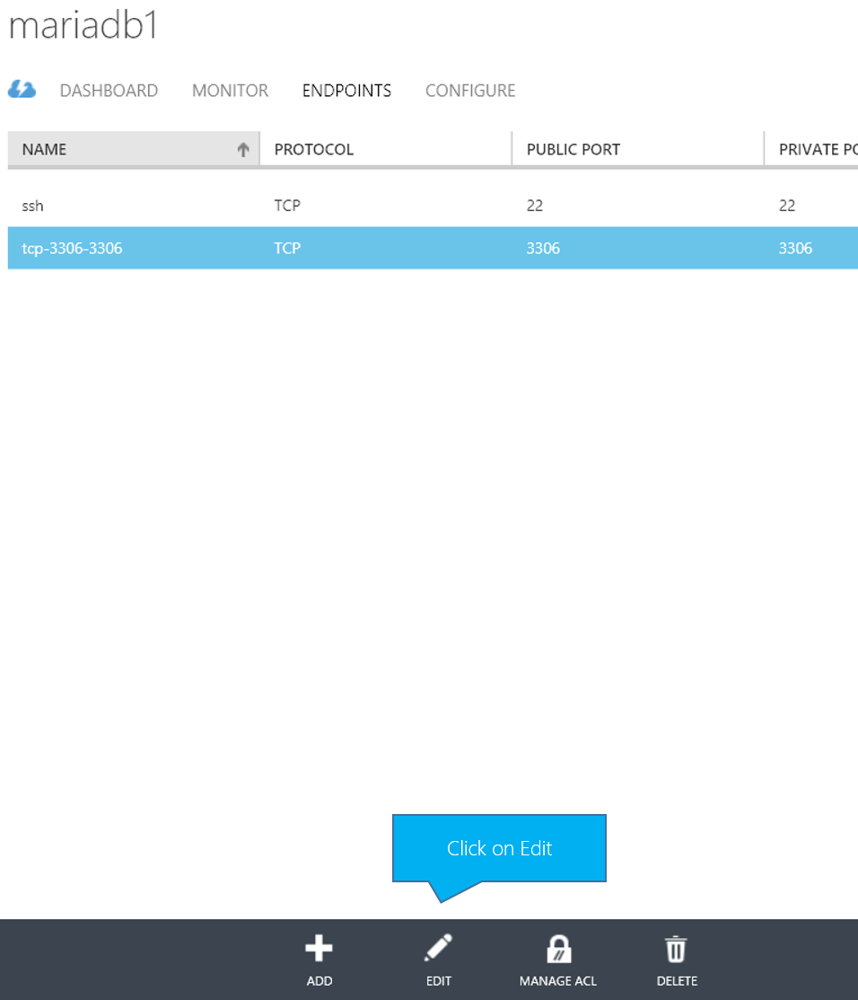

<properties
    pageTitle="Einen Cluster MariaDB (MySQL) ausgeführte auf Windows Azure"
    description="Erstellen einer MariaDB + Galera MySQL cluster auf Azure virtuellen Computern"
    services="virtual-machines-linux"
    documentationCenter=""
    authors="sabbour"
    manager="timlt"
    editor=""
    tags="azure-service-management"/>

<tags
    ms.service="virtual-machines-linux"
    ms.devlang="multiple"
    ms.topic="article"
    ms.tgt_pltfrm="vm-linux"
    ms.workload="infrastructure-services"
    ms.date="04/15/2015"
    ms.author="v-ahsab"/>

# MariaDB (MySQL) Cluster - Azure Lernprogramm

[AZURE.INCLUDE [learn-about-deployment-models](../../includes/learn-about-deployment-models-classic-include.md)]

> [AZURE.NOTE]  MariaDB Enterprise Cluster steht jetzt in der Azure Marketplace.  Neue Angebot wird automatisch einen MariaDB Galera Cluster in der Cloud bereitstellen. Sie sollten das neue Angebot aus https://azure.microsoft.com/en-us/marketplace/partners/mariadb/cluster-maxscale/ verwenden. 

Wir haben einen Multi-Master [Galera](http://galeracluster.com/products/) Cluster [MariaDBs](https://mariadb.org/en/about/), robuste, skalierbare und zuverlässigen Technik Ersatz für MySQL, entwickelt in einer hochgradig verfügbaren Umgebung auf Azure virtuellen Computern erstellen.

## Architektur (Übersicht)

In diesem Thema führt die folgenden Schritte aus:

1. Erstellen Sie einen Cluster mit 3 Knoten
2. Trennen Sie die Festplatten mit den Daten aus der Datenträger OS
3. Erstellen von Festplatten mit den Daten in RAID 0/Gestreifter Einstellung IOPS vergrößern
4. Verwenden der Azure-Lastenausgleich den Lastenausgleich, für die 3 Knoten
5. Um sich wiederholende Arbeit zu minimieren, erstellen Sie ein virtueller Computer Bild mit MariaDB + Galera und verwenden Sie, um die anderen Cluster virtuellen Computern erstellen.

> [AZURE.NOTE]  In diesem Thema verwendet die [CLI Azure](../xplat-cli-install.md) -Tools, daher sollten Sie sicherstellen herunterladen und verbinden Sie sie Ihrem Azure-Abonnement gemäß den Anweisungen. Wenn Sie einen Verweis auf die Befehle in der Azure CLI verfügbar benötigen, schauen Sie sich diesen Link für den [Azure CLI (Referenz)](../virtual-machines-command-line-tools.md). Außerdem müssen, [Erstellen Sie einen SSH Schlüssel für die Authentifizierung] und notieren Sie den **Dateispeicherort .pem**.

## Erstellen der Vorlage

### Infrastruktur

1. Erstellen einer Gruppe Zugehörigkeit, um die Ressourcen zusammen halten

        azure account affinity-group create mariadbcluster --location "North Europe" --label "MariaDB Cluster"

2. Erstellen Sie ein virtuelles Netzwerk

        azure network vnet create --address-space 10.0.0.0 --cidr 8 --subnet-name mariadb --subnet-start-ip 10.0.0.0 --subnet-cidr 24 --affinity-group mariadbcluster mariadbvnet

3. Erstellen Sie ein Konto Speicher für alle unsere Datenträger hosten. Beachten Sie, dass Sie mehr als 40 stark platziert werden sollte nicht Datenträger im selben Speicher-Konto verwendet, um zu vermeiden, drücken die 20.000 IOPS Konto Speichergrenze verwendet wird. In diesem Fall sind wir weit weg aus diese Nummer, damit wir alles im selben Konto zur Vereinfachung gespeichert wird

        azure storage account create mariadbstorage --label mariadbstorage --affinity-group mariadbcluster

3. Suchen nach dem Namen des Bilds CentOS 7 virtuellen Computern

        azure vm image list | findstr CentOS
Dies wird Ausgabe ungefähr wie folgt `5112500ae3b842c8b9c604889f8753c3__OpenLogic-CentOS-70-20140926`. Verwenden Sie den Namen in den folgenden Schritt aus.

4. Erstellen Sie die virtuellen Computer Vorlage ersetzen von **/path/to/key.pem** durch den Pfad die generierten .pem SSH-Taste gespeichert

        azure vm create --virtual-network-name mariadbvnet --subnet-names mariadb --blob-url "http://mariadbstorage.blob.core.windows.net/vhds/mariadbhatemplate-os.vhd"  --vm-size Medium --ssh 22 --ssh-cert "/path/to/key.pem" --no-ssh-password mariadbtemplate 5112500ae3b842c8b9c604889f8753c3__OpenLogic-CentOS-70-20140926 azureuser

5. Anfügen von 4 x 500GB Daten Datenträger an den virtuellen Computer für die Verwendung in der RAID-Konfiguration

        FOR /L %d IN (1,1,4) DO azure vm disk attach-new mariadbhatemplate 512 http://mariadbstorage.blob.core.windows.net/vhds/mariadbhatemplate-data-%d.vhd

6. SSH in der Vorlage virtueller Computer, die Sie am **mariadbhatemplate.cloudapp.net:22** erstellt und eine Verbindung mit Ihrem privaten Schlüssel.

### Software

1. Quadratwurzel zu erhalten

        sudo su

2. Installieren Sie RAID-Unterstützung:

     - Installieren von mdadm

                yum install mdadm

     - Erstellen der Konfigurations RAID0/Streifen mit einem Dateisystem EXT4

                mdadm --create --verbose /dev/md0 --level=stripe --raid-devices=4 /dev/sdc /dev/sdd /dev/sde /dev/sdf
                mdadm --detail --scan >> /etc/mdadm.conf
                mkfs -t ext4 /dev/md0

     - Erstellen von Punkt Bereitstellungsverzeichnis

                mkdir /mnt/data

     - Rufen Sie den UUID des neu erstellten RAID Geräts ab

                blkid | grep /dev/md0

     - / Etc/fstab bearbeiten

                vi /etc/fstab

     - Fügen Sie das Gerät in dort Aktivieren von automatischen Mouting beim Ersetzen der UUID mit den Wert aus den Befehl **Blkid** vor dem Neustart des Computers

                UUID=<UUID FROM PREVIOUS>   /mnt/data ext4   defaults,noatime   1 2

     - Laden Sie die neue partition

                mount /mnt/data

3. Installieren Sie MariaDB an:

     - Erstellen Sie die Datei MariaDB.repo ein:

                vi /etc/yum.repos.d/MariaDB.repo

     - Füllen Sie es mit den unter Inhalt

                [mariadb]
                name = MariaDB
                baseurl = http://yum.mariadb.org/10.0/centos7-amd64
                gpgkey=https://yum.mariadb.org/RPM-GPG-KEY-MariaDB
                gpgcheck=1

     - Entfernen von vorhandenen Suffix und Mariadb-Bibliotheken, um Konflikte zu vermeiden.

            yum remove postfix mariadb-libs-*

     - Installieren von MariaDB mit Galera

            yum install MariaDB-Galera-server MariaDB-client galera

4. Verschieben des MySQL-Datenverzeichnis am RAID Block-Gerät

     - Kopieren Sie das aktuelle MySQL-Verzeichnis in die neue Position, und entfernen Sie das alte Verzeichnis

            cp -avr /var/lib/mysql /mnt/data  
            rm -rf /var/lib/mysql

     - Festlegen von Berechtigungen auf neues Verzeichnis entsprechend

            chown -R mysql:mysql /mnt/data && chmod -R 755 /mnt/data/  

     - Erstellen Sie einen Symlink zeigt das alte Verzeichnis an die neue Position auf der Partition RAID

            ln -s /mnt/data/mysql /var/lib/mysql

5. Da [die Clustervorgänge SELinux beeinträchtigt](http://galeracluster.com/documentation-webpages/configuration.html#selinux), es erforderlich ist, für die aktuelle Sitzung (bis eine kompatible Version angezeigt wird) zu deaktivieren. Bearbeiten von `/etc/selinux/config` es für alle weiteren Starts zu deaktivieren:

            setenforce 0

       then editing `/etc/selinux/config` to set `SELINUX=permissive`

6. Überprüfen Sie die MySQL wird ausgeführt

    - MySQL starten

            service mysql start

    - Sichern der MySQL-Installations, legen Sie das Kennwort Root, anonyme Benutzer, deaktivieren remote Root Login und Entfernen von der Testdatenbank entfernen

            mysql_secure_installation

    - Erstellen Sie einen Benutzer der Datenbank für Clustervorgänge und optional Ihrer Anwendung

            mysql -u root -p
            GRANT ALL PRIVILEGES ON *.* TO 'cluster'@'%' IDENTIFIED BY 'p@ssw0rd' WITH GRANT OPTION; FLUSH PRIVILEGES;
            exit

   - Beenden der MySQL

            service mysql stop

7. Erstellen der Konfiguration Platzhalter

    - Bearbeiten Sie die MySQL-Konfiguration, um einen Platzhalter für die Clustereinstellungen erstellen. Ersetzen Sie nicht die **`<Vairables>`** oder entfernen Sie die Kommentarzeichen jetzt. Die tritt nach wir ein virtuellen Computers mit dieser Vorlage erstellen.

            vi /etc/my.cnf.d/server.cnf

    - Bearbeiten Sie den Abschnitt **[Galera]** , und deaktivieren Sie es ab

    - Bearbeiten Sie den Abschnitt **[Mariadb]**

            wsrep_provider=/usr/lib64/galera/libgalera_smm.so
            binlog_format=ROW
            wsrep_sst_method=rsync
            bind-address=0.0.0.0 # When set to 0.0.0.0, the server listens to remote connections
            default_storage_engine=InnoDB
            innodb_autoinc_lock_mode=2

            wsrep_sst_auth=cluster:p@ssw0rd # CHANGE: Username and password you created for the SST cluster MySQL user
            #wsrep_cluster_name='mariadbcluster' # CHANGE: Uncomment and set your desired cluster name
            #wsrep_cluster_address="gcomm://mariadb1,mariadb2,mariadb3" # CHANGE: Uncomment and Add all your servers
            #wsrep_node_address='<ServerIP>' # CHANGE: Uncomment and set IP address of this server
            #wsrep_node_name='<NodeName>' # CHANGE: Uncomment and set the node name of this server

8. Öffnen Sie die erforderlichen Ports auf der Firewall (mit FirewallD auf CentOS 7)

    - MySQL:`firewall-cmd --zone=public --add-port=3306/tcp --permanent`
    - GALERA:`firewall-cmd --zone=public --add-port=4567/tcp --permanent`
    - GALERA IST:`firewall-cmd --zone=public --add-port=4568/tcp --permanent`
    - RSYNC:`firewall-cmd --zone=public --add-port=4444/tcp --permanent`
    - Laden Sie die Firewall an:`firewall-cmd --reload`

9.  Das System für die Leistung zu optimieren. In diesem Artikel auf [Leistung Videogeräten Strategie](virtual-machines-linux-classic-optimize-mysql.md) Weitere Informationen hierzu finden Sie unter

    - Bearbeiten Sie die MySQL-Konfigurationsdatei erneut

            vi /etc/my.cnf.d/server.cnf

    - Bearbeiten Sie den Abschnitt **[Mariadb]** und Anfügen der unter

    > [AZURE.NOTE] Es wird empfohlen, die **Innodb\_Puffer\_Pool_size** 70 % des Speichers Ihrer virtuellen Computers sein. Es wurde für das Medium Azure virtuellen Computer mit 3,5 GB RAM bei 2,45 GB hier festgelegt.

            innodb_buffer_pool_size = 2508M # The buffer pool contains buffered data and the index. This is usually set to 70% of physical memory.
            innodb_log_file_size = 512M #  Redo logs ensure that write operations are fast, reliable, and recoverable after a crash
            max_connections = 5000 # A larger value will give the server more time to recycle idled connections
            innodb_file_per_table = 1 # Speed up the table space transmission and optimize the debris management performance
            innodb_log_buffer_size = 128M # The log buffer allows transactions to run without having to flush the log to disk before the transactions commit
            innodb_flush_log_at_trx_commit = 2 # The setting of 2 enables the most data integrity and is suitable for Master in MySQL cluster
            query_cache_size = 0

10. Beenden der MySQL, MySQL-Dienst, klicken Sie auf Start, um zu vermeiden, die Cluster ruinieren, beim Hinzufügen eines neuen Knotens Ausführung deaktivieren und Entziehen von dem Computer.

        service mysql stop
        chkconfig mysql off
        waagent -deprovision

11. Erfassen Sie den virtuellen Computer über das Portal ein. (Aktuell, [Problem #1268 in der CLI Azure] Tools beschreibt die Fakultät, Bilder, die von den Tools Azure CLI erfasst nicht die angefügten Daten Datenträger erfassen, gehen Sie wie folgt).

    - Fahren Sie den Computer über das Portal herunter
    - Klicken Sie auf Aufzeichnung und geben Sie den Namen des Bilds als **Mariadb-Galera-Bild** und geben Sie eine Beschreibung, und überprüfen Sie "Die ich Waagent ausgeführt haben".
    
    

## Erstellen des Clusters

Erstellen Sie 3 virtuellen Computern aus der Vorlage, die soeben erstellte und dann konfigurieren und starten den Cluster.

1. Erstellen der ersten CentOS 7 virtuellen Computer aus dem **Mariadb-Galera-Image** -Bild, das Sie erstellt haben, dem Namen Bereitstellung der virtuelle Netzwerk Namen **Mariadbvnet** und der Subnetz **Mariadb**Computer Größe **Mittel**, in der Cloud-Dienst übergeben **Mariadbha** werden (oder jeden gewünschten anderen Namen über mariadbha.cloudapp.net zugegriffen werden), das Festlegen des Namens dieses **mariadb1** und den Benutzernamen **Azureuser**werden benutzerspezifisch Computer, SSH-Zugriff aktivieren und Übergabe der SSH SSL und .pem Datei- und Ersetzen von **/path/to/key.pem** durch den Pfad, in dem Sie gespeichert, die generierten .pem SSH-Taste.

    > [AZURE.NOTE] Die folgenden Befehle sind über mehrere Zeilen aus Gründen der Übersichtlichkeit Teilen, aber Sie sollten jede als eine Zeile eingeben.

        azure vm create
        --virtual-network-name mariadbvnet
        --subnet-names mariadb
        --availability-set clusteravset
        --vm-size Medium
        --ssh-cert "/path/to/key.pem"
        --no-ssh-password
        --ssh 22
        --vm-name mariadb1
        mariadbha mariadb-galera-image azureuser

2. 2 mehr virtuelle Computer durch _Herstellen einer Verbindung_ erstellen, um die aktuell erstellten **Mariadbha** Cloud-Dienst, den **Namen des virtuellen Computers** als auch den **Port SSH** ändern, um einen eindeutigen Port nicht Konflikt mit anderen virtuellen Computern in der gleichen Cloud-Dienst.

        azure vm create
        --virtual-network-name mariadbvnet
        --subnet-names mariadb
        --availability-set clusteravset
        --vm-size Medium
        --ssh-cert "/path/to/key.pem"
        --no-ssh-password
        --ssh 23
        --vm-name mariadb2
        --connect mariadbha mariadb-galera-image azureuser
und für MariaDB3

        azure vm create
        --virtual-network-name mariadbvnet
        --subnet-names mariadb
        --availability-set clusteravset
        --vm-size Medium
        --ssh-cert "/path/to/key.pem"
        --no-ssh-password
        --ssh 24
        --vm-name mariadb3
        --connect mariadbha mariadb-galera-image azureuser

3. Sie müssen die interne IP-Adresse der einzelnen der 3 virtuellen Computern für den nächsten Schritt zu erhalten:

    

4. SSH in der 3 virtuellen Computern und anzeigen und bearbeiten Sie die Konfigurationsdatei auf jede

        sudo vi /etc/my.cnf.d/server.cnf

    Sie auskommentieren **`wsrep_cluster_name`** und **`wsrep_cluster_address`** durch das Entfernen der **#** am Anfang und Überprüfung sie zutreffen tatsächlich um.
    Darüber hinaus ersetzt **`<ServerIP>`** in **`wsrep_node_address`** und **`<NodeName>`** in **`wsrep_node_name`** mit des virtuellen Computers IP-Adresse und Hilfethemas benennen und kommentieren sowie die Zeilen aus.

5. Starten Sie Cluster auf MariaDB1, und lassen Sie ihn beim Start ausführen

        sudo service mysql bootstrap
        chkconfig mysql on

6. Beginnen Sie MySQL MariaDB2 und MariaDB3, und lassen Sie ihn beim Start ausführen

        sudo service mysql start
        chkconfig mysql on

## Lastenausgleich cluster
Wenn Sie die gruppierten virtuellen Computern erstellt haben, haben Sie in einer Verfügbarkeit Satz mit dem Namen **Clusteravset** stellen Sie sicher, dass sie auf verschiedenen Fehlerstrukturanalyse setzen sind und Aktualisieren von Domänen und Azure nie gleichzeitig auf allen Computern Wartung bedeutet hinzugefügt. Diese Konfiguration erfüllt durch die Azure Service Ebene Vertrag SERVICELEVEL unterstützt werden müssen.

Verwenden Sie jetzt Azure Lastenausgleich, Anfragen zwischen unseren 3 Knoten abzuwägen aus.

Führen Sie die unter Befehle auf Ihrem Computer unter Verwendung der CLI Azure.
Die Struktur der Befehl Parameter lautet:`azure vm endpoint create-multiple <MachineName> <PublicPort>:<VMPort>:<Protocol>:<EnableDirectServerReturn>:<Load Balanced Set Name>:<ProbeProtocol>:<ProbePort>`

    azure vm endpoint create-multiple mariadb1 3306:3306:tcp:false:MySQL:tcp:3306
    azure vm endpoint create-multiple mariadb2 3306:3306:tcp:false:MySQL:tcp:3306
    azure vm endpoint create-multiple mariadb3 3306:3306:tcp:false:MySQL:tcp:3306

Da die CLI das Lastenausgleich Prüfpunkt Intervall auf 15 Sekunden festlegt (die eine kurze Anmerkung zu lang sein können), ändern Sie schließlich es im Portal unter **Endpunkte** für keines der virtuellen Computern

Klicken Sie dann auf Reconfigure The Load-Balanced festlegen klicken Sie auf, und wechseln Sie weiter

Klicken Sie dann das Intervall Prüfpunkt auf 5 Sekunden ändern und speichern

## Überprüfen von cluster

Harte Arbeit abgeschlossen ist. Cluster sollten jetzt bei barrierefreien `mariadbha.cloudapp.net:3306` wird die Treffer Lastenausgleich und Weiterleiten von Besprechungsanfragen zwischen den 3 virtuellen Computern reibungslos und effizient.

Formular mit Ihrem bevorzugten MySQL-Client eine Verbindung herzustellen oder nur von einem der virtuellen Computern zu überprüfen, ob diese Cluster arbeitet.

     mysql -u cluster -h mariadbha.cloudapp.net -p

Klicken Sie dann erstellen Sie eine neue Datenbank, und füllen Sie es mit einigen Daten

    CREATE DATABASE TestDB;
    USE TestDB;
    CREATE TABLE TestTable (id INT NOT NULL AUTO_INCREMENT PRIMARY KEY, value VARCHAR(255));
    INSERT INTO TestTable (value)  VALUES ('Value1');
    INSERT INTO TestTable (value)  VALUES ('Value2');
    SELECT * FROM TestTable;

In der nachstehenden Tabelle führt zu Fehlern

    +----+--------+
  	| id | value  |
    +----+--------+
  	|  1 | Value1 |
  	|  4 | Value2 |
    +----+--------+
    2 rows in set (0.00 sec)

<!--Every topic should have next steps and links to the next logical set of content to keep the customer engaged-->
## Nächste Schritte

In diesem Artikel, die Sie erstellt eine 3 Knoten MariaDB + Galera hochgradig verfügbarer Cluster auf Azure virtuellen Computern CentOS 7 ausgeführt werden. Die virtuellen Computern sind Lastenausgleich mit den Lastenausgleich Azure.

Sie möchten einen Blick auf [ein anderes Verfahren zum Cluster MySQL auf Linux](virtual-machines-linux-classic-mysql-cluster.md) und Methoden zum [optimieren und Testen Sie MySQL-Leistung auf virtuellen Computern Azure-Linux](virtual-machines-linux-classic-optimize-mysql.md).

<!--Anchors-->
[Architecture overview]: #architecture-overview
[Creating the template]: #creating-the-template
[Creating the cluster]: #creating-the-cluster
[Load balancing the cluster]: #load-balancing-the-cluster
[Validating the cluster]: #validating-the-cluster
[Next steps]: #next-steps

<!--Image references-->

<!--Link references-->
[Galera]: http://galeracluster.com/products/
[MariaDBs]: https://mariadb.org/en/about/
[Erstellen Sie einen SSH Schlüssel für die Authentifizierung]:http://www.jeff.wilcox.name/2013/06/secure-linux-vms-with-ssh-certificates/
[Problem #1268 in der Azure-CLI]:https://github.com/Azure/azure-xplat-cli/issues/1268
