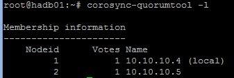
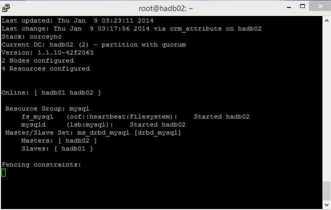

<properties
    pageTitle="MySQL mit Lastenausgleich clusterize | Microsoft Azure"
    description="Lastenausgleich, hohen Verfügbarkeit einen Linux MySQL Cluster mit dem Bereitstellungsmodell klassischen auf Azure erstellt die Einrichtung"
    services="virtual-machines-linux"
    documentationCenter=""
    authors="bureado"
    manager="timlt"
    editor=""
    tags="azure-service-management"/>

<tags
    ms.service="virtual-machines-linux"
    ms.workload="infrastructure-services"
    ms.tgt_pltfrm="vm-linux"
    ms.devlang="na"
    ms.topic="article"
    ms.date="04/14/2015"
    ms.author="jparrel"/>

# Verwenden Datensätze mit Lastenausgleich zum MySQL unter Linux clusterize

[AZURE.INCLUDE [learn-about-deployment-models](../../includes/learn-about-deployment-models-classic-include.md)]

In diesem Artikel dient zu durchsuchen und veranschaulichen die unterschiedlichen Ansätze hoch verfügbare Dienste, die auf Microsoft Azure untersuchen MySQL-Server hohen Verfügbarkeit als Einstieg in die Linux-basierten bereitstellen zur Verfügung. Ein Video veranschaulichen dieser Ansatz ist auf [Channel 9](http://channel9.msdn.com/Blogs/Open/Load-balancing-highly-available-Linux-services-on-Windows-Azure-OpenLDAP-and-MySQL)verfügbar.

Wir Gliedern freigegeben nichts zwei Knoten Single-Master MySQL hohen Verfügbarkeit Lösung basierend auf DRBD, Corosync und Schrittmacher. Nur einem Knoten MySQL nacheinander ausgeführt wird. Lesen und Schreiben aus der DRBD Ressource ist auch nacheinander auf nur einen Knoten beschränkt.

Es gibt keine Notwendigkeit einer VIP-Lösung wie LVS da wir des Microsoft Azure verteilt legt fest, verwenden um die Funktion RUNDEN Robert Funktionalität und den Endpunkt Erkennung, freistellen und sichere Wiederherstellung der VIP-Adresse zu ermöglichen. Die VIP ist eine Global geroutet IPv4-Adresse von Microsoft Azure zugewiesen werden, wenn wir Cloud-Dienst zum ersten Mal erstellen.

Andere möglichen Architekturen für MySQL einschließlich am nächsten Arbeitstag Cluster, Percona und Galera sowie mehrere Middleware Lösungen, einschließlich mindestens eine sind als ein virtueller Computer auf [Virtuellen Computer im Lager](http://vmdepot.msopentech.com)verfügbar. Solange diese Lösungen auf bestimmte im Vergleich zu Multicast- oder übertragen repliziert können und nicht auf freigegebenen Speicher oder mehrere Netzwerkschnittstellen aufsetzen, sollten die Szenarien einfach auf Microsoft Azure bereitgestellt werden können.

Natürlich können diese Cluster Architekturen auf andere Produkte wie PostgreSQL und OpenLDAP auf ähnliche Weise erweitert werden. Beispielsweise dieser Prozedur ein Lastenausgleich mit freigegebenen nichts für mehrere Master OpenLDAP erfolgreich getesteten, und Sie können auf unserem Blog Channel 9 anschauen.

## Vorbereitung

Benötigen Sie ein Microsoft Azure-Konto mit einem gültigen Abonnement können zum Erstellen von virtuellen Computern mindestens zwei (2) (x wurde in diesem Beispiel verwendet), einem Netzwerk und einem Subnetz, einer Gruppe Zugehörigkeit und eine Verfügbarkeit festlegen möchten, sowie die Möglichkeit, neue virtuelle Festplatten in derselben Region als Cloud-Dienst erstellen und diese mit den Linux virtuellen Computern anfügen.

### Getesteten Umgebung

- Ubuntu 13.10
  - DRBD
  - MySQL-Server
  - Corosync und Schrittmacher

### Zugehörigkeit Gruppe

Eine Gruppe Zugehörigkeit für die Lösung erstellte Anmelden bei der Azure klassischen Portal Durchführen eines Bildlaufs nach unten zu Einstellungen, und Erstellen einer neuen Gruppe für die Zugehörigkeit. Zugeordnete Ressourcen, die später erstellt, werden dieser Gruppe Zugehörigkeit zugewiesen.

### Netzwerke

Ein neues Netzwerk wird erstellt, und ein Subnetz innerhalb des Netzwerks erstellt wird. Wir haben ein 10.10.10.0/24 Netzwerk mit nur einem /24 Subnetz innerhalb entschieden.

### Virtuellen Computern

Ist der erste Ubuntu 13.10 virtueller Computer mithilfe eines Bilds Endorsed Ubuntu Katalog erstellt und aufgerufen `hadb01`. Ein neuen Clouddienst wird im Prozess, aufgerufen Hadb erstellt. Wir nennen sie auf diese Weise die freigegebene, Lastenausgleich Art zu veranschaulichen, die der Dienst Wenn wir weitere Ressourcen hinzufügen. Die Erstellung von `hadb01` ergebnislosen und Verwenden des Portals abgeschlossen ist. Ein Endpunkt für SSH wird automatisch erstellt, und unsere erstellte Netzwerk aktiviert ist. Wir wählen Sie zum Erstellen einer neuen Verfügbarkeit für die virtuellen Computern festlegen.

Nachdem Sie der erste virtuellen Computer erstellt wird (technisch, Cloud-Dienst erstellt wurde) wir fahren Sie mit den zweiten virtuellen Computer erstellen `hadb02`. Für den zweiten virtuellen Computer verwenden wir auch Ubuntu 13.10 virtuellen Computer aus dem Katalog mit dem Portal, aber wir werden mit einem vorhandenen Clouddienst auswählen `hadb.cloudapp.net`, statt eine neue zu erstellen. Der Satz von Netzwerk- und Verfügbarkeit sollte automatisch für uns ausgewählt werden. Auch wird ein Endpunkt SSH erstellt.

Nachdem Sie beide virtuellen Computern erstellt wurden, dauert wir Notieren Sie sich den Port SSH für `hadb01` (TCP 22) und `hadb02` (automatisch nach Azure zugeordneten)

### Angefügte Speicher

Wir fügen Sie einen neuen Datenträger an beiden virtuellen Computern, und erstellen neue 5 GB Festplatten im Prozess. Der Datenträger werden im Container virtuelle Festplatte verwendet für unsere Datenträger Hauptfenster Betriebssystem gehostet werden. Nachdem Laufwerke erstellt und angefügt werden ist es nicht erforderlich uns Linux neu zu starten, während der Kernel das neue Gerät angezeigt wird (normalerweise `/dev/sdc`, können Sie überprüfen `dmesg` für die Ausgabe)

Jedes virtuellen Computers fortsetzen des Vorgangs zum Erstellen eines neuen Partition mithilfe `cfdisk` (primär-, Linux Partition), und Schreiben Sie die neuen Partitionstabelle. **Erstellen Sie ein Dateisystem auf dieser Partition nicht** .

## Einrichten des Clusters

In den beiden Ubuntu virtuellen Computern müssen wir APT verwenden, um Corosync, Schrittmacher und DRBD zu installieren. Verwenden von `apt-get`:

    sudo apt-get install corosync pacemaker drbd8-utils.

**Installieren Sie MySQL zurzeit nicht** . Debian und Skripts Ubuntu-Installation werden ein MySQL-Datenverzeichnis auf Initialisierung `/var/lib/mysql`, aber da Verzeichnis in einem Dateisystem DRBD außer Kraft gesetzt werden, müssen wir dies später durchführen.

An diesem Punkt sollte wir auch überprüfen (mit `/sbin/ifconfig`), dass Adressen im Subnetz 10.10.10.0/24 und, dass diese miteinander nach Namen erreichen können beide virtuellen Computern verwenden. Bei Bedarf können Sie auch `ssh-keygen` und `ssh-copy-id` um sicherzustellen, dass beide virtuellen Computern über SSH kommunizieren können, ohne dass ein Kennwort.

### Einrichten von DRBD

Erstellen wir eine DRBD Ressource, die die zugrunde liegende verwendet `/dev/sdc1` Partition zu einer `/dev/drbd1` Ressource sein können mit ext3 formatiert und in der primären und sekundären Knoten verwendet werden. Öffnen Sie hierzu `/etc/drbd.d/r0.res` , und kopieren Sie die folgenden Ressourcendefinition. Müssen Sie diese Schritte beide virtuellen Computern:

    resource r0 {
      on `hadb01` {
        device  /dev/drbd1;
        disk   /dev/sdc1;
        address  10.10.10.4:7789;
        meta-disk internal;
      }
      on `hadb02` {
        device  /dev/drbd1;
        disk   /dev/sdc1;
        address  10.10.10.5:7789;
        meta-disk internal;
      }
    }

Nachdem Sie auf diese Weise Initialisierung der Ressource mit `drbdadm` in beiden virtuellen Computern:

    sudo drbdadm -c /etc/drbd.conf role r0
    sudo drbdadm up r0

Und schließlich auf dem primären (`hadb01`) Besitz (primär) der Ressource DRBD zu erzwingen:

    sudo drbdadm primary --force r0

Wenn Sie den Inhalt der/Prozedur/Drbd untersuchen (`sudo cat /proc/drbd`) auf beide virtuellen Computern, auftreten `Primary/Secondary` auf `hadb01` und `Secondary/Primary` auf `hadb02`, mit der Lösung zu diesem Zeitpunkt konsistent. Der Datenträger 5 GB wird über das Netzwerk 10.10.10.0/24 kostenlos für Kunden synchronisiert werden.

Nachdem der Datenträger synchronisiert ist erstellen Sie das Dateisystem auf `hadb01`. Zu Testzwecken wir ext2 verwendet, aber folgendermaßen vor: erstellt eine ext3-Dateisystem:

    mkfs.ext3 /dev/drbd1

### Bereitstellen der Ressource DRBD

Klicken Sie auf `hadb01` nun die DRBD Ressourcen bereitstellen können. Verwenden Sie Debian und abgeleiteten `/var/lib/mysql` als MySQLs-Datenverzeichnis. Da wir MySQL installiert haben, wir Verzeichnis erstellen und Bereitstellen die Ressource DRBD. On `hadb01`:

    sudo mkdir /var/lib/mysql
    sudo mount /dev/drbd1 /var/lib/mysql

## Einrichten von MySQL

Nachdem Sie jetzt auf MySQL installiert sind `hadb01`:

    sudo apt-get install mysql-server

Für `hadb02`, stehen Ihnen zwei Optionen zur Verfügung. Sie können nun Mysql-Server installieren, welche wird /var/lib/mysql erstellen und füllen Sie es mit einer neuen Datenverzeichnis und passen Sie dann den Inhalt zu entfernen. On `hadb02`:

    sudo apt-get install mysql-server
    sudo service mysql stop
    sudo rm –rf /var/lib/mysql/*

Die zweite Option besteht darin, Failover auf `hadb02` und installieren Sie es Mysql-Server (Installationsskripts sehen die vorhandene Installation und wird nicht berühren sie)

On `hadb01`:

    sudo drbdadm secondary –force r0

On `hadb02`:

    sudo drbdadm primary –force r0
    sudo apt-get install mysql-server

Wenn Sie Failover DRBD jetzt möchten nicht, wenn ist die erste Option zwar wohl weniger elegante einfacher. Nachdem Sie dies einrichten, können Sie beginnen, auf Ihre MySQL-Datenbank arbeiten. Klicken Sie auf `hadb02` (oder an einer der Server aktiv ist, entsprechend der DRBD):

    mysql –u root –p
    CREATE DATABASE azureha;
    CREATE TABLE things ( id SERIAL, name VARCHAR(255) );
    INSERT INTO things VALUES (1, "Yet another entity");
    GRANT ALL ON things.\* TO root;

**Warnung**: Diese letzte Anweisung deaktiviert effektiv Authentifizierung für den Stammbenutzer in dieser Tabelle. Dies sollte nach der Herstellung-Notendurchschnitt ersetzt werden Anweisungen erteilen und nur zum besseren enthalten ist.

Sie müssen außerdem networking für MySQL Wenn möchten Sie Abfragen von außerhalb der virtuellen Computern, die mit diesem Leitfaden dient aktivieren. Öffnen Sie auf beide virtuellen Computern, `/etc/mysql/my.cnf` und navigieren Sie zu `bind-address`, Ändern von 127.0.0.1 auf 0.0.0.0. Nach dem Speichern der Datei, Emission einer `sudo service mysql restart` auf Ihrer aktuellen primären.

### Erstellen die MySQL-laden verteilt festlegen

Wir kehren Sie zu dem Portal und navigieren Sie zu der `hadb01` virtuellen Computer, und klicken Sie dann auf Endpunkte. Wir werden erstellen Sie einen neuen Endpunkt, und wählen aus dem Dropdownmenü und Teilstriche im Dialogfeld *erstellen neue Lastenausgleich festlegen* MySQL (TCP 3306). Wir unseren Endpunkt Lastenausgleich ruft `lb-mysql`. Wir werden die meisten Optionen eine Ausnahme bilden jedoch Zeit alleine beibehalten werden, wir auf 5 (Sekunden, minimale) reduziert werden

Nach der Erstellung des Endpunkts wir wechseln Sie zu `hadb02`, Endpunkte, und erstellen Sie einen neuen Endpunkt aber wählen wir `lb-mysql`, wählen Sie dann im Dropdownmenü MySQL. Sie können auch die Azure CLI für diesen Schritt.

Zu diesem Zeitpunkt haben wir alles, was wir für einen manuellen Cluster-Vorgang benötigen.

### Testen die Last verteilt festlegen

Tests aus einer externen Computer ausgeführt werden können, die mit einem beliebigen MySQL-Client sowie Applikationen (z. B. PhpMyAdmin als eine Website Azure ausgeführt) In diesem Fall verwendet wir MySQL Befehl Zeichentool auf einen anderen Linux:

    mysql azureha –u root –h hadb.cloudapp.net –e "select * from things;"

### Weiß nicht manuell über

Sie können Failovers jetzt simulieren, indem Sie MySQL beendet, umsteigen DRBDs primären und MySQL erneut zu starten.

Klicken Sie auf hadb01:

    service mysql stop && umount /var/lib/mysql ; drbdadm secondary r0

Klicken Sie dann auf hadb02:

    drbdadm primary r0 ; mount /dev/drbd1 /var/lib/mysql && service mysql start

Nachdem Sie Failover, können Sie manuell wiederholen sollte der remote Abfrage- und es völlig arbeiten.

## Einrichten von Corosync

Corosync ist die zugrunde liegende Cluster Infrastruktur für Schrittmacher entwickelt erforderlich ist. Für Heartbeat Version 1 und 2 Benutzer (und andere Methoden wie Ultramonkey) Corosync ist einer Teilung CRM-Funktionen, während Schrittmacher in Funktionen eher Traffic verbleibt.

Die wichtigste Einschränkung für Corosync für Azure ist, dass Corosync Multicast über übertragen, über bestimmte Kommunikation zieht, aber Microsoft Azure Netzwerke nur bestimmte unterstützt.

Glücklicherweise Corosync hat einen bestimmte-Modus arbeiten und die einzige Beschränkung besteht darin, dass, da alle Knoten nicht untereinander *darin*kommunizieren, Sie die Knoten in Konfigurationsdateien, einschließlich ihre IP-Adressen definieren müssen. Wir können die Beispieldateien Corosync für bestimmte und ändern Sie nur Adresse, Knotenlisten und Protokollierung Directory binden (Ubuntu verwendet `/var/log/corosync` während im Beispiel verwenden Dateien `/var/log/cluster`) und Quorum Tools aktivieren.

**Hinweis der `transport: udpu` Richtlinie unten und den manuell festgelegten IP-Adressen für die Knoten**.

Klicken Sie auf `/etc/corosync/corosync.conf` für beide Knoten:

    totem {
      version: 2
      crypto_cipher: none
      crypto_hash: none
      interface {
        ringnumber: 0
        bindnetaddr: 10.10.10.0
        mcastport: 5405
        ttl: 1
      }
      transport: udpu
    }

    logging {
      fileline: off
      to_logfile: yes
      to_syslog: yes
      logfile: /var/log/corosync/corosync.log
      debug: off
      timestamp: on
      logger_subsys {
        subsys: QUORUM
        debug: off
        }
      }

    nodelist {
      node {
        ring0_addr: 10.10.10.4
        nodeid: 1
      }

      node {
        ring0_addr: 10.10.10.5
        nodeid: 2
      }
    }

    quorum {
      provider: corosync_votequorum
    }

Wir kopieren Sie diese Konfigurationsdatei in beide virtuellen Computern und Corosync in beiden Knoten starten:

    sudo service start corosync

In Kürze nach dem Starten des Diensts Cluster im aktuellen Ring hergestellt werden sollte und Quorum bildeten werden sollte. Wir können dieses Feature überprüfen, indem Sie die Protokolle überprüfen oder:

    sudo corosync-quorumtool –l

Führen Sie eine Ausgabe ähnlich wie im Bild unten sollten:

## Einrichten von Schrittmacher

Schrittmacher wird für Ressourcen überwachen, definieren, wenn Primärfarben wechseln nach unten, und wechseln Sie diese Ressourcen zur sekundäre Cluster verwendet. Ressourcen können in einem Satz von verfügbaren Skripts oder LSB (wie gestalteten Initialisierung) Skripts, zwischen den anderen Optionen definiert werden.

Wir wollen Schrittmacher zu "DRBD Ressource, die Mountpoint und MySQL-Dienst Besitzer". Wenn Schrittmacher aktiviert und deaktiviert DRBD aktivieren kann, stellen Sie es / Umount erkannt und Start/Stopp MySQL in der richtigen Reihenfolge defekter eines Beitrags geschieht mit dem primären, unsere Setup abgeschlossen ist.

Bei der Installation von Schrittmacher sollten Ihre Konfiguration einfach, z. B. wie:

    node $id="1" hadb01
      attributes standby="off"
    node $id="2" hadb02
      attributes standby="off"

Überprüfen sie durch Ausführen `sudo crm configure show`. Erstellen Sie nun eine Datei (z. B. `/tmp/cluster.conf`) mit den folgenden Ressourcen:

    primitive drbd_mysql ocf:linbit:drbd \
          params drbd_resource="r0" \
          op monitor interval="29s" role="Master" \
          op monitor interval="31s" role="Slave"

    ms ms_drbd_mysql drbd_mysql \
          meta master-max="1" master-node-max="1" \
            clone-max="2" clone-node-max="1" \
            notify="true"

    primitive fs_mysql ocf:heartbeat:Filesystem \
          params device="/dev/drbd/by-res/r0" \
          directory="/var/lib/mysql" fstype="ext3"

    primitive mysqld lsb:mysql

    group mysql fs_mysql mysqld

    colocation mysql_on_drbd \
           inf: mysql ms_drbd_mysql:Master

    order mysql_after_drbd \
           inf: ms_drbd_mysql:promote mysql:start

    property stonith-enabled=false

    property no-quorum-policy=ignore

Und Laden Sie es jetzt in der Konfiguration (Sie müssen nur Aktion in einem Knoten):

    sudo crm configure
      load update /tmp/cluster.conf
      commit
      exit

Stellen Sie außerdem sicher, dass Schrittmacher Systemstart in beiden Knoten startet:

    sudo update-rc.d pacemaker defaults

Nach ein paar Sekunden und Verwenden von `sudo crm_mon –L`, stellen Sie sicher, dass eine von der Knoten das Master-Shape für den Cluster geworden und alle Ressourcen ausgeführt wird. Sie können bereitstellen und Ps zu um überprüfen, ob die Ressourcen ausgeführt werden.

Das folgende Bildschirmabbild zeigt `crm_mon` mit einem Knoten beendet (Beenden mit STRG + C)

Und diese Abbildung zeigt die beiden Knoten mit einem Master und eine untergeordnete:

## Testen

Wir haben für eine automatische Failover Simulation bereit. Es gibt zwei Möglichkeiten, diese Vorgehensweise: weiche und fortfahren. Das Weiche Verfahren ist die Cluster war(en)-Funktion verwenden: ``crm_standby -U `uname -n` -v on``. Verwenden diese auf das Master-Shape aus, übernimmt die untergeordnete. Denken Sie daran, wieder auf off gesetzt (Crm_mon informiert Sie einem Knoten sind anderweitig auf Standby)

Die Festplatte ist Weise die primäre virtueller Computer (hadb01) über das Portal beendet oder Ändern der Runlevel des virtuellen Computers (d. h., Halt, war(en)) aus, und klicken Sie dann wir Corosync und Schrittmacher helfen, indem Signalton des Master-Shapes übergeht nach unten. Wir können dies testen (nützlich für Windows Wartung) aber wir können auch das Szenario erzwingen, indem Sie einfach den virtuellen Computer fixieren.

## STONITH

Es sollte eine war(en) virtueller Computer über die CLI Azure anstelle eines Skripts STONITH ausgeben, die ein physisches Gerät steuert möglich sein. Sie können `/usr/lib/stonith/plugins/external/ssh` als Basis und aktivieren STONITH in die Cluster Konfiguration. Azure CLI Global installiert werden soll, und das Veröffentlichen Einstellungen/Profil für die Cluster Benutzer geladen werden sollen.

Beispiel-Code für die Ressource auf [GitHub](https://github.com/bureado/aztonith)zur Verfügung. Sie müssen die Cluster Konfiguration zu ändern, indem Sie mit den folgenden `sudo crm configure`:

    primitive st-azure stonith:external/azure \
      params hostlist="hadb01 hadb02" \
      clone fencing st-azure \
      property stonith-enabled=true \
      commit

**Hinweis:** das Skript nicht nach oben/unten Prüfungen ausführen. Die ursprüngliche SSH Ressource hatte 15 Ping überprüft, jedoch Wiederherstellungszeit für eine Azure-virtuellen Computer möglicherweise weitere Variable.

## Einschränkungen

Die folgenden Einschränkungen Ursachen zurückzuführen:

- Das Skript Linbit DRBD Ressourcen, die als Ressource in Schrittmacher verwendet DRBD verwaltet werden `drbdadm down` Wenn ab einem Knoten deaktiviert, auch wenn Sie nur der Knoten standby vertraut ist. Dies ist nicht ideal, da die untergeordnete nicht die Ressource DRBD synchronisiert werden wird, während das Master-Shape schreibt erhält. Wenn Sie das Master-Shape nicht ///graciously fehlschlägt, kann die untergeordnete über eine ältere Dateisystem Zustand dauern. Es gibt zwei mögliche zum Lösen folgt ein:
  - Erzwingen eines `drbdadm up r0` in allen Clusterknoten über lokale (nicht clusterized) Watchdog, oder,
  - Bearbeiten der Linbit DRBD Skripts dafür sorgen, dass `down` nicht aufgerufen wird, in `/usr/lib/ocf/resource.d/linbit/drbd`.
- Lastenausgleich benötigt mindestens 5 Sekunden reagieren, damit Applikationen werden weitere Vergleich von Timeout und Cluster konzipiert werden; andere Architekturen kann auch helfen, beispielsweise in app Warteschlangen, Abfrage Middlewares usw..
- Optimieren von MySQL ist dafür zu sorgen, Schreiben einer strömten Tempo abgeschlossen ist und Caches wie möglich um Verluste Arbeitsspeicher minimieren häufig Datenträger geleert werden
- Schreiben Leistung werden abhängige virtuellen Computer Verbindung virtuelle wechseln, wie dies von DRBD verwendet, um das Gerät repliziert wird
