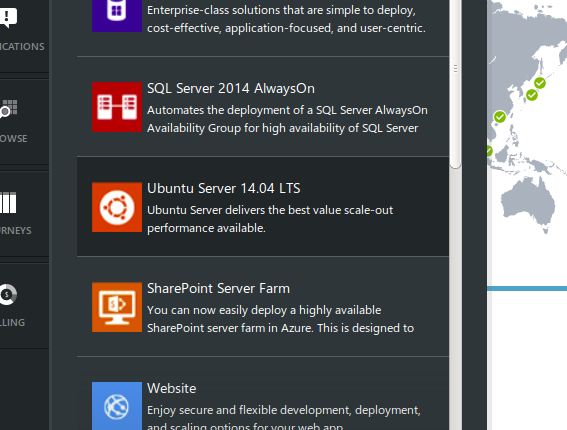
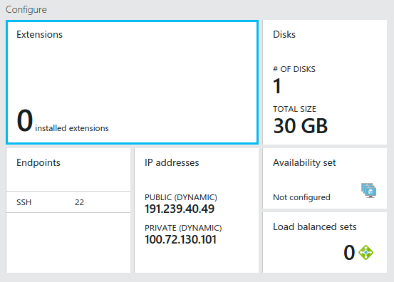
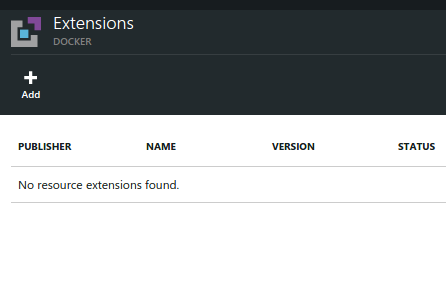
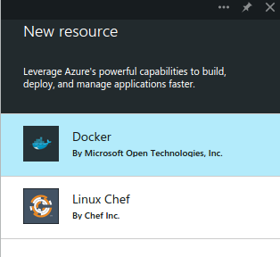
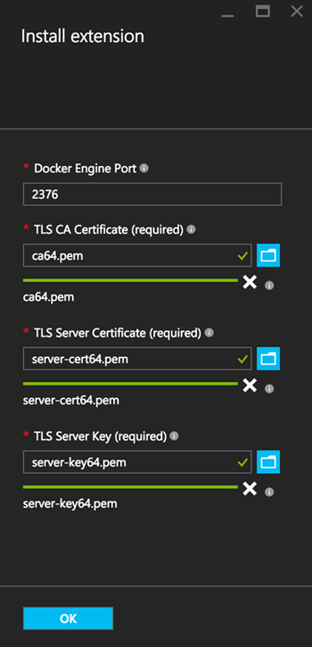
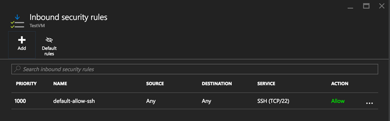
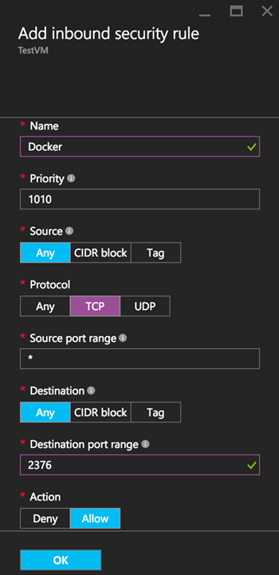

<properties
    pageTitle="Mit Docker virtueller Computer Erweiterung für Linux | Microsoft Azure"
    description="Beschreibt Docker und die Erweiterungen Azure-virtuellen Computern und Azure-virtuellen Computern erstellen, die mithilfe der Azure CLI im Modell zur klassischen Bereitstellung von Docker Hosts sind."
    services="virtual-machines-linux"
    documentationCenter=""
    authors="squillace"
    manager="timlt"
    editor="tysonn"
    tags="azure-service-management"/>

<tags
    ms.service="virtual-machines-linux"
    ms.devlang="multiple"
    ms.topic="article"
    ms.tgt_pltfrm="vm-linux"
    ms.workload="infrastructure-services"
    ms.date="05/27/2016"
    ms.author="rasquill"/>


# <a name="using-the-docker-vm-extension-with-the-azure-classic-portal"></a>Die Erweiterung Docker virtueller Computer verwenden mit dem Azure klassischen portal

[AZURE.INCLUDE [learn-about-deployment-models](../../includes/learn-about-deployment-models-classic-include.md)]


[Docker](https://www.docker.com/) ist eine der am häufigsten verwendeten Virtualisierung Vorgehensweisen, die als eine Möglichkeit zum Isolieren von Daten, und klicken Sie auf freigegebene Ressourcen computing [Linux Container](http://en.wikipedia.org/wiki/LXC) anstelle von virtuellen Computern verwendet. Die Docker virtueller Computer Erweiterung von [Azure Linux Agent] verwaltet werden können eines Docker virtuellen Computers zu erstellen, die eine beliebige Anzahl von Containern für die Anwendung auf Azure hostet.

> [AZURE.NOTE] In diesem Thema beschreibt das Erstellen eines Docker virtuellen Computers vom klassischen Azure-Portal an. So erstellen Sie einen virtuellen Docker in der Befehlszeile finden Sie unter [Verwendung der Docker virtueller Computer Erweiterung aus dem Azure Line Interface (CLI Azure)]. Eine allgemeine Erläuterung von Containern und deren Vorteile finden Sie unter dem [Docker hoher Ebene Whiteboard](http://channel9.msdn.com/Blogs/Regular-IT-Guy/Docker-High-Level-Whiteboard).

## <a name="create-a-new-vm-from-the-image-gallery"></a>Erstellen eines neuen virtuellen Computers aus der Bildergalerie
Der erste Schritt besteht eine Azure-virtuellen Computer aus einem Linux Bild, die die Erweiterung Docker virtueller Computer, verwenden ein Bild Ubuntu 14.04 LTS aus der Bildergalerie als ein Beispiel Serverabbild und Ubuntu 14.04 Desktop als Client unterstützt. Klicken Sie im Portal auf **+ neue** in der unteren linken Ecke, erstellen eine neue Instanz von virtuellen Computer, und wählen Sie ein Bild Ubuntu 14.04 LTS aus den verfügbaren Auswahlmöglichkeiten oder aus der Bildergalerie abgeschlossen, wie unten dargestellt.

> [AZURE.NOTE] Derzeit unterstützt nur Ubuntu 14.04 LTS Bilder aktueller als Juli 2014 die Erweiterung Docker virtueller Computer an.



## <a name="create-docker-certificates"></a>Erstellen von Docker Zertifikate

Nachdem Sie der virtuellen Computer erstellt wurde, stellen Sie sicher, dass Docker auf dem Clientcomputer installiert ist. (Details finden Sie [Informationen zur Installation von Docker](https://docs.docker.com/installation/#installation).)

Erstellen Sie die Dateien Zertifikat und Schlüssel für die Kommunikation von Docker gemäß [Docker mit Https ausgeführt] , und fügen Sie sie in der **`~/.docker`** Verzeichnis auf dem Clientcomputer.

> [AZURE.NOTE] Die Erweiterung Docker virtueller Computer im Portal benötigt gegenwärtig Anmeldeinformationen, die base64-codierte sind.

Verwenden Sie in der Befehlszeile **`base64`** oder einem anderen bevorzugten Codierung Tool zum Erstellen von base64-codierte Themen. Mit einem einfachen Satz von Dateien mit Zertifikat und Schlüssel Hiermit kann wie folgt aussehen:

```
 ~/.docker$ ls
 ca-key.pem  ca.pem  cert.pem  key.pem  server-cert.pem  server-key.pem
 ~/.docker$ base64 ca.pem > ca64.pem
 ~/.docker$ base64 server-cert.pem > server-cert64.pem
 ~/.docker$ base64 server-key.pem > server-key64.pem
 ~/.docker$ ls
 ca64.pem    ca.pem    key.pem            server-cert.pem   server-key.pem
 ca-key.pem  cert.pem  server-cert64.pem  server-key64.pem
```

## <a name="add-the-docker-vm-extension"></a>Fügen Sie die Erweiterung Docker virtueller Computer
Um die Erweiterung Docker virtueller Computer hinzuzufügen, suchen Sie die Instanz virtueller Computer, die Sie erstellt haben, und führen Sie einen Bildlauf nach unten bis zum **Erweiterungen** und klicken Sie darauf, um virtuellen Computer-Erweiterungen anzuzeigen, wie unten dargestellt.
> [AZURE.NOTE] Dieses Feature ist nur im Vorschau-Portal unterstützt: https://portal.azure.com/


### <a name="add-an-extension"></a>Hinzufügen einer Erweiterung
Klicken Sie auf das **+ Hinzufügen** um die möglichen virtueller Computer Erweiterungen anzuzeigen, können Sie mit diesem virtuellen Computer hinzufügen.


### <a name="select-the-docker-vm-extension"></a>Wählen Sie die Erweiterung Docker virtueller Computer
Wählen Sie die Docker-Erweiterung virtueller Computer, von der Docker Beschreibung und wichtige Links, damit die Teilnehmer, und klicken Sie dann auf **Erstellen** unten, um den Installationsvorgang zu beginnen.




### <a name="add-your-certificate-and-key-files"></a>Fügen Sie das Zertifikat und den wichtigsten Dateien hinzu:

Geben Sie in die Felder die base64-codierte Versionen von Ihrer CA Zertifikat, das Serverzertifikat und den Key Server wie in der folgenden Abbildung gezeigt.



> [AZURE.NOTE] Beachten Sie, dass (wie in der vorherigen Abbildung) die 2376 standardmäßig ausgefüllt wird. Sie können alle Endpunkt hier eingeben, aber gemeldet werden, um den entsprechenden Endpunkt zu öffnen. Wenn Sie die Standardeinstellung geändert haben, stellen Sie sicher, um den entsprechenden Endpunkt im nächsten Schritt zu öffnen.

## <a name="add-the-docker-communication-endpoint"></a>Fügen Sie der Docker Kommunikationsendpunkt hinzu
Wenn die Ressourcengruppe anzeigen, die Sie erstellt haben, wählen Sie aus der Netzwerk-Sicherheitsgruppe mit Ihrer virtuellen Computer verknüpft ist, und klicken Sie auf **Eingehende Sicherheitsregeln** , um die Regeln anzuzeigen, wie hier dargestellt.



Klicken Sie auf **+ Add** um eine weitere Regel hinzuzufügen, und der standardmäßigen Groß-/Kleinschreibung, geben Sie einen Namen für den Endpunkt (in diesem Beispiel **Docker**) und 2376 'Port Zielbereich'. Legen Sie den Protokollwert für mit **TCP**, und klicken Sie auf **OK** , um die Regel zu erstellen.




## <a name="test-your-docker-client-and-azure-docker-host"></a>Testen Sie Ihre Docker Client und Azure Docker Host
Suchen und kopieren Sie den Namen Ihrer virtuellen Computers Domäne, und klicken Sie in der Befehlszeile des Computers Client Typ `docker --tls -H tcp://` *Dockerextension* `.cloudapp.net:2376 info` (wobei *Dockerextension* ersetzt wird durch die Unterdomäne für Ihre virtuellen Computer).

Das Ergebnis sollte etwa wie folgt aussehen:

```
$ docker --tls -H tcp://dockerextension.cloudapp.net:2376 info
Containers: 0
Images: 0
Storage Driver: devicemapper
 Pool Name: docker-8:1-131214-pool
 Pool Blocksize: 65.54 kB
 Data file: /var/lib/docker/devicemapper/devicemapper/data
 Metadata file: /var/lib/docker/devicemapper/devicemapper/metadata
 Data Space Used: 305.7 MB
 Data Space Total: 107.4 GB
 Metadata Space Used: 729.1 kB
 Metadata Space Total: 2.147 GB
 Library Version: 1.02.82-git (2013-10-04)
Execution Driver: native-0.2
Kernel Version: 3.13.0-36-generic
WARNING: No swap limit support
```

Nachdem Sie die obigen Schritte abgeschlossen haben, haben Sie jetzt einen voll funktionsfähigen Docker Host Ausführen einer Azure virtuellen Computers, die so konfiguriert, dass mit Remote von anderen Clients verbunden sein.

<!--Every topic should have next steps and links to the next logical set of content to keep the customer engaged-->
## <a name="next-steps"></a>Nächste Schritte

Sie sind bereit sind, wechseln Sie zu der [Docker Benutzerhandbuch] und Ihre Docker virtuellen Computer verwenden. Wenn Sie erstellen Docker Hosts auf Azure-virtuellen Computern über Befehl Linie Schnittstelle automatisieren möchten, finden Sie unter [Verwendung der Docker virtueller Computer Erweiterung aus dem Azure Line Interface (CLI Azure)]

<!--Anchors-->
[Create a new VM from the Image Gallery]: #createvm
[Create Docker Certificates]: #dockercerts
[Add the Docker VM Extension]: #adddockerextension
[Test Docker Client and Azure Docker Host]: #testclientandserver
[Next steps]: #next-steps

<!--Image references-->
[StartingPoint]: ./media/StartingPoint.png
[StartingPoint]: ./media/StartingPoint.png
[StartingPoint]: ./media/StartingPoint.png
[StartingPoint]: ./media/StartingPoint.png
[StartingPoint]: ./media/StartingPoint.png
[StartingPoint]: ./media/StartingPoint.png
[StartingPoint]: ./media/StartingPoint.png
[StartingPoint]: ./media/StartingPoint.png
[6]: ./media/markdown-template-for-new-articles/pretty49.png
[7]: ./media/markdown-template-for-new-articles/channel-9.png


<!--Link references-->
[So verwenden Sie die Docker virtueller Computer Erweiterung aus dem Azure Line Interface (CLI Azure)]: http://azure.microsoft.com/documentation/articles/virtual-machines-docker-with-xplat-cli/
[Azure Linux-Agent]: virtual-machines-linux-agent-user-guide.md
[Link 3 to another azure.microsoft.com documentation topic]: ../storage-whatis-account.md

[Ausführen von Docker mit https]: http://docs.docker.com/articles/https/
[Docker-Benutzerhandbuch]: https://docs.docker.com/userguide/
