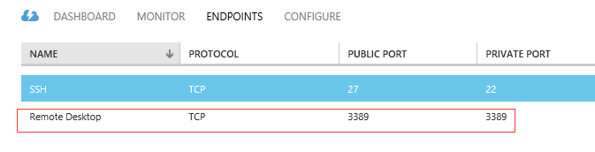
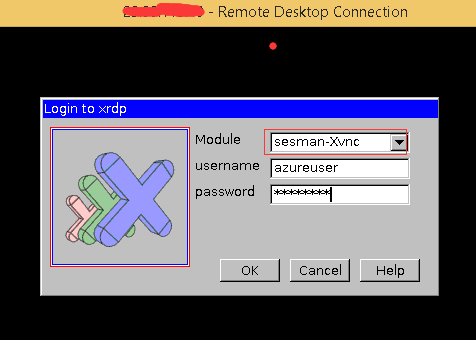

<properties
    pageTitle="Remote Desktop, um einen virtuellen Linux Computer | Microsoft Azure"
    description="Informationen Sie zum Installieren und Konfigurieren von Remote Desktop, um die Verbindung eines Microsoft Azure Linux virtuellen Computers"
    services="virtual-machines-linux"
    documentationCenter=""
    authors="SuperScottz"
    manager="timlt"
    editor=""
    tags="azure-service-management"/>

<tags
    ms.service="virtual-machines-linux"
    ms.workload="infrastructure-services"
    ms.tgt_pltfrm="vm-linux"
    ms.devlang="na"
    ms.topic="article"
    ms.date="02/01/2016"
    ms.author="mingzhan"/>

#Remotedesktop verwenden Verbindung zum eines Microsoft Azure Linux virtuellen Computers

[AZURE.INCLUDE [learn-about-deployment-models](../../includes/learn-about-deployment-models-classic-include.md)]

##(Übersicht)

RDP (Remote Desktop Protocol) ist ein Protokoll für Windows verwendet. Wie können wir die RDP Remote Verbindung zu einem Linux VM (virtuellen Computern) verwenden?

Dieser Leitfaden erhalten Sie die Antwort! Hilft Ihnen, installieren und Config Xrdp Ihrer Microsoft Azure Linux virtuellen Computers, und Sie können die Verbindung mit dem Remotedesktop aus einem Windows-Computer. Wir verwenden Linux VM Ubuntu oder OpenSUSE als das Beispiel in diesem Handbuch ausführen.

Xrdp ist ein open-Source RDP Server, der Sie Ihre Linux Server Remote Desktop aus einem Windows-Computer eine Verbindung herstellen kann. Es führt besser als VNC (Virtual Network Computing). VNC weist diese Streak "JPEG" Qualität und langsam Verhalten, während RDP schnelle und klar ist.

> [AZURE.NOTE] Sie müssen bereits ein Microsoft Azure virtueller Computer mit Linux. Zum Erstellen und Einrichten einer Linux VM finden im [Lernprogramm Azure Linux virtueller Computer](virtual-machines-linux-classic-createportal.md).

##Erstellen von Endpunkt für Remotedesktop
Wir verwenden den standardmäßigen Endpunkt 3389 für Remotedesktop in diesem Dokument. Daher müssen eingerichtet werden 3389 Endpunkt als Remote Desktop, um Ihre Linux VM wie unter:

Wenn Sie wissen, wie Endpunkt an Ihre virtuellen Computer eingerichtet haben, finden Sie unter [Anleitungen](virtual-machines-linux-classic-setup-endpoints.md).

##Gnome Desktop installiert

Eine Verbindung mit Ihrem Linux VM bis kitten, und installieren `Gnome Desktop`.

Verwenden Sie für Ubuntu:

    #sudo apt-get update
    #sudo apt-get install ubuntu-desktop

Verwenden Sie für OpenSUSE:

    #sudo zypper install gnome-session

##Installieren von xrdp

Verwenden Sie für Ubuntu:

    #sudo apt-get install xrdp

Verwenden Sie für OpenSUSE:

> [AZURE.NOTE] Aktualisieren die OpenSUSE-Version mit der Version, die Sie die in unter Befehl, darunter verwenden ein Beispielbefehl für ist `OpenSUSE 13.2`.

    #sudo zypper in http://download.opensuse.org/repositories/X11:/RemoteDesktop/openSUSE_13.2/x86_64/xrdp-0.9.0git.1401423964-2.1.x86_64.rpm
    #sudo zypper install tigervnc xorg-x11-Xvnc xterm remmina-plugin-vnc

##Starten Sie Xrdp und richten Sie Xdrp-Dienst bei Boot-nach-oben

Verwenden Sie für OpenSUSE:

    #sudo systemctl start xrdp
    #sudo systemctl enable xrdp

Für Ubuntu, Xrdp wird gestartet und Eanbled bei Boot-nach-oben, nach der Installation automatisch.

##Xfce verwenden, wenn Sie später als Ubuntu 12.04LTS Ubuntu Version verwenden

Weil aktuelle Xrdp den Desktop Gnome später als Ubuntu 12.04LTS Ubuntu-Version nicht unterstützen, verwenden wir `xfce` Desktop stattdessen.

Installieren von `xfce`, verwenden:

    #sudo apt-get install xubuntu-desktop

Aktivieren Sie dann die `xfce`, verwenden:

    #echo xfce4-session >~/.xsession

Bearbeiten Sie die Datei Config `/etc/xrdp/startwm.sh`, verwenden:

    #sudo vi /etc/xrdp/startwm.sh   

Fügen Sie Zeile `xfce4-session` vor der Zeile `/etc/X11/Xsession`.

Starten Sie Xrdp-Dienst, verwenden:

    #sudo service xrdp restart

##Verbinden Sie Ihrer Linux VM aus einem Windows-Computer
In einem Windows-Computer den remote-Desktopclient beginnen, geben Sie Ihren Namen Linux virtueller Computer DNS- oder wechseln Sie zu `Dashboard` von Ihrer virtuellen Computer in Azure klassischen Portal, und klicken Sie auf `Connect` Informationen zum Verbinden Ihrer Linux VM, sehen Sie unter Anmeldefenster:

Melden Sie sich mit den `user`  &  `password` der Ihrer Linux VM und den Remote Desktop aus Ihrem Microsoft Azure Linux virtueller Computer sofort genießen!

##Weiter
Weitere Informationen zum Verwenden von Xrdp konnte finden Sie [hier](http://www.xrdp.org/).
