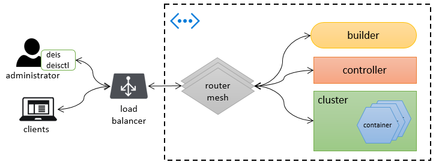
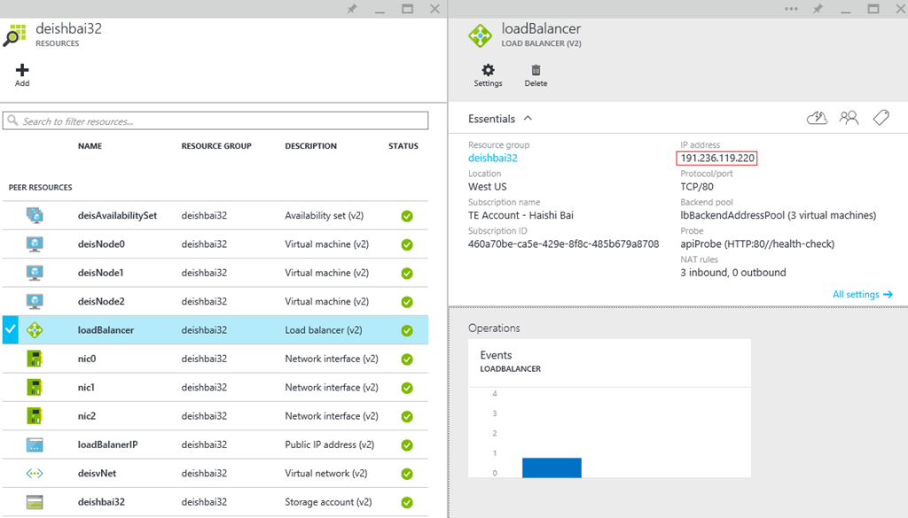
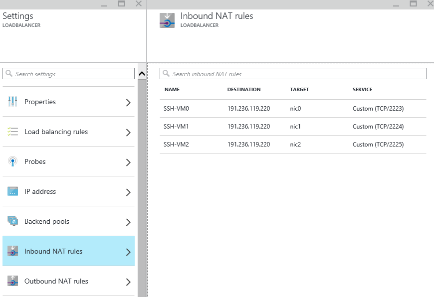
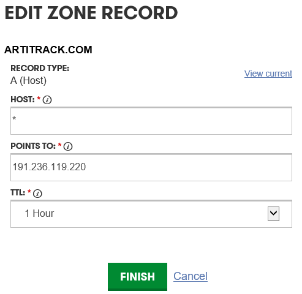
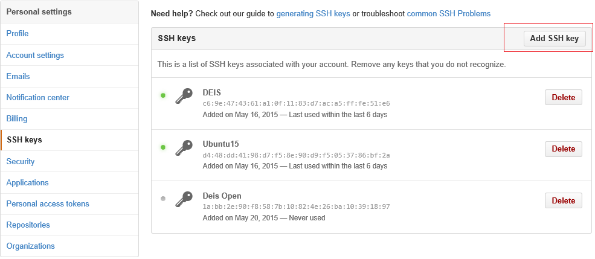

<properties
   pageTitle="Bereitstellen einen 3-Knoten Cluster Deis | Microsoft Azure"
   description="Dieser Artikel beschreibt, wie einen 3-Knoten erstellt Deis Cluster auf Azure mithilfe einer Vorlage Azure Ressourcenmanager"
   services="virtual-machines-linux"
   documentationCenter=""
   authors="HaishiBai"
   manager="timlt"
   editor=""
   tags="azure-resource-manager"/>

<tags
   ms.service="virtual-machines-linux"
   ms.devlang="multiple"
   ms.topic="article"
   ms.tgt_pltfrm="vm-linux"
   ms.workload="infrastructure-services"
   ms.date="06/24/2015"
   ms.author="hbai"/>

# Bereitstellen einen 3-Knoten Deis Cluster

Dieser Artikel führt Sie durch die Bereitstellung eines [Deis](http://deis.io/) Cluster auf Azure. Es werden alle erforderlichen Schritte aus, erstellen die erforderlichen Zertifikate zum Bereitstellen und dieselbe Skalierung einer Stichprobe **wechseln** Anwendungs auf dem Cluster neu eingerichtete behandelt.

Das folgende Diagramm zeigt die Architektur des bereitgestellte System. Ein Systemadministrator verwaltet die Cluster mithilfe von Tools wie **deis** und **Deisctl**Deis. Verbindungen werden durch eine Azure Lastenausgleich, hergestellt, die Verbindungen das Mitglied aus einem Knoten im Cluster weiterleitet. Clients Zugriff bereitgestellt Applikationen über den Lastenausgleich ebenfalls an. In diesem Fall Lastenausgleich leitet den Datenverkehr an einem Deis Router-Netz, die Datenverkehr in die entsprechenden Docker Container gehostet werden, auf dem Cluster weiteren routs.

  

Um die folgenden Schritte ausführen zu können, müssen Sie:

 * Ein aktives Azure-Abonnement. Wenn Sie eine besitzen, können Sie eine kostenlose Spur [azure.com](https://azure.microsoft.com/)können.
 * Eine geschäftlichen oder schulnotizbücher Id Azure Ressourcengruppen verwenden. Wenn Sie ein persönliches Konto, und melden Sie sich mit einem Microsoft-Id haben, müssen Sie [eine Id Arbeit aus Ihrer persönlichen erstellen](virtual-machines-windows-create-aad-work-id.md).
 * Entweder – je nach Clientbetriebssystem – die [Azure PowerShell](../powershell-install-configure.md) oder der [Azure CLI für Mac, Linux und Windows](../xplat-cli-install.md).
 * [OpenSSL](https://www.openssl.org/). OpenSSL wird verwendet, um die erforderlichen Zertifikate generieren.
 * Ein Git-Client, wie z. B. [Git Bash](https://git-scm.com/).
 * Klicken Sie zum Testen der Anwendungs Beispiel benötigen Sie auch einen DNS-Server. Sie können alle DNS-Server oder Dienste, die Platzhalterzeichen A-Einträge unterstützen.
 * Ein Computer ausführen Deis Clienttools angezeigt. Sie können entweder auf einem lokalen Computer oder eines virtuellen Computers verwenden. Sie können diese Tools auf nahezu jedem Linux Verteilung ausführen, aber die folgenden Anweisungen verwenden Ubuntu.

## Bereitstellen von cluster

In diesem Abschnitt verwenden Sie eine Vorlage [Azure Ressourcenmanager](../azure-resource-manager/resource-group-overview.md) aus der Quelle öffnen Repository [Azure-Schnellstart-Vorlagen](https://github.com/Azure/azure-quickstart-templates). Zunächst werden Sie unten die Vorlage kopieren. Klicken Sie dann erstellen Sie ein neues SSH Paar für Authentifizierung. Und konfigurieren Sie dann einen neuen Bezeichner für Sie Cluster. Und schließlich Sie entweder die Shellskript oder das Skript PowerShell zur Bereitstellung von Cluster verwenden werden.

1. Das Repository Klonen: [https://github.com/Azure/azure-quickstart-templates](https://github.com/Azure/azure-quickstart-templates).

        git clone https://github.com/Azure/azure-quickstart-templates

2. Wechseln Sie zu dem Vorlagenordner:

        cd azure-quickstart-templates\deis-cluster-coreos

3. Erstellen Sie ein neues SSH Key Paar ssh Keygen verwenden:

        ssh-keygen -t rsa -b 4096 -c "[your_email@domain.com]"

4. Erstellen Sie ein Zertifikat, das mit dem oben genannten privaten Schlüssel:

        openssl req -x509 -days 365 -new -key [your private key file] -out [cert file to be generated]

5. Wechseln Sie zur [https://discovery.etcd.io/new](https://discovery.etcd.io/new) generieren ein neues Cluster Token, etwa so aussieht:

        https://discovery.etcd.io/6a28e078895c5ec737174db2419bb2f3
 
Jeder CoreOS Cluster muss ein eindeutiges Token aus diesem kostenlosen Dienst aufweisen. Weitere Informationen finden Sie in der [Dokumentation CoreOS](https://coreos.com/docs/cluster-management/setup/cluster-discovery/) .

6. Ändern Sie die **Cloud-config.yaml** -Datei, um das vorhandene **Discovery** -Token mit dem neuen Token zu ersetzen:

        #cloud-config
        ---
        coreos:
          etcd:
            # generate a new token for each unique cluster from https://discovery.etcd.io/new
            # uncomment the following line and replace it with your discovery URL
            discovery: https://discovery.etcd.io/3973057f670770a7628f917d58c2208a
        ...

7. Ändern Sie die Datei **Azuredeploy-parameters.json** : Öffnen Sie das Zertifikat, das Sie in Schritt 4 in einem Text-Editor erstellt haben. Kopieren Sie Text zwischen `----BEGIN CERTIFICATE-----` und `-----END CERTIFICATE-----` in den **SshKeyData** -Parameter (Sie müssen alle Zeilenwechsel Zeichen entfernen).

8. Ändern Sie den Parameter **NewStorageAccountName** . Dies ist das Speicherkonto für virtuellen Computer OS Datenträger aus. Diese Kontonamen muss global eindeutig sein.

9. Ändern Sie den Parameter **PublicDomainName** . Dies wird ein Teil der DNS-Name, der beim Laden Lastenausgleich öffentliche IP-Adresse zugeordnet werden. Der endgültige FQDN haben das Format von _[Wert für diesen Parameter]_. _[Region]_. cloudapp.azure.com. Beispielsweise, wenn Sie den Namen als deishbai32 angeben und die Ressourcengruppe in der Region Westen US bereitgestellt wird, werden klicken Sie dann der endgültige FQDN an Ihre Lastenausgleich deishbai32.westus.cloudapp.azure.com.

10. Speichern Sie die Parameterdatei ein. Und dann können Sie mithilfe der PowerShell Azure Cluster bereitstellen:

        .\deploy-deis.ps1 -ResourceGroupName [resource group name] -ResourceGroupLocation "West US" -TemplateFile
        .\azuredeploy.json -ParametersFile .\azuredeploy-parameters.json -CloudInitFile .\cloud-config.yaml

  oder Azure CLI:

        ./deploy-deis.sh -n "[resource group name]" -l "West US" -f ./azuredeploy.json -e ./azuredeploy-parameters.json
        -c ./cloud-config.yaml  

11. Nachdem die Ressourcengruppe bereitgestellt wird, können Sie alle Ressourcen in der Gruppe Azure klassischen Portal anzeigen. Wie im folgenden Screenshot gezeigt wird, enthält die Ressourcengruppe virtuelles Netzwerk mit drei virtuellen Computern, die die gleiche Verfügbarkeit Gruppe angehören. Die Gruppe enthält auch ein Lastenausgleich, die über eine zugeordnete öffentliche IP-Adresse verfügt.

  

## Installieren Sie den client

Sie benötigen **Deisctl** zum Steuerelement Ihrer Deis Cluster. Obwohl Deisctl automatisch in allen Cluster-Knoten installiert ist, ist es empfiehlt sich das Deisctl auf einem separaten administrativen Computer verwenden. Da alle Knoten mit privaten IP-Adressen konfiguriert sind, müssen Sie außerdem über den Lastenausgleich, der eine öffentliche IP-Adresse für die Verbindung zu den Computern Knoten hat Tunnel SSH verwenden. Im folgenden werden die Schritte zum Einrichten von Deisctl auf einem separaten Ubuntu physischen oder virtuellen Computern.

1. Installieren Deisctl:mkdir deis

        cd deis
        curl -sSL http://deis.io/deisctl/install.sh | sh -s 1.6.1
        sudo ln -fs $PWD/deisctl /usr/local/bin/deisctl

2. Fügen Sie Ihrem privaten Schlüssel zum ssh Agent:

        eval `ssh-agent -s`
        ssh-add [path to the private key file, see step 1 in the previous section]

3. Konfigurieren von Deisctl:

        export DEISCTL_TUNNEL=[public ip of the load balancer]:2223

Die Vorlage definiert eingehende NAT-Regeln, die 2223 zu 1, 2224 Instanz 2 und 3-Instanz 2225 Instanz zuordnen. Dies bietet Redundanz für die Verwendung der Deisctl-Tools. Sie können diese Regeln Azure klassischen Portal untersuchen:

> [AZURE.NOTE] Die Vorlage unterstützt derzeit nur Cluster 3-Knoten. Dies ist aufgrund einer Einschränkung in Azure Ressourcenmanager Vorlage NAT-Regel-Definition, die Syntax der Schleife nicht unterstützt.

## Installieren und starten Sie die Deis Plattform

Sie können jetzt Deisctl zu installieren und starten Sie die Deis Plattform:

    deisctl config platform set domain=[some domain]
    deisctl config platform set sshPrivateKey=[path to the private key file]
    deisctl install platform
    deisctl start platform

> [AZURE.NOTE] Starten die Plattform dauert eine Weile (mehr als 10 Minuten). Starten des Generator-Dienstes kann besonders, sehr lange dauern. Und manchmal dauert mehrfach erfolgreich durchgeführt werden kann: der Vorgang scheint nicht mehr reagiert, versuchen Sie es dann mit der Eingabe `ctrl+c` Unterbrechen der Ausführung des Befehls, und führen Sie erneut.

Sie können `deisctl list` überprüfen, ob alle Dienste ausgeführt werden:

    deisctl list
    UNIT                            MACHINE                 LOAD    ACTIVE          SUB
    deis-builder.service            ebe3005e.../10.0.0.6    loaded  active          running
    deis-controller.service         ebe3005e.../10.0.0.6    loaded  active          running
    deis-database.service           9c79bbdd.../10.0.0.5    loaded  active          running
    deis-logger.service             9c79bbdd.../10.0.0.5    loaded  active          running
    deis-logspout.service           8d658d5a.../10.0.0.4    loaded  active          running
    deis-logspout.service           9c79bbdd.../10.0.0.5    loaded  active          running
    deis-logspout.service           ebe3005e.../10.0.0.6    loaded  active          running
    deis-publisher.service          8d658d5a.../10.0.0.4    loaded  active          running
    deis-publisher.service          9c79bbdd.../10.0.0.5    loaded  active          running
    deis-publisher.service          ebe3005e.../10.0.0.6    loaded  active          running
    deis-registry@1.service         ebe3005e.../10.0.0.6    loaded  active          running
    deis-router@1.service           ebe3005e.../10.0.0.6    loaded  active          running
    deis-router@2.service           8d658d5a.../10.0.0.4    loaded  active          running
    deis-router@3.service           9c79bbdd.../10.0.0.5    loaded  active          running
    deis-store-daemon.service       8d658d5a.../10.0.0.4    loaded  active          running
    deis-store-daemon.service       9c79bbdd.../10.0.0.5    loaded  active          running
    deis-store-daemon.service       ebe3005e.../10.0.0.6    loaded  active          running
    deis-store-gateway@1.service    9c79bbdd.../10.0.0.5    loaded  active          running
    deis-store-metadata.service     8d658d5a.../10.0.0.4    loaded  active          running
    deis-store-metadata.service     9c79bbdd.../10.0.0.5    loaded  active          running
    deis-store-metadata.service     ebe3005e.../10.0.0.6    loaded  active          running
    deis-store-monitor.service      8d658d5a.../10.0.0.4    loaded  active          running
    deis-store-monitor.service      9c79bbdd.../10.0.0.5    loaded  active          running
    deis-store-monitor.service      ebe3005e.../10.0.0.6    loaded  active          running
    deis-store-volume.service       8d658d5a.../10.0.0.4    loaded  active          running
    deis-store-volume.service       9c79bbdd.../10.0.0.5    loaded  active          running
    deis-store-volume.service       ebe3005e.../10.0.0.6    loaded  active          running

Herzlichen Glückwunsch! Nachdem Sie eine laufende eingerichtet habe Deis Clsuter auf Azure! Als Nächstes uns bereitstellen eine Stichprobe Gehe zu-Anwendung, um den Cluster in Aktion sehen.

## Bereitstellen und eine Anwendung Hallo Welt skalieren

Die folgenden Schritte zeigen, wie eine "Hallo Welt" Bereitstellen Anwendung zum Cluster wechseln. Die Schritte basieren auf [Deis Dokumentation](http://docs.deis.io/en/latest/using_deis/using-dockerfiles/#using-dockerfiles).

1. Für das routing Gitter ordnungsgemäß funktioniert müssen Sie einen Platzhalter A-Eintrag für Ihre Domäne auf die öffentliche IP-Adresse des Lastenausgleich zeigen haben. Das folgende Bildschirmabbild zeigt den A-Eintrag für eine Stichprobe Domäne Registrierung auf GoDaddy an:

    

2. Installieren deis:

        mkdir deis
        cd deis
        curl -sSL http://deis.io/deis-cli/install.sh | sh
        ln -fs $PWD/deis /usr/local/bin/deis
        
3. Erstellen Sie einen neuen SSH Product Key, und fügen Sie anschließend den öffentlichen Schlüssel GitHub (natürlich, Sie können auch Ihre vorhandene Schlüssel wiederverwenden). Zum Erstellen einer neuen SSH Paar Key zu verwenden:

        cd ~/.ssh
        ssh-keygen (press [Enter]s to use default file names and empty passcode)

4. Hinzufügen von id_rsa.pub oder den öffentlichen Schlüssel Ihrer Auswahl zu GitHub. Dazu können Sie über die wichtigsten hinzufügen SSH-Schaltfläche in SSH Tasten Konfiguration Bildschirms:

  

5. Registrieren Sie einen neuen Benutzer:

        deis register http://deis.[your domain]

6. Fügen Sie die Taste SSH hinzu:

        deis keys:add [path to your SSH public key]
  
      
7. Erstellen einer Anwendung.

        git clone https://github.com/deis/helloworld.git
        cd helloworld
        deis create
        git push deis master

8.Der Git Pushbenachrichtigungen lösen Docker Bilder, um erstellt und bereitgestellt, die ein paar Minuten einbezogen werden soll. Aus meiner Erfahrung reagiert gelegentlich, Schritt 10 (Push Bild an Repository als "Privat"). In diesem Fall können Sie den Prozess beenden, entfernen, der mit ' deis apps: Löschen – ein <application name> ` to remove the application and try again. You can use `deis Apps:list', um den Namen der Anwendung herauszufinden. Wenn alles funktioniert, sollte ähnlich des folgenden am Ende des Befehls Ausgaben angezeigt werden:

        -----> Launching...
               done, lambda-underdog:v2 deployed to Deis
               http://lambda-underdog.artitrack.com
               To learn more, use `deis help` or visit http://deis.io
        To ssh://git@deis.artitrack.com:2222/lambda-underdog.git
         * [new branch]      master -> master

9. Überprüfen Sie, ob die Anwendung funktioniert:

        curl -S http://[your application name].[your domain]
  Sie sollten angezeigt werden:

        Welcome to Deis!
        See the documentation at http://docs.deis.io/ for more information.
        (you can use geis apps:list to get the name of your application).

10. Skalieren Sie 3 Instanzen die Anwendung:

        deis scale cmd=3

11. Optional können Sie deis Informationen, um die Details der Anwendung zu untersuchen. Die folgenden Ausgaben sind meine Bereitstellung der Anwendung:

        deis info
        === lambda-underdog Application
        {
          "updated": "2015-05-22T06:14:10UTC",
          "uuid": "10c74ee7-b7ff-4786-967a-7e65af7eabc3",
          "created": "2015-05-22T06:07:55UTC",
          "url": "lambda-underdog.artitrack.com",
          "owner": "haishi",
          "id": "lambda-underdog",
          "structure": {
            "cmd": 3
          }
        }

        === lambda-underdog Processes
        --- cmd:
        cmd.1 up (v2)
        cmd.2 up (v2)
        cmd.3 up (v2)

        === lambda-underdog Domains
        No domains

## Nächste Schritte

In diesem Artikel über alle erforderlichen Schritte beim Bereitstellen eines neuen wurden Deis Cluster auf Azure mithilfe einer Vorlage Azure Ressourcenmanager. Die Vorlage unterstützt Redundanz in Verbindungen sowie Lastenausgleich für Applikationen bereitgestellten Tools. Die Vorlage können Sie mithilfe der öffentlichen IP-Adressen auf Element-Knoten, speichert wertvolle öffentliche IP-Ressourcen und bietet eine weitere gesicherte Umgebung Host Applications auch vermeiden. Weitere Informationen finden Sie unter den folgenden Artikeln:

[Azure Ressourcenmanager (Übersicht)] [resource-group-overview]  
[So verwenden Sie die Azure CLI] [azure-command-line-tools]  
[Mithilfe der Azure PowerShell mit Azure Ressourcenmanager] [powershell-azure-resource-manager]  

[azure-command-line-tools]: ../xplat-cli-install.md
[resource-group-overview]: ../azure-resource-manager/resource-group-overview.md
[powershell-azure-resource-manager]: ../powershell-azure-resource-manager.md
