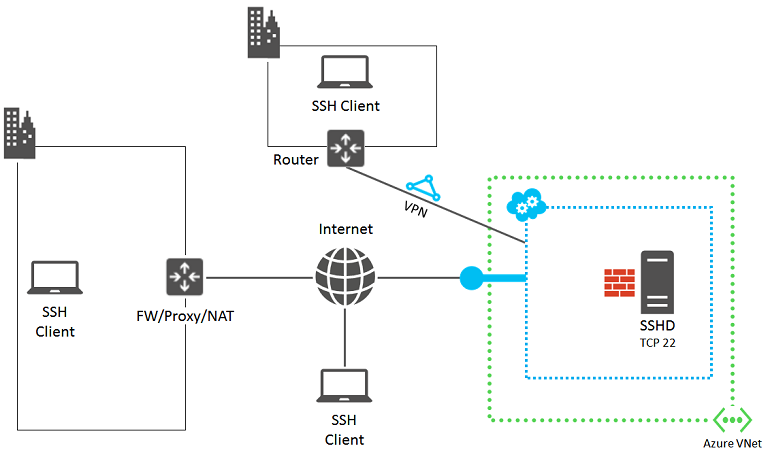

<properties
    pageTitle="Ausführliche SSH Problembehandlung bei einer Azure-virtuellen Computer | Microsoft Azure"
    description="Ausführlichere SSH Problembehandlung Schritte zum Herstellen einer Verbindung mit einer Azure-virtuellen Computern"
    keywords="SSH Verbindung zurückgewiesen, ssh zurück, Azure ssh, SSH Fehler bei der Verbindung"
    services="virtual-machines-linux"
    documentationCenter=""
    authors="iainfoulds"
    manager="timlt"
    editor=""
    tags="top-support-issue,azure-service-management,azure-resource-manager"/>

<tags
    ms.service="virtual-machines-linux"
    ms.workload="infrastructure-services"
    ms.tgt_pltfrm="vm-linux"
    ms.devlang="na"
    ms.topic="support-article"
    ms.date="09/01/2016"
    ms.author="iainfou"/>

# Ausführliche SSH Schritte zur Problembehandlung

Es gibt viele verschiedene Ursachen haben, die der SSH-Client möglicherweise nicht den Dienst SSH des virtuellen Computers zu erreichen können. Wenn Sie über die weitere [Allgemeine SSH Schritte zur Problembehandlung](virtual-machines-linux-troubleshoot-ssh-connection.md)befolgt haben, müssen Sie die Verbindungsprobleme diagnostizieren. In diesem Artikel führt Sie durch detaillierten Schritte zur Problembehandlung ausführen zu ermitteln, in denen die Verbindung SSH auftritt ist und wie es zu lösen.

## Vorbereitende Schritte

Das folgende Diagramm zeigt die Komponenten, die beteiligt sind.

Die folgenden Schritte helfen Ihnen die Ursache des Fehlers isolieren und Lösungen oder problemumgehungen ermitteln.

Überprüfen Sie zunächst den Status der virtuellen Computer im Portal aus.

Im [Portal Azure](https://portal.azure.com):

1. Für virtuelle Computer mit dem klassischen Bereitstellungsmodell erstellt, wählen Sie **Durchsuchen** > **virtuellen Computern (klassische)** > *Name des virtuellen Computers*.

    – ODER –

    Für virtuelle Computer mit dem Modell Ressourcenmanager erstellt, wählen Sie **Durchsuchen** > **virtuellen Computern** > *Name des virtuellen Computers*.

    Klicken Sie im Statusbereich für den virtuellen Computer sollte **ausgeführt**anzeigen. Führen Sie einen Bildlauf nach unten bis zum aktuellen Aktivitäten anzeigen, für berechnen, Speicher und Netzwerk-Ressourcen.

2. Wählen Sie **Einstellungen** Endpunkte, IP-Adressen und andere Einstellungen zu prüfen.

    Um Endpunkte in virtuellen Computern zu identifizieren, die mithilfe von Ressourcenmanager erstellt wurden, stellen Sie sicher, dass eine [Netzwerksicherheitsgruppe](../virtual-network/virtual-networks-nsg.md) definiert wurde. Überprüfen Sie auch, dass die Regeln auf das Netzwerk-Sicherheitsgruppe angewendet wurden, und dass diese im Subnetz verwiesen wird.

Im [Azure klassischen Portal](https://manage.windowsazure.com)für virtuellen Computern, die mit dem Bereitstellungsmodell klassischen erstellt wurden:

1. Wählen Sie **virtuellen Computern** > *Name des virtuellen Computers*.
2. Auswählen des virtuellen Computers **Dashboard** , um den Status prüfen.
3. Wählen Sie **Monitor** um neue Aktivitäten von berechnen, Speicher und Netzwerk-Ressourcen anzuzeigen.
4. Wählen Sie die **Endpunkte** , um sicherzustellen, dass es ein Endpunkt für SSH Datenverkehr gibt aus.

Wenn Netzwerkkonnektivität überprüfen möchten, aktivieren Sie die Endpunkte konfiguriert und angezeigt, wenn Sie den virtuellen Computer durch ein anderes Protokoll, beispielsweise HTTP oder einem anderen Dienst erreicht haben, können.

Versuchen Sie nach der folgenden Schritte aus die SSH-Verbindung erneut aus.

## Suchen Sie die Ursache des Problems

Der SSH-Client auf Ihrem Computer möglicherweise nicht den Dienst SSH des Azure-virtuellen Computers aufgrund von Problemen oder fehlerhafte Konfigurationen Folgendes zu erreichen:

- [SSH Clientcomputer](#source-1-ssh-client-computer)
- [Organisation Kante Gerät](#source-2-organization-edge-device)
- [Cloud-Service-Endpunkts an, und greifen Sie auf Steuerung Liste (ACL)](#source-3-cloud-service-endpoint-and-acl)
- [Netzwerk-Sicherheitsgruppen](#source-4-network-security-groups)
- [Azure virtuellen Linux-basierten Computer](#source-5-linux-based-azure-virtual-machine)

## Quelle 1: SSH Clientcomputer

Um Ihren Computer als Quelle für den Fehler zu vermeiden, überprüfen Sie, ob SSH Verbindungen mit einem anderen lokalen, Linux-basierten Computer vorgenommen werden können.

Wenn die Verbindung fehlschlägt, prüfen Sie auf Ihrem Computer die folgenden aus:

- Eine lokale Firewall-Einstellung, die blockiert eingehenden oder ausgehenden SSH Datenverkehr (TCP 22)
- Lokal installiert Proxy-Clientsoftware, die den SSH Verbindungen verhindert wird
- Überwachung der Software, das SSH Verbindungen verhindert Netzwerk lokal installiert
- Andere Arten von Sicherheitssoftware, die entweder den Datenverkehr überwachen oder bestimmte Arten von Datenverkehr zulassen/Sperren

Wenn Sie eine der folgenden Situationen anwenden möchten, vorübergehend deaktivieren Sie die Software und versuchen Sie, eine SSH-Verbindung zu einem lokalen Computer, um den Grund herauszufinden, die auf Ihrem Computer die Verbindung blockiert wird. Klicken Sie dann arbeiten Sie mit Ihr Netzwerkadministrator zur Behebung der Software Einstellungen SSH Verbindungen zulässt.

Wenn Sie Zertifikatauthentifizierung verwenden, stellen Sie sicher, dass Sie diese Berechtigungen in den Ordner .ssh in Ihrem home-Verzeichnis haben:

- Chmod 700 ~/.ssh
- Chmod 644 ~/.ssh/\*pub
- Chmod 600 ~/.ssh/id_rsa (oder andere Dateien, die Ihre privaten Schlüssel in diese gespeichert haben)
- Chmod 644 ~/.ssh/known_hosts (enthält Hosts, die Sie über SSH verbunden haben)

## Quelle 2: Organisation Kante Gerät

Um Ihre Organisation Kante Gerät als Quelle des Fehlers zu entfernen, stellen Sie sicher, dass ein Computer, der direkt mit dem Internet verbunden ist SSH Verbindungen an Ihre Azure-virtuellen Computer vornehmen kann. Wenn Sie den virtuellen Computer über ein VPN zwischen Standorten oder eine Azure ExpressRoute Verbindung zugreifen, fahren Sie mit [Quelle 4: Netzwerk-Sicherheitsgruppen](#nsg).

Wenn Sie nicht über einen Computer verfügen, der direkt ist mit dem Internet verbunden Erstellen eines neuen Azure-virtuellen Computers in einer eigenen Ressourcengruppe oder diesen cloud-Dienst und ihn verwenden. Weitere Informationen finden Sie unter [Erstellen eines virtuellen Computers ausführen in Azure Linux](virtual-machines-linux-quick-create-cli.md). Löschen Sie Ressourcengruppe oder virtueller Computer und Cloud-Dienst, wenn Sie mit den Tests fertig sind.

Wenn Sie eine SSH-Verbindung mit einem Computer erstellen können, die direkt mit dem Internet verbunden ist, überprüfen Sie Ihre Organisation Kante Gerät für:

- Eine interne Firewall, die blockieren SSH Datenverkehr mit dem Internet
- Einen Proxyserver, der den SSH Verbindungen verhindert wird
- Einen unbefugten oder Netzwerk Überwachung Software für Geräte im Netzwerk Kante, das den SSH Verbindungen verhindert wird ausgeführt

Arbeiten Sie mit Ihren Netzwerkadministrator zur Behebung der Einstellungen für Ihre Organisation Kante Geräte SSH Datenverkehr mit dem Internet zulässt.

## Quelle 3: Cloud Service-Endpunkts an und ACL

> [AZURE.NOTE] Diese Quelle gilt nur für virtuellen Computern, die mit dem Bereitstellungsmodell klassischen erstellt wurden. Virtuellen Computern, die mithilfe von Ressourcenmanager erstellt wurden, fahren Sie mit [Datenquelle 4: Netzwerk-Sicherheitsgruppen](#nsg).

Um die Cloud Service-Endpunkts an und ACL als Quelle des Fehlers zu entfernen, stellen Sie sicher, dass eine andere Azure virtueller Computer im gleichen virtuellen Netzwerk SSH Verbindungen an Ihre virtuellen Computer vornehmen können.

Wenn Sie einen anderen virtuellen Computer im gleichen virtuellen Netzwerk besitzen, können Sie einfach eine neue erstellen. Weitere Informationen finden Sie unter [Erstellen eines Linux virtuellen Computers unter Verwendung der CLI Azure](virtual-machines-linux-quick-create-cli.md). Löschen Sie den zusätzlichen virtuellen Computer, wenn Sie mit den Tests fertig sind.

Wenn Sie eine Verbindung SSH mit eines virtuellen Computers im gleichen virtuellen Netzwerk erstellen können, überprüfen Sie Folgendes:

- **Der Endpunktkonfiguration für SSH Datenverkehr am Ziel virtueller Computer.** Die private TCP-des Endpunkts sollte der TCP-übereinstimmen, auf dem der Dienst SSH des virtuellen Computers wartet. (Der Standardport ist 22). Für virtuelle Computer mit dem Modell zur Bereitstellung von Ressourcenmanager erstellt, überprüfen Sie die SSH TCP Port-Nummer der Azure-Portal durch die Option **Durchsuchen** > **virtuellen Computern (2)** > *Name des virtuellen Computers* > **Einstellungen** > **Endpunkte**.

- **Die ACL für den Datenverkehr-Endpunkt SSH auf die Ziel-virtuellen Computern.** Eine ACL können Sie angeben, gewährt oder verweigert eingehenden Datenverkehr aus dem Internet, basierend auf deren Quelle IP-Adresse. Unauffindbar ACLs können verhindern, dass die eingehenden SSH Datenverkehr an den Endpunkt. Überprüfen Ihre ACLs, um sicherzustellen, dass eingehenden Verkehr über die öffentlichen IP-Adressen Ihrer Proxy oder andere Kante Server ist zulässig. Weitere Informationen finden Sie unter [Informationen zum Netzwerkzugriff Steuerelement Zugriffssteuerungslisten ()](../virtual-network/virtual-networks-acl.md).

Um den Endpunkt als Quelle für das Problem zu vermeiden, entfernen Sie den aktuellen Endpunkt, erstellen Sie einen neuen Endpunkt, und geben Sie den Namen der SSH (TCP-22 für die öffentliche und private Port-Nummer). Weitere Informationen finden Sie unter [Einrichten von Endpunkten auf einem virtuellen Computer in Azure](virtual-machines-windows-classic-setup-endpoints.md).

## Quelle 4: Netzwerk-Sicherheitsgruppen

Netzwerk-Sicherheitsgruppen können Sie eine detailliertere Kontrolle der zulässigen eingehenden und ausgehenden Datenverkehr haben. Sie können Regeln erstellen, die Subnetze erstrecken und cloud Services in einem Azure-virtuellen Netzwerk. Überprüfen Sie Ihre Netzwerk Sicherheit Gruppe-Regeln, um sicherzustellen, dass SSH Datenverkehr an die und aus dem Internet zulässig ist.
Weitere Informationen finden Sie unter [Netzwerk Sicherheitsgruppen](../virtual-network/virtual-networks-nsg.md).

## Quelle 5: Linux-basierten Azure-virtuellen Computern

Des letzten Quellcodes mögliche Probleme ist der Azure-virtuellen Computern selbst.

Wenn dies nicht erfolgt noch, führen Sie die Anweisungen [zum Zurücksetzen eines Kennworts oder SSH für Linux-basierten virtuellen Maschinen](virtual-machines-linux-classic-reset-access.md).

Wiederholen Sie den Verbindungsversuch von Ihrem Computer. Wenn sie weiterhin fehlschlägt, gehören die folgenden einige mögliche Probleme:

- Der SSH-Dienst wird nicht auf dem Ziel virtuellen Computer ausgeführt.
- Der Dienst SSH hört nicht TCP-22. Um dies zu testen, ein Telnetclient auf Ihrem lokalen Computer installieren und Ausführen "Telnet *CloudServiceName*. cloudapp.net 22". Bestimmt, ob die virtuellen Computern eingehende und ausgehende Kommunikation an den Endpunkt SSH ermöglicht.
- Die lokale Firewall auf die Ziel-virtuellen Computern enthält Regeln, die den eingehenden oder ausgehenden Datenverkehr von SSH verhindert werden.
- SSH-Verbindungen ist verhindern von unbefugten oder Netzwerk Überwachung der Software, die auf den Azure-virtuellen Computern ausgeführt wird.

## Zusätzliche Ressourcen
Weitere Informationen zur Problembehandlung bei Anwendung Access finden Sie unter [Behandeln von Zugriff auf eine Anwendung, die auf einer Azure-virtuellen Computern ausgeführt](virtual-machines-linux-troubleshoot-app-connection.md)