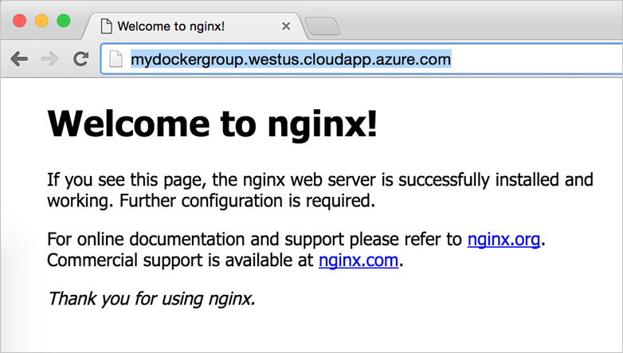

<properties
   pageTitle="Mit der Erweiterung Azure Docker virtueller Computer | Microsoft Azure"
   description="Erfahren Sie, wie Sie mit der Erweiterung Docker virtueller Computer schnell und sicher bereitstellen eine Docker Umgebung in Azure Ressourcenmanager Vorlagen verwenden."
   services="virtual-machines-linux"
   documentationCenter=""
   authors="iainfoulds"
   manager="timlt"
   editor=""/>

<tags
   ms.service="virtual-machines-linux"
   ms.devlang="na"
   ms.topic="article"
   ms.tgt_pltfrm="vm-linux"
   ms.workload="infrastructure"
   ms.date="10/25/2016"
   ms.author="iainfou"/>

# <a name="create-a-docker-environment-in-azure-using-the-docker-vm-extension"></a>Erstellen einer Docker Umgebung in Azure mit der Erweiterung Docker virtueller Computer
Docker ist eine beliebte Container Management und imaging Plattform, die Sie schnell mit den Container auf Linux (und Windows als auch) arbeiten kann. In Azure gibt es verschiedene Möglichkeiten, die gemäß Ihren Anforderungen Docker bereitgestellt werden kann. Dieser Artikel befasst sich mit der Erweiterung Docker virtueller Computer und Azure Ressourcenmanager Vorlagen. 

Weitere Informationen zu den verschiedenen Bereitstellungsmethoden, einschließlich der Verwendung von Docker Computer- und Azure Container Dienste finden Sie unter den folgenden Artikeln:

- Um schnell Prototypen einer app können Sie einen einzigen Docker Host mit [Docker Computer](./virtual-machines-linux-docker-machine.md)erstellen.
- Für größere, Stabilität Umgebungen können Sie die Erweiterung Azure Docker virtueller Computer, die ebenfalls [Docker verfassen unterstützt](https://docs.docker.com/compose/overview/) , um konsistente Container Bereitstellungen zu generieren. Dieser Artikeldetails Erweiterung Azure Docker virtuellen Computer verwenden.
- Einsatzbereit, skalierbare Umgebungen erstellen, die zusätzliche Planung und Verwaltung Tools bereitstellen, können Sie eine [Docker Swarm Cluster auf Azure Container Services](../container-service/container-service-deployment.md)bereitstellen.


## <a name="azure-docker-vm-extension-overview"></a>Azure Docker virtueller Computer Erweiterung (Übersicht)
Die Erweiterung Azure Docker virtueller Computer installiert und konfiguriert Docker Daemon, Docker Client und Docker verfassen auf Ihrer Linux virtuellen Computern (virtueller Computer). Mit der Erweiterung Azure Docker virtueller Computer, haben Sie mehr Kontrolle und Features als einfach Docker Computer verwenden oder den Host Docker selbst zu erstellen. Diese zusätzlichen Funktionen, wie etwa [Docker verfassen](https://docs.docker.com/compose/overview/), stellen Sie die Azure Docker virtueller Computer-Erweiterung für eine sichere Entwickler oder Herstellung Umgebungen geeignet ist.

Azure Ressourcenmanager Vorlagen definieren die gesamte Struktur Ihrer Umgebung. Vorlagen können Sie zum Erstellen und Konfigurieren von Ressourcen wie der Host Docker virtuellen Computern, Speicher, rollenbasierte Access-Steuerelemente (RBAC) und Diagnose. Sie können diese Vorlagen zum Erstellen von zusätzlicher Bereitstellungen konsistent wiederverwenden. Weitere Informationen zu Azure Ressourcenmanager und Vorlagen finden Sie unter [Übersicht Ressourcenmanager](../azure-resource-manager/resource-group-overview.md). 


## <a name="deploy-a-template-with-the-azure-docker-vm-extension"></a>Bereitstellen einer Vorlage mit der Erweiterung Azure Docker virtueller Computer
Wir verwenden einer vorhandenen Schnellstart Vorlage eine Ubuntu VM zu erstellen, die die Erweiterung Azure Docker virtuellen Computer installieren und Konfigurieren des Hosts Docker verwendet. Sie können die Vorlage hier anzeigen: [einfache Bereitstellung von einer Ubuntu virtueller Computer mit Docker](https://github.com/Azure/azure-quickstart-templates/tree/master/docker-simple-on-ubuntu). 

Sie benötigen die [Neuesten Azure CLI](../xplat-cli-install.md) installiert und angemeldet mit den Ressourcenmanager Modus wie folgt aus:

```
azure config mode arm
```

Stellen Sie die Vorlage, die mit der Angabe der Vorlage URI CLI Azure bereit. Im folgenden Beispiel wird eine Ressourcengruppe mit dem Namen `myResourceGroup` in der `WestUS` Speicherort. Verwenden Sie eine eigene Gruppe Ressourcenname und einen Speicherort wie folgt ein:

```
azure group create --name myResourceGroup --location "West US" \
  --template-uri https://raw.githubusercontent.com/Azure/azure-quickstart-templates/master/docker-simple-on-ubuntu/azuredeploy.json
```

Beantworten Sie die Anweisungen, um Ihr Speicherkonto benennen, geben Sie einen Benutzernamen und ein Kennwort und geben Sie einen Namen für die DNS. Die Ausgabe ist ähnlich wie im folgenden Beispiel:

```
info:    Executing command group create
+ Getting resource group myResourceGroup
+ Updating resource group myResourceGroup
info:    Updated resource group myResourceGroup
info:    Supply values for the following parameters
newStorageAccountName: mystorageaccount
adminUsername: ops
adminPassword: P@ssword!
dnsNameForPublicIP: mypublicip
+ Initializing template configurations and parameters
+ Creating a deployment
info:    Created template deployment "azuredeploy"
data:    Id:                  /subscriptions/guid/resourceGroups/myResourceGroup
data:    Name:                myResourceGroup
data:    Location:            westus
data:    Provisioning State:  Succeeded
data:    Tags: null
data:
info:    group create command OK

```

Azure CLI zurück, auf die Aufforderung nach nur ein paar Sekunden, aber Ihre Docker Host ist noch immer erstellt und von der Erweiterung Azure Docker virtueller Computer konfiguriert wird. Es dauert ein paar Minuten für die Bereitstellung auf Fertig stellen. Sie können Anzeigen von Details zu den Docker Host Status mithilfe der `azure vm show` Befehl.

Im folgende Beispiel wird der Status für den virtuellen Computer mit dem Namen überprüft `myDockerVM` (Ändern des Standardnamens aus der Vorlage - nicht dieser Name) in der Ressourcengruppe mit dem Namen `myResourceGroup`. Geben Sie den Namen der Ressourcengruppe, die Sie im vorherigen Schritt erstellt haben:

```bash
azure vm show -g myResourceGroup -n myDockerVM
```

Die Ausgabe der `azure vm show` Befehl ist ähnlich wie im folgenden Beispiel:

```
info:    Executing command vm show
+ Looking up the VM "myDockerVM"
+ Looking up the NIC "myVMNicD"
+ Looking up the public ip "myPublicIPD"
data:    Id                              :/subscriptions/guid/resourceGroups/myresourcegroup/providers/Microsoft.Compute/virtualMachines/MyDockerVM
data:    ProvisioningState               :Succeeded
data:    Name                            :MyDockerVM
data:    Location                        :westus
data:    Type                            :Microsoft.Compute/virtualMachines
[...]
data:
data:    Network Profile:
data:      Network Interfaces:
data:        Network Interface #1:
data:          Primary                   :true
data:          MAC Address               :00-0D-3A-33-D3-95
data:          Provisioning State        :Succeeded
data:          Name                      :myVMNicD
data:          Location                  :westus
data:            Public IP address       :13.91.107.235
data:            FQDN                    :mypublicip.westus.cloudapp.azure.com]
data:
data:    Diagnostics Instance View:
info:    vm show command OK
```

Im oberen Bereich der Ausgabe finden Sie die `ProvisioningState` von den virtuellen Computer. Wenn dies zeigt `Succeeded`, wurde die Bereitstellung abgeschlossen und Sie können SSH auf den virtuellen Computer.

Zum Ende der Ausgabe `FQDN` zeigt den vollqualifizierten Domänennamen des Hosts Docker. Dieser FQDN ist, was Sie Ihre Docker Host in die restlichen Schritte SSH verwenden.


## <a name="deploy-your-first-nginx-container"></a>Bereitstellen des ersten Nginx Containers
Sobald die Bereitstellung, SSH auf Ihrer neuen Docker Host von Ihrem lokalen Computer abgeschlossen ist. Geben Sie Ihren eigenen Benutzernamen und vollqualifizierten Domänennamen wie folgt ein:

```bash
ssh ops@mypublicip.westus.cloudapp.azure.com
```

Nach der Anmeldung an den Host Docker führen wir einen Nginx-Container aus:

```
sudo docker run -d -p 80:80 nginx
```

Ähnlich wie im folgenden Beispiel ist das Ergebnis des Bilds Nginx heruntergeladen werden sollen und ein Containers Schritte:

```
Unable to find image 'nginx:latest' locally
latest: Pulling from library/nginx
efd26ecc9548: Pull complete
a3ed95caeb02: Pull complete
a48df1751a97: Pull complete
8ddc2d7beb91: Pull complete
Digest: sha256:2ca2638e55319b7bc0c7d028209ea69b1368e95b01383e66dfe7e4f43780926d
Status: Downloaded newer image for nginx:latest
b6ed109fb743a762ff21a4606dd38d3e5d35aff43fa7f12e8d4ed1d920b0cd74
```

Überprüfen des Status im Container ausgeführt auf dem Host Docker wie folgt:

```
sudo docker ps
```

Die Ausgabe ist ähnlich wie im folgenden Beispiel, mit den Container Nginx Ausführung und TCP-Ports 80 und 443 ist und weitergeleitet wird:

```
CONTAINER ID        IMAGE               COMMAND                  CREATED              STATUS              PORTS                         NAMES
b6ed109fb743        nginx               "nginx -g 'daemon off"   About a minute ago   Up About a minute   0.0.0.0:80->80/tcp, 443/tcp   adoring_payne
```

Wenn den Container in Aktion anzeigen möchten, einem Webbrowser zu öffnen Sie, und geben Sie den Vollqualifizierten Domänennamen Ihres Docker Hosts:




## <a name="azure-docker-vm-extension-template-reference"></a>Azure Docker virtueller Computer Erweiterung vorlagenverweisen
Im vorhergehenden Beispiel wird eine vorhandene Schnellstart-Vorlage. Sie können auch die Erweiterung Azure Docker virtueller Computer mit eigener Vorlagen Ressourcenmanager bereitstellen. Fügen Sie hierzu den folgenden Ihre Ressourcenmanager Vorlagen, definieren die `vmName` von Ihrem virtuellen Computer ordnungsgemäß:

```
{
  "type": "Microsoft.Compute/virtualMachines/extensions",
  "name": "[concat(variables('vmName'), '/DockerExtension'))]",
  "apiVersion": "2015-05-01-preview",
  "location": "[parameters('location')]",
  "dependsOn": [
    "[concat('Microsoft.Compute/virtualMachines/', variables('vmName'))]"
  ],
  "properties": {
    "publisher": "Microsoft.Azure.Extensions",
    "type": "DockerExtension",
    "typeHandlerVersion": "1.1",
    "autoUpgradeMinorVersion": true,
    "settings": {},
    "protectedSettings": {}
  }
}
```

Finden Sie weitere ausführliche exemplarische Vorgehensweise zur Verwendung von Ressourcenmanager Vorlagen durch [Azure Ressourcenmanager Überblick](../azure-resource-manager/resource-group-overview.md)lesen.


## <a name="next-steps"></a>Nächste Schritte
Sie können auch zum [konfigurieren den Docker Daemon TCP-](https://docs.docker.com/engine/reference/commandline/dockerd/#/bind-docker-to-another-hostport-or-a-unix-socket), verstehen Sie [Docker Sicherheit](https://docs.docker.com/engine/security/security/)oder mit [Docker verfassen](https://docs.docker.com/compose/overview/)Container bereitstellen. Weitere Informationen über die Erweiterung Azure Docker virtueller Computer selbst finden Sie unter [GitHub Projekt](https://github.com/Azure/azure-docker-extension/).

Lesen Sie weitere Informationen zu den weiteren Docker Bereitstellungsoptionen in Azure ein:

- [Verwenden Sie Docker Computer mit der Azure-Treiber](./virtual-machines-linux-docker-machine.md)  
- [Erste Schritte mit Docker und verfassen definieren und Ausführen einer Anwendungs mehrere Container auf eine Azure-virtuellen Computern](virtual-machines-linux-docker-compose-quickstart.md).
- [Bereitstellen eines Azure Container Dienst Clusters](../container-service/container-service-deployment.md)
