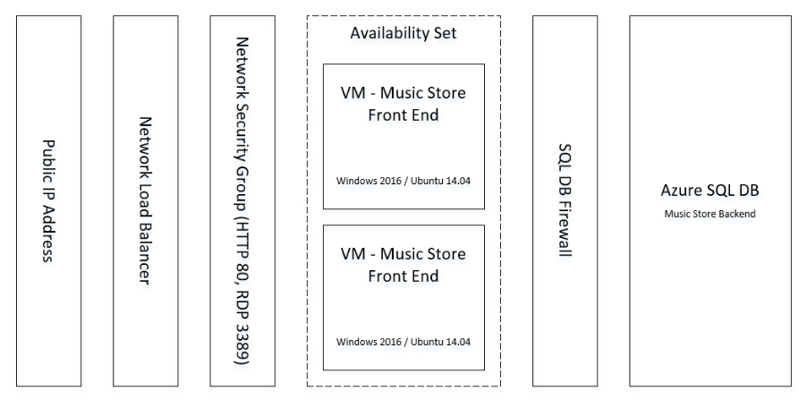

<properties
   pageTitle="Azure-virtuellen Computern DotNet Core Lernprogramm 1 | Microsoft Azure"
   description="Azure-virtuellen Computern DotNet Core Lernprogramm"
   services="virtual-machines-linux"
   documentationCenter="virtual-machines"
   authors="neilpeterson"
   manager="timlt"
   editor="tysonn"
   tags="azure-service-management"/>

<tags
   ms.service="virtual-machines-linux"
   ms.devlang="na"
   ms.topic="article"
   ms.tgt_pltfrm="vm-linux"
   ms.workload="infrastructure"
   ms.date="09/21/2016"
   ms.author="nepeters"/>

# Automatisieren von Anwendung Bereitstellungen zu Azure virtuellen Computern

Dieser Reihe vierteiliger details bereitstellen und Konfigurieren von Azure Ressourcen- und Applikationen Azure Ressource verwalten, Vorlagen verwenden. Klicken Sie in dieser Reihe eine Beispielvorlage bereitgestellt wird, und die Vorlage für die Bereitstellung untersucht. Das Ziel dieser Reihe ist, informieren Sie die Beziehung zwischen Azure Ressourcen und Bereitstellen von Vorlagen für vollständig integrierte Azure Ressourcenmanager Erfahrung Hände abgeben. Dieses Dokument wird vorausgesetzt, eine Ebene grundlegende Kenntnisse Azure Ressourcenmanager, bevor Sie dieses Lernprogramm starten Vertrautmachen mit grundlegenden Azure Ressourcenmanager Konzepten.

## Musik Store-Anwendung

Das Beispiel in dieser Reihe verwendet wird eine .net Core Anwendung von Musik Store Einkaufs-Erfahrung simulieren. An einem Linux oder Windows virtuelle System dieser Anwendung bereitgestellt werden kann, Stichprobe Bereitstellungen für beide erstellt wurden. Die Anwendung umfasst eine Webanwendung und einer SQL-Datenbank. Stellen Sie vor dem Lesen den Artikel in dieser Reihe, der Anwendungs, die mit der Bereitstellung Schaltfläche auf dieser Seite gefunden. Wenn vollständig bereitgestellt, sieht die Anwendung / Azure-Architektur wie das folgende Diagramm aus. 

Die Vorlage Musik Store Ressourcenmanager, [Musik Store Linux Vorlage]( https://github.com/neilpeterson/nepeters-azure-templates/tree/master/dotnet-core-music-linux-vm-sql-db) finden Sie hier

Jede dieser Komponenten, einschließlich der zuordnen JSON-Vorlage wird in den folgenden vier Artikeln untersucht.

- [**Anwendungsarchitektur**](./virtual-machines-linux-dotnet-core-2-architecture.md) – Anwendungskomponenten wie z. B. Websites und Datenbanken müssen auf Azure Computerressourcen wie virtuellen Computern und SQL Azure-Datenbanken gehostet werden. Dieses Dokument durchläuft Zuordnung berechnen müssen, Azure Ressourcen und Bereitstellen dieser Ressourcen mit einer Vorlage Azure Ressourcenmanager. 

- [**Zugreifen auf und Sicherheit**](./virtual-machines-linux-dotnet-core-3-access-security.md) – beim Hosten von Applications in Azure, ist es erforderlich, überlegen, wie die Anwendung zugegriffen wird und wie die verschiedenen Komponenten Zugriff auf die Anwendung miteinander. In diesem Dokument werden bereitstellen und Sichern von Internet-Zugriff auf eine Anwendung und Access zwischen Anwendungskomponenten.

- [**Verfügbarkeit und Skalierung**](./virtual-machines-linux-dotnet-core-4-availability-scale.md) – Verfügbarkeit und Skalierung beziehen sich auf die Applikationen Möglichkeit um Ausführung während Ausfallzeiten Infrastruktur bleiben und die Möglichkeit zum Berechnen von Ressourcen Anwendung Nachfrage zu skalieren. Diese Dokumentdetails Komponenten, die zum Bereitstellen einer Lastenausgleich erforderlich und hochgradig verfügbare Anwendung.

- [**Bereitstellung der Anwendung**](./virtual-machines-linux-dotnet-core-5-app-deployment.md) - beim Bereitstellen von Applications auf Azure virtuellen Computern, muss die Methode, an der die Anwendungsbinärdateien auf dem virtuellen Computer installiert sind, berücksichtigt werden. In diesem Dokument werden Automatisieren von Anwendungsinstallation Azure-virtuellen Computern benutzerdefinierte Skript-Erweiterungen verwenden.

Das Ziel bei der Entwicklung von Azure Ressourcenmanager Vorlagen wird zum Automatisieren der bereitstellungs von Azure-Infrastruktur und die Installation und Konfiguration der Programme auf diesem Azure Infrastruktur gehostet wird. Durcharbeiten dieser Artikel enthält ein Beispiel für diese Erfahrung.

## Bereitstellen der Musik Store-Anwendungs

Verwenden diese Schaltfläche, kann die Musik Store-Anwendung bereitgestellt werden.

Die Vorlage Azure Ressourcenmanager erfordert die folgenden Parameterwerte.

|Parameternamen |Beschreibung   |
|---|---|
|SSHKEYDATA   | SSH wichtige Daten zum Sichern des Zugriffs auf den virtuellen Computern. Informationen zum Erstellen einer SSH Key Paar finden Sie unter [Erstellen von SSH Schlüssel für Linux virtuellen Computern in Azure](virtual-machines-linux-mac-create-ssh-keys.md).  |
|ADMINUSERNAME   | Administrator-Benutzername, der auf den virtuellen Computern und SQL Azure-Datenbank verwendet wird.  |
|SQLADMINPASSWORD | Kennwort, das die SQL Azure-Datenbank verwendet wird.  |
|NUMBEROFINSTANCES | Die Anzahl von virtuellen Computern erstellt werden. Jede dieser virtuellen Computer hosten der Musik Store Web-Anwendungs, und alle Datenverkehr ist Lastenausgleich auf diese. |
|PUBLICIPADDRESSDNSNAME | Global eindeutigen DNS-Name der öffentlichen IP-Adresse zugeordnet. |

Wenn die Vorlage Bereitstellung abgeschlossen wurde, navigieren Sie zu der öffentlichen IP-Adresse mit einem beliebigen Internetbrowser. .Net Core Musik-Website wird angezeigt.

## Nächste Schritte

[Schritt 1: Anwendungsarchitektur mit Azure Ressourcenmanager Vorlagen](./virtual-machines-linux-dotnet-core-2-architecture.md)

[Schritt 2: Zugriff und Sicherheit in Azure Ressourcenmanager Vorlagen](./virtual-machines-linux-dotnet-core-3-access-security.md)

[Schritt 3: Verfügbarkeit und Skalierung in Azure Ressourcenmanager Vorlagen](./virtual-machines-linux-dotnet-core-4-availability-scale.md)

[Schritt 4 – Bereitstellung der Anwendung mit Azure Ressourcenmanager Vorlagen](./virtual-machines-linux-dotnet-core-5-app-deployment.md)

