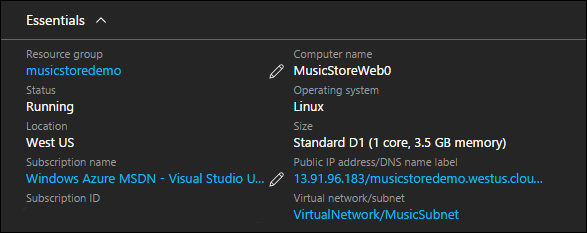
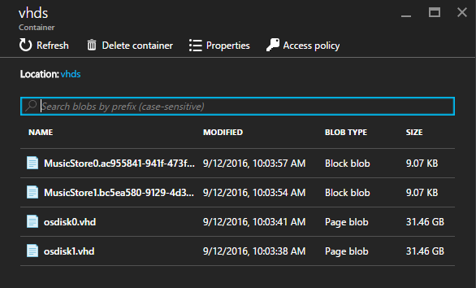
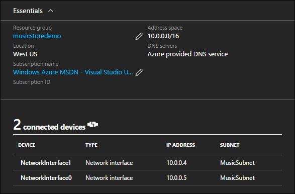

<properties
   pageTitle="Bereitstellen von Ressourcen mit Azure Ressourcenmanager Vorlagen berechnen | Microsoft Azure"
   description="Azure-virtuellen Computern DotNet Core Lernprogramm"
   services="virtual-machines-linux"
   documentationCenter="virtual-machines"
   authors="neilpeterson"
   manager="timlt"
   editor="tysonn"
   tags="azure-service-management"/>

<tags
   ms.service="virtual-machines-linux"
   ms.devlang="na"
   ms.topic="article"
   ms.tgt_pltfrm="vm-linux"
   ms.workload="infrastructure"
   ms.date="09/21/2016"
   ms.author="nepeters"/>

# <a name="application-architecture-with-azure-resource-manager-templates"></a>Anwendungsarchitektur mit Azure Ressourcenmanager Vorlagen

Bei der Entwicklung einer Ressourcenmanager Azure-bereitstellungs unter Berücksichtigung der bestehenden Azure Ressourcen und Dienste zugeordnet werden müssen. Wenn mehrere HTTP-Endpunkte, einer Datenbank und einem Zwischenspeichern Service-Anwendung besteht, muss die Azure Ressourcen, hosten jede dieser Komponenten rationalisierte Infrastruktur werden. Beispielsweise enthält die Stichprobe Musik Store-Anwendung eine Anwendung, die auf einem virtuellen Computer gehostet wird, und einer SQL-Datenbank, die in SQL Azure-Datenbank gehostet wird. 

Dieses Dokument beschreibt, wie die Musik Store berechnen Ressourcen in die Ressourcenmanager Azure Beispielvorlage konfiguriert sind. Alle Abhängigkeiten und eindeutige Konfigurationen werden hervorgehoben. Für optimale Ergebnisse, vorab eine Instanz der Lösung Azure-Abonnement und Arbeit zusammen mit der Vorlage Ressourcenmanager Azure bereitgestellt werden. Die vollständige Vorlage – [Musik Store Bereitstellung auf Ubuntu](https://github.com/Microsoft/dotnet-core-sample-templates/tree/master/dotnet-core-music-linux)finden Sie hier.

## <a name="virtual-machine"></a>Virtuellen Computern

Die Anwendung Musik Store enthält eine Webanwendung, wo Kunden suchen und Musik kaufen können. Es gibt mehrere Azure Dienste, die in diesem Beispiel Webanwendungen hosten können wird eines virtuellen Computers verwendet. Verwenden die Beispielvorlage Musik Store, ein virtuellen Computers bereitgestellt wird, einen Webserver installieren und die Website Musik Store installiert und konfiguriert. Aus Gründen der in diesem Artikel werden nur die virtuellen Computern Bereitstellung detailliert beschrieben. Die Konfiguration des Webservers und die Anwendung wird in einem der folgenden Artikel ausführlich beschrieben.

Ein virtuellen Computers können zu einer Vorlage mit dem Assistenten für Visual Studio eine neue Ressource hinzu oder durch Einfügen von gültigen JSON in der Vorlage für die Bereitstellung hinzugefügt werden. Beim Bereitstellen eines virtuellen Computers werden auch mehrere zugehörige Ressourcen benötigt. Wenn Sie Visual Studio verwenden, um die Vorlage zu erstellen, werden diese Ressourcen für Sie erstellt. Wenn die Vorlage manuell zu erstellen, müssen diese Ressourcen eingefügt und konfiguriert werden.

Führen Sie diesen Link, um das JSON-Beispiel innerhalb der Ressourcenmanager Vorlage – [Virtuellen Computern JSON](https://github.com/Microsoft/dotnet-core-sample-templates/blob/master/dotnet-core-music-linux/azuredeploy.json#L295)finden Sie unter.

```none
{
  "apiVersion": "2015-06-15",
  "type": "Microsoft.Compute/virtualMachines",
  "name": "[concat(variables('vmName'),copyindex())]",
  "location": "[resourceGroup().location]",
  "copy": {
    "name": "virtualMachineLoop",
    "count": "[parameters('numberOfInstances')]"
  },
  "tags": {
    "displayName": "virtual-machine"
  },
  "dependsOn": [
    "[concat('Microsoft.Storage/storageAccounts/', variables('vhdStorageName'))]",
    "[concat('Microsoft.Compute/availabilitySets/', variables('availabilitySetName'))]",
    "nicLoop"
  ],
  "properties": {
    "availabilitySet": {
      "id": "[resourceId('Microsoft.Compute/availabilitySets', variables('availabilitySetName'))]"
    },
      ........<truncated>  
    }
```

Nach der Bereitstellung, können die Eigenschaften des virtuellen Computers Azure-Portal angezeigt werden.



## <a name="storage-account"></a>Speicher-Konto

Speicherkonten müssen viele Speicheroptionen und Funktionen. Ein Speicherkonto für den Kontext von Azure-virtuellen Computern geführt virtuellen Festplatten des virtuellen Computers und alle weiteren Datenlaufwerke. Im Beispiel Musik Store enthält eine Speicherkontos zum Halten Sie der virtuellen Festplatte jedes virtuellen Computers in der Bereitstellung. 

Führen Sie diesen Link, um das JSON-Beispiel innerhalb der Ressourcenmanager Vorlage – [Speicher-Konto](https://github.com/Microsoft/dotnet-core-sample-templates/blob/master/dotnet-core-music-linux/azuredeploy.json#L109)finden Sie unter.


```none
{
  "apiVersion": "2015-06-15",
  "type": "Microsoft.Storage/storageAccounts",
  "name": "[variables('vhdStorageName')]",
  "location": "[resourceGroup().location]",
  "tags": {
    "displayName": "storage-account"
  },
  "properties": {
    "accountType": "[variables('vhdStorageType')]"
  }
}
```

Zuordnen einer virtuellen Computern innerhalb der Vorlagendeklaration Ressourcenmanager des virtuellen Computers ist ein Speicherkonto. 

Führen Sie diesen Link, um die Stichprobe JSON innerhalb der Ressourcenmanager Vorlage – [Zuordnung von virtuellen Computern und Speicher-Konto](https://github.com/Microsoft/dotnet-core-sample-templates/blob/master/dotnet-core-music-linux/azuredeploy.json#L341)finden Sie unter.

```none
"osDisk": {
  "name": "osdisk",
  "vhd": {
    "uri": "[concat(reference(concat('Microsoft.Storage/storageAccounts/',variables('vhdStorageName')), '2015-06-15').primaryEndpoints.blob,'vhds/osdisk', copyindex(), '.vhd')]"
  },
  "caching": "ReadWrite",
  "createOption": "FromImage"
}
```

Nach der Bereitstellung kann das Speicherkonto Azure-Portal angezeigt werden.


Klicken in den Speicher Konto Blob Container, kann die Datei virtuelle Festplatte für jeden virtuellen Computer befinden, die mit der Vorlage angezeigt werden.



Weitere Informationen zum Azure-Speicher finden Sie unter [Dokumentation Azure-Speicher](https://azure.microsoft.com/documentation/services/storage/).

## <a name="virtual-network"></a>Virtuelles Netzwerk

Wenn eine virtuellen Computern internen Netzwerke wie etwa die Möglichkeit zur Kommunikation mit anderen virtuellen Computern und Azure Ressourcen erforderlich ist, ist ein Azure-virtuellen Netzwerk erforderlich.  Ein virtuelles Netzwerk keine des virtuellen Computers über das Internet zugänglich. Öffentliche Verbindung erfordert eine öffentliche IP-Adresse, die später in dieser Reihe ausführlich dargestellt wird.

Führen Sie diesen Link, um das JSON-Beispiel in Ressourcenmanager Vorlage – [virtuelles Netzwerk und Subnetzen](https://github.com/Microsoft/dotnet-core-sample-templates/blob/master/dotnet-core-music-linux/azuredeploy.json#L136)finden Sie unter.

```none
{
  "apiVersion": "2015-06-15",
  "type": "Microsoft.Network/virtualNetworks",
  "name": "[variables('virtualNetworkName')]",
  "location": "[resourceGroup().location]",
  "dependsOn": [
    "[concat('Microsoft.Network/networkSecurityGroups/', variables('networkSecurityGroup'))]"
  ],
  "tags": {
    "displayName": "virtual-network"
  },
  "properties": {
    "addressSpace": {
      "addressPrefixes": [
        "10.0.0.0/24"
      ]
    },
    "subnets": [
      {
        "name": "[variables('subnetName')]",
        "properties": {
          "addressPrefix": "10.0.0.0/24",
          "networkSecurityGroup": {
            "id": "[resourceId('Microsoft.Network/networkSecurityGroups', variables('networkSecurityGroup'))]"
          }
        }
      }
    ]
  }
}
```

Die folgende Abbildung sieht das virtuelle Netzwerk, aus dem Azure-Portal. Beachten Sie, dass alle virtuellen Computern befinden, die mit der Vorlage mit dem virtuellen Netzwerk verbunden sind.



## <a name="network-interface"></a>Netzwerk-Benutzeroberfläche

 Netzwerk-Schnittstellen verbindet ein virtuellen Computers zu einem virtuellen Netzwerk, genauer mit einem Subnetz, die in das virtuelle Netzwerk definiert wurde. 
 
 Führen Sie diesen Link, um die Stichprobe JSON innerhalb der Ressourcenmanager Vorlage – [Netzwerk-Schnittstelle](https://github.com/Microsoft/dotnet-core-sample-templates/blob/master/dotnet-core-music-linux/azuredeploy.json#L166)finden Sie unter.
 
```none
{
  "apiVersion": "2015-06-15",
  "type": "Microsoft.Network/networkInterfaces",
  "name": "[concat(variables('networkInterfaceNamePrefix'), copyindex())]",
  "location": "[resourceGroup().location]",
  "tags": {
    "displayName": "network-interface"
  },
  "copy": {
    "name": "nicLoop",
    "count": "[parameters('numberOfInstances')]"
  },
  "dependsOn": [
    "[concat('Microsoft.Network/virtualNetworks/', variables('virtualNetworkName'))]",
    "[concat('Microsoft.Network/loadBalancers/', variables('loadBalancerName'))]",
    "[concat('Microsoft.Network/publicIPAddresses/', variables('publicIpAddressName'))]",
    "[concat('Microsoft.Network/loadBalancers/', variables('loadBalancerName'), '/inboundNatRules/', 'SSH-VM', copyIndex())]"
  ],
  "properties": {
    "ipConfigurations": [
      {
        "name": "ipconfig1",
        "properties": {
          "privateIPAllocationMethod": "Dynamic",
          "subnet": {
            "id": "[variables('subnetRef')]"
          },
          "loadBalancerBackendAddressPools": [
            {
              "id": "[variables('lbPoolID')]"
            }
          ],
          "loadBalancerInboundNatRules": [
            {
              "id": "[concat(variables('lbID'),'/inboundNatRules/SSH-VM', copyIndex())]"
            }
          ]
        }
      }
    ]
  }
}
```

Jede Ressource virtuellen Computern enthält ein Netzwerkprofil. Die Netzwerk-Schnittstellen gehören des virtuellen Computers in dieses Profil zugeordnet.  

Führen Sie diesen Link, um die JSON-Beispiel innerhalb der Ressourcenmanager Vorlage – [Virtuellen Computern Netzwerkprofil](https://github.com/Microsoft/dotnet-core-sample-templates/blob/master/dotnet-core-music-linux/azuredeploy.json#L350)anzuzeigen.


```none
"networkProfile": {
  "networkInterfaces": [
    {
      "id": "[resourceId('Microsoft.Network/networkInterfaces', concat(variables('networkInterfaceNamePrefix'), copyindex()))]"
    }
  ]
}
```

Die folgende Abbildung sieht die Schnittstelle, von der Azure-Portal. Die interne IP-Adresse und die Zuordnung virtuellen Computern können für das Netzwerk Benutzeroberfläche Ressource angezeigt werden.


Finden Sie weitere Informationen in Azure-virtuellen Netzwerken [Azure-virtuellen Netzwerk-Dokumentation](https://azure.microsoft.com/documentation/services/virtual-network/)aus.

## <a name="azure-sql-database"></a>SQL Azure-Datenbank

Zusätzlich zu einer virtuellen Computern, die Musik Store Website gehostet wird eine SQL Azure-Datenbank bereitgestellt, um die Musik Store-Datenbank zu hosten. Der Vorteil der Verwendung von Azure SQL-Datenbank hier ist ein zweiter Satz virtuellen Computern ist nicht erforderlich, und skalieren und Verfügbarkeit ist in den Dienst integriert.

Eine SQL Azure-Datenbank kann mithilfe der Visual Studio eine neue Ressource hinzu Assistenten oder durch Einfügen von gültigen JSON in einer Vorlage hinzugefügt werden. Die SQL Server-Ressource enthält einen Benutzernamen und Ihr Kennwort ein, der Administratorrechte auf die SQL-Instanz gewährt wird. Außerdem wird eine SQL-Firewall Ressource hinzugefügt. Programme, die in Azure gehostet sind standardmäßig eine Verbindung mit der SQL-Instanz herstellen. Um externe Anwendung zulassen muss solche SQL Server Management Studio für die Verbindung mit der SQL-Instanz, die Firewall konfiguriert sein. Aus Gründen der Musik Store anschauen ist die standardmäßige Konfiguration in Ordnung. 

Führen Sie diesen Link, um das JSON-Beispiel innerhalb der Ressourcenmanager Vorlage – [Azure SQL-DB](https://github.com/Microsoft/dotnet-core-sample-templates/blob/master/dotnet-core-music-linux/azuredeploy.json#L401)finden Sie unter.


```none
{
  "apiVersion": "2014-04-01-preview",
  "type": "Microsoft.Sql/servers",
  "name": "[variables('musicStoreSqlName')]",
  "location": "[resourceGroup().location]",

  "dependsOn": [],
  "tags": {
    "displayName": "sql-music-store"
  },
  "properties": {
    "administratorLogin": "[parameters('adminUsername')]",
    "administratorLoginPassword": "[parameters('sqlAdminPassword')]"
  },
  "resources": [
    {
      "apiVersion": "2014-04-01-preview",
      "type": "firewallrules",
      "name": "firewall-allow-azure",
      "location": "[resourceGroup().location]",
      "dependsOn": [
        "[concat('Microsoft.Sql/servers/', variables('musicStoreSqlName'))]"
      ],
      "properties": {
        "startIpAddress": "0.0.0.0",
        "endIpAddress": "0.0.0.0"
      }
    }
  ]
}
```

Eine Ansicht der SQLServer und MusicStore Datenbank wie in der Azure-Portal zu sehen.


Weitere Informationen zum Bereitstellen von Azure SQL-Datenbank finden Sie unter [Dokumentation Azure SQL-Datenbank](https://azure.microsoft.com/documentation/services/sql-database/).

## <a name="next-step"></a>Als Nächstes

<hr>

[Schritt 2: Zugriff und Sicherheit in Azure Ressourcenmanager Vorlagen](./virtual-machines-linux-dotnet-core-3-access-security.md)
