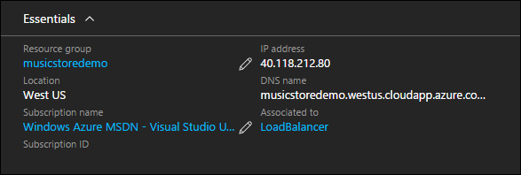
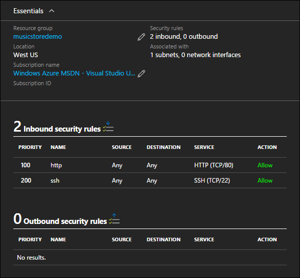

<properties
   pageTitle="Zugreifen auf und Sicherheit in Azure Ressourcenmanager Vorlagen | Microsoft Azure" 
   description="Azure-virtuellen Computern DotNet Core Lernprogramm"
   services="virtual-machines-linux"
   documentationCenter="virtual-machines"
   authors="neilpeterson"
   manager="timlt"
   editor="tysonn"
   tags="azure-service-management"/>

<tags
   ms.service="virtual-machines-linux"
   ms.devlang="na"
   ms.topic="article"
   ms.tgt_pltfrm="vm-linux"
   ms.workload="infrastructure"
   ms.date="09/21/2016"
   ms.author="nepeters"/>

# <a name="access-and-security-in-azure-resource-manager-templates"></a>Zugreifen auf und Sicherheit in Azure Ressourcenmanager Vorlagen

Gehostet in Azure wahrscheinlich Applications Zugriff über das Internet oder ein VPN sein müssen / Express-Routing Verbindung mit Azure. Mit dem Beispiel Musik Store Anwendung wird im Internet mit einer öffentlichen IP-Adresse der Website zur Verfügung gestellt. Mit Access hergestellt sollten Verbindungen mit der Anwendung und den Zugriff auf die Ressourcen des virtuellen Computers selbst geschützt werden. Diese Zugriffsschutz wird mit einer Sicherheitsgruppe Netzwerk bereitgestellt. 

Dieses Dokument beschreibt, wie die Anwendung Musik Store in die Ressourcenmanager Azure Beispielvorlage geschützt ist. Alle Abhängigkeiten und eindeutige Konfigurationen werden hervorgehoben. Für optimale Ergebnisse, vorab eine Instanz der Lösung Azure-Abonnement und Arbeit zusammen mit der Vorlage Ressourcenmanager Azure bereitgestellt werden. Die vollständige Vorlage – [Musik Store Bereitstellung auf Ubuntu](https://github.com/Microsoft/dotnet-core-sample-templates/tree/master/dotnet-core-music-linux)finden Sie hier.


## <a name="public-ip-address"></a>Öffentliche IP-Adresse

Öffentliche den Zugriff auf eine Ressource Azure kann eine öffentliche IP-Adressenressource verwendet werden. Öffentliche IP-Adresse kann eine statische oder dynamische IP-Adresse konfiguriert werden. Wenn eine dynamische Adresse verwendet wird, und des virtuellen Computers beendet und freigegeben ist, wird die Adressen entfernt. Wenn der Computer erneut gestartet wird, können sie eine andere öffentliche IP-Adresse zugewiesen werden. Um zu verhindern, dass eine IP-Adresse ändern, kann eine reservierte IP-Adresse verwendet werden. 

Eine öffentliche IP-Adresse können zu einer Ressourcenmanager Azure-Vorlage, die mithilfe der Visual Studio-Ressource Assistent oder durch Einfügen von gültigen JSON in einer Vorlage hinzugefügt werden. 

Führen Sie diesen Link, um das JSON-Beispiel in die Ressourcenmanager Vorlage – [Öffentliche IP-Adresse](https://github.com/Microsoft/dotnet-core-sample-templates/blob/master/dotnet-core-music-linux/azuredeploy.json#L121)angezeigt.


```none
{
  "apiVersion": "2015-06-15",
  "type": "Microsoft.Network/publicIPAddresses",
  "name": "[variables('publicipaddressName')]",
  "location": "[resourceGroup().location]",
  "tags": {
    "displayName": "public-ip-front"
  },
  "properties": {
    "publicIPAllocationMethod": "Dynamic",
    "dnsSettings": {
      "domainNameLabel": "[parameters('publicipaddressDnsName')]"
    }
  }
}
```

Eine öffentliche IP-Adresse kann eine virtuelle Netzwerkadapter oder ein Lastenausgleich zugeordnet werden. In diesem Beispiel, da die Website Musik Store Lastenausgleich auf mehrere virtuellen Computern ist die öffentliche IP-Adresse der Lastenausgleich gehört.

Führen Sie diesen Link, um das JSON-Beispiel innerhalb der Ressourcenmanager Vorlage – [öffentliche IP-Adresse Association mit Lastenausgleich](https://github.com/Microsoft/dotnet-core-sample-templates/blob/master/dotnet-core-music-linux/azuredeploy.json#L208)finden Sie unter.

```none
"frontendIPConfigurations": [
  {
    "properties": {
      "publicIPAddress": {
        "id": "[resourceId('Microsoft.Network/publicIPAddresses', variables('publicipaddressName'))]"
      }
    },
    "name": "LoadBalancerFrontend"
  }
]
```

Die öffentliche IP-Adresse als Sicht-vom Azure-Portal. Beachten Sie, dass die öffentliche IP-Adresse mit einem Lastenausgleich und keines virtuellen Computers verknüpft ist. Netzwerk-Lastenausgleich werden in dieser Reihe das nächste Dokument detailliert beschrieben.



Weitere Informationen zum Azure öffentliche IP-Adressen finden Sie unter [IP-Adressen in Azure](../virtual-network/virtual-network-ip-addresses-overview-arm.md).

## <a name="network-security-group"></a>Netzwerk-Sicherheitsgruppe

Nachdem Sie Zugriff auf Azure Ressourcen eingerichtet wurde, sollten diesen Zugriff beschränkt werden. Für Azure-virtuellen Computern geschieht sicherer Zugriff mithilfe einer Netzwerksicherheitsgruppe. Mit dem Beispiel Musik Store Anwendung erfolgt der Zugriff auf virtuellen Computers über Port 80 für HTTP-Zugriff und Port 22 für SSH-Zugriff mit Ausnahme von eingeschränkten. Eine Sicherheitsgruppe Netzwerk können zu einer Ressourcenmanager Azure-Vorlage, die mithilfe der Visual Studio-Ressource Assistent oder durch Einfügen von gültigen JSON in einer Vorlage hinzugefügt werden.

Führen Sie diesen Link, um das JSON-Beispiel innerhalb der Ressourcenmanager Vorlage – [Netzwerk-Sicherheitsgruppe](https://github.com/Microsoft/dotnet-core-sample-templates/blob/master/dotnet-core-music-linux/azuredeploy.json#L68)finden Sie unter.

```none
{
  "apiVersion": "2015-05-01-preview",
  "type": "Microsoft.Network/networkSecurityGroups",
  "name": "[variables('nsgfront')]",
  "location": "[resourceGroup().location]",
  "tags": {
    "displayName": "nsg-front"
  },
  "properties": {
    "securityRules": [
      {
        "name": "http",
        "properties": {
          "description": "http endpoint",
          "protocol": "Tcp",
          "sourcePortRange": "*",
          "destinationPortRange": "80",
          "sourceAddressPrefix": "*",
          "destinationAddressPrefix": "*",
          "access": "Allow",
          "priority": 100,
          "direction": "Inbound"
        }
      },
      ........<truncated> 
    ]
  }
}
```

In diesem Beispiel wird die Netzwerk-Sicherheitsgruppe zuordnen mit dem Subnetzobjekt in der Ressource virtuelles Netzwerk deklariert. 

Führen Sie diesen Link, um das JSON-Beispiel innerhalb der Ressourcenmanager Vorlage – [Netzwerk-Sicherheitsgruppe Zuordnung virtuelle Netzwerk](https://github.com/Microsoft/dotnet-core-sample-templates/blob/master/dotnet-core-music-linux/azuredeploy.json#L158)angezeigt.


```none
"subnets": [
  {
    "name": "[variables('subnetName')]",
    "properties": {
      "addressPrefix": "10.0.0.0/24",
      "networkSecurityGroup": {
        "id": "[resourceId('Microsoft.Network/networkSecurityGroups', variables('networkSecurityGroup'))]"
      }
    }
  }
```

Hier ist wie die Netzwerk-Sicherheitsgruppe vom Azure-Portal aussieht. Benachrichtigung, die eine NSG können Zuordnen eines Benutzeroberflächen Subnetz oder Netzwerk. In diesem Fall wird der NSG ein Subnetz zugeordnet. In dieser Konfiguration wird die eingehenden Regeln auf allen virtuellen Computern, die mit dem Subnetz verbunden anwenden.



Ausführliche Informationen zu Netzwerk-Sicherheitsgruppen enthalten finden Sie unter [Was ist eine Sicherheitsgruppe Netzwerk]( https://azure.microsoft.com/documentation/articles/virtual-networks-nsg/).

## <a name="next-step"></a>Als Nächstes

<hr>

[Schritt 3: Verfügbarkeit und Skalierung in Azure Ressourcenmanager Vorlagen](./virtual-machines-linux-dotnet-core-4-availability-scale.md)
