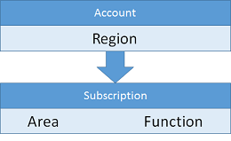

<properties
    pageTitle="Abonnement und Konten Richtlinien | Microsoft Azure"
    description="Informationen Sie zu den wichtigsten Entwurf und Implementierung von Richtlinien für Abonnements und Azure-Konten."
    documentationCenter=""
    services="virtual-machines-linux"
    authors="iainfoulds"
    manager="timlt"
    editor=""
    tags="azure-resource-manager"/>

<tags
    ms.service="virtual-machines-linux"
    ms.workload="infrastructure-services"
    ms.tgt_pltfrm="vm-linux"
    ms.devlang="na"
    ms.topic="article"
    ms.date="09/08/2016"
    ms.author="iainfou"/>

# Richtlinien für Abonnement und Konten

[AZURE.INCLUDE [virtual-machines-linux-infrastructure-guidelines-intro](../../includes/virtual-machines-linux-infrastructure-guidelines-intro.md)] 

Dieser Artikel befasst sich verstehen, wie bei der Verwaltung von Abonnements und Konten als Ihrer Umgebung und Benutzer Basis vergrößert wird.

## Von Implementierungsrichtlinien für Abonnements und Konten

Entscheidungen:

- Welche Festlegen des Abonnements und Konten führen Sie Ihre IT-Arbeitsbelastung oder Infrastruktur hosten müssen?
- Wie kann ich unterbrechen nach unten in der Hierarchie in Ihrer Organisation anpassen?

Aufgaben:

- Definieren Sie Ihre logische Organisationshierarchie, wie Sie es aus einem Abonnement-Level verwalten möchten.
- Um diese logische Hierarchie zuzuordnen, definieren Sie die erforderlichen Konten und Abonnements unter jedem Konto aus.
- Erstellen des Abonnements und Ihren Konten mit Ihrer Benennungskonvention festlegen.

## Abonnements und Konten

Zum Arbeiten mit Azure benötigen Sie ein oder mehrere Azure-Abonnements. Ressourcen wie virtuellen Computern (virtuellen Computern) oder virtuelle Netzwerke in der diese Abonnements vorhanden sind.

- Enterprise-Kunden haben in der Regel ein Enterprise-Registrierung, ist die oberste Ressource in der Hierarchie und mit einem oder mehreren Konten verknüpft ist.
- Für Verbraucher und Kunden, ohne eine Enterprise-Registrierung ist die oberste Ressource das Konto an.
- Abonnements mit Konten verknüpft sind, und kann ein oder mehrere Abonnements pro Konto vorhanden sein. Azure Datensätze Abrechnungsinformationen Ebene der Abonnements.

Aufgrund der maximal zwei Hierarchieebenen der Beziehung Konto/Abonnement ist es wichtig, die Benennungskonvention Konten und Abonnements für die Abrechnung Anforderungen ausrichten. Z. B., wenn ein globaler Konzern Azure verwendet, diese könnten Sie entscheiden, dass ein Konto pro Region und Abonnements auf verwaltet die Region ein:

Sie können beispielsweise die folgende Struktur verwenden:

Wenn Sie ein Bereich beschließt, haben mehr als ein Abonnement für eine bestimmte Gruppe zugeordnet ist, sollte die Benennungskonvention eine Möglichkeit, um die zusätzlichen Daten entweder auf das Konto oder dem Namen des Abonnements codieren einbinden. Diese Organisation ermöglicht Geschäftsdatensätze Abrechnung Daten, um die neuen Ebenen der Hierarchie während des Berichte zu generieren:

Die Organisation kann wie folgt aussehen:

Wir stellen detaillierte Abrechnung über eine Datei herunterladen, für ein einzelnes Konto oder für alle Konten in einem Enterprise Agreement aus.

## Nächste Schritte

[AZURE.INCLUDE [virtual-machines-linux-infrastructure-guidelines-next-steps](../../includes/virtual-machines-linux-infrastructure-guidelines-next-steps.md)] 