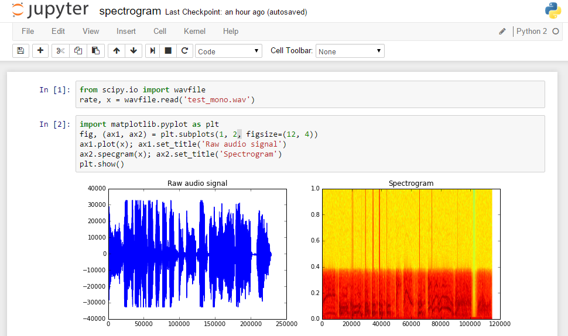
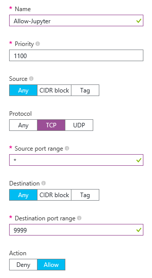
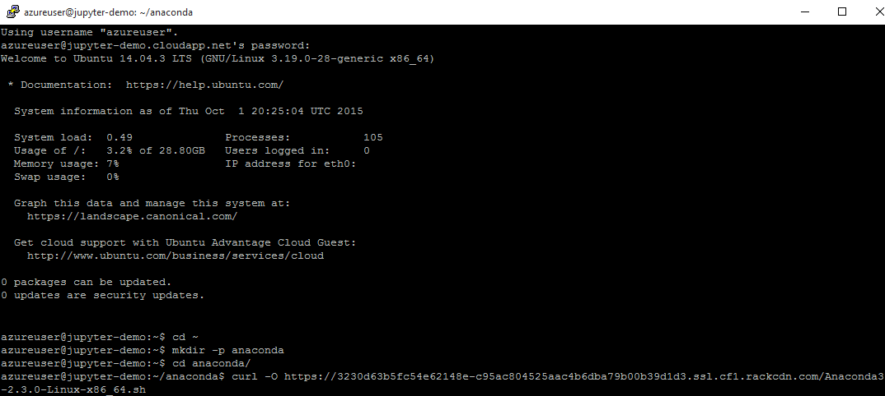
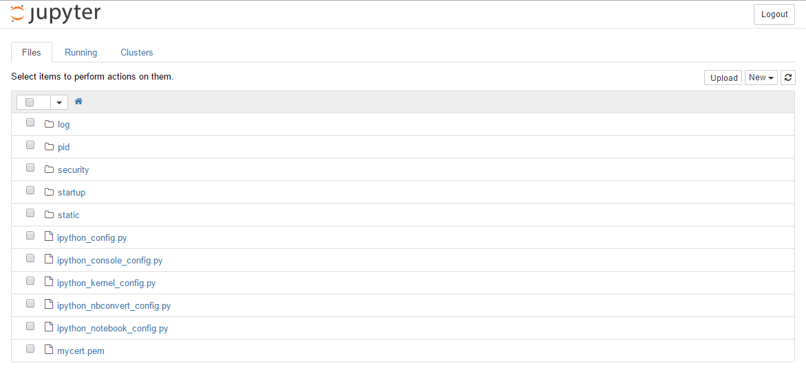
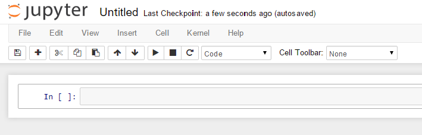
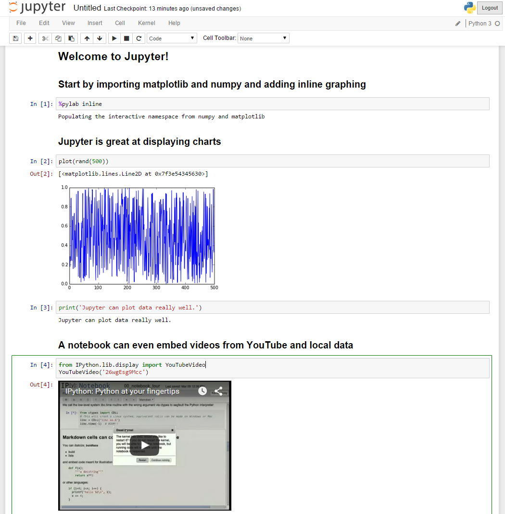

<properties
    pageTitle="Erstellen ein Notizbuchs Jupyter/IPython | Microsoft Azure"
    description="Informationen Sie zum Bereitstellen des Notizbuchs Jupyter/IPython auf einem Linux-Computer mit dem Ressource-Manager Bereitstellungsmodell in Azure erstellt."
    services="virtual-machines-linux"
    documentationCenter="python"
    authors="crwilcox"
    manager="wpickett"
    editor=""
    tags="azure-service-management,azure-resource-manager"/>

<tags
    ms.service="virtual-machines-linux"
    ms.workload="infrastructure-services"
    ms.tgt_pltfrm="vm-linux"
    ms.devlang="python"
    ms.topic="article"
    ms.date="11/10/2015"
    ms.author="crwilcox"/>

# Jupyter Notizbuch auf Azure

Das [Projekt Jupyter](http://jupyter.org), früher [IPython Projekt](http://ipython.org), enthält eine Sammlung von Tools für wissenschaftliche computing mit leistungsfähige interaktive Shells, die Ausführung von Code mit der Erstellung eines Dokuments mit live berechnete kombinieren. Beliebiger Textbereich, mathematische Formeln, Eingabewerte Code, Ergebnisse, Grafiken, Videos und alle anderen Arten von Medien, ein modernen Webbrowser anzeigen kann, können diese Dateien Notizbuch enthalten. Ob Sie absolut bei Python neu und erfahren sie in einer Umgebung Spaß, interaktiven oder führen Sie einige schwerwiegende Parallel/technischen computing möchten, ist das Notizbuch Jupyter eine gute.

 SciPy verwenden und Matplotlib Paketen um die Struktur einer Aufzeichnung sound zu analysieren.

## Jupyter zwei Möglichkeiten: Azure Notizbücher oder benutzerdefinierte Bereitstellung
Azure bietet einen Dienst, den Sie zum [schnellen Einstieg Jupyter ](http://blogs.technet.com/b/machinelearning/archive/2015/07/24/introducing-jupyter-notebooks-in-azure-ml-studio.aspx)verwenden können.  Mithilfe der Azure Notizbuch-Dienst können Sie einfach auf Jupyters Web zugängliche Benutzeroberfläche zu skalierbare berechnete Ressourcen für alle Power Python und deren viele Bibliotheken zugreifen.  Da es sich bei die Installation vom Dienst behandelt wird, können Benutzer diese Ressourcen ohne die Notwendigkeit der Verwaltung und Konfiguration vom Benutzer zugreifen.

Wenn der Notizbuch-Dienst für Ihr Szenario nicht funktioniert fahren Sie mit diesen Artikel lesen, die Sie zum Bereitstellen des Notizbuchs Jupyter auf Microsoft Azure anzeigen wird wird mit Linux virtuellen Computern (virtuellen Computern) an.

[AZURE.INCLUDE [create-account-and-vms-note](../../includes/create-account-and-vms-note.md)]

## Erstellen und Konfigurieren eines virtuellen Computers auf Azure

Der erste Schritt besteht im Erstellen einer virtuellen Computern (virtueller Computer) auf Windows Azure ausgeführte.
Diesem virtuellen Computer ist ein vollständiges Betriebssystem in der Cloud und verwendet werden, um das Notizbuch Jupyter auszuführen. Azure wird dem Linux und Windows-virtuellen Computern ausgeführt werden kann, und die Einrichtung von Jupyter auf beiden Typen von virtuellen Computern werden behandelt.

### Erstellen einer Linux VM, und öffnen Sie einen Port für Jupyter

Folgen Sie den Anweisungen angegebenen [hier] [ portal-vm-linux] zum Erstellen eines virtuellen Computers der Verteilung *Ubuntu* . In diesem Lernprogramm verwendet Ubuntu Server 14.04 LTS. Wir werden die Benutzer Namen *Azureuser*angenommen.

Nachdem der virtuellen Computern bereitstellt müssen wir, um eine Sicherheitsregel auf der Network-Sicherheitsgruppe zu öffnen.  Wechseln Sie zu **Netzwerk Sicherheitsgruppen** im Portal Azure und öffnen Sie die Registerkarte für die Sicherheitsgruppe, die Ihre virtuellen Computer entspricht. Sie müssen eine Regel für eingehende Sicherheit mit der folgenden Einstellungen hinzufügen: **TCP** für das Protokoll **\*** für die (öffentlich) Quellport und **9999** für den Zielport (privat).

Klicken Sie in Ihrem Netzwerk-Sicherheitsgruppe, klicken Sie auf **Netzwerk-Schnittstellen** , und notieren Sie die **Öffentliche IP-Adresse** ein, wie sie die Verbindung zu Ihrem virtuellen Computer im nächsten Schritt erforderlich sein.

## Installieren Sie erforderliche Software des virtuellen Computers

Wenn das Notizbuch Jupyter unsere virtuellen Computers ausführen möchten, müssen wir zuerst Jupyter und die zugehörigen Dateien installieren. Verbinden mit Ihrer Linux virtueller Computer über ssh und das Benutzername und Kennwort verbinden Sie ausgewählt haben, wenn Sie den virtuellen Computer erstellt haben. In diesem Lernprogramm wir kitten verwenden und Verbinden von Windows.

### Installieren von Jupyter auf Ubuntu
Installieren Sie Anaconda einer Verteilung Wissenschaft Python beliebte Daten mithilfe einer der Links von [Kontinuierliche Analytics](https://www.continuum.io/downloads)bereitgestellt werden.  Zum Zeitpunkt der Erstellung dieses Dokuments, der nachfolgend Links zu finden, die am häufigsten auf Datum Versionen.

#### Anaconda-Installationen für Linux
<table>
  <th>Python 3.4</th>
  <th>Python 2.7</th>
  <tr>
    <td>
        <a href='https://3230d63b5fc54e62148e-c95ac804525aac4b6dba79b00b39d1d3.ssl.cf1.rackcdn.com/Anaconda3-2.3.0-Linux-x86_64.sh'>64-bit</href>
    </td>
    <td>
        <a href='https://3230d63b5fc54e62148e-c95ac804525aac4b6dba79b00b39d1d3.ssl.cf1.rackcdn.com/Anaconda-2.3.0-Linux-x86_64.sh'>64-bit</href>
    </td>
  </tr>
  <tr>
    <td>
        <a href='https://3230d63b5fc54e62148e-c95ac804525aac4b6dba79b00b39d1d3.ssl.cf1.rackcdn.com/Anaconda3-2.3.0-Linux-x86.sh'>32-bit</href>
    </td>
    <td>
        <a href='https://3230d63b5fc54e62148e-c95ac804525aac4b6dba79b00b39d1d3.ssl.cf1.rackcdn.com/Anaconda-2.3.0-Linux-x86.sh'>32-bit</href>
    </td>  
  </tr>
</table>

#### Installieren von Anaconda3 2.3.0 64-Bit-on Ubuntu
Als Beispiel handelt es sich um wie Sie Ubuntu Anaconda installieren können

    # install anaconda
    cd ~
    mkdir -p anaconda
    cd anaconda/
    curl -O https://3230d63b5fc54e62148e-c95ac804525aac4b6dba79b00b39d1d3.ssl.cf1.rackcdn.com/Anaconda3-2.3.0-Linux-x86_64.sh
    sudo bash Anaconda3-2.3.0-Linux-x86_64.sh -b -f -p /anaconda3

    # clean up home directory
    cd ..
    rm -rf anaconda/

    # Update Jupyter to the latest install and generate its config file
    sudo /anaconda3/bin/conda install jupyter -y
    /anaconda3/bin/jupyter-notebook --generate-config

### Konfigurieren von Jupyter und unter Verwendung von SSL
Nach der Installation von müssen einen Moment, um die Konfigurationsdateien für diesen Jupyter dauern. Wenn Probleme auftreten, bei der Konfiguration der Jupyter auftreten, kann es hilfreich sein, die [Jupyter Dokumentation zum Ausführen von einem Notizbuch Server](http://jupyter-notebook.readthedocs.org/en/latest/public_server.html)eigenständig sein.

Nächste wir `cd` in das Profilverzeichnis unsere SSL-Zertifikat erstellen und bearbeiten Sie die Konfigurationsdatei Profile.

Klicken Sie auf Linux verwenden Sie den folgenden Befehl ein.

    cd ~/.jupyter

Verwenden Sie den folgenden Befehl aus, um das SSL-Zertifikat (Linux und Windows) erstellen.

    openssl req -x509 -nodes -days 365 -newkey rsa:1024 -keyout mycert.pem -out mycert.pem

Beachten Sie, dass, da beim Herstellen einer Verbindung mit dem Notizbuch Browser Ihnen eine sicherheitswarnung vermitteln ein selbst signiertes Zertifikat für SSL erstellt wird.  Für langfristiges Herstellung verwenden werden Sie ein ordnungsgemäß signiertes Zertifikat zugeordnet Ihrer Organisation verwenden möchten.  Da zertifikatverwaltung Gegenstand dieser Demo ist, werden wir jetzt ein selbst signiertes Zertifikat bleiben.

Zusätzlich zur Verwendung eines Zertifikats, müssen Sie auch ein Kennwort für Ihr Notizbuch vor unbefugtem Zugriff schützen bereitstellen.  Aus Sicherheitsgründen verwendet Jupyter verschlüsselte Kennwörter in seiner Konfigurationsdatei, daher Sie zuerst das Kennwort verschlüsseln müssen.  IPython bietet ein Programm dazu; Führen Sie über die Befehlszeile den folgenden Befehl ein.

    /anaconda3/bin/python -c "import IPython;print(IPython.lib.passwd())"

Dies aufgefordert, ein Kennwort und die Bestätigung und druckt dann das Kennwort ein. Beachten Sie dies für die folgenden Schritte aus.

    Enter password:
    Verify password:
    sha1:b86e933199ad:a02e9592e59723da722.. (elided the rest for security)

Als Nächstes werden wir Konfigurationsdatei des Profils, also Bearbeiten der `jupyter_notebook_config.py` -Datei im Sie befinden sich im Verzeichnis.  Beachten Sie, dass diese Datei möglicherweise nicht vorhanden ist – nur erstellen, wenn dies der Fall ist.  Diese Datei hat eine Reihe von Feldern und standardmäßig alle auskommentierte.  Sie können diese Datei öffnen, mit einem beliebigen Text-Editor des Elemente wie gewünscht, und stellen Sie sicher, dass sie mindestens folgenden Inhalt aufweist. **Achten Sie darauf, dass Sie die c.NotebookApp.password in Config mit der sha1 aus dem vorherigen Schritt ersetzen**.

    c = get_config()

    # You must give the path to the certificate file.
    c.NotebookApp.certfile = u'/home/azureuser/.jupyter/mycert.pem'

    # Create your own password as indicated above
    c.NotebookApp.password = u'sha1:b86e933199ad:a02e9592e5 etc... '

    # Network and browser details. We use a fixed port (9999) so it matches
    # our Azure setup, where we've allowed traffic on that port
    c.NotebookApp.ip = '*'
    c.NotebookApp.port = 9999
    c.NotebookApp.open_browser = False

### Führen Sie das Notizbuch Jupyter

An diesem Punkt können wir das Notizbuch Jupyter beginnen. Dazu, navigieren Sie zu dem Verzeichnis, die, das Sie verwenden möchten, Speichern von Notizbüchern in, und starten Sie den Jupyter Notizbuch-Server mit den folgenden Befehl aus.

    /anaconda3/bin/jupyter-notebook

Sie sollten jetzt zugreifen auf Ihr Notizbuch Jupyter unter der Adresse `https://[PUBLIC-IP-ADDRESS]:9999`.

Wenn Sie zuerst auf Ihr Notizbuch zugreifen, fordert die Anmeldeseite für Ihr Kennwort ein. Und nachdem Sie sich anmelden, sehen Sie "Jupyter Notizbuch Dashboard", welche die uerelement Center für alle Vorgänge der Notizbuch ist.  Von dieser Seite können Sie neue Notizbücher erstellen und vorhandene zu öffnen.

### Verwenden das Notizbuch Jupyter

Wenn Sie die Schaltfläche ' **neu** ' klicken, wird die folgenden öffnenden Seite angezeigt.

Im Bereich markiert mit einer `In []:` Aufforderung das Texteingabebereich ist, können Sie hier einen gültigen Python-Code eingeben und wird ausgeführt, wenn Sie treffen `Shift-Enter` oder klicken Sie auf das Symbol "Wiedergabe" (das Dreieck nach rechts in der Symbolleiste).

## Ein leistungsfähiges Paradigma: live berechnete Dokumente mit Rich-Media-Objekten

Das Notizbuch selbst sollte sehr natürlich für alle Personen Python und ein Word-Prozessor verwendet hat fällt, da es einige Methoden eine Mischung aus beiden ist: Blöcke von Python-Code kann ausgeführt werden, aber Sie können auch beibehalten Notizen und anderen Text durch Ändern des Formats einer eine Zelle aus "Code", "Abzug" mit dem Dropdown Menü auf der Symbolleiste.

Jupyter ist viel mehr als ein Word-Prozessor, da sie ermöglicht das Mischen der Berechnung und Rich-Media-Objekten (Text, Grafiken, Video und nahezu alle Elemente, die ein modernen Webbrowser angezeigt werden kann). Sie können kombinieren, Text, Code, Videos und mehr!

Und mit der Leistungsfähigkeit von Python des zahlreiche hervorragenden Bibliotheken für wissenschaftlichen und technischen computing, in den folgenden Screenshot, eine einfache Berechnung mit der genau so einfach wie eine komplexe Netzwerkanalyse, alle in einer bestimmten Umgebung ausgeführt werden kann.

Dieses Paradigma mischen mit dem moderne Web mit live Berechnung bietet viele mögliche Werte und ist ideal für die Cloud; das Notizbuch kann verwendet werden:

* Arbeiten Sie als eine Berechnung Zwischenablage explorativen aufzeichnen auf ein Problem aufgetreten.

* Um Ergebnisse mit Kollegen zu teilen, klicken Sie entweder in 'live' berechnete Formular oder in der Dokumentation Formate (HTML, PDF-Datei).

* Zum Verteilen und Vorführen live Lehrkräfte Materialien, die Berechnung, betreffen, damit die Kursteilnehmer sofort mit der richtigen Code experimentieren können sie ändern und erneut interaktiv ausführen.

* Geben Sie "ausführbare Paper", die die Ergebnisse der Recherchieren auf eine Weise, die sofort reproduziert, überprüft und erweitert werden kann von anderen Personen zu präsentieren.

* Als Plattform für die Onlinezusammenarbeit computing: mehrere Benutzer auf dem gleichen Notizbuch Server zum Freigeben einer live berechnete Sitzung anmelden können.

Wenn Sie sich an den IPython Quelle Code [Repository][]zugreifen, finden Sie ein gesamtes Verzeichnis mit dem Notizbuch Beispiele für die Sie herunterladen können, und experimentieren Sie mit Ihrer eigenen Azure Jupyter virtuellen Computers.  Laden Sie einfach die `.ipynb` Dateien in der Website und Laden Sie sie auf dem Dashboard des Notizbuchs Azure-virtuellen Computer hoch (oder direkt auf den virtuellen Computer herunterladen).

## Abschluss

Das Notizbuch Jupyter bietet eine leistungsfähige Schnittstelle für den Zugriff auf die Leistungsfähigkeit von der Python-Netz auf Azure interaktiv.  Er umfasst eine Vielzahl von Verwendungsfällen, einschließlich einfache datenauswertung und learning Python, Datenanalyse und Visualisierung, Simulation und parallel computing. Die resultierende Notizbuch Dokumente enthalten eine vollständige Aufzeichnung von den Berechnungen, die ausgeführt werden, und kann mit anderen Benutzern Jupyter freigegeben werden.  Das Notizbuch Jupyter kann als eine lokale Anwendung verwendet werden, aber es ist ideal für Cloud-Bereitstellungen auf Azure

Die wichtigsten Features von Jupyter stehen auch in Visual Studio über die [Python-Tools für Visual Studio][] (PTVS). PTVS ist ein kostenloses und Open Source-Plug-Ins von Microsoft, das in eine erweiterte Python Entwicklung-Umgebung, die einen erweiterten Editor mit IntelliSense, für das Debuggen, umfasst Visual Studio verwandelt, Profilerstellungsdaten oder parallel computing Integration.

## Nächste Schritte

Weitere Informationen finden Sie unter der [Python Developer Center](/develop/python/).

[portal-vm-linux]: https://azure.microsoft.com/en-us/documentation/articles/virtual-machines-linux-tutorial-portal-rm/
[Repository]: https://github.com/ipython/ipython
[Python-Tools für Visual Studio]: http://aka.ms/ptvs
