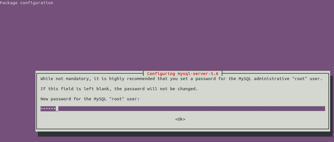
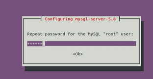

<properties
    pageTitle="Einrichten von MySQL auf einer Linux VM | Microsoft Azure "
    description="Erfahren Sie, wie Sie den Stapel MySQL auf einer Linux virtuellen Computern (Ubuntu oder Red hat Familie OS) in Azure installieren"
    services="virtual-machines-linux"
    documentationCenter=""
    authors="SuperScottz"
    manager="timlt"
    editor=""
    tags="azure-resource-manager,azure-service-management"/>

<tags
    ms.service="virtual-machines-linux"
    ms.workload="infrastructure-services"
    ms.tgt_pltfrm="vm-linux"
    ms.devlang="na"
    ms.topic="article"
    ms.date="02/01/2016"
    ms.author="mingzhan"/>

#So installieren Sie MySQL auf Azure

In diesem Artikel erfahren Sie, wie installieren und Konfigurieren der MySQL auf eine Azure-virtuellen Computern Linux ausgeführt werden.

[AZURE.INCLUDE [learn-about-deployment-models](../../includes/learn-about-deployment-models-both-include.md)]

##Installieren von MySQL auf Ihre virtuellen Computern

> [AZURE.NOTE] Sie müssen bereits ein Microsoft Azure-virtuellen Computers Linux für die Durchführung dieses Lernprogramms ausgeführt. Finden Sie das [Lernprogramm Azure Linux virtueller Computer](virtual-machines-linux-quick-create-cli.md) zu erstellen und Einrichten einer Linux VM mit `mysqlnode` als den Namen des virtuellen Computers und `azureuser` als Benutzer, bevor Sie fortfahren.

Verwenden Sie in diesem Fall 3306 Port als den MySQL-Anschluss.  

Verbinden Sie mit der Linux virtueller Computer, die Sie per kitten erstellt haben. Wenn dies das erste Mal Sie Azure Linux virtuellen Computer verwenden ist, finden Sie unter kitten verwenden Verbinden mit einem Linux VM [hier](virtual-machines-linux-mac-create-ssh-keys.md).

Ein Beispiel in diesem Artikel MySQL5.6 installiert haben, verwenden Sie Repository-Paket. Tatsächlich, hat MySQL5.6 weitere Verbesserung Leistung als MySQL5.5.  Weitere Informationen [hier](http://www.mysqlperformanceblog.com/2013/02/18/is-mysql-5-6-slower-than-mysql-5-5/).

###So installieren Sie MySQL5.6 auf Ubuntu
Wir verwenden hier Linux VM mit Ubuntu aus Azure.

- Schritt 1: Installieren MySQL-Server 5.6 wechseln zu `root` Benutzer:

            #[azureuser@mysqlnode:~]sudo su -

    Installieren von Mysql-Server 5.6:

            #[root@mysqlnode ~]# apt-get update
            #[root@mysqlnode ~]# apt-get -y install mysql-server-5.6

    Während der Installation wird ein Poping im Dialogfeld Fenster nach oben, um die bitten, dass Sie unten MySQL Root-Kennwort festlegen, und Sie müssen das Kennwort hier festlegen angezeigt.

    

    Geben Sie das Kennwort zur Bestätigung erneut ein.

    

- Schritt 2: Login MySQL-Server

    Klicken Sie abschließend MySQL-Server-Installation, wird MySQL-Dienst automatisch gestartet wird. Sie können sich anmelden MySQL-Server mit `root` Benutzer.
    Verwenden Sie die unter Befehl aus, um Anmelde- und Eingabe Kennwort.

             #[root@mysqlnode ~]# mysql -uroot -p

- Schritt 3: Verwalten des laufenden MySQL-Diensts

    Buchstabe a erhalten Sie Status MySQL-Dienst

             #[root@mysqlnode ~]# service mysql status

    Buchstabe b MySQL-Dienst starten

             #[root@mysqlnode ~]# service mysql start

    (c) MySQL-Dienst beenden

             #[root@mysqlnode ~]# service mysql stop

    (d) starten Sie den MySQL-Dienst

             #[root@mysqlnode ~]# service mysql restart

###Wie Sie MySQL auf Rot Hat OS Familie wie CentOS, Oracle Linux installieren
Wir verwenden hier Linux VM mit CentOS oder Oracle Linux.

- Schritt 1: Hinzufügen das MySQL Yum Repository wechseln zu `root` Benutzer:

            #[azureuser@mysqlnode:~]sudo su -

    Herunterladen Sie und installieren Sie das MySQL-Release-Paket:

            #[root@mysqlnode ~]# wget http://repo.mysql.com/mysql-community-release-el6-5.noarch.rpm
            #[root@mysqlnode ~]# yum localinstall -y mysql-community-release-el6-5.noarch.rpm

- Schritt 2: Bearbeiten Sie unter Datei zum Aktivieren des MySQL-Repository für das Paket MySQL5.6 herunterladen.

            #[root@mysqlnode ~]# vim /etc/yum.repos.d/mysql-community.repo

    Aktualisieren Sie jeden Wert dieser Datei unten aus:

        \# *Enable to use MySQL 5.6*

        [mysql56-community]
        name=MySQL 5.6 Community Server

        baseurl=http://repo.mysql.com/yum/mysql-5.6-community/el/6/$basearch/

        enabled=1

        gpgcheck=1

        gpgkey=file:/etc/pki/rpm-gpg/RPM-GPG-KEY-mysql

- Schritt 3: Installieren MySQL aus MySQL-Repository MySQL installieren:

           #[root@mysqlnode ~]#yum install mysql-community-server

    MySQL u/Min-Paket und alle zugehörigen Pakete werden installiert.

- Schritt 4: Verwalten des laufenden MySQL-Diensts

    Buchstabe a Überprüfen des Dienststatus der MySQL-Server:

           #[root@mysqlnode ~]#service mysqld status

    (b) überprüfen Sie, ob der Standard-Anschluss der MySQL-Server ausgeführt wird:

           #[root@mysqlnode ~]#netstat  –tunlp|grep 3306

    (c) den MySQL-Server zu starten:

           #[root@mysqlnode ~]#service mysqld start

    (d) Beenden des MySQL-Servers:

           #[root@mysqlnode ~]#service mysqld stop

    (e) MySQL festlegen, um beim Starten der System Boot auszurichten:

           #[root@mysqlnode ~]#chkconfig mysqld on

###So installieren Sie MySQL unter SUSE Linux
Wir verwenden hier Linux VM mit OpenSUSE.

- Schritt 1: Herunterladen und Installieren von MySQL-Server

    Wechseln Sie zur `root` Benutzer über unter Befehl:  

           #sudo su -

    Herunterladen und Installieren von MySQL-Paket:

           #[root@mysqlnode ~]# zypper update

           #[root@mysqlnode ~]# zypper install mysql-server mysql-devel mysql

- Schritt 2: Verwalten des laufenden MySQL-Diensts

    Buchstabe a Überprüfen des Status der MySQL-Server:

           #[root@mysqlnode ~]# rcmysql status

    (b) überprüfen, ob der MySQL-Server Standardport:

           #[root@mysqlnode ~]# netstat  –tunlp|grep 3306

    (c) den MySQL-Server zu starten:

           #[root@mysqlnode ~]# rcmysql start

    (d) Beenden des MySQL-Servers:

           #[root@mysqlnode ~]# rcmysql stop

    (e) MySQL festlegen, um beim Starten der System Boot auszurichten:

           #[root@mysqlnode ~]# insserv mysql

###Als Nächstes
Suchen nach weiteren Verwendung und Informationen zu MySQL [hier](https://www.mysql.com/).
