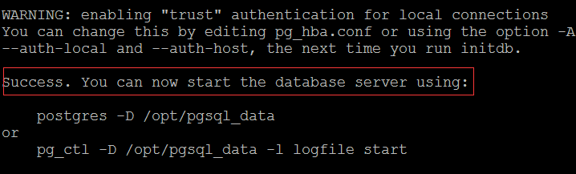
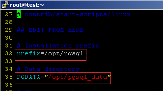
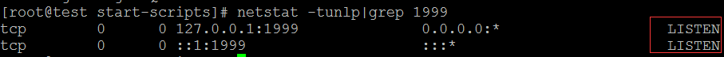
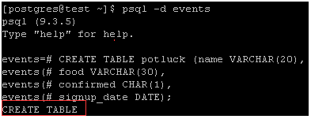
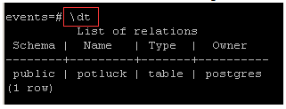
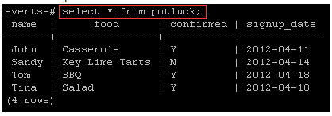

<properties
    pageTitle="Einrichten von PostgreSQL auf einer Linux VM | Microsoft Azure"
    description="Informationen Sie zum Installieren und Konfigurieren von PostgreSQL auf einer Linux virtuellen Computern in Azure"
    services="virtual-machines-linux"
    documentationCenter=""
    authors="SuperScottz"
    manager="timlt"
    editor=""
    tags="azure-resource-manager,azure-service-management"/>

<tags
    ms.service="virtual-machines-linux"
    ms.devlang="na"
    ms.topic="article"
    ms.tgt_pltfrm="vm-linux"
    ms.workload="infrastructure-services"
    ms.date="02/01/2016"
    ms.author="mingzhan"/>

# Installieren und Konfigurieren der PostgreSQL auf Azure

PostgreSQL ist eine erweiterte Open Source-Datenbank, die ähnliche Oracle und DB2. Sie enthält Funktionen für Unternehmen wie vollständige ACID Compliance, zuverlässigen Transaktionen Verarbeitung und mit mehreren Versionen Konfliktmodell aus. Darüber hinaus unterstützt Standards wie ANSI SQL und SQL/MED (einschließlich Fremdschlüssel Daten Wrappern für Oracle, MySQL, MongoDB und viele andere). Es wird dringend extensible mit Unterstützung für über 12 zu Vorgehensweisen Sprachen, GIN und die Überschrift Indizes, raumgeometrischen Datensupport und mehrere NoSQL vergleichbare Features für JSON oder Schlüssel-Wert-basierten Programme.

In diesem Artikel erfahren Sie, wie installieren und Konfigurieren der PostgreSQL auf eine Azure-virtuellen Computern Linux ausgeführt werden.

[AZURE.INCLUDE [learn-about-deployment-models](../../includes/learn-about-deployment-models-both-include.md)]

## PostgreSQL installieren

> [AZURE.NOTE] Sie müssen bereits eine Azure-virtuellen Computern Linux für die Durchführung dieses Lernprogramms ausgeführt. Zum Erstellen und Einrichten einer Linux VM bevor Sie fortfahren, finden Sie das [Lernprogramm Azure Linux virtuellen Computer](virtual-machines-linux-quick-create-cli.md)aus.

Verwenden Sie in diesem Fall Port 1999 als den PostgreSQL-Anschluss.  

Verbinden Sie mit der Linux virtueller Computer, die Sie per kitten erstellt haben. Wenn dies das erste Mal Sie eine Azure Linux virtuellen Computer verwenden ist, finden Sie unter [So verwenden Sie SSH mit Linux auf Azure](virtual-machines-linux-mac-create-ssh-keys.md) erfahren, wie kitten Verbindung zu einem Linux VM verwenden.

1. Führen Sie den folgenden Befehl werden im Stammordner (Admin) wechseln:

        # sudo su -

2. Einige Verteilung haben Abhängigkeiten, die Sie vor der Neuinstallation PostgreSQL installieren müssen. Überprüfen Sie Ihre Distro in dieser Liste, und führen Sie den entsprechenden Befehl ein:

    - Red Hat Basis Linux:

            # yum install readline-devel gcc make zlib-devel openssl openssl-devel libxml2-devel pam-devel pam  libxslt-devel tcl-devel python-devel -y  

    - Debian Basis Linux:

            # apt-get install readline-devel gcc make zlib-devel openssl openssl-devel libxml2-devel pam-devel pam libxslt-devel tcl-devel python-devel -y  

    - SUSE Linux:

            # zypper install readline-devel gcc make zlib-devel openssl openssl-devel libxml2-devel pam-devel pam  libxslt-devel tcl-devel python-devel -y  

3. Herunterladen Sie PostgreSQL in des Stammverzeichnisses, und Entzippen Sie das Paket aus:

        # wget https://ftp.postgresql.org/pub/source/v9.3.5/postgresql-9.3.5.tar.bz2 -P /root/

        # tar jxvf  postgresql-9.3.5.tar.bz2

    Oben ist ein Beispiel. Sie können die ausführlichere Download Adresse im Index/pub/Quelle/suchen.

4. Um den Build zu starten, führen Sie folgende Befehle aus:

        # cd postgresql-9.3.5

        # ./configure --prefix=/opt/postgresql-9.3.5

5. Wenn Sie möchten, um alles zu erstellen, die erstellt werden können, einschließlich der Dokumentation (HTML- und Mann Seiten) und zusätzliche Module (für die Altersvorsorge), führen Sie stattdessen den folgenden Befehl aus:

        # gmake install-world

    Sie sollten die folgende Fehlermeldung erhalten:

        PostgreSQL, contrib, and documentation successfully made. Ready to install.

## Konfigurieren der PostgreSQL

1. (Optional) Erstellen Sie einen symbolic Link zum Verkürzen des PostgreSQL-Verweis, um die Versionsnummer nicht enthalten:

        # ln -s /opt/pgsql9.3.5 /opt/pgsql

2. Erstellen Sie ein Verzeichnis für die Datenbank ein:

        # mkdir -p /opt/pgsql_data

3. Erstellen eines Benutzers nicht Root und Profil des Benutzers ändern. Wechseln Sie dann zu diesen neuen Benutzer (genannt *Postgres* in diesem Beispiel):

        # useradd postgres

        # chown -R postgres.postgres /opt/pgsql_data

        # su - postgres

   > [AZURE.NOTE] Aus Gründen der Sicherheit verwendet PostgreSQL ein Benutzers nicht Root Initialisierung, starten, oder fahren Sie die Datenbank an.

4. Bearbeiten Sie die Datei *Bash_profile* , indem Sie die folgenden Befehle eingeben. Diese Zeilen werden an das Ende der Datei *Bash_profile* hinzugefügt:

        cat >> ~/.bash_profile <<EOF
        export PGPORT=1999
        export PGDATA=/opt/pgsql_data
        export LANG=en_US.utf8
        export PGHOME=/opt/pgsql
        export PATH=\$PATH:\$PGHOME/bin
        export MANPATH=\$MANPATH:\$PGHOME/share/man
        export DATA=`date +"%Y%m%d%H%M"`
        export PGUSER=postgres
        alias rm='rm -i'
        alias ll='ls -lh'
        EOF

5. Führen Sie die *Bash_profile* -Datei ein:

        $ source .bash_profile

6. Überprüfen Sie Ihre Installation mit dem folgenden Befehl aus:

        $ which psql

    Wenn die Installation erfolgreich ist, wird die folgende Antwort angezeigt:

        /opt/pgsql/bin/psql

7. Sie können auch die PostgreSQL-Version aktivieren:

        $ psql -V

8. Initialisierung der Datenbank an:

        $ initdb -D $PGDATA -E UTF8 --locale=C -U postgres -W

    Sie sollten die folgende Ausgabe erhalten:

## Einrichten von PostgreSQL

<!--    [postgres@ test ~]$ exit -->

Führen Sie die folgenden Befehle:

    # cd /root/postgresql-9.3.5/contrib/start-scripts

    # cp linux /etc/init.d/postgresql

Ändern Sie zwei Variablen in der Datei /etc/init.d/postgresql. Das Präfix auf des Installationspfads PostgreSQL festgelegt ist: **/opt/pgsql**. PGDATA auf den Pfad der PostgreSQL-Speicher festgelegt ist: **/opt/pgsql_data**.

    # sed -i '32s#usr/local#opt#' /etc/init.d/postgresql

    # sed -i '35s#usr/local/pgsql/data#opt/pgsql_data#' /etc/init.d/postgresql

Ändern Sie die Datei ausreicht ausführbare an:

    # chmod +x /etc/init.d/postgresql

PostgreSQL zu starten:

    # /etc/init.d/postgresql start

Überprüfen Sie der PostgreSQL-Endpunkt ist auf:

    # netstat -tunlp|grep 1999

Die folgende Ausgabe sollte angezeigt werden:

## Verbinden Sie mit der Datenbank Postgres

Wechseln Sie zu der Postgres Benutzer erneut:

    # su - postgres

Erstellen einer Datenbank Postgres:

    $ createdb events

Verbinden Sie mit der Ereignisse-Datenbank, die Sie soeben erstellt haben:

    $ psql -d events

## Erstellen und Löschen einer Tabelle Postgres

Jetzt, da Sie mit der Datenbank verbunden haben, können Sie darin Tabellen erstellen.

Beispielsweise Erstellen eines neuen Postgres Beispieltabelle mit dem folgenden Befehl aus:

    CREATE TABLE potluck (name VARCHAR(20), food VARCHAR(30),   confirmed CHAR(1), signup_date DATE);

Sie haben eine Tabelle vier Spalten mit den folgenden Spaltennamen und Einschränkungen jetzt eingerichtet:

1. Die Spalte "Name" beschränkte wurde durch den Befehl VARCHAR unter 20 Zeichen lang sein.
2. Die Spalte "Lebensmittel" zeigt das nahrungsmittelelement jede Person zu werden, die an. VARCHAR beschränkt diesen Text, um unter 30 Zeichen lang sein.
3. Die Spalte "bestätigte" Einträge, ob die Person, die Buffet um Antwort gebeten hat. Die zulässigen Werte sind "Y" und "N".
4. Der "Date" Spalte wird angezeigt, wenn sie für das Ereignis registriert. Postgres erfordert, dass Datumsangaben geschrieben werden können, als jjjj-mm-tt.

Sie sollten Folgendes angezeigt werden, wenn die Tabelle erfolgreich erstellt wurde:

Sie können auch die Tabellenstruktur überprüfen, indem Sie mit den folgenden Befehl aus:

### Hinzufügen von Daten zu einer Tabelle

Fügen Sie zuerst die Informationen in einer Zeile:

    INSERT INTO potluck (name, food, confirmed, signup_date) VALUES('John', 'Casserole', 'Y', '2012-04-11');

Diese Ausgabe sollte angezeigt werden:

Sie können der Tabelle sowie einigen weitere Personen hinzufügen. Hier sind einige Optionen aus, oder Sie können eigene Farbschemas erstellen:

    INSERT INTO potluck (name, food, confirmed, signup_date) VALUES('Sandy', 'Key Lime Tarts', 'N', '2012-04-14');

    INSERT INTO potluck (name, food, confirmed, signup_date) VALUES ('Tom', 'BBQ','Y', '2012-04-18');

    INSERT INTO potluck (name, food, confirmed, signup_date) VALUES('Tina', 'Salad', 'Y', '2012-04-18');

### Anzeigen von Tabellen

Verwenden Sie den folgenden Befehl, um eine Tabelle anzuzeigen:

    select * from potluck;

Die Ausgabe lautet:

### Löschen von Daten in einer Tabelle

Verwenden Sie den folgenden Befehl zum Löschen von Daten in einer Tabelle ein:

    delete from potluck where name=’John’;

Hierdurch werden alle Informationen in der Zeile "Johann" gelöscht. Die Ausgabe lautet:

### Aktualisieren von Daten in einer Tabelle

Verwenden Sie den folgenden Befehl zum Aktualisieren von Daten in einer Tabelle ein. Für diesen Termin hat Sandy bestätigt, dass Anna teilnimmt, also wir ihre Antwort aus der "N" auf "Y" ändern:

    UPDATE potluck set confirmed = 'Y' WHERE name = 'Sandy';

##Informationen Sie weitere zu PostgreSQL
Jetzt, da Sie die Installation von PostgreSQL einer Azure Linux virtuellen Computer abgeschlossen haben, können Sie genießen, es in Azure verwendet wird. Besuchen Sie die [PostgreSQL-Website](http://www.postgresql.org/), um weitere Informationen zu den PostgreSQL.
