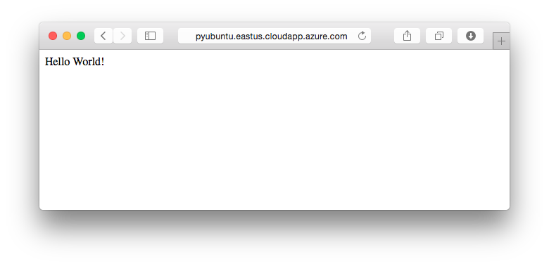

<properties 
    pageTitle="Python web app mit Django auf Linux | Microsoft Azure" 
    description="Erfahren Sie, wie eine Django-basierten Web-Anwendung unter Verwendung eines Linux virtuellen Computers Azure hosten." 
    services="virtual-machines-linux" 
    documentationCenter="python" 
    authors="huguesv" 
    manager="wpickett" 
    editor=""
    tags="azure-resource-manager"/>

<tags 
    ms.service="virtual-machines-linux" 
    ms.workload="web" 
    ms.tgt_pltfrm="vm-linux" 
    ms.devlang="python" 
    ms.topic="article" 
    ms.date="11/17/2015" 
    ms.author="huvalo"/>
    
# Web-Anwendung auf einer Linux VM Django Hallo Welt

> [AZURE.SELECTOR]
- [Windows](virtual-machines-windows-classic-python-django-web-app.md)
- [Mac/Linux](virtual-machines-linux-python-django-web-app.md)

 

In diesem Lernprogramm beschrieben, wie eine Website Django basierend auf Microsoft Azure Verwendung eines Linux virtuellen Computers zu hosten. In diesem Lernprogramm wird davon ausgegangen, dass Sie keine vorherige Erfahrung mit Azure haben. Nach Abschluss dieses Handbuch, haben Sie eine Django-basierte Anwendung nach oben und in der Cloud ausgeführt.

Erfahren Sie, wie Sie:

* Einrichten einer Azure-virtuellen Computern an Host Django. Während in diesem Lernprogramm wird erläutert, wie dies unter **Linux**zu erreichen, konnte identisch mit eines Windows Server virtuellen Computers in Azure gehostet wird auch vorgenommen werden. 
* Erstellen Sie eine neue Django Anwendung von Linux.

Anhand dieses Lernprogramms erstellen Sie eine einfache Hallo Welt Web-Anwendung. Die Anwendung wird in einer Azure-virtuellen Computern gehostet werden.

Ein Screenshot der fertigen Anwendung lautet wie folgt:

[AZURE.INCLUDE [create-account-and-vms-note](../../includes/create-account-and-vms-note.md)]

## Erstellen und Konfigurieren einer Azure-virtuellen Computern an Host Django

1. Folgen Sie den Anweisungen angegebenen [hier](virtual-machines-linux-quick-create-portal.md) eine Azure-virtuellen Computern der Verteilung *Ubuntu Server 14.04 LTS* zu erstellen.  Wenn Sie es vorziehen, können Sie anstelle von SSH öffentlicher Schlüssel Kennwortauthentifizierung auswählen.

1. Bearbeiten die Netzwerk-Sicherheitsgruppe eingehender http-Datenverkehr an Port 80 anhand der Anweisungen zulässig [hier](../virtual-network/virtual-networks-create-nsg-arm-pportal.md).

1. Standardmäßig wird nicht der neuen virtuellen Computern einen vollqualifizierten Domänennamen (FULLY) haben.  Sie können eine anhand der Anweisungen erstellen [können](virtual-machines-linux-portal-create-fqdn.md).  Dieser Schritt ist optional zum Bearbeiten dieses Lernprogramms.

## Einrichten der Entwicklungsumgebung

**Hinweis:** Wenn Sie noch Python installiert oder die Client-Bibliotheken verwenden möchten, finden Sie unter der [Python Installation Guide](../python-how-to-install.md).

Den Ubuntu Linux virtuellen Computer bereits im Lieferumfang von Python 2.7 vorinstalliert, aber es keine Apache oder Django installiert haben.  Wie folgt vor, um eine Verbindung mit Ihrem virtuellen Computer und Apache und Django zu installieren.

1.  Starten Sie ein neues **Terminal** -Fenster an.
    
1.  Geben Sie den folgenden Befehl für die Verbindung zu den Azure-virtuellen Computer an.  Wenn Sie einen vollqualifizierten Domänennamen erstellt haben, können Sie eine Verbindung herstellen, mithilfe der öffentlichen IP-Adresse des virtuellen Computers im klassischen Azure-Portal Zusammenfassung angezeigt.

        $ ssh yourusername@yourVmUrl

1.  Geben Sie die folgenden Befehle, Django zu installieren:

        $ sudo apt-get install python-setuptools python-pip
        $ sudo pip install django

1.  Geben Sie zum Installieren von Apache mit mod-Wsgi den folgenden Befehl aus:

        $ sudo apt-get install apache2 libapache2-mod-wsgi

## Erstellen einer neuen Django-Anwendung

1.  Öffnen Sie das **Terminal** -Fenster, die, das Sie im vorherigen Abschnitt ssh in Ihrer virtuellen Computer verwendet.
    
1.  Geben Sie die folgenden Befehle zum Erstellen eines neuen Projekts von Django aus:

        $ cd /var/www
        $ sudo django-admin.py startproject helloworld

    Das Skript **Django-admin.py** generiert eine einfache Struktur für Django-basierten Websites:
    -   **HelloWorld/Manage.py** hilft Ihnen bei Hostinganbieter starten und Beenden Ihrer Website Django-basierten Hostinganbieter
    -   **HelloWorld/HelloWorld/Settings.py** enthält Django Einstellungen für eine Anwendung.
    -   **HelloWorld/HelloWorld/URLs.py** enthält die Zuordnung zwischen den einzelnen Url und die Ansicht.

1.  Erstellen Sie eine neue Datei namens **views.py** im Verzeichnis **/var/www/helloworld/helloworld** . Dadurch wird die Ansicht enthalten, die Ausgabe der Seite "Hallo Welt". Starten Sie Editor, und geben Sie Folgendes ein:
        
        from django.http import HttpResponse
        def home(request):
            html = "<html><body>Hello World!</body></html>"
            return HttpResponse(html)

1.  Ersetzen Sie nun den Inhalt der Datei **urls.py** durch Folgendes ein:

        from django.conf.urls import patterns, url
        urlpatterns = patterns('',
            url(r'^$', 'helloworld.views.home', name='home'),
        )

## Einrichten von Apache

1.  Erstellen einer Apache virtuelle Host Konfiguration Datei **/etc/apache2/sites-available/helloworld.conf**. Legen Sie den Inhalt auf Folgendes, und Ersetzen Sie *YourVmName* durch den tatsächlichen Namen des Computers (zum Beispiel *Pyubuntu verwenden*).

        <VirtualHost *:80>
        ServerName yourVmName
        </VirtualHost>
        WSGIScriptAlias / /var/www/helloworld/helloworld/wsgi.py
        WSGIPythonPath /var/www/helloworld

1.  Aktivieren Sie die Website mit dem folgenden Befehl ein:

        $ sudo a2ensite helloworld

1.  Starten Sie Apache mit den folgenden Befehl aus:

        $ sudo service apache2 reload

1.  Laden Sie schließlich die Webseite in Ihrem Browser ein:

    

## Beenden der Azure-virtuellen Computern

Wenn Sie damit fertig sind mit diesem Lernprogramm, war(en) und/oder Entfernen der neu erstellten Azure-virtuellen Computern Ressourcen für andere Lernprogramme freizugeben und zu vermeiden, dass Azure Verwendung Gebühren anfallen.
