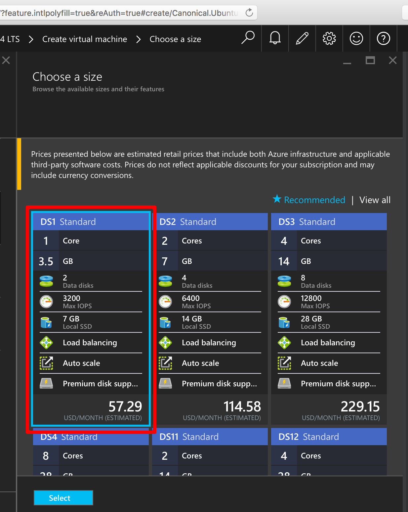
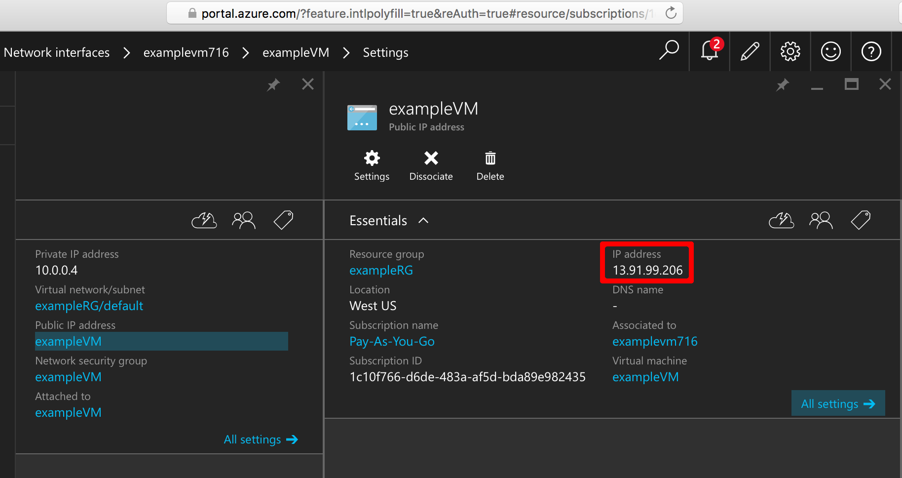

<properties
    pageTitle="Erstellen einer Linux VM Verwenden des Portals Azure | Microsoft Azure"
    description="Erstellen einer Linux VM mithilfe der Azure-Portal an."
    services="virtual-machines-linux"
    documentationCenter=""
    authors="vlivech"
    manager="timlt"
    editor=""
    tags="azure-resource-manager"
/>

<tags
    ms.service="virtual-machines-linux"
    ms.workload="infrastructure-services"
    ms.tgt_pltfrm="vm-linux"
    ms.devlang="na"
    ms.topic="hero-article"
    ms.date="10/25/2016"
    ms.author="v-livech"
/>

# <a name="create-a-linux-vm-on-azure-using-the-portal"></a>Erstellen einer Linux VM auf Azure Verwenden des Portals


In diesem Artikel wird gezeigt, wie das [Azure-Portal](https://portal.azure.com/) zum Erstellen eines Linux virtuellen Computers verwendet werden können.

Die Anforderungen sind:

- [ein Azure-Konto](https://azure.microsoft.com/pricing/free-trial/)

- [SSH öffentliche und private Schlüssel Dateien](virtual-machines-linux-mac-create-ssh-keys.md)


1. Klicken Sie in der Azure-Portal für Ihre Kontoidentität Azure-angemeldet, **+ neu** in der oberen linken Ecke auf:

    

2. Klicken Sie auf **virtuellen Computern** in der **Marketplace** **Ubuntu Server 14.04 LTS** aus den **Bereitgestellten Apps** Liste Bilder.  Unten überprüfen, ob das Modell zur Bereitstellung von `Resource Manager` , und klicken Sie dann auf **Erstellen**.

    

3. Geben Sie auf der Seite **Grundlagen** :
    - einen Namen für den virtuellen Computer
    - ein Benutzername für den Administrator-Benutzer
    - Legen Sie den Authentifizierungstyp auf **SSH öffentlicher Schlüssel**
    - Ihre SSH öffentlicher Schlüssel als Zeichenfolge (aus Ihrer `~/.ssh/` Verzeichnis)
    - eine Ressource Gruppennamen oder Auswählen einer vorhandenen Gruppe

    und klicken Sie auf **OK** , um weiterhin, und wählen Sie die Größe des virtuellen Computer; Es sollte nun wie folgt aussehen:

    

4. Wählen Sie die Größe **DS1** , die welche Ubuntu auf eine SSD Premium Installationen aus, und klicken Sie auf **auswählen** , um Einstellungen konfigurieren.

    

5. Lassen Sie die Standardeinstellungen für den Speicher und Netzwerk-Werte in den **Einstellungen**, und klicken Sie auf **OK** , um die Zusammenfassung anzuzeigen.  Beachten Sie die Art der Datenträger zu Premium SSD durch Auswahl DS1 festgelegt wurde, die **S** notates SSD.

    

6. Bestätigen Sie die Einstellungen für Ihre neue Ubuntu VM, und klicken Sie auf **OK**.

    

7. Öffnen Sie das Dashboard-Portal, und wählen Sie im **Netzwerk-Schnittstellen** Ihrer NIC

    

8. Öffnen des Menüs öffentliche IP-Adressen, klicken Sie unter der NIC-Einstellungen

    

9. SSH in öffentliche IP-Adresse, die mit Ihrem öffentlichen SSH-Schlüssel

```
ssh -i ~/.ssh/azure_id_rsa ubuntu@13.91.99.206
```

## <a name="next-steps"></a>Nächste Schritte

Jetzt haben Sie eine Linux VM schnell zu testen oder Demo Zwecken einsetzen erstellt. Zum Erstellen einer Linux VM angepasst für Ihre Infrastruktur, führen Sie eine der folgenden Artikel.

- [Erstellen einer Linux VM auf Azure mithilfe von Vorlagen](virtual-machines-linux-cli-deploy-templates.md)
- [Erstellen einer SSH gesicherter Linux virtueller Computer auf Azure mithilfe von Vorlagen](virtual-machines-linux-create-ssh-secured-vm-from-template.md)
- [Erstellen einer Linux VM mithilfe der Azure-CLI](virtual-machines-linux-create-cli-complete.md)
