<properties
   pageTitle="Schnellstarthandbuch für die manuelle Installation von SAP-HANA auf Azure-virtuellen Computern | Microsoft Azure"
   description="Schnellstarthandbuch für die manuelle Installation von SAP-HANA auf Azure-virtuellen Computern"
   services="virtual-machines-linux"
   documentationCenter=""
   authors="hermanndms"
   manager="timlt"
   editor=""
   tags="azure-resource-manager"
   keywords=""/>
<tags
   ms.service="virtual-machines-linux"
   ms.devlang="na"
   ms.topic="article"
   ms.tgt_pltfrm="vm-linux"
   ms.workload="infrastructure-services"
   ms.date="09/15/2016"
   ms.author="hermannd"/>

# Schnellstarthandbuch für die manuelle Installation von einer Instanz von SAP-HANA auf Azure-virtuellen Computern

## Einführung

Dieses Schnellstarthandbuch hilft ein einzelner Instanz SAP-HANA Prototypen/Demo System auf Azure-virtuellen Computern durch eine manuelle Installation von SAP NetWeaver 7.5 und SAP-HANA SP12 einrichten.
Die Führungslinie wird davon ausgegangen, dass der Leser Azure IaaS Grundlagen wie Gewusst wie: Bereitstellen von virtuellen Computern oder virtuelle Netzwerke, entweder über den Azure-Portal oder die Option zum Json-Vorlagen verwenden, einschließlich Powershell/CLI vertraut ist. Darüber hinaus wird davon ausgegangen, dass der Leser mit SAP-HANA, SAP NetWeaver und die lokale Installation vertraut ist.

Es wird davon ausgegangen, dass der Leser der allgemeinen SAP-Azure-Dokumentation im Abschnitt Allgemeine Informationen am Ende dieses Artikels genannten bekannt sind.

Aufgrund der Einschränkung zu nicht genutzten mit diesem Leitfaden nicht umfasst Themen wie HA, sichern, DR, hohe Leistung oder besondere Sicherheitsaspekte.

Das Beispiel-Setup abgeschlossen wurde zwei virtuellen Computern einsetzen, um eine verteilte SAP NetWeaver Installation über das Modell Azure Ressourcenmanager zu erreichen, da SAP-Linux-Azure nur auf Azure Ressourcenmanager und nicht die Klassisch unterstützt wird. Links zu weiteren Informationen zu Azure Ressourcenmanager finden Sie im Abschnitt Allgemeine Informationen am Ende dieses Artikels.

Diese wurden die zwei Test virtuellen Computern, die für die Installation der Beispieldaten verwendet:

* Hana-der Appsrv (Typ DS3) zu hosten, die Instanz NW 7.5 ASCS + PAS
* Hana Dbsrv (Typ GS4) zum Host HANA SP12
* beide virtuellen Computern gehört hat eine Azure-virtuellen Netzwerk (Azure-Hana-Test-Vnet)
* In beiden Fällen OS wurde SLES 12 SP1

Achten Sie die Fakultät durch, bis zum Juli 2016 SAP-HANA für OLAP-(BW) Herstellung Betriebssysteme auf Azure-virtuellen Computer GS5 nur vollständig unterstützt wird. Zu Testzwecken, wo eine öffentliche SAP-Unterstützung nicht erwartet wird, ist es fein ein Element wie z. B. GS4 kleinere zu verwenden.
Was immer verwendet werden sollte für SAP-HANA auf Azure Azure Premium Speicher für HANA Daten und Protokolldateien - ist finden Sie unter "Einrichten der Datenträger" Abschnitt weiteren unten. Überprüfen Sie im Abschnitt Allgemeine Informationen am Ende dieses Artikels, Bezug auf Weitere Details zu der SAP-Produkte auf Azure unterstützt werden.

Die Anleitung beschreibt zwei verschiedene Verfahren zum SAP-HANA auf Azure-virtuellen Computern manuell zu installieren:

* Installieren von SAP-HANA über SAP-Software Bereitstellung Manager (SWPM) als Teil einer verteilten NetWeaver Installation Schritt "Datenbankinstanz"
* Installieren Sie SAP-HANA mithilfe der HANA Lebenszyklus Manager Tool Hdblcm und dann NetWeaver danach

Es ist es möglich, verwenden Sie SWPM und alle Komponenten (SAP-HANA, SAP-Anwendungsserver, ASCS Instanz, SAP-Benutzeroberfläche) auf einem einzelnen virtuellen Computer installieren. Diese Option ist nicht in diesem Artikel beschriebenen, aber die Elemente der sind zu berücksichtigen sind gleich.

Vor dem Starten einer Installations sollten im Abschnitt nach der Checklisten unter über das Einrichten der Test Azure-virtuellen Computern gelesen werden, um mehrere grundlegende Fehler zu vermeiden, die eintritt, wenn nur eine Standard Azure-virtuellen Computer Konfiguration verwenden.

## Checkliste HANA SAP-Installation über SAP-SWPM

Dies ist eine einfache Checkliste für die Taste, die Elemente im Zusammenhang mit einer manuellen einzelner Instanz HANA SAP-Installation für Demo oder Prototypen Pursposes über SAP-SWPM Ausführen einer verteilten SAP-NW 7.5 installieren. Die einzelnen Elemente sind Erläuterung und in Form von Screenshots im Laufe der Artikel noch ausführlicher dargestellt:

* Erstellen Sie ein Azure-virtuelles Netzwerk, das welche die zwei Test virtuellen Computern enthalten sein sollen 
* Bereitstellen von zwei Azure virtuellen Computern mit OS SLES 12 SP1 über Ressourcenmanager Azure-Modell 
* Anfügen von zwei standard-Speicherdatenträger auf dem Server app virtueller Computer (z. B. 75GB und 500GB)
* Anfügen von vier Datenträger auf dem Server HANA DB Virtueller Computer - 2 standard-Datenträger wie für die app-Server virtueller Computer + 2 Premium-Datenträger (z. B. 2x512GB)
* Anfügen von je nach Größe und/oder Durchsatz Anforderungen mehrere Datenträger und erstellen Sie aufgeteilte Datenträger entweder auf Ebene der OS innerhalb des virtuellen Computers Lvm oder Mdadm verwenden
* XFS Dateisysteme erstellen, klicken Sie auf die angefügte Datenträger / logische Datenmengen
* Stellen Sie die neuen XFS Dateisysteme auf OS Ebene bereit. Verwenden Sie eine Dateisystem die SAP-Software und den anderen aus, z. B. für das Sapmnt Directory und vielleicht Sicherungskopien beibehalten aus. Klicken Sie auf die SAP-HANA DB Datei Server Bereitstellen der XFS Systeme auf die Premium-Datenträger als /hana und /usr/sap, dies zu vermeiden, dass voll ist im Stamm Dateisystem, das auf Linux Azure-virtuellen Computern zu groß ist nicht alle erforderlich ist
* Geben Sie die lokale IP-Adressen des virtuellen Computern Tests in/usw./hosts
* Geben Sie den Parameter Nofail in/etc/fstab
* Festlegen von Parametern Kernel entsprechend die Notiz SAP HANA-SLES-12 (siehe unten Details im Abschnitt Parameter Kernel werden weitere)
* Hinzufügen von Schreibraum austauschen
* Wenn unerwünscht - installieren Sie einen grafischen Desktop klicken Sie auf die Teststatistik eines virtuellen Computern ein. Andernfalls können mit einer Sapinst remote-Installation
* die SAP-Software von SAP Service Marketplace herunterladen
* Installieren Sie die ASCS SAP-Instanz auf dem Server app virtueller Computer
* Sapmnt Verzeichnis über NFS zwischen den Test-virtuellen Computern freigeben (app-Server virtueller Computer ist der NFS-Server)
* Installieren Sie die Datenbankinstanz einschließlich HANA über SWPM auf dem Server DB Virtueller Computer
* Installieren des TEILATTRIBUTSATZES auf dem app-Server virtueller Computer
* Starten Sie SAP MC und verbinden Sie z. B. über SAP-Oberfläche / HANA Studio 

## Checkliste HANA SAP-Installation über hdblcm

Dies ist eine einfache Checkliste für die Taste, die Elemente im Zusammenhang mit einer manuellen einzelner Instanz HANA SAP-Installation für Demo oder Prototypen Pursposes über SAP-SWPM Ausführen einer verteilten SAP-NW 7.5 installieren. Einzelne Elemente sind Erläuterung und in Form eines Screenshots ausführlicher im gesamten Artikel angezeigt:

* Erstellen Sie ein Azure-virtuelles Netzwerk, das welche die zwei Test virtuellen Computern enthalten sein sollen 
* Bereitstellen von zwei Azure virtuellen Computern mit OS SLES 12 SP1 über Ressourcenmanager Azure-Modell 
* Anfügen von zwei standard-Speicherdatenträger auf dem Server app virtueller Computer (z. B. 75GB und 500GB)
* Anfügen von vier Datenträger auf dem Server HANA DB Virtueller Computer - 2 standard-Speicher wie für die app-Server virtueller Computer + 2 Premium-Datenträger (z. B. 2x512GB)
* Je nach Größe und/oder Durchsatz Anforderungen anfügen mehrerer Datenträger und erstellen Sie aufgeteilte Datenträger entweder auf Ebene der OS innerhalb des virtuellen Computers Lvm oder Mdadm verwenden
* XFS Dateisysteme erstellen, klicken Sie auf die angefügte Datenträger / logische Datenmengen
* Stellen Sie die neuen XFS Dateisysteme auf OS Ebene bereit. Verwenden Sie eine Dateisystem die SAP-Software und den anderen aus, z. B. für das Sapmnt Directory und vielleicht Sicherungskopien beibehalten aus. Klicken Sie auf die SAP-HANA DB Datei Server Bereitstellen der XFS Systeme auf die Premium-Datenträger als /hana und /usr/sap, dies zu vermeiden, dass voll ist im Stamm Dateisystem, das auf Linux Azure-virtuellen Computern zu groß ist nicht alle erforderlich ist
* Geben Sie die lokale IP-Adressen des virtuellen Computern Tests in/usw./hosts
* Geben Sie den Parameter Nofail in/etc/fstab
* Festlegen von Parametern Kernel entsprechend der Notiz HANA-SLES-12 SAP (Siehe, die Details unten im Abschnitt Parameter Kernel werden weitere)
* Hinzufügen von Schreibraum austauschen
* Wenn unerwünscht - Installieren eines grafischen Desktops auf dem Test-virtuellen Computern. Andernfalls können mit einer Sapinst remote-Installation
* die SAP-Software von SAP Service Marketplace herunterladen
* Erstellen Sie Gruppe "Sapsys" mit der Gruppe Id 1001 des HANA DB Server virtuellen Computers
* Installieren von SAP-HANA auf dem Server DB Virtueller Computer mit Hdblcm
* Installieren Sie die ASCS SAP-Instanz auf dem Server app virtueller Computer
* Sapmnt Verzeichnis über NFS zwischen den Test-virtuellen Computern freigeben (app-Server virtueller Computer ist der NFS-Server)
* Installieren Sie die Datenbankinstanz einschließlich HANA über SWPM auf dem Server DB Virtueller Computer
* Installieren des TEILATTRIBUTSATZES auf dem app-Server virtueller Computer
* Starten Sie SAP MC und verbinden Sie z. B. über SAP-Oberfläche / HANA Studio 

## Manuelle Installation von SAP-HANA Vorbereitung Azure-virtuellen Computern

In diesem Kapitel zum Vorbereiten der Azure-virtuellen Computern für die manuelle Installation von SAP-HANA umfasst fünf Abschnitte, die in den folgenden Themen:

* Einrichten der Datenträger
* Kernel-Parameter
* Dateisysteme
* / usw./hosts
* / usw./fstab

### Einrichten der Datenträger

Das Root-Dateisystem in einer Linux VM auf Azure ist beschränkter Größe. Daher ist es erforderlich, ein virtueller Computer für die Ausführung von SAP weiteren Speicherplatz zuordnen. Bei einem SAP-app-Server Inanspruchnahme virtueller Computer in einer reinen Prototypen-Demo-Umgebung ist es fein Azure standard-Datenträger verwenden. Während die für die SAP-HANA DB Daten und Protokolldateien - Datenträger zum Speichern von Azure Premium auch in einer nicht Herstellung Querformat verwendet werden soll.

Finden Sie einige ausführliche Informationen zum Anfügen von Datenträger einer Linux VM [hier](virtual-machines-linux-add-disk.md)

Wenn es zum Zwischenspeichern von Azure Festplatten - geht müssen eine "Keine" für Datenträger, die verwendet wird, um die HANA Transaktionsprotokolle speichern verwenden. Lesen für HANA Datendateien, mit ok Zwischenspeichern. Ungeändert HANA wird eine in-Memory-Datenbank, die sie abhängig von der entstehenden Verwendung Musters wie viel Lese-Cache auf Datenträgerebene Azure (z. B. HANA starten und Lesen von Daten aus dem Datenträger in den Arbeitsspeicher) Leistung.

Anzeigen von Details zur Azure Premium Speicher [hier](../storage/storage-premium-storage.md)

[Hier](https://github.com/Azure/azure-quickstart-templates) finden Sie Json Beispielvorlagen zum Erstellen von virtuellen Computern.
Die "101-virtueller Computer-einfach-Linux" zeigt an, wie eine einfache Vorlage sieht einschließlich Abschnitt Speicher, der einen Datenträger 100 GB hinzufügt.

[Dieser Artikel](virtual-machines-linux-sap-on-suse-quickstart.md) enthält einige Informationen dazu, wie Sie ein Bild SUSE über Powershell oder CLI suchen und die Wichtigkeit auf einen Datenträger über UUID installieren.

Abhängig von der Größe des akademischen System und Durchsatz ist dies möglicherweise erforderlich sind, um mehrere Datenträger statt eine Anfügen und höher Erstellen einer Streifen über diese Festplatten auf OS Ebene festlegen. Dies sind die beiden Aspekte, warum eine eine Streifen festlegen auf mehrere Azure Datenträger erstellen möchten:

* Durchsatz erhöhen
* benötigen Sie einen einzigen Dateisystem > 1TB ungeändert das aktuelle Größenlimit von Azure Datenträger 1 TB (Stand Juli 2016)

Weitere Informationen zu den beiden wichtigsten Programme Striping konfigurieren finden Sie hier:

[Artikel zur Verwendung von Mdadm Linux Software Raid ein Azure-virtuellen Computers zu konfigurieren](virtual-machines-linux-configure-raid.md)

[Informationen zum Konfigurieren der Lautstärke logischer einer Linux Azure-virtuellen Computers Artikel](virtual-machines-linux-configure-lvm.md)

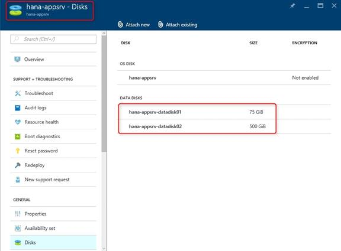

In den Test wurden Umgebung zwei Azure standard-Speicherdatenträger an den SAP-app-Server virtueller Computer angeschlossen. Eine verwendet wurde, zum Speichern der SAP-Software für die Installation (z. B. NetWeaver 7.5, SAP-Benutzeroberfläche und SAP-HANA... ) und den anderen aus, dass genügend Speicherplatz für den Inhalt erforderlich sein könnten (z. B. sichern, Testdaten) sowie Sapmnt Verzeichnis (z. B. SAP-Profile) für alle virtuellen Computern freigegeben werden, die auf der gleichen SAP-Querformat gehören.

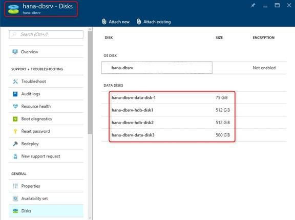

Im Gegensatz zu den app-Server wurden virtueller Computer vier Datenträger auf dem Server SAP-HANA virtueller Computer angeschlossen. Wie vor zwei Datenträger für die SAP-Software (eine konnte auch den SAP-Software-Datenträger über NFS freigeben) planmäßigen und genügend Speicherplatz für die Sicherung z. B. Probleme verwendet wurden. Die weiteren zwei Festplatten wurden Azure Premium-Datenträger HANA SAP-Daten, und melden Sie sich als auch /usr/sap Verzeichnis beibehalten.

### Kernel-Parameter

SAP-HANA erfordert bestimmte Linux Kernel Einstellungen, die nicht Bestandteil der standard Azure Gallery-Bilder sind und manuell festgelegt werden. Es gibt eine bestimmte SAP-Notiz die Einstellungen beschreibt. 

SAP-Hinweis SAP-HANA DB: Empfohlen OS-Einstellungen für SLES 12 / SLES für SAP-Applikationen 12: [SAP-Hinweis 2205917](https://launchpad.support.sap.com/#/notes/2205917)

Eine weitere Thema Reagrding Seite-Cache im Zusammenhang mit SAP-HANA SLES ausgeführt finden Sie [hier](https://www.suse.com/documentation/sles_for_sap/singlehtml/sles_for_sap_guide/sles_for_sap_guide.html#sec.s4s.configure.page-cache) in Kapitel 6.1 Kernel: Seite-Cache-Grenzwert

Es gibt auch eine SAP-Notiz zu der Seite-Cache-Grenzwert [SAP-Hinweis 1557506](https://service.sap.com/sap/support/notes/1557506)

SLES 12 verfügt über ein neues Tool, das das alten Sapconf Programm ersetzt. Es ist "optimiert Adm", und es ein spezielles HANA SAP-Profil steht. Eine kann weitere Details zu diesem Tool den zwei unten aufgeführten Links suchen.

SLES Dokumentation zur optimiert Adm Profil Sap-Hana finden Sie [hier](https://www.suse.com/documentation/sles-for-sap-12/book_s4s/data/sec_s4s_configure_sapconf.html)

SLES Dokumentation zur optimiert Adm Profil Sap-Hana - Kapitel 6.2 optimieren Systeme für SAP-Auslastung mit optimiert Adm - finden Sie [hier](https://www.suse.com/documentation/sles-for-sap-12/pdfdoc/book_s4s/book_s4s.pdf)

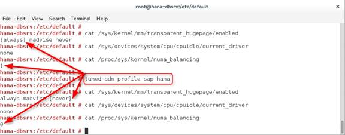

Hier sehen eine wie "optimiert Adm" die Transparent_hugepage als auch die Werte Numa_balancing den erforderlichen HANA SAP-Einstellungen geändert.

Um die Einstellungen für SAP-HANA Kernel permanent zu machen, hat einen grub2 auf SLES 12 verwenden. Weitere Informationen zu grub2 finden Sie [hier](https://www.suse.com/documentation/sled-12/book_sle_admin/data/sec_grub2_file_structure.html)

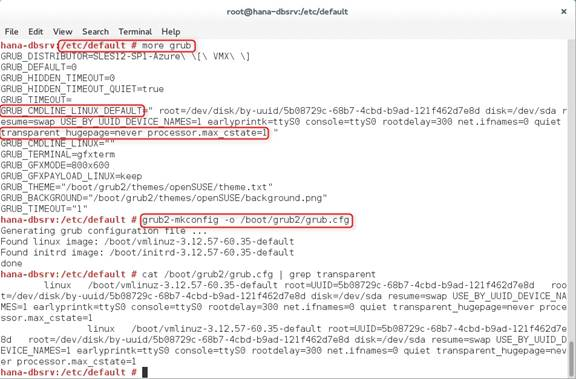

Diese Abbildung zeigt, wie die Einstellungen Kernel wurden in der Konfigurationsdatei geändert und dann "kompiliert" über grub2-mkconfig

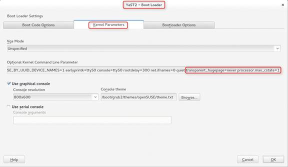

Eine weitere Möglichkeit wäre zum Ändern der Einstellungen für über Yast und der Boot-Ladeprogramm Kernel Parameter.

### Dateisysteme 

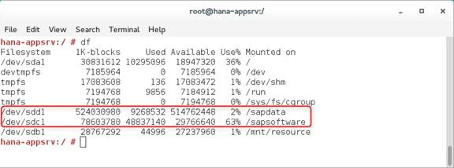

Hier kann eine zwei Dateisysteme anzeigen, die auf dem SAP-app-Server virtueller Computer über die zwei angefügten Azure standard-Datenträger erstellt wurden. Beide Dateisysteme sind vom Typ XFS und /sapdata und /sapsoftware bereitgestellt.

Es ist nicht auf diese Weise erledigen obligatorisch. Es gibt verschiedene Optionen wie Sturcture soviel Speicherplatz.
Der wichtigste Aspekt besteht darin, zu verhindern, dass das Dateisystem Root Speicherplatz ausgeführt wird. 

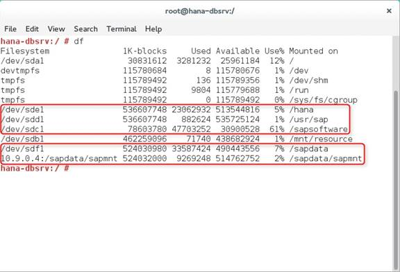

Bezug auf den SAP-HANA DB virtuellen Computer es ist wichtig, wissen, dass während der Datenbankinstallation einer über Sapinst (Swpm), und verwenden nur die Option einfache "Standardinstallation" wird es von Inhalten standardmäßig unter /hana und /usr/sap installieren. Die Standardeinstellung für SAP-HANA Sicherung ist z. B. unter /usr/sap.
Gefällt mir, bevor er-Taste ist, um zu vermeiden, dass das Dateisystem Root Speicherplatz ausgeführt wird. Eine sollten daher sicherstellen, dass es ausreichend freier Speicherplatz unter /hana und /usr/sap vor der Neuinstallation SAP-HANA über Swpm ist.

[In diesem Artikel](http://help.sap.com/saphelp_hanaplatform/helpdata/en/4c/24d332a37b4a3caad3e634f9900a45/frameset.htm) aus SAP beschreibt das Layout standard Dateisystem SAP-HANA 

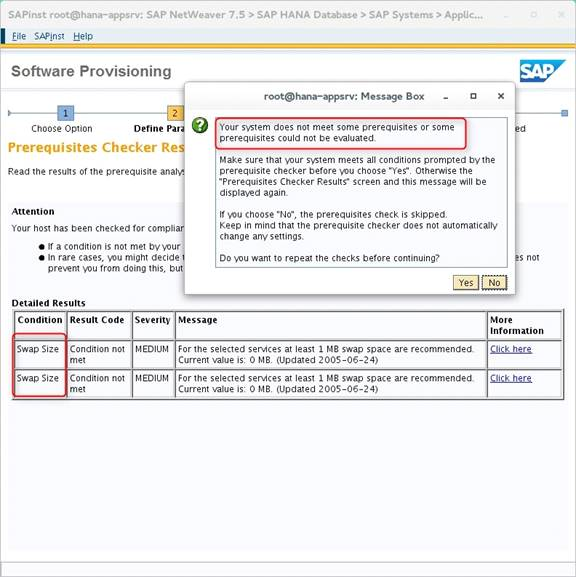

Beim Installieren von SAP NetWeaver auf ein SLES 12 Azure Katalog Standardbild wird eine Meldung, dass kein Abstand austauschen besteht sein. Wenn Sie diese Meldung Zeitteil konnte eine z. B. manuell austauschen hinzufügen wie in diesem Dokument über TT, Mkswap und Swapon beschrieben. Nur suchen Sie nach "Hinzufügen ein austauschen Datei manuell" in [diesem Artikel](https://www.suse.com/documentation/sled-12/book_sle_deployment/data/sec_yast2_i_y2_part_expert.html)

Eine weitere Möglichkeit besteht darin austauschen Space über der Linux VM-Agent konfigurieren. Weitere Informationen finden Sie [hier](virtual-machines-linux-agent-user-guide.md)

### / usw./hosts

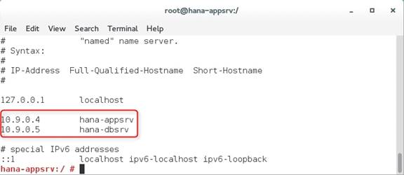

Ein weiterer wichtiger Aspekt, bevor Sie beginnen, SAP installieren ist in der Datei/etc/Hosts Hostnamen und IP-Adressen von der SAP-virtuellen Computern einbezogen werden sollen. Eine sollte alle SAP-virtuellen Computern innerhalb einer Azure virtuelles Netzwerk bereitstellen und verwenden Sie dann die internen Adressen.

### / usw./fstab

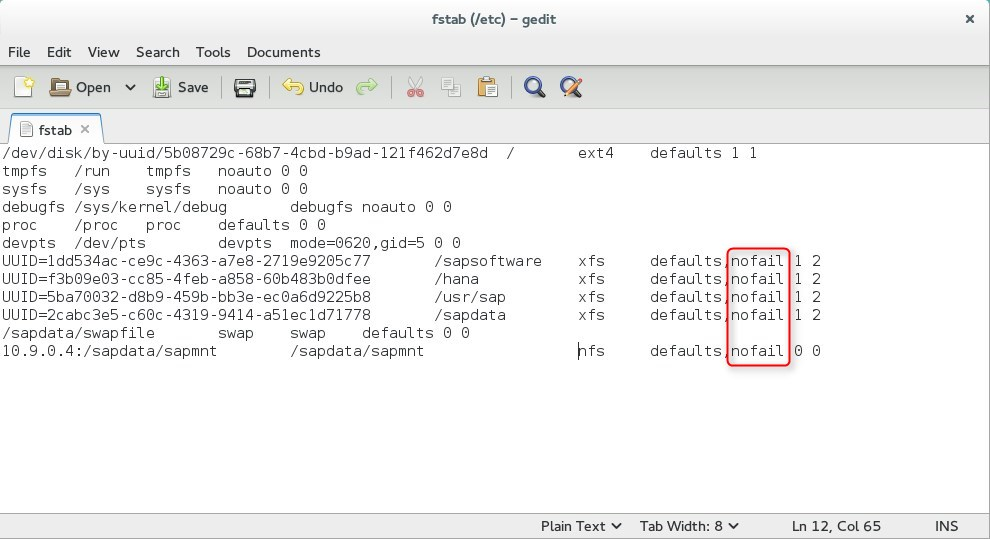

Während der Phase testen ergebende es eine gute Idee, den Parameter Nofail Fstab hinzufügen werden. Wenn ein Problem mit den Laufwerken auftritt würde der virtuellen Computer weiterhin im Zusammenhang und nicht im Prozess Boot hängen. Jedoch hat eine wie in diesem Fall Achten Sie zusätzliche soviel Speicherplatz möglicherweise nicht zur Verfügung und Prozessen konnte das Dateisystem Root überfüllt. Falls /hana fehlende wäre würde nicht SAP-HANA Obwohl überhaupt starten.

## Installieren Sie grafisch Gnome Desktop auf SLES 12

In diesem Kapitel besteht aus zwei Secitions die folgende Themen behandelt:

* Installation von Gnome Desktop- und Xrdp auf SLES 12
* Java-basierte SAP MC mit Firefox auf SLES 12 ausgeführt

Eine ebenso wie Xterminal, VNC alternativen verwenden, aber zum Zeitpunkt Sep 2016 in diesem Artikel werden nur Xrdp.

### Installation von Gnome Desktop- und Xrdp auf SLES 12

Es gibt eine einfache Möglichkeit, dies zu erreichen, insbesondere für diejenigen, die Microsoft Windows-Hintergrund haben und einen grafischen Desktop direkt in das SAP-Linux virtuellen Computern ausführen Firefox, Sapinst, SAP-Benutzeroberfläche, SAP-MC oder HANA Studio und vielleicht Herstellen einer Verbindung mit dem virtuellen Computer über RDP von einem Microsoft Windows-Computer verwenden möchten. Dies ist möglicherweise nicht z. B. für einen Datenbankserver Herstellung geeignet ist es ok für eine reine Prototypen-Demo-Umgebung. Hier sind die Schritte zum den Desktop Gnome einer Azure SLES 12 virtuellen Computers zu installieren:

Installieren Sie den Desktop Gnome durch den folgenden Befehl (z. B. in einem Putty Fenster):

   Zypper in t - Muster Gnome-basic

Klicken Sie dann installieren Sie Xrdp Verbindung mit dem virtuellen Computer über RDP zulässig:

   Zypper in xrdp

Bearbeiten Sie /etc/sysconfig/windowmanager, und legen Sie den standardmäßigen Windows-Manager auf Gnome:

   DEFAULT_WM = "Gnome"

Führen Sie die Chkconfig, um sicherzustellen, dass die Xrdp nach einem Neustart automatisch gestartet wird: 

  Chkconfig-Stufe 3 Xrdp auf

für den Fall, dass ein Problem mit RDP-Verbindung sollten versuchen Sie, (vielleicht kein Putty Fenster) neu zu starten:

  /etc/xrdp/xrdp.sh starten

für den Fall, dass der Xrdp Neustart als erwähnt keine Kontrollkästchen arbeiten, wenn eine Datei .pid vorhanden ist, und entfernen Sie diese:

  Überprüfen Sie /var/run und xrdp.pid suchen   
  Entfernen Sie es, und wiederholen Sie dann den Neustart des Computers

### SAP-MC

Zum Starten der grafischen Java-basierte SAP MC aus einer Azure SLES 12 virtuellen Computer ausgeführt wird, nach der Installation von der Gnome Firefox erhalten Desktop zu wie im vorherigen Abschnitt eine beschrieben einen Fehler aufgrund von fehlenden Java-Browser-Plug-in.

Die URL zum Starten der SAP-MC ist <server>: 5 < Instance_number > 13

Weitere Informationen hierzu finden Sie [hier](https://help.sap.com/saphelp_nwce10/helpdata/en/48/6b7c6178dc4f93e10000000a42189d/frameset.htm)

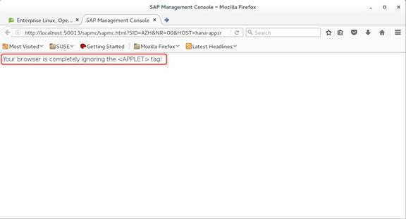

Klicken Sie auf dem Screenshot konnte eine sehen, wie die Fehlermeldung wie, wann die Java-Browser-Plug-in fehlt. 

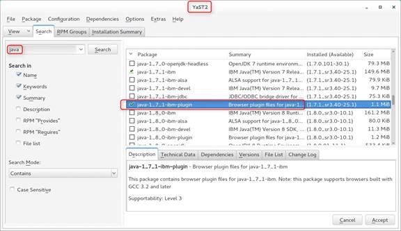

Eine Möglichkeit zur Lösung des Problems besteht einfach darin das fehlende Plug-in über Yast zu installieren.

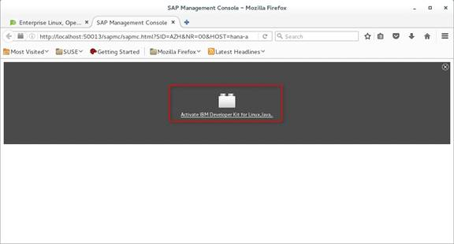

Wiederholen die SAP-MC URL wird etwas Dialogfeld das erste Mal fragt, aktivieren das Plug-in geöffnet.

Eine weitere Problem das Popup möglicherweise wird eine Fehlermeldung bezüglich einer fehlenden Datei: javafx.properties Dies ist sehr wahrscheinlich im Zusammenhang mit der Installation von Java 1.8 die für SAP-Benutzeroberfläche 7.4 erforderlich ist

Die IBM Java-Version, die über Yast gesehen enthalten keine dieser Datei. Die Lösung ist ein Java-Download von Oracle an.
Ein Artikel, die zu diesem Problem spricht finden Sie [hier](https://scn.sap.com/thread/3908306)

## Manuelle HANA SAP-Installation über SWPM als Teil einer NetWeaver 7.5-installation

Die folgende Liste von Screenshots zeigt die wichtigsten Schritte SAP NetWeaver 7.5 und SAP-HANA SP12 über SWPM (Sapinst) zu installieren. Als Teil einer NW 7.5 weist Installation SWPM die Funktionen, um auch die HANA Datenbank einer einzelnen Instanz installiert haben.

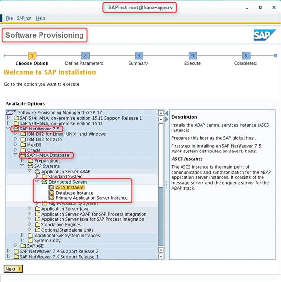

Für die Stichprobe Test wurde-Umgebung, die nur eine ABAP app-Server installiert. Die Option "System verteilt" wurde verwendet, die Instanz ASCS und die primäre App-Server-Instanz in eine Azure-virtuellen Computer und SAP-HANA wie das Datenbanksystem in einer anderen Azure-virtuellen Computer installieren.

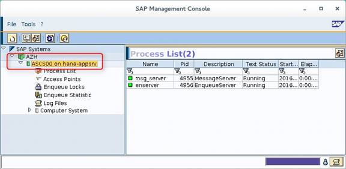

Nachdem die Instanz ASCS auf die app-Server virtueller Computer installiert ist, und klicken Sie auf "Grün" in den SAP MC Sapmnt Verzeichnis z. B. SAP-Profilverzeichnis wozu muss mit dem SAP-HANA DB Server virtueller Computer freigegeben werden festgelegt ist.
Der Schritt DB Installation benötigt Zugriff auf diese Informationen. Die besten NFS verwenden, die mit Yast konfiguriert werden können.

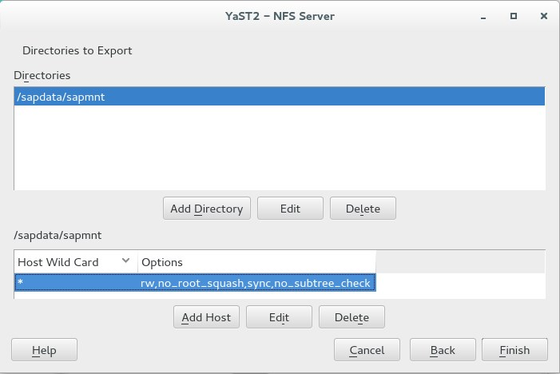

Klicken Sie auf die app sollte Server virtueller Computer Sapmnt Verzeichnis über NFS mithilfe das Optionen "Rw" sowie "No_root_squash" freigegeben werden. Standardwert ist "Ro" und "Root_squash" der für Probleme bei der Installation der Datenbankinstanz führen könnte.

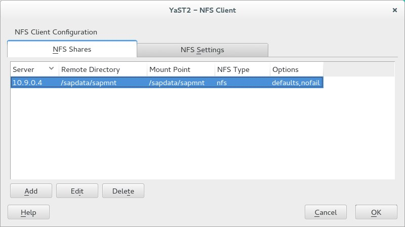

Auf dem Server SAP-HANA DB Virtueller Computer freigeben der Sapmnt aus dem app-Server virtueller Computer wird über "NFS-Client" konfiguriert werden (z. B. mit Hilfe der Yast)

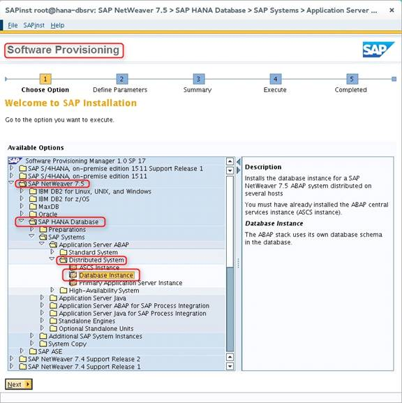

Verfügt über ein auf dem Server SAP-HANA DB Virtueller Computer anmelden und diese dann SWPM zum nächsten Schritt des verteilten NW 7.5-Installation - "Datenbankinstanz" zu erreichen.

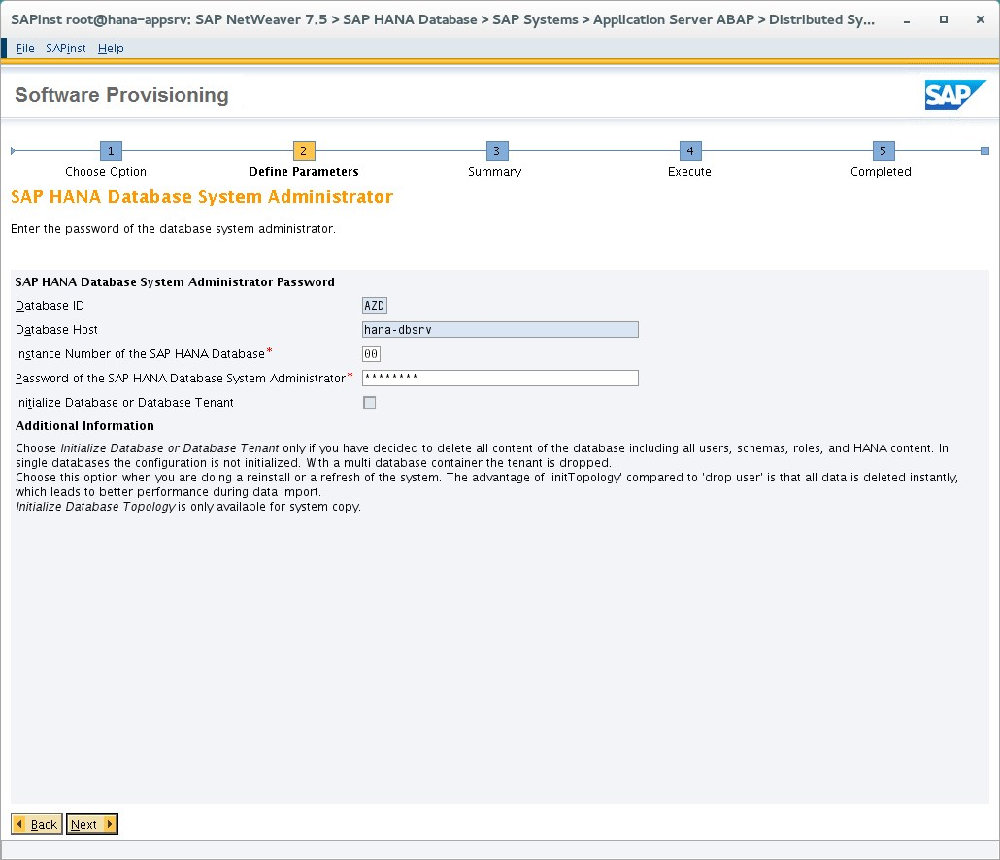

Im Zusammenhang mit der Installation des SAP-HANA gibt es keine wirklich viel nach der Auswahl von "Standardinstallation" eingeben. Außer muss der Pfad für die Installatiom Medien eine eine SID DB, der Hostname, die Anzahl der Instanz und der Systemadministrator DB-Kennwort eingeben.

 
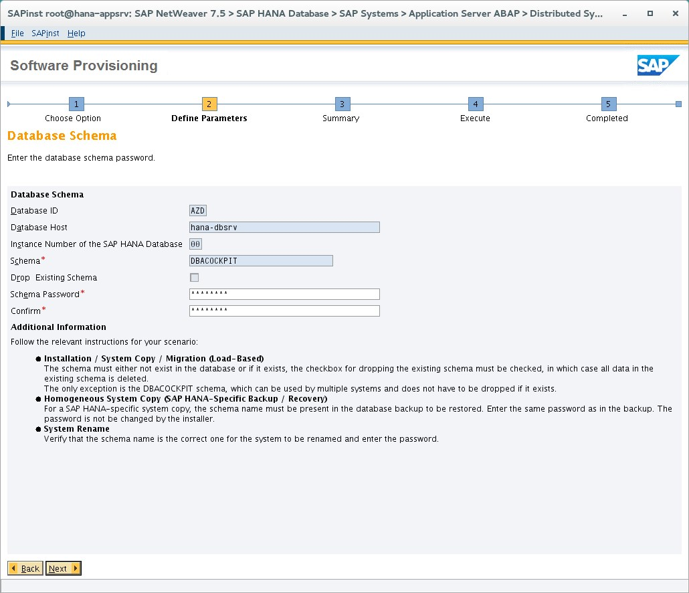

Geben Sie das Kennwort für das Schema DBACOCKPIT wird nächsten Schritt.

Dann kommt die Frage nach dem SAPABAP1 Schema Kennwort ein.

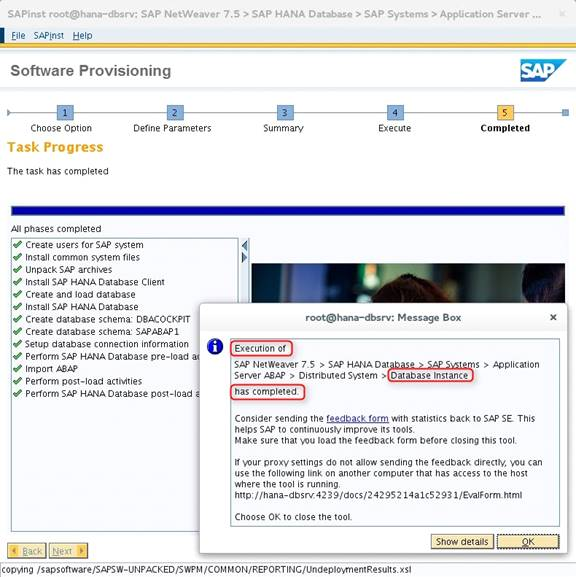

Am Ende sollten nur grüne Häkchen vor jeder Phase des Installationsvorgangs DB und das kleinen Meldungsfeld die informiert sollte sagen Sie "Ausführung von... Datenbankinstanz ist "abgeschlossen.

 
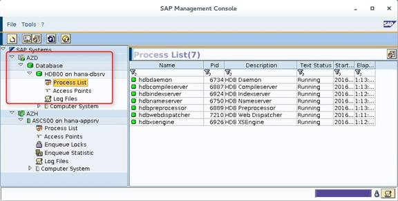

Nach der erfolgreichen Installation sollte der SAP-MC auch die Instanz DB als "Grün" und die vollständige Liste der HANA SAP-Prozesse (z. B. Hdbindexserver, Hdbcompileserver) anzeigen

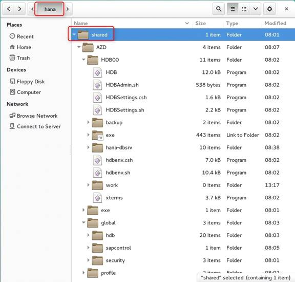

Diese Abbildung zeigt die Teile der Dateistruktur unter /hana/shared die SWPM während der Installation HANA erstellt. Es wurde keine Option, um einen anderen Pfad anzugeben. Daher ist es so wichtig, zum Bereitstellen von weiteren Speicherplatz unter /hana vor der Installation SAP-HANA über SWPM, um zu vermeiden, dass das Dateisystem Root freier Speicherplatz ausgeführt wird.

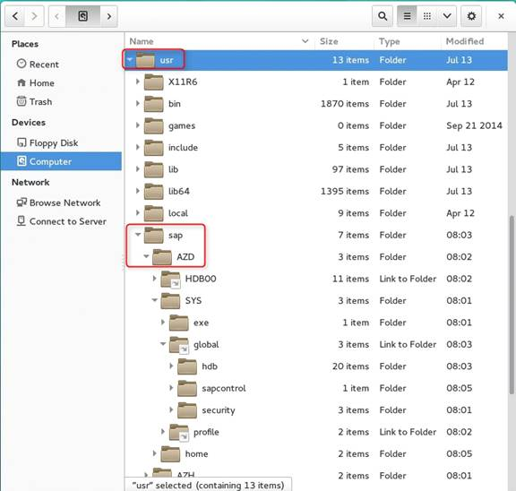

Hier sehen eine genauso wie für das /usr/sap Verzeichnis vor beschrieben.

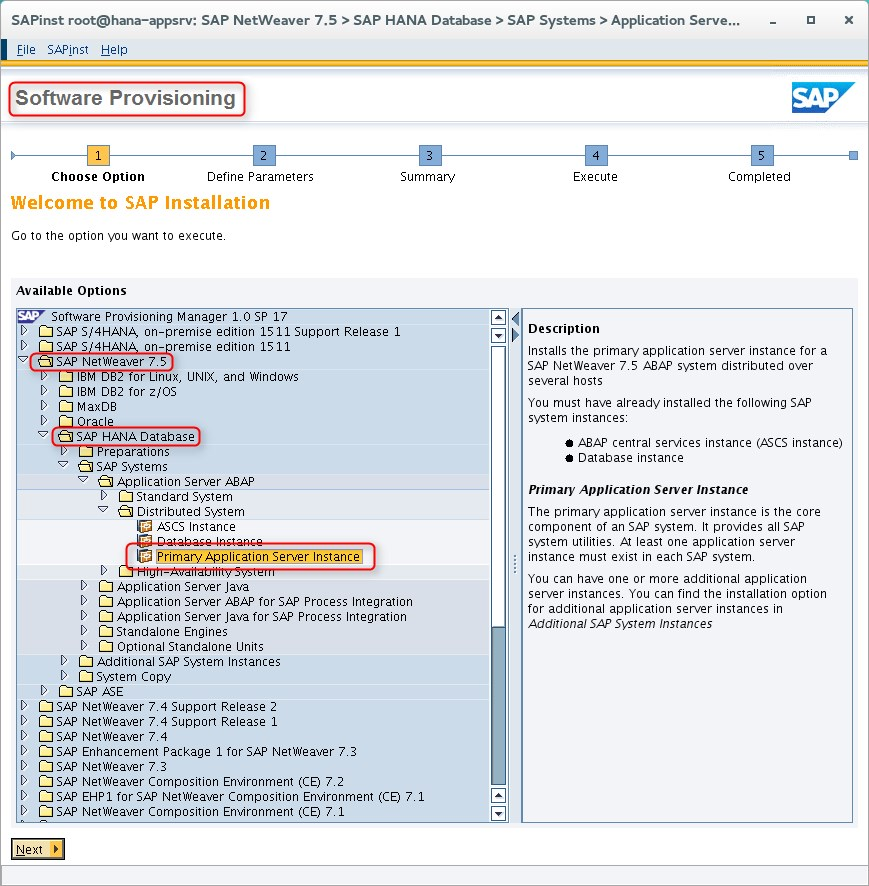

Der letzte Schritt darin, der verteilte ABAP Installation ist die "primäre Anwendung Server-Instanz"

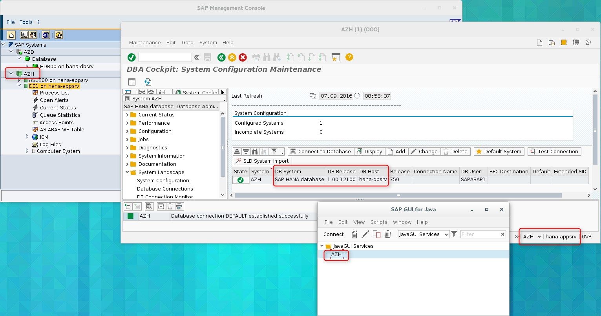

Nachdem PAS als auch SAP-Benutzeroberfläche installiert haben, kann eine überprüfen über die Transaktion "Dbacockpit", die alles rechts mit der Installation des SAP-HANA aussieht.

 
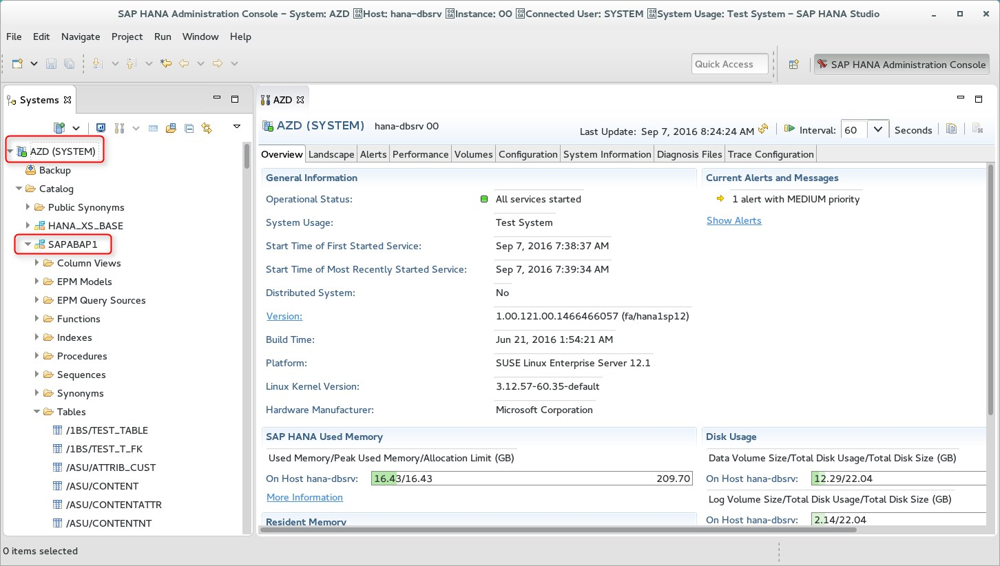

Als letzte konnte Schritt eine SAP-HANA Studio im SAP-app-Server virtueller Computer installieren und Verbinden mit der HANA SAP-Instanz, die auf dem Server DB Virtueller Computer ausgeführt.

## Manuelle HANA SAP-Installation über HANA Lebenszyklus Manager Tool hdblcm

Neben der Installation von SAP-HANA als Teil einer verteilten Installation über SWPM ist es auch realistische zu erst HANA eigenständigen Hdblcm verwenden und dann installieren z. B. SAP NetWeaver 7.5 danach. Die Liste der folgenden Screenshots zeigt an, wie dies funktioniert.

Hier sind drei Quellen von Informationen über das HANA Hdblcm Tool aus:

[Auswählen der richtigen SAP-HANA HDBLCM für die Aufgabe](https://help.sap.com/saphelp_hanaplatform/helpdata/en/68/5cff570bb745d48c0ab6d50123ca60/content.htm)

[SAP-HANA Lifecycle Management-Tools](http://saphanatutorial.com/sap-hana-lifecycle-management-tools/)

[SAP-HANA Serverinstallation und Update Guide](http://help.sap.com/hana/SAP_HANA_Server_Installation_Guide_en.pdf)

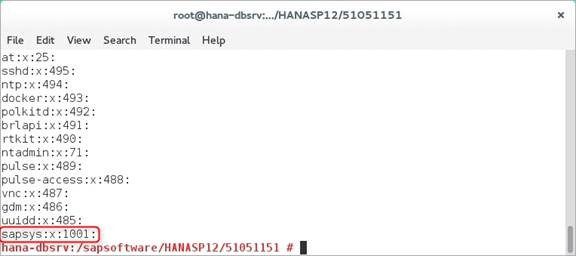

Probleme mit einer Gruppe Id-Standardeinstellung für höher Ausführung vermieden werden sollten die \<HANA SID\>ADM-Benutzer (erstellt mit dem Tool Hdblcm) sollte eine eine neue Gruppe namens "Sapsys" mit der Gruppe Id 1001 vor der Neuinstallation SAP-HANA mit Hdblcm definieren.

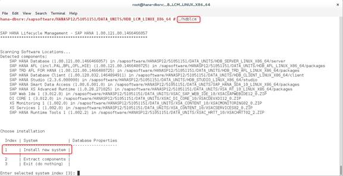

Starten Hdblcm das erste Mal, wenn eine einfache Startmenü, hat eine Element zu markieren, werden 1 "neues System installieren"

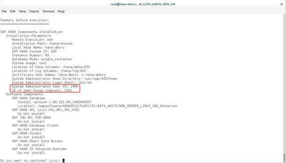

Klicken Sie auf diese Abbildung kann eine alle wichtigen Optionen anzeigen, die vor dem eingegeben wurden. Wichtig - Verzeichnisse durchsuchen der wurden für HANA Log und Daten Datenmengen als auch des Installationspfads (/ Hana/freigegeben in diesem Beispiel) benannt und/Usr/Sap sollten nicht Teil des Dateisystems Stamm aber angehören Azure Daten Datenträger, die an den virtuellen Computer angefügt wurden, wie im Abschnitt zum Einrichten Azure-virtuellen Computer beschrieben. Dies wird das Risiko vermeiden, das im Stamm-Dateisystem Speicherplatz ausgeführt werden kann.
Eine erkennen Sie auch, dass Benutzer Admin HANA über Benutzer-Id 1005 und Teil der Gruppe Sapsys (Id 1001) die vor der Installation definiert wurde.

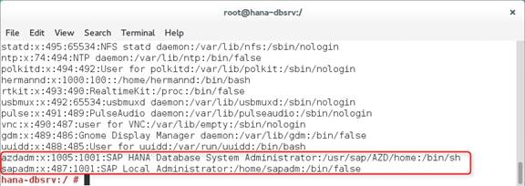

Eine kann die HANA überprüfen \<HANA SID\>Benutzerdetails in/usw./Passwd Adm (in diesem Beispiel Azdadm)

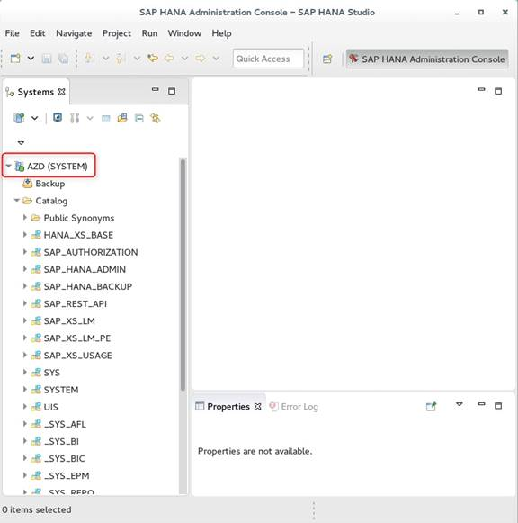

Nach der Installation von SAP-HANA mit Hdblcm kann diese im SAP-HANA Studio angezeigt werden. Wozu z. B. alle SAP NetWeaver Tabellen SAPABAP1 Schema ist noch nicht verfügbar.

Nach der Installation von SAP-HANA kann eine SAP NetWeaver darauf installieren. In diesem Beispiel, die es vorgenommen wurde mithilfe von "verteilte Installationen" über SWPM im entsprechenden Abschnitt oben beschriebenen.
Bei der Installation nur von der Datenbankinstanz über SWPM eine weist dieselben Daten wie vor mit Hdblcm (z. B. Hostname, HANA SID, Instanz Zahl) eingeben. SWPM wird dann mithilfe der vorhandene HANA Installation und zusätzliche Schemas hinzufügen.

Dies ist das Bild des SWPM Installation Schritts, bei denen ist eine zum Eingeben von Daten über das Schema DBACOCKPIT.

Klicken Sie dann erwartet SWPM zum Eingeben von Daten über das Schema SAPABAP1 ein.

Nach Abschluss der SWPM Datenbank Instanz-Installation erkennbar das Schema SAPABAP1 in HANA Studio.

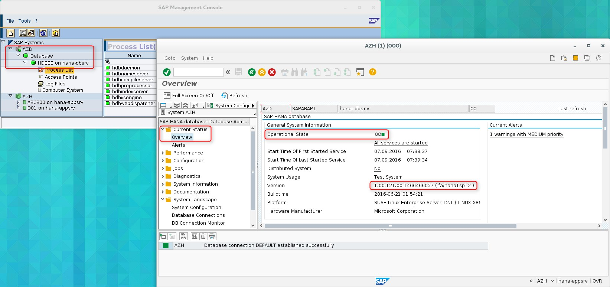

Und schließlich nach der Installation von SAP-app-Server und SAP-Benutzeroberfläche eine sollten feststellen, ob die Instanz HANA DB mit Transaktion "Dbacockpit".

## Allgemeine Informationen zum Azure SAP-Zertifizierung, SAP-HANA Azure und SAP Softwaredownload ausgeführt

* Allgemeine SAP-Azure Doku zur Ausführung von SAP auf mit OS Windows Azure im klassischen Modus: [Mithilfe von SAP auf Azure Windows virtuellen Computern](virtual-machines-windows-classic-sap-get-started.md)

* Informationen zu vorhandenen SAP-Vorlagen für die Verwendung von Kunden: [Azure Schnellstart Vorlagen für SAP](https://blogs.msdn.microsoft.com/saponsqlserver/2016/05/16/azure-quickstart-templates-for-sap/)

* Allgemeine SAP-Azure Doku zur Ausführung von SAP auf Azure mit Linux OS Azure Ressourcenmanager Modell: [Verwenden von SAP auf Linux virtuellen Computern (virtuelle Computer)](virtual-machines-linux-sap-get-started.md)

* zertifizierte SAP-HANA Hardware Verzeichnis der aufgelistet sind, welche Typen von Azure-virtuellen Computer für die Herstellung unterstützt werden: [Zertifiziert SAP-HANA® Hardware-Verzeichnis](https://global.sap.com/community/ebook/2014-09-02-hana-hardware/enEN/iaas.html)

* Informationen zu virtuellen Computern Größen besonders für Linux Auslastung: [Größen für virtuellen Computern in Azure](virtual-machines-linux-sizes.md)

* SAP-Hinweis dem alle aufgelistet sind SAP-Produkte auf Azure unterstützt und Azure-virtuellen Computer Typen für SAP unterstützt: [SAP-Hinweis 1928533](https://launchpad.support.sap.com/#/notes/1928533/E)

* SAP-Notiz zu SAP "Überwachung"mit verbesserter Linux virtuellen Computern auf Azure: [SAP-Hinweis 2191498](https://launchpad.support.sap.com/#/notes/2191498/E)

* SAP-HANA Geschenk auf Azure "Großen Instanzen". Es ist wichtig zu verstehen, dass dies nicht ist über das SAP-HANA auf Azure-virtuellen Computern ausführen, aber in einem Hybriden die SAP-app-Servern in Azure-virtuellen Computern jedoch HANA SAP Ausführungsort-Umgebung ausgeführt, klicken Sie auf blanken Servern wird: [SAP-Hinweis 2316233](https://launchpad.support.sap.com/#/notes/2316233/E)

* SAP-Notiz mit Informationen SAPOSCOL unter Linux: [SAP-Hinweis 1102124](https://launchpad.support.sap.com/#/notes/1102124/E)

* Kennzahlen für SAP auf Microsoft Azure Überwachung wichtiger: [SAP-Hinweis 2178632](https://launchpad.support.sap.com/#/notes/2178632/E)

* Informationen zu Azure Ressourcenmanager: [Azure Ressourcenmanager (Übersicht)](../azure-resource-manager/resource-group-overview.md)

* Informationen zum Bereitstellen von Linux virtuellen Computern über Vorlagen: [Bereitstellen und Verwalten von virtuellen Computern mithilfe von Azure Ressourcenmanager Vorlagen und Azure CLI](virtual-machines-linux-cli-deploy-templates.md)

* Vergleich von Bereitstellung zwischen Azure Ressourcenmanager und klassischen Modelle: [Azure Ressourcenmanager im Vergleich zu klassischen Bereitstellung: verstehen Bereitstellungsmodelle und den Status Ihrer Ressourcen](../resource-manager-deployment-model.md)

* Herunterladen von NetWeaver 7.5 für Linux/HANA von SAP Service Marketplace: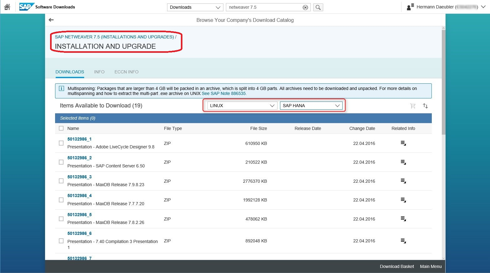

* Laden Sie HANA SP12 Platform Edition von SAP Service Marketplace: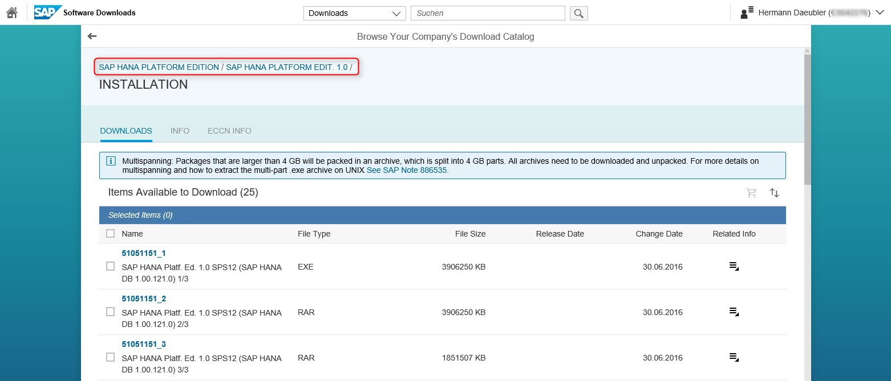

