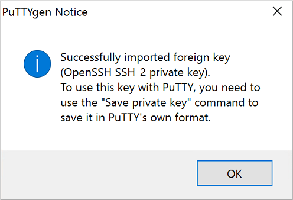
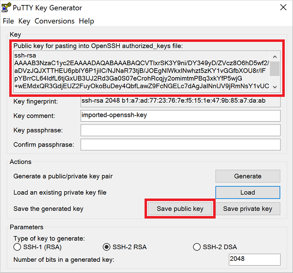
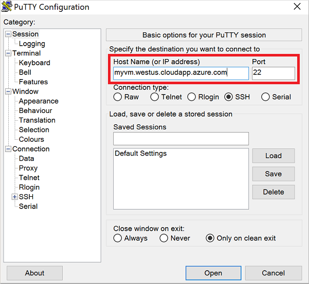

<properties 
    pageTitle="Verwenden von SSH Tasten mit Windows für Linux virtuellen Computern | Microsoft Azure" 
    description="Informationen Sie zum Generieren und SSH Tasten Verbindung zu einer Linux virtuellen Computern auf Azure auf einem Windows-Computer verwenden." 
    services="virtual-machines-linux" 
    documentationCenter="" 
    authors="squillace" 
    manager="timlt" 
    editor=""
    tags="azure-service-management,azure-resource-manager" />

<tags 
    ms.service="virtual-machines-linux" 
    ms.workload="infrastructure-services" 
    ms.tgt_pltfrm="vm-linux" 
    ms.devlang="na" 
    ms.topic="article" 
    ms.date="10/18/2016" 
    ms.author="rasquill"/>

# <a name="how-to-use-ssh-keys-with-windows-on-azure"></a>So verwenden Sie SSH Tasten mit Windows Azure klicken Sie auf

> [AZURE.SELECTOR]
- [Windows](virtual-machines-linux-ssh-from-windows.md)
- [Linux/Mac](virtual-machines-linux-mac-create-ssh-keys.md)

Beim Herstellen einer mit Linux virtuellen Computern (virtuellen Computern) in Azure Verbindung sollten Sie [öffentlichen Schlüsseln](https://wikipedia.org/wiki/Public-key_cryptography) verwenden, um eine sicherer Möglichkeit zum Anmelden bei Ihrem Linux VM bereitzustellen. Dieser Vorgang umfasst eine öffentliche und private Schlüssel Exchange mit dem Befehl secure Shell (SSH) authentifiziert sich selbst statt einen Benutzernamen und ein Kennwort an. Kennwörter sind betroffen Bruteforce-Angriffen, besonders auf Internet zugänglichen virtuellen Computern, z. B. Webserver. Dieser Artikel enthält eine Übersicht über SSH Tasten und so die entsprechende Schlüssel auf einem Windows-Computer generieren.


## <a name="overview-of-ssh-and-keys"></a>Übersicht über SSH und Schlüssel

Sie können sicher zu Ihrer Linux VM melden Sie sich mithilfe von öffentlichen und privaten Schlüsseln:

- Der **Schlüssel** ist eingefügt, auf Ihrer Linux VM, oder einen anderen Dienst, den Sie mit öffentlichen Schlüsseln verwenden möchten.
- Die **privaten Schlüssel** ist, was Sie zu Ihrem Linux VM präsentieren, wenn Sie sich anmelden, um Ihre Identität zu überprüfen. Schützen Sie diesen privaten Schlüssel ein. Teilen Sie sie nicht.

Diese öffentliche und private Schlüssel können auf mehreren virtuellen Computern und-Diensten verwendet werden. Sie benötigen kein Paar Schlüssel für jedes virtuellen Computers oder den Dienst, den Sie zugreifen möchten. Eine ausführlichere Übersicht über finden Sie unter [öffentlichen Schlüsseln](https://wikipedia.org/wiki/Public-key_cryptography).

SSH handelt es sich um eine verschlüsselte Verbindungsprotokoll, die sichere Benutzernamen über ungeschützte Verbindungen ermöglicht. Es ist der Standard-Verbindungs-Protokoll für Linux virtuellen Computern in Azure gehostet wird. Obwohl SSH selbst eine verschlüsselte Verbindung bereitstellt, bewirkt, dass Kennwörter mit SSH Verbindungen mit immer noch den virtuellen Computer zu Angriffen und Kennwörter Raten lexikalisch betroffen. Eine Methode sichere und bevorzugte, der Herstellen einer Verbindung mit eines virtuellen Computers über SSH wird mithilfe der folgenden öffentlichen und privaten Schlüsseln, auch bekannt als SSH Tasten.

Wenn Sie nicht SSH Tasten verwenden möchten, können Sie weiterhin auf Ihre Linux virtuellen Computern, die mit einem Kennwort anmelden. Wenn Ihre virtuellen Computer nicht mit dem Internet verbunden ist, kann die Verwendung von Kennwörtern ausreichend sein. Jedoch müssen Sie weiterhin Kennwörter für jede Linux VM verwalten und fehlerfrei Kennwortrichtlinien und Methoden, wie etwa Mindestlänge und aktualisieren sie regelmäßig beizubehalten. Die Verwendung von SSH Tasten verringert die Komplexität der Verwaltung von eigenen Anmeldeinformationen über mehrere virtuelle Computer an.


## <a name="windows-packages-and-ssh-clients"></a>Windows-Paketen und SSH-clients

Herstellen einer Verbindung mit, und Verwalten von Linux virtuellen Computern in Azure mit einem **ssh** -Client. Windows-Computer nicht in der Regel einen **ssh** Client installiert sein. Allgemeine Windows SSH-Clients, die Sie installieren können, sind in den folgenden Paketen enthalten:

- [Git für Windows](https://git-for-windows.github.io/)
- [kitten](http://www.chiark.greenend.org.uk/~sgtatham/putty/)
- [MobaXterm](http://mobaxterm.mobatek.net/)
- [Cygwin](https://cygwin.com/)

> [AZURE.NOTE] Das neueste Windows 10 Jahrestag Update enthält Bash für Windows. Dieses Feature können Sie die Windows-Subsystem für Linux und Access-Dienstprogramme wie SSH-Client ausführen. Bash für Windows noch in der Entwicklung ist und eine Beta-Version als wird. Weitere Informationen zu Bash für Windows finden Sie unter [Bash auf Ubuntu unter Windows](https://msdn.microsoft.com/commandline/wsl/about).


## <a name="which-key-files-do-you-need-to-create"></a>Welche Key Dateien müssen Sie erstellen?

Azure erfordert mindestens 2048-Bit **ssh Rsa** formatieren öffentliche und private Schlüsseln. Wenn Sie Azure Ressourcen mithilfe der Bereitstellung Klassisch verwalten, müssen Sie auch ein PEM generieren (`.pem` Datei).

Hier sind die Bereitstellungsszenarien und die Arten von Dateien, die Sie in den einzelnen verwenden:

1. **SSH Rsa** Schlüssel sind für die Bereitstellung mithilfe der [Azure-Portal](https://portal.azure.com)und Ressourcenmanager Bereitstellungen mit [Azure CLI](../xplat-cli-install.md)erforderlich.
    - Diese Schlüssel sind in der Regel, dass alle die meisten Personen müssen.
2. `.pem`Datei ist zum Erstellen von virtuellen Computern verwenden des [klassischen Portal](https://manage.windowsazure.com)erforderlich. Diese Schlüssel werden auch in der klassischen Bereitstellungen unterstützt, die die [CLI Azure](../xplat-cli-install.md)verwenden.
    - Sie müssen diese zusätzlichen Schlüssel und Zertifikate erstellen, wenn Sie Ressourcen erstellt die Bereitstellung Klassisch verwalten.


## <a name="install-git-for-windows"></a>Installieren von Git für Windows

Im vorhergehenden Abschnitt aufgeführten mehrere Pakete, die enthalten die `openssl` Tool für Windows. Dieses Tool ist erforderlich, um öffentliche und private Schlüssel zu erstellen. In den folgenden Beispielen wird ausführlich erläutert zu installieren und Verwenden von **Git für Windows**, obwohl Sie dem Paket auswählen können, wenn Sie es vorziehen. **Git für Windows** erhalten Sie Zugriff auf einige zusätzliche Open Source-Software ([OSS](https://en.wikipedia.org/wiki/Open-source_software)) Tools und Dienstprogramme, die beim Arbeiten mit Linux virtuellen Computern hilfreich sein können.

1. Herunterladen und Installieren von **Git für Windows** von folgendem Speicherort: [https://git-for-windows.github.io/](https://git-for-windows.github.io/).

2. Akzeptieren Sie die Standardoptionen während der Installation, es sei denn, Sie speziell diese ändern müssen.

3. **Git Bash** ab dem **Startmenü**ausführen > **Git** > **Git Bash**. Die Konsole sieht ähnlich wie im folgenden Beispiel aus:

    


## <a name="create-a-private-key"></a>Erstellen Sie einen privaten Schlüssel

1. Klicken Sie im **Git Bash** verwenden `openssl.exe` zu einen privaten Schlüssel erstellen. Im folgenden Beispiel wird einen Schlüssel mit dem Namen `myPrivateKey` und mit dem Namen Zertifikat `myCert.pem`:

    ```bash
    openssl.exe req -x509 -nodes -days 365 -newkey rsa:2048 \
        -keyout myPrivateKey.key -out myCert.pem
    ```

    Die Ausgabe sieht ähnlich wie im folgenden Beispiel:

    ```bash
    Generating a 2048 bit RSA private key
    .......................................+++
    .......................+++
    writing new private key to 'myPrivateKey.key'
    -----
    You are about to be asked to enter information that will be incorporated
    into your certificate request.
    What you are about to enter is what is called a Distinguished Name or a DN.
    There are quite a few fields but you can leave some blank
    For some fields there will be a default value,
    If you enter '.', the field will be left blank.
    -----
    Country Name (2 letter code) [AU]:
    ```

2. Beantworten Sie die Anweisungen für Land Name, Position, Name der Organisation.

3. Ihre neue private Schlüssel und das Zertifikat werden in der aktuell geöffneten Verzeichnis erstellt. Für bewährte Methoden für Sicherheit sollten Sie die Berechtigungen auf Ihre privaten Schlüssel festlegen, damit nur Sie darauf zugreifen können:

    ```bash
    chmod 0600 myPrivateKey
    ```

4. Wenn Sie auch klassischen Ressourcen verwalten müssen, Konvertieren der `myCert.pem` auf `myCert.cer` (DER-codierte X509 Zertifikat). Führen Sie diesen optionalen Schritt nur, wenn Sie ältere klassischen Ressourcen speziell verwalten müssen. 

    Konvertieren Sie das Zertifikat, das mit dem folgenden Befehl ein:

    ```bash
    openssl.exe  x509 -outform der -in myCert.pem -out myCert.cer
    ```

## <a name="create-a-private-key-for-putty"></a>Erstellen Sie einen privaten Schlüssel für kitten

Kitten ist eine allgemeine SSH-Client für Windows. Sie können jeder SSH-Client verwenden, den Sie möchten. Um kitten verwenden zu können, müssen Sie einen weiteren Typ von Key - eine kitten privaten Schlüssel (PPK) zu erstellen. Wenn Sie nicht kitten verwenden möchten, überspringen Sie diesen Abschnitt.

Im folgenden Beispiel wird diese zusätzliche private Schlüssel speziell für kitten zu verwenden:

1. Verwenden Sie **Git Bash** , um Ihre privaten Schlüssel in einen RSA privaten Schlüssel konvertieren, die PuTTYgen verstanden werden kann. Im folgenden Beispiel wird einen Schlüssel mit dem Namen `myPrivateKey_rsa` aus dem vorhandenen Schlüssel namens `myPrivateKey`:

    ```bash
    openssl rsa -in ./myPrivateKey.key -out myPrivateKey_rsa
    ```

    Für bewährte Methoden für Sicherheit sollten Sie die Berechtigungen auf Ihre privaten Schlüssel festlegen, damit nur Sie darauf zugreifen können:

    ```bash
    chmod 0600 myPrivateKey_rsa
    ```

2. Herunterladen und Ausführen von PuTTYgen von folgendem Speicherort: [http://www.chiark.greenend.org.uk/~sgtatham/putty/download.html](http://www.chiark.greenend.org.uk/~sgtatham/putty/download.html)

3. Klicken Sie auf das Menü: **Datei** > **Laden einer privaten Schlüssel**

4. Suchen Sie nach Ihrer privaten Schlüssel (`myPrivateKey_rsa` im vorherigen Beispiel). Wird beim Starten von **Git Bash** standardmäßig das Verzeichnis `C:\Users\%username%`. Ändern des Dateifilters zum Anzeigen **Alle Dateien (\*.\*)**:

    

5. Klicken Sie auf **Öffnen**. Ein Symbol weist darauf hin, dass der Schlüssel erfolgreich importiert wurde:

    

6. Klicken Sie auf **OK** , um die Meldung zu schließen.

7. Öffentliche Schlüssel wird am oberen Rand des Fensters **PuTTYgen** angezeigt. Sie kopieren und Einfügen von öffentlichen Schlüssel in der Azure-Portal oder Ressourcenmanager Azure-Vorlage, bei der Erstellung einer Linux VM. Sie können auch **öffentlichen Schlüssel speichern** , um eine Kopie auf Ihrem Computer speichern klicken:

    

    Das folgende Beispiel zeigt, wie würde kopieren und Einfügen von öffentlichen Schlüssel in der Azure-Portal, beim Erstellen einer Linux VM. Öffentliche Schlüssel, klicken Sie dann in der Regel in gespeichert `~/.ssh/authorized_keys` Ihrer neuen virtuellen Computers.

    

7. Klicken Sie im **PuTTYgen**, auf **privaten Schlüssel speichern**:

    

    > [AZURE.WARNING] Eine Aufforderung gefragt werden, ob Sie den Vorgang fortsetzen, ohne dass ein Kennwort für den Key eingegeben. Ein Kennwort ist wie ein Kennwort ein, die Ihre privaten Schlüssel angefügt. Auch wenn andere Personen in Ihrer privaten Schlüssel beziehen, möchten sie möglicherweise trotzdem nicht authentifizieren einfach die Taste verwenden können. Sie möchten auch das Kennwort benötigen. Ohne ein Kennwort ein Wenn eine andere Person Ihre privaten Schlüssel, erhält können sie melden Sie sich alle virtuellen Computers oder den Dienst, der den Schlüssel verwendet. Es empfiehlt sich, dass Sie ein Kennwort erstellen. Jedoch, wenn Sie das Kennwort vergessen, gibt es Möglichkeit keine, die Datenbank wiederherzustellen.

    Wenn Sie ein Kennwort eingeben möchten, klicken Sie auf **Nein**, geben Sie ein Kennwort im Hauptfenster von PuTTYgen, und klicken Sie dann erneut auf **privaten Schlüssel speichern** . Klicken Sie andernfalls auf **Ja,** um den Vorgang fortzusetzen, ohne das optionale Kennwort bereitzustellen.

8. Geben Sie einen Namen und einen Speicherort zum Speichern der Datei PPK.


## <a name="use-putty-to-ssh-to-a-linux-machine"></a>Verwenden von kitten SSH zu einem Linux-Computer

Kitten ist wieder eine allgemeine SSH-Client für Windows. Sie können jeder SSH-Client verwenden, den Sie möchten. Die folgenden Schritte ausführlich auf erläutert Ihrer privaten Schlüssel zu verwenden, um mit Ihrer Azure virtueller Computer mithilfe von SSH authentifizieren. Die Schritte sind in anderen SSH Hauptkunden im Hinblick auf benötigen, laden Sie Ihre privaten Schlüssel zur Authentifizierung der Verbindung SSH ähnlich.

1. Herunterladen und Ausführen kitten von folgendem Speicherort: [http://www.chiark.greenend.org.uk/~sgtatham/putty/download.html](http://www.chiark.greenend.org.uk/~sgtatham/putty/download.html)

2. Füllen Sie die Hostname oder IP-Adresse des Ihrer virtuellen Computer vom Azure-Portal aus:

    

3. Bevor Sie auswählen auf **Öffnen**, klicken Sie auf **Verbindung** > **SSH** > **autorisierende** Registerkarte. Navigieren Sie zu, und wählen Sie Ihre privaten Schlüssel:

    

4. Klicken Sie auf **Öffnen** in Verbindung mit Ihrem virtuellen Computern
 

## <a name="next-steps"></a>Nächste Schritte
Sie können auch [mithilfe von OS X und Linux](virtual-machines-linux-mac-create-ssh-keys.md)öffentliche und private Schlüssel generieren.

Weitere Informationen zu Bash für Windows und die Vorteile von Probleme OSS Tools zur Verfügung, auf dem Windows-Computer finden Sie unter [Bash auf Ubuntu unter Windows](https://msdn.microsoft.com/commandline/wsl/about).

Wenn Sie Probleme bei der Verwendung von SSH Verbindung zu Ihrem Linux virtuellen Computern haben, finden Sie unter [Behandeln von Problemen mit SSH Verbindungen mit einer Azure Linux virtueller Computer](virtual-machines-linux-troubleshoot-ssh-connection.md).