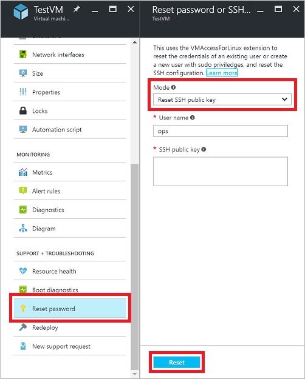
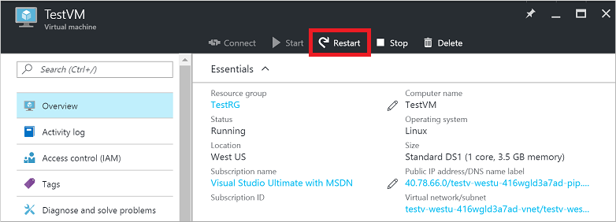
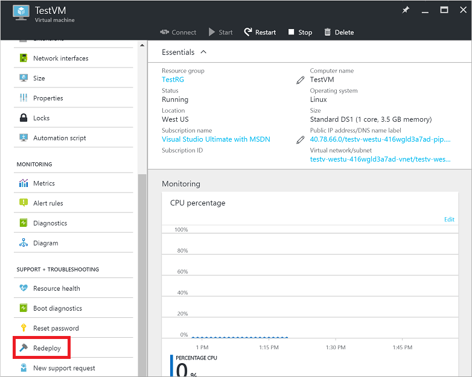

<properties
    pageTitle="Behandeln von Problemen mit SSH Verbindungsprobleme auf einen virtuellen | Microsoft Azure"
    description="Behandlung von Problemen wie ' SSH fehlgeschlagen ' oder 'SSH-Verbindung abgelehnt' für eine Azure virtuellen Computer mit Linux."
    keywords="SSH Verbindung zurückgewiesen, ssh zurück, Azure ssh, SSH Fehler bei der Verbindung"
    services="virtual-machines-linux"
    documentationCenter=""
    authors="iainfoulds"
    manager="timlt"
    editor=""
    tags="top-support-issue,azure-service-management,azure-resource-manager"/>

<tags
    ms.service="virtual-machines-linux"
    ms.workload="infrastructure-services"
    ms.tgt_pltfrm="vm-linux"
    ms.devlang="na"
    ms.topic="article"
    ms.date="09/27/2016"
    ms.author="iainfou"/>

# <a name="troubleshoot-ssh-connections-to-an-azure-linux-vm-that-fails-errors-out-or-is-refused"></a>Behandeln von Problemen mit SSH Verbindungen mit einer Azure Linux virtueller Computer, die fehlschlägt, Fehlern Prozentzahlen oder abgelehnt wird
Es gibt verschiedene Gründe, Secure Shell (SSH) Fehler, SSH Verbindungsfehlern auftreten, oder SSH zurückgewiesen wird, bei dem Versuch, eine Verbindung mit einer Linux virtuellen Computern (virtueller Computer). In diesem Artikel können Sie suchen und Beheben der Probleme. Sie können im Azure-Portal Azure CLI oder Access-Erweiterung für Linux virtueller Computer suchen und Beheben von Verbindungsproblemen verwenden.

[AZURE.INCLUDE [learn-about-deployment-models](../../includes/learn-about-deployment-models-both-include.md)]

Wenn Sie an einer beliebigen Stelle in diesem Artikel weitere Hilfe benötigen, können Sie die Azure-Experten auf [der MSDN-Azure und Stapelüberlauf Foren](http://azure.microsoft.com/support/forums/)kontaktieren. Alternativ können Sie einen Supportvorfall Azure ablegen. Wechseln Sie zu der [Azure support-Website](http://azure.microsoft.com/support/options/) , und wählen Sie die **Unterstützung**. Informationen zur Verwendung von Azure unterstützen finden Sie im [Microsoft Azure häufig gestellte Fragen zu unterstützen](http://azure.microsoft.com/support/faq/).


## <a name="quick-troubleshooting-steps"></a>QuickSteps zur Problembehandlung
Versuchen Sie nach jedem Schritt zur Problembehandlung Wiederherstellen der Verbindung mit dem virtuellen Computer ein.

1. Setzen Sie die SSH-Konfiguration.
2. Zurücksetzen der Anmeldeinformationen für den Benutzer.
3. Stellen Sie sicher, dass die [Netzwerk-Sicherheitsgruppe](../virtual-network/virtual-networks-nsg.md) Regeln SSH Datenverkehr werden kann.
    - Stellen Sie sicher, dass eine Sicherheitsgruppe Netzwerk Regel vorhanden ist, um SSH Datenverkehr (standardmäßig TCP-22) werden kann.
    - Können keine Umleitung Port / zuordnen, ohne eine Azure Lastenausgleich verwenden.
4. Aktivieren Sie die [virtuellen Computer Ressourcen Dienststatus](../resource-health/resource-health-overview.md). 
    - Stellen Sie sicher, dass der virtuellen Computer als fehlerfrei Berichte.
    - Wenn Sie Boot Diagnose aktiviert haben, stellen Sie sicher, dass der virtuellen Computer nicht Boot Fehler in die Protokolle der Bericht erstellt wird.
5. Starten Sie den virtuellen Computer neu.
6. Stellen Sie den virtuellen Computer erneut bereit.

Ausführlichere Schritte zur Problembehandlung und erläuterungen lesen Sie weiter.


## <a name="available-methods-to-troubleshoot-ssh-connection-issues"></a>Methoden zum Behandeln von Verbindungsproblemen SSH verfügbar sind

Sie können die Anmeldeinformationen oder SSH-Konfiguration mithilfe einer der folgenden Methoden zurücksetzen:

- [Azure-Portal](#using-the-azure-portal) – hervorragend, wenn Sie schnell Zurücksetzen von SSH-Konfiguration oder SSH-Taste, und Sie müssen haben nicht die Azure Tools installiert.
- [Azure CLI-Befehle](#using-the-azure-cli) – zurücksetzen Wenn Sie bereits in der Befehlszeile sind schnell die SSH-Konfiguration oder Anmeldeinformationen.
- [Azure VMAccessForLinux Erweiterung](#using-the-vmaccess-extension) - erstellen und Wiederverwenden von Json Definitionsdateien, um die SSH-Konfiguration oder Anmeldeinformationen zurücksetzen.

Versuchen Sie nach jedem Schritt zur Problembehandlung Herstellen einer Verbindung mit Ihrem virtuellen Computer erneut aus. Wenn Sie noch keine Verbindung herstellen können, versuchen Sie es im nächsten Schritt.


## <a name="using-the-azure-portal"></a>Verwenden des Azure-Portals
Azure-Portal stellt eine schnelle Möglichkeit, die SSH-Konfiguration oder Anmeldeinformationen zurücksetzen, ohne alle Tools, die auf Ihrem lokalen Computer installieren.

Wählen Sie Ihre virtuellen Computer im Azure-Portal an. Führen Sie einen Bildlauf nach unten bis zum Abschnitt **Support + Problembehandlung** , und wählen Sie **Kennwort zurücksetzen** , wie im folgenden Beispiel gezeigt:



### <a name="reset-the-ssh-configuration"></a>Setzen Sie die SSH-Konfiguration
Wählen Sie als ersten Schritt, `Reset SSH configuration only` aus dem Dropdownmenü **Modus** wie in dem vorhergehenden Screenshot klicken Sie dann auf die Schaltfläche **Zurücksetzen** . Wenn diese Aktion abgeschlossen ist, versuchen Sie, auf Ihre virtuellen Computer erneut zuzugreifen.

### <a name="reset-ssh-credentials-for-a-user"></a>Zurücksetzen SSH Anmeldeinformationen für einen Benutzer
Wenn Sie die Anmeldeinformationen eines vorhandenen Benutzers zurücksetzen möchten, wählen Sie entweder `Reset SSH public key` oder `Reset password` aus **dem Dropdown-Menü wie in dem vorhergehenden Screenshot** . Geben Sie den Benutzernamen und eine SSH-Taste oder neue Kennwort ein, und klicken Sie auf die Schaltfläche **Zurücksetzen** .

Sie können auch einen Benutzer mit Sudo Berechtigungen des virtuellen Computers aus diesem Menü erstellen. Geben Sie einen neuen Benutzernamen und entsprechende Kennwort oder SSH-Taste, und klicken Sie dann auf die Schaltfläche **Zurücksetzen** .


## <a name="using-the-azure-cli"></a>Verwendung der Azure CLI
Wenn Sie nicht bereits geschehen, [installieren die Azure CLI und Herstellen einer Verbindung Ihres Abonnements Azure mit](../xplat-cli-install.md). Stellen Sie sicher, dass Sie die Ressourcenmanager Modus wie folgt verwenden:

```
azure config mode arm
```

Wenn Sie erstellt und hochgeladen wird ein benutzerdefiniertes Bild für Linux Datenträger, vergewissern Sie sich [Microsoft Azure Linux Agent](virtual-machines-linux-agent-user-guide.md) Version 2.0.5 oder höher installiert ist. Für virtuelle Computer erstellt Gallery-Bilder diese Access-Erweiterung bereits installiert und konfiguriert für Sie.

### <a name="reset-ssh-configuration"></a>SSH-Konfiguration zurücksetzen
Die SSHD-Konfiguration selbst fehlerhaft oder der Dienst ist ein Fehler aufgetreten. Sie können zurücksetzen SSHD, um sicherzustellen, dass die SSH-Konfiguration selbst gültig ist. Durch das Zurücksetzen SSHD sollte der erste Schritt zur Problembehandlung, die, den Sie ergreifen.

Im folgende Beispiel werden zurückgesetzt SSHD auf einen virtuellen Computer mit dem Namen `myVM` in der Ressourcengruppe mit dem Namen `myResourceGroup`. Verwenden Sie Ihrer eigenen Gruppennamen virtueller Computer und Ressourcen wie folgt aus:

```bash
azure vm reset-access --resource-group myResourceGroup --name myVM \
    --reset-ssh
```

### <a name="reset-ssh-credentials-for-a-user"></a>Zurücksetzen SSH Anmeldeinformationen für einen Benutzer
Wenn SSHD positioniert ordnungsgemäß funktioniert, können Sie das Kennwort für einen Benutzer Schenkenden zurücksetzen. Im folgende Beispiel werden zurückgesetzt, die Anmeldeinformationen für `myUsername` auf den angegebenen Wert `myPassword`, des virtuellen Computers mit dem Namen `myVM` in `myResourceGroup`. Verwenden Sie Ihre eigenen Werte wie folgt ein:

```bash
azure vm reset-access --resource-group myResourceGroup --name myVM \
     --username myUsername --password myPassword
```

Wenn SSH Key-Authentifizierung verwenden, können Sie die Taste SSH für einen bestimmten Benutzer zurücksetzen. Im folgenden Beispiel wird so aktualisiert, dass die SSH-Taste gehörende Kehrmatrix `~/.ssh/azure_id_rsa.pub` für den Benutzer mit dem Namen `myUsername`, des virtuellen Computers mit dem Namen `myVM` in `myResourceGroup`. Verwenden Sie Ihre eigenen Werte wie folgt ein:

```bash
azure vm reset-access --resource-group myResourceGroup --name myVM \
    --username myUsername --ssh-key-file ~/.ssh/azure_id_rsa.pub
```


## <a name="using-the-vmaccess-extension"></a>Verwenden die Erweiterung VMAccess
Die virtuellen Computer Access-Erweiterung für Linux liest in einer Json-Datei, die Aktionen für die Durchführung definiert. Diese Aktionen umfassen SSHD zurücksetzen, durch das Zurücksetzen einer SSH-Taste oder Hinzufügen eines Benutzers. Die CLI Azure weiterhin verwenden, um die Erweiterung VMAccess aufrufen, aber Sie können die Json-Dateien über mehrere virtuellen Computern wiederverwenden, falls gewünscht. Dieser Ansatz ermöglicht Ihnen, eine Sammlung von Json-Dateien erstellen, die dann für die angegebene Szenarien aufgerufen werden können.

### <a name="reset-sshd"></a>SSHD zurücksetzen
Erstellen Sie eine Datei mit dem Namen `PrivateConf.json` mit dem folgenden Inhalt:

```bash
{  
    "reset_ssh":"True"
}
```

Die CLI Azure Sie dann rufen Sie bei Verwendung der `VMAccessForLinux` Erweiterung zum Zurücksetzen der SSHD-Verbindungs durch Angabe Ihrer Json-Datei. Im folgende Beispiel werden zurückgesetzt SSHD des virtuellen Computers mit dem Namen `myVM` in `myResourceGroup`. Verwenden Sie Ihre eigenen Werte wie folgt ein:

```bash
azure vm extension set myResourceGroup myVM \
    VMAccessForLinux Microsoft.OSTCExtensions "1.2" \
    --private-config-path PrivateConf.json
```

### <a name="reset-ssh-credentials-for-a-user"></a>Zurücksetzen SSH Anmeldeinformationen für einen Benutzer
Wenn SSHD positioniert ordnungsgemäß funktioniert, können Sie die Anmeldeinformationen für einen Benutzer Schenkenden zurücksetzen. Zum Zurücksetzen des Kennworts für einen Benutzer, erstellen Sie eine Datei namens `PrivateConf.json`. Im folgende Beispiel werden zurückgesetzt, die Anmeldeinformationen für `myUsername` auf den angegebenen Wert `myPassword`. Geben Sie die folgenden Zeilen in Ihre `PrivateConf.json` ablegen, mit Ihren eigenen Werten:

```bash
{
    "username":"myUsername", "password":"myPassword"
}
```

Oder zum Zurücksetzen des SSH Schlüssels für einen Benutzer, erstellen Sie zuerst eine Datei namens `PrivateConf.json`. Im folgende Beispiel werden zurückgesetzt, die Anmeldeinformationen für `myUsername` auf den angegebenen Wert `myPassword`, des virtuellen Computers mit dem Namen `myVM` in `myResourceGroup`. Geben Sie die folgenden Zeilen in Ihre `PrivateConf.json` ablegen, mit Ihren eigenen Werten:

```bash
{
    "username":"myUsername", "ssh_key":"mySSHKey"
}
```

Verwenden Sie nach dem Erstellen der Json-Datei, die CLI Azure Nummer der `VMAccessForLinux` Erweiterung Ihrer Benutzeranmeldeinformationen SSH durch Angabe Ihrer Json-Datei zurücksetzen. Im folgende Beispiel werden zurückgesetzt Anmeldeinformationen des virtuellen Computers mit dem Namen `myVM` in `myResourceGroup`. Verwenden Sie Ihre eigenen Werte wie folgt ein:

```
azure vm extension set myResourceGroup myVM \
    VMAccessForLinux Microsoft.OSTCExtensions "1.2" \
    --private-config-path PrivateConf.json
```


## <a name="restart-a-vm"></a>Starten eines virtuellen Computers
Wenn Sie die SSH-Konfiguration und Benutzeranmeldeinformationen zurücksetzen oder Fehler auf diese Weise haben, können Sie versuchen, einen Neustart von den virtuellen Computer an Adresse zugrunde liegenden Probleme berechnen.

### <a name="azure-portal"></a>Azure-portal
Um einen virtuellen Computer mit dem Azure-Portal neu zu starten, wählen Sie Ihre virtuellen Computer aus, und klicken Sie auf der * Schaltfläche**neu starten** , wie im folgenden Beispiel gezeigt:



### <a name="azure-cli"></a>Azure CLI
Im folgende Beispiel startet den virtuellen Computer mit dem Namen `myVM` in der Ressourcengruppe mit dem Namen `myResourceGroup`. Verwenden Sie Ihre eigenen Werte wie folgt ein:

```bash
azure vm restart --resource-group myResourceGroup --name myVM
```


## <a name="redeploy-a-vm"></a>Erneutes Bereitstellen eines virtuellen Computers
Sie können ein virtuellen Computers zu einem anderen Knoten in Azure erneut bereitstellen, die zugrunde liegenden Netzwerke Probleme behoben werden können. Informationen zu erneutes Bereitstellen eines virtuellen Computers finden Sie unter [erneut virtuellen Computers zu neuen Azure Knoten bereitstellen](virtual-machines-windows-redeploy-to-new-node.md).

> [AZURE.NOTE] Wenn dieser Vorgang abgeschlossen ist, temporärer Datenträgerdaten gehen verloren, und dynamische IP-Adressen, die den virtuellen Computern zugeordnet sind aktualisiert.

### <a name="azure-portal"></a>Azure-portal
Um einen virtuellen Computer mit dem Azure-Portal erneut bereitstellen möchten, wählen Sie Ihre virtuellen Computer, und führen Sie einen Bildlauf nach unten bis zum Abschnitt **Support + Problembehandlung** aus. Klicken Sie auf die Schaltfläche **erneut bereitstellen** , wie im folgenden Beispiel gezeigt:



### <a name="azure-cli"></a>Azure CLI
Im folgende Beispiel stellt erneut bereit, den virtuellen Computer mit dem Namen `myVM` in der Ressourcengruppe mit dem Namen `myResourceGroup`. Verwenden Sie Ihre eigenen Werte wie folgt ein:

```bash
azure vm redeploy --resource-group myResourceGroup --name myVM
```

## <a name="vms-created-by-using-the-classic-deployment-model"></a>Virtuelle Computer mit dem Modell zur Bereitstellung von klassischen erstellt

Versuchen Sie folgendermaßen vor, um die am häufigsten verwendeten Verbindung SSH Fehlern für virtuelle Computer zu beheben, die mit dem Bereitstellungsmodell klassischen erstellt wurden. Versuchen Sie nach jedem Schritt Wiederherstellen der Verbindung mit dem virtuellen Computer ein.

- Zurücksetzen Sie RAS vom [Azure-Portal](https://portal.azure.com)an. Klicken Sie im Portal Azure wählen Sie Ihre virtuellen Computer aus, und klicken Sie auf die Schaltfläche **Remote zurücksetzen...** aus.

- Starten Sie den virtuellen Computer neu. Klicken Sie im [Portal Azure](https://portal.azure.com)wählen Sie Ihre virtuellen Computer aus, und klicken Sie auf die Schaltfläche **neu starten** .

    – ODER –

    Wählen Sie auf dem [Azure klassischen Portal](https://manage.windowsazure.com)- **virtuellen Computern** > **Instanzen** > **neu starten**.

- Stellen Sie den virtuellen Computer auf einen neuen Azure Knoten erneut bereit. Informationen darüber, wie einen virtueller Computer erneut bereitgestellt finden Sie unter [virtuellen Computers zu neuen Azure Knoten erneut](virtual-machines-windows-redeploy-to-new-node.md).

    Wenn dieser Vorgang abgeschlossen ist, temporärer Datenträgerdaten gehen verloren, und dynamische IP-Adressen, die den virtuellen Computern zugeordnet sind aktualisiert.

- Führen Sie die Schritte [zum Zurücksetzen eines Kennworts oder SSH für Linux-basierten virtuellen Computern](virtual-machines-linux-classic-reset-access.md) aus:
    - Setzen Sie das Kennwort oder die SSH-Taste.
    - Erstellen eines Benutzerkontos _Sudo_ .
    - Setzen Sie die SSH-Konfiguration.

- Aktivieren des virtuellen Computers Ressource Gesundheit für Plattformprobleme an.<br>
  Wählen Sie Ihre virtuellen Computer, und führen Sie einen Bildlauf nach unten **Einstellungen** > **Gesundheit überprüfen**.


## <a name="additional-resources"></a>Zusätzliche Ressourcen

- Wenn Sie immer noch nicht SSH zu Ihrem virtuellen Computer sind nach nach vor, finden Sie unter [ausführlichere Schritte zur Problembehandlung](virtual-machines-linux-detailed-troubleshoot-ssh-connection.md) zu überprüfenden zusätzliche Schritte aus, um das Problem zu beheben.

- Weitere Informationen zur Problembehandlung bei Anwendung Access finden Sie unter [Behandeln von Zugriff auf eine Anwendung, die auf einer Azure-virtuellen Computern ausgeführt](virtual-machines-linux-troubleshoot-app-connection.md)

- Weitere Informationen zur Problembehandlung bei virtuellen Computern, die mit dem Bereitstellungsmodell klassischen erstellt wurden, finden Sie unter [Zurücksetzen eines Kennworts oder SSH für Linux-basierten virtuellen Maschinen](virtual-machines-linux-classic-reset-access.md).
