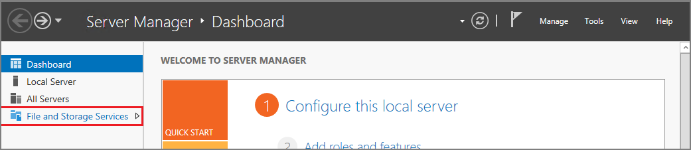

<properties
    pageTitle="Fügen Sie einen Datenträger in einen Windows-virtuellen | Microsoft Azure"
    description="Informationen zum neuen oder vorhandenen Daten Datenträger eines Windows virtuellen Computers im Bereitstellungsmodell Ressourcenmanager mit Azure-Portal installieren."
    services="virtual-machines-windows"
    documentationCenter=""
    authors="cynthn"
    manager="timlt"
    editor=""
    tags="azure-resource-manager"/>

<tags
    ms.service="virtual-machines-windows"
    ms.workload="infrastructure-services"
    ms.tgt_pltfrm="vm-windows"
    ms.devlang="na"
    ms.topic="article"
    ms.date="09/27/2016"
    ms.author="cynthn"/>

# So fügen Sie einen Datenträger in einen virtuellen Computer Windows Azure-portal

In diesem Artikel wird gezeigt, wie neue und vorhandene Datenträger an einem Windows-Computer über das Portal Azure angefügt. Sie können auch [einen Datenträger zu eines Linux virtuellen Computers Azure-Portal anfügen](virtual-machines-linux-attach-disk-portal.md). Bevor Sie dies tun, überprüfen Sie die folgenden Tipps:

- Die Größe des virtuellen Computers steuert, wie viele Datenlaufwerke können Sie anfügen. Weitere Informationen finden Sie unter [Größen für virtuelle Computer](virtual-machines-windows-sizes.md).
- Wenn Premium Speicher verwenden möchten, benötigen Sie eine DS- oder GS-Serie virtuellen Computern. Sie können Datenträger aus sowohl Premium und Standard-Speicher-Konten mit diesen virtuellen Computern verwenden. Premium-Speicher steht in bestimmte Regionen zur Verfügung. Details finden Sie unter [Premium Speicher: leistungsstarke Storage für Azure-virtuellen Computern Auslastung](../storage/storage-premium-storage.md).
- Mit virtuellen Computern verbundenen Datenträger sind tatsächlich VHD-Dateien in einem Azure-Speicherkonto an. Weitere Informationen finden Sie unter [Datenträger und virtueller Festplatten für virtuelle Computer](virtual-machines-windows-about-disks-vhds.md).
- Für einen neuen Datenträger brauchen Sie es zuerst erstellt werden, da Azure erstellt wird, wenn Sie sie anzufügen.
- Für einen vorhandenen Datenträger muss die VHD-Datei in einem Konto Azure-Speicher verfügbar sein. Können Sie eine VHD-Datei, die bereits ist es, wenn er nicht zu einer anderen virtuellen Computern oder Hochladen eigener VHD-Datei mit dem Speicherkonto angeschlossen ist.

[AZURE.INCLUDE [virtual-machines-common-attach-disk-portal](../../includes/virtual-machines-common-attach-disk-portal.md)]

## So: Initialisierung einen neuen Datenträger in Windows Server

1. Verbinden Sie mit des virtuellen Computers. Anweisungen finden Sie unter [Verbinden, und melden Sie sich bei einer Azure-virtuellen Computern Windows ausgeführt](virtual-machines-windows-connect-logon.md).

2. Öffnen Sie nach der Anmeldung des virtuellen Computers **Server-Manager**. Wählen Sie im linken Bereich **Datei- und Speicher zur Verfügung**.

    

3. Erweitern Sie das Menü, und wählen Sie die **Festplatten**.

4. Der **Datenträger** Abschnitt listet die Datenträger. In den meisten Fällen müssen diese Festplatten 0, 1 und Datenträger 2. Datenträger 0 ist das Betriebssystem Datenträger, Datenträger 1 ist der temporären Datenträger und Datenträger 2 ist der Datenträger, die, den Sie soeben an den virtuellen Computer angefügt. Die neuen Daten Datenträgers wird die Partition als **unbekannt**aufgeführt. Mit der rechten Maustaste in des Datenträgers, und wählen Sie die **Initialisierung**.

5.  Sie werden benachrichtigt, dass alle Daten gelöscht werden bei der Initialisierung des Datenträgers ist. Klicken Sie auf **Ja,** um zu bestätigen Sie die Warnung und Initialisierung den Datenträger. Sobald Sie fertig sind, wird die Partition als **GPT**aufgeführt sein. Mit der rechten Maustaste erneut auf des Datenträgers, und wählen Sie **Neues Volume**.

6.  Führen Sie den Assistenten unter Verwendung der Standardwerte. Wenn der Assistent fertig ist, Listen im Abschnitt **Datenmengen** das neue Volume aus. Der Datenträger ist jetzt online und bereit, um Daten zu speichern.

    

> [AZURE.NOTE] Die Größe der virtuellen Computer bestimmt, wie viele Datenträger, die Sie anfügen können. Weitere Informationen finden Sie unter [Größen für virtuelle Computer](virtual-machines-linux-sizes.md).

## Nächste Schritte

Wenn Sie Anwendung das Laufwerk D: zum Speichern von Daten verwenden muss, können Sie [den Laufwerkbuchstaben des Windows temporären Datenträgers ändern](virtual-machines-windows-classic-change-drive-letter.md).