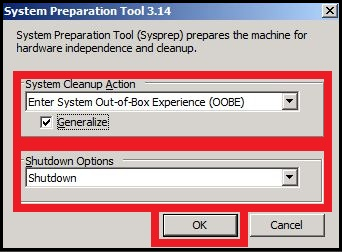
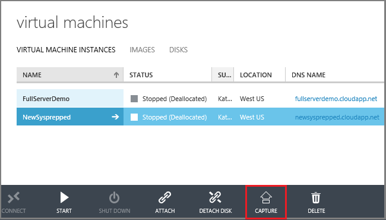
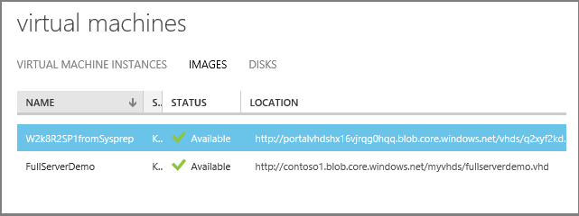

<properties
    pageTitle="Erstellen Sie ein Bild von einer Azure Windows virtueller Computer | Microsoft Azure"
    description="Erstellen Sie ein Bild von einer Windows Azure-virtuellen Computern mit dem Bereitstellungsmodell klassischen erstellt."
    services="virtual-machines-windows"
    documentationCenter=""
    authors="cynthn"
    manager="timlt"
    editor="tysonn"
    tags="azure-service-management"/>

<tags
    ms.service="virtual-machines-windows"
    ms.workload="infrastructure-services"
    ms.tgt_pltfrm="vm-windows"
    ms.devlang="na"
    ms.topic="article"
    ms.date="09/27/2016"
    ms.author="cynthn"/>

#Erstellen Sie ein Bild von einer Windows Azure-virtuellen Computern mit dem Bereitstellungsmodell klassischen erstellt.

[AZURE.INCLUDE [learn-about-deployment-models](../../includes/learn-about-deployment-models-classic-include.md)]Ressourcenmanager Modellinformationen finden Sie unter [Erstellen einer Kopie virtueller Windows-Computer in Azure ausgeführt](virtual-machines-windows-vhd-copy.md).

In diesem Artikel werden zum Erfassen eines Azure-virtuellen Computern unter Windows, sodass Sie diese zum Erstellen von anderen virtuellen Computern als Bild verwenden können. Diese Abbildung enthält der Datenträger Betriebssystem und alle Datenlaufwerke, die des virtuellen Computers zugeordnet sind. Diese aufnehmen nicht Netzwerkkonfiguration, daher müssen Sie die konfigurieren, wenn Sie den anderen virtuellen Computern erstellen, die das Bild zu verwenden.

Azure speichert das Bild, klicken Sie unter **Meine Bilder**. Dies ist der Objektmitte keine Bilder, die Sie hochgeladen haben gespeichert sind. Weitere Informationen zu Bildern finden Sie unter [Bilder für virtuellen Computern](virtual-machines-linux-classic-about-images.md).

##Vorbemerkung##

Diesen Schritten wird vorausgesetzt, dass Sie bereits eine Azure-virtuellen Computern erstellt und das Betriebssystem konfiguriert, einschließlich alle Daten Datenträger anfügen haben. Wenn Sie dies noch nicht getan, lesen Sie diese Anweisungen:

- [Erstellen eines virtuellen Computers von einem Bild](virtual-machines-windows-classic-createportal.md)
- [So fügen Sie einen Datenträger mit einem virtuellen Computer](virtual-machines-windows-classic-attach-disk.md)
- Stellen Sie sicher, dass die Serverrollen mit Sysprep unterstützt werden. Weitere Informationen finden Sie unter [Sysprep-Unterstützung für Serverrollen](https://msdn.microsoft.com/windows/hardware/commercialize/manufacture/desktop/sysprep-support-for-server-roles).

> [AZURE.WARNING] Dieses Verfahren löscht die ursprüngliche virtuelle Computer nach der Aufzeichnung ist. 

Bevor Sie ein Bild von einer Azure-virtuellen Computern Caputuring wird empfohlen, die Ziel-virtuellen Computern gesichert werden. Azure-virtuellen Computern können mit Azure Sicherung gesichert werden. Weitere Informationen finden Sie unter [Azure-virtuellen Computern sichern](../backup/backup-azure-vms.md). Andere Lösungen stehen zertifizierte Partner zur Verfügung. Um herauszufinden, was derzeit verfügbar ist, suchen Sie die Azure Marketplace.

##Erfassen des virtuellen Computers

1. Im [Azure klassischen Portal](http://manage.windowsazure.com) **Verbinden** mit dem virtuellen Computer. Anweisungen finden Sie unter [Anmelden bei einer virtuellen Computern unter Windows Server] [].

2.  Öffnen Sie ein Eingabeaufforderungsfenster als Administrator an.

3.  Wechseln Sie zu `%windir%\system32\sysprep`, und führen Sie dann auf sysprep.exe.

4.  Das **Tool zum Vorbereiten** -Dialogfeld wird angezeigt. Gehen Sie wie folgt vor:

    - Wählen Sie in **Systembereinigungsaktion** **System geben Out-of-Box-Experience (OOBE)** , und stellen Sie sicher, dass **verallgemeinern** aktiviert ist. Weitere Informationen zum Verwenden von finden Sie unter [wie Sysprep verwenden: ein Einführung][].

    - Wählen Sie **war(en)** **War(en) Optionen**aus.

    - Klicken Sie auf **OK**.

    

7.  Sysprep wird beendet der virtuellen Computern, die den Status des virtuellen Computers im klassischen Azure-Portal zu **beendet**ändert.

8.  Klicken Sie im Portal Azure klassischen auf **virtuellen Computern** , und wählen Sie die virtuellen Computern, die Sie erfassen möchten.

9.  Klicken Sie auf der Befehlsleiste auf **erfassen**.

    

    Das Dialogfeld **Erfassen des virtuellen Computers** angezeigt wird.

10. Geben Sie im Feld **Image Name**einen Namen für das neue Bild ein.

11. Bevor Sie ein Bild von Windows Server zu einer Gruppe von benutzerdefinierten Bilder hinzufügen, müssen sie durch Ausführen von Sysprep, wie in den vorherigen Schritten angewiesen GRG werden. Klicken Sie auf **ich Sysprep des virtuellen Computers ausgeführt haben** , um anzugeben, dass die Aktualisierung war.

12. Klicken Sie auf das Häkchen, um das Bild zu erfassen. Das neue Bild ist nun unter **Bilder**verfügbar.

    

##Nächste Schritte

Das Bild kann zum Erstellen von virtuellen Computern verwendet werden. Hierzu erstellen Sie einen virtuellen Computer mithilfe von das Menüelement **Aus Galerie** und durch auswählen das Bild, das Sie gerade erstellt haben. Anweisungen finden Sie unter [Erstellen eines virtuellen Computers von einem Bild](virtual-machines-windows-classic-createportal.md).

[Anmelden bei einer virtuellen Computern unter Windows Server]: virtual-machines-windows-classic-connect-logon.md
[Verwendung von Sysprep: eine Einführung]: http://technet.microsoft.com/library/bb457073.aspx
[Run Sysprep.exe]: ./media/virtual-machines-capture-image-windows-server/SysprepCommand.png
[Enter Sysprep.exe options]: ./media/virtual-machines-windows-classic-capture-image/SysprepGeneral.png
[The virtual machine is stopped]: ./media/virtual-machines-capture-image-windows-server/SysprepStopped.png
[Capture an image of the virtual machine]: ./media/virtual-machines-windows-classic-capture-image/CaptureVM.png
[Enter the image name]: ./media/virtual-machines-capture-image-windows-server/Capture.png
[Image capture successful]: ./media/virtual-machines-capture-image-windows-server/CaptureSuccess.png
[Use the captured image]: ./media/virtual-machines-capture-image-windows-server/MyImagesWindows.png
